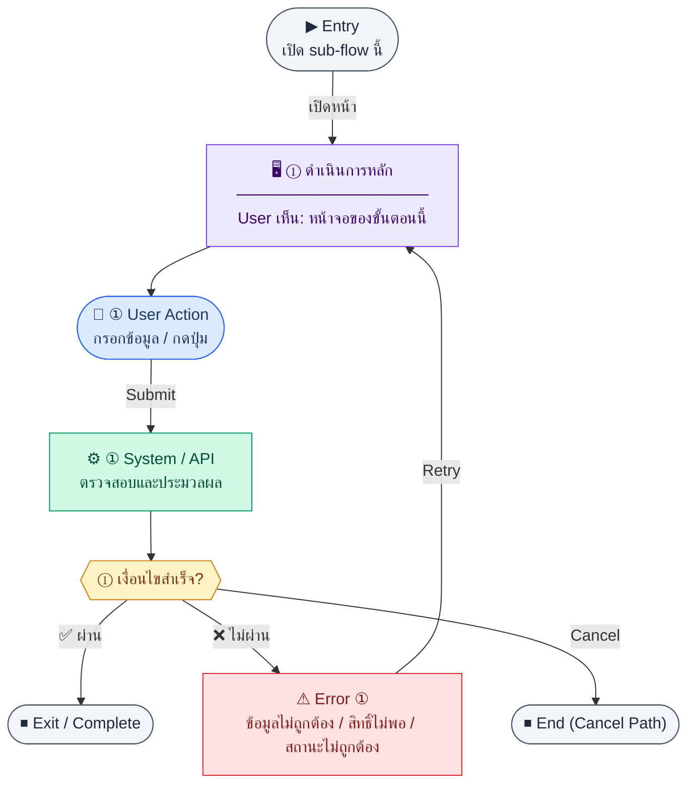

# VendorList

คู่มือแปลง UX → spec: [`../../UX_TO_UI_SPEC_WORKFLOW.md`](../../UX_TO_UI_SPEC_WORKFLOW.md)

**Route:** `/finance/vendors`

---

## Metadata

| Key | Value |
|-----|--------|
| **UX flow** | [`R1-07_Finance_Vendor_Management.md`](../../../UX_Flow/Functions/R1-07_Finance_Vendor_Management.md) |
| **UX sub-flow / steps** | สรุปใน Appendix — แตกตามหัวข้อ Sub-flow / Step ในเอกสาร UX |
| **Design system** | [`design-system.md`](../../design-system.md) — §3 Page layout, §5 forms, §6 DataTable ตามประเภทหน้า |
| **Global FE behaviors** | [`_GLOBAL_FRONTEND_BEHAVIORS.md`](../../../UX_Flow/_GLOBAL_FRONTEND_BEHAVIORS.md) |
| **Preview** | [`VendorList.preview.html`](./VendorList.preview.html) · [`../_Shared/preview-base.css`](../_Shared/preview-base.css) · [`MD_TO_PREVIEW_HTML_MANUAL.md`](../MD_TO_PREVIEW_HTML_MANUAL.md) |

---

## เป้าหมายหน้าจอ

ค้นหาและดูแล master vendor ทั้งหมดรวม inactive และ soft-deleted policy ตามที่ list แสดง

## ผู้ใช้และสิทธิ์

อ่าน Actor(s) และ permission gate ใน Appendix / เอกสาร UX — กรณี 401/403/409 อ้าง Global FE behaviors

## โครง layout (สรุป)

ระบุตามประเภทหน้าใน Appendix: list / detail / form / แท็บ — ใช้ pattern ใน design-system.md

## เนื้อหาและฟิลด์

สกัดจาก **User sees** / **User Action** / ช่องกรอกใน Appendix เป็นตารางฟิลด์เต็มเมื่อปรับแต่งรอบถัดไป; ขณะนี้ใช้บล็อก UX ด้านล่างเป็นข้อมูลอ้างอิงครบถ้วน

## การกระทำ (CTA)

สกัดจากปุ่มใน Appendix (`[...]`) และ Frontend behavior

## สถานะพิเศษ

Loading, empty, error, validation, dependency ขณะลบ — ตาม **Error** / **Success** ใน Appendix

## หมายเหตุ implementation (ถ้ามี)

เทียบ `erp_frontend` เมื่อทราบ path ของหน้า

## Preview HTML notes

| หัวข้อ | ใส่อะไร |
|--------|--------|
| **Shell** | โดยมาก `app` (ยกเว้นหน้า login / standalone) |
| **Regions** | ดูลำดับ **User sees** ใน Appendix |
| **สถานะสำหรับสลับใน preview** | `default` · `loading` · `empty` · `error` ตาม UX |
| **ข้อมูลจำลอง** | จำนวนแถว / สถานะ badge ตามประเภทหน้า |
| **ลิงก์ CSS** | [`../_Shared/preview-base.css`](../_Shared/preview-base.css) |

---

## Appendix — UX excerpt (reference)

## Sub-flow 2 — รายการ Vendor (`GET /api/finance/vendors`)

**Goal:** ค้นหาและดูแล master vendor ทั้งหมดรวม inactive และ soft-deleted policy ตามที่ list แสดง

**User sees:** ตาราง (code, name, taxId, เทอมชำระ, สถานะ active, วันที่อัปเดต), ช่องค้นหา, ตัวกรอง `isActive`, pagination

**User can do:** กรอง, เปลี่ยนหน้า, คลิกไปแก้ไข, เปิดสร้างใหม่, สลับ active จากแถว (ถ้ามี shortcut)

**Frontend behavior:**

- `GET /api/finance/vendors` พร้อม query BR: `page`, `limit`, `search` (code/name/taxId), `isActive`
- sync filter กับ URL query string เพื่อให้ share link ได้
- loading แบบ skeleton ครั้งแรก; stale-while-revalidate ตามนโยบายแอป

**System / AI behavior:** อ่าน `vendors` รองรับ soft delete (`deletedAt`) — การแสดงแถวที่ถูกลบแล้วเป็น product decision (ปกติซ่อนหรือแสดงในแท็บ “ถูกลบ”)

**Success:** ตารางสะท้อนข้อมูล server

**Error:** network/timeout → error row + ปุ่ม retry `GET /api/finance/vendors`

**Notes:** `GET /api/finance/vendors`

---

### Scenario Flow

### สัญลักษณ์ Node (Color Legend)

| สี | Node shape | หมายถึง |
|----|-----------|---------|
| 🟣 ม่วง | สี่เหลี่ยม `["…"]` | **Screen / UI State** |
| 🔵 น้ำเงิน | วงกลม `(["…"])` | **User Action** |
| 🟢 เขียว | สี่เหลี่ยม `["…"]` | **System / API** |
| 🟡 เหลือง | เพชร `{{"…"}}` | **Decision** |
| 🔴 แดง | สี่เหลี่ยม `["…"]` | **Error / Edge case** |
| ⚫ เทา | วงรี `(["…"])` | **Start / End** |

---

---

## หมายเหตุ implementation (erp_frontend / ของเดิม)

(erp_frontend / ของเดิม)

(erp_frontend / ของเดิม)

(erp_frontend / ของเดิม)

## 1) Permission

- Create → ลิงก์ primary ไป `/finance/vendors/new`
- Edit → ลิงก์ในแถว
- Activate/deactivate, delete → ปุ่มตามสิทธิ์ `finance:vendor:activate`, `finance:vendor:delete`

---

## 2) Layout

- Root: `space-y-6`
- `PageHeader` + ปุ่ม/ลิงก์สร้าง
- **แถบ filter:** `flex flex-wrap ... rounded-xl border bg-card p-4`
  - ค้นหา, สถานะ active (all/true/false), per-page (20/50/100)
- Error: แถบ destructive มาตรฐาน + `actionError` แยก
- `DataTable` — client-side sort บนปุ่ม header (code, name, isActive)
  - คอลัมน์: code, name, taxId, phone, email, `StatusBadge` active/inactive, actions (edit link, activate toggle + confirm, delete + confirm)
- Pagination: ข้อความ `vendor.pageOf` + Prev/Next (ข้อความ "Prev"/"Next" hard-code ในโค้ด)

---

## 3) Preview

[VendorList.preview.html](./VendorList.preview.html) · [`../_Shared/preview-base.css`](../_Shared/preview-base.css)
