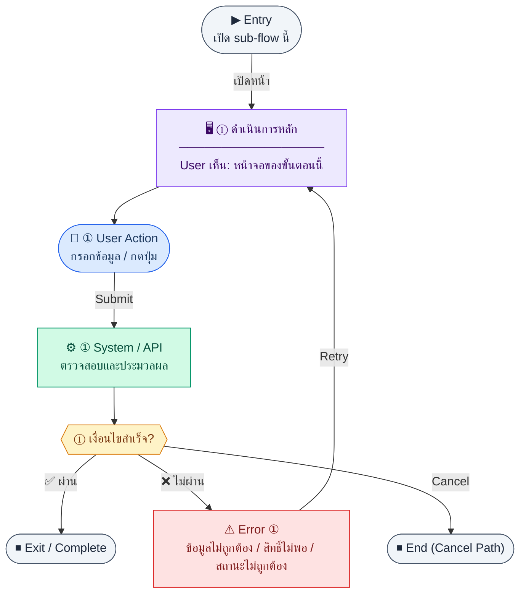

# ChartOfAccountsList

คู่มือแปลง UX → spec: [`../../UX_TO_UI_SPEC_WORKFLOW.md`](../../UX_TO_UI_SPEC_WORKFLOW.md)

**Route:** `/finance/accounts`

---

## Metadata

| Key | Value |
|-----|--------|
| **UX flow** | [`R1-09_Finance_Accounting_Core.md`](../../../UX_Flow/Functions/R1-09_Finance_Accounting_Core.md) |
| **UX sub-flow / steps** | สรุปใน Appendix — แตกตามหัวข้อ Sub-flow / Step ในเอกสาร UX |
| **Design system** | [`design-system.md`](../../design-system.md) — §3 Page layout, §5 forms, §6 DataTable ตามประเภทหน้า |
| **Global FE behaviors** | [`_GLOBAL_FRONTEND_BEHAVIORS.md`](../../../UX_Flow/_GLOBAL_FRONTEND_BEHAVIORS.md) |
| **Preview** | [`ChartOfAccountsList.preview.html`](./ChartOfAccountsList.preview.html) · [`../_Shared/preview-base.css`](../_Shared/preview-base.css) · [`MD_TO_PREVIEW_HTML_MANUAL.md`](../MD_TO_PREVIEW_HTML_MANUAL.md) |

---

## เป้าหมายหน้าจอ

ดูผังบัญชีทั้งหมดและกรองตามประเภท/สถานะการใช้งาน

## ผู้ใช้และสิทธิ์

อ่าน Actor(s) และ permission gate ใน Appendix / เอกสาร UX — กรณี 401/403/409 อ้าง Global FE behaviors

## โครง layout (สรุป)

ระบุตามประเภทหน้าใน Appendix: list / detail / form / แท็บ — ใช้ pattern ใน design-system.md

## เนื้อหาและฟิลด์

สกัดจาก **User sees** / **User Action** / ช่องกรอกใน Appendix เป็นตารางฟิลด์เต็มเมื่อปรับแต่งรอบถัดไป; ขณะนี้ใช้บล็อก UX ด้านล่างเป็นข้อมูลอ้างอิงครบถ้วน

## การกระทำ (CTA)

สกัดจากปุ่มใน Appendix (`[...]`) และ Frontend behavior

## สถานะพิเศษ

Loading, empty, error, validation, dependency ขณะลบ — ตาม **Error** / **Success** ใน Appendix

## หมายเหตุ implementation (ถ้ามี)

เทียบ `erp_frontend` เมื่อทราบ path ของหน้า

## Preview HTML notes

| หัวข้อ | ใส่อะไร |
|--------|--------|
| **Shell** | โดยมาก `app` (ยกเว้นหน้า login / standalone) |
| **Regions** | ดูลำดับ **User sees** ใน Appendix |
| **สถานะสำหรับสลับใน preview** | `default` · `loading` · `empty` · `error` ตาม UX |
| **ข้อมูลจำลอง** | จำนวนแถว / สถานะ badge ตามประเภทหน้า |
| **ลิงก์ CSS** | [`../_Shared/preview-base.css`](../_Shared/preview-base.css) |

---

## Appendix — UX excerpt (reference)

## Sub-flow A — ผังบัญชี: รายการ (`GET /api/finance/accounts`)

**Goal:** ดูผังบัญชีทั้งหมดและกรองตามประเภท/สถานะการใช้งาน

**User sees:** ตารางหรือ tree (code, name, type, isActive), ตัวกรอง `type`, `isActive`

**User can do:** กรอง, เปิดสร้าง/แก้ไข, สลับ active

**Frontend behavior:**

- `GET /api/finance/accounts` พร้อม query ตาม SD: `type`, `isActive`
- skeleton ระหว่างโหลด; เก็บ state กรองใน URL

**System / AI behavior:** อ่าน `chart_of_accounts`

**Success:** แสดงรายการครบ

**Error:** 401/403/5xx + retry

**Notes:** `GET /api/finance/accounts` — FE path BR: `/finance/accounts`

---

### Scenario Flow

### สัญลักษณ์ Node (Color Legend)

| สี | Node shape | หมายถึง |
|----|-----------|---------|
| 🟣 ม่วง | สี่เหลี่ยม `["…"]` | **Screen / UI State** |
| 🔵 น้ำเงิน | วงกลม `(["…"])` | **User Action** |
| 🟢 เขียว | สี่เหลี่ยม `["…"]` | **System / API** |
| 🟡 เหลือง | เพชร `{{"…"}}` | **Decision** |
| 🔴 แดง | สี่เหลี่ยม `["…"]` | **Error / Edge case** |
| ⚫ เทา | วงรี `(["…"])` | **Start / End** |

---

---

## Sub-flow B — ผังบัญชี: สร้าง (`POST /api/finance/accounts`)

**Goal:** เพิ่มบัญชีใหม่ใน CoA

**User sees:** modal หรือ drawer ฟอร์ม: code, name, type (asset | liability | equity | income | expense), parent (ถ้ามีใน product)

**User can do:** กรอกและบันทึก

**Frontend behavior:**

- validate code/name/type บังคับ; ตรวจรูปแบบ code ตามนโยบายบริษัท (client-side)
- `POST /api/finance/accounts` ตัวอย่าง body ตาม SD: `{ "code": "5100", "name": "Salary Expense", "type": "expense" }`

**System / AI behavior:** INSERT `chart_of_accounts`, enforce unique `code`

**Success:** 201 → refresh list

**Error:** 409 duplicate code; 400 validation

**Notes:** `POST /api/finance/accounts`

---

### Scenario Flow

### สัญลักษณ์ Node (Color Legend)

| สี | Node shape | หมายถึง |
|----|-----------|---------|
| 🟣 ม่วง | สี่เหลี่ยม `["…"]` | **Screen / UI State** |
| 🔵 น้ำเงิน | วงกลม `(["…"])` | **User Action** |
| 🟢 เขียว | สี่เหลี่ยม `["…"]` | **System / API** |
| 🟡 เหลือง | เพชร `{{"…"}}` | **Decision** |
| 🔴 แดง | สี่เหลี่ยม `["…"]` | **Error / Edge case** |
| ⚫ เทา | วงรี `(["…"])` | **Start / End** |

---

---

## Sub-flow C — ผังบัญชี: แก้ไข (`PATCH /api/finance/accounts/:id`)

**Goal:** แก้ไขชื่อหรือ metadata ของบัญชี (ไม่สับสนกับสลับ active)

**User sees:** ฟอร์มแก้ไขบนบัญชีที่เลือก

**User can do:** แก้ไขและบันทึก

**Frontend behavior:** `PATCH /api/finance/accounts/:id` partial fields เช่น `{ "name": "Salary Expense - Updated" }`

**System / AI behavior:** UPDATE แถวที่ระบุ

**Success:** 200

**Error:** 404/400

**Notes:** `PATCH /api/finance/accounts/:id`

---

### Scenario Flow

### สัญลักษณ์ Node (Color Legend)

| สี | Node shape | หมายถึง |
|----|-----------|---------|
| 🟣 ม่วง | สี่เหลี่ยม `["…"]` | **Screen / UI State** |
| 🔵 น้ำเงิน | วงกลม `(["…"])` | **User Action** |
| 🟢 เขียว | สี่เหลี่ยม `["…"]` | **System / API** |
| 🟡 เหลือง | เพชร `{{"…"}}` | **Decision** |
| 🔴 แดง | สี่เหลี่ยม `["…"]` | **Error / Edge case** |
| ⚫ เทา | วงรี `(["…"])` | **Start / End** |

---

---

## Sub-flow D — ผังบัญชี: เปิด/ปิดใช้งาน (`PATCH /api/finance/accounts/:id/activate`)

**Goal:** ปิดบัญชีที่ไม่ต้องการให้เลือกใน journal โดยไม่ลบประวัติ

**User sees:** toggle isActive

**User can do:** สลับสถานะ

**Frontend behavior:** `PATCH /api/finance/accounts/:id/activate` body ตาม SD `{ "isActive": false }`

**System / AI behavior:** อัปเดต `isActive`

**Success:** 200

**Error:** 400 ถ้าไม่อนุญาตปิด (เช่น มี journal posted ผูก — แล้วแต่ BE)

**Notes:** `PATCH /api/finance/accounts/:id/activate`

---

### Scenario Flow

### สัญลักษณ์ Node (Color Legend)

| สี | Node shape | หมายถึง |
|----|-----------|---------|
| 🟣 ม่วง | สี่เหลี่ยม `["…"]` | **Screen / UI State** |
| 🔵 น้ำเงิน | วงกลม `(["…"])` | **User Action** |
| 🟢 เขียว | สี่เหลี่ยม `["…"]` | **System / API** |
| 🟡 เหลือง | เพชร `{{"…"}}` | **Decision** |
| 🔴 แดง | สี่เหลี่ยม `["…"]` | **Error / Edge case** |
| ⚫ เทา | วงรี `(["…"])` | **Start / End** |

---
