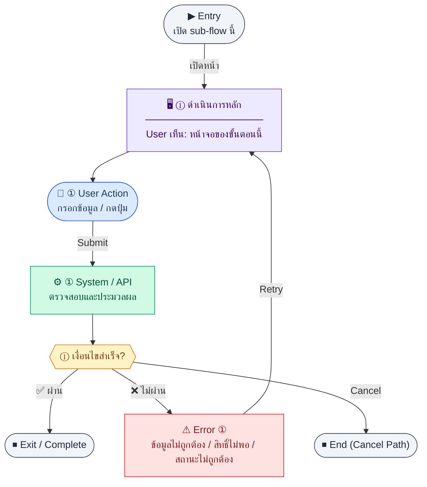

# IncomeExpenseLedger

คู่มือแปลง UX → spec: [`../../UX_TO_UI_SPEC_WORKFLOW.md`](../../UX_TO_UI_SPEC_WORKFLOW.md)

**Route:** `/finance/income-expense`

---

## Metadata

| Key | Value |
|-----|--------|
| **UX flow** | [`R1-09_Finance_Accounting_Core.md`](../../../UX_Flow/Functions/R1-09_Finance_Accounting_Core.md) |
| **UX sub-flow / steps** | สรุปใน Appendix — แตกตามหัวข้อ Sub-flow / Step ในเอกสาร UX |
| **Design system** | [`design-system.md`](../../design-system.md) — §3 Page layout, §5 forms, §6 DataTable ตามประเภทหน้า |
| **Global FE behaviors** | [`_GLOBAL_FRONTEND_BEHAVIORS.md`](../../../UX_Flow/_GLOBAL_FRONTEND_BEHAVIORS.md) |
| **Preview** | [`IncomeExpenseLedger.preview.html`](./IncomeExpenseLedger.preview.html) · [`../_Shared/preview-base.css`](../_Shared/preview-base.css) · [`MD_TO_PREVIEW_HTML_MANUAL.md`](../MD_TO_PREVIEW_HTML_MANUAL.md) |

---

## เป้าหมายหน้าจอ

ดูภาพรวมรายรับรายจ่ายตามช่วงเวลา (monthly summary ตาม BR)

## ผู้ใช้และสิทธิ์

อ่าน Actor(s) และ permission gate ใน Appendix / เอกสาร UX — กรณี 401/403/409 อ้าง Global FE behaviors

## โครง layout (สรุป)

ระบุตามประเภทหน้าใน Appendix: list / detail / form / แท็บ — ใช้ pattern ใน design-system.md

## เนื้อหาและฟิลด์

สกัดจาก **User sees** / **User Action** / ช่องกรอกใน Appendix เป็นตารางฟิลด์เต็มเมื่อปรับแต่งรอบถัดไป; ขณะนี้ใช้บล็อก UX ด้านล่างเป็นข้อมูลอ้างอิงครบถ้วน

## การกระทำ (CTA)

สกัดจากปุ่มใน Appendix (`[...]`) และ Frontend behavior

## สถานะพิเศษ

Loading, empty, error, validation, dependency ขณะลบ — ตาม **Error** / **Success** ใน Appendix

## หมายเหตุ implementation (ถ้ามี)

เทียบ `erp_frontend` เมื่อทราบ path ของหน้า

## Preview HTML notes

| หัวข้อ | ใส่อะไร |
|--------|--------|
| **Shell** | โดยมาก `app` (ยกเว้นหน้า login / standalone) |
| **Regions** | ดูลำดับ **User sees** ใน Appendix |
| **สถานะสำหรับสลับใน preview** | `default` · `loading` · `empty` · `error` ตาม UX |
| **ข้อมูลจำลอง** | จำนวนแถว / สถานะ badge ตามประเภทหน้า |
| **ลิงก์ CSS** | [`../_Shared/preview-base.css`](../_Shared/preview-base.css) |

---

## Appendix — UX excerpt (reference)

## Sub-flow J — Income/Expense: สรุป (`GET /api/finance/income-expense/summary`)

**Goal:** ดูภาพรวมรายรับรายจ่ายตามช่วงเวลา (monthly summary ตาม BR)

**User sees:** การ์ดสรุปหรือกราฟย่อบนหน้า `/finance/income-expense`

**User can do:** เลือกช่วง `periodFrom`, `periodTo` (YYYY-MM ตาม BR pattern ของรายงาน)

**Frontend behavior:** `GET /api/finance/income-expense/summary?periodFrom=...&periodTo=...`

**System / AI behavior:** aggregate `income_expense_entries`

**Success:** การ์ดแสดงตัวเลขสอดคล้อง API

**Error:** invalid range 400; retry 5xx

**Notes:** `GET /api/finance/income-expense/summary`

---

### Scenario Flow

### สัญลักษณ์ Node (Color Legend)

| สี | Node shape | หมายถึง |
|----|-----------|---------|
| 🟣 ม่วง | สี่เหลี่ยม `["…"]` | **Screen / UI State** |
| 🔵 น้ำเงิน | วงกลม `(["…"])` | **User Action** |
| 🟢 เขียว | สี่เหลี่ยม `["…"]` | **System / API** |
| 🟡 เหลือง | เพชร `{{"…"}}` | **Decision** |
| 🔴 แดง | สี่เหลี่ยม `["…"]` | **Error / Edge case** |
| ⚫ เทา | วงรี `(["…"])` | **Start / End** |

---

---

## Sub-flow K — Income/Expense: รายการ (`GET /api/finance/income-expense/entries`)

**Goal:** ดู ledger รายรับรายจ่ายแบบรายการพร้อมกรอง

**User sees:** ตาราง entries, ตัวกรอง `type`, `categoryId`, pagination

**User can do:** กรอง, เปิดสร้างรายการ manual

**Frontend behavior:** `GET /api/finance/income-expense/entries` query: `page`, `limit`, `type`, `categoryId`

**System / AI behavior:** SELECT entries

**Success:** ตาราง sync

**Error:** fetch fail + retry

**Notes:** `GET /api/finance/income-expense/entries`

---

### Scenario Flow

### สัญลักษณ์ Node (Color Legend)

| สี | Node shape | หมายถึง |
|----|-----------|---------|
| 🟣 ม่วง | สี่เหลี่ยม `["…"]` | **Screen / UI State** |
| 🔵 น้ำเงิน | วงกลม `(["…"])` | **User Action** |
| 🟢 เขียว | สี่เหลี่ยม `["…"]` | **System / API** |
| 🟡 เหลือง | เพชร `{{"…"}}` | **Decision** |
| 🔴 แดง | สี่เหลี่ยม `["…"]` | **Error / Edge case** |
| ⚫ เทา | วงรี `(["…"])` | **Start / End** |

---

---

## Sub-flow L — Income/Expense: สร้างรายการ manual (`POST /api/finance/income-expense/entries`)

**Goal:** บันทึกรายรับ/จ่ายที่ไม่ได้มาจาก integration

**User sees:** `/finance/income-expense/new` — category, date, amount, side (debit|credit), description

**User can do:** กรอกและบันทึก

**Frontend behavior:**

- โหลดรายการ categories ที่ใช้งานได้ (แหล่งข้อมูลอาจมาจาก seed หรือ endpoint อื่นในระบบจริง — ไม่อยู่ใน accounting_core inventory; ระบุใน Notes)
- `POST /api/finance/income-expense/entries` ตัวอย่าง SD: `{ "categoryId": "cat_001", "date": "2026-04-25", "amount": 1500, "side": "debit" }`

**System / AI behavior:** INSERT `income_expense_entries`

**Success:** 201

**Error:** 400 validation

**Notes:** `POST /api/finance/income-expense/entries`

---

### Scenario Flow

### สัญลักษณ์ Node (Color Legend)

| สี | Node shape | หมายถึง |
|----|-----------|---------|
| 🟣 ม่วง | สี่เหลี่ยม `["…"]` | **Screen / UI State** |
| 🔵 น้ำเงิน | วงกลม `(["…"])` | **User Action** |
| 🟢 เขียว | สี่เหลี่ยม `["…"]` | **System / API** |
| 🟡 เหลือง | เพชร `{{"…"}}` | **Decision** |
| 🔴 แดง | สี่เหลี่ยม `["…"]` | **Error / Edge case** |
| ⚫ เทา | วงรี `(["…"])` | **Start / End** |

---
