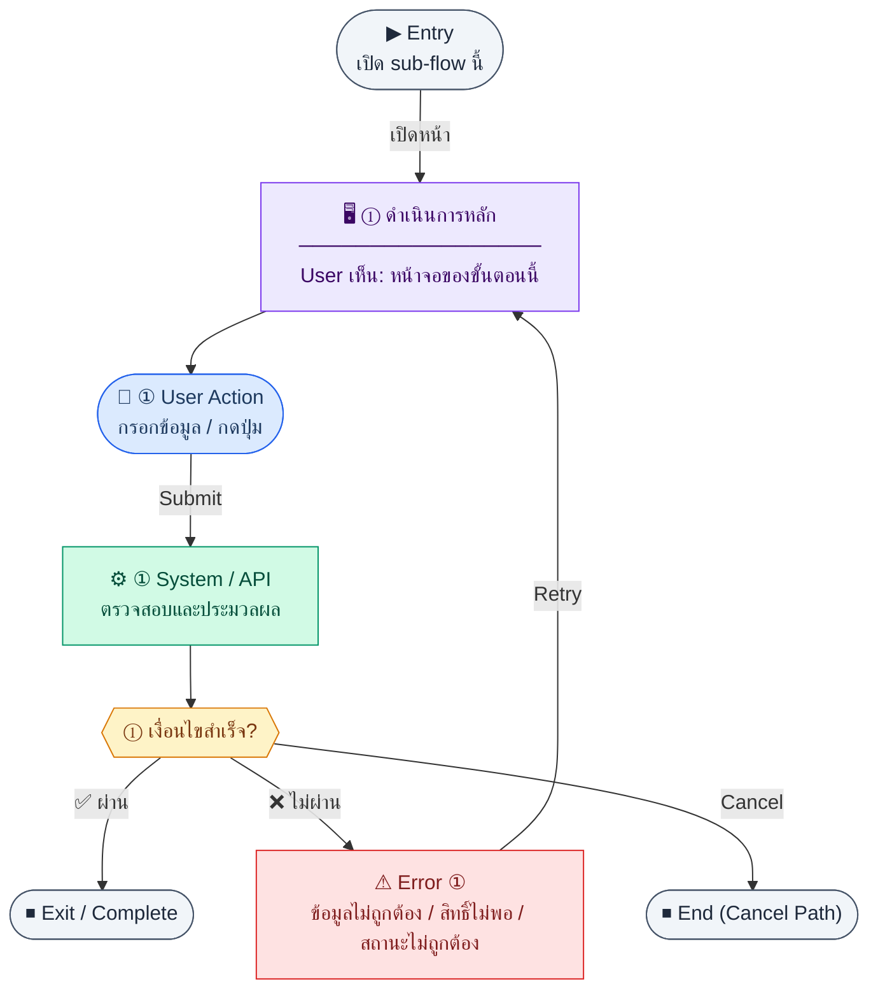

# JournalEditor

คู่มือแปลง UX → spec: [`../../UX_TO_UI_SPEC_WORKFLOW.md`](../../UX_TO_UI_SPEC_WORKFLOW.md)

**Route:** `/finance/journal/new · /finance/journal/:id`

---

## Metadata

| Key | Value |
|-----|--------|
| **UX flow** | [`R1-09_Finance_Accounting_Core.md`](../../../UX_Flow/Functions/R1-09_Finance_Accounting_Core.md) |
| **UX sub-flow / steps** | สรุปใน Appendix — แตกตามหัวข้อ Sub-flow / Step ในเอกสาร UX |
| **Design system** | [`design-system.md`](../../design-system.md) — §3 Page layout, §5 forms, §6 DataTable ตามประเภทหน้า |
| **Global FE behaviors** | [`_GLOBAL_FRONTEND_BEHAVIORS.md`](../../../UX_Flow/_GLOBAL_FRONTEND_BEHAVIORS.md) |
| **Preview** | [`JournalEditor.preview.html`](./JournalEditor.preview.html) · [`../_Shared/preview-base.css`](../_Shared/preview-base.css) · [`MD_TO_PREVIEW_HTML_MANUAL.md`](../MD_TO_PREVIEW_HTML_MANUAL.md) |

---

## เป้าหมายหน้าจอ

ตรวจสอบความสมดุล debit/credit และรายละเอียดก่อน post หรือ reverse

## ผู้ใช้และสิทธิ์

อ่าน Actor(s) และ permission gate ใน Appendix / เอกสาร UX — กรณี 401/403/409 อ้าง Global FE behaviors

## โครง layout (สรุป)

ระบุตามประเภทหน้าใน Appendix: list / detail / form / แท็บ — ใช้ pattern ใน design-system.md

## เนื้อหาและฟิลด์

สกัดจาก **User sees** / **User Action** / ช่องกรอกใน Appendix เป็นตารางฟิลด์เต็มเมื่อปรับแต่งรอบถัดไป; ขณะนี้ใช้บล็อก UX ด้านล่างเป็นข้อมูลอ้างอิงครบถ้วน

## การกระทำ (CTA)

สกัดจากปุ่มใน Appendix (`[...]`) และ Frontend behavior

## สถานะพิเศษ

Loading, empty, error, validation, dependency ขณะลบ — ตาม **Error** / **Success** ใน Appendix

## หมายเหตุ implementation (ถ้ามี)

เทียบ `erp_frontend` เมื่อทราบ path ของหน้า

## Preview HTML notes

| หัวข้อ | ใส่อะไร |
|--------|--------|
| **Shell** | โดยมาก `app` (ยกเว้นหน้า login / standalone) |
| **Regions** | ดูลำดับ **User sees** ใน Appendix |
| **สถานะสำหรับสลับใน preview** | `default` · `loading` · `empty` · `error` ตาม UX |
| **ข้อมูลจำลอง** | จำนวนแถว / สถานะ badge ตามประเภทหน้า |
| **ลิงก์ CSS** | [`../_Shared/preview-base.css`](../_Shared/preview-base.css) |

---

## Appendix — UX excerpt (reference)

## Sub-flow F — Journal: รายละเอียด + รายการบรรทัด (`GET /api/finance/journal-entries/:id`)

**Goal:** ตรวจสอบความสมดุล debit/credit และรายละเอียดก่อน post หรือ reverse

**User sees:** header + ตาราง lines (account, debit, credit, description), ลิงก์ไป source document (ถ้ามี sourceModule/sourceId)

**User can do:** อ่าน, กด post (ถ้า draft), กด reverse (ถ้า posted)

**Frontend behavior:**

- `GET /api/finance/journal-entries/:id`
- คำนวณผลรวม debit/credit ฝั่ง FE เพื่อแสดง warning ก่อนยิง post (ช่วย UX; ข้อยุติที่ server เป็นหลัก)

**System / AI behavior:** คืน entry + lines

**Success:** แสดงครบ

**Error:** 404/403

**Notes:** `GET /api/finance/journal-entries/:id`

---

### Scenario Flow

### สัญลักษณ์ Node (Color Legend)

| สี | Node shape | หมายถึง |
|----|-----------|---------|
| 🟣 ม่วง | สี่เหลี่ยม `["…"]` | **Screen / UI State** |
| 🔵 น้ำเงิน | วงกลม `(["…"])` | **User Action** |
| 🟢 เขียว | สี่เหลี่ยม `["…"]` | **System / API** |
| 🟡 เหลือง | เพชร `{{"…"}}` | **Decision** |
| 🔴 แดง | สี่เหลี่ยม `["…"]` | **Error / Edge case** |
| ⚫ เทา | วงรี `(["…"])` | **Start / End** |

---

---

## Sub-flow G — Journal: สร้าง draft (`POST /api/finance/journal-entries`)

**Goal:** บันทึกรายการบัญชีแบบ manual ในสถานะ draft

**User sees:** `/finance/journal/new` — ฟอร์มวันที่, คำอธิบาย, ตารางหลายบรรทัด (account, debit, credit, description)

**User can do:** เพิ่ม/ลบบรรทัด, กดบันทึก draft

**Frontend behavior:**

- validate แต่ละบรรทัด: debit หรือ credit อย่างใดอย่างหนึ่ง > 0 (ไม่ใส่ทั้งคู่ในบรรทัดเดียวตาม convention)
- validate รวม: `SUM(debit) === SUM(credit)` ก่อนอนุญาตกด Post (BR)
- `POST /api/finance/journal-entries` body ตาม SD: `{ "date": "2026-04-30", "description": "Month-end adjustment", "lines": [] }`
- หลัง 201 navigate ไป detail ของ id ใหม่

**System / AI behavior:** INSERT `journal_entries` + `journal_lines`, status `draft`

**Success:** 201 + id

**Error:** 400 unbalanced / invalid accountId

**Notes:** `POST /api/finance/journal-entries`

---

### Scenario Flow

### สัญลักษณ์ Node (Color Legend)

| สี | Node shape | หมายถึง |
|----|-----------|---------|
| 🟣 ม่วง | สี่เหลี่ยม `["…"]` | **Screen / UI State** |
| 🔵 น้ำเงิน | วงกลม `(["…"])` | **User Action** |
| 🟢 เขียว | สี่เหลี่ยม `["…"]` | **System / API** |
| 🟡 เหลือง | เพชร `{{"…"}}` | **Decision** |
| 🔴 แดง | สี่เหลี่ยม `["…"]` | **Error / Edge case** |
| ⚫ เทา | วงรี `(["…"])` | **Start / End** |

---

---

## Sub-flow H — Journal: Post (`POST /api/finance/journal-entries/:id/post`)

**Goal:** ล็อกรายการลงบัญชี — ไม่แก้ไขได้อีกยกเว้น reverse

**User sees:** ปุ่ม “Post” บน draft, confirm dialog อธิบายผลล็อก

**User can do:** ยืนยัน post

**Frontend behavior:**

- `POST /api/finance/journal-entries/:id/post` body `{}` ตาม SD
- loading บนปุ่ม; ห้าม double-click
- ถ้า API ตอบ 400 `ยังไม่สมดุล` ให้แสดง inline summary:
  - `Debit รวม: {x} | Credit รวม: {y} | ต่างกัน {abs(x-y)} ฝั่ง {debit|credit}`
- คง dialog/context เดิมไว้และแสดงปุ่ม `กลับไปแก้ไขรายการ` เพื่อ scroll ไปตาราง journal lines
- highlight บรรทัดที่น่าสงสัย (เช่น debit/credit ว่างทั้งคู่ หรือยอดผิดด้าน) ด้วย warning state
- เมื่อผู้ใช้แก้บรรทัด ให้ re-evaluate balance indicator แบบทันทีทุกครั้งที่ค่าเปลี่ยน

**System / AI behavior:** อัปเดต status `posted`, บันทึก postedAt/postedBy

**Success:** 200, refresh `GET .../:id`, ซ่อนปุ่มแก้ไข

**Error:** 400 ยังไม่สมดุล (พร้อมแสดง diff ที่ขาด/เกิน); 403; 409 ถ้า post ซ้ำ

**Notes:** `POST /api/finance/journal-entries/:id/post` — BR: posted แก้ไขไม่ได้; FE pre-check `SUM(debit) === SUM(credit)` ช่วยลดโอกาสเจอ 400 แต่ server validation เป็น source of truth

---

### Scenario Flow

### สัญลักษณ์ Node (Color Legend)

| สี | Node shape | หมายถึง |
|----|-----------|---------|
| 🟣 ม่วง | สี่เหลี่ยม `["…"]` | **Screen / UI State** |
| 🔵 น้ำเงิน | วงกลม `(["…"])` | **User Action** |
| 🟢 เขียว | สี่เหลี่ยม `["…"]` | **System / API** |
| 🟡 เหลือง | เพชร `{{"…"}}` | **Decision** |
| 🔴 แดง | สี่เหลี่ยม `["…"]` | **Error / Edge case** |
| ⚫ เทา | วงรี `(["…"])` | **Start / End** |

---

---

## Sub-flow I — Journal: Reverse (`POST /api/finance/journal-entries/:id/reverse`)

**Goal:** สร้างรายการกลับด้านเพื่อยกเลิกผลของ journal ที่ post แล้ว

**User sees:** ปุ่ม “Reverse” เฉพาะเมื่อ posted, confirm แรง

**User can do:** ยืนยัน

**Frontend behavior:**

- `POST /api/finance/journal-entries/:id/reverse`
- คาดหวัง 201 พร้อม `id` ของ reversal entry ตาม SD — navigate หรือแสดงลิงก์ไป entry ใหม่

**System / AI behavior:** สร้าง entry ใหม่ flip debit/credit, link `reversedBy`

**Success:** 201 + แสดง entry ใหม่

**Error:** 400 ถ้า reverse ไม่ได้ (เช่น reversed แล้ว)

**Notes:** `POST /api/finance/journal-entries/:id/reverse`

---

### Scenario Flow

### สัญลักษณ์ Node (Color Legend)

| สี | Node shape | หมายถึง |
|----|-----------|---------|
| 🟣 ม่วง | สี่เหลี่ยม `["…"]` | **Screen / UI State** |
| 🔵 น้ำเงิน | วงกลม `(["…"])` | **User Action** |
| 🟢 เขียว | สี่เหลี่ยม `["…"]` | **System / API** |
| 🟡 เหลือง | เพชร `{{"…"}}` | **Decision** |
| 🔴 แดง | สี่เหลี่ยม `["…"]` | **Error / Edge case** |
| ⚫ เทา | วงรี `(["…"])` | **Start / End** |

---
