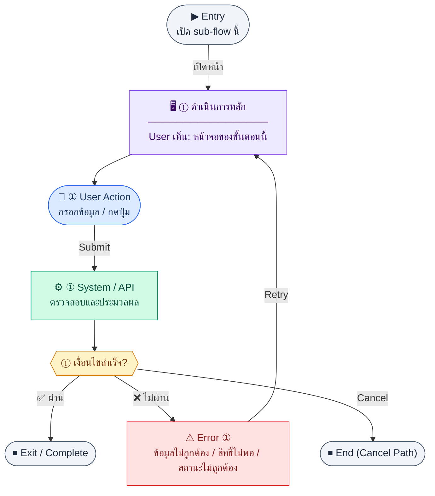

# Reports

คู่มือแปลง UX → spec: [`../../UX_TO_UI_SPEC_WORKFLOW.md`](../../UX_TO_UI_SPEC_WORKFLOW.md)

**Route:** `/finance/reports`

---

## Metadata

| Key | Value |
|-----|--------|
| **UX flow** | [`R1-10_Finance_Reports_Summary.md`](../../../UX_Flow/Functions/R1-10_Finance_Reports_Summary.md) |
| **UX sub-flow / steps** | Sub-flow 1 ช่วงเวลา + โหลด summary · Sub-flow 2 KPI cards · Sub-flow 3 drilldown — ดู [`R1-10_Finance_Reports_Summary.md`](../../../UX_Flow/Functions/R1-10_Finance_Reports_Summary.md) |
| **Design system** | [`design-system.md`](../../design-system.md) — §3 Page layout, §5 forms, §6 DataTable ตามประเภทหน้า |
| **Global FE behaviors** | [`_GLOBAL_FRONTEND_BEHAVIORS.md`](../../../UX_Flow/_GLOBAL_FRONTEND_BEHAVIORS.md) |
| **Preview** | [`Reports.preview.html`](./Reports.preview.html) · [`../_Shared/preview-base.css`](../_Shared/preview-base.css) · [`MD_TO_PREVIEW_HTML_MANUAL.md`](../MD_TO_PREVIEW_HTML_MANUAL.md) |

---

## เป้าหมายหน้าจอ

ดึง KPI หลักห้าตัว: revenue, expense, netProfit, arOutstanding, apOutstanding สำหรับช่วงเดือนที่เลือก

## ผู้ใช้และสิทธิ์

อ่าน Actor(s) และ permission gate ใน Appendix / เอกสาร UX — กรณี 401/403/409 อ้าง Global FE behaviors

## โครง layout (สรุป)

หน้า **dashboard / read-only summary** ตาม `design-system.md` — ลำดับภูมิภาคบนหน้า (top → bottom):

1. **PageHeader** — หัวข้อ `reports.title` / «สรุปการเงิน» และบรรทัดรอง (ถ้ามี) แสดง **ช่วงที่นำมาแสดงแล้ว** (เช่น «ม.ค. 2568 – มี.ค. 2568») เพื่อให้ผู้ใช้รู้ว่าตัวเลข KPI อิงช่วงใด แม้จะกำลังแก้ค่าในฟอร์ม
2. **แถบช่วงเวลา (period toolbar)** — การ์ดหรือแถบเดียวกับฟอร์มกรอง: `periodFrom`, `periodTo`, CTA หลัก, ช่วงด่วน (ถ้าเปิดใช้), ลิงก์/ข้อความอธิบายรูปแบบ `YYYY-MM`
3. **Error / validation inline** — แสดงเหนือการ์ด KPI เมื่อช่วงไม่ถูกต้องหรือ API ล้มเหลว (ตาม Sub-flow 1 ใน UX)
4. **กราฟสรุป** — **กลุ่มแท่ง P&amp;L 3 แท่ง** + **เกจอัตราส่วนค่าใช้จ่าย÷รายได้** จาก summary **รวมช่วงหนึ่งครั้ง**; ถ้ามี **กราฟแนวโน้มรายเดือน** ให้โหลดตามหัวข้อ **กราฟรายเดือน (FE — ยิง summary ทีละเดือน)**
5. **KPI grid** — การ์ดห้าใบ + disclaimer เล็กใต้การ์ด AR (ตาม UX Sub-flow 2)
6. **หมายเหตุขอบเขต R1** — ข้อความสั้นว่ารายงานเชิงลึก / export อยู่ R2 (ไม่ทำให้หน้านี้กลายเป็น report hub)

## กราฟที่กำหนดสำหรับหน้านี้

ข้อมูลจาก `GET /api/finance/reports/summary` ต่อหนึ่งคำขอคือ **ตัวเลขรวมในช่วง `periodFrom`–`periodTo`** — หน้านี้แสดงกราฟสองชิ้นคู่กับการ์ด KPI (การ์ดยังเป็นค่าอ้างอิงหลัก)

### 1) กลุ่มแท่งตั้ง — รายได้ · ค่าใช้จ่าย · กำไรสุทธิ

| รายการ | รายละเอียด |
|--------|------------|
| **ฟิลด์** | `revenue`, `expense`, `netProfit` |
| **การอ่านค่า** | สเกลความสูงของแท่งใช้ **รายได้รวม = 100%** ของแกนที่กำหนด; ค่าใช้จ่ายและกำไรเป็นสัดส่วนของรายได้ (ถ้ารายได้ = 0 ไม่แสดงกราฟนี้ — แสดงข้อความแทน) |
| **กำไรติดลบ** | แท่งกำไรวาดลงใต้แกน (negative bar) หรือแยกสี/คำอธิบาย «ขาดทุน» ให้ชัด |

### 2) เกจอัตราส่วน — ค่าใช้จ่าย ÷ รายได้

| รายการ | รายละเอียด |
|--------|------------|
| **สูตร** | `ratio = expense / revenue` (ช่วงเดียวกับ summary) |
| **การแสดง** | เกจแนวราบหรือโค้งกึ่งวงกลม แกน 0%–100% โดย **100% = ค่าใช้จ่ายเท่ารายได้**; แสดงตัวเลขเป็นเปอร์เซ็นต์ (เช่น 71.2%) และข้อความกำกับสั้น |
| **revenue = 0** | ไม่หาร — แสดง «ไม่สามารถคำนวณอัตราส่วนได้» และปิดการแสดงเกจ |
| **ratio > 1** | ค่าใช้จ่ายเกินรายได้ — แสดงเต็มสเกลหรือขยายสเกลพร้อมสีเตือน (>100%) |

### กราฟรายเดือน (FE — ยิง summary ทีละเดือน)

จนกว่า BE จะส่ง `monthlySeries[]` (หรือเทียบเท่า) ในคำตอบเดียว **แนวทางชั่วคราว:** ฝั่ง FE สร้างแกนรายเดือนจากช่วงที่ผู้ใช้เลือก โดยเรียก `GET /api/finance/reports/summary` **ซ้ำทีละเดือน** (`periodFrom` = `periodTo` = `YYYY-MM` ของเดือนนั้น)

| หัวข้อ | กำหนด |
|--------|--------|
| **การสร้างรายการเดือน** | ไล่ทุกเดือนปฏิทินจาก `periodFrom` ถึง `periodTo` รวมปลายทาง (เช่น 2026-01 … 2026-03 → 3 ครั้ง) |
| **คู่กับการ์ด KPI รวมช่วง** | การ์ดห้าใบยังใช้ผล **หนึ่งครั้ง** ของ `periodFrom`–`periodTo` เต็มช่วงตามเดิม — **ห้าม** แทนที่ด้วยการบวกเลขจากหลายเดือนเอง เว้นแต่ทีม BE ยืนยันว่า KPI รวมช่วง = ผลรวมของรายเดือนเสมอ |
| **ฟิลด์ที่นำไปวาดกราฟรายเดือน** | แนะนำใช้เฉพาะ **revenue, expense, netProfit** ต่อเดือน — **AR/AP ต่อเดือน** อาจไม่เหมาะเป็นแนวโน้มถ้านิยาม BE เป็นยอดคงค้าง/สะสม; ถ้าไม่ชัดให้ไม่แสดง AR/AP บนกราฟรายเดือน |
| **จำนวนคำขอ** | `1` (ช่วงเต็ม) + `n` เดือน — จำกัด `n` สูงสุด (แนะนำ **≤ 36 เดือน**); เกินให้แสดงข้อความให้ผู้ใช้ย่อช่วง |
| **Concurrency** | จำกัดพร้อมกัน (เช่น 2–3 คำขอ) เพื่อไม่กด BE; ยกเลิกคำขอค้างเมื่อผู้ใช้เปลี่ยนช่วงหรือออกจากหน้า |
| **Loading** | Skeleton/placeholder บนกราฟรายเดือนแยกจากการ์ด — การ์ดอาจแสดงก่อนเมื่อครั้งรวมช่วงเสร็จก่อน |
| **ข้อผิดพลาดบางเดือน** | แสดงช่องว่างหรือสถานะ error เฉพาะจุด + retry เฉพาะเดือน หรือ retry ทั้งแผงตามนโยบายทีม |

**หมายเหตุ:** เมื่อ BE เพิ่ม response แบบรายเดือนในคำขอเดียวได้แล้ว ควรลดหรือเลิกยิงซ้ำเพื่อประหยัด latency และโหลดเซิร์ฟเวอร์

## เนื้อหาและฟิลด์

สอดคล้อง **Sub-flow 1** ใน [`R1-10_Finance_Reports_Summary.md`](../../../UX_Flow/Functions/R1-10_Finance_Reports_Summary.md) — พารามิเตอร์ `GET /api/finance/reports/summary` เป็นเดือน `YYYY-MM` (เทียบเท่า `<input type="month">` ในเบราว์เซอร์)

| ฟิลด์ / องค์ประกอบ | ชนิด | บังคับ | คำอธิบาย / พฤติกรรม UX |
|---------------------|------|--------|-------------------------|
| `periodFrom` | เดือน (`YYYY-MM`) | ใช่ | เดือนเริ่มต้นของช่วงสรุป KPI |
| `periodTo` | เดือน (`YYYY-MM`) | ใช่ | เดือนสิ้นสุดของช่วงสรุป KPI |
| ข้อความตรวจสอบช่วง | — | — | ฝั่ง client: `periodFrom <= periodTo`; ถ้าไม่ผ่าน แสดงข้อความชัด (ไม่ยิง API) |
| Query บน URL | — | แนะนำ | ซิงก์ `periodFrom`, `periodTo` กับ `?periodFrom=&periodTo=` เพื่อแชร์ลิงก์และรีเฟรชหน้าแล้วยังได้ช่วงเดิม |
| ช่วงด่วน (optional) | ปุ่มชิป / เมนู | ไม่ | ลดงานผู้ใช้: เช่น «เดือนนี้», «ไตรมาสนี้», «ปีนี้» — ตั้งค่า `periodFrom`/`periodTo` แล้วให้ผู้ใช้กด «นำมาแสดง» (หลีกเลี่ยงการโหลดซ้ำทุกครั้งที่คลิกชิป หากต้องการควบคุม traffic) |

## การกระทำ (CTA)

| CTA | พฤติกรรม |
|-----|----------|
| **นำมาแสดง** (primary) | validate ช่วง → อัปเดต URL query → เรียก `GET .../summary?periodFrom&periodTo` **หนึ่งครั้ง** สำหรับการ์ด KPI → จากนั้น (ถ้ามีกราฟรายเดือน) เรียก `summary` **ทีละเดือน** ตามรายการเดือนในช่วง — ดูหัวข้อ **กราฟรายเดือน (FE — ยิง summary ทีละเดือน)** |
| **รีเฟรช** (secondary / ghost) | เรียกชุดเดิม: ครั้งรวมช่วง + รายเดือน (ถ้าเปิดใช้กราฟรายเดือน) |
| **ลองอีกครั้ง** | เมื่อ error จาก API — เรียก endpoint เดิมซ้ำ (ตาม UX) |

**แนว UX (เลือกอย่างใดอย่างหนึ่งให้ชัดใน implementation):**

- **แบบ A — กดนำมาแสดง:** เปลี่ยนเดือนในฟอร์มแล้วต้องกดปุ่มจึงโหลด — ลดการยิง API ระหว่างเลื่อนเดือน
- **แบบ B — auto-run:** เมื่อ `periodFrom`/`periodTo` เปลี่ยนและผ่าน validation ให้ debounce แล้วโหลด — เหมาะถ้าต้องการความรวดเร็วแบบ live filter

เอกสาร UX อนุญาตทั้งสองแบบ; แนะนำ **แบบ A** สำหรับรายงานการเงินที่ aggregate หนัก

## สถานะพิเศษ

| สถานะ | การแสดงผล |
|--------|------------|
| **Loading** | Skeleton บนการ์ดทั้งห้า หรือ overlay เล็กบน grid (ตาม UX); กราฟรายเดือนมีสถานะโหลดแยก (อาจมาทีหลังครั้งรวมช่วง) |
| **สำเร็จ** | ตัวเลขครบห้าฟิลด์ + locale สกุลเงิน |
| **Validation ช่วง** | Inline ใต้ฟอร์มหรือใน `alert-warn` — ไม่ล้างตัวเลขเก่าจนกว่าผู้ใช้ apply สำเร็จ (ลดการกระพริบ) หรือ grey-out การ์ดระหว่าง apply ตามนโยบายทีม |
| **API error** | `alert-error` + ปุ่ม retry |
| **401/403** | ตาม `_GLOBAL_FRONTEND_BEHAVIORS.md` |

## หมายเหตุ implementation (ถ้ามี)

เทียบ `erp_frontend` เมื่อทราบ path ของหน้า

## Preview HTML notes

| หัวข้อ | ใส่อะไร |
|--------|--------|
| **Shell** | โดยมาก `app` (ยกเว้นหน้า login / standalone) |
| **Regions** | PageHeader → period toolbar → กราฟ snapshot (3 แท่ง + เกจ) → (optional) กราฟรายเดือน → KPI cards → หมายเหตุ R1 |
| **สถานะสำหรับสลับใน preview** | `default` (มีช่วง + KPI) · `loading` (skeleton) · `error` (banner + retry) · `invalidPeriod` (validation ช่วง) ตาม UX Sub-flow 1 |
| **ข้อมูลจำลอง** | จำนวนแถว / สถานะ badge ตามประเภทหน้า |
| **ลิงก์ CSS** | [`../_Shared/preview-base.css`](../_Shared/preview-base.css) |

---

## Appendix — UX excerpt (reference)

## Sub-flow 1 — โหลดและเลือกช่วงเวลา (`GET /api/finance/reports/summary`)

**Goal:** ดึง KPI หลักห้าตัว: revenue, expense, netProfit, arOutstanding, apOutstanding สำหรับช่วงเดือนที่เลือก

**User sees:** ตัวเลือก `periodFrom`, `periodTo` (รูปแบบ YYYY-MM ตาม BR), ปุ่ม “นำมาแสดง” หรือ auto-run เมื่อเปลี่ยนค่า, สถานะ loading บนการ์ด

**User can do:** เปลี่ยนช่วงเวลา, กดรีเฟรช, กด retry เมื่อ error

**Frontend behavior:**

- เรียก `GET /api/finance/reports/summary?periodFrom=<YYYY-MM>&periodTo=<YYYY-MM>` พร้อม Bearer token
- validate ฝั่ง client: `periodFrom <= periodTo`, รูปแบบเดือนถูกต้อง
- ระหว่างรอ: skeleton บนการ์ดทั้งห้า หรือ spinner overlay เล็กน้อย
- เก็บค่าช่วงใน URL query เพื่อ share link
- กราฟรายเดือน (ชั่วคราว): ยิง `summary` ทีละเดือน — ดูหัวข้อ **กราฟรายเดือน (FE — ยิง summary ทีละเดือน)** และเอกสาร UX ต้นฉบับ

**System / AI behavior:** aggregate จาก `invoices`, `finance_ap_bills`, `finance_ap_vendor_invoice_payments`, `journal_entries`/`journal_lines` ตาม BR — รายละเอียดการคำนวณเป็นของ BE

**Success:** 200 และ `data` มีครบห้าฟิลด์ตัวเลข

**Error:** 400 ช่วงไม่ถูกต้อง; 401/403; 5xx/timeout → แสดง error banner + ปุ่ม retry เรียก `GET /api/finance/reports/summary` ซ้ำ

**Notes:** Endpoint เดียวที่ BR กำหนดสำหรับหน้านี้ใน R1: `GET /api/finance/reports/summary` — การยิงซ้ำรายเดือนเป็นแพทเทิร์น FE เท่านั้น

---

### Scenario Flow

### สัญลักษณ์ Node (Color Legend)

| สี | Node shape | หมายถึง |
|----|-----------|---------|
| 🟣 ม่วง | สี่เหลี่ยม `["…"]` | **Screen / UI State** |
| 🔵 น้ำเงิน | วงกลม `(["…"])` | **User Action** |
| 🟢 เขียว | สี่เหลี่ยม `["…"]` | **System / API** |
| 🟡 เหลือง | เพชร `{{"…"}}` | **Decision** |
| 🔴 แดง | สี่เหลี่ยม `["…"]` | **Error / Edge case** |
| ⚫ เทา | วงรี `(["…"])` | **Start / End** |

---

---

## หมายเหตุ implementation (erp_frontend / ของเดิม)

(erp_frontend / ของเดิม)

(erp_frontend / ของเดิม)

(erp_frontend / ของเดิม)

## 1) Permission

- ไม่มี `finance:report:view` → `PageHeader` + `reports.noPermission`

---

## 2) Layout (เมื่อมีสิทธิ์)

- Root: `space-y-6`
- `PageHeader` `reports.title` + บรรทัดย่อยแสดงช่วงที่ apply แล้ว (อ่านจาก state หลังโหลดสำเร็จ ไม่ใช่ draft ในฟอร์ม)
- **แถบช่วงเวลา:** แถว `flex flex-wrap items-end gap-3` — label «ตั้งแต่เดือน» / «ถึงเดือน» + `<input type="month">` สองช่อง + ปุ่ม primary «นำมาแสดง» + ปุ่ม ghost «รีเฟรช» (optional ชิปช่วงด่วน)
- Sync URL: `useSearchParams` / router ให้ path เป็น `/finance/reports?periodFrom=YYYY-MM&periodTo=YYYY-MM`
- Loading: skeleton บนการ์ดห้าใบ หรือ overlay + ข้อความ `กำลังโหลด...` (hard-code ไทยในโค้ด)
- Error: กล่อง destructive + ปุ่ม retry (`text-xs text-primary`)
- **กราฟ snapshot:** การ์ดเหนือ KPI grid — (1) แท่งตั้ง 3 แท่ง (2) เกจ `expense ÷ revenue` จาก summary รวมช่วง — ดู **กราฟที่กำหนดสำหรับหน้านี้**
- **กราฟรายเดือน (ถ้าทำ):** แยกการ์ด/แถว — ข้อมูลจากหลายครั้ง `summary` ทีละเดือน — ดู **กราฟรายเดือน (FE — ยิง summary ทีละเดือน)**; โหลดแยกจากการ์ด, จำกัด concurrency และจำนวนเดือนสูงสุด
- สำเร็จ: `grid grid-cols-3 gap-4` ของการ์ด KPI
  - แต่ละการ์ด: `rounded-lg border bg-card p-4 space-y-1`
  - Label `text-xs text-muted-foreground`, ค่า `text-xl font-semibold` (`formatCurrency`)
  - รายการ: totalRevenue, totalExpenses, netProfit, totalAr, totalAp
  - ใต้การ์ด AR: ข้อความ disclaimer เล็ก (partial payment / known gap ตาม UX)

---

## 3) Preview

[Reports.preview.html](./Reports.preview.html) · [`../_Shared/preview-base.css`](../_Shared/preview-base.css)
