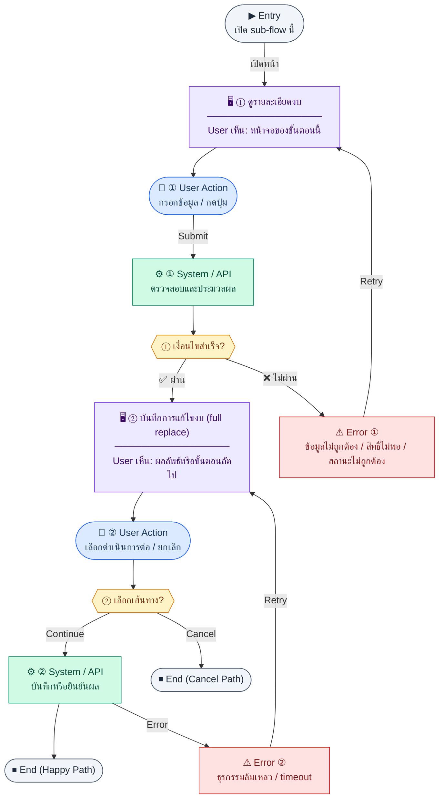

# BudgetDetail

คู่มือแปลง UX → spec: [`../../UX_TO_UI_SPEC_WORKFLOW.md`](../../UX_TO_UI_SPEC_WORKFLOW.md)

**Route:** `/pm/budgets/:id`

---

## Metadata

| Key | Value |
|-----|--------|
| **UX flow** | [`R1-11_PM_Budget_Management.md`](../../../UX_Flow/Functions/R1-11_PM_Budget_Management.md) |
| **UX sub-flow / steps** | สรุปใน Appendix — แตกตามหัวข้อ Sub-flow / Step ในเอกสาร UX |
| **Design system** | [`design-system.md`](../../design-system.md) — §3 Page layout, §5 forms, §6 DataTable ตามประเภทหน้า |
| **Global FE behaviors** | [`_GLOBAL_FRONTEND_BEHAVIORS.md`](../../../UX_Flow/_GLOBAL_FRONTEND_BEHAVIORS.md) |
| **Preview** | [`BudgetDetail.preview.html`](./BudgetDetail.preview.html) · [`../_Shared/preview-base.css`](../_Shared/preview-base.css) · [`MD_TO_PREVIEW_HTML_MANUAL.md`](../MD_TO_PREVIEW_HTML_MANUAL.md) |

---

## เป้าหมายหน้าจอ

โหลดข้อมูลงบฉบับเดียวสำหรับหน้าแก้ไขหรือ header ของหน้าสรุป

## ผู้ใช้และสิทธิ์

อ่าน Actor(s) และ permission gate ใน Appendix / เอกสาร UX — กรณี 401/403/409 อ้าง Global FE behaviors

## โครง layout (สรุป)

ระบุตามประเภทหน้าใน Appendix: list / detail / form / แท็บ — ใช้ pattern ใน design-system.md

## เนื้อหาและฟิลด์

สกัดจาก **User sees** / **User Action** / ช่องกรอกใน Appendix เป็นตารางฟิลด์เต็มเมื่อปรับแต่งรอบถัดไป; ขณะนี้ใช้บล็อก UX ด้านล่างเป็นข้อมูลอ้างอิงครบถ้วน

## การกระทำ (CTA)

สกัดจากปุ่มใน Appendix (`[...]`) และ Frontend behavior

## สถานะพิเศษ

Loading, empty, error, validation, dependency ขณะลบ — ตาม **Error** / **Success** ใน Appendix

## หมายเหตุ implementation (ถ้ามี)

เทียบ `erp_frontend` เมื่อทราบ path ของหน้า

## Preview HTML notes

| หัวข้อ | ใส่อะไร |
|--------|--------|
| **Shell** | โดยมาก `app` (ยกเว้นหน้า login / standalone) |
| **Regions** | ดูลำดับ **User sees** ใน Appendix |
| **สถานะสำหรับสลับใน preview** | `default` · `loading` · `empty` · `error` ตาม UX |
| **ข้อมูลจำลอง** | จำนวนแถว / สถานะ badge ตามประเภทหน้า |
| **ลิงก์ CSS** | [`../_Shared/preview-base.css`](../_Shared/preview-base.css) |

---

## Appendix — UX excerpt (reference)

## Sub-flow C — รายละเอียดและแก้ไขงบ (Read / Update)

### Scenario Flow

### สัญลักษณ์ Node (Color Legend)

| สี | Node shape | หมายถึง |
|----|-----------|---------|
| 🟣 ม่วง | สี่เหลี่ยม `["…"]` | **Screen / UI State** |
| 🔵 น้ำเงิน | วงกลม `(["…"])` | **User Action** |
| 🟢 เขียว | สี่เหลี่ยม `["…"]` | **System / API** |
| 🟡 เหลือง | เพชร `{{"…"}}` | **Decision** |
| 🔴 แดง | สี่เหลี่ยม `["…"]` | **Error / Edge case** |
| ⚫ เทา | วงรี `(["…"])` | **Start / End** |

---

### Step C1 — ดูรายละเอียดงบ

**Goal:** โหลดข้อมูลงบฉบับเดียวสำหรับหน้าแก้ไขหรือ header ของหน้าสรุป

**User sees:** ข้อมูลงบครบฟิลด์จาก detail

**User can do:** อ่านข้อมูล, ไปหน้าแก้ไข

**User Action:**
- ประเภท: `กดปุ่ม`
- ปุ่ม / Controls ในหน้านี้:
  - `[Edit Budget]` → เข้าโหมดแก้ไข
  - `[View Summary]` → ดู utilization และค่าใช้จ่ายที่ผูก
  - `[Back to List]` → กลับหน้ารายการ

**Frontend behavior:** `GET /api/pm/budgets/:id`

**System / AI behavior:** SELECT `pm_budgets` by id + ตรวจสิทธิ์ ownership/scope ถ้ามี

**Success:** ได้ `data` สำหรับ bind ฟอร์ม

**Error:** 404 ไม่พบ, 403 ไม่มีสิทธิ์ดู

**Notes:** Path ตาม SD_Flow: `/pm/budgets/:id/edit` ใช้ endpoint เดียวกันก่อนเข้าโหมดแก้ไข

### Step C2 — บันทึกการแก้ไขงบ (full replace)

**Goal:** อัปเดตข้อมูลงบแบบ replace ทั้งชุดตามสัญญา `PUT`

**User sees:** ฟอร์มแก้ไขพร้อมค่าเดิม, สถานะ loading ขณะบันทึก

**User can do:** แก้ไขฟิลด์, กดบันทึก

**User Action:**
- ประเภท: `กรอกข้อมูล / เลือกตัวเลือก`
- ช่องที่ต้องกรอก:
  - `name` *(required)* : ชื่องบ
  - `amount` *(required)* : วงเงินงบล่าสุด
  - `projectId` *(optional)* : โครงการ
  - `startDate` *(optional)* : วันที่เริ่ม
  - `endDate` *(optional)* : วันที่สิ้นสุด
  - `description` *(optional)* : หมายเหตุ
- ปุ่ม / Controls ในหน้านี้:
  - `[Save Changes]` → เรียก `PUT /api/pm/budgets/:id`
  - `[Cancel]` → ยกเลิกการแก้ไข

**Frontend behavior:**

- validate ก่อนยิง `PUT /api/pm/budgets/:id` body เต็มชุดตามที่ BE กำหนด
- optimistic UI เป็น optional; ถ้าไม่ใช้ ให้ disable ปุ่มขณะรอ

**System / AI behavior:** `UPDATE pm_budgets`; อาจ recompute ฟิลด์ที่ derive จากระบบ

**Success:** 200 + message; refresh cache รายการและ detail

**Error:** 400, 409 business rule (เช่น งบปิดแล้วแก้ไม่ได้ — ถ้า BE enforce)

**Notes:** BR ระบุการเชื่อมกับค่าใช้จ่ายที่ approved จะสะท้อนใน `usedAmount` ผ่าน aggregate ไม่ใช่แค่การแก้ชื่อ

---

---

## หมายเหตุ implementation (erp_frontend / ของเดิม)

(erp_frontend / ของเดิม)

(erp_frontend / ของเดิม)

(erp_frontend / ของเดิม)

## 1) States

- Loading: กลางจอ
- Error / ไม่พบ: กล่อง destructive `loadError`

---

## 2) Layout

- Root: `mx-auto max-w-4xl space-y-4`
- `Breadcrumb`
- **Hero card:** `rounded-xl border bg-card p-5` — code mono + `StatusBadge`, ชื่อโปรเจค, meta ประเภท/owner/ช่วงวันที่
  - ปุ่ม `Plus` + ข้อความ `expense.add` → navigate `/pm/expenses/new?budgetId=...`

### สรุป 3 การ์ด

- Total / Spent (`text-destructive`) / Remaining (`text-green-600` dark variant)

### Utilization section

- Progress bar `h-4` สีตาม % (เขียว / เหลือง / แดง เกณฑ์ 50 และ 80)
- Grid หมวด (`byCategory`) การ์ดย่อย `rounded-lg border bg-muted/30`

### ตาราง expenses ที่ผูก

- Header `budget.linkedExpenses`
- ตาราง full width, ลิงก์ชื่อรายการไป `/pm/expenses/:id`, คอลัมน์ id, title, amount, category, date, status badge

---

## 3) Preview

[BudgetDetail.preview.html](./BudgetDetail.preview.html) · [`../_Shared/preview-base.css`](../_Shared/preview-base.css)
