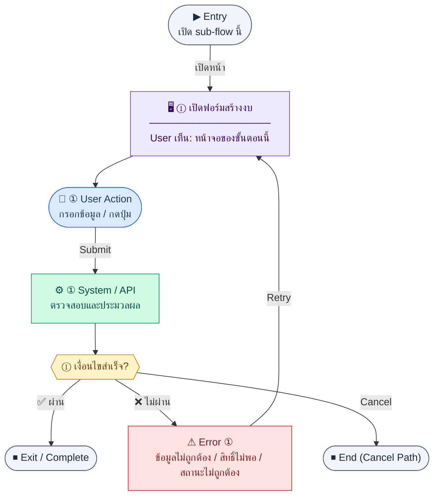

# BudgetForm

คู่มือแปลง UX → spec: [`../../UX_TO_UI_SPEC_WORKFLOW.md`](../../UX_TO_UI_SPEC_WORKFLOW.md)

**Route:** `/pm/budgets/new`

---

## Metadata

| Key | Value |
|-----|--------|
| **UX flow** | [`R1-11_PM_Budget_Management.md`](../../../UX_Flow/Functions/R1-11_PM_Budget_Management.md) |
| **UX sub-flow / steps** | สรุปใน Appendix — แตกตามหัวข้อ Sub-flow / Step ในเอกสาร UX |
| **Design system** | [`design-system.md`](../../design-system.md) — §3 Page layout, §5 forms, §6 DataTable ตามประเภทหน้า |
| **Global FE behaviors** | [`_GLOBAL_FRONTEND_BEHAVIORS.md`](../../../UX_Flow/_GLOBAL_FRONTEND_BEHAVIORS.md) |
| **Preview** | [`BudgetForm.preview.html`](./BudgetForm.preview.html) · [`../_Shared/preview-base.css`](../_Shared/preview-base.css) · [`MD_TO_PREVIEW_HTML_MANUAL.md`](../MD_TO_PREVIEW_HTML_MANUAL.md) |

---

## เป้าหมายหน้าจอ

เริ่มสร้างงบใหม่ด้วยข้อมูลที่ BR กำหนด

## ผู้ใช้และสิทธิ์

อ่าน Actor(s) และ permission gate ใน Appendix / เอกสาร UX — กรณี 401/403/409 อ้าง Global FE behaviors

## โครง layout (สรุป)

ระบุตามประเภทหน้าใน Appendix: list / detail / form / แท็บ — ใช้ pattern ใน design-system.md

## เนื้อหาและฟิลด์

สกัดจาก **User sees** / **User Action** / ช่องกรอกใน Appendix เป็นตารางฟิลด์เต็มเมื่อปรับแต่งรอบถัดไป; ขณะนี้ใช้บล็อก UX ด้านล่างเป็นข้อมูลอ้างอิงครบถ้วน

## การกระทำ (CTA)

สกัดจากปุ่มใน Appendix (`[...]`) และ Frontend behavior

## สถานะพิเศษ

Loading, empty, error, validation, dependency ขณะลบ — ตาม **Error** / **Success** ใน Appendix

## หมายเหตุ implementation (ถ้ามี)

เทียบ `erp_frontend` เมื่อทราบ path ของหน้า

## Preview HTML notes

| หัวข้อ | ใส่อะไร |
|--------|--------|
| **Shell** | โดยมาก `app` (ยกเว้นหน้า login / standalone) |
| **Regions** | ดูลำดับ **User sees** ใน Appendix |
| **สถานะสำหรับสลับใน preview** | `default` · `loading` · `empty` · `error` ตาม UX |
| **ข้อมูลจำลอง** | จำนวนแถว / สถานะ badge ตามประเภทหน้า |
| **ลิงก์ CSS** | [`../_Shared/preview-base.css`](../_Shared/preview-base.css) |

---

## Appendix — UX excerpt (reference)

## Sub-flow B — สร้างงบใหม่ (Create)

### Scenario Flow

### สัญลักษณ์ Node (Color Legend)

| สี | Node shape | หมายถึง |
|----|-----------|---------|
| 🟣 ม่วง | สี่เหลี่ยม `["…"]` | **Screen / UI State** |
| 🔵 น้ำเงิน | วงกลม `(["…"])` | **User Action** |
| 🟢 เขียว | สี่เหลี่ยม `["…"]` | **System / API** |
| 🟡 เหลือง | เพชร `{{"…"}}` | **Decision** |
| 🔴 แดง | สี่เหลี่ยม `["…"]` | **Error / Edge case** |
| ⚫ เทา | วงรี `(["…"])` | **Start / End** |

---

### Step B1 — เปิดฟอร์มสร้างงบ

**Goal:** เริ่มสร้างงบใหม่ด้วยข้อมูลที่ BR กำหนด

**User sees:** ฟอร์ม `/pm/budgets/new` (ชื่องบ, วงเงิน, วันที่เริ่ม/สิ้นสุด, คำอธิบาย ฯลฯ)

**User can do:** กรอกฟิลด์, บันทึกร่างผ่านการสร้างด้วยสถานะเริ่มต้น, ยกเลิกกลับรายการ

**User Action:**
- ประเภท: `กรอกข้อมูล / เลือกตัวเลือก`
- ช่องที่ต้องกรอก:
  - `name` *(required)* : ชื่องบ
  - `amount` *(required)* : วงเงินงบ
  - `projectId` *(optional)* : โครงการที่ผูก (ถ้า deployment เปิด project linkage)
  - `startDate` *(optional)* : วันที่เริ่ม
  - `endDate` *(optional)* : วันที่สิ้นสุด
  - `description` *(optional)* : หมายเหตุ
- ปุ่ม / Controls ในหน้านี้:
  - `[Save Budget]` → เรียก `POST /api/pm/budgets`
  - `[Cancel]` → กลับหน้ารายการ

**Frontend behavior:**

- validate ฝั่ง client ก่อน submit (จำนวนเงิน, วันที่, ชื่อ)
- `POST /api/pm/budgets` พร้อม body ตามสัญญา API (เช่น `name`, `amount` และฟิลด์อื่นที่ BE รองรับ)
- หลัง 201 redirect ไป `/pm/budgets/:id` หรือ `/pm/budgets/:id/edit` ตาม product decision

**System / AI behavior:**

- สร้างแถวใน `pm_budgets`
- gen `budgetCode` อัตโนมัติตาม BR: `BUD-{YEAR}-{SEQ:3}`

**Success:** ได้ `id` ใหม่จาก response และผู้ใช้อยู่หน้าถัดไปที่สมเหตุสมผล

**Error:** 400 validation, 409 ชน unique, 403 — แสดง field errors หรือข้อความรวม

**Notes:** ลบได้เฉพาะ `status = draft` (ดู Sub-flow E)

---

---

## หมายเหตุ implementation (erp_frontend / ของเดิม)

(erp_frontend / ของเดิม)

(erp_frontend / ของเดิม)

(erp_frontend / ของเดิม)

## 1) Form

- `react-hook-form` + `zod` — ฟิลด์: budgetType, projectName, totalAmount (regex ตัวเลข), ownerName, startDate, endDate (ข้อความ error ไทยใน schema)

---

## 2) Layout

- Root: `mx-auto max-w-2xl space-y-4`
- `Breadcrumb` — รายการ budget → สร้าง/แก้ไข
- `PageHeader`
- `form space-y-6`:
  - Section เดียว `rounded-xl border bg-card` + header `budget.formSection`
  - Grid `md:grid-cols-2`:
    - รหัส budget disabled แสดงข้อความ `Auto-generate after create` หรือ code จริงตอนแก้ไข
    - ประเภท *, ชื่อโปรเจค * (เต็มแถว), ยอดรวม *, เจ้าของ *, วันเริ่ม/สิ้นสุด *
  - Footer: Cancel outline, Save primary (disabled ขณะ mutation)

---

## 3) Navigation

- สำเร็จ → detail ของ budget ที่สร้าง/แก้ไข

---

## 4) Preview

[BudgetForm.preview.html](./BudgetForm.preview.html) · [`../_Shared/preview-base.css`](../_Shared/preview-base.css)
