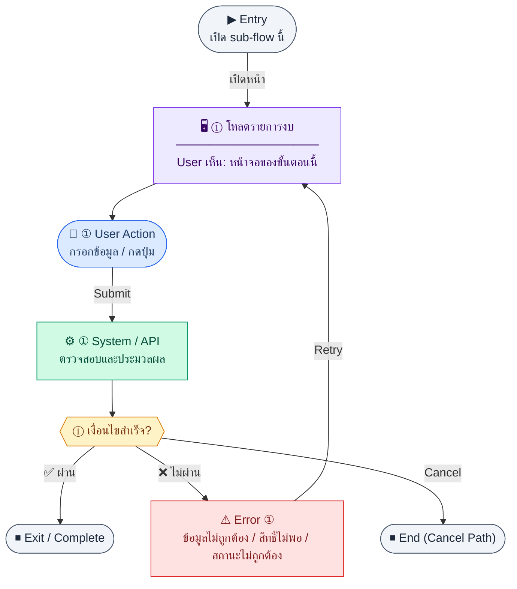

# BudgetList

คู่มือแปลง UX → spec: [`../../UX_TO_UI_SPEC_WORKFLOW.md`](../../UX_TO_UI_SPEC_WORKFLOW.md)

**Route:** `/pm/budgets`

---

## Metadata

| Key | Value |
|-----|--------|
| **UX flow** | [`R1-11_PM_Budget_Management.md`](../../../UX_Flow/Functions/R1-11_PM_Budget_Management.md) |
| **UX sub-flow / steps** | สรุปใน Appendix — แตกตามหัวข้อ Sub-flow / Step ในเอกสาร UX |
| **Design system** | [`design-system.md`](../../design-system.md) — §3 Page layout, §5 forms, §6 DataTable ตามประเภทหน้า |
| **Global FE behaviors** | [`_GLOBAL_FRONTEND_BEHAVIORS.md`](../../../UX_Flow/_GLOBAL_FRONTEND_BEHAVIORS.md) |
| **Preview** | [`BudgetList.preview.html`](./BudgetList.preview.html) · [`../_Shared/preview-base.css`](../_Shared/preview-base.css) · [`MD_TO_PREVIEW_HTML_MANUAL.md`](../MD_TO_PREVIEW_HTML_MANUAL.md) |

---

## เป้าหมายหน้าจอ

ให้ผู้ใช้เห็นงบทั้งหมดในหน้ารายการพร้อมค้นหาและกรอง

## ผู้ใช้และสิทธิ์

อ่าน Actor(s) และ permission gate ใน Appendix / เอกสาร UX — กรณี 401/403/409 อ้าง Global FE behaviors

## โครง layout (สรุป)

ระบุตามประเภทหน้าใน Appendix: list / detail / form / แท็บ — ใช้ pattern ใน design-system.md

## เนื้อหาและฟิลด์

สกัดจาก **User sees** / **User Action** / ช่องกรอกใน Appendix เป็นตารางฟิลด์เต็มเมื่อปรับแต่งรอบถัดไป; ขณะนี้ใช้บล็อก UX ด้านล่างเป็นข้อมูลอ้างอิงครบถ้วน

## การกระทำ (CTA)

สกัดจากปุ่มใน Appendix (`[...]`) และ Frontend behavior

## สถานะพิเศษ

Loading, empty, error, validation, dependency ขณะลบ — ตาม **Error** / **Success** ใน Appendix

## หมายเหตุ implementation (ถ้ามี)

เทียบ `erp_frontend` เมื่อทราบ path ของหน้า

## Preview HTML notes

| หัวข้อ | ใส่อะไร |
|--------|--------|
| **Shell** | โดยมาก `app` (ยกเว้นหน้า login / standalone) |
| **Regions** | ดูลำดับ **User sees** ใน Appendix |
| **สถานะสำหรับสลับใน preview** | `default` · `loading` · `empty` · `error` ตาม UX |
| **ข้อมูลจำลอง** | จำนวนแถว / สถานะ badge ตามประเภทหน้า |
| **ลิงก์ CSS** | [`../_Shared/preview-base.css`](../_Shared/preview-base.css) |

---

## Appendix — UX excerpt (reference)

## Sub-flow A — รายการงบและตัวกรอง (List)

### Scenario Flow

### สัญลักษณ์ Node (Color Legend)

| สี | Node shape | หมายถึง |
|----|-----------|---------|
| 🟣 ม่วง | สี่เหลี่ยม `["…"]` | **Screen / UI State** |
| 🔵 น้ำเงิน | วงกลม `(["…"])` | **User Action** |
| 🟢 เขียว | สี่เหลี่ยม `["…"]` | **System / API** |
| 🟡 เหลือง | เพชร `{{"…"}}` | **Decision** |
| 🔴 แดง | สี่เหลี่ยม `["…"]` | **Error / Edge case** |
| ⚫ เทา | วงรี `(["…"])` | **Start / End** |

---

### Step A1 — โหลดรายการงบ

**Goal:** ให้ผู้ใช้เห็นงบทั้งหมดในหน้ารายการพร้อมค้นหาและกรอง

**User sees:** ตารางงบ, ช่องค้นหา, ตัวกรองสถานะ/โครงการ (ถ้า UI รองรับตาม query ของ API), pagination

**User can do:** ค้นหา, เปลี่ยนหน้า, กรอง `status`, `projectId` (ตาม `Documents/SD_Flow/PM/budgets.md`), กดสร้างงบใหม่, เปิดรายละเอียด/แก้ไข

**User Action:**
- ประเภท: `กรอกข้อมูล / เลือกตัวเลือก`
- ช่องที่ใช้กรอง/ค้นหา:
  - `search` *(optional)* : ค้นหาจาก `budgetCode` หรือ `name`
  - `status` *(optional)* : draft, active, on_hold, closed
  - `projectId` *(optional)* : กรองตามโครงการ
- ปุ่ม / Controls ในหน้านี้:
  - `[Apply Filters]` → โหลดรายการงบ
  - `[Create Budget]` → เปิดฟอร์มสร้างงบ
  - `[Open Budget]` → ไปหน้ารายละเอียด/แก้ไข

**Frontend behavior:**

- เรียก `GET /api/pm/budgets` พร้อม query `page`, `limit`, `search`, `status`, `projectId` ตามที่ออกแบบ
- แสดง skeleton/loading ระหว่างโหลด
- map คอลัมน์หลักจาก response เช่น `budgetCode`, `name`, `amount`, `usedAmount`, `status`, ช่วงวันที่

**System / AI behavior:**

- BE ตรวจ token + permission ระดับ API
- ดึง `pm_budgets` + count สำหรับ meta pagination

**Success:** ได้รายการและ meta ครบ แสดงตารางได้

**Error:** 401 (session), 403 (ไม่มีสิทธิ์), 500/timeout — แสดงข้อความและปุ่ม retry

**Notes:** การซ่อนปุ่ม action ใน FE ไม่แทนการบังคับสิทธิ์ที่ BE

---

---

## หมายเหตุ implementation (erp_frontend / ของเดิม)

(erp_frontend / ของเดิม)

(erp_frontend / ของเดิม)

(erp_frontend / ของเดิม)

## 1) Layout

- Root: `space-y-4`
- `PageHeader` — ปุ่ม primary + `Plus` → `/pm/budgets/new`
- Error banner ถ้า `isError`
- **Search bar:** `rounded-xl border bg-card p-4`, input มี `Search` icon ซ้าย, `rounded-lg border-input focus:ring-2`
- **ตาราง:** `overflow-hidden rounded-xl border bg-card`
  - Loading: ข้อความกลาง
  - มิฉะนั้น `table` — thead `bg-muted/50`, แถว hover `hover:bg-muted/30`
  - คอลัมน์: budgetCode (mono), projectName, total (`formatCurrency`), budgetType, ownerName, `StatusBadge outline`, actions (`Eye` / `Edit2` เป็นลิงก์ icon)

---

## 2) Preview

[BudgetList.preview.html](./BudgetList.preview.html) · [`../_Shared/preview-base.css`](../_Shared/preview-base.css)
