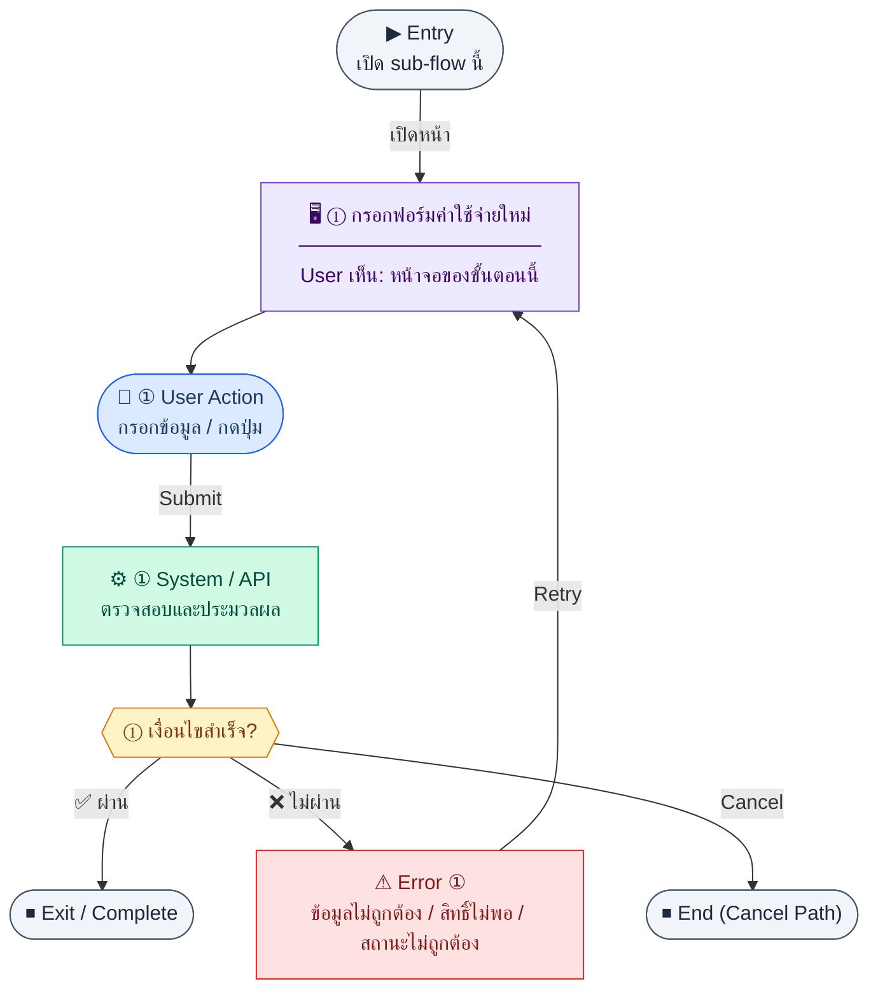

# ExpenseForm

คู่มือแปลง UX → spec: [`../../UX_TO_UI_SPEC_WORKFLOW.md`](../../UX_TO_UI_SPEC_WORKFLOW.md)

**Route:** `/pm/expenses/new`

---

## Metadata

| Key | Value |
|-----|--------|
| **UX flow** | [`R1-12_PM_Expense_Management.md`](../../../UX_Flow/Functions/R1-12_PM_Expense_Management.md) |
| **UX sub-flow / steps** | สรุปใน Appendix — แตกตามหัวข้อ Sub-flow / Step ในเอกสาร UX |
| **Design system** | [`design-system.md`](../../design-system.md) — §3 Page layout, §5 forms, §6 DataTable ตามประเภทหน้า |
| **Global FE behaviors** | [`_GLOBAL_FRONTEND_BEHAVIORS.md`](../../../UX_Flow/_GLOBAL_FRONTEND_BEHAVIORS.md) |
| **Preview** | [`ExpenseForm.preview.html`](./ExpenseForm.preview.html) · [`../_Shared/preview-base.css`](../_Shared/preview-base.css) · [`MD_TO_PREVIEW_HTML_MANUAL.md`](../MD_TO_PREVIEW_HTML_MANUAL.md) |

---

## เป้าหมายหน้าจอ

บันทึกค่าใช้จ่ายจริงและผูกกับงบที่ active

## ผู้ใช้และสิทธิ์

อ่าน Actor(s) และ permission gate ใน Appendix / เอกสาร UX — กรณี 401/403/409 อ้าง Global FE behaviors

## โครง layout (สรุป)

ระบุตามประเภทหน้าใน Appendix: list / detail / form / แท็บ — ใช้ pattern ใน design-system.md

## เนื้อหาและฟิลด์

สกัดจาก **User sees** / **User Action** / ช่องกรอกใน Appendix เป็นตารางฟิลด์เต็มเมื่อปรับแต่งรอบถัดไป; ขณะนี้ใช้บล็อก UX ด้านล่างเป็นข้อมูลอ้างอิงครบถ้วน

## การกระทำ (CTA)

สกัดจากปุ่มใน Appendix (`[...]`) และ Frontend behavior

## สถานะพิเศษ

Loading, empty, error, validation, dependency ขณะลบ — ตาม **Error** / **Success** ใน Appendix

## หมายเหตุ implementation (ถ้ามี)

เทียบ `erp_frontend` เมื่อทราบ path ของหน้า

## Preview HTML notes

| หัวข้อ | ใส่อะไร |
|--------|--------|
| **Shell** | โดยมาก `app` (ยกเว้นหน้า login / standalone) |
| **Regions** | ดูลำดับ **User sees** ใน Appendix |
| **สถานะสำหรับสลับใน preview** | `default` · `loading` · `empty` · `error` ตาม UX |
| **ข้อมูลจำลอง** | จำนวนแถว / สถานะ badge ตามประเภทหน้า |
| **ลิงก์ CSS** | [`../_Shared/preview-base.css`](../_Shared/preview-base.css) |

---

## Appendix — UX excerpt (reference)

## Sub-flow B — สร้างค่าใช้จ่าย (Create)

### Scenario Flow

### สัญลักษณ์ Node (Color Legend)

| สี | Node shape | หมายถึง |
|----|-----------|---------|
| 🟣 ม่วง | สี่เหลี่ยม `["…"]` | **Screen / UI State** |
| 🔵 น้ำเงิน | วงกลม `(["…"])` | **User Action** |
| 🟢 เขียว | สี่เหลี่ยม `["…"]` | **System / API** |
| 🟡 เหลือง | เพชร `{{"…"}}` | **Decision** |
| 🔴 แดง | สี่เหลี่ยม `["…"]` | **Error / Edge case** |
| ⚫ เทา | วงรี `(["…"])` | **Start / End** |

---

### Step B1 — กรอกฟอร์มค่าใช้จ่ายใหม่

**Goal:** บันทึกค่าใช้จ่ายจริงและผูกกับงบที่ active

**User sees:** ฟอร์ม `/pm/expenses/new`: เลือกงบ, หัวข้อ, จำนวนเงิน, วันที่, ใบเสร็จ, คำอธิบาย

**User can do:** เลือกงบจากรายการที่ดึงจาก API งบ, แนบไฟล์/URL ใบเสร็จตามดีไซน์

**User Action:**
- ประเภท: `กรอกข้อมูล / เลือกตัวเลือก`
- ช่องที่ต้องกรอก:
  - `budgetId` *(required)* : งบที่ active
  - `title` *(required)* : หัวข้อค่าใช้จ่าย
  - `amount` *(required)* : จำนวนเงิน
  - `expenseDate` *(required)* : วันที่ค่าใช้จ่าย
  - `receiptUrl` หรือ `receiptFile` *(optional)* : หลักฐาน
  - `description` *(optional)* : รายละเอียดเพิ่มเติม
- ปุ่ม / Controls ในหน้านี้:
  - `[Submit Expense]` → เรียก `POST /api/pm/expenses`
  - `[Cancel]` → ยกเลิกการสร้าง

**Frontend behavior:**

- โหลดตัวเลือกงบด้วย `GET /api/pm/budgets` (กรอง `status=active` ฝั่ง client หรือ query ถ้า BE รองรับ)
- validate แล้ว `POST /api/pm/expenses` body ตามสัญญา (เช่น `budgetId`, `title`, `amount`, `expenseDate`, …)

**System / AI behavior:**

- สร้าง `pm_expenses`; gen `expenseCode` ตาม BR: `EXP-{YEAR}-{SEQ:3}`
- ค่าเริ่มต้น `status` = `draft`

**Success:** 201 พร้อม `id`; redirect ไป `/pm/expenses/:id`

**Error:** 400 (งบไม่ active, จำนวนไม่ถูกต้อง), 403

**Notes:** การแก้ไขหลัง submit ถูกจำกัดโดยสถานะ (ดู Sub-flow D)

---

---

## หมายเหตุ implementation (erp_frontend / ของเดิม)

(erp_frontend / ของเดิม)

(erp_frontend / ของเดิม)

(erp_frontend / ของเดิม)

## 1) Query preset

- รองรับ `?budgetId=` — pre-fill `budgetId` ในฟอร์ม (ใช้จากปุ่มใน Budget detail)

---

## 2) Form

- `react-hook-form` + `zod` — title, budgetId (uuid), amount, expenseDate, category, paymentMethod, requestedByName, notes optional

---

## 3) Layout

- Root: `mx-auto max-w-2xl space-y-4`
- `Breadcrumb` — รายการ expense → สร้าง/แก้ไข
- `PageHeader`
- `form space-y-6`:
  - Section `rounded-xl border bg-card` + header `expense.formSection`
  - Grid `md:grid-cols-2`: title เต็มแถว, budget select (เฉพาะ budget ที่ status active — filter ในโค้ด) + hint `expense.budgetHint`, amount, date, category (text input), paymentMethod (select: Transfer/Cash/Credit Card/Cheque), requestedByName, notes textarea
  - **กล่องเตือน amber:** `border-amber-200 bg-amber-50` + ไอคอน `AlertCircle` + ข้อความ `expense.budgetRuleHint`
  - Footer: Cancel / Save primary

---

## 4) Navigation

- สำเร็จ → `/pm/expenses`

---

## 5) Preview

[ExpenseForm.preview.html](./ExpenseForm.preview.html) · [`../_Shared/preview-base.css`](../_Shared/preview-base.css)
