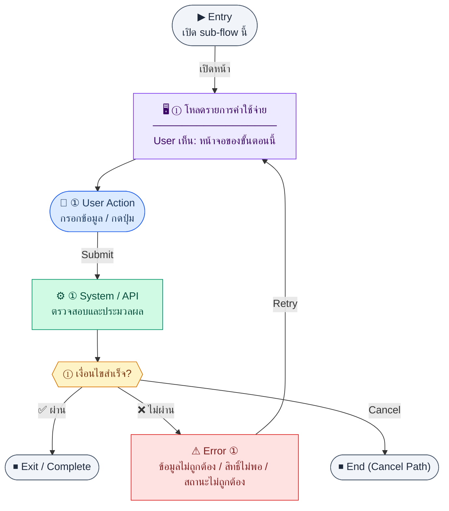

# ExpenseList

คู่มือแปลง UX → spec: [`../../UX_TO_UI_SPEC_WORKFLOW.md`](../../UX_TO_UI_SPEC_WORKFLOW.md)

**Route:** `/pm/expenses`

---

## Metadata

| Key | Value |
|-----|--------|
| **UX flow** | [`R1-12_PM_Expense_Management.md`](../../../UX_Flow/Functions/R1-12_PM_Expense_Management.md) |
| **UX sub-flow / steps** | สรุปใน Appendix — แตกตามหัวข้อ Sub-flow / Step ในเอกสาร UX |
| **Design system** | [`design-system.md`](../../design-system.md) — §3 Page layout, §5 forms, §6 DataTable ตามประเภทหน้า |
| **Global FE behaviors** | [`_GLOBAL_FRONTEND_BEHAVIORS.md`](../../../UX_Flow/_GLOBAL_FRONTEND_BEHAVIORS.md) |
| **Preview** | [`ExpenseList.preview.html`](./ExpenseList.preview.html) · [`../_Shared/preview-base.css`](../_Shared/preview-base.css) · [`MD_TO_PREVIEW_HTML_MANUAL.md`](../MD_TO_PREVIEW_HTML_MANUAL.md) |

---

## เป้าหมายหน้าจอ

ให้ผู้ใช้เห็นภาพรวมค่าใช้จ่ายและกรองตามงานประจำวัน

## ผู้ใช้และสิทธิ์

อ่าน Actor(s) และ permission gate ใน Appendix / เอกสาร UX — กรณี 401/403/409 อ้าง Global FE behaviors

## โครง layout (สรุป)

ระบุตามประเภทหน้าใน Appendix: list / detail / form / แท็บ — ใช้ pattern ใน design-system.md

## เนื้อหาและฟิลด์

สกัดจาก **User sees** / **User Action** / ช่องกรอกใน Appendix เป็นตารางฟิลด์เต็มเมื่อปรับแต่งรอบถัดไป; ขณะนี้ใช้บล็อก UX ด้านล่างเป็นข้อมูลอ้างอิงครบถ้วน

## การกระทำ (CTA)

สกัดจากปุ่มใน Appendix (`[...]`) และ Frontend behavior

## สถานะพิเศษ

Loading, empty, error, validation, dependency ขณะลบ — ตาม **Error** / **Success** ใน Appendix

## หมายเหตุ implementation (ถ้ามี)

เทียบ `erp_frontend` เมื่อทราบ path ของหน้า

## Preview HTML notes

| หัวข้อ | ใส่อะไร |
|--------|--------|
| **Shell** | โดยมาก `app` (ยกเว้นหน้า login / standalone) |
| **Regions** | ดูลำดับ **User sees** ใน Appendix |
| **สถานะสำหรับสลับใน preview** | `default` · `loading` · `empty` · `error` ตาม UX |
| **ข้อมูลจำลอง** | จำนวนแถว / สถานะ badge ตามประเภทหน้า |
| **ลิงก์ CSS** | [`../_Shared/preview-base.css`](../_Shared/preview-base.css) |

---

## Appendix — UX excerpt (reference)

## Sub-flow A — รายการและตัวกรอง (List)

### Scenario Flow

### สัญลักษณ์ Node (Color Legend)

| สี | Node shape | หมายถึง |
|----|-----------|---------|
| 🟣 ม่วง | สี่เหลี่ยม `["…"]` | **Screen / UI State** |
| 🔵 น้ำเงิน | วงกลม `(["…"])` | **User Action** |
| 🟢 เขียว | สี่เหลี่ยม `["…"]` | **System / API** |
| 🟡 เหลือง | เพชร `{{"…"}}` | **Decision** |
| 🔴 แดง | สี่เหลี่ยม `["…"]` | **Error / Edge case** |
| ⚫ เทา | วงรี `(["…"])` | **Start / End** |

---

### Step A1 — โหลดรายการค่าใช้จ่าย

**Goal:** ให้ผู้ใช้เห็นภาพรวมค่าใช้จ่ายและกรองตามงานประจำวัน

**User sees:** การ์ดสถิติ (ถ้า UI ออกแบบจากข้อมูล list), ตาราง sortable, ตัวกรองสถานะ/ช่วงวันที่/งบ (ตามที่ BE รองรับ)

**User can do:** ค้นหา, เปลี่ยนหน้า, เปิดรายละเอียด, สร้างใหม่

**User Action:**
- ประเภท: `กรอกข้อมูล / เลือกตัวเลือก`
- ช่องที่ใช้กรอง/ค้นหา:
  - `search` *(optional)* : ค้นหาจาก `expenseCode` หรือ `title`
  - `status` *(optional)* : draft, submitted, approved, rejected
  - `dateFrom` *(optional)* : วันเริ่มช่วงค่าใช้จ่าย
  - `dateTo` *(optional)* : วันสิ้นสุดช่วงค่าใช้จ่าย
  - `budgetId` *(optional)* : งบที่ผูก
- ปุ่ม / Controls ในหน้านี้:
  - `[Apply Filters]` → โหลดรายการค่าใช้จ่าย
  - `[Create Expense]` → เปิดฟอร์มสร้าง
  - `[Open Expense]` → ไปหน้ารายละเอียด

**Frontend behavior:**

- `GET /api/pm/expenses` พร้อม query สำหรับ pagination/filter/date range ตามสัญญา API
- แสดง `expenseCode`, `title`, `amount`, `expenseDate`, `status`, งบที่ผูก

**System / AI behavior:** ดึง `pm_expenses` + join งบเมื่อจำเป็น

**Success:** แสดงรายการและ meta ครบ

**Error:** 401/403/500 — จัดการเหมือนมาตรฐานแอป

**Notes:** BR ระบุให้แจ้งเตือนถ้าค่าใช้จ่ายทำให้เกินงบ — canonical source คือ `warnings[]` จาก server; FE ไม่คำนวณ over-budget state เอง

---

---

## หมายเหตุ implementation (erp_frontend / ของเดิม)

(erp_frontend / ของเดิม)

(erp_frontend / ของเดิม)

(erp_frontend / ของเดิม)

## 1) Layout

- Root: `space-y-4`
- `PageHeader` — ปุ่ม primary + `Plus` → `/pm/expenses/new`
- Error banner
- คำอธิบาย sort `text-xs text-muted-foreground` (`expense.sortByColumn`)

### Stat cards (4)

- `grid sm:grid-cols-2 lg:grid-cols-4` — นับจำนวนตาม status จากรายการปัจจุบัน (Draft, Pending Approval, Approved, Paid) — label hard-code อังกฤษในโค้ด

### Search

- `rounded-xl border bg-card p-4` + search input (icon ซ้าย)

### ตาราง

- `rounded-xl border bg-card`, loading กลางจอ
- Header บางคอลัมน์เป็นปุ่ม sort (`SortHeader`) พร้อมลูกศร ↑↓
- คอลัมน์: id, title, budgetId (ข้อความสี primary), amount, category, date, requestedBy, status (`StatusBadge outline`), actions
- Actions: ลิงก์ icon `Eye` → `/pm/expenses/:id`; ถ้า status เป็น `Draft` แสดง `Edit2` ไป path เดียวกัน (โค้ดปัจจุบันใช้ id เดียวกันทั้ง view/edit)

---

## 2) Preview

[ExpenseList.preview.html](./ExpenseList.preview.html) · [`../_Shared/preview-base.css`](../_Shared/preview-base.css)
