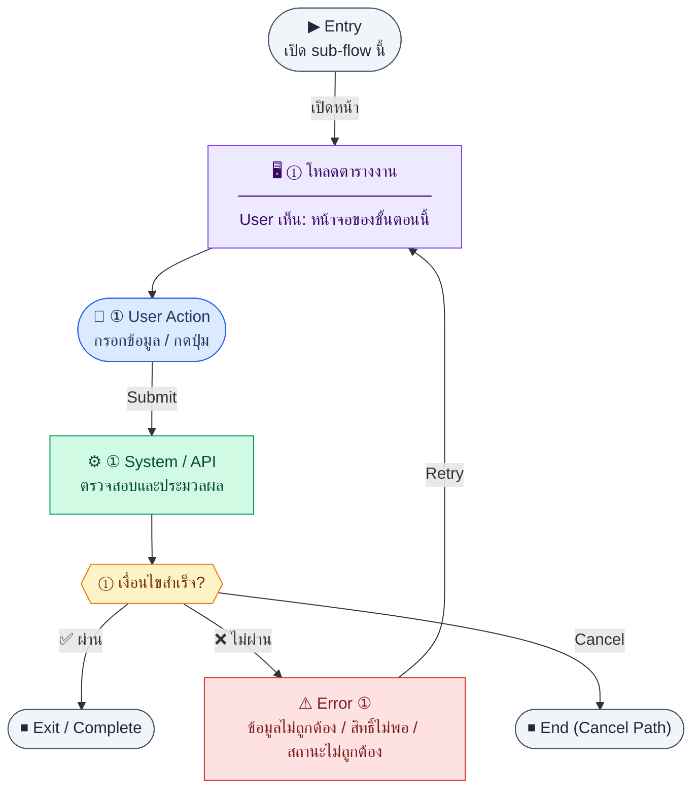

# ProgressList

คู่มือแปลง UX → spec: [`../../UX_TO_UI_SPEC_WORKFLOW.md`](../../UX_TO_UI_SPEC_WORKFLOW.md)

**Route:** `/pm/progress`

---

## Metadata

| Key | Value |
|-----|--------|
| **UX flow** | [`R1-13_PM_Progress_Tasks.md`](../../../UX_Flow/Functions/R1-13_PM_Progress_Tasks.md) |
| **UX sub-flow / steps** | สรุปใน Appendix — แตกตามหัวข้อ Sub-flow / Step ในเอกสาร UX |
| **Design system** | [`design-system.md`](../../design-system.md) — §3 Page layout, §5 forms, §6 DataTable ตามประเภทหน้า |
| **Global FE behaviors** | [`_GLOBAL_FRONTEND_BEHAVIORS.md`](../../../UX_Flow/_GLOBAL_FRONTEND_BEHAVIORS.md) |
| **Preview** | [`ProgressList.preview.html`](./ProgressList.preview.html) · [`../_Shared/preview-base.css`](../_Shared/preview-base.css) · [`MD_TO_PREVIEW_HTML_MANUAL.md`](../MD_TO_PREVIEW_HTML_MANUAL.md) |

---

## เป้าหมายหน้าจอ

แสดงรายการงานพร้อมค้นหาและกรอง

## ผู้ใช้และสิทธิ์

อ่าน Actor(s) และ permission gate ใน Appendix / เอกสาร UX — กรณี 401/403/409 อ้าง Global FE behaviors

## โครง layout (สรุป)

ระบุตามประเภทหน้าใน Appendix: list / detail / form / แท็บ — ใช้ pattern ใน design-system.md

## เนื้อหาและฟิลด์

สกัดจาก **User sees** / **User Action** / ช่องกรอกใน Appendix เป็นตารางฟิลด์เต็มเมื่อปรับแต่งรอบถัดไป; ขณะนี้ใช้บล็อก UX ด้านล่างเป็นข้อมูลอ้างอิงครบถ้วน

## การกระทำ (CTA)

สกัดจากปุ่มใน Appendix (`[...]`) และ Frontend behavior

## สถานะพิเศษ

Loading, empty, error, validation, dependency ขณะลบ — ตาม **Error** / **Success** ใน Appendix

## หมายเหตุ implementation (ถ้ามี)

เทียบ `erp_frontend` เมื่อทราบ path ของหน้า

## Preview HTML notes

| หัวข้อ | ใส่อะไร |
|--------|--------|
| **Shell** | โดยมาก `app` (ยกเว้นหน้า login / standalone) |
| **Regions** | ดูลำดับ **User sees** ใน Appendix |
| **สถานะสำหรับสลับใน preview** | `default` · `loading` · `empty` · `error` ตาม UX |
| **ข้อมูลจำลอง** | จำนวนแถว / สถานะ badge ตามประเภทหน้า |
| **ลิงก์ CSS** | [`../_Shared/preview-base.css`](../_Shared/preview-base.css) |

---

## Appendix — UX excerpt (reference)

## Sub-flow B — รายการงาน (List)

### Scenario Flow

### สัญลักษณ์ Node (Color Legend)

| สี | Node shape | หมายถึง |
|----|-----------|---------|
| 🟣 ม่วง | สี่เหลี่ยม `["…"]` | **Screen / UI State** |
| 🔵 น้ำเงิน | วงกลม `(["…"])` | **User Action** |
| 🟢 เขียว | สี่เหลี่ยม `["…"]` | **System / API** |
| 🟡 เหลือง | เพชร `{{"…"}}` | **Decision** |
| 🔴 แดง | สี่เหลี่ยม `["…"]` | **Error / Edge case** |
| ⚫ เทา | วงรี `(["…"])` | **Start / End** |

---

### Step B1 — โหลดตารางงาน

**Goal:** แสดงรายการงานพร้อมค้นหาและกรอง

**User sees:** ตารางงาน, ช่องค้นหา, ตัวกรอง `status`, `priority`, `assigneeId`, `projectId`, pagination

**User can do:** เรียง/กรอง, เปิดแก้ไข, เปลี่ยนสถานะด่วน, อัปเดต % จาก inline (ถ้ามีใน UI)

**User Action:**
- ประเภท: `กรอกข้อมูล / เลือกตัวเลือก`
- ช่องที่ใช้กรอง/ค้นหา:
  - `search` *(optional)* : ค้นหาจาก task title
  - `status` *(optional)* : todo, in_progress, done, cancelled
  - `priority` *(optional)* : low, medium, high
  - `assigneeId` *(optional)* : ผู้รับผิดชอบ
  - `projectId` *(optional)* : โครงการ
- ปุ่ม / Controls ในหน้านี้:
  - `[Apply Filters]` → โหลดรายการงาน
  - `[Open Task]` → ไปหน้ารายละเอียด/แก้ไข
  - `[Create Task]` → เปิดฟอร์มสร้าง

**Frontend behavior:** `GET /api/pm/progress` query `page`, `limit`, `search`, `status`, `priority`, `assigneeId`, `projectId`, `sortBy?`, `sortOrder?`

**System / AI behavior:** SELECT + count

**Success:** แสดงรายการและ meta

**Error:** มาตรฐานเดียวกับแอป

**Notes:** overdue คำนวณที่ BE หรือฝั่งแสดงผลจาก `dueDate` + `status` ตาม BR

---

---

## หมายเหตุ implementation (erp_frontend / ของเดิม)

(erp_frontend / ของเดิม)

(erp_frontend / ของเดิม)

(erp_frontend / ของเดิม)

## 1) Layout

- Root: `space-y-4`
- `PageHeader` — ปุ่ม primary + `Plus` → `/pm/progress/new`
- Error banner ถ้า tasks query error

### Module summary card

- `section rounded-xl border bg-card p-5`
- หัวข้อ + ปุ่ม retry เมื่อ summary error (`RefreshCw`)
- States: loading กลาง, error ข้อความ, empty, หรือ grid 2–4 คอลัมน์ของแต่ละ module พร้อม progress bar `h-2`

### Search

- `rounded-xl border bg-card p-4` + search + icon

### ตาราง tasks

- `rounded-xl border bg-card`, loading กลาง
- คอลัมน์: id, title, module, phase, status (`StatusBadge outline`), priority, progress (bar + %), assignee, actions
- Actions: ลิงก์ `common:action.edit` → `/pm/progress/:id/edit`

---

## 2) Preview

[ProgressList.preview.html](./ProgressList.preview.html) · [`../_Shared/preview-base.css`](../_Shared/preview-base.css)
