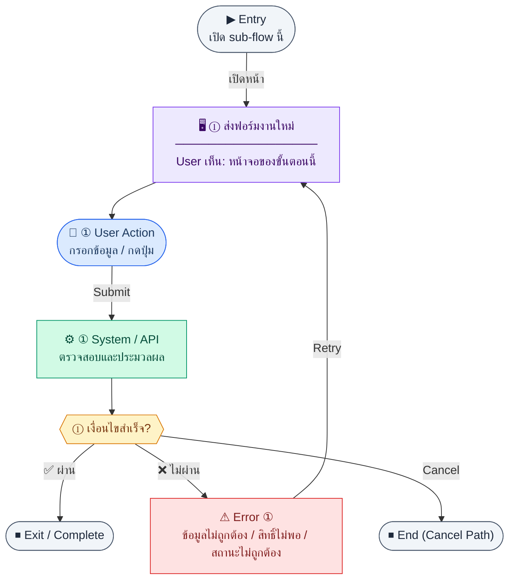

# TaskForm

คู่มือแปลง UX → spec: [`../../UX_TO_UI_SPEC_WORKFLOW.md`](../../UX_TO_UI_SPEC_WORKFLOW.md)

**Route:** `/pm/progress/new`

---

## Metadata

| Key | Value |
|-----|--------|
| **UX flow** | [`R1-13_PM_Progress_Tasks.md`](../../../UX_Flow/Functions/R1-13_PM_Progress_Tasks.md) |
| **UX sub-flow / steps** | สรุปใน Appendix — แตกตามหัวข้อ Sub-flow / Step ในเอกสาร UX |
| **Design system** | [`design-system.md`](../../design-system.md) — §3 Page layout, §5 forms, §6 DataTable ตามประเภทหน้า |
| **Global FE behaviors** | [`_GLOBAL_FRONTEND_BEHAVIORS.md`](../../../UX_Flow/_GLOBAL_FRONTEND_BEHAVIORS.md) |
| **Preview** | [`TaskForm.preview.html`](./TaskForm.preview.html) · [`../_Shared/preview-base.css`](../_Shared/preview-base.css) · [`MD_TO_PREVIEW_HTML_MANUAL.md`](../MD_TO_PREVIEW_HTML_MANUAL.md) |

---

## เป้าหมายหน้าจอ

สร้าง task ใหม่พร้อมมอบหมายและลิงก์งบ (ถ้ามี)

## ผู้ใช้และสิทธิ์

อ่าน Actor(s) และ permission gate ใน Appendix / เอกสาร UX — กรณี 401/403/409 อ้าง Global FE behaviors

## โครง layout (สรุป)

ระบุตามประเภทหน้าใน Appendix: list / detail / form / แท็บ — ใช้ pattern ใน design-system.md

## เนื้อหาและฟิลด์

สกัดจาก **User sees** / **User Action** / ช่องกรอกใน Appendix เป็นตารางฟิลด์เต็มเมื่อปรับแต่งรอบถัดไป; ขณะนี้ใช้บล็อก UX ด้านล่างเป็นข้อมูลอ้างอิงครบถ้วน

## การกระทำ (CTA)

สกัดจากปุ่มใน Appendix (`[...]`) และ Frontend behavior

## สถานะพิเศษ

Loading, empty, error, validation, dependency ขณะลบ — ตาม **Error** / **Success** ใน Appendix

## หมายเหตุ implementation (ถ้ามี)

เทียบ `erp_frontend` เมื่อทราบ path ของหน้า

## Preview HTML notes

| หัวข้อ | ใส่อะไร |
|--------|--------|
| **Shell** | โดยมาก `app` (ยกเว้นหน้า login / standalone) |
| **Regions** | ดูลำดับ **User sees** ใน Appendix |
| **สถานะสำหรับสลับใน preview** | `default` · `loading` · `empty` · `error` ตาม UX |
| **ข้อมูลจำลอง** | จำนวนแถว / สถานะ badge ตามประเภทหน้า |
| **ลิงก์ CSS** | [`../_Shared/preview-base.css`](../_Shared/preview-base.css) |

---

## Appendix — UX excerpt (reference)

## Sub-flow C — สร้างงาน (Create)

### Scenario Flow

### สัญลักษณ์ Node (Color Legend)

| สี | Node shape | หมายถึง |
|----|-----------|---------|
| 🟣 ม่วง | สี่เหลี่ยม `["…"]` | **Screen / UI State** |
| 🔵 น้ำเงิน | วงกลม `(["…"])` | **User Action** |
| 🟢 เขียว | สี่เหลี่ยม `["…"]` | **System / API** |
| 🟡 เหลือง | เพชร `{{"…"}}` | **Decision** |
| 🔴 แดง | สี่เหลี่ยม `["…"]` | **Error / Edge case** |
| ⚫ เทา | วงรี `(["…"])` | **Start / End** |

---

### Step C1 — ส่งฟอร์มงานใหม่

**Goal:** สร้าง task ใหม่พร้อมมอบหมายและลิงก์งบ (ถ้ามี)

**User sees:** `/pm/progress/new` — title, description, priority, status เริ่มต้น, วันที่, assignee, budget ไม่บังคับ

**User can do:** เลือก assignee จากรายการพนักงาน active (ข้อมูลจาก HR API ตามดีไซน์แอป), เลือกงบจาก `GET /api/pm/budgets` ถ้าต้องการลิงก์, บันทึกงาน

**User Action:**
- ประเภท: `กรอกข้อมูล / เลือกตัวเลือก`
- ช่องที่ต้องกรอก:
  - `title` *(required)* : ชื่องาน
  - `description` *(optional)* : รายละเอียดงาน
  - `priority` *(optional)* : ระดับความสำคัญ
  - `assigneeId` *(optional)* : ผู้รับผิดชอบ
  - `startDate` *(optional)* : วันเริ่ม
  - `dueDate` *(optional)* : วันครบกำหนด
  - `budgetId` *(optional)* : งบที่ลิงก์
- ปุ่ม / Controls ในหน้านี้:
  - `[Create Task]` → เรียก `POST /api/pm/progress`
  - `[Cancel]` → ยกเลิกการสร้าง

**Frontend behavior:**

- validate ฟิลด์บังคับและช่วงวันที่
- `POST /api/pm/progress` body เช่น `{ "title", "assigneeId", ... }` ตามสัญญา

**System / AI behavior:** INSERT `pm_progress_tasks`; BR กำหนด assignee ต้องเป็น active employee

**Success:** 201 พร้อม `id`

**Error:** 400 (assignee ไม่ active), 403

**Notes:** —

---

---

## หมายเหตุ implementation (erp_frontend / ของเดิม)

(erp_frontend / ของเดิม)

(erp_frontend / ของเดิม)

(erp_frontend / ของเดิม)

## 1) Form

- `react-hook-form` + `zod`
- ฟิลด์: title, module, phase, status (enum 5 ค่า), priority (High/Medium/Low), progressPct 0–100, startDate, targetDate, assigneeName
- Default ในโค้ด: module `HR`, phase `Development`, status `Not Started`, priority `Medium`, progress 0

---

## 2) Layout

- Root: `mx-auto max-w-2xl space-y-4`
- `Breadcrumb` — progress list → สร้าง/แก้ไขงาน
- `PageHeader`
- `form space-y-6`:
  - Section `rounded-xl border bg-card` + header `progress.formSection`
  - Grid: title เต็มแถว; module, phase; status, priority; progress %; start, target dates; assignee เต็มแถว
  - Footer: Cancel / Save primary

---

## 3) Navigation

- สำเร็จ → `/pm/progress`

---

## 4) Preview

[TaskForm.preview.html](./TaskForm.preview.html) · [`../_Shared/preview-base.css`](../_Shared/preview-base.css)
