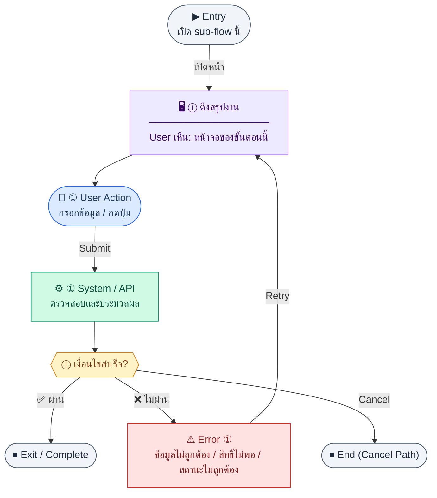

# Dashboard

คู่มือแปลง UX → spec: [`../../UX_TO_UI_SPEC_WORKFLOW.md`](../../UX_TO_UI_SPEC_WORKFLOW.md)

**Route:** `/pm/dashboard`

---

## Metadata

| Key | Value |
|-----|--------|
| **UX flow** | [`R1-14_PM_Dashboard.md`](../../../UX_Flow/Functions/R1-14_PM_Dashboard.md) |
| **UX sub-flow / steps** | สรุปใน Appendix — แตกตามหัวข้อ Sub-flow / Step ในเอกสาร UX |
| **Design system** | [`design-system.md`](../../design-system.md) — §3 Page layout, §5 forms, §6 DataTable ตามประเภทหน้า |
| **Global FE behaviors** | [`_GLOBAL_FRONTEND_BEHAVIORS.md`](../../../UX_Flow/_GLOBAL_FRONTEND_BEHAVIORS.md) |
| **Preview** | [`Dashboard.preview.html`](./Dashboard.preview.html) · [`../_Shared/preview-base.css`](../_Shared/preview-base.css) · [`MD_TO_PREVIEW_HTML_MANUAL.md`](../MD_TO_PREVIEW_HTML_MANUAL.md) |

---

## เป้าหมายหน้าจอ

แสดงการ์ด KPI งานที่ด้านบนของ dashboard

## ผู้ใช้และสิทธิ์

อ่าน Actor(s) และ permission gate ใน Appendix / เอกสาร UX — กรณี 401/403/409 อ้าง Global FE behaviors

## โครง layout (สรุป)

ระบุตามประเภทหน้าใน Appendix: list / detail / form / แท็บ — ใช้ pattern ใน design-system.md

## เนื้อหาและฟิลด์

สกัดจาก **User sees** / **User Action** / ช่องกรอกใน Appendix เป็นตารางฟิลด์เต็มเมื่อปรับแต่งรอบถัดไป; ขณะนี้ใช้บล็อก UX ด้านล่างเป็นข้อมูลอ้างอิงครบถ้วน

## การกระทำ (CTA)

สกัดจากปุ่มใน Appendix (`[...]`) และ Frontend behavior

## สถานะพิเศษ

Loading, empty, error, validation, dependency ขณะลบ — ตาม **Error** / **Success** ใน Appendix

## หมายเหตุ implementation (ถ้ามี)

เทียบ `erp_frontend` เมื่อทราบ path ของหน้า

## Preview HTML notes

| หัวข้อ | ใส่อะไร |
|--------|--------|
| **Shell** | โดยมาก `app` (ยกเว้นหน้า login / standalone) |
| **Regions** | ดูลำดับ **User sees** ใน Appendix |
| **สถานะสำหรับสลับใน preview** | `default` · `loading` · `empty` · `error` ตาม UX |
| **ข้อมูลจำลอง** | จำนวนแถว / สถานะ badge ตามประเภทหน้า |
| **ลิงก์ CSS** | [`../_Shared/preview-base.css`](../_Shared/preview-base.css) |

---

## Appendix — UX excerpt (reference)

## Sub-flow A — โหลด KPI งาน (Progress summary)

### Scenario Flow

### สัญลักษณ์ Node (Color Legend)

| สี | Node shape | หมายถึง |
|----|-----------|---------|
| 🟣 ม่วง | สี่เหลี่ยม `["…"]` | **Screen / UI State** |
| 🔵 น้ำเงิน | วงกลม `(["…"])` | **User Action** |
| 🟢 เขียว | สี่เหลี่ยม `["…"]` | **System / API** |
| 🟡 เหลือง | เพชร `{{"…"}}` | **Decision** |
| 🔴 แดง | สี่เหลี่ยม `["…"]` | **Error / Edge case** |
| ⚫ เทา | วงรี `(["…"])` | **Start / End** |

---

### Step A1 — ดึงสรุปงาน

**Goal:** แสดงการ์ด KPI งานที่ด้านบนของ dashboard

**User sees:** ตัวเลข total, แยกสถานะ, `avgProgressPct`, `overdueCount` ฯลฯ

**User can do:** (ถ้ามี filter) เลือก scope โครงการ/ผู้รับผิดชอบ

**User Action:**
- ประเภท: `เลือกตัวเลือก / กดปุ่ม`
- ช่องที่ใช้กรอง:
  - `projectId` *(optional)* : scope โครงการ
  - `assigneeId` *(optional)* : ผู้รับผิดชอบ
  - `dateFrom` *(optional)* : วันเริ่มช่วงสรุป
  - `dateTo` *(optional)* : วันสิ้นสุดช่วงสรุป
  - `budgetId` *(optional)* : scope งบ
- ปุ่ม / Controls ในหน้านี้:
  - `[Refresh Widget]` → โหลด KPI งานใหม่
  - `[Open Tasks Dashboard]` → ไปหน้ารายการงาน

**Frontend behavior:** `GET /api/pm/progress/summary` query `projectId`, `assigneeId`, `dateFrom`, `dateTo`, `budgetId` ตาม SD_Flow

**System / AI behavior:** aggregate `pm_progress_tasks`

**Success:** widget งานแสดงครบ

**Error:** แสดง empty/error state ต่อ widget ไม่ให้ทั้งหน้าขาว

**Notes:** ควร cache สั้น ๆ และ refresh เมื่อผู้ใช้กด "รีเฟรช" หรือกลับเข้าหน้า

---

---

## หมายเหตุ implementation (erp_frontend / ของเดิม)

(erp_frontend / ของเดิม)

(erp_frontend / ของเดิม)

(erp_frontend / ของเดิม)

## 1) Layout

- Root: `space-y-6`
- ถ้า error จาก summary/budgets: แถบ destructive `loadError`

### KPI cards (`grid gap-4 sm:grid-cols-2 lg:grid-cols-4`)

- การ์ดละ `rounded-xl border bg-card p-4`
- ไอคอนในกล่องสี (`DollarSign`, `TrendingUp`, `CheckCircle`, `Clock`) พื้นหลังสี hard-coded (blue/green/indigo/yellow) + dark mode classes
- ตัวเลขหลัก `text-xl font-bold`, label/sub `text-xs text-muted-foreground`

### Module progress section

- `rounded-xl border bg-card` — header `border-b bg-muted/40 px-5 py-3`
- Body: แต่ละ module มี progress bar `h-3 rounded-full bg-muted` + fill `bg-primary`, ข้อความ done/task count

### สองคอลัมน์ (`grid lg:grid-cols-2`)

1. **Recent tasks** — header + ลิงก์ `viewAll` ไป `/pm/progress`, รายการ `divide-y` หรือ empty state
2. **Budget overview** — header + ลิงก์ `/pm/budgets`, รายการ budget พร้อม progress bar แนวนอน (`h-1.5`) และ `StatusBadge outline`

---

## 2) Component tree

1. (Optional error banner)  
2. KPI row  
3. Module progress card  
4. Two-column tasks + budgets

---

## 3) Preview

[Dashboard.preview.html](./Dashboard.preview.html) · [`../_Shared/preview-base.css`](../_Shared/preview-base.css)
