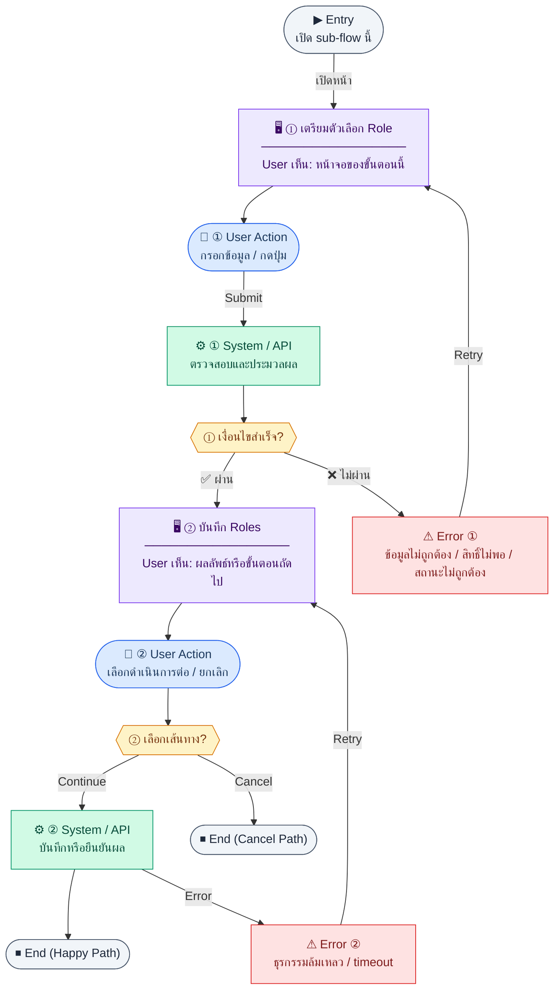

# Users

คู่มือแปลง UX → spec: [`../../UX_TO_UI_SPEC_WORKFLOW.md`](../../UX_TO_UI_SPEC_WORKFLOW.md)

**Route:** `/settings/users`

---

## Metadata

| Key | Value |
|-----|--------|
| **UX flow** | [`R1-15_Settings_User_Management.md`](../../../UX_Flow/Functions/R1-15_Settings_User_Management.md) |
| **UX sub-flow / steps** | สรุปใน Appendix — แตกตามหัวข้อ Sub-flow / Step ในเอกสาร UX |
| **Design system** | [`design-system.md`](../../design-system.md) — §3 Page layout, §5 forms, §6 DataTable ตามประเภทหน้า |
| **Global FE behaviors** | [`_GLOBAL_FRONTEND_BEHAVIORS.md`](../../../UX_Flow/_GLOBAL_FRONTEND_BEHAVIORS.md) |
| **Preview** | [`Users.preview.html`](./Users.preview.html) · [`../_Shared/preview-base.css`](../_Shared/preview-base.css) · [`MD_TO_PREVIEW_HTML_MANUAL.md`](../MD_TO_PREVIEW_HTML_MANUAL.md) |

---

## เป้าหมายหน้าจอ

ให้ผู้ดูแลเลือก role ได้จากชุดที่ถูกต้องในระบบ

## ผู้ใช้และสิทธิ์

อ่าน Actor(s) และ permission gate ใน Appendix / เอกสาร UX — กรณี 401/403/409 อ้าง Global FE behaviors

## โครง layout (สรุป)

ระบุตามประเภทหน้าใน Appendix: list / detail / form / แท็บ — ใช้ pattern ใน design-system.md

## เนื้อหาและฟิลด์

สกัดจาก **User sees** / **User Action** / ช่องกรอกใน Appendix เป็นตารางฟิลด์เต็มเมื่อปรับแต่งรอบถัดไป; ขณะนี้ใช้บล็อก UX ด้านล่างเป็นข้อมูลอ้างอิงครบถ้วน

## การกระทำ (CTA)

สกัดจากปุ่มใน Appendix (`[...]`) และ Frontend behavior

## สถานะพิเศษ

Loading, empty, error, validation, dependency ขณะลบ — ตาม **Error** / **Success** ใน Appendix

## หมายเหตุ implementation (ถ้ามี)

เทียบ `erp_frontend` เมื่อทราบ path ของหน้า

## Preview HTML notes

| หัวข้อ | ใส่อะไร |
|--------|--------|
| **Shell** | โดยมาก `app` (ยกเว้นหน้า login / standalone) |
| **Regions** | ดูลำดับ **User sees** ใน Appendix |
| **สถานะสำหรับสลับใน preview** | `default` · `loading` · `empty` · `error` ตาม UX |
| **ข้อมูลจำลอง** | จำนวนแถว / สถานะ badge ตามประเภทหน้า |
| **ลิงก์ CSS** | [`../_Shared/preview-base.css`](../_Shared/preview-base.css) |

---

## Appendix — UX excerpt (reference)

## Sub-flow B — มอบหมาย Roles ให้ผู้ใช้

### Scenario Flow

### สัญลักษณ์ Node (Color Legend)

| สี | Node shape | หมายถึง |
|----|-----------|---------|
| 🟣 ม่วง | สี่เหลี่ยม `["…"]` | **Screen / UI State** |
| 🔵 น้ำเงิน | วงกลม `(["…"])` | **User Action** |
| 🟢 เขียว | สี่เหลี่ยม `["…"]` | **System / API** |
| 🟡 เหลือง | เพชร `{{"…"}}` | **Decision** |
| 🔴 แดง | สี่เหลี่ยม `["…"]` | **Error / Edge case** |
| ⚫ เทา | วงรี `(["…"])` | **Start / End** |

---

### Step B1 — เตรียมตัวเลือก Role

**Goal:** ให้ผู้ดูแลเลือก role ได้จากชุดที่ถูกต้องในระบบ

**User sees:** multi-select หรือ checklist ของ roles

**User can do:** เลือก/ยกเลิก role หลายรายการ

**User Action:**
- ประเภท: `เลือกตัวเลือก`
- ช่องที่ต้องเลือก:
  - `roleIds[]` *(required)* : รายการ role ที่ต้องมอบหมาย
- ปุ่ม / Controls ในหน้านี้:
  - `[Save Role Selection]` → ไปขั้นตอนบันทึก
  - `[Cancel]` → ปิด modal

**Frontend behavior:**

- โหลด `GET /api/settings/roles` เพื่อเติมตัวเลือก (endpoint เดียวกับหน้า role management แต่ใช้เฉพาะโหมด list สำหรับ dropdown)
- แยก role ระบบที่แก้ไม่ได้ (`isSystem`) ใน UI ถ้า BR ต้องการควบคุมการมอบหมาย `super_admin`

**System / AI behavior:** ส่งรายการ roles ที่ผู้เรียกมีสิทธิ์เห็น

**Success:** ตัวเลือกพร้อม

**Error:** โหลด roles ไม่ได้ → ไม่เปิด modal มอบหมาย และแจ้ง error

**Notes:** BR กำหนดห้ามเปลี่ยน roles ของ `super_admin`

### Step B2 — บันทึก Roles

**Goal:** persist การมอบหมาย roles ให้ user เป้าหมาย

**User sees:** ปุ่มบันทึก, loading, toast สำเร็จ/ล้มเหลว

**User can do:** ยืนยันการบันทึก

**User Action:**
- ประเภท: `กดปุ่ม`
- ปุ่ม / Controls ในหน้านี้:
  - `[Assign Roles]` → เรียก `PATCH /api/settings/users/:id/roles`
  - `[Retry Save]` → ลองบันทึก role ใหม่
  - `[Cancel]` → ยกเลิก

**Frontend behavior:**

- `PATCH /api/settings/users/:id/roles` พร้อม body ตามสัญญา (เช่นรายการ `roleIds`)
- optimistic update เป็น optional; ถ้าไม่ใช้ ให้ refresh `GET /api/settings/users` หลังสำเร็จ

**System / AI behavior:** อัปเดต `user_roles`, validate กฎพิเศษ super_admin, อาจบันทึก `permission_audit_logs` เมื่อมีผลต่อสิทธิ์ (ตามการออกแบบ BE)

**Success:** 200; ตารางสะท้อน roles ใหม่

**Error:** 403 พยายามแก้ super_admin, 400 body ไม่ถูกต้อง

**Notes:** ผู้ใช้ที่ถูกเปลี่ยน roles อาจต้อง refresh session — optional UX: แจ้งว่า "มีผลในการเข้าใช้ครั้งถัดไป" หรือบังคับ logout ฝั่ง client หากได้รับสัญญาณจาก BE

---

---

## หมายเหตุ implementation (erp_frontend / ของเดิม)

(erp_frontend / ของเดิม)

(erp_frontend / ของเดิม)

(erp_frontend / ของเดิม)

## 1) Layout

- Root: `space-y-4`
- `PageHeader` — title + description (`users.description`) + **ปุ่ม "เพิ่มผู้ใช้"** (เปิด modal สร้างบัญชี — `POST /api/settings/users`, เลือกพนักงานจาก `GET /api/hr/employees` โดยอาจ filter `hasUserAccount=false`)
- Error banner ถ้าโหลดล้มเหลว
- **ตาราง:** `rounded-xl border bg-card`
  - Loading: กลาง card
  - มิฉะนั้น `table` — email, name, roles (comma), status (`StatusBadge` active=success / inactive=destructive), Actions
- **Actions ต่อแถว (`UserActions`):**
  - `select` เลือก role หลักตัวแรก (`h-8 min-w-36 text-xs`) — sync ผ่าน API
  - Checkbox Active — sync ผ่าน API
- **Modal สร้างผู้ใช้ (ถ้ามี):** ฟิลด์ email, password, optional mustChangePassword, employee select (required), optional roles multi-select; ปุ่มบันทึกเรียก `POST /api/settings/users`

---

## 2) Preview

[Users.preview.html](./Users.preview.html) · [`../_Shared/preview-base.css`](../_Shared/preview-base.css)
