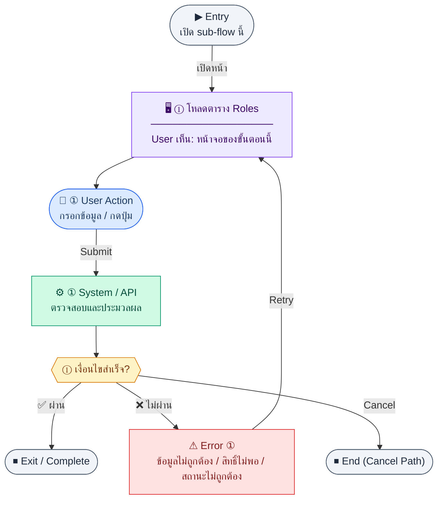

# Roles

คู่มือแปลง UX → spec: [`../../UX_TO_UI_SPEC_WORKFLOW.md`](../../UX_TO_UI_SPEC_WORKFLOW.md)

**Route:** `/settings/roles`

---

## Metadata

| Key | Value |
|-----|--------|
| **UX flow** | [`R1-16_Settings_Role_and_Permission.md`](../../../UX_Flow/Functions/R1-16_Settings_Role_and_Permission.md) |
| **UX sub-flow / steps** | สรุปใน Appendix — แตกตามหัวข้อ Sub-flow / Step ในเอกสาร UX |
| **Design system** | [`design-system.md`](../../design-system.md) — §3 Page layout, §5 forms, §6 DataTable ตามประเภทหน้า |
| **Global FE behaviors** | [`_GLOBAL_FRONTEND_BEHAVIORS.md`](../../../UX_Flow/_GLOBAL_FRONTEND_BEHAVIORS.md) |
| **Preview** | [`Roles.preview.html`](./Roles.preview.html) · [`../_Shared/preview-base.css`](../_Shared/preview-base.css) · [`MD_TO_PREVIEW_HTML_MANUAL.md`](../MD_TO_PREVIEW_HTML_MANUAL.md) |
| **UI specs ที่เกี่ยวข้อง** | [`RoleCreate.md`](./RoleCreate.md) (สร้าง role) · [`RoleDelete.md`](./RoleDelete.md) (ลบ role — modal) |

---

## เป้าหมายหน้าจอ

แสดง roles ทั้งหมดพร้อมจำนวน permission และแยก system vs custom

## ผู้ใช้และสิทธิ์

อ่าน Actor(s) และ permission gate ใน Appendix / เอกสาร UX — กรณี 401/403/409 อ้าง Global FE behaviors

## โครง layout (สรุป)

`PageHeader` (หัวข้อ + คำอธิบาย) ชิดขวา **`[Create Role]`** → การ์ด **ตัวกรอง** (`search`, `isSystem`) + **ตารางรายการ roles** (ชื่อ, badge ประเภท, จำนวน permission, แถวปุ่มแก้ไข / matrix / ลบ) → การ์ด **Permission matrix** (checkbox ต่อ role × permission) — ใช้ pattern ใน design-system.md

## เนื้อหาและฟิลด์

### ตัวกรอง (ด้านบนตาราง)

| Field | Required | Notes |
|-------|----------|--------|
| `search` | ไม่ | ค้นจากชื่อ role |
| `isSystem` | ไม่ | แยก system / custom / ทั้งหมด |

### ตารางรายการ roles

| Column | Notes |
|--------|--------|
| ชื่อ role | `font-mono` หรือ style เดียวกับ code |
| ประเภท | badge `System` \| `Custom` จาก `isSystem` |
| จำนวน permission | จาก `GET /api/settings/roles` (หรือ aggregate ตาม BR) |
| การทำงาน | **System:** ไม่แสดงปุ่มแก้ไข/ลบ (หรือ disabled + tooltip ตาม BR) · **Custom:** `[แก้ไข]` · `[Matrix]` / focus matrix · `[ลบ]` → [`RoleDelete.md`](./RoleDelete.md) |

### Matrix (ด้านล่างหรือแท็บตามทีม)

| Element | Notes |
|---------|--------|
| Header คอลัมน์ | ชื่อแต่ละ role ที่แสดงใน matrix |
| แถว permission | checkbox; `super_admin` คอลัมน์ล็อกตาม UX |

## การกระทำ (CTA)

| Control | Behavior |
|---------|----------|
| `[Create Role]` / **+ สร้าง role** | นำทางไป `/settings/roles/new` หรือเปิด modal สร้าง — สเปก [`RoleCreate.md`](./RoleCreate.md) |
| `[Delete Role]` / **ลบ** (แถว custom) | เปิด modal ยืนยัน [`RoleDelete.md`](./RoleDelete.md) → `DELETE /api/settings/roles/:id` |
| `[Open Permission Matrix]` / **Matrix** | เลื่อนโฟกัสไป matrix หรือกรองคอลัมน์ให้เหลือ role นั้น (แล้วแต่ implementation) |
| แก้ไข metadata | [`R1-16` Sub-flow C](../../../UX_Flow/Functions/R1-16_Settings_Role_and_Permission.md) — `PATCH /api/settings/roles/:id` (เฉพาะ non-system) |
| Toggle checkbox ใน matrix | `PUT` / replace permissions ตามสัญญา API (ดู Appendix / SD) |

## สถานะพิเศษ

Loading, empty, error, validation, dependency ขณะลบ — ตาม **Error** / **Success** ใน Appendix

## หมายเหตุ implementation (ถ้ามี)

เทียบ `erp_frontend` เมื่อทราบ path ของหน้า

## Preview HTML notes

| หัวข้อ | ใส่อะไร |
|--------|--------|
| **Shell** | โดยมาก `app` (ยกเว้นหน้า login / standalone) |
| **Regions** | `PageHeader` + ปุ่มสร้าง → ฟิลเตอร์ + ตาราง roles (ปุ่มลบเฉพาะ custom) → การ์ด matrix |
| **สถานะสำหรับสลับใน preview** | `default` · `loading` · `empty` · `error` ตาม UX |
| **ข้อมูลจำลอง** | อย่างน้อย 2 system rows + 1–2 custom rows, badge ประเภท; matrix อย่างน้อย 2 permissions |
| **ลิงก์ mock ข้าม preview** | ปุ่มสร้าง → [`RoleCreate.preview.html`](./RoleCreate.preview.html) · ปุ่มลบ → [`RoleDelete.preview.html`](./RoleDelete.preview.html) |
| **ลิงก์ CSS** | [`../_Shared/preview-base.css`](../_Shared/preview-base.css) |

---

## Appendix — UX excerpt (reference)

## Sub-flow A — รายการ Roles

### Scenario Flow

### สัญลักษณ์ Node (Color Legend)

| สี | Node shape | หมายถึง |
|----|-----------|---------|
| 🟣 ม่วง | สี่เหลี่ยม `["…"]` | **Screen / UI State** |
| 🔵 น้ำเงิน | วงกลม `(["…"])` | **User Action** |
| 🟢 เขียว | สี่เหลี่ยม `["…"]` | **System / API** |
| 🟡 เหลือง | เพชร `{{"…"}}` | **Decision** |
| 🔴 แดง | สี่เหลี่ยม `["…"]` | **Error / Edge case** |
| ⚫ เทา | วงรี `(["…"])` | **Start / End** |

---

### Step A1 — โหลดตาราง Roles

**Goal:** แสดง roles ทั้งหมดพร้อมจำนวน permission และแยก system vs custom

**User sees:** ตาราง roles, badge `isSystem`, จำนวน permissions, ปุ่มแก้ไข/ลบ (เฉพาะ non-system)

**User can do:** เปิดหน้า matrix, สร้าง role ใหม่, แก้ไข/ลบ role ที่อนุญาต

**User Action:**
- ประเภท: `กรอกข้อมูล / เลือกตัวเลือก`
- ช่องที่ใช้กรอง/ค้นหา:
  - `search` *(optional)* : ค้นหาจากชื่อ role
  - `isSystem` *(optional)* : แยก system/custom role
- ปุ่ม / Controls ในหน้านี้:
  - `[Create Role]` → เปิดฟอร์มสร้าง custom role
  - `[Open Permission Matrix]` → เข้า matrix ของ role ที่เลือก
  - `[Delete Role]` → เปิด modal ลบ role ที่ลบได้

**Frontend behavior:** `GET /api/settings/roles`

**System / AI behavior:** รวมข้อมูลนับ permission ต่อ role ตาม BR

**Success:** แสดงรายการครบ

**Error:** 401/403/500

**Notes:** BR ระบุ system roles (`isSystem=true`) เช่น `super_admin`, `hr_admin`, `finance_manager` — ห้ามลบ/แก้ไข

---

---

## หมายเหตุ implementation (erp_frontend / ของเดิม)

(erp_frontend / ของเดิม)

(erp_frontend / ของเดิม)

(erp_frontend / ของเดิม)

## 1) Layout

- Root: `space-y-4`
- `PageHeader` — title + description + ปุ่ม primary **`[Create Role]`** (ลิงก์ไป `/settings/roles/new` หรือเปิด modal ตาม [`RoleCreate.md`](./RoleCreate.md))
- การ์ดรายการ: ตัวกรอง + ตาราง roles — คอลัมน์ actions แสดง **ลบ / แก้ไข** เฉพาะ `isSystem=false`
- Error banner ถ้า roles หรือ permissions โหลดไม่ได้
- Loading / empty: กลาง card ข้อความ
- **Matrix:** `rounded-xl border bg-card p-5`
  - คำอธิบาย `roles.matrixCaption` + `roles.superAdminLocked`
  - ตาราง `overflow-x-auto`, sticky คอลัมน์แรก (permission code `font-mono`)
  - Header แถวบน: ชื่อ role แต่ละตัว
  - แต่ละ permission: checkbox ต่อ role — `super_admin` locked (disabled checked ตามข้อมูลจริง)
  - แสดง `roles.saving` ขณะ mutation

---

## 2) Interaction

- Toggle checkbox → PUT รวม permission ids ของ role นั้น (ยกเว้น super_admin)

---

## 3) Preview

[Roles.preview.html](./Roles.preview.html) · [`../_Shared/preview-base.css`](../_Shared/preview-base.css)
