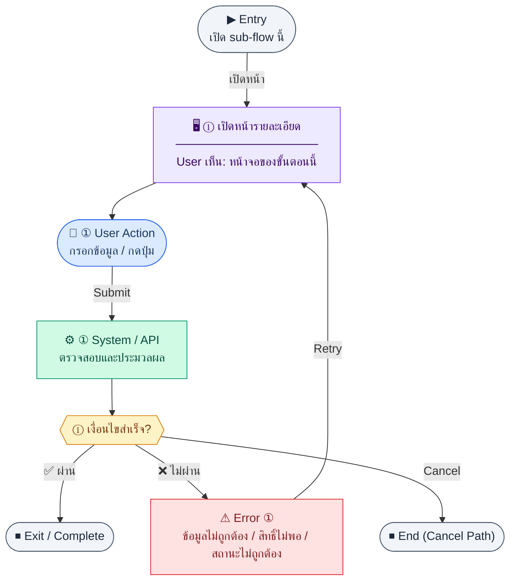

# CustomerDetail

คู่มือแปลง UX → spec: [`../../UX_TO_UI_SPEC_WORKFLOW.md`](../../UX_TO_UI_SPEC_WORKFLOW.md)

**Route:** `/finance/customers/:id`

---

## Metadata

| Key | Value |
|-----|--------|
| **UX flow** | [`R2-01_Customer_Management.md`](../../../UX_Flow/Functions/R2-01_Customer_Management.md) |
| **UX sub-flow / steps** | สรุปใน Appendix — แตกตามหัวข้อ Sub-flow / Step ในเอกสาร UX |
| **Design system** | [`design-system.md`](../../design-system.md) — §3 Page layout, §5 forms, §6 DataTable ตามประเภทหน้า |
| **Global FE behaviors** | [`_GLOBAL_FRONTEND_BEHAVIORS.md`](../../../UX_Flow/_GLOBAL_FRONTEND_BEHAVIORS.md) |
| **Preview** | [`CustomerDetail.preview.html`](./CustomerDetail.preview.html) · [`../_Shared/preview-base.css`](../_Shared/preview-base.css) · [`MD_TO_PREVIEW_HTML_MANUAL.md`](../MD_TO_PREVIEW_HTML_MANUAL.md) |

---

## เป้าหมายหน้าจอ

ดูข้อมูลลูกค้าครบถ้วนและบริบท AR สรุป (ตาม BR: แท็บ invoice history / outstanding)

## ผู้ใช้และสิทธิ์

อ่าน Actor(s) และ permission gate ใน Appendix / เอกสาร UX — กรณี 401/403/409 อ้าง Global FE behaviors

## โครง layout (สรุป)

ระบุตามประเภทหน้าใน Appendix: list / detail / form / แท็บ — ใช้ pattern ใน design-system.md

## เนื้อหาและฟิลด์

สกัดจาก **User sees** / **User Action** / ช่องกรอกใน Appendix เป็นตารางฟิลด์เต็มเมื่อปรับแต่งรอบถัดไป; ขณะนี้ใช้บล็อก UX ด้านล่างเป็นข้อมูลอ้างอิงครบถ้วน

## การกระทำ (CTA)

สกัดจากปุ่มใน Appendix (`[...]`) และ Frontend behavior

## สถานะพิเศษ

Loading, empty, error, validation, dependency ขณะลบ — ตาม **Error** / **Success** ใน Appendix

## หมายเหตุ implementation (ถ้ามี)

เทียบ `erp_frontend` เมื่อทราบ path ของหน้า

## Preview HTML notes

| หัวข้อ | ใส่อะไร |
|--------|--------|
| **Shell** | โดยมาก `app` (ยกเว้นหน้า login / standalone) |
| **Regions** | ดูลำดับ **User sees** ใน Appendix |
| **สถานะสำหรับสลับใน preview** | `default` · `loading` · `empty` · `error` ตาม UX |
| **ข้อมูลจำลอง** | จำนวนแถว / สถานะ badge ตามประเภทหน้า |
| **ลิงก์ CSS** | [`../_Shared/preview-base.css`](../_Shared/preview-base.css) |

---

## Appendix — UX excerpt (reference)

## Sub-flow C — รายละเอียดลูกค้า (Detail)

**กลุ่ม endpoint:** `GET /api/finance/customers/:id`

### Scenario Flow

### สัญลักษณ์ Node (Color Legend)

| สี | Node shape | หมายถึง |
|----|-----------|---------|
| 🟣 ม่วง | สี่เหลี่ยม `["…"]` | **Screen / UI State** |
| 🔵 น้ำเงิน | วงกลม `(["…"])` | **User Action** |
| 🟢 เขียว | สี่เหลี่ยม `["…"]` | **System / API** |
| 🟡 เหลือง | เพชร `{{"…"}}` | **Decision** |
| 🔴 แดง | สี่เหลี่ยม `["…"]` | **Error / Edge case** |
| ⚫ เทา | วงรี `(["…"])` | **Start / End** |

---

### Step C1 — เปิดหน้ารายละเอียด

**Goal:** ดูข้อมูลลูกค้าครบถ้วนและบริบท AR สรุป (ตาม BR: แท็บ invoice history / outstanding)

**User sees:** ฟอร์มอ่านอย่างเดียวหรือ summary cards (ที่อยู่, เลขผู้เสียภาษี, วงเงิน, เครดิตเทอม), แท็บ “ประวัติ Invoice / ยอดค้างชำระ”

**User can do:** สลับแท็บ, กด “แก้ไข”, กลับรายการ

**User Action:**
- ประเภท: `กดปุ่ม`
- ปุ่ม / Controls ในหน้านี้:
  - `[Edit Customer]` → เข้าโหมดแก้ไข
  - `[View Invoice History]` → เปิดแท็บ invoice history
  - `[Back to List]` → กลับหน้ารายการ

**Frontend behavior:**

- เรียก `GET /api/finance/customers/:id` เมื่อเข้า `/finance/customers/:id`
- ถ้า BR กำหนด badge ค้างชำระ → แสดงเมื่อเงื่อนไข overdue เป็นจริงจากข้อมูลที่รวมใน detail หรือจากแท็บที่โหลดแยก

**System / AI behavior:** รวมข้อมูลลูกค้า + สรุป AR ที่ออกแบบไว้ใน API

**Success:** แสดงข้อมูลครบและสอดคล้องกับ list

**Error:** 404 → “ไม่พบลูกค้า”; 403 → ไม่มีสิทธิ์ดู

**Notes:** SD_Flow `customers.md` ระบุ `GET .../:id` เป็น detail endpoint

---
