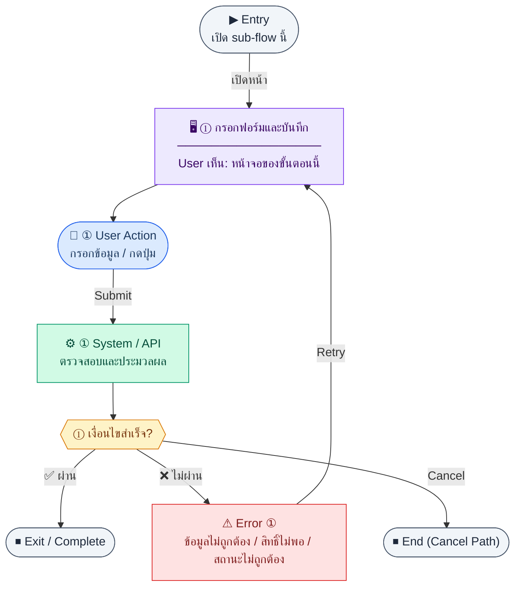

# CustomerForm

คู่มือแปลง UX → spec: [`../../UX_TO_UI_SPEC_WORKFLOW.md`](../../UX_TO_UI_SPEC_WORKFLOW.md)

**Route:** `/finance/customers/new`

---

## Metadata

| Key | Value |
|-----|--------|
| **UX flow** | [`R2-01_Customer_Management.md`](../../../UX_Flow/Functions/R2-01_Customer_Management.md) |
| **UX sub-flow / steps** | สรุปใน Appendix — แตกตามหัวข้อ Sub-flow / Step ในเอกสาร UX |
| **Design system** | [`design-system.md`](../../design-system.md) — §3 Page layout, §5 forms, §6 DataTable ตามประเภทหน้า |
| **Global FE behaviors** | [`_GLOBAL_FRONTEND_BEHAVIORS.md`](../../../UX_Flow/_GLOBAL_FRONTEND_BEHAVIORS.md) |
| **Preview** | [`CustomerForm.preview.html`](./CustomerForm.preview.html) · [`../_Shared/preview-base.css`](../_Shared/preview-base.css) · [`MD_TO_PREVIEW_HTML_MANUAL.md`](../MD_TO_PREVIEW_HTML_MANUAL.md) |

---

## เป้าหมายหน้าจอ

บันทึกลูกค้าใหม่พร้อมฟิลด์ตาม schema BR (code, taxId, contact, creditLimit, creditTermDays ฯลฯ)

## ผู้ใช้และสิทธิ์

อ่าน Actor(s) และ permission gate ใน Appendix / เอกสาร UX — กรณี 401/403/409 อ้าง Global FE behaviors

## โครง layout (สรุป)

ระบุตามประเภทหน้าใน Appendix: list / detail / form / แท็บ — ใช้ pattern ใน design-system.md

## เนื้อหาและฟิลด์

สกัดจาก **User sees** / **User Action** / ช่องกรอกใน Appendix เป็นตารางฟิลด์เต็มเมื่อปรับแต่งรอบถัดไป; ขณะนี้ใช้บล็อก UX ด้านล่างเป็นข้อมูลอ้างอิงครบถ้วน

## การกระทำ (CTA)

สกัดจากปุ่มใน Appendix (`[...]`) และ Frontend behavior

## สถานะพิเศษ

Loading, empty, error, validation, dependency ขณะลบ — ตาม **Error** / **Success** ใน Appendix

## หมายเหตุ implementation (ถ้ามี)

เทียบ `erp_frontend` เมื่อทราบ path ของหน้า

## Preview HTML notes

| หัวข้อ | ใส่อะไร |
|--------|--------|
| **Shell** | โดยมาก `app` (ยกเว้นหน้า login / standalone) |
| **Regions** | ดูลำดับ **User sees** ใน Appendix |
| **สถานะสำหรับสลับใน preview** | `default` · `loading` · `empty` · `error` ตาม UX |
| **ข้อมูลจำลอง** | จำนวนแถว / สถานะ badge ตามประเภทหน้า |
| **ลิงก์ CSS** | [`../_Shared/preview-base.css`](../_Shared/preview-base.css) |

---

## Appendix — UX excerpt (reference)

## Sub-flow D — สร้างลูกค้า (Create)

**กลุ่ม endpoint:** `POST /api/finance/customers`

### Scenario Flow

### สัญลักษณ์ Node (Color Legend)

| สี | Node shape | หมายถึง |
|----|-----------|---------|
| 🟣 ม่วง | สี่เหลี่ยม `["…"]` | **Screen / UI State** |
| 🔵 น้ำเงิน | วงกลม `(["…"])` | **User Action** |
| 🟢 เขียว | สี่เหลี่ยม `["…"]` | **System / API** |
| 🟡 เหลือง | เพชร `{{"…"}}` | **Decision** |
| 🔴 แดง | สี่เหลี่ยม `["…"]` | **Error / Edge case** |
| ⚫ เทา | วงรี `(["…"])` | **Start / End** |

---

### Step D1 — กรอกฟอร์มและบันทึก

**Goal:** บันทึกลูกค้าใหม่พร้อมฟิลด์ตาม schema BR (code, taxId, contact, creditLimit, creditTermDays ฯลฯ)

**User sees:** ฟอร์ม `/finance/customers/new`, validation inline

**User can do:** กรอกข้อมูล, ยกเลิก, บันทึก

**User Action:**
- ประเภท: `กรอกข้อมูล / เลือกตัวเลือก`
- ช่องที่ต้องกรอก:
  - `code` *(required)* : รหัสลูกค้า
  - `name` *(required)* : ชื่อลูกค้า
  - `taxId` *(optional/conditional)* : เลขผู้เสียภาษี
  - `creditLimit` *(optional)* : วงเงินเครดิต
  - `creditTermDays` *(optional)* : เครดิตเทอม
  - `contactName` / `contactPhone` *(optional)* : ผู้ติดต่อ
- ปุ่ม / Controls ในหน้านี้:
  - `[Save Customer]` → เรียก `POST /api/finance/customers`
  - `[Cancel]` → ยกเลิก

**Frontend behavior:**

- validate ฝั่ง client ตามฟิลด์บังคับ
- submit → `POST /api/finance/customers` พร้อม body ตาม contract
- 201 → navigate ไป `/finance/customers/:id` ด้วย `id` จาก response

**System / AI behavior:** ตรวจความซ้ำของ `code`, บันทึก `customers`

**Success:** สร้างสำเร็จและเห็นรายละเอียดลูกค้าใหม่

**Error:** 400 validation; 409 code ซ้ำ; แสดง field errors จาก BE

**Notes:** หลังสร้าง ลูกค้าจะปรากฏใน `GET /api/finance/customers` และ `.../options`

---
