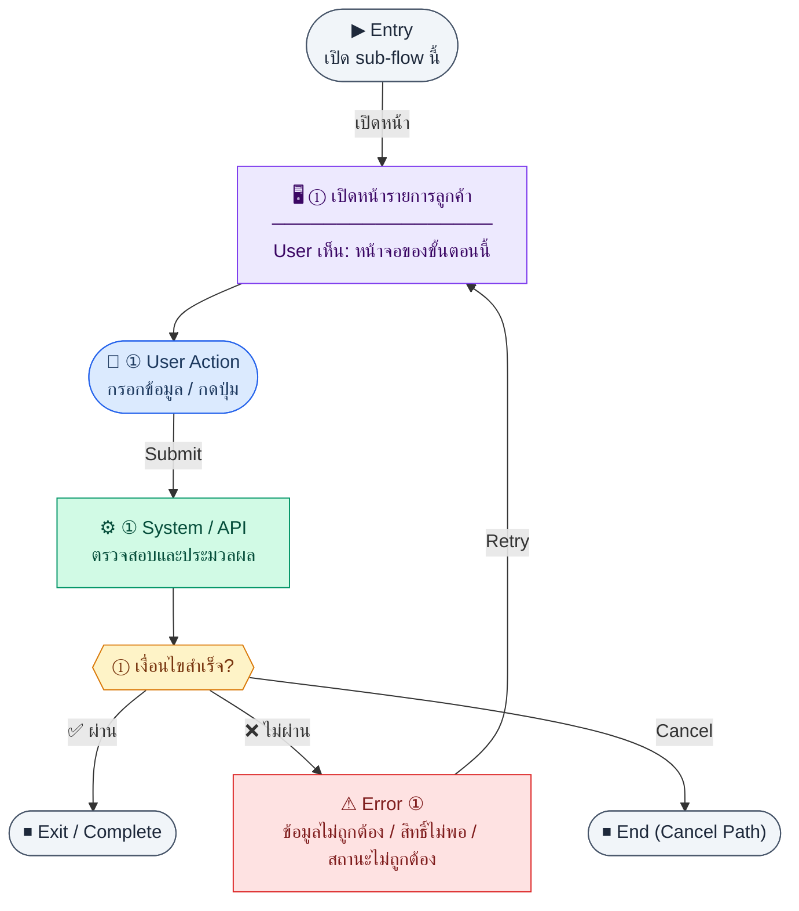

# CustomerList

คู่มือแปลง UX → spec: [`../../UX_TO_UI_SPEC_WORKFLOW.md`](../../UX_TO_UI_SPEC_WORKFLOW.md)

**Route:** `/finance/customers`

---

## Metadata

| Key | Value |
|-----|--------|
| **UX flow** | [`R2-01_Customer_Management.md`](../../../UX_Flow/Functions/R2-01_Customer_Management.md) |
| **UX sub-flow / steps** | สรุปใน Appendix — แตกตามหัวข้อ Sub-flow / Step ในเอกสาร UX |
| **Design system** | [`design-system.md`](../../design-system.md) — §3 Page layout, §5 forms, §6 DataTable ตามประเภทหน้า |
| **Global FE behaviors** | [`_GLOBAL_FRONTEND_BEHAVIORS.md`](../../../UX_Flow/_GLOBAL_FRONTEND_BEHAVIORS.md) |
| **Preview** | [`CustomerList.preview.html`](./CustomerList.preview.html) · [`../_Shared/preview-base.css`](../_Shared/preview-base.css) · [`MD_TO_PREVIEW_HTML_MANUAL.md`](../MD_TO_PREVIEW_HTML_MANUAL.md) |

---

## เป้าหมายหน้าจอ

ดูรายการลูกค้าทั้งหมดพร้อมตัวกรอง/แบ่งหน้า (ถ้ามีใน product)

## ผู้ใช้และสิทธิ์

อ่าน Actor(s) และ permission gate ใน Appendix / เอกสาร UX — กรณี 401/403/409 อ้าง Global FE behaviors

## โครง layout (สรุป)

ระบุตามประเภทหน้าใน Appendix: list / detail / form / แท็บ — ใช้ pattern ใน design-system.md

## เนื้อหาและฟิลด์

สกัดจาก **User sees** / **User Action** / ช่องกรอกใน Appendix เป็นตารางฟิลด์เต็มเมื่อปรับแต่งรอบถัดไป; ขณะนี้ใช้บล็อก UX ด้านล่างเป็นข้อมูลอ้างอิงครบถ้วน

## การกระทำ (CTA)

สกัดจากปุ่มใน Appendix (`[...]`) และ Frontend behavior

## สถานะพิเศษ

Loading, empty, error, validation, dependency ขณะลบ — ตาม **Error** / **Success** ใน Appendix

## หมายเหตุ implementation (ถ้ามี)

เทียบ `erp_frontend` เมื่อทราบ path ของหน้า

## Preview HTML notes

| หัวข้อ | ใส่อะไร |
|--------|--------|
| **Shell** | โดยมาก `app` (ยกเว้นหน้า login / standalone) |
| **Regions** | ดูลำดับ **User sees** ใน Appendix |
| **สถานะสำหรับสลับใน preview** | `default` · `loading` · `empty` · `error` ตาม UX |
| **ข้อมูลจำลอง** | จำนวนแถว / สถานะ badge ตามประเภทหน้า |
| **ลิงก์ CSS** | [`../_Shared/preview-base.css`](../_Shared/preview-base.css) |

---

## Appendix — UX excerpt (reference)

## Sub-flow A — รายการลูกค้า (List)

**กลุ่ม endpoint:** `GET /api/finance/customers`

### Scenario Flow

### สัญลักษณ์ Node (Color Legend)

| สี | Node shape | หมายถึง |
|----|-----------|---------|
| 🟣 ม่วง | สี่เหลี่ยม `["…"]` | **Screen / UI State** |
| 🔵 น้ำเงิน | วงกลม `(["…"])` | **User Action** |
| 🟢 เขียว | สี่เหลี่ยม `["…"]` | **System / API** |
| 🟡 เหลือง | เพชร `{{"…"}}` | **Decision** |
| 🔴 แดง | สี่เหลี่ยม `["…"]` | **Error / Edge case** |
| ⚫ เทา | วงรี `(["…"])` | **Start / End** |

---

### Step A1 — เปิดหน้ารายการลูกค้า

**Goal:** ดูรายการลูกค้าทั้งหมดพร้อมตัวกรอง/แบ่งหน้า (ถ้ามีใน product)

**User sees:** ตารางลูกค้า (รหัส, ชื่อ, สถานะ active, วงเงินเครดิตถ้ามี), ปุ่ม “เพิ่มลูกค้า”, การกระทำต่อแถว (ดู / แก้ไข / เปิด-ปิด / ลบตามสิทธิ์)

**User can do:** ค้นหา/กรอง, คลิกแถวเพื่อไปรายละเอียด, ไปหน้าสร้างใหม่

**User Action:**
- ประเภท: `กรอกข้อมูล / เลือกตัวเลือก`
- ช่องที่ใช้กรอง/ค้นหา:
  - `search` *(optional)* : ค้นหาจาก code, ชื่อ, taxId
  - `isActive` *(optional)* : active/inactive
- ปุ่ม / Controls ในหน้านี้:
  - `[Create Customer]` → เปิดฟอร์มสร้าง
  - `[Open Customer]` → ไปหน้ารายละเอียด
  - `[Apply Filters]` → โหลดรายการตามเงื่อนไข

**Frontend behavior:**

- เรียก `GET /api/finance/customers` พร้อม query ตาม BR (pagination, filter ถ้ามี)
- แสดง skeleton ขณะโหลด; รีเฟรชหลัง mutation จาก sub-flow อื่น

**System / AI behavior:** Backend อ่านตาราง `customers` และ metadata ที่เกี่ยวข้อง; ไม่มี AI

**Success:** ได้รายการและ meta ครบตาม schema

**Error:** 401 → redirect login; 403 → ข้อความไม่มีสิทธิ์; 5xx → retry / แจ้งผู้ดูแล

**Notes:** Traceability Feature 3.1 ผูก `P_CUST` → `GET /api/finance/customers`

---
