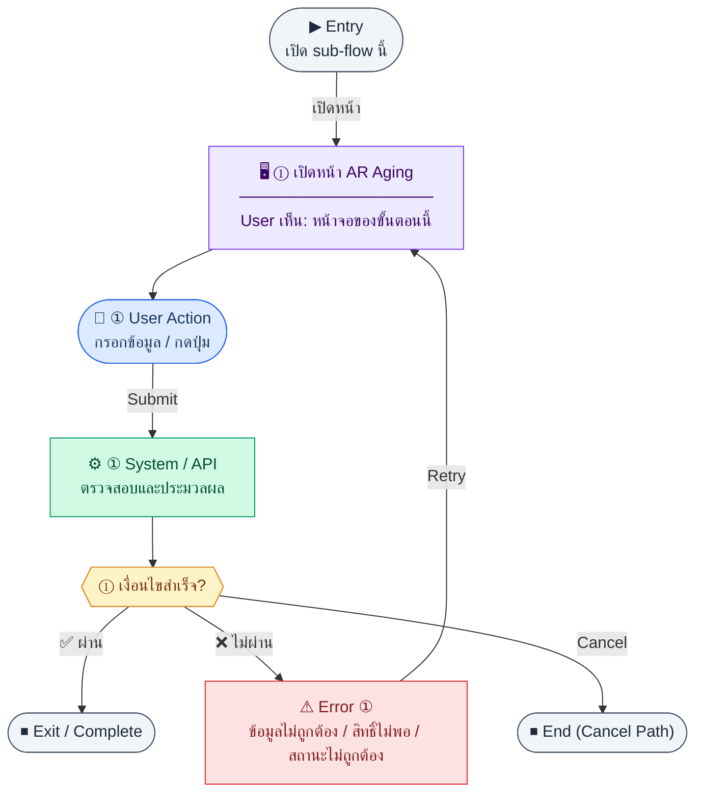

# ARAgingReport

คู่มือแปลง UX → spec: [`../../UX_TO_UI_SPEC_WORKFLOW.md`](../../UX_TO_UI_SPEC_WORKFLOW.md)

**Route:** `— (ดู Entry ใน UX ด้านล่าง)`

---

## Metadata

| Key | Value |
|-----|--------|
| **UX flow** | [`R2-02_AR_Payment_Tracking.md`](../../../UX_Flow/Functions/R2-02_AR_Payment_Tracking.md) |
| **UX sub-flow / steps** | สรุปใน Appendix — แตกตามหัวข้อ Sub-flow / Step ในเอกสาร UX |
| **Design system** | [`design-system.md`](../../design-system.md) — §3 Page layout, §5 forms, §6 DataTable ตามประเภทหน้า |
| **Global FE behaviors** | [`_GLOBAL_FRONTEND_BEHAVIORS.md`](../../../UX_Flow/_GLOBAL_FRONTEND_BEHAVIORS.md) |
| **Preview** | [`ARAgingReport.preview.html`](./ARAgingReport.preview.html) · [`../_Shared/preview-base.css`](../_Shared/preview-base.css) · [`MD_TO_PREVIEW_HTML_MANUAL.md`](../MD_TO_PREVIEW_HTML_MANUAL.md) |

---

## เป้าหมายหน้าจอ

ดูยอดค้างแยก bucket 0–30, 31–60, 61–90, 90+ วัน ต่อลูกค้า

## ผู้ใช้และสิทธิ์

อ่าน Actor(s) และ permission gate ใน Appendix / เอกสาร UX — กรณี 401/403/409 อ้าง Global FE behaviors

## โครง layout (สรุป)

ระบุตามประเภทหน้าใน Appendix: list / detail / form / แท็บ — ใช้ pattern ใน design-system.md

## เนื้อหาและฟิลด์

สกัดจาก **User sees** / **User Action** / ช่องกรอกใน Appendix เป็นตารางฟิลด์เต็มเมื่อปรับแต่งรอบถัดไป; ขณะนี้ใช้บล็อก UX ด้านล่างเป็นข้อมูลอ้างอิงครบถ้วน

## การกระทำ (CTA)

สกัดจากปุ่มใน Appendix (`[...]`) และ Frontend behavior

## สถานะพิเศษ

Loading, empty, error, validation, dependency ขณะลบ — ตาม **Error** / **Success** ใน Appendix

## หมายเหตุ implementation (ถ้ามี)

เทียบ `erp_frontend` เมื่อทราบ path ของหน้า

## Preview HTML notes

| หัวข้อ | ใส่อะไร |
|--------|--------|
| **Shell** | โดยมาก `app` (ยกเว้นหน้า login / standalone) |
| **Regions** | ดูลำดับ **User sees** ใน Appendix |
| **สถานะสำหรับสลับใน preview** | `default` · `loading` · `empty` · `error` ตาม UX |
| **ข้อมูลจำลอง** | จำนวนแถว / สถานะ badge ตามประเภทหน้า |
| **ลิงก์ CSS** | [`../_Shared/preview-base.css`](../_Shared/preview-base.css) |

---

## Appendix — UX excerpt (reference)

## Sub-flow E — รายงาน AR Aging

**กลุ่ม endpoint:** `GET /api/finance/reports/ar-aging`

### Scenario Flow

### สัญลักษณ์ Node (Color Legend)

| สี | Node shape | หมายถึง |
|----|-----------|---------|
| 🟣 ม่วง | สี่เหลี่ยม `["…"]` | **Screen / UI State** |
| 🔵 น้ำเงิน | วงกลม `(["…"])` | **User Action** |
| 🟢 เขียว | สี่เหลี่ยม `["…"]` | **System / API** |
| 🟡 เหลือง | เพชร `{{"…"}}` | **Decision** |
| 🔴 แดง | สี่เหลี่ยม `["…"]` | **Error / Edge case** |
| ⚫ เทา | วงรี `(["…"])` | **Start / End** |

---

### Step E1 — เปิดหน้า AR Aging

**Goal:** ดูยอดค้างแยก bucket 0–30, 31–60, 61–90, 90+ วัน ต่อลูกค้า

**User sees:** `/finance/reports/ar-aging` ตารางหรือ pivot, ตัวเลือก as-of หรือช่วงวันที่ (ตาม query ของ BE)

**User can do:** เลือกพารามิเตอร์, ส่งออก (ถ้า product แยก — ใน inventory ปัจจุบัน aging ใช้ GET อย่างเดียวใน `reports.md`; export แยกในเอกสาร R2-09/R2-04 ตาม scope)

**User Action:**
- ประเภท: `เลือกตัวเลือก / กดปุ่ม`
- ช่องที่ต้องกรอก:
  - `asOfDate` *(required/conditional ตาม BE)* : วันที่อ้างอิง aging
  - `customerId` *(optional)* : กรองลูกค้า
- ปุ่ม / Controls ในหน้านี้:
  - `[Load Aging Report]` → ดูรายงาน aging
  - `[Back]` → กลับหน้าก่อนหน้า

**Frontend behavior:**

- `GET /api/finance/reports/ar-aging` พร้อม query ตาม BR (เช่น วันที่อ้างอิง aging)
- แสดง grand total และ drill-down ไปลูกค้า/invoice ถ้า BE ส่งลิงก์หรือ id

**System / AI behavior:** aggregate จาก `invoices` + `invoice_payments` + `customers`

**Success:** ตัวเลขสอดคล้องกับ detail invoice

**Error:** 400 query ไม่ครบ; 5xx

**Notes:** Traceability `P_AR_AGING` → `A_AR_AGING`; รายงานนี้ยังถูกอ้างจาก hub `/finance/reports` ตาม BR §3.4

## Coverage Checklist

| Endpoint | Covered in UX file | Notes |
| --- | --- | --- |
| `GET /api/finance/invoices` | Sub-flow A — รายการและรายละเอียดใบแจ้งหนี้ (บริบทก่อนรับชำระ) | Step A1; show `balanceDue` / `paidAmount`. |
| `POST /api/finance/invoices` | — | SD inventory; invoice create not stepped in this UX (R1 / other flows). |
| `GET /api/finance/invoices/:id` | Sub-flow A — รายการและรายละเอียดใบแจ้งหนี้ (บริบทก่อนรับชำระ) | Step A2; payment entry context. |
| `POST /api/finance/invoices/:id/payments` | Sub-flow B — สร้างการรับชำระ (Payment create) | Bank `bankAccountId` per BR §3.5. |
| `GET /api/finance/invoices/:id/payments` | Sub-flow C — ประวัติการรับชำระ (Payment history) | Audit table after create. |
| `PATCH /api/finance/invoices/:id/status` | Sub-flow D — สถานะใบแจ้งหนี้ (Invoice status) | Workflow transitions; overdue from BE. |
| `GET /api/finance/reports/ar-aging` | Sub-flow E — รายงาน AR Aging | Query as-of / range per BE; hub link in BR §3.4. |

### Coverage Lock Notes (2026-04-16)
- payment create success ต้อง refresh invoice summary (`paidAmount`, `balanceDue`, `status`) จาก API response หรือ refetch detail
- bank side effect ต้องแสดงผลได้ (เช่น `bankTransactionId` หรือสถานะ posting)
- filter/query ใน AR aging ต้อง lock ให้ตรง SD (`asOfDate` หรือ `from/to`)
- invoice-side readback ต้องแสดง bank movement linkage ที่เกี่ยวข้องเมื่อ API ส่งกลับมา เช่น `bankTransactionId` หรือ transaction reference fields จาก bank module
- payment history / invoice detail ต้องถือ `paidAmount` และ `balanceDue` เป็น source of truth สำหรับ post-payment state ทุกหน้าจอ
- ถ้า bank side effect ยังไม่พร้อมหรือ posting ล่าช้า ให้แยกสถานะ “payment saved” ออกจาก “bank reflected” ชัดเจนใน UX
