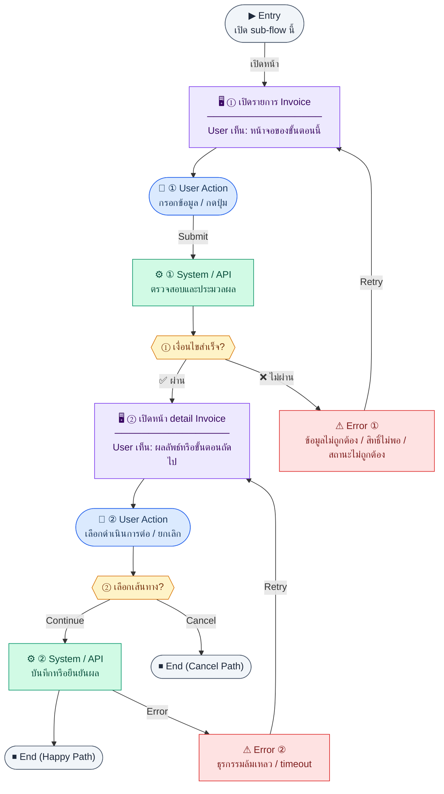

# ARPaymentRecording

คู่มือแปลง UX → spec: [`../../UX_TO_UI_SPEC_WORKFLOW.md`](../../UX_TO_UI_SPEC_WORKFLOW.md)

**Route:** `— (ดู Entry ใน UX ด้านล่าง)`

---

## Metadata

| Key | Value |
|-----|--------|
| **UX flow** | [`R2-02_AR_Payment_Tracking.md`](../../../UX_Flow/Functions/R2-02_AR_Payment_Tracking.md) |
| **UX sub-flow / steps** | สรุปใน Appendix — แตกตามหัวข้อ Sub-flow / Step ในเอกสาร UX |
| **Design system** | [`design-system.md`](../../design-system.md) — §3 Page layout, §5 forms, §6 DataTable ตามประเภทหน้า |
| **Global FE behaviors** | [`_GLOBAL_FRONTEND_BEHAVIORS.md`](../../../UX_Flow/_GLOBAL_FRONTEND_BEHAVIORS.md) |
| **Preview** | [`ARPaymentRecording.preview.html`](./ARPaymentRecording.preview.html) · [`../_Shared/preview-base.css`](../_Shared/preview-base.css) · [`MD_TO_PREVIEW_HTML_MANUAL.md`](../MD_TO_PREVIEW_HTML_MANUAL.md) |

---

## เป้าหมายหน้าจอ

เลือกใบแจ้งหนี้ที่ต้องรับชำระหรือตรวจสอบยอดค้าง

## ผู้ใช้และสิทธิ์

อ่าน Actor(s) และ permission gate ใน Appendix / เอกสาร UX — กรณี 401/403/409 อ้าง Global FE behaviors

## โครง layout (สรุป)

ระบุตามประเภทหน้าใน Appendix: list / detail / form / แท็บ — ใช้ pattern ใน design-system.md

## เนื้อหาและฟิลด์

สกัดจาก **User sees** / **User Action** / ช่องกรอกใน Appendix เป็นตารางฟิลด์เต็มเมื่อปรับแต่งรอบถัดไป; ขณะนี้ใช้บล็อก UX ด้านล่างเป็นข้อมูลอ้างอิงครบถ้วน

## การกระทำ (CTA)

สกัดจากปุ่มใน Appendix (`[...]`) และ Frontend behavior

## สถานะพิเศษ

Loading, empty, error, validation, dependency ขณะลบ — ตาม **Error** / **Success** ใน Appendix

## หมายเหตุ implementation (ถ้ามี)

เทียบ `erp_frontend` เมื่อทราบ path ของหน้า

## Preview HTML notes

| หัวข้อ | ใส่อะไร |
|--------|--------|
| **Shell** | โดยมาก `app` (ยกเว้นหน้า login / standalone) |
| **Regions** | ดูลำดับ **User sees** ใน Appendix |
| **สถานะสำหรับสลับใน preview** | `default` · `loading` · `empty` · `error` ตาม UX |
| **ข้อมูลจำลอง** | จำนวนแถว / สถานะ badge ตามประเภทหน้า |
| **ลิงก์ CSS** | [`../_Shared/preview-base.css`](../_Shared/preview-base.css) |

---

## Appendix — UX excerpt (reference)

## Sub-flow A — รายการและรายละเอียดใบแจ้งหนี้ (บริบทก่อนรับชำระ)

**กลุ่ม endpoint:** `GET /api/finance/invoices`, `GET /api/finance/invoices/:id`

### Scenario Flow

### สัญลักษณ์ Node (Color Legend)

| สี | Node shape | หมายถึง |
|----|-----------|---------|
| 🟣 ม่วง | สี่เหลี่ยม `["…"]` | **Screen / UI State** |
| 🔵 น้ำเงิน | วงกลม `(["…"])` | **User Action** |
| 🟢 เขียว | สี่เหลี่ยม `["…"]` | **System / API** |
| 🟡 เหลือง | เพชร `{{"…"}}` | **Decision** |
| 🔴 แดง | สี่เหลี่ยม `["…"]` | **Error / Edge case** |
| ⚫ เทา | วงรี `(["…"])` | **Start / End** |

---

### Step A1 — เปิดรายการ Invoice

**Goal:** เลือกใบแจ้งหนี้ที่ต้องรับชำระหรือตรวจสอบยอดค้าง

**User sees:** ตาราง invoice พร้อม status, balance due (ถ้ามีใน payload)

**User can do:** กรอง, เปิด detail

**User Action:**
- ประเภท: `เลือกตัวเลือก / กดปุ่ม`
- ช่องที่ใช้กรอง/ดูข้อมูล:
  - `status` *(optional)* : กรองสถานะใบแจ้งหนี้
  - `customerId` *(optional)* : กรองตามลูกค้า
- ปุ่ม / Controls ในหน้านี้:
  - `[Open Invoice]` → ไปหน้า detail
  - `[Refresh]` → โหลดรายการล่าสุด

**Frontend behavior:**

- `GET /api/finance/invoices` (query ตาม product)
- คลิกแถว → navigate พร้อม `id`

**System / AI behavior:** คืนรายการพร้อม meta

**Success:** เห็น invoice ที่ต้องการ

**Error:** 401/403/5xx ตามมาตรฐานแอป

**Notes:** BR เน้นว่า summary เดิมที่อ่าน total ตรง ๆ ไม่พอเมื่อมี partial payment — UI ต้องอิง `balanceDue` / `paidAmount` จาก BE

### Step A2 — เปิดหน้า detail Invoice

**Goal:** เตรียมบันทึกรับชำระจากยอดคงค้างจริง

**User sees:** หัวเอกสาร, ยอดรวม, paid/balance, ปุ่ม “บันทึกรับชำระ”, แท็บประวัติการชำระ

**User can do:** เปิดฟอร์มรับชำระ, ดูประวัติ

**User Action:**
- ประเภท: `กดปุ่ม`
- ปุ่ม / Controls ในหน้านี้:
  - `[Add Payment]` → เปิดฟอร์มรับชำระ
  - `[View Payment History]` → เปิดประวัติการชำระ
  - `[Back to List]` → กลับหน้ารายการ

**Frontend behavior:**

- `GET /api/finance/invoices/:id` เมื่อโหลด `/finance/invoices/:id`

**System / AI behavior:** รวมข้อมูลบรรทัดรายการและสถานะล่าสุด

**Success:** ยอดที่แสดงตรงกับการคำนวณของ BE

**Error:** 404 ถ้าไม่มีใบ

**Notes:** Traceability `P_INV_ID` → `GET .../:id`

---
