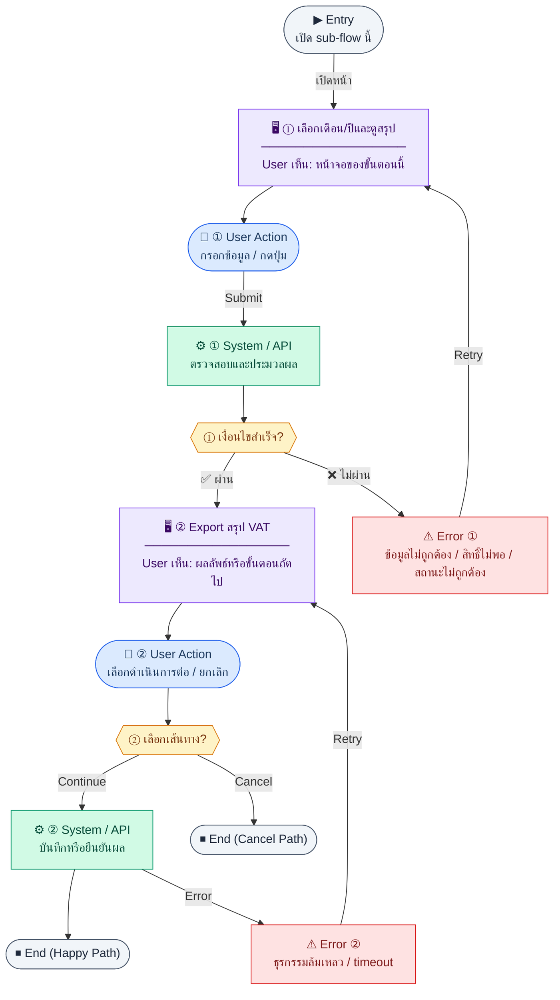

# VATMonthlySummary

คู่มือแปลง UX → spec: [`../../UX_TO_UI_SPEC_WORKFLOW.md`](../../UX_TO_UI_SPEC_WORKFLOW.md)

**Route:** `— (ดู Entry ใน UX ด้านล่าง)`

---

## Metadata

| Key | Value |
|-----|--------|
| **UX flow** | [`R2-03_Thai_Tax_VAT_WHT.md`](../../../UX_Flow/Functions/R2-03_Thai_Tax_VAT_WHT.md) |
| **UX sub-flow / steps** | สรุปใน Appendix — แตกตามหัวข้อ Sub-flow / Step ในเอกสาร UX |
| **Design system** | [`design-system.md`](../../design-system.md) — §3 Page layout, §5 forms, §6 DataTable ตามประเภทหน้า |
| **Global FE behaviors** | [`_GLOBAL_FRONTEND_BEHAVIORS.md`](../../../UX_Flow/_GLOBAL_FRONTEND_BEHAVIORS.md) |
| **Preview** | [`VATMonthlySummary.preview.html`](./VATMonthlySummary.preview.html) · [`../_Shared/preview-base.css`](../_Shared/preview-base.css) · [`MD_TO_PREVIEW_HTML_MANUAL.md`](../MD_TO_PREVIEW_HTML_MANUAL.md) |

---

## เป้าหมายหน้าจอ

ดู output VAT, input VAT, net payable สำหรับ PP.30 รายเดือน

## ผู้ใช้และสิทธิ์

อ่าน Actor(s) และ permission gate ใน Appendix / เอกสาร UX — กรณี 401/403/409 อ้าง Global FE behaviors

## โครง layout (สรุป)

ระบุตามประเภทหน้าใน Appendix: list / detail / form / แท็บ — ใช้ pattern ใน design-system.md

## เนื้อหาและฟิลด์

สกัดจาก **User sees** / **User Action** / ช่องกรอกใน Appendix เป็นตารางฟิลด์เต็มเมื่อปรับแต่งรอบถัดไป; ขณะนี้ใช้บล็อก UX ด้านล่างเป็นข้อมูลอ้างอิงครบถ้วน

## การกระทำ (CTA)

สกัดจากปุ่มใน Appendix (`[...]`) และ Frontend behavior

## สถานะพิเศษ

Loading, empty, error, validation, dependency ขณะลบ — ตาม **Error** / **Success** ใน Appendix

## หมายเหตุ implementation (ถ้ามี)

เทียบ `erp_frontend` เมื่อทราบ path ของหน้า

## Preview HTML notes

| หัวข้อ | ใส่อะไร |
|--------|--------|
| **Shell** | โดยมาก `app` (ยกเว้นหน้า login / standalone) |
| **Regions** | ดูลำดับ **User sees** ใน Appendix |
| **สถานะสำหรับสลับใน preview** | `default` · `loading` · `empty` · `error` ตาม UX |
| **ข้อมูลจำลอง** | จำนวนแถว / สถานะ badge ตามประเภทหน้า |
| **ลิงก์ CSS** | [`../_Shared/preview-base.css`](../_Shared/preview-base.css) |

---

## Appendix — UX excerpt (reference)

## Sub-flow B — สรุป VAT รายเดือน + Export

**กลุ่ม endpoint:** `GET /api/finance/tax/vat-summary`, `GET /api/finance/tax/vat-summary/export`

### Scenario Flow

### สัญลักษณ์ Node (Color Legend)

| สี | Node shape | หมายถึง |
|----|-----------|---------|
| 🟣 ม่วง | สี่เหลี่ยม `["…"]` | **Screen / UI State** |
| 🔵 น้ำเงิน | วงกลม `(["…"])` | **User Action** |
| 🟢 เขียว | สี่เหลี่ยม `["…"]` | **System / API** |
| 🟡 เหลือง | เพชร `{{"…"}}` | **Decision** |
| 🔴 แดง | สี่เหลี่ยม `["…"]` | **Error / Edge case** |
| ⚫ เทา | วงรี `(["…"])` | **Start / End** |

---

### Step B1 — เลือกเดือน/ปีและดูสรุป

**Goal:** ดู output VAT, input VAT, net payable สำหรับ PP.30 รายเดือน

**User sees:** `/finance/tax/vat-report` — card สรุป + ตาราง drill-down (ถ้ามี)

**User can do:** เลือก `month`, `year` (required ตาม SD)

**User Action:**
- ประเภท: `เลือกตัวเลือก / กดปุ่ม`
- ช่องที่ต้องกรอก:
  - `month` *(required)* : เดือนภาษี
  - `year` *(required)* : ปีภาษี
- ปุ่ม / Controls ในหน้านี้:
  - `[Load VAT Summary]` → เรียกสรุปรายเดือน
  - `[Export]` → ไป flow ส่งออกไฟล์

**Frontend behavior:**

- `GET /api/finance/tax/vat-summary?month=<m>&year=<y>`
- ปุ่ม “ส่งออก” → เปิด tab ดาวน์โหลดหรือ blob

**System / AI behavior:** aggregate จาก invoices / ap_bills ตาม BR

**Success:** ตัวเลขสอดคล้องกับเอกสารในช่วงเวลาเดียวกัน

**Error:** 400 ถ้าไม่ส่ง month/year

**Notes:** BR: `POST /finance/invoices` feed เข้า vat-summary

### Step B2 — Export สรุป VAT

**Goal:** ดาวน์โหลดไฟล์สำหรับเก็บสำนวน/ส่งงาน

**User sees:** dialog เลือก `format` (pdf/xlsx ตาม BE)

**User can do:** ยืนยันดาวน์โหลด

**User Action:**
- ประเภท: `เลือกตัวเลือก / กดปุ่ม`
- ช่องที่ต้องกรอก:
  - `format` *(required)* : รูปแบบไฟล์ เช่น `pdf` หรือ `xlsx`
- ปุ่ม / Controls ในหน้านี้:
  - `[Download VAT Export]` → เริ่มดาวน์โหลด
  - `[Cancel]` → ปิด dialog

**Frontend behavior:**

- `GET /api/finance/tax/vat-summary/export?month=&year=&format=` พร้อม header Authorization
- จัดการ response เป็นไฟล์ (ไม่ parse เป็น JSON ถ้าเป็น binary)

**System / AI behavior:** สร้างไฟล์จาก dataset เดียวกับ summary

**Success:** ไฟล์ลงเครื่องผู้ใช้

**Error:** 415/400 format ไม่รองรับ; 403

**Notes:** Endpoint อยู่ใน `Documents/SD_Flow/Finance/document_exports.md`

---
