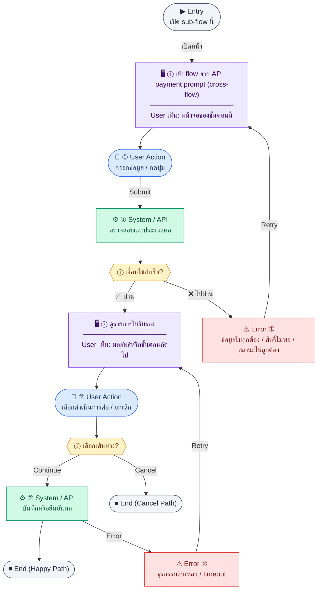

# WHTCertificateList

คู่มือแปลง UX → spec: [`../../UX_TO_UI_SPEC_WORKFLOW.md`](../../UX_TO_UI_SPEC_WORKFLOW.md)

**Route:** `— (ดู Entry ใน UX ด้านล่าง)`

---

## Metadata

| Key | Value |
|-----|--------|
| **UX flow** | [`R2-03_Thai_Tax_VAT_WHT.md`](../../../UX_Flow/Functions/R2-03_Thai_Tax_VAT_WHT.md) |
| **UX sub-flow / steps** | สรุปใน Appendix — แตกตามหัวข้อ Sub-flow / Step ในเอกสาร UX |
| **Design system** | [`design-system.md`](../../design-system.md) — §3 Page layout, §5 forms, §6 DataTable ตามประเภทหน้า |
| **Global FE behaviors** | [`_GLOBAL_FRONTEND_BEHAVIORS.md`](../../../UX_Flow/_GLOBAL_FRONTEND_BEHAVIORS.md) |
| **Preview** | [`WHTCertificateList.preview.html`](./WHTCertificateList.preview.html) · [`../_Shared/preview-base.css`](../_Shared/preview-base.css) · [`MD_TO_PREVIEW_HTML_MANUAL.md`](../MD_TO_PREVIEW_HTML_MANUAL.md) |

---

## เป้าหมายหน้าจอ

ลดการหลุด flow หลังจ่าย AP ที่ต้องออกใบ WHT ต่อทันที

## ผู้ใช้และสิทธิ์

อ่าน Actor(s) และ permission gate ใน Appendix / เอกสาร UX — กรณี 401/403/409 อ้าง Global FE behaviors

## โครง layout (สรุป)

ระบุตามประเภทหน้าใน Appendix: list / detail / form / แท็บ — ใช้ pattern ใน design-system.md

## เนื้อหาและฟิลด์

สกัดจาก **User sees** / **User Action** / ช่องกรอกใน Appendix เป็นตารางฟิลด์เต็มเมื่อปรับแต่งรอบถัดไป; ขณะนี้ใช้บล็อก UX ด้านล่างเป็นข้อมูลอ้างอิงครบถ้วน

## การกระทำ (CTA)

สกัดจากปุ่มใน Appendix (`[...]`) และ Frontend behavior

## สถานะพิเศษ

Loading, empty, error, validation, dependency ขณะลบ — ตาม **Error** / **Success** ใน Appendix

## หมายเหตุ implementation (ถ้ามี)

เทียบ `erp_frontend` เมื่อทราบ path ของหน้า

## Preview HTML notes

| หัวข้อ | ใส่อะไร |
|--------|--------|
| **Shell** | โดยมาก `app` (ยกเว้นหน้า login / standalone) |
| **Regions** | ดูลำดับ **User sees** ใน Appendix |
| **สถานะสำหรับสลับใน preview** | `default` · `loading` · `empty` · `error` ตาม UX |
| **ข้อมูลจำลอง** | จำนวนแถว / สถานะ badge ตามประเภทหน้า |
| **ลิงก์ CSS** | [`../_Shared/preview-base.css`](../_Shared/preview-base.css) |

---

## Appendix — UX excerpt (reference)

## Sub-flow C — รายการและการสร้างใบหัก ณ ที่จ่าย (WHT certificates)

**กลุ่ม endpoint:** `GET /api/finance/tax/wht-certificates`, `POST /api/finance/tax/wht-certificates`

### Scenario Flow

### สัญลักษณ์ Node (Color Legend)

| สี | Node shape | หมายถึง |
|----|-----------|---------|
| 🟣 ม่วง | สี่เหลี่ยม `["…"]` | **Screen / UI State** |
| 🔵 น้ำเงิน | วงกลม `(["…"])` | **User Action** |
| 🟢 เขียว | สี่เหลี่ยม `["…"]` | **System / API** |
| 🟡 เหลือง | เพชร `{{"…"}}` | **Decision** |
| 🔴 แดง | สี่เหลี่ยม `["…"]` | **Error / Edge case** |
| ⚫ เทา | วงรี `(["…"])` | **Start / End** |

---

### Step C0 — เข้า flow จาก AP payment prompt (cross-flow)

**Goal:** ลดการหลุด flow หลังจ่าย AP ที่ต้องออกใบ WHT ต่อทันที

**User sees:** หน้า create WHT ที่เปิดด้วย query `?apBillId={id}` จากหน้า AP payment

**User can do:** ตรวจข้อมูลที่ prefill แล้วกดบันทึกต่อได้ทันที

**User Action:**
- ประเภท: `กดปุ่ม`
- ข้อมูลที่ใช้:
  - `apBillId` *(required in cross-flow case)* : อ้างอิง bill ที่เพิ่งจ่าย
- ปุ่ม / Controls ในหน้านี้:
  - `[Continue to WHT Certificate]` → ใช้ข้อมูล prefill ต่อทันที
  - `[Create Without Prefill]` → fallback เป็นฟอร์มว่าง

**Frontend behavior:**

- อ่าน `apBillId` จาก URL และ prefill vendor, baseAmount, whtRate จากข้อมูล AP bill
- ถ้า prefill ไม่ครบ ให้แจ้งเตือนและให้ผู้ใช้แก้ฟอร์มก่อน `POST`

**System / AI behavior:** lookup ข้อมูล AP bill ที่อ้างอิงเพื่อช่วยลด manual input

**Success:** ผู้ใช้สร้างใบ WHT ต่อเนื่องจาก AP payment ได้ใน flow เดียว

**Error:** `apBillId` ไม่ถูกต้อง/ไม่พบข้อมูล ให้ fallback เป็นฟอร์ม create ปกติ

**Notes:** เชื่อมกับ Sub-flow 6 ใน `R1-08_Finance_Accounts_Payable.md` (R2 behavior)

### Step C1 — ดูรายการใบรับรอง

**Goal:** audit ใบหักที่ออกแล้ว แยกตามฟอร์ม PND / งวด

**User sees:** ตาราง `certificateNo`, วันที่, ฐานภาษี, อัตรา, ยอดหัก, ลิงก์ AP (ถ้ามี)

**User can do:** กรอง `pndForm`, `month`, `year`, pagination (`page`, `limit` ตาม SD)

**User Action:**
- ประเภท: `เลือกตัวเลือก / กดปุ่ม`
- ช่องที่ใช้กรอง/ดูข้อมูล:
  - `pndForm` *(optional)* : กรองตามแบบ ภ.ง.ด.
  - `month` *(optional)* : เดือนที่ออกใบ
  - `year` *(optional)* : ปีที่ออกใบ
  - `page` / `limit` *(optional)* : pagination
- ปุ่ม / Controls ในหน้านี้:
  - `[Create Certificate]` → เปิดฟอร์มสร้าง
  - `[Download PDF]` → ดาวน์โหลดใบที่เลือก

**Frontend behavior:**

- `GET /api/finance/tax/wht-certificates?...`

**System / AI behavior:** `SELECT wht_certificates` + count

**Success:** meta.total ตรงกับหน้า

**Error:** 5xx

**Notes:** BR Gap D — บางใบสร้างอัตโนมัติจาก payroll; แสดงแหล่งที่มาใน UI ถ้า BE ส่ง field

### Step C2 — สร้างใบรับรองจาก AP (หรือแหล่งอื่น)

**Goal:** ออกใบรับรองหลังจ่าย AP ตาม BR (semi-auto prompt)

**User sees:** ฟอร์ม: source (`apBillId` หรือ `employeeId` อย่างใดอย่างหนึ่ง), `pndForm`, `incomeType`, `baseAmount`, `whtRate`, `issuedDate` (ตามตัวอย่าง SD)

**User can do:** บันทึก

**User Action:**
- ประเภท: `กรอกข้อมูล / เลือกตัวเลือก`
- ช่องที่ต้องกรอก:
  - `apBillId` *(conditional)* : อ้างอิง AP bill ถ้ามาจาก AP flow
  - `employeeId` *(conditional)* : อ้างอิงพนักงาน ถ้ามาจาก payroll-origin flow
  - `pndForm` *(required)* : แบบ ภ.ง.ด.
  - `incomeType` *(required)* : ประเภทเงินได้ที่ใช้ใน certificate
  - `baseAmount` *(required)* : ฐานภาษี
  - `whtRate` *(required)* : อัตราที่ใช้หัก
  - `issuedDate` *(required)* : วันที่ออกใบ
- ปุ่ม / Controls ในหน้านี้:
  - `[Save WHT Certificate]` → บันทึกใบรับรอง
  - `[Cancel]` → ยกเลิก

**Frontend behavior:**

- `POST /api/finance/tax/wht-certificates`
- หลัง 201: แสดง `certificateNo`, ลิงก์ดาวน์โหลด PDF

**System / AI behavior:** validate ว่ามี source เพียงหนึ่งทางระหว่าง `apBillId` หรือ `employeeId`, จากนั้น `INSERT`; `certificateNo` auto `WHT-{YEAR}-{SEQ}` ตาม BR

**Success:** ใบใหม่อยู่ใน list

**Error:** 400 (apBill ไม่พร้อม); 409 duplicate logic

**Notes:** เชื่อมกับ `Documents/SD_Flow/Finance/ap.md` เมื่อเลือก `apBillId` จาก vendor invoice / bill

---
