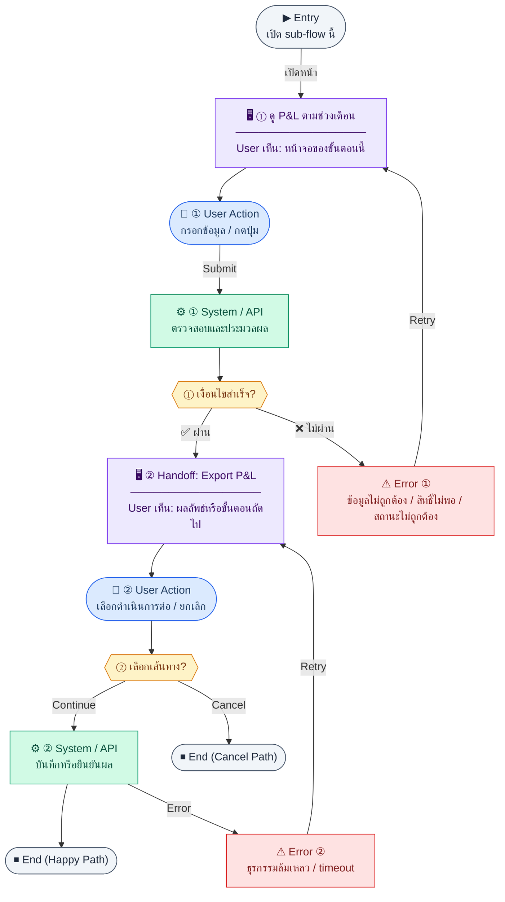

# ProfitAndLossReport

คู่มือแปลง UX → spec: [`../../UX_TO_UI_SPEC_WORKFLOW.md`](../../UX_TO_UI_SPEC_WORKFLOW.md)

**Route:** `— (ดู Entry ใน UX ด้านล่าง)`

---

## Metadata

| Key | Value |
|-----|--------|
| **UX flow** | [`R2-04_Financial_Statements.md`](../../../UX_Flow/Functions/R2-04_Financial_Statements.md) |
| **UX sub-flow / steps** | สรุปใน Appendix — แตกตามหัวข้อ Sub-flow / Step ในเอกสาร UX |
| **Design system** | [`design-system.md`](../../design-system.md) — §3 Page layout, §5 forms, §6 DataTable ตามประเภทหน้า |
| **Global FE behaviors** | [`_GLOBAL_FRONTEND_BEHAVIORS.md`](../../../UX_Flow/_GLOBAL_FRONTEND_BEHAVIORS.md) |
| **Preview** | [`ProfitAndLossReport.preview.html`](./ProfitAndLossReport.preview.html) · [`../_Shared/preview-base.css`](../_Shared/preview-base.css) · [`MD_TO_PREVIEW_HTML_MANUAL.md`](../MD_TO_PREVIEW_HTML_MANUAL.md) |

---

## เป้าหมายหน้าจอ

วิเคราะห์รายได้และค่าใช้จ่ายในช่วง `periodFrom`–`periodTo` และเปรียบเทียบงวดก่อน (ถ้าเปิด)

## ผู้ใช้และสิทธิ์

อ่าน Actor(s) และ permission gate ใน Appendix / เอกสาร UX — กรณี 401/403/409 อ้าง Global FE behaviors

## โครง layout (สรุป)

ระบุตามประเภทหน้าใน Appendix: list / detail / form / แท็บ — ใช้ pattern ใน design-system.md

## เนื้อหาและฟิลด์

สกัดจาก **User sees** / **User Action** / ช่องกรอกใน Appendix เป็นตารางฟิลด์เต็มเมื่อปรับแต่งรอบถัดไป; ขณะนี้ใช้บล็อก UX ด้านล่างเป็นข้อมูลอ้างอิงครบถ้วน

## การกระทำ (CTA)

สกัดจากปุ่มใน Appendix (`[...]`) และ Frontend behavior

## สถานะพิเศษ

Loading, empty, error, validation, dependency ขณะลบ — ตาม **Error** / **Success** ใน Appendix

## หมายเหตุ implementation (ถ้ามี)

เทียบ `erp_frontend` เมื่อทราบ path ของหน้า

## Preview HTML notes

| หัวข้อ | ใส่อะไร |
|--------|--------|
| **Shell** | โดยมาก `app` (ยกเว้นหน้า login / standalone) |
| **Regions** | ดูลำดับ **User sees** ใน Appendix |
| **สถานะสำหรับสลับใน preview** | `default` · `loading` · `empty` · `error` ตาม UX |
| **ข้อมูลจำลอง** | จำนวนแถว / สถานะ badge ตามประเภทหน้า |
| **ลิงก์ CSS** | [`../_Shared/preview-base.css`](../_Shared/preview-base.css) |

---

## Appendix — UX excerpt (reference)

## Sub-flow B — Profit & Loss (งบกำไรขาดทุน)

**กลุ่ม endpoint:** `GET /api/finance/reports/profit-loss`, `GET /api/finance/reports/profit-loss/export`

### Scenario Flow

### สัญลักษณ์ Node (Color Legend)

| สี | Node shape | หมายถึง |
|----|-----------|---------|
| 🟣 ม่วง | สี่เหลี่ยม `["…"]` | **Screen / UI State** |
| 🔵 น้ำเงิน | วงกลม `(["…"])` | **User Action** |
| 🟢 เขียว | สี่เหลี่ยม `["…"]` | **System / API** |
| 🟡 เหลือง | เพชร `{{"…"}}` | **Decision** |
| 🔴 แดง | สี่เหลี่ยม `["…"]` | **Error / Edge case** |
| ⚫ เทา | วงรี `(["…"])` | **Start / End** |

---

### Step B1 — ดู P&L ตามช่วงเดือน

**Goal:** วิเคราะห์รายได้และค่าใช้จ่ายในช่วง `periodFrom`–`periodTo` และเปรียบเทียบงวดก่อน (ถ้าเปิด)

**User sees:** `/finance/reports/profit-loss` ตาราง/section ที่ bind จาก `series[]` พร้อม summary จาก `totals` และสถานะจาก `meta`

**User can do:** เลือกช่วงเดือน (YYYY-MM), toggle `comparePrevious`

**User Action:**
- ประเภท: `กรอกข้อมูล / เลือกตัวเลือก`
- ช่องที่ต้องกรอก:
  - `periodFrom` *(required)* : เดือนเริ่มต้น
  - `periodTo` *(required)* : เดือนสิ้นสุด
  - `comparePrevious` *(optional)* : เปรียบเทียบงวดก่อน
- ปุ่ม / Controls ในหน้านี้:
  - `[Preview Report]` → เรียก `GET /api/finance/reports/profit-loss`
  - `[Export]` → ไปขั้นตอน export

**Frontend behavior:**

- `GET /api/finance/reports/profit-loss?periodFrom=&periodTo=&comparePrevious=` (ตาม BR)
- bind หน้าจอจาก `data.series[]`, `data.totals`, `data.meta` โดยตรง; ห้ามแปลงสมมติเป็น shape แยก `revenue[]` / `expenses[]` เอง

**System / AI behavior:** aggregate `journal_lines` JOIN `chart_of_accounts` ตาม accountType `income` / `expense`; ถ้าต้องแยก COGS ให้ BE ส่งผ่าน `series[].section`

**Success:** ตัวเลขสอดคล้องกับ GL สำหรับช่วงเดียวกัน

**Error:** 400 พารามิเตอร์วันที่; 403

**Notes:** accountType mapping ดูที่ BR §3.4

### Step B2 — Handoff: Export P&L

**Goal:** ดาวน์โหลดงบเป็น PDF/XLSX

**User sees:** ปุ่ม “Export” + เลือก `format`

**User can do:** ยืนยัน

**User Action:**
- ประเภท: `เลือกตัวเลือก / กดปุ่ม`
- ช่องที่ต้องกรอก:
  - `format` *(required)* : pdf หรือ xlsx
- ปุ่ม / Controls ในหน้านี้:
  - `[Download P&L]` → เรียก export endpoint
  - `[Cancel]` → ปิด dialog

**Frontend behavior:**

- `GET /api/finance/reports/profit-loss/export?periodFrom=&periodTo=&comparePrevious=&format=` (พารามิเตอร์สอดคล้องกับหน้าจอ — อ้างอิง contract BE)

**System / AI behavior:** สร้างไฟล์จาก dataset เดียวกับ on-screen report

**Success:** ไฟล์ได้รับ

**Error:** 400 format; 5xx

**Notes:** Endpoint ระบุใน `Documents/SD_Flow/Finance/document_exports.md`

---
