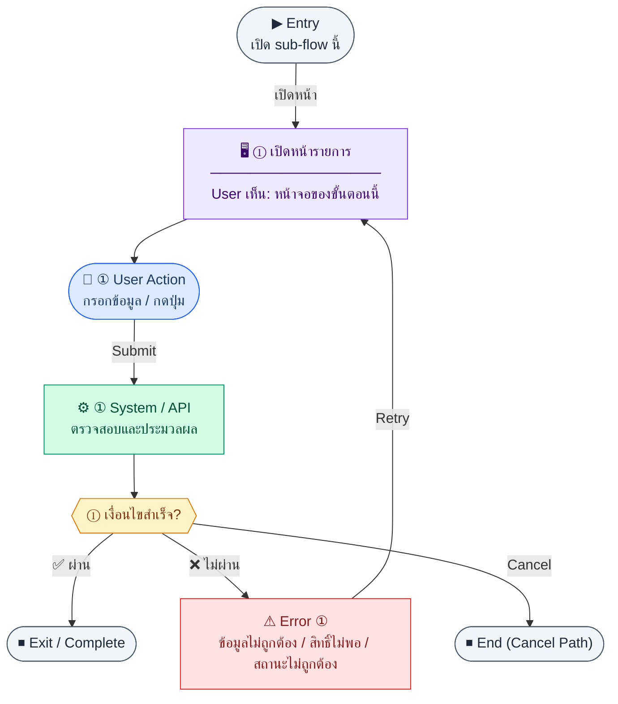

# BankTransactions

คู่มือแปลง UX → spec: [`../../UX_TO_UI_SPEC_WORKFLOW.md`](../../UX_TO_UI_SPEC_WORKFLOW.md)

**Route:** `— (ดู Entry ใน UX ด้านล่าง)`

---

## Metadata

| Key | Value |
|-----|--------|
| **UX flow** | [`R2-05_Cash_Bank_Management.md`](../../../UX_Flow/Functions/R2-05_Cash_Bank_Management.md) |
| **UX sub-flow / steps** | สรุปใน Appendix — แตกตามหัวข้อ Sub-flow / Step ในเอกสาร UX |
| **Design system** | [`design-system.md`](../../design-system.md) — §3 Page layout, §5 forms, §6 DataTable ตามประเภทหน้า |
| **Global FE behaviors** | [`_GLOBAL_FRONTEND_BEHAVIORS.md`](../../../UX_Flow/_GLOBAL_FRONTEND_BEHAVIORS.md) |
| **Preview** | [`BankTransactions.preview.html`](./BankTransactions.preview.html) · [`../_Shared/preview-base.css`](../_Shared/preview-base.css) · [`MD_TO_PREVIEW_HTML_MANUAL.md`](../MD_TO_PREVIEW_HTML_MANUAL.md) |

---

## เป้าหมายหน้าจอ

ดูรายการเคลื่อนไหวและบันทึกรายการด้วยมือ

## ผู้ใช้และสิทธิ์

อ่าน Actor(s) และ permission gate ใน Appendix / เอกสาร UX — กรณี 401/403/409 อ้าง Global FE behaviors

## โครง layout (สรุป)

ระบุตามประเภทหน้าใน Appendix: list / detail / form / แท็บ — ใช้ pattern ใน design-system.md

## เนื้อหาและฟิลด์

สกัดจาก **User sees** / **User Action** / ช่องกรอกใน Appendix เป็นตารางฟิลด์เต็มเมื่อปรับแต่งรอบถัดไป; ขณะนี้ใช้บล็อก UX ด้านล่างเป็นข้อมูลอ้างอิงครบถ้วน

## การกระทำ (CTA)

สกัดจากปุ่มใน Appendix (`[...]`) และ Frontend behavior

## สถานะพิเศษ

Loading, empty, error, validation, dependency ขณะลบ — ตาม **Error** / **Success** ใน Appendix

## หมายเหตุ implementation (ถ้ามี)

เทียบ `erp_frontend` เมื่อทราบ path ของหน้า

## Preview HTML notes

| หัวข้อ | ใส่อะไร |
|--------|--------|
| **Shell** | โดยมาก `app` (ยกเว้นหน้า login / standalone) |
| **Regions** | ดูลำดับ **User sees** ใน Appendix |
| **สถานะสำหรับสลับใน preview** | `default` · `loading` · `empty` · `error` ตาม UX |
| **ข้อมูลจำลอง** | จำนวนแถว / สถานะ badge ตามประเภทหน้า |
| **ลิงก์ CSS** | [`../_Shared/preview-base.css`](../_Shared/preview-base.css) |

---

## Appendix — UX excerpt (reference)

## Sub-flow F — รายการเคลื่อนไหว (Transactions list)

**กลุ่ม endpoint:** `GET /api/finance/bank-accounts/:id/transactions`, `POST /api/finance/bank-accounts/:id/transactions`

### Scenario Flow

### สัญลักษณ์ Node (Color Legend)

| สี | Node shape | หมายถึง |
|----|-----------|---------|
| 🟣 ม่วง | สี่เหลี่ยม `["…"]` | **Screen / UI State** |
| 🔵 น้ำเงิน | วงกลม `(["…"])` | **User Action** |
| 🟢 เขียว | สี่เหลี่ยม `["…"]` | **System / API** |
| 🟡 เหลือง | เพชร `{{"…"}}` | **Decision** |
| 🔴 แดง | สี่เหลี่ยม `["…"]` | **Error / Edge case** |
| ⚫ เทา | วงรี `(["…"])` | **Start / End** |

---

### Step F1 — ดูประวัติการเคลื่อนไหว

**Goal:** audit เงินเข้า-ออกและสถานะ reconcile

**User sees:** ตาราง `transactionDate`, `description`, `amount` (+/-), `type`, `referenceType`/`referenceId`, `runningBalance` (สะสม), `reconciled`

**User can do:** กรองช่วงวันที่, สถานะ reconciled, เปิดฟอร์ม manual entry

**User Action:**
- ประเภท: `เลือกตัวเลือก / กดปุ่ม`
- ช่องที่ใช้กรอง/ดูข้อมูล:
  - `from` / `to` *(optional)* : ช่วงวันที่
  - `reconciled` *(optional)* : สถานะกระทบยอด
- ปุ่ม / Controls ในหน้านี้:
  - `[Apply Filters]` → โหลดรายการเคลื่อนไหว
  - `[Add Manual Transaction]` → เปิดฟอร์มเพิ่มรายการ

**Frontend behavior:**

- `GET /api/finance/bank-accounts/:id/transactions` พร้อม query filter ตาม BE

**System / AI behavior:** รวมทั้งรายการอัตโนมัติจาก AR/AP/payroll และ manual

**Success:** ผลรวมสอดคล้อง `currentBalance`

**Error:** 400 filter

**Notes:** BR — AR payment สร้าง deposit; AP payment สร้าง withdrawal

---
