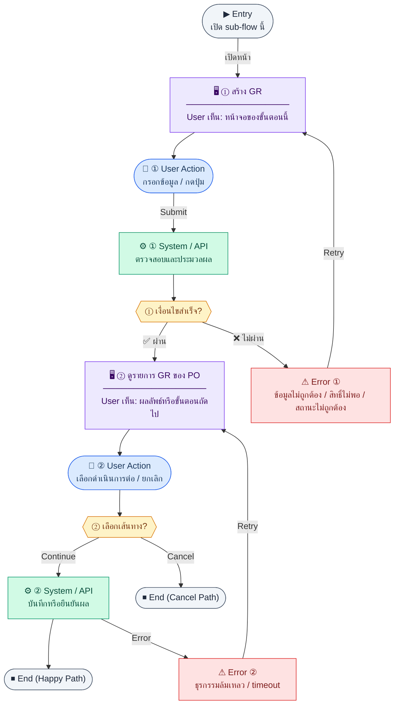

# PurchaseOrderList

คู่มือแปลง UX → spec: [`../../UX_TO_UI_SPEC_WORKFLOW.md`](../../UX_TO_UI_SPEC_WORKFLOW.md)

**Route:** `— (ดู Entry ใน UX ด้านล่าง)`

---

## Metadata

| Key | Value |
|-----|--------|
| **UX flow** | [`R2-06_Purchase_Order.md`](../../../UX_Flow/Functions/R2-06_Purchase_Order.md) |
| **UX sub-flow / steps** | สรุปใน Appendix — แตกตามหัวข้อ Sub-flow / Step ในเอกสาร UX |
| **Design system** | [`design-system.md`](../../design-system.md) — §3 Page layout, §5 forms, §6 DataTable ตามประเภทหน้า |
| **Global FE behaviors** | [`_GLOBAL_FRONTEND_BEHAVIORS.md`](../../../UX_Flow/_GLOBAL_FRONTEND_BEHAVIORS.md) |
| **Preview** | [`PurchaseOrderList.preview.html`](./PurchaseOrderList.preview.html) · [`../_Shared/preview-base.css`](../_Shared/preview-base.css) · [`MD_TO_PREVIEW_HTML_MANUAL.md`](../MD_TO_PREVIEW_HTML_MANUAL.md) |

---

## เป้าหมายหน้าจอ

ค้นหาและจัดการรายการใบสั่งซื้อ (PO) ทั้งหมด พร้อมกรองตาม status/vendor/วันที่ และสร้าง PO ใหม่

## ผู้ใช้และสิทธิ์

อ่าน Actor(s) และ permission gate ใน Appendix / เอกสาร UX — กรณี 401/403/409 อ้าง Global FE behaviors

## โครง layout (สรุป)

ระบุตามประเภทหน้าใน Appendix: list / detail / form / แท็บ — ใช้ pattern ใน design-system.md

## เนื้อหาและฟิลด์

สกัดจาก **User sees** / **User Action** / ช่องกรอกใน Appendix เป็นตารางฟิลด์เต็มเมื่อปรับแต่งรอบถัดไป; ขณะนี้ใช้บล็อก UX ด้านล่างเป็นข้อมูลอ้างอิงครบถ้วน

## การกระทำ (CTA)

สกัดจากปุ่มใน Appendix (`[...]`) และ Frontend behavior

## สถานะพิเศษ

Loading, empty, error, validation, dependency ขณะลบ — ตาม **Error** / **Success** ใน Appendix

## หมายเหตุ implementation (ถ้ามี)

เทียบ `erp_frontend` เมื่อทราบ path ของหน้า

## Preview HTML notes

| หัวข้อ | ใส่อะไร |
|--------|--------|
| **Shell** | โดยมาก `app` (ยกเว้นหน้า login / standalone) |
| **Regions** | ดูลำดับ **User sees** ใน Appendix |
| **สถานะสำหรับสลับใน preview** | `default` · `loading` · `empty` · `error` ตาม UX |
| **ข้อมูลจำลอง** | จำนวนแถว / สถานะ badge ตามประเภทหน้า |
| **ลิงก์ CSS** | [`../_Shared/preview-base.css`](../_Shared/preview-base.css) |

---

## Appendix — UX excerpt (reference)

## Sub-flow A — รายการและตัวเลือก PO

**กลุ่ม endpoint:** `GET /api/finance/purchase-orders`, `GET /api/finance/purchase-orders/options`

### Scenario Flow

### สัญลักษณ์ Node (Color Legend)

| สี | Node shape | หมายถึง |
|----|-----------|---------|
| 🟣 ม่วง | สี่เหลี่ยม `["…"]` | **Screen / UI State** |
| 🔵 น้ำเงิน | วงกลม `(["…"])` | **User Action** |
| 🟢 เขียว | สี่เหลี่ยม `["…"]` | **System / API** |
| 🟡 เหลือง | เพชร `{{"…"}}` | **Decision** |
| 🔴 แดง | สี่เหลี่ยม `["…"]` | **Error / Edge case** |
| ⚫ เทา | วงรี `(["…"])` | **Start / End** |

---

### Step F1 — สร้าง GR

**Goal:** บันทึกการรับสินค้าตามบรรทัด PO

**User sees:** ฟอร์ม `receivedDate`, `receivedBy`, รายการ `poItemId` + `receivedQty`, หมายเหตุ

**User can do:** บันทึก GR

**User Action:**
- ประเภท: `กรอกข้อมูล / เลือกตัวเลือก`
- ช่องที่ต้องกรอก:
  - `receivedDate` *(required)* : วันที่รับสินค้า
  - `receivedBy` *(required)* : ผู้รับของ (อาจ prefill เป็นผู้ใช้ปัจจุบันตาม policy)
  - `items[]` *(required)* : `poItemId` และ `receivedQty` ต่อบรรทัด
  - `notes` *(optional)* : หมายเหตุการรับของ
- ปุ่ม / Controls ในหน้านี้:
  - `[Create Goods Receipt]` → เรียก `POST /api/finance/purchase-orders/:id/goods-receipts`
  - `[Cancel]` → ยกเลิก

**Frontend behavior:**

- validate ไม่เกิน `quantity - receivedQty` ต่อบรรทัด
- `POST /api/finance/purchase-orders/:id/goods-receipts` พร้อม `receivedDate`, `receivedBy`, `notes?`, `items[]`

**System / AI behavior:** insert `goods_receipts` + `gr_items`; อัปเดต `receivedQty` บน `po_items`; อาจเปลี่ยน PO เป็น partially_received/received

**Success:** 201 + รายการ GR ใหม่

**Error:** 400 จำนวนเกิน; 409 PO ไม่ใช่สถานะที่รับได้

**Notes:** BR schema `goods_receipts` / `gr_items`

### Step F2 — ดูรายการ GR ของ PO

**Goal:** audit ประวัติการรับของหลายครั้ง

**User sees:** ตาราง `grNo`, วันที่รับ, ผู้รับ, ยอดต่อบรรทัด

**User can do:** ขยายดูรายการย่อย

**User Action:**
- ประเภท: `กดปุ่ม`
- ปุ่ม / Controls ในหน้านี้:
  - `[Expand GR Detail]` → ดูรายการรับของย่อย
  - `[Back to PO]` → กลับ header PO

**Frontend behavior:**

- `GET /api/finance/purchase-orders/:id/goods-receipts`

**System / AI behavior:** list GR ที่ `poId` ตรงกัน

**Success:** ผลรวม received ตรงกับสถานะ PO

**Error:** 5xx

**Notes:** list receipts = endpoint GET ด้านบน

---
