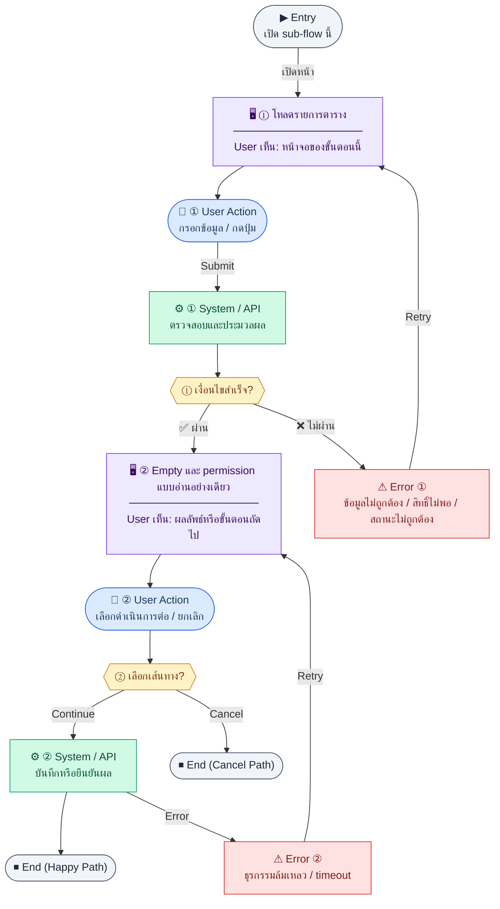

# AttendancePage

คู่มือแปลง UX → spec: [`../../UX_TO_UI_SPEC_WORKFLOW.md`](../../UX_TO_UI_SPEC_WORKFLOW.md)

**Route:** `/hr/attendance`

---

## Metadata

| Key | Value |
|-----|--------|
| **UX flow** | [`R2-07_Attendance_and_Time_Tracking.md`](../../../UX_Flow/Functions/R2-07_Attendance_and_Time_Tracking.md) |
| **UX sub-flow / steps** | สรุปใน Appendix — แตกตามหัวข้อ Sub-flow / Step ในเอกสาร UX |
| **Design system** | [`design-system.md`](../../design-system.md) — §3 Page layout, §5 forms, §6 DataTable ตามประเภทหน้า |
| **Global FE behaviors** | [`_GLOBAL_FRONTEND_BEHAVIORS.md`](../../../UX_Flow/_GLOBAL_FRONTEND_BEHAVIORS.md) |
| **Preview** | [`AttendancePage.preview.html`](./AttendancePage.preview.html) · [`../_Shared/preview-base.css`](../_Shared/preview-base.css) · [`MD_TO_PREVIEW_HTML_MANUAL.md`](../MD_TO_PREVIEW_HTML_MANUAL.md) |

---

## เป้าหมายหน้าจอ

แสดงสถิติเวลาทำงานรายวัน (KPI: เข้างาน/สาย/ขาด/ยังไม่ลง) พร้อม widget เช็คอิน/เช็คเอาท์ของตนเอง และตาราง attendance ของพนักงานทุกคนที่ HR กรองและดูได้

## ผู้ใช้และสิทธิ์

อ่าน Actor(s) และ permission gate ใน Appendix / เอกสาร UX — กรณี 401/403/409 อ้าง Global FE behaviors

## โครง layout (สรุป)

ระบุตามประเภทหน้าใน Appendix: list / detail / form / แท็บ — ใช้ pattern ใน design-system.md

## เนื้อหาและฟิลด์

สกัดจาก **User sees** / **User Action** / ช่องกรอกใน Appendix เป็นตารางฟิลด์เต็มเมื่อปรับแต่งรอบถัดไป; ขณะนี้ใช้บล็อก UX ด้านล่างเป็นข้อมูลอ้างอิงครบถ้วน

## การกระทำ (CTA)

สกัดจากปุ่มใน Appendix (`[...]`) และ Frontend behavior

## สถานะพิเศษ

Loading, empty, error, validation, dependency ขณะลบ — ตาม **Error** / **Success** ใน Appendix

## หมายเหตุ implementation (ถ้ามี)

เทียบ `erp_frontend` เมื่อทราบ path ของหน้า

## Preview HTML notes

| หัวข้อ | ใส่อะไร |
|--------|--------|
| **Shell** | โดยมาก `app` (ยกเว้นหน้า login / standalone) |
| **Regions** | ดูลำดับ **User sees** ใน Appendix |
| **สถานะสำหรับสลับใน preview** | `default` · `loading` · `empty` · `error` ตาม UX |
| **ข้อมูลจำลอง** | จำนวนแถว / สถานะ badge ตามประเภทหน้า |
| **ลิงก์ CSS** | [`../_Shared/preview-base.css`](../_Shared/preview-base.css) |

---

## Appendix — UX excerpt (reference)

## Sub-flow A — ตารางงาน: รายการ (`GET /api/hr/work-schedules`)

### ชื่อ Flow & ขอบเขต

**Flow name:** `Attendance — Work schedules list`

**Actor(s):** `hr_admin`, `super_admin`

**Entry:** เมนู HR → ตั้งค่าเวลา / Work schedules

**Exit:** เลือก schedule เพื่อแก้ไขหรือ assign

**Out of scope:** การคำนวณ OT อัตโนมัติละเอียด (อธิบายใน BR แยกจาก UX ปุ่ม)

---

### Scenario Flow

### สัญลักษณ์ Node (Color Legend)

| สี | Node shape | หมายถึง |
|----|-----------|---------|
| 🟣 ม่วง | สี่เหลี่ยม `["…"]` | **Screen / UI State** |
| 🔵 น้ำเงิน | วงกลม `(["…"])` | **User Action** |
| 🟢 เขียว | สี่เหลี่ยม `["…"]` | **System / API** |
| 🟡 เหลือง | เพชร `{{"…"}}` | **Decision** |
| 🔴 แดง | สี่เหลี่ยม `["…"]` | **Error / Edge case** |
| ⚫ เทา | วงรี `(["…"])` | **Start / End** |

---

### Step A1 — โหลดรายการตาราง

**Goal:** แสดงตารางงานที่นิยามเวลาเข้า-ออกและวันทำงาน

**User sees:** ตาราง/การ์ด schedule, loading

**User can do:** ค้นหา, กรอง, กดสร้างใหม่

**User Action:**
- ประเภท: `เลือกตัวเลือก / กดปุ่ม`
- ช่องที่ใช้กรอง/ดูข้อมูล:
  - `search` *(optional)* : ค้นหาตารางงานตามชื่อ
  - `page` / `limit` *(optional)* : เปลี่ยนหน้ารายการ
- ปุ่ม / Controls ในหน้านี้:
  - `[Create Schedule]` → เปิดฟอร์มสร้าง
  - `[Open Detail]` → ดูหรือแก้ schedule ที่เลือก
  - `[Refresh]` → โหลดรายการล่าสุด

**Frontend behavior:**

- `GET /api/hr/work-schedules` (+ query ตาม BE)
- เก็บผลใน cache สั้น ๆ เมื่อสลับไปหน้า assign แล้วกลับมา

**System / AI behavior:** คืนรายการจาก `work_schedules`

**Success:** 200

**Error:** 401 → refresh auth; 403 → access denied

**Notes:** BR อธิบายว่า schedule ใช้กับ attendance + payroll — แสดงชื่อ schedule ให้ชัดเจนเมื่อ assign

---

### Step A2 — Empty และ permission แบบอ่านอย่างเดียว

**Goal:** HR ที่อ่านได้แต่แก้ไม่ได้ยังเห็น list

**User sees:** ปุ่มสร้าง/แก้ไขถูกซ่อน

**User can do:** ดูอย่างเดียว

**User Action:**
- ประเภท: `กดปุ่ม`
- ปุ่ม / Controls ในหน้านี้:
  - `[Refresh]` → โหลดใหม่เมื่อรายการว่าง
  - `[View Detail]` → เปิด schedule แบบ read-only

**Frontend behavior:** ซ่อนปุ่มจาก permission; ยังเรียก `GET /api/hr/work-schedules`

**System / AI behavior:** 403 บน mutating calls เท่านั้น

**Success:** ประสบการณ์ read-only สม่ำเสมอ

**Error:** —

**Notes:** **permission gates** ตาม brief

---
