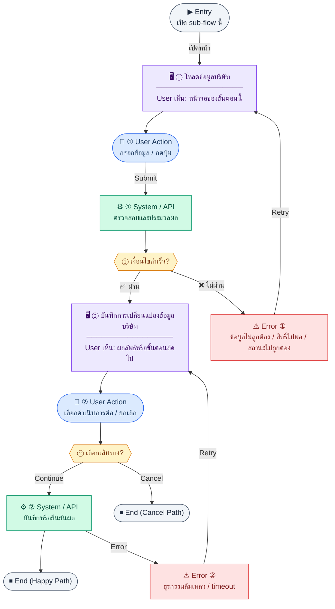

# CompanyProfileSettings

คู่มือแปลง UX → spec: [`../../UX_TO_UI_SPEC_WORKFLOW.md`](../../UX_TO_UI_SPEC_WORKFLOW.md)

**Route:** `/settings/company`

---

## Metadata

| Key | Value |
|-----|--------|
| **UX flow** | [`R2-08_Company_Organization_Settings.md`](../../../UX_Flow/Functions/R2-08_Company_Organization_Settings.md) |
| **UX sub-flow / steps** | สรุปใน Appendix — แตกตามหัวข้อ Sub-flow / Step ในเอกสาร UX |
| **Design system** | [`design-system.md`](../../design-system.md) — §3 Page layout, §5 forms, §6 DataTable ตามประเภทหน้า |
| **Global FE behaviors** | [`_GLOBAL_FRONTEND_BEHAVIORS.md`](../../../UX_Flow/_GLOBAL_FRONTEND_BEHAVIORS.md) |
| **Preview** | [`CompanyProfileSettings.preview.html`](./CompanyProfileSettings.preview.html) · [`../_Shared/preview-base.css`](../_Shared/preview-base.css) · [`MD_TO_PREVIEW_HTML_MANUAL.md`](../MD_TO_PREVIEW_HTML_MANUAL.md) |

---

## เป้าหมายหน้าจอ

ฟอร์มข้อมูลบริษัทแบบ singleton — view mode (read-only) สลับเป็น edit mode (in-place) พร้อม section อัปโหลดโลโก้แยก ใช้ข้อมูลจากหน้านี้เป็น header PDF เอกสารทุกโมดูล

## ผู้ใช้และสิทธิ์

- **ดูข้อมูล**: settings admin ทั่วไป (permission `settings:company:read`)
- **แก้ไข / บันทึก**: ต้องมีสิทธิ์ `settings:company:write`
- กรณี 401/403/409 อ้าง Global FE behaviors

## โครง layout (สรุป)

Settings form — single-column header + 3 card sections:
1. **โลโก้บริษัท** — logo preview + Upload button
2. **ข้อมูลทั่วไป** — ชื่อ TH/EN, taxId, address, phone, email, website, currency, fiscalYearStart
3. **VAT** — vatRegistered toggle, vatNo, defaultVatRate
4. **Prefix เอกสาร** — invoicePrefix, poPrefix, quotPrefix, soPrefix

## เนื้อหาและฟิลด์

| ฟิลด์ | Required | Control | หมายเหตุ |
|-------|----------|---------|----------|
| `companyName` | required | text input | ชื่อบริษัทภาษาไทย |
| `companyNameEn` | optional | text input | ชื่อบริษัทภาษาอังกฤษ |
| `taxId` | required | text input | 13 หลัก, validate format |
| `address` | required | textarea | |
| `phone` | optional | text input | |
| `email` | optional | email input | |
| `website` | optional | url input | |
| `currency` | required | select | THB default |
| `fiscalYearStart` | required | select | เดือน 1–12 |
| `fiscalYearStartDay` | required | number input | วันเริ่มต้น 1–28; default 1 |
| `vatRegistered` | required | checkbox/toggle | |
| `vatNo` | optional | text input | แสดงเมื่อ vatRegistered = true |
| `defaultVatRate` | required | number input | 0–100 |
| `invoicePrefix` | required | text input | |
| `poPrefix` | required | text input | |
| `quotPrefix` | required | text input | |
| `soPrefix` | required | text input | |
| `logoFile` | optional | file input | multipart → Sub-flow B |

## การกระทำ (CTA)

- **View mode**: `[แก้ไขข้อมูล]` → เข้า edit mode, `[อัปโหลดโลโก้]` → Sub-flow B
- **Edit mode**: `[บันทึก]` → `PUT /api/settings/company`, `[ยกเลิก]` → กลับ view mode
- **Error state**: `[Retry]` → `GET /api/settings/company`

## สถานะพิเศษ

- **Loading**: skeleton บน page bootstrap
- **Network error (500)**: error banner + Retry button
- **Save loading**: disable ฟิลด์ทั้งหมด + spinner บนปุ่ม Save
- **Validation (400)**: inline error ใต้ฟิลด์
- **Business rule (409)**: toast error พร้อมรายละเอียด (เช่น prefix ถูกใช้งานอยู่)
- **Logo upload**: progress bar, 413 ไฟล์ใหญ่, 415 ชนิดไม่รองรับ

## หมายเหตุ implementation (ถ้ามี)

- หลัง save สำเร็จ → refresh header app ถ้าแสดงชื่อ/โลโก้บริษัท
- `vatNo` ควร conditional-render เฉพาะเมื่อ `vatRegistered = true`
- การเปลี่ยน prefix จะไม่กระทบเลขที่เอกสารที่ออกไปแล้ว (BE validate)

## Preview HTML notes

| หัวข้อ | ใส่อะไร |
|--------|--------|
| **Shell** | โดยมาก `app` (ยกเว้นหน้า login / standalone) |
| **Regions** | ดูลำดับ **User sees** ใน Appendix |
| **สถานะสำหรับสลับใน preview** | `default` · `loading` · `empty` · `error` ตาม UX |
| **ข้อมูลจำลอง** | จำนวนแถว / สถานะ badge ตามประเภทหน้า |
| **ลิงก์ CSS** | [`../_Shared/preview-base.css`](../_Shared/preview-base.css) |

---

## Appendix — UX excerpt (reference)

## Sub-flow A — อ่านและแก้ไขข้อมูลบริษัท (Singleton)

### Scenario Flow

### สัญลักษณ์ Node (Color Legend)

| สี | Node shape | หมายถึง |
|----|-----------|---------|
| 🟣 ม่วง | สี่เหลี่ยม `["…"]` | **Screen / UI State** |
| 🔵 น้ำเงิน | วงกลม `(["…"])` | **User Action** |
| 🟢 เขียว | สี่เหลี่ยม `["…"]` | **System / API** |
| 🟡 เหลือง | เพชร `{{"…"}}` | **Decision** |
| 🔴 แดง | สี่เหลี่ยม `["…"]` | **Error / Edge case** |
| ⚫ เทา | วงรี `(["…"])` | **Start / End** |

---

### Step A1 — โหลดข้อมูลบริษัท

**Goal:** แสดงฟอร์มข้อมูลบริษัทจากแถวเดียว (singleton) โดยไม่ต้องมี id ใน path

**User sees:** ฟิลด์ชื่อ TH/EN, เลขนิติ, ที่อยู่, โทร, อีเมล, เว็บ, สกุลเงิน, `fiscalYearStart`, VAT, prefix เอกสาร (`invoicePrefix`, `poPrefix`, `quotPrefix`, `soPrefix`) ตาม BR

**User can do:** อ่านค่า, เตรียมแก้ไข

**User Action:**
- ประเภท: `กดปุ่ม`
- ปุ่ม / Controls ในหน้านี้:
  - `[Edit Company Settings]` → เข้าโหมดแก้ไข
  - `[Retry]` → โหลดข้อมูลบริษัทใหม่

**Frontend behavior:** `GET /api/settings/company` หลัง bootstrap หน้า

**System / AI behavior:** อ่าน `company_settings` แถวเดียว

**Success:** bind ฟอร์มครบ

**Error:** 404/500 — แสดง error และ retry

**Notes:** BR ระบุ singleton — FE ไม่ควรออกแบบให้ผู้ใช้เลือก "หลายบริษัท" ใน flow นี้

### Step A2 — บันทึกการเปลี่ยนแปลงข้อมูลบริษัท

**Goal:** อัปเดตข้อมูลบริษัทแบบ replace ตาม `PUT`

**User sees:** ปุ่มบันทึก, validation errors, loading

**User can do:** แก้ไขฟิลด์และบันทึก

**User Action:**
- ประเภท: `กรอกข้อมูล / เลือกตัวเลือก`
- ช่องที่ต้องกรอก:
  - `companyName` *(required)* : ชื่อบริษัท
  - `companyNameEn` *(optional)* : ชื่อบริษัทภาษาอังกฤษ
  - `taxId` *(required)* : เลขนิติ/ภาษี
  - `address` *(required)* : ที่อยู่
  - `phone` *(optional)* : เบอร์โทรบริษัท
  - `email` *(optional)* : อีเมลบริษัท
  - `website` *(optional)* : เว็บไซต์บริษัท
  - `logoUrl` *(optional)* : ลิงก์โลโก้
  - `currency` *(required)* : สกุลเงินหลัก
  - `fiscalYearStart` *(required)* : เดือนเริ่มปีบัญชี
  - `vatRegistered` *(required)* : สถานะ VAT registration
  - `vatNo` *(optional)* : เลข VAT
  - `defaultVatRate` *(required)* : อัตรา VAT ปริยาย
  - `invoicePrefix` *(required)* : prefix invoice
  - `poPrefix` *(required)* : prefix purchase order
  - `quotPrefix` *(required)* : prefix quotation
  - `soPrefix` *(required)* : prefix sales order
- ปุ่ม / Controls ในหน้านี้:
  - `[Save Company Settings]` → เรียก `PUT /api/settings/company`
  - `[Cancel]` → ยกเลิกการแก้ไข

**Frontend behavior:**

- client validation (รูปแบบเลขผู้เสียภาษี, ช่วง `defaultVatRate`, ฯลฯ)
- `PUT /api/settings/company` body ชุดเต็มตามสัญญา API

**System / AI behavior:** UPDATE singleton; BR ระบุว่าเปลี่ยน `invoicePrefix` ต้องไม่กระทบ running sequence — คาดหวัง validation ฝั่ง BE

**Success:** 200; แสดงข้อความสำเร็จ; refresh header แอปถ้าแสดงชื่อ/โลโก้

**Error:** 400 validation, 409 business rule

**Notes:** การเปลี่ยนข้อมูลมีผลกับ PDF header ทุกโมดูลที่อ้าง `company_settings`

---
