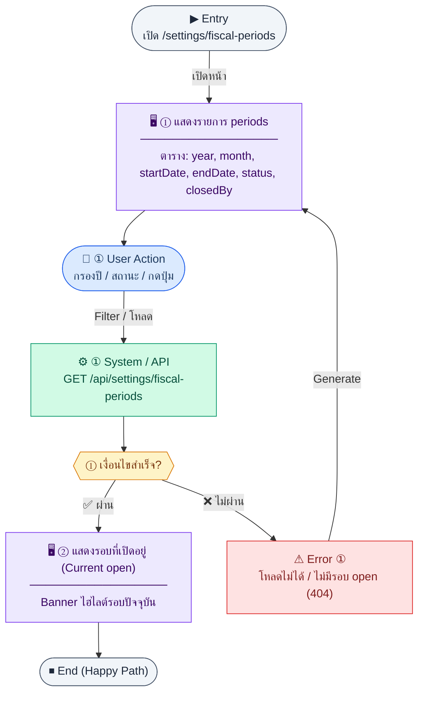
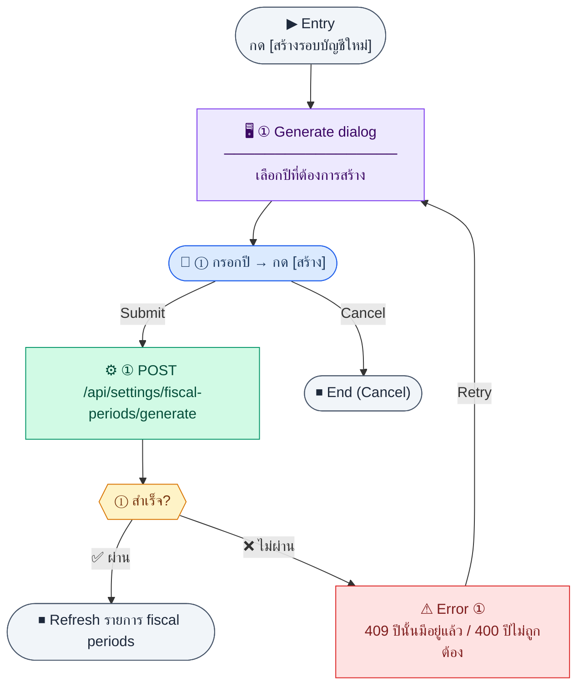
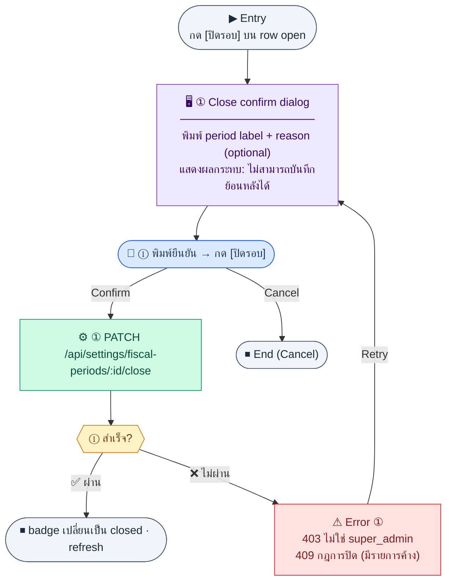
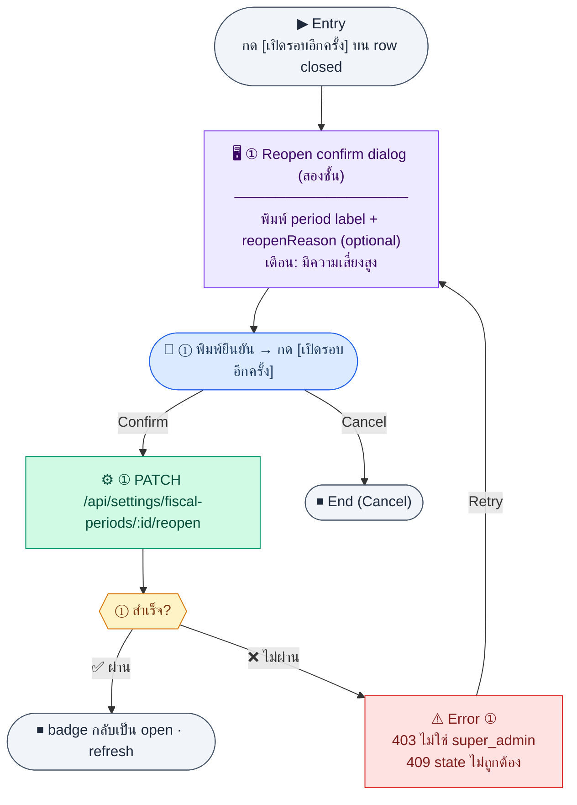

# FiscalPeriodManagement

คู่มือแปลง UX → spec: [`../../UX_TO_UI_SPEC_WORKFLOW.md`](../../UX_TO_UI_SPEC_WORKFLOW.md)

**Route:** `/settings/fiscal-periods`

---

## Metadata

| Key | Value |
|-----|--------|
| **UX flow** | [`R2-08_Company_Organization_Settings.md`](../../../UX_Flow/Functions/R2-08_Company_Organization_Settings.md) |
| **UX sub-flow / steps** | Sub-flow C (list), D (generate), E (close), F (reopen) |
| **Design system** | [`design-system.md`](../../design-system.md) — §3 Page layout, §6 DataTable |
| **Global FE behaviors** | [`_GLOBAL_FRONTEND_BEHAVIORS.md`](../../../UX_Flow/_GLOBAL_FRONTEND_BEHAVIORS.md) |
| **Preview** | [`FiscalPeriodManagement.preview.html`](./FiscalPeriodManagement.preview.html) · [`../_Shared/preview-base.css`](../_Shared/preview-base.css) · [`MD_TO_PREVIEW_HTML_MANUAL.md`](../MD_TO_PREVIEW_HTML_MANUAL.md) |

---

## เป้าหมายหน้าจอ

รายการรอบบัญชีทั้งหมดพร้อมสถานะ open/closed — สร้างรอบบัญชีอัตโนมัติ, ปิดรอบ, เปิดรอบอีกครั้ง (เฉพาะ super_admin) เพื่อควบคุมการบันทึกรายการบัญชีย้อนหลัง

## ผู้ใช้และสิทธิ์

- **ดูรายการ**: settings admin ทั่วไป
- **Generate / Close / Reopen**: ต้องเป็น `super_admin` เท่านั้น — ซ่อนปุ่มสำหรับผู้ใช้ที่ไม่มีสิทธิ์ตั้งแต่ render
- กรณี 401/403/409 อ้าง Global FE behaviors

## โครง layout (สรุป)

List page — toolbar (year filter + status filter + Generate button) + current period banner + data table พร้อม action per row

## เนื้อหาและฟิลด์

**ตาราง fiscal periods:**

| คอลัมน์ | Source field | หมายเหตุ |
|---------|-------------|----------|
| รอบบัญชี | label | human-readable เช่น "Q2 FY2026 (Jul–Sep)" จาก BE |
| Granularity | granularity | badge: 1M / 1Q / 1H / 1Y |
| วันเริ่มต้น | startDate | |
| วันสิ้นสุด | endDate | |
| สถานะ | status | badge: open = green, closed = neutral/gray |
| ปิดโดย / วันที่ปิด | closedBy + closedAt | แสดง — เมื่อยัง open |
| การทำงาน | — | [ปิดรอบ] สำหรับ open · [เปิดรอบอีกครั้ง] สำหรับ closed (super_admin) |

**Filter:**
- `year` (select) — กรองปีบัญชี
- `granularity` (select: ทั้งหมด / 1M / 1Q / 1H / 1Y) — กรอง granularity
- `status` (select: open / closed) — กรองสถานะ

## การกระทำ (CTA)

- `[สร้างรอบบัญชีใหม่]` → dialog 3 ขั้น: (1) กรอก year + granularity + startMonth + startDay (1–28) → (2) preview table → (3) confirm → `POST /api/settings/fiscal-periods/generate`
- `[ปิดรอบ]` → confirm dialog (พิมพ์ period label ยืนยัน + reason optional) → `PATCH /api/settings/fiscal-periods/:id/close`
- `[เปิดรอบอีกครั้ง]` → confirm dialog สองชั้น + reopenReason → `PATCH /api/settings/fiscal-periods/:id/reopen`
- Current period banner ไฮไลต์แถว open ปัจจุบัน + ลิงก์ Generate เมื่อไม่มีรอบ open

## สถานะพิเศษ

- **ไม่มีรอบ open (404)**: banner แนะนำ Generate
- **Generate ซ้ำ (409)**: แสดงจำนวนที่ skip
- **403 (non-super_admin)**: ซ่อนปุ่ม Generate/Close/Reopen ตั้งแต่ render
- **Loading**: skeleton table
- **Close/Reopen สำเร็จ**: refresh รายการ + toast success

## หมายเหตุ implementation (ถ้ามี)

- ปิดรอบแล้ว FE ควรซ่อนปุ่ม Reopen สำหรับผู้ใช้ที่ไม่ใช่ super_admin แต่ยังแสดง badge "closed" ชัดเจน
- Generate dialog ควรแสดง fiscalYearStart จาก company_settings เพื่อ preview ว่าจะสร้าง period ช่วงไหน
- `reopenReason` ควรส่งไปทุกครั้งเพื่อรองรับ audit trail (Sub-flow F)

## Preview HTML notes

| หัวข้อ | ใส่อะไร |
|--------|--------|
| **Shell** | `app` |
| **Regions** | current period banner · toolbar (filter + Generate) · data table |
| **สถานะสำหรับสลับใน preview** | `default` · `empty` (ไม่มีรอบ) · `loading` |
| **ข้อมูลจำลอง** | แสดง 5 แถว — 3 closed + 1 open (current) + 1 open future |
| **ลิงก์ CSS** | [`../_Shared/preview-base.css`](../_Shared/preview-base.css) |

---

## Appendix — UX excerpt (reference)

## Sub-flow C — รายการรอบบัญชีและรอบปัจจุบัน

### Scenario Flow

### สัญลักษณ์ Node (Color Legend)

| สี | Node shape | หมายถึง |
|----|-----------|---------|
| 🟣 ม่วง | สี่เหลี่ยม `["…"]` | **Screen / UI State** |
| 🔵 น้ำเงิน | วงกลม `(["…"])` | **User Action** |
| 🟢 เขียว | สี่เหลี่ยม `["…"]` | **System / API** |
| 🟡 เหลือง | เพชร `{{"…"}}` | **Decision** |
| 🔴 แดง | สี่เหลี่ยม `["…"]` | **Error / Edge case** |
| ⚫ เทา | วงรี `(["…"])` | **Start / End** |

---

### Step C1 — แสดงรายการ periods

**Goal:** ให้ผู้ใช้เห็นทุกรอบ (ปี/เดือน/สถานะ open|closed)

**User sees:** ตาราง `/settings/fiscal-periods` คอลัมน์ year, month, startDate, endDate, status, วันที่ปิด

**User can do:** เรียง/กรองปี, เปิด action close/reopen ตามสิทธิ์

**User Action:**
- ประเภท: `เลือกตัวเลือก / กดปุ่ม`
- ช่องที่ใช้กรอง:
  - `year` *(optional)* : กรองตามปีบัญชี
  - `status` *(optional)* : open หรือ closed
  - `dateFrom` *(optional)* : วันเริ่มช่วงที่ต้องการดู
  - `dateTo` *(optional)* : วันสิ้นสุดช่วงที่ต้องการดู
- ปุ่ม / Controls ในหน้านี้:
  - `[สร้างรอบบัญชีใหม่]` → เปิด dialog generate
  - `[ปิดรอบ]` → เปิด confirm dialog สำหรับ period open
  - `[เปิดรอบอีกครั้ง]` → เปิด confirm dialog สำหรับ period closed

**Frontend behavior:** `GET /api/settings/fiscal-periods` พร้อม query `year`, `status`, `dateFrom`, `dateTo`, `page`, `limit` ตามสัญญา

**System / AI behavior:** อ่าน `fiscal_periods`

**Success:** ตารางแสดงครบ

**Error:** มาตรฐาน

**Notes:** BR ระบุ `UNIQUE (year, month)`

### Step C2 — แสดงรอบที่เปิดอยู่ (Current open)

**Goal:** เน้นรอบที่ใช้โพสต์รายการบัญชีปัจจุบัน

**User sees:** chip หรือ banner "รอบบัญชีปัจจุบัน" ด้านบนตาราง + ไฮไลต์แถวในตาราง

**User can do:** —

**User Action:**
- ประเภท: `กดปุ่ม`
- ปุ่ม / Controls ในหน้านี้:
  - `[Open Current Period]` → ไฮไลต์แถวรอบบัญชีปัจจุบัน
  - `[สร้างรอบบัญชีใหม่]` → ไปสร้างรอบใหม่เมื่อยังไม่มี current open

**Frontend behavior:** `GET /api/settings/fiscal-periods/current` แสดงเป็น banner ด้านบน หรือ highlight แถว

**System / AI behavior:** resolve รอบ open ตามกฎบัญชี

**Success:** แสดงรอบ current ชัดเจน

**Error:** 404 ถ้าไม่มีรอบ open — UX ควรชี้ไปที่ generate

**Notes:** BR ระบุว่าปิด period แล้วไม่สามารถ post journal ย้อนหลังได้ — ควรแสดงคำเตือนเมื่อใกล้ปิดรอบ

---

## Sub-flow D — สร้างรอบบัญชีอัตโนมัติ (Generate)

### Scenario Flow

---

### Step D1 — Generate สำหรับปีที่เลือก

**Goal:** สร้างชุด `fiscal_periods` สำหรับปีบัญชีหนึ่งปี

**User sees:** dialog เลือกปี/พารามิเตอร์, preview ว่าจะสร้าง period ช่วงไหน (อ้างอิง fiscalYearStart จาก company_settings)

**User can do:** ยืนยันการสร้าง (กันการกดซ้ำ)

**User Action:**
- ประเภท: `กรอกข้อมูล / กดปุ่ม`
- ช่องที่ต้องกรอก:
  - `year` *(required)* : ปีที่ต้องการ generate
- ปุ่ม / Controls ในหน้านี้:
  - `[สร้างรอบบัญชี]` → เรียก `POST /api/settings/fiscal-periods/generate`
  - `[ยกเลิก]` → ยกเลิก

**Frontend behavior:** `POST /api/settings/fiscal-periods/generate` body `{ "year": 2026 }`

**System / AI behavior:** สร้างแถว 12 เดือน (หรือตามปีบัญชีที่นิยาม) ถ้ายังไม่มี

**Success:** 201; refresh `GET /api/settings/fiscal-periods`; แสดงจำนวนที่สร้างได้ / skip ถ้า BE ส่งกลับมา

**Error:** 409 ชุดข้อมูลมีอยู่แล้ว (พร้อมบอกว่า skip กี่แถว), 400 พารามิเตอร์ผิด

**Notes:** ควรแสดง preview ว่าจะสร้าง period ช่วงไหนก่อน submit เพื่อลด error

---

## Sub-flow E — ปิดรอบบัญชี (Close)

### Scenario Flow

---

### Step E1 — Close period

**Goal:** ปิดรอบเพื่อหยุดการบันทึกย้อนหลังในรอบนั้น

**User sees:** confirm dialog เน้นผลกระทบต่อการบันทึกบัญชี, ช่องพิมพ์ยืนยัน period label

**User can do:** ยืนยัน

**User Action:**
- ประเภท: `กรอกข้อมูล / กดปุ่ม`
- ช่องที่ต้องกรอก:
  - `confirmPeriodLabel` *(required, FE confirmation only)* : พิมพ์ปี/เดือนเพื่อยืนยัน
  - `reason` *(optional, API field)* : เหตุผลการปิดรอบ
- ปุ่ม / Controls ในหน้านี้:
  - `[ปิดรอบ]` → เรียก `PATCH /api/settings/fiscal-periods/:id/close`
  - `[ยกเลิก]` → ยกเลิก

**Frontend behavior:** `PATCH /api/settings/fiscal-periods/:id/close` ส่ง `reason` เมื่อผู้ใช้กรอก; ตรวจ `confirmPeriodLabel` ใน FE ก่อนยิง API

**System / AI behavior:** BR กำหนดต้องเป็น `super_admin`; บันทึก `closedAt`, `closedBy`

**Success:** 200; แถวเปลี่ยนเป็น `closed`

**Error:** 403 ไม่ใช่ super_admin, 409 กฎการปิด (เช่น มีรายการค้าง)

**Notes:** ควรซ่อนปุ่ม [ปิดรอบ] สำหรับผู้ใช้ที่ไม่มีสิทธิ์ตั้งแต่ใน FE

---

## Sub-flow F — เปิดรอบบัญชีใหม่ (Reopen)

### Scenario Flow

---

### Step F1 — Reopen period

**Goal:** เปิดรอบที่ปิดผิดพลาดหรือตามคำสั่ง audit (กรณีพิเศษ)

**User sees:** confirm dialog สองชั้น เพราะมีความเสี่ยงสูง

**User can do:** ยืนยัน

**User Action:**
- ประเภท: `กรอกข้อมูล / กดปุ่ม`
- ช่องที่ต้องกรอก:
  - `confirmPeriodLabel` *(required, FE confirmation only)* : พิมพ์ปี/เดือนเพื่อยืนยัน reopen
  - `reopenReason` *(optional, API field)* : เหตุผลการเปิดรอบใหม่
- ปุ่ม / Controls ในหน้านี้:
  - `[เปิดรอบอีกครั้ง]` → เรียก `PATCH /api/settings/fiscal-periods/:id/reopen`
  - `[ยกเลิก]` → ยกเลิก

**Frontend behavior:** `PATCH /api/settings/fiscal-periods/:id/reopen`

**System / AI behavior:** BR กำหนดต้องเป็น `super_admin`

**Success:** 200; สถานะกลับเป็น `open`

**Error:** 403, 409

**Notes:** UI ควรส่ง `reopenReason` (optional) เพื่อรองรับ audit trace

---
