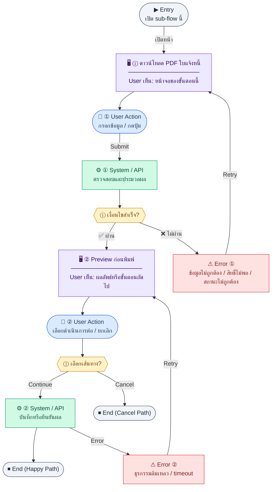

# PrintExportPatterns

คู่มือแปลง UX → spec: [`../../UX_TO_UI_SPEC_WORKFLOW.md`](../../UX_TO_UI_SPEC_WORKFLOW.md)

**Route:** `— (ดู Entry ใน UX ด้านล่าง)`

---

## Metadata

| Key | Value |
|-----|--------|
| **UX flow** | [`R2-09_Document_Print_Export.md`](../../../UX_Flow/Functions/R2-09_Document_Print_Export.md) |
| **UX sub-flow / steps** | สรุปใน Appendix — แตกตามหัวข้อ Sub-flow / Step ในเอกสาร UX |
| **Design system** | [`design-system.md`](../../design-system.md) — §3 Page layout, §5 forms, §6 DataTable ตามประเภทหน้า |
| **Global FE behaviors** | [`_GLOBAL_FRONTEND_BEHAVIORS.md`](../../../UX_Flow/_GLOBAL_FRONTEND_BEHAVIORS.md) |
| **Preview** | [`PrintExportPatterns.preview.html`](./PrintExportPatterns.preview.html) · [`../_Shared/preview-base.css`](../_Shared/preview-base.css) · [`MD_TO_PREVIEW_HTML_MANUAL.md`](../MD_TO_PREVIEW_HTML_MANUAL.md) |

---

## เป้าหมายหน้าจอ

**R2-09 ไม่ใช่หน้าเดี่ยว** — เป็น cross-module pattern catalog สำหรับทุกปุ่ม Print/Export ในระบบ ปุ่มเหล่านี้ฝังอยู่ใน detail page และ report page ของแต่ละโมดูล (ไม่มีหน้า "/print-export" กลาง)

## ผู้ใช้และสิทธิ์

| Sub-flow | หน้าที่ใช้ | สิทธิ์ที่ต้องการ |
|----------|-----------|----------------|
| A — Invoice PDF/Preview | `/finance/invoices/:id` | `finance:invoices:read` |
| B — AP Bill PDF | `/finance/ap` (detail) | `finance:ap:read` |
| C — Quotation PDF | `/finance/quotations/:id` | `finance:quotations:read` |
| D — PO PDF | `/finance/purchase-orders/:id` | `finance:purchase-orders:read` |
| E — WHT Certificate PDF | `/finance/tax/wht` | `finance:tax:read` |
| F — Report Export | `/finance/reports/*` | `finance:reports:read` |
| G — VAT Export | `/finance/tax/vat-report` | `finance:tax:read` |
| H — PND Export | `/finance/tax/wht` | `finance:tax:read` |
| I — Payslip | `/hr/payroll` (run detail) | `hr:payroll:read` (HR) หรือ เจ้าของสลิป |

## โครง layout (สรุป)

ไม่มี layout เฉพาะ — ปุ่ม export ถูก inject เข้า action bar ของแต่ละ detail/report page:
- **Detail pages (A–E, I1)**: ปุ่มอยู่ใน page action bar ด้านบนขวา
- **Report pages (F–H)**: ปุ่ม Export + format selector อยู่ใน report toolbar
- **Table row (I1)**: ปุ่ม Download ใน column สุดท้ายของ payslip table

## เนื้อหาและฟิลด์

### ปุ่มตาม sub-flow

| Sub-flow | ปุ่มหลัก | ปุ่มเพิ่มเติม |
|----------|---------|-------------|
| A1 — Invoice Download | `[Download Invoice PDF]` | `[Retry]` |
| A2 — Invoice Preview | `[Preview Invoice]` | `[Download PDF]` (ใน modal), `[Close Preview]` |
| B — AP Bill | `[Download Vendor Invoice PDF]` | `[Retry]` |
| C — Quotation | `[Download Quotation PDF]` | `[Retry]` |
| D — PO | `[Download PO PDF]` | `[Retry]` |
| E — WHT Cert | `[Download WHT Certificate]` | `[Retry]` |
| F — Financial Stmt | Format selector (PDF/Excel) + `[Export Statement]` | `[Cancel]` |
| G — VAT | Month + Year picker + Format + `[Export VAT Summary]` | `[Cancel]` |
| H — PND | Form selector + Month + Year + Format + `[Export PND Report]` | `[Cancel]` |
| I1 — Payslip single | `[Download PDF]` (per row) | `[Retry]` |
| I2 — Payslip bundle | `[Export Payslip Bundle]` (run-level) | `[Download ZIP]` (async done), `[Cancel]` |

### Input fields (เฉพาะ sub-flow ที่มี)

| Field | Sub-flow | Type | Required |
|-------|----------|------|----------|
| `statementType` | F | dropdown: profit-loss / balance-sheet / cash-flow | ✅ |
| `format` | F, G, H | toggle/dropdown: pdf / xlsx | ✅ |
| `periodFrom` / `periodTo` | F (P&L, CF), G, H | date picker | ✅ |
| `asOfDate` | F (BS) | date picker | ✅ |
| `month` | G, H | dropdown 1–12 | ✅ |
| `year` | G, H | number input (พ.ศ.) | ✅ |
| `form` | H | dropdown: PND1 / PND3 / PND53 | ✅ |

## การกระทำ (CTA)

**Primary CTA ทุก sub-flow:** ปุ่ม download/export — กดแล้ว disabled ทันที + แสดง spinner ระหว่างรอ

**Pattern ตามประเภท response:**
- **Synchronous inline** (A1, B, C, D, E, I1): blob download + toast ✅ ชื่อไฟล์
- **Format export** (F, G, H): blob download ตาม Content-Type ที่ BE ส่งกลับ
- **Async bulk** (I2): poll status → progress banner → `[Download ZIP]` เมื่อ done

## สถานะพิเศษ

| สถานะ | UI |
|-------|-----|
| **Loading** | ปุ่มหลัก disabled + spinner; label เปลี่ยนเป็น "กำลังสร้างไฟล์…" |
| **Success** | Toast ✅ "filename.pdf ดาวน์โหลดสำเร็จ" — ปุ่มกลับ normal |
| **Error 401** | redirect `/login` |
| **Error 403** | Toast ❌ "ไม่มีสิทธิ์เข้าถึงเอกสารนี้" |
| **Error 404** | Toast ❌ "ไม่พบเอกสาร" |
| **Error 5xx** | Toast ❌ "เกิดข้อผิดพลาด" + `[Retry]` |
| **Async processing** | Progress banner "กำลังสร้าง ZIP…" + estimatedReadyAt |
| **Async done** | Banner เปลี่ยนเป็น ✅ + ปุ่ม `[Download ZIP]` |
| **Async link expired (410)** | Toast "ลิงก์หมดอายุ — กด Export ใหม่" |

## หมายเหตุ implementation

- ทุก request ส่ง `Authorization: Bearer <access_token>` (ดู `R1-01_Auth_Login_and_Session.md`)
- Binary response: ใช้ `response.blob()` → `URL.createObjectURL()` → click anchor `download`
- Preview response (Sub-flow A2): `response.json()` → `data.html` → inject ใน modal container
- ชื่อไฟล์ดึงจาก `Content-Disposition` header (`attachment; filename="..."`) — fallback ใช้ชื่อ default ตาม document type
- Async I2: เมื่อ BE return `202 + jobId` → poll `GET .../export/:jobId/status` ทุก 5s → render progress banner; เมื่อ `status=done` แสดงปุ่ม Download; เมื่อ `expiresAt` ผ่านไปและ user กด Download อีก → 410 → toast + Export ใหม่

## Preview HTML notes

| หัวข้อ | ใส่อะไร |
|--------|--------|
| **Shell** | โดยมาก `app` (ยกเว้นหน้า login / standalone) |
| **Regions** | ดูลำดับ **User sees** ใน Appendix |
| **สถานะสำหรับสลับใน preview** | `default` · `loading` · `empty` · `error` ตาม UX |
| **ข้อมูลจำลอง** | จำนวนแถว / สถานะ badge ตามประเภทหน้า |
| **ลิงก์ CSS** | [`../_Shared/preview-base.css`](../_Shared/preview-base.css) |

---

## Appendix — UX excerpt (reference)

## Sub-flow A — Invoice AR (PDF + Preview)

**กลุ่ม endpoint:** `GET /api/finance/invoices/:id/pdf`, `GET /api/finance/invoices/:id/preview`

### Scenario Flow

### สัญลักษณ์ Node (Color Legend)

| สี | Node shape | หมายถึง |
|----|-----------|---------|
| 🟣 ม่วง | สี่เหลี่ยม `["…"]` | **Screen / UI State** |
| 🔵 น้ำเงิน | วงกลม `(["…"])` | **User Action** |
| 🟢 เขียว | สี่เหลี่ยม `["…"]` | **System / API** |
| 🟡 เหลือง | เพชร `{{"…"}}` | **Decision** |
| 🔴 แดง | สี่เหลี่ยม `["…"]` | **Error / Edge case** |
| ⚫ เทา | วงรี `(["…"])` | **Start / End** |

---

### Step A1 — ดาวน์โหลด PDF ใบแจ้งหนี้

**Goal:** ได้ PDF ส่งลูกค้า

**Frontend behavior:** `GET /api/finance/invoices/:id/pdf`

**Notes:** ใช้บนหน้า `/finance/invoices/:id`

**User Action:**
- ประเภท: `กดปุ่ม`
- ปุ่ม / Controls ในหน้านี้:
  - `[Download Invoice PDF]` → เรียก `GET /api/finance/invoices/:id/pdf`
  - `[Retry]` → ลองดาวน์โหลดใหม่

### Step A2 — Preview ก่อนพิมพ์

**Goal:** ดู layout บนหน้าจอโดยไม่ดาวน์โหลด

**Frontend behavior:** `GET /api/finance/invoices/:id/preview` (render ตาม MIME ที่ BE คืน)

**Notes:** ช่วยลดรอบการสร้าง PDF ซ้ำ

---

**User Action:**
- ประเภท: `กดปุ่ม`
- ปุ่ม / Controls ในหน้านี้:
  - `[Preview Invoice]` → เปิด preview บนจอ
  - `[Download PDF]` → ดาวน์โหลดจากหน้า preview
  - `[Close Preview]` → ปิด modal/side panel
