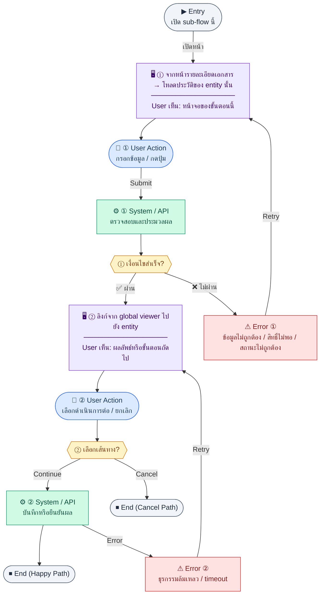

# EntityAuditTrail

คู่มือแปลง UX → spec: [`../../UX_TO_UI_SPEC_WORKFLOW.md`](../../UX_TO_UI_SPEC_WORKFLOW.md)

**Route:** `— (ดู Entry ใน UX ด้านล่าง)`

---

## Metadata

| Key | Value |
|-----|--------|
| **UX flow** | [`R2-12_Audit_Trail.md`](../../../UX_Flow/Functions/R2-12_Audit_Trail.md) |
| **UX sub-flow / steps** | สรุปใน Appendix — แตกตามหัวข้อ Sub-flow / Step ในเอกสาร UX |
| **Design system** | [`design-system.md`](../../design-system.md) — §3 Page layout, §5 forms, §6 DataTable ตามประเภทหน้า |
| **Global FE behaviors** | [`_GLOBAL_FRONTEND_BEHAVIORS.md`](../../../UX_Flow/_GLOBAL_FRONTEND_BEHAVIORS.md) |
| **Preview** | [`EntityAuditTrail.preview.html`](./EntityAuditTrail.preview.html) · [`../_Shared/preview-base.css`](../_Shared/preview-base.css) · [`MD_TO_PREVIEW_HTML_MANUAL.md`](../MD_TO_PREVIEW_HTML_MANUAL.md) |

---

## เป้าหมายหน้าจอ

แสดงเฉพาะเหตุการณ์ที่เกี่ยวกับ `entityType` + `entityId` หนึ่งคู่

## ผู้ใช้และสิทธิ์

อ่าน Actor(s) และ permission gate ใน Appendix / เอกสาร UX — กรณี 401/403/409 อ้าง Global FE behaviors

## โครง layout (สรุป)

ระบุตามประเภทหน้าใน Appendix: list / detail / form / แท็บ — ใช้ pattern ใน design-system.md

## เนื้อหาและฟิลด์

สกัดจาก **User sees** / **User Action** / ช่องกรอกใน Appendix เป็นตารางฟิลด์เต็มเมื่อปรับแต่งรอบถัดไป; ขณะนี้ใช้บล็อก UX ด้านล่างเป็นข้อมูลอ้างอิงครบถ้วน

## การกระทำ (CTA)

สกัดจากปุ่มใน Appendix (`[...]`) และ Frontend behavior

## สถานะพิเศษ

Loading, empty, error, validation, dependency ขณะลบ — ตาม **Error** / **Success** ใน Appendix

## หมายเหตุ implementation (ถ้ามี)

เทียบ `erp_frontend` เมื่อทราบ path ของหน้า

## Preview HTML notes

| หัวข้อ | ใส่อะไร |
|--------|--------|
| **Shell** | โดยมาก `app` (ยกเว้นหน้า login / standalone) |
| **Regions** | ดูลำดับ **User sees** ใน Appendix |
| **สถานะสำหรับสลับใน preview** | `default` · `loading` · `empty` · `error` ตาม UX |
| **ข้อมูลจำลอง** | จำนวนแถว / สถานะ badge ตามประเภทหน้า |
| **ลิงก์ CSS** | [`../_Shared/preview-base.css`](../_Shared/preview-base.css) |

---

## Appendix — UX excerpt (reference)

## Sub-flow B — Audit trail ของ entity เดียว (`detail-by-entity`)

### Scenario Flow

### สัญลักษณ์ Node (Color Legend)

| สี | Node shape | หมายถึง |
|----|-----------|---------|
| 🟣 ม่วง | สี่เหลี่ยม `["…"]` | **Screen / UI State** |
| 🔵 น้ำเงิน | วงกลม `(["…"])` | **User Action** |
| 🟢 เขียว | สี่เหลี่ยม `["…"]` | **System / API** |
| 🟡 เหลือง | เพชร `{{"…"}}` | **Decision** |
| 🔴 แดง | สี่เหลี่ยม `["…"]` | **Error / Edge case** |
| ⚫ เทา | วงรี `(["…"])` | **Start / End** |

---

### Step B1 — จากหน้ารายละเอียดเอกสาร → โหลดประวัติของ entity นั้น

**Goal:** แสดงเฉพาะเหตุการณ์ที่เกี่ยวกับ `entityType` + `entityId` หนึ่งคู่

**User sees:** แท็บ "History" ใน invoice detail, employee detail, AP bill detail, ฯลฯ (ตาม BR)

**User can do:** เลื่อนอ่าน timeline, เปิดรายละเอียด diff

**User Action:**
- ประเภท: `กดปุ่ม`
- ปุ่ม / Controls ในหน้านี้:
  - `[Open History Tab]` → โหลด history ของ entity ปัจจุบัน
  - `[View Changes]` → เปิด diff ของรายการที่เลือก
  - `[Retry]` → โหลด history ใหม่

**Frontend behavior:**

- ดึง `entityType` และ `entityId` จาก context ของหน้า (เช่น `invoice` + `uuid`)
- `GET /api/settings/audit-logs/:entityType/:entityId`

**System / AI behavior:** ใช้ index `idx_audit_logs_entity` ตาม BR

**Success:** แสดงลำดับเหตุการณ์จากสร้างจนถึงล่าสุด

**Error:** 404 ไม่มี log, 403

**Notes:** path พารามิเตอร์สองตัวต้องตรงกับค่าที่บันทึกใน `audit_logs` (case/format ให้สอดคล้องกับ BE)

### Step B2 — ลิงก์จาก global viewer ไปยัง entity

**Goal:** จากแถว log ไปยังหน้าธุรกิจที่เกี่ยวข้อง

**User sees:** คลิกได้ที่ `entityLabel` หรือไอคอนลิงก์

**User can do:** เปิดหน้า detail ของระบบนั้น (ถ้ามีสิทธิ์)

**User Action:**
- ประเภท: `กดปุ่ม`
- ปุ่ม / Controls ในหน้านี้:
  - `[Open Related Entity]` → นำทางไป route ของ entity
  - `[Back to Audit Logs]` → กลับ global viewer

**Frontend behavior:** map `module` + `entityType` + `entityId` เป็น route ฝั่ง FE (ตารางแมปเป็นสัญญาระหว่างทีม)

**System / AI behavior:** ไม่มี API เพิ่ม

**Success:** ผู้ใช้ตรวจสอบเอกสารต้นทางได้

**Error:** 403 ที่หน้าเป้าหมาย — แสดง unauthorized

**Notes:** การมองเห็น log กับการมองเห็นเอกสารอาจต่างกัน — ออกแบบให้ชัด

---

## Coverage Checklist

| Endpoint | Covered in UX file | Notes |
|----------|-------------------|-------|
| `GET /api/settings/audit-logs` | Sub-flow A — Global log viewer (`/settings/audit-logs`) | Steps A1–A3 list, filters, diff drawer |
| `GET /api/settings/audit-logs/:entityType/:entityId` | Sub-flow B — Audit trail ของ entity เดียว (`detail-by-entity`) | Entity History tab; drill-down from global viewer |

## Coverage Lock Notes (2026-04-16)

### In-scope endpoints
- `GET /api/settings/audit-logs`
- `GET /api/settings/audit-logs/:entityType/:entityId`

### Canonical filters / enums
- filters ต้องยึด `module`, `entityType`, `actorId`, `action`, `startDate`, `endDate`
- action enum lock: `create`, `update`, `delete`, `status_change`, `login`, `logout`, `approve`, `reject`

### UX lock
- ห้ามใช้ค่า `action=approve` เพิ่มเองนอกชุด canonical
- diff/detail drawer ต้องยึด `changes[]` และ `context` จาก response entity-detail ไม่ประกอบเองจาก list rows
- filter controls ต้อง map เป็น `module`, `entityType`, `actorId`, `action`, `startDate`, `endDate` เท่านั้น; legacy naming เช่น `userId`, `dateFrom`, `dateTo` ใช้ไม่ได้ใน canonical UX
- actor picker/source สำหรับ `actorId` ให้ reuse `GET /api/settings/users`; ถ้าเป็น system action และไม่มี actor ให้แสดงเป็น system-generated state ไม่บังคับเลือก user
- dropdown/options ของ `action` และ `entityType` ต้องยึด catalog/query semantics เดียวกับ API เพื่อให้ filter state, deep link, และ saved search ตรงกัน
