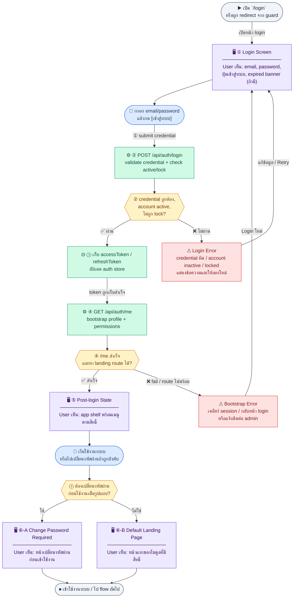
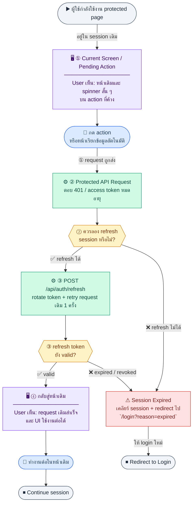
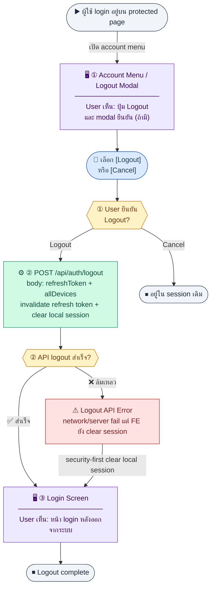
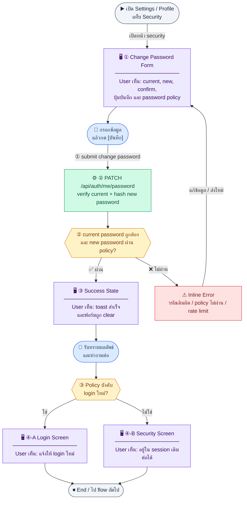

# UX Flow — R1-01 Auth: Login, Session, `/me`, และเปลี่ยนรหัสผ่าน

เอกสารนี้เป็น **UX flow แบบ endpoint-driven** สำหรับการยืนยันตัวตนและ session ใน Release 1 โดยอิงลำดับและสัญญา API จาก SD_Flow

**แหล่งอ้างอิงที่ผูกกับเอกสารนี้**

- Business requirement (BR): `Documents/Requirements/Release_1.md` (Feature 1.1 Auth + RBAC)
- Traceability: `Documents/Requirements/Release_1_traceability_mermaid.md` (Feature 1.1)
- Sequence / SD_Flow: `Documents/SD_Flow/User_Login/login.md`
- Pattern อ้างอิงสไตล์: `Documents/UX_Flow/Login.md`, `Documents/UX_Flow/_TEMPLATE.md`
- Related screens / mockups: `Documents/UI_Flow_mockup/Page/R1-01_Auth_Login_and_Session/Login.md`, `Login.preview.html`, `SessionBootstrap.md`, `ChangePassword.md`, `LogoutConfirm.md`

---

## E2E Scenario Flow

> ภาพรวมการยืนยันตัวตนและ session ของ Release 1 ตั้งแต่ผู้ใช้เข้าหน้า login, ได้ token, bootstrap สิทธิ์, ใช้งานต่อ, refresh session, logout และเปลี่ยนรหัสผ่าน

```mermaid
flowchart TD
    classDef screen   fill:#ede9fe,stroke:#7c3aed,color:#3b0764
    classDef user     fill:#dbeafe,stroke:#2563eb,color:#1e3a5f
    classDef success  fill:#d1fae5,stroke:#059669,color:#064e3b
    classDef decision fill:#fef3c7,stroke:#d97706,color:#78350f
    classDef error    fill:#fee2e2,stroke:#dc2626,color:#7f1d1d
    classDef terminal fill:#f1f5f9,stroke:#475569,color:#1e293b

    START(["▶ เปิด `/login`\nหรือถูก redirect เพราะไม่มี session"]):::terminal

    SCR1["🖥 Login Screen
    ─────────────────────
    📝 email (required)
    📝 password (required)
    📢 expired / unauthorized banner (optional)
    ─────────────────────
    🔘 [เข้าสู่ระบบ]  🔘 [Show/Hide Password]"]:::screen

    U1(["👤 กรอก email/password\nแล้วกด [เข้าสู่ระบบ]"]):::user

    START --> SCR1
    SCR1 --> U1

    D1{{"credential ถูกต้อง,\naccount active,\nไม่ถูก lock?"}}:::decision
    ERR1["⚠ Login Error
    credential ผิด / account inactive / locked
    แสดงข้อความและให้ลองใหม่"]:::error

    U1 --> D1
    D1 -- "✅ ผ่าน" --> SCR2
    D1 -- "❌ ไม่ผ่าน" --> ERR1
    ERR1 -->|"แก้ไข / Retry"| SCR1

    SCR2["🖥 Session Bootstrap
    ─────────────────────
    📋 เก็บ accessToken / refreshToken
    📋 เรียก `GET /api/auth/me`
    📋 โหลด profile + permissions
    ─────────────────────
    🔘 [Retry] (เฉพาะ error state)"]:::screen

    U2(["👤 รอระบบ bootstrap\nหรือกด [Retry] เมื่อโหลดไม่สำเร็จ"]):::user
    D2{{"`/me` สำเร็จ\nและหา landing route ได้?"}}:::decision
    ERR2["⚠ Bootstrap Error
    เคลียร์ session / กลับหน้า login
    หรือแจ้งติดต่อ admin"]:::error

    SCR2 --> U2
    U2 --> D2
    D2 -- "✅ สำเร็จ" --> SCR3
    D2 -- "❌ fail / route ไม่พร้อม" --> ERR2
    ERR2 -->|"Login ใหม่"| SCR1

    SCR3["🖥 Protected App Shell
    ─────────────────────
    📋 เมนูตาม role/permission
    📋 หน้าแรกตาม default route
    ─────────────────────
    🔘 [Logout]  🔘 [Security / Change Password]"]:::screen

    U3(["👤 ใช้งานระบบต่อ\nหรือเลือก action ด้านความปลอดภัย"]):::user
    D3{{"เกิด scenario ไหนต่อ?"}}:::decision

    SCR3 --> U3
    U3 --> D3

    SCR4A["🖥 Silent Refresh State
    ─────────────────────
    ⏳ request เดิมค้างชั่วคราว
    ระบบเรียก `POST /api/auth/refresh`
    ─────────────────────
    🔘 [Login ใหม่] (เมื่อ refresh fail)"]:::screen

    SCR4B["🖥 Logout Confirm / Login
    ─────────────────────
    📋 ยืนยัน logout และเคลียร์ session
    ─────────────────────
    🔘 [Logout]  🔘 [Cancel]"]:::screen

    SCR4C["🖥 Change Password Form
    ─────────────────────
    📝 currentPassword (required)
    📝 newPassword (required)
    📝 confirmPassword (required)
    ─────────────────────
    🔘 [บันทึก]  🔘 [ยกเลิก]"]:::screen

    D3 -- "access token หมดอายุ" --> SCR4A
    D3 -- "ผู้ใช้กด Logout" --> SCR4B
    D3 -- "ผู้ใช้เปลี่ยนรหัสผ่าน" --> SCR4C
    D3 -- "ใช้งานปกติ" --> OUT1

    D4{{"refresh token ยัง valid?"}}:::decision
    OUT1["✅ ใช้งานระบบต่อได้\nsession และสิทธิ์พร้อมใช้งาน"]:::success
    OUT2["✅ refresh สำเร็จ\nretry request เดิมและทำงานต่อ"]:::success
    OUT3["✅ logout สำเร็จ\nกลับหน้า login"]:::success
    OUT4["✅ เปลี่ยนรหัสผ่านสำเร็จ\nอยู่ session เดิมหรือต้อง login ใหม่ตาม policy"]:::success
    ERR4["⚠ Session Expired\nredirect `/login?reason=expired`"]:::error
    ERR5["⚠ Change Password Error\nรหัสเดิมผิด / policy ไม่ผ่าน / network error"]:::error

    SCR4A --> D4
    D4 -- "✅ valid" --> OUT2
    D4 -- "❌ expired / revoked" --> ERR4
    SCR4B --> OUT3
    SCR4C --> OUT4
    SCR4C -->|"submit ไม่ผ่าน"| ERR5
    ERR5 -->|"แก้ข้อมูล / Retry"| SCR4C

    END(["⏹ End / ไป flow ถัดไป"]):::terminal

    OUT1 --> END
    OUT2 --> END
    OUT3 --> END
    OUT4 --> END
    ERR4 --> END
```

### Scenario Summary

| Scenario | ขั้นตอน | ผลลัพธ์ |
|----------|---------|---------|
| ✅ Login สำเร็จ | เปิด `/login` → กรอกข้อมูล → ผ่าน validation → bootstrap `/me` | เข้า app shell พร้อมสิทธิ์ครบ |
| ✅ Silent refresh สำเร็จ | ใช้งาน protected page → token หมดอายุ → refresh → retry request เดิม | ใช้งานต่อโดยไม่ต้อง login ใหม่ |
| ✅ Logout | อยู่ในระบบ → กด logout → เคลียร์ session | กลับหน้า login |
| ✅ เปลี่ยนรหัสผ่านสำเร็จ | เปิด Security → กรอกรหัสเดิม/ใหม่ → submit | บันทึกสำเร็จและจัดการ session ตาม policy |
| ⚠ Login ไม่ผ่าน | กรอกข้อมูล → credential ผิด / account inactive / locked | แสดง error และให้ลองใหม่ |
| ⚠ Bootstrap ไม่สำเร็จ | login สำเร็จ → `GET /api/auth/me` fail / route ไม่พร้อม | เคลียร์ session หรือพากลับ login |
| ⚠ Refresh ไม่สำเร็จ | ใช้งานอยู่ → token หมดอายุ → refresh token หมดอายุ/ถูก revoke | redirect ไป `/login?reason=expired` |
| ⚠ เปลี่ยนรหัสผ่านไม่ผ่าน | กรอกฟอร์ม → current password ผิด / policy ไม่ผ่าน | แสดง inline error และให้แก้ไข |

---

## Sub-flow A — เข้าสู่ระบบ (Login → Token → Bootstrap)

### ชื่อ Flow & ขอบเขต

**Flow name:** `Auth — Login และรับ JWT + context ผู้ใช้`

**Actor(s):** พนักงานทุกบทบาทที่มีบัญชี (`super_admin`, `hr_admin`, `finance_manager`, `pm_manager`, `employee`)

**Entry:** เปิด `/login` โดยตรง, ถูก redirect จาก guard เมื่อไม่มี session, หรือ query เช่น `?reason=expired`

**Exit:** เข้า shell ของแอปพร้อม auth state ครบ หรืออยู่ที่ `/login` พร้อมข้อความ error ที่ชัดเจน

**Out of scope:** ลืมรหัสผ่าน, self-registration, MFA/OTP, social login

---

### Scenario Flow



---

### Step A1 — เปิดหน้า Login

**Goal:** ให้ผู้ใช้เห็นจุดเริ่มต้นและสถานะ session (ถ้ามี) ก่อนกรอกข้อมูล

**User sees:** ฟอร์ม `email` + `password`, ปุ่มเข้าสู่ระบบ, (ถ้ามี) banner ว่า session หมดอายุหรือถูกบังคับออกจากระบบ

**User can do:** กรอกข้อมูล, กดปุ่มหรือ Enter เพื่อ submit

**User Action:**

- ประเภท: `กรอกแบบฟอร์ม / กดยืนยัน`
- ช่องที่ต้องกรอก (ตาม API required fields):
  - `ช่อง 1 — email` *(required)* : อีเมลบัญชีผู้ใช้ รูปแบบ `name@company.com`
  - `ช่อง 2 — password` *(required)* : รหัสผ่านของผู้ใช้ แสดงเป็น masked input
- ปุ่ม / Controls ในหน้านี้:
  - `[เข้าสู่ระบบ]` → submit ไป Step A2 เมื่อฟอร์ม valid
  - `[Enter]` → submit เทียบเท่าปุ่มเข้าสู่ระบบ
  - `[Show/Hide Password]` → toggle การแสดงรหัสผ่านโดยไม่ submit

**Frontend behavior:**

- โหลดหน้า `/login` โดยยัง **ไม่** เรียก `POST /api/auth/login`
- แปลง query `reason` เป็น copy ที่เหมาะสม (เช่น expired / unauthorized)
- disable ปุ่ม submit จนกว่า email ผ่านรูปแบบขั้นต้นและมี password (ลด spam submit)

**System / AI behavior:** ยังไม่มีการตรวจ credential ฝั่งเซิร์ฟเวอร์

**Success:** ผู้ใช้พร้อมส่ง login

**Error:** โหลด static assets/config ล้มเหลว → แสดงข้อความพร้อมปุ่ม retry

**Notes:** ตาม BR ไม่มี self-registration — หน้า login ไม่ควรมีลิงก์สมัครสมาชิก

---

### Step A2 — Submit credential

**Goal:** ส่ง `email` + `password` ไปตรวจสอบและรับ token ชุดแรก

**User sees:** ค่าที่กรอก, สถานะ loading หลัง submit

**User can do:** แก้ไขก่อน submit; หลัง submit ควรถูกบล็อก double-submit

**User Action:**

- ประเภท: `กดปุ่มยืนยัน`
- ช่องที่ต้องกรอก (ตาม API required fields):
  - `ช่อง 1 — email` *(required)* : ส่งจากค่าที่ผู้ใช้กรอกในฟอร์ม login
  - `ช่อง 2 — password` *(required)* : ส่งจากค่าที่ผู้ใช้กรอกในฟอร์ม login
- ปุ่ม / Controls ในหน้านี้:
  - `[เข้าสู่ระบบ]` → `POST /api/auth/login`
  - `[แก้ไขข้อมูล]` → แก้ `email` หรือ `password` แล้ว submit ใหม่หลังได้รับ error

**Frontend behavior:**

- validate ฝั่ง client ก่อนยิง `POST /api/auth/login` (payload `{ email, password }`)
- ระหว่างรอ response: loading, disable ปุ่ม/ฟอร์มตามนโยบาย UX

**System / AI behavior:**

- ตรวจ `users.email`, `passwordHash` (bcrypt), `isActive`, นโยบาย lock หลัง fail ต่อเนื่อง (ตาม BR)
- คืน `accessToken`, `refreshToken`, และข้อมูล `user` (roles/permissions) ตามสัญญา API

**Success:** ได้ response 200/201 พร้อม token และ context ฝั่งผู้ใช้

**Error:** 400 (validation), 401 (credential ผิด), 403/423 (inactive/locked), timeout/network

**Notes:** BR ระบุ login fail ต่อเนื่อง 5 ครั้งอาจ lock — FE ควรแสดงข้อความทั่วไป (ไม่เปิดเผยว่า email มีในระบบหรือไม่) และ countdown/ติดต่อ admin ตาม policy

---

### Step A3 — เก็บ session ฝั่ง client

**Goal:** เก็บ token และสิทธิ์อย่างปลอดภัยเพื่อใช้ request ถัดไป

**User sees:** สั้น ๆ เป็น loading หรือ transition ไป bootstrap

**User can do:** รอ

**User Action:**

- ประเภท: `ดูข้อมูล / รอระบบ`
- ช่องที่ต้องกรอก (ตาม API required fields): —
- ปุ่ม / Controls ในหน้านี้:
  - `ไม่มี direct action` → ระบบดำเนินการต่ออัตโนมัติไป Step A4

**Frontend behavior:**

- เก็บ token ตาม NFR (เช่น httpOnly cookie หรือ memory — **ไม่** เก็บ access token ใน `localStorage` ตาม BR)
- อัปเดต auth store (user, permissions, expiry ถ้ามี)

**System / AI behavior:** อัปเดต `lastLoginAt` และบันทึก audit ตาม implementation

**Success:** client พร้อมเรียก API ที่ต้องใช้ Bearer

**Error:** response ไม่ครบ schema → แสดง error และเคลียร์ state ชั่วคราว

**Notes:** `super_admin` อาจ bypass permission บางส่วนฝั่ง API — FE ยังคงควรซ่อนเมนูตาม least surprise

---

### Step A4 — Bootstrap ด้วย `GET /api/auth/me`

**Goal:** ยืนยันว่า access token ใช้งานได้และ sync profile ล่าสุดก่อนเข้า landing

**User sees:** loading overlay/skeleton ของ app shell

**User can do:** รอ (หรือ cancel ถ้ามี design สำหรับ slow network — ไม่บังคับ)

**User Action:**

- ประเภท: `ดูข้อมูล / รอระบบ`
- ช่องที่ต้องกรอก (ตาม API required fields): —
- ปุ่ม / Controls ในหน้านี้:
  - `[Retry]` *(ใน error state)* → เรียก `GET /api/auth/me` ใหม่ 1 ครั้งก่อน fallback ไป login
  - `ไม่มี direct action` → ระหว่าง bootstrap ระบบ redirect ต่อให้อัตโนมัติเมื่อสำเร็จ

**Frontend behavior:**

- เรียก `GET /api/auth/me` พร้อม `Authorization: Bearer <access_token>`
- ถ้า 401: เคลียร์ session → redirect `/login?reason=unauthorized`
- ถ้า 200: merge ข้อมูล user + `employeeId` (ถ้ามี) เข้า global state

**System / AI behavior:**

- validate JWT, join `users` ↔ `employees` ตาม `employeeId`
- คืน context ปัจจุบัน (สิทธิ์, สถานะ active)

**Success:** ได้ข้อมูล `/me` ครบและพร้อม render

**Error:** 401/403, user ถูก deactivate ระหว่าง session

**Notes:** BR ระบุให้ใช้ `/me` ช่วง bootstrap — ควร retry 1 ครั้งหลัง silent refresh ถ้า fail เพราะ token เพิ่งหมดอายุ

---

### Step A5 — Redirect ตามสิทธิ์

**Goal:** พาผู้ใช้ไปหน้าแรกที่สอดคล้องกับ role/permission

**User sees:** หน้า landing ของโมดูลที่อนุญาต

**User can do:** ใช้งานเมนูที่มีสิทธิ์

**User Action:**

- ประเภท: `เลือกเมนู / เข้าใช้งานโมดูล`
- ช่องที่ต้องกรอก (ตาม API required fields): —
- ปุ่ม / Controls ในหน้านี้:
  - `[Open default module]` → redirect อัตโนมัติไป route แรกที่อนุญาต
  - `[Sidebar/Menu items]` → เข้าเมนูที่ role/permission อนุญาตเท่านั้น

**Frontend behavior:**

- คำนวณ default route จาก permission list
- ป้องกัน deep-link ไป route ที่ไม่มีสิทธิ์ → หน้า access denied

**System / AI behavior:** request ถัดไปผ่าน middleware ตรวจ permission ระดับ API

**Success:** ผู้ใช้อยู่ใน route ที่ถูกต้อง

**Error:** ไม่มี route ใดที่ match permission → หน้าแจ้งติดต่อ admin

**Notes:** การซ่อนเมนูใน FE ไม่แทนการ enforce ใน BE; ถ้ามีนโยบาย `mustChangePassword` จากการสร้าง user ครั้งแรก FE ควรบังคับไปหน้าเปลี่ยนรหัสผ่านก่อนเข้าใช้งานเต็มรูปแบบ

---

## Sub-flow B — Session หมดอายุ: Silent refresh (`POST /api/auth/refresh`)

### ชื่อ Flow & ขอบเขต

**Flow name:** `Auth — Refresh access token โดยไม่บังคับ login ใหม่`

**Actor(s):** ผู้ใช้ที่ยังมี refresh token ที่ valid

**Entry:** access token หมดอายุระหว่างใช้งาน, หรือ API ตอบ 401 ที่บ่งชี้ว่า refresh ได้

**Exit:** request เดิมสำเร็จหลัง retry หรือ redirect `/login`

**Out of scope:** การเปลี่ยนรหัสผ่าน, การ revoke session จาก admin แบบ real-time (ยกเว้นผลลัพธ์ที่สะท้อนหลัง refresh fail)

---

### Scenario Flow



---

### Step B1 — ตรวจจับ 401 / expiry

**Goal:** แยกแยะว่าควร refresh หรือต้อง logout

**User sees:** โดยปกติไม่เห็น (silent); บางกรณีเห็น spinner สั้น ๆ บน action ที่ค้าง

**User can do:** ทำงานต่อได้ถ้า refresh สำเร็จเร็ว

**User Action:**

- ประเภท: `ทำงานต่อ / รอระบบ`
- ช่องที่ต้องกรอก (ตาม API required fields): —
- ปุ่ม / Controls ในหน้านี้:
  - `ไม่มี direct action` → request เดิมอยู่สถานะ pending ระหว่างระบบตัดสินใจ refresh

**Frontend behavior:**

- interceptor จับ 401 จาก API ที่ไม่ใช่ `/auth/login` / `/auth/refresh`
- queue request ค้างระหว่าง refresh (กันยิง refresh ซ้ำพร้อมกัน)

**System / AI behavior:** ยังไม่เรียก refresh จนกว่า logic ฝั่ง client ตัดสินใจ

**Success:** เริ่มขั้นตอน refresh ครั้งเดียวต่อคิว

**Error:** ถ้า refresh กำลัง fail ต่อเนื่อง → fallback logout

**Notes:** ตาม BR access ~15 นาที, refresh ~7 วัน — ออกแบบให้ user ไม่ถูกรบกวนบ่อยเกินไป

---

### Step B2 — เรียก refresh

**Goal:** รับ access token ชุดใหม่ (และ refresh ใหม่ถ้ามี rotation)

**User sees:** (ถ้า refresh นาน) skeleton หรือ disabled ปุ่มชั่วคราว

**User can do:** รอ (หรือ retry manual ถ้าเปิดใช้)

**User Action:**

- ประเภท: `ดูข้อมูล / รอระบบ`
- ช่องที่ต้องกรอก (ตาม API required fields): —
- ปุ่ม / Controls ในหน้านี้:
  - `ไม่มี direct action` → เมื่อ refresh สำเร็จ ระบบ retry request เดิมอัตโนมัติ
  - `[Login ใหม่]` *(ใน expired state)* → redirect ไป `/login?reason=expired`

**Frontend behavior:**

- เรียก `POST /api/auth/refresh` ตามสัญญา SD (ส่ง refresh token ผ่าน mechanism ที่กำหนด — cookie/body ตาม BE)
- เมื่อสำเร็จ: อัปเดต token store, dequeue และ retry failed request **หนึ่งครั้ง**

**System / AI behavior:**

- validate refresh token, rotation/invalidate ตัวเก่า (ถ้ามี)
- คืน access (และ refresh) ใหม่

**Success:** retry request เดิมได้ 200

**Error:** refresh หมดอายุ/ถูก revoke → เคลียร์ session, redirect `/login?reason=expired`

**Notes:** refresh ควร idempotent ต่อการเรียกซ้ำจาก race เล็กน้อย — FE ใช้ mutex/singleton promise

---

## Sub-flow C — ออกจากระบบ (`POST /api/auth/logout`)

### ชื่อ Flow & ขอบเขต

**Flow name:** `Auth — Logout และ revoke refresh`

**Actor(s):** ผู้ใช้ที่ login อยู่

**Entry:** กดเมนู Logout หรือ forced logout จาก policy

**Exit:** อยู่ที่ `/login` โดยไม่มี token ใช้งานได้

**Out of scope:** revoke token ของ device อื่นจากหน้า settings (ถ้ามีในอนาคต)

---

### Scenario Flow



---

### Step C1 — ยืนยันและเรียก API

**Goal:** แจ้งเซิร์ฟเวอร์ให้ยกเลิก refresh session

**User sees:** (ถ้ามี) modal ยืนยัน; จากนั้น loading สั้น ๆ

**User can do:** ยืนยัน logout หรือยกเลิก

**User Action:**

- ประเภท: `กดยืนยัน / กดยกเลิก`
- ช่องที่ต้องกรอก (ตาม API required fields):
  - `refreshToken` *(required)* : refresh token ที่ต้อง revoke
  - `allDevices` *(required)* : `true` = logout ทุกอุปกรณ์, `false` = เฉพาะ session ปัจจุบัน
- ปุ่ม / Controls ในหน้านี้:
  - `[Logout]` → เรียก `POST /api/auth/logout` พร้อม body `{ refreshToken, allDevices }` และเคลียร์ session ฝั่ง client
  - `[Cancel]` → ปิด modal และอยู่หน้าเดิม

**Frontend behavior:**

- เรียก `POST /api/auth/logout` พร้อม Bearer access token ปัจจุบัน (ถ้ายังมี) และ body `{ refreshToken, allDevices }`
- **ไม่ว่า** API จะสำเร็จหรือไม่: เคลียร์ cookie/memory state ฝั่ง client

**System / AI behavior:** invalidate refresh/session ตาม SD

**Success:** redirect `/login` และไม่สามารถ refresh ด้วย token เดิมได้

**Error:** network error — ยังคงเคลียร์ฝั่ง client (security-first)

**Notes:** logout ควร idempotent — กดซ้ำไม่ error รุนแรง

---

## Sub-flow D — เปลี่ยนรหัสผ่านของตนเอง (`PATCH /api/auth/me/password`)

### ชื่อ Flow & ขอบเขต

**Flow name:** `Auth — เปลี่ยนรหัสผ่าน (self-service)`

**Actor(s):** ผู้ใช้ที่ login แล้ว (ทุก role ที่ได้รับอนุญาตให้เข้าถึงหน้า settings/profile ตาม product)

**Entry:** เปิดหน้า Settings / Profile → แท็บความปลอดภัย

**Exit:** ได้ข้อความสำเร็จและ session ถูกจัดการตาม policy (อาจบังคับ login ใหม่)

**Out of scope:** admin reset password ของผู้อื่น (อยู่ที่ user management อื่น)

---

### Scenario Flow



---

### Step D1 — แสดงฟอร์มเปลี่ยนรหัสผ่าน

**Goal:** ให้ผู้ใช้กรอกรหัสเดิมและรหัสใหม่ตามนโยบายความแข็งแรง

**User sees:** ช่อง `currentPassword`, `newPassword`, `confirmPassword` (UI label อาจเป็น confirm new password), ปุ่มบันทึก, hint นโยบายรหัส (ความยาว, อักขระพิเศษ ฯลฯ ตาม BR/NFR)

**User can do:** กรอกและกดบันทึก

**User Action:**

- ประเภท: `กรอกแบบฟอร์ม / กดยืนยัน`
- ช่องที่ต้องกรอก (ตาม API required fields):
  - `ช่อง 1 — currentPassword` *(required)* : รหัสผ่านปัจจุบันของผู้ใช้
  - `ช่อง 2 — newPassword` *(required)* : รหัสผ่านใหม่ อย่างน้อย 8 ตัวอักษร
  - `ช่อง 3 — confirmPassword` *(required)* : ต้องตรงกับ `newPassword` ก่อนเปิดให้ submit
- ปุ่ม / Controls ในหน้านี้:
  - `[บันทึก]` → submit ไป Step D2 เมื่อฟอร์ม valid
  - `[ยกเลิก]` → reset/ออกจากหน้าความปลอดภัยตาม design
  - `[Show/Hide Password]` → toggle masked input ของแต่ละช่อง

**Frontend behavior:**

- validate ความยาว/ความซ้ำของ confirm ก่อน submit
- disable submit จนกว่าฟอร์ม valid

**System / AI behavior:** ยังไม่เรียก API

**Success:** พร้อมส่ง `PATCH /api/auth/me/password`

**Error:** validation ฝั่ง client

**Notes:** ไม่ควร log password ใน console หรือ analytics

---

### Step D2 — Submit เปลี่ยนรหัส

**Goal:** อัปเดต `passwordHash` ในฐานข้อมูลผ่าน API

**User sees:** loading บนปุ่มบันทึก

**User can do:** รอ — ไม่ควรปิดหน้าระหว่าง request

**User Action:**

- ประเภท: `กดปุ่มยืนยัน`
- ช่องที่ต้องกรอก (ตาม API required fields):
  - `ช่อง 1 — currentPassword` *(required)* : ส่งไปเพื่อยืนยันตัวตนก่อนเปลี่ยนรหัส
  - `ช่อง 2 — newPassword` *(required)* : รหัสผ่านใหม่ที่ผ่าน policy แล้ว
  - `ช่อง 3 — confirmPassword` *(required)* : ใช้ตรวจความตรงกันก่อน submit และต้องส่งไป API ตาม contract
- ปุ่ม / Controls ในหน้านี้:
  - `[บันทึก]` → เรียก `PATCH /api/auth/me/password`
  - `[ยกเลิก]` → กลับหน้าเดิมได้เฉพาะก่อน request ถูกส่ง

**Frontend behavior:**

- เรียก `PATCH /api/auth/me/password` พร้อม Bearer access token
- body ตามสัญญา BE `{ currentPassword, newPassword, confirmPassword }`

**System / AI behavior:**

- verify `currentPassword` ด้วย bcrypt
- hash `newPassword` factor ≥ 12 (ตาม BR), บันทึกและอาจ revoke refresh ทั้งหมด (ถ้า policy บังคับ)

**Success:** 200 + toast สำเร็จ; ถ้า BE บังคับ re-login → redirect `/login` พร้อมข้อความ

**Error:** 400 (รูปแบบรหัสใหม่ไม่ผ่าน), 401 (รหัสเดิมผิด), 429 (rate limit), network

**Notes:** หลังสำเร็จ ควร clear sensitive fields ในฟอร์มทันที; ถ้า flow นี้ถูกบังคับจากนโยบาย `mustChangePassword` ควรพากลับไป login หรือ bootstrap session ใหม่ตาม policy เดียวกันทั้งระบบ

---

## Coverage Checklist


| Endpoint                      | Covered in UX file      | Notes                                               |
| ----------------------------- | ----------------------- | --------------------------------------------------- |
| `POST /api/auth/login`        | Sub-flow A, Step A2     | `Documents/SD_Flow/User_Login/login.md` — inventory |
| `GET /api/auth/me`            | Sub-flow A, Step A4     | `login.md` — bootstrap หลัง login                   |
| `POST /api/auth/refresh`      | Sub-flow B, Step B2     | `login.md` — silent refresh / queue                 |
| `POST /api/auth/logout`       | Sub-flow C, Step C1     | `login.md` — revoke refresh                         |
| `PATCH /api/auth/me/password` | Sub-flow D, Steps D1–D2 | `login.md` — self-service เปลี่ยนรหัส               |


อ้างอิง BR Feature 1.1 และ traceability ใน `Documents/Requirements/Release_1.md` / `Release_1_traceability_mermaid.md` เทียบกับ `User_Login/login.md` ได้ทีละคำขอ HTTP

## Coverage Lock Notes (2026-04-16)

### In-scope endpoints
- `POST /api/auth/login`
- `GET /api/auth/me`
- `POST /api/auth/refresh`
- `POST /api/auth/logout`
- `PATCH /api/auth/me/password`

### Canonical fields / behaviors
- session bootstrap หลัง login หรือ page reload ต้องยึด `GET /api/auth/me`
- `user.mustChangePassword` เป็น source of truth สำหรับ first-login / forced reset
- logout / deactivate ต้องทำให้ refresh sessions ถูก revoke ตาม policy เดียวกัน

### UX lock
- หลัง login สำเร็จ UI อาจใช้ login response เพื่อ redirect ทันที แต่ state ระยะยาวต้องอ่านจาก `/me`
- ถ้า `/me` ตอบ `mustChangePassword=true` ให้จำกัดการใช้งานเหลือเฉพาะ change-password flow
- refresh เป็น background behavior; ถ้า refresh fail เพราะ token ถูก revoke ให้กลับ `/login`