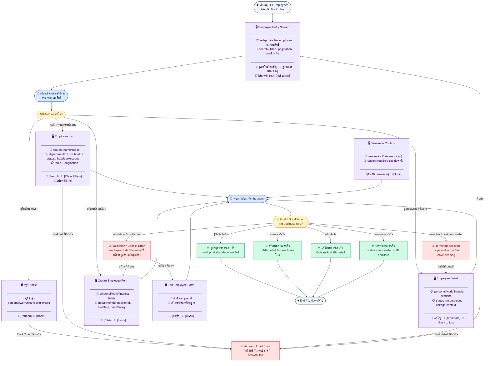
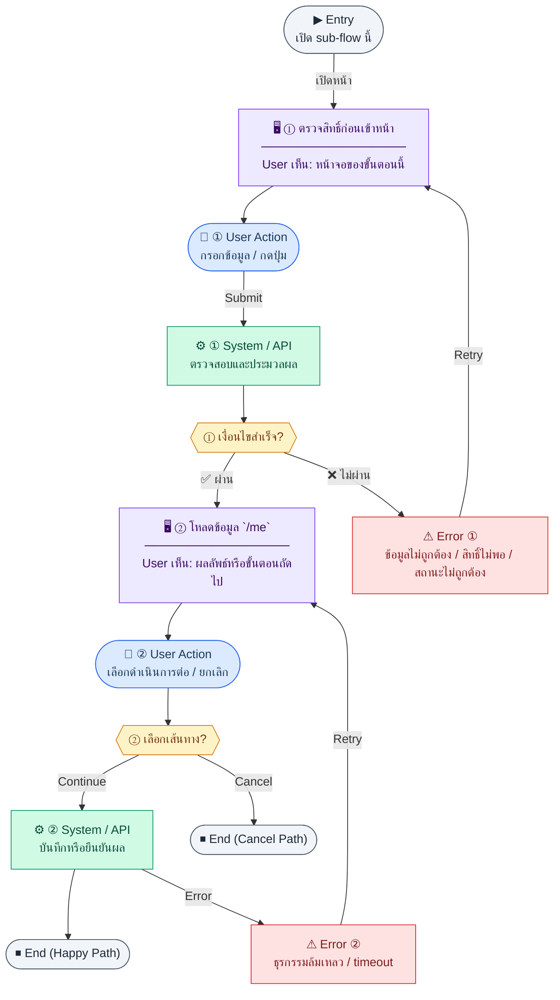
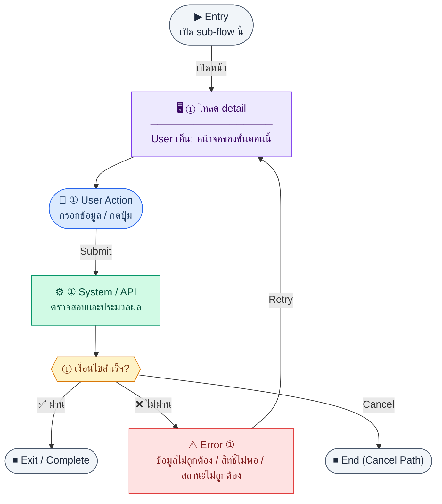

# UX Flow — R1-02 HR: จัดการพนักงาน (Employee CRUD + Profile)

เอกสารนี้อธิบาย **การเดินทางของผู้ใช้แบบ endpoint-driven** สำหรับโมดูลพนักงาน โดยอิง API จาก SD_Flow และข้อกำหนด HR Employee ใน Release 1

**แหล่งอ้างอิงที่ผูกกับเอกสารนี้**

- Business requirement (BR): `Documents/Requirements/Release_1.md` (Feature 1.2 HR — Employee Management)
- Traceability: `Documents/Requirements/Release_1_traceability_mermaid.md` (Feature 1.2)
- Sequence / SD_Flow: `Documents/SD_Flow/HR/employee.md`
- Related screens / mockups: `Documents/UI_Flow_mockup/Page/R1-02_HR_Employee_Management/EmployeeList.md`, `EmployeeForm.md`, `EmployeeDetail.md` (+ ไฟล์ `.preview.html` คู่กัน)

---

## E2E Scenario Flow

> ภาพรวมการจัดการพนักงานทั้งฟังก์ชันใน Release 1 ครอบคลุม self-profile, รายการพนักงาน, ดูรายละเอียด, สร้าง, แก้ไข และ terminate โดยเชื่อมกับ organization และ settings user account

### Scenario Summary

| Scenario | ขั้นตอน | ผลลัพธ์ |
|----------|---------|---------|
| ✅ ดูโปรไฟล์ตนเอง | เข้า My Profile → ตรวจสิทธิ์ → เรียก `GET /api/hr/employees/me` | เห็นข้อมูลพนักงานของตนเอง |
| ✅ ค้นหาและดูรายการพนักงาน | เข้า `/hr/employees` → search/filter → list โหลดสำเร็จ | เห็นรายการพนักงานตามเงื่อนไข |
| ✅ ดูรายละเอียดพนักงาน | เลือกแถวจาก list → เรียก `GET /api/hr/employees/:id` | เห็นข้อมูลเชิงลึกและ action ต่อ |
| ✅ สร้างพนักงานใหม่ | เปิดฟอร์ม create → โหลด department/position → กรอกข้อมูล → submit | สร้าง employee ใหม่และไปหน้า detail |
| ✅ แก้ไขพนักงาน | เปิด edit → preload ค่าเดิม → submit patch | ข้อมูลพนักงานอัปเดตสำเร็จ |
| ✅ Terminate พนักงาน | เปิด detail → ยืนยัน terminate → ส่งวันสิ้นสุดและเหตุผล | พนักงานถูกเปลี่ยนเป็น `terminated` |
| ⚠ ไม่มีสิทธิ์หรือโหลดข้อมูลไม่สำเร็จ | เปิดหน้า → permission fail / API fail / ไม่พบข้อมูล | แสดง access denied หรือ retry state |
| ⚠ สร้างหรือแก้ไขไม่ผ่าน validation | submit form → field ไม่ครบ / email ซ้ำ / FK ไม่ถูกต้อง | แสดง field error และให้แก้ไข |
| ⚠ Terminate ไม่ได้ | ยืนยัน terminate → ระบบพบ payroll active หรือ leave pending | block การ terminate และบอกเหตุผล |

---

## Sub-flow A — พนักงานดูโปรไฟล์ตนเอง (`GET /api/hr/employees/me`)

### ชื่อ Flow & ขอบเขต

**Flow name:** `HR Employee — Self profile (read-only หรือจำกัดฟิลด์)`

**Actor(s):** `employee` (และบทบาทอื่นที่ลิงก์ `users.employeeId`)

**Entry:** เมนู "โปรไฟล์ของฉัน" / `/hr/employees/me` (route ตาม product)

**Exit:** แสดงข้อมูลพนักงานของผู้ใช้ปัจจุบันหรือแสดง empty/error ที่ชัดเจน

**Out of scope:** การแก้ไขเงินเดือน/ภาษีโดยไม่มีสิทธิ์ HR (ถ้า BR จำกัด)

---

### Scenario Flow

### สัญลักษณ์ Node (Color Legend)

| สี | Node shape | หมายถึง |
|----|-----------|---------|
| 🟣 ม่วง | สี่เหลี่ยม `["…"]` | **Screen / UI State** |
| 🔵 น้ำเงิน | วงกลม `(["…"])` | **User Action** |
| 🟢 เขียว | สี่เหลี่ยม `["…"]` | **System / API** |
| 🟡 เหลือง | เพชร `{{"…"}}` | **Decision** |
| 🔴 แดง | สี่เหลี่ยม `["…"]` | **Error / Edge case** |
| ⚫ เทา | วงรี `(["…"])` | **Start / End** |

---

### Step A1 — ตรวจสิทธิ์ก่อนเข้าหน้า

**Goal:** ให้เฉพาะผู้ที่มีสิทธิ์เข้า route นี้

**User sees:** skeleton หรือหน้า access denied

**User can do:** กลับไป dashboard

**User Action:**
- ประเภท: `กดปุ่ม`
- ปุ่ม / Controls ในหน้านี้:
  - `[Back to Dashboard]` → กลับหน้าแรกเมื่อไม่มีสิทธิ์
  - `[Retry Permission Check]` → ลองโหลด session/permission ใหม่

**Frontend behavior:**

- ตรวจ permission จาก `GET /api/auth/me` ที่ bootstrap แล้ว
- ถ้าไม่มีสิทธิ์ → ไม่เรียก `GET /api/hr/employees/me`

**System / AI behavior:** —

**Success:** ผ่าน gate และพร้อมโหลดข้อมูล

**Error:** ไม่มีสิทธิ์ → UI ตาม design system

**Notes:** enforce จริงที่ API — 401/403 ต้อง map เป็นข้อความเดียวกัน

---

### Step A2 — โหลดข้อมูล `/me`

**Goal:** ดึง employee record ที่ผูกกับ user ที่ login

**User sees:** loading บนส่วนหัวการ์ดโปรไฟล์

**User can do:** รอ

**User Action:**
- ประเภท: `กดปุ่ม`
- ปุ่ม / Controls ในหน้านี้:
  - `[Refresh Profile]` → โหลดข้อมูลพนักงานของตนใหม่
  - `[Back]` → กลับหน้าก่อนหน้า

**Frontend behavior:**

- เรียก `GET /api/hr/employees/me` พร้อม Bearer token
- แสดงฟิลด์ตาม policy masking (เช่น เลขประกันสังคม — อาจ mask บางหลัก)

**System / AI behavior:**

- resolve `userId` → `employeeId` → row ใน `employees`

**Success:** 200 พร้อมข้อมูลครบสำหรับการแสดงผล

**Error:** 404 ไม่มี employee ผูก user → แสดงคำแนะนำติดต่อ HR

**Notes:** endpoint นี้ต่างจาก `GET /api/auth/me` — เน้นข้อมูล HR domain

---

### Step A3 — สถานะ partial / stale

**Goal:** จัดการกรณีข้อมูลเปลี่ยนระหว่าง session

**User sees:** ปุ่ม "รีเฟรช" หรือ pull-to-refresh (ถ้ามี)

**User can do:** รีเฟรชข้อมูล

**User Action:**
- ประเภท: `กดปุ่ม`
- ปุ่ม / Controls ในหน้านี้:
  - `[Refresh Profile]` → revalidate ข้อมูลล่าสุด
  - `[Dismiss]` → ปิด snackbar หรือ badge สถานะ stale

**Frontend behavior:**

- revalidate `GET /api/hr/employees/me`
- optimistic UI ไม่แนะนำสำหรับ profile อ่านอย่างเดียว

**System / AI behavior:** คืนข้อมูลล่าสุด

**Success:** UI sync กับ server

**Error:** network → snackbar + retry

**Notes:** silent background refetch เมื่อ focus หน้าต่าง (ถ้าเปิดใช้) ช่วยลดความเก่าของข้อมูล

---

## Sub-flow B — HR: รายการพนักงาน (`GET /api/hr/employees`)

### ชื่อ Flow & ขอบเขต

**Flow name:** `HR Employee — List + filter + search`

**Actor(s):** `hr_admin`, `super_admin` (และ role ที่ BR อนุญาตให้ดูรายการ)

**Entry:** เมนู HR → พนักงาน

**Exit:** เลือกแถวเพื่อไป detail หรือกดสร้างใหม่

**Out of scope:** export CSV (ถ้าไม่มีใน BR)

---

### Scenario Flow

### สัญลักษณ์ Node (Color Legend)

| สี | Node shape | หมายถึง |
|----|-----------|---------|
| 🟣 ม่วง | สี่เหลี่ยม `["…"]` | **Screen / UI State** |
| 🔵 น้ำเงิน | วงกลม `(["…"])` | **User Action** |
| 🟢 เขียว | สี่เหลี่ยม `["…"]` | **System / API** |
| 🟡 เหลือง | เพชร `{{"…"}}` | **Decision** |
| 🔴 แดง | สี่เหลี่ยม `["…"]` | **Error / Edge case** |
| ⚫ เทา | วงรี `(["…"])` | **Start / End** |

---

### Step B1 — โหลดรายการครั้งแรก

**Goal:** แสดงตารางพนักงานพร้อม pagination/filter ตาม query ที่ BE รองรับ

**User sees:** ตารางว่าง/loading, ช่องค้นหา, filter แผนก/ตำแหน่ง/สถานะ (ตาม BR)

**User can do:** ปรับ filter, พิมพ์ค้นหา, เปลี่ยนหน้า

**User Action:**
- ประเภท: `กรอกข้อมูล / เลือกตัวเลือก`
- ช่องที่ใช้กรอง/ค้นหา:
  - `search` *(optional)* : ค้นหาจากชื่อ, รหัสพนักงาน, email
  - `departmentId` *(optional)* : กรองตามแผนก
  - `positionId` *(optional)* : กรองตามตำแหน่ง
  - `status` *(optional)* : active, inactive, terminated
- ปุ่ม / Controls ในหน้านี้:
  - `[Apply Filters]` → โหลดรายการตามเงื่อนไข
  - `[Create Employee]` → เปิดฟอร์มสร้างพนักงาน
  - `[Open Detail]` → ไปหน้ารายละเอียดของแถวที่เลือก

**Frontend behavior:**

- เรียก `GET /api/hr/employees` พร้อม query string (pagination, `departmentId`, `positionId`, `status` ฯลฯ — ตามสัญญา API จริง)
- debounce ช่องค้นหาเพื่อลด load

**System / AI behavior:** คืนรายการตามสิทธิ์และ scope

**Success:** แสดงแถวข้อมูล

**Error:** 403 → หน้า access denied; 500 → retry

**Notes:** ชัดเจนใน SD ว่า query รองรับอะไร — FE ต้องส่งเฉพาะพารามิเตอร์ที่ BE รับ

---

### Step B2 — Empty state

**Goal:** สื่อสารเมื่อไม่มีข้อมูลจาก filter

**User sees:** empty illustration + คำแนะนำล้าง filter

**User can do:** ล้าง filter หรือสร้างพนักงานใหม่

**User Action:**
- ประเภท: `กดปุ่ม`
- ปุ่ม / Controls ในหน้านี้:
  - `[Clear Filters]` → ล้าง filter เพื่อดูข้อมูลทั้งหมด
  - `[Create Employee]` → เปิดฟอร์มเพิ่มพนักงานคนแรก
  - `[Retry]` → โหลดรายการซ้ำเมื่อเกิด network error

**Frontend behavior:** ไม่เรียก API ซ้ำจนกว่า user เปลี่ยนเงื่อนไข

**System / AI behavior:** —

**Success:** ผู้ใช้เข้าใจว่าไม่มีผลลัพธ์

**Error:** —

**Notes:** แยก "ไม่มีข้อมูลในระบบ" กับ "filter คุมเกินไป" ถ้า API แยก code ได้

---

## Sub-flow C — HR: รายละเอียดพนักงาน (`GET /api/hr/employees/:id`)

### ชื่อ Flow & ขอบเขต

**Flow name:** `HR Employee — Detail view`

**Actor(s):** HR ที่มีสิทธิ์ดู, หรือ manager ตาม BR (ถ้ามี)

**Entry:** คลิกแถวจาก list

**Exit:** แก้ไข, terminate, หรือกลับ list

**Out of scope:** ประวัติ audit แบบเต็ม (ถ้าไม่มี API)

---

### Scenario Flow

### สัญลักษณ์ Node (Color Legend)

| สี | Node shape | หมายถึง |
|----|-----------|---------|
| 🟣 ม่วง | สี่เหลี่ยม `["…"]` | **Screen / UI State** |
| 🔵 น้ำเงิน | วงกลม `(["…"])` | **User Action** |
| 🟢 เขียว | สี่เหลี่ยม `["…"]` | **System / API** |
| 🟡 เหลือง | เพชร `{{"…"}}` | **Decision** |
| 🔴 แดง | สี่เหลี่ยม `["…"]` | **Error / Edge case** |
| ⚫ เทา | วงรี `(["…"])` | **Start / End** |

---

### Step C1 — โหลด detail

**Goal:** แสดงข้อมูลเชิงลึกของพนักงานคนหนึ่ง

**User sees:** skeleton แล้วตามด้วยการ์ดข้อมูล

**User can do:** กลับ, แก้ไข (ถ้ามีปุ่ม)

**User Action:**
- ประเภท: `กดปุ่ม`
- ปุ่ม / Controls ในหน้านี้:
  - `[Edit Employee]` → เข้าโหมดแก้ไข
  - `[Terminate Employee]` → ไป flow ยืนยันการเลิกจ้าง/ลบ
  - `[Back to List]` → กลับหน้ารายการ

**Frontend behavior:**

- เรียก `GET /api/hr/employees/:id`
- เก็บ `id` จาก route param

**System / AI behavior:** ตรวจสิทธิ์และคืน record

**Success:** 200

**Error:** 404 (ไม่พบ), 403 (ห้ามดูคนนี้)

**Notes:** ถ้า user พยายามแก้ไขจาก URL โดยตรง — FE ต้องซ่อนปุ่มและ BE ต้อง 403

---

## Sub-flow D — HR: สร้างพนักงาน (`POST /api/hr/employees`)

### ชื่อ Flow & ขอบเขต

**Flow name:** `HR Employee — Create`

**Actor(s):** `hr_admin`, `super_admin`

**Entry:** ปุ่ม "เพิ่มพนักงาน"

**Exit:** ไปหน้า detail ของคนที่สร้าง หรืออยู่ที่ฟอร์มพร้อม error

**Out of scope:** สร้าง user account ใน API เดียวกับ employee — **ต้องทำแยกที่ Settings (R1-15)** หลังมีพนักงานแล้ว

---

### Scenario Flow

### สัญลักษณ์ Node (Color Legend)

| สี | Node shape | หมายถึง |
|----|-----------|---------|
| 🟣 ม่วง | สี่เหลี่ยม `["…"]` | **Screen / UI State** |
| 🔵 น้ำเงิน | วงกลม `(["…"])` | **User Action** |
| 🟢 เขียว | สี่เหลี่ยม `["…"]` | **System / API** |
| 🟡 เหลือง | เพชร `{{"…"}}` | **Decision** |
| 🔴 แดง | สี่เหลี่ยม `["…"]` | **Error / Edge case** |
| ⚫ เทา | วงรี `(["…"])` | **Start / End** |

---

### Step D1 — โหลด dropdown อ้างอิง

**Goal:** ให้เลือกแผนก/ตำแหน่งได้ถูกต้อง

**User sees:** ฟอร์มพร้อม dropdown ที่ loading

**User can do:** รอ

**User Action:**
- ประเภท: `กดปุ่ม`
- ปุ่ม / Controls ในหน้านี้:
  - `[Retry Loading Options]` → โหลด departments/positions ใหม่
  - `[Cancel Create]` → กลับหน้ารายการหรือปิด drawer

**Frontend behavior:**

- เรียก `GET /api/hr/departments`, `GET /api/hr/positions` (จากโมดูล organization — ดู UX R1-03) ก่อนหรือคู่ขนานกับเปิดฟอร์ม

**System / AI behavior:** คืนรายการสำหรับ select

**Success:** dropdown พร้อม

**Error:** ถ้า org API fail — แสดง warning และบล็อก submit ที่ต้องมีแผนก

**Notes:** BR ระบุว่า create/edit employee ใช้ departments + positions สำหรับ dropdown

---

### Step D2 — กรอกและ submit สร้าง

**Goal:** ส่งข้อมูลพนักงานใหม่ไปสร้าง record

**User sees:** ฟอร์มหลายส่วน (ข้อมูลส่วนตัว, การจ้างงาน, เงินเดือนฐาน ฯลฯ ตาม BR)

**User can do:** กรอก, บันทึก, ยกเลิก

**User Action:**
- ประเภท: `กรอกข้อมูล / เลือกตัวเลือก`
- ช่องที่ต้องกรอก:
  - `employeeCode` *(required)* : รหัสพนักงาน
  - `firstName` / `lastName` *(required)* : ชื่อและนามสกุล
  - `email` *(required)* : email พนักงาน
  - `departmentId` *(required)* : แผนก
  - `positionId` *(required)* : ตำแหน่ง
  - `hireDate` *(required)* : วันเริ่มงาน
  - `baseSalary` *(optional/required ตาม BR)* : เงินเดือนฐาน
- ปุ่ม / Controls ในหน้านี้:
  - `[Save Employee]` → เรียก `POST /api/hr/employees`
  - `[Cancel]` → ยกเลิกการสร้าง

**Frontend behavior:**

- client-side validation (required, email format ของฟิลด์ที่เกี่ยว, ตัวเลขเงินเดือน ≥ 0)
- `POST /api/hr/employees` พร้อม body ตาม schema BE

**System / AI behavior:**

- validate uniqueness (รหัสพนักงาน/email ถ้ามี), FK ไปแผนก/ตำแหน่ง

**Success:** 201 + `id` ใหม่ → navigate `/hr/employees/:id`

**Error:** 409 (ชน unique), 422 (field), 400

**Notes:** หลังสร้างสำเร็จ แสดง **callout / next step**: ผู้ที่มีสิทธิ์ `super_admin` (หรือตาม BR) ต้องไป **`/settings/users`** เพื่อสร้างบัญชี login และผูกพนักงานคนนี้ (`POST /api/settings/users` — ดู UX **R1-15 Sub-flow D**) การลิงก์แบบ **`/settings/users?employeeId=<newId>`** เป็น optional แต่ช่วยลด dead end

---

## Sub-flow E — HR: แก้ไขพนักงาน (`PATCH /api/hr/employees/:id`)

### ชื่อ Flow & ขอบเขต

**Flow name:** `HR Employee — Partial update`

**Actor(s):** `hr_admin`, `super_admin`

**Entry:** จากหน้า detail → "แก้ไข"

**Exit:** บันทึกสำเร็จกลับ detail หรือคงอยู่ในฟอร์มพร้อม error

**Out of scope:** การแก้ role ในระบบ auth (ถ้าแยก endpoint)

---

### Scenario Flow

### สัญลักษณ์ Node (Color Legend)

| สี | Node shape | หมายถึง |
|----|-----------|---------|
| 🟣 ม่วง | สี่เหลี่ยม `["…"]` | **Screen / UI State** |
| 🔵 น้ำเงิน | วงกลม `(["…"])` | **User Action** |
| 🟢 เขียว | สี่เหลี่ยม `["…"]` | **System / API** |
| 🟡 เหลือง | เพชร `{{"…"}}` | **Decision** |
| 🔴 แดง | สี่เหลี่ยม `["…"]` | **Error / Edge case** |
| ⚫ เทา | วงรี `(["…"])` | **Start / End** |

---

### Step E1 — โหลดค่าเดิม

**Goal:** pre-fill ฟอร์มจาก server

**User sees:** loading แล้วค่าเดิม

**User can do:** แก้ไขฟิลด์ที่อนุญาต

**User Action:**
- ประเภท: `กดปุ่ม`
- ปุ่ม / Controls ในหน้านี้:
  - `[Save Changes]` → เปิดใช้งานเมื่อมี dirty fields
  - `[Discard Changes]` → คืนค่าจากข้อมูลเดิม

**Frontend behavior:**

- `GET /api/hr/employees/:id` แล้ว bind form
- แยก "dirty state" — ปุ่มบันทึก enable เฉพาะเมื่อมีการเปลี่ยนแปลง

**System / AI behavior:** —

**Success:** ฟอร์มพร้อมแก้ไข

**Error:** โหลดไม่ได้ → retry

**Notes:** PATCH ส่งเฉพาะฟิลด์ที่เปลี่ยน (ถ้า BE รองรับ partial) เพื่อลด race

---

### Step E2 — Submit patch

**Goal:** อัปเดตข้อมูลพนักงานบางส่วน

**User sees:** loading บนปุ่มบันทึก

**User can do:** รอ

**User Action:**
- ประเภท: `กรอกข้อมูล / เลือกตัวเลือก`
- ช่องที่ต้องกรอก:
  - `email` *(optional)* : แก้ email
  - `departmentId` *(optional)* : เปลี่ยนแผนก
  - `positionId` *(optional)* : เปลี่ยนตำแหน่ง
  - `baseSalary` *(optional)* : ปรับเงินเดือนฐาน
  - `status` *(optional)* : เปลี่ยนสถานะพนักงานเมื่อ BR อนุญาต
- ปุ่ม / Controls ในหน้านี้:
  - `[Update Employee]` → เรียก `PATCH /api/hr/employees/:id`
  - `[Cancel]` → ยกเลิกการแก้ไข

**Frontend behavior:**

- `PATCH /api/hr/employees/:id` พร้อม body ที่ diff จากค่าเดิม

**System / AI behavior:** validate business rules (เช่น terminate ต้องมีวันที่สิ้นสุด — ถ้ามีใน BR)

**Success:** 200 + toast

**Error:** 409/422 พร้อม highlight field

**Notes:** ถ้ามี concurrent edit — แสดง conflict ถ้า BE ส่ง version/etag

---

## Sub-flow F — HR: ลบ/เลิกจ้าง (`DELETE /api/hr/employees/:id`)

### ชื่อ Flow & ขอบเขต

**Flow name:** `HR Employee — Delete / terminate path`

**Actor(s):** `hr_admin`, `super_admin`

**Entry:** ปุ่มอันตรายในหน้า detail (หรือ action ใน list)

**Exit:** รายการลดลงหรือสถานะเป็น inactive ตาม BE semantics

**Out of scope:** cascade ลบข้อมูลทางการเงิน (ต้องอ้าง BR compliance)

---

### Scenario Flow

### สัญลักษณ์ Node (Color Legend)

| สี | Node shape | หมายถึง |
|----|-----------|---------|
| 🟣 ม่วง | สี่เหลี่ยม `["…"]` | **Screen / UI State** |
| 🔵 น้ำเงิน | วงกลม `(["…"])` | **User Action** |
| 🟢 เขียว | สี่เหลี่ยม `["…"]` | **System / API** |
| 🟡 เหลือง | เพชร `{{"…"}}` | **Decision** |
| 🔴 แดง | สี่เหลี่ยม `["…"]` | **Error / Edge case** |
| ⚫ เทา | วงรี `(["…"])` | **Start / End** |

---

### Step F1 — ยืนยันการลบ

**Goal:** กันการลบโดยไม่ตั้งใจ

**User sees:** modal ยืนยันพิมพ์ชื่อ/รหัส

**User can do:** ยืนยันหรือยกเลิก

**User Action:**
- ประเภท: `กรอกข้อมูล / กดปุ่ม`
- ช่องที่ต้องกรอก:
  - `confirmEmployeeCode` *(required)* : พิมพ์รหัสหรือชื่อพนักงานเพื่อยืนยัน
  - `terminationDate` *(required)* : วันที่มีผลสิ้นสุดการจ้าง
  - `reason` *(required)* : เหตุผลการเลิกจ้าง
- ปุ่ม / Controls ในหน้านี้:
  - `[Confirm Termination]` → ยืนยันการดำเนินการ
  - `[Cancel]` → ปิด modal

**Frontend behavior:** ไม่เรียก API จนกว่ายืนยัน

**System / AI behavior:** —

**Success:** ผู้ใช้ยืนยัน

**Error:** ยกเลิก → ปิด modal

**Notes:** flow นี้คือ soft terminate ตาม BR/SD ไม่ใช่ hard delete; request body ต้องคง shape `{ "terminationDate": "...", "reason": "..." }`

---

### Step F2 — เรียก delete

**Goal:** terminate พนักงานแบบ soft-delete ตาม contract

**User sees:** loading บน modal

**User can do:** รอ

**User Action:**
- ประเภท: `กดปุ่ม`
- ปุ่ม / Controls ในหน้านี้:
  - `[Delete Employee]` → เรียก `DELETE /api/hr/employees/:id`
  - `[Retry Delete]` → ลองใหม่เมื่อ API ล้มเหลว

**Frontend behavior:**

- `DELETE /api/hr/employees/:id` พร้อม body `{ "terminationDate": "...", "reason": "..." }`
- เมื่อ 200: navigate กลับ `GET /api/hr/employees` list และ invalidate cache

**System / AI behavior:** ตรวจ FK / soft-delete

**Success:** 200 พร้อม `data.status = terminated`, `data.endDate = terminationDate`

**Error:** 409 ถ้ามีข้อมูลอ้างอิง (เช่น payroll ที่ lock)

**Notes:** แสดงเหตุผลจาก body error ให้ user แก้ที่อื่นก่อน (เช่น ปิดงานที่ assign ให้คนนี้)

---

## Coverage Checklist

| Endpoint | Covered in UX file | Notes |
|----------|-------------------|-------|
| `GET /api/hr/employees/me` | Sub-flow A, Steps A1–A3 | `Documents/SD_Flow/HR/employee.md` |
| `GET /api/hr/employees` | Sub-flow B, Steps B1–B2; Sub-flow F, Step F2 | `employee.md` — list + invalidate หลังลบ |
| `GET /api/hr/employees/:id` | Sub-flow C, Step C1; Sub-flow E, Step E1 | `employee.md` — detail + pre-fill แก้ไข |
| `POST /api/hr/employees` | Sub-flow D, Steps D1–D2 | `employee.md` — สร้างพนักงาน |
| `PATCH /api/hr/employees/:id` | Sub-flow E, Step E2 | `employee.md` — partial update |
| `DELETE /api/hr/employees/:id` | Sub-flow F, Steps F1–F2 | `employee.md` — ลบ/เลิกจ้าง |
| `GET /api/hr/departments` | Sub-flow D, Step D1 | `Documents/SD_Flow/HR/organization.md` — shared selector dependency with `R1-03` |
| `GET /api/hr/positions` | Sub-flow D, Step D1 | `organization.md` — shared selector dependency with `R1-03` |
| `GET /api/auth/me` | Sub-flow A, Step A1 | `Documents/SD_Flow/User_Login/login.md` — permission gate โปรไฟล์ตนเอง |

### Coverage Lock Notes (2026-04-16)
- canonical field name ของวันเริ่มงานคือ `hireDate`
- list/filter ของหน้าพนักงานต้องรองรับ `hasUserAccount` เพื่อเชื่อม flow ไป `/settings/users`
- delete flow ให้ตีความเป็น soft terminate ตามสัญญา SD (`status`, `endDate`) ไม่ใช่ hard delete
