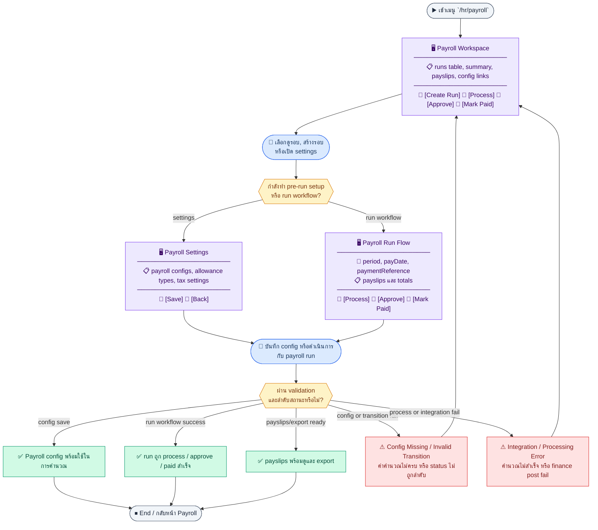
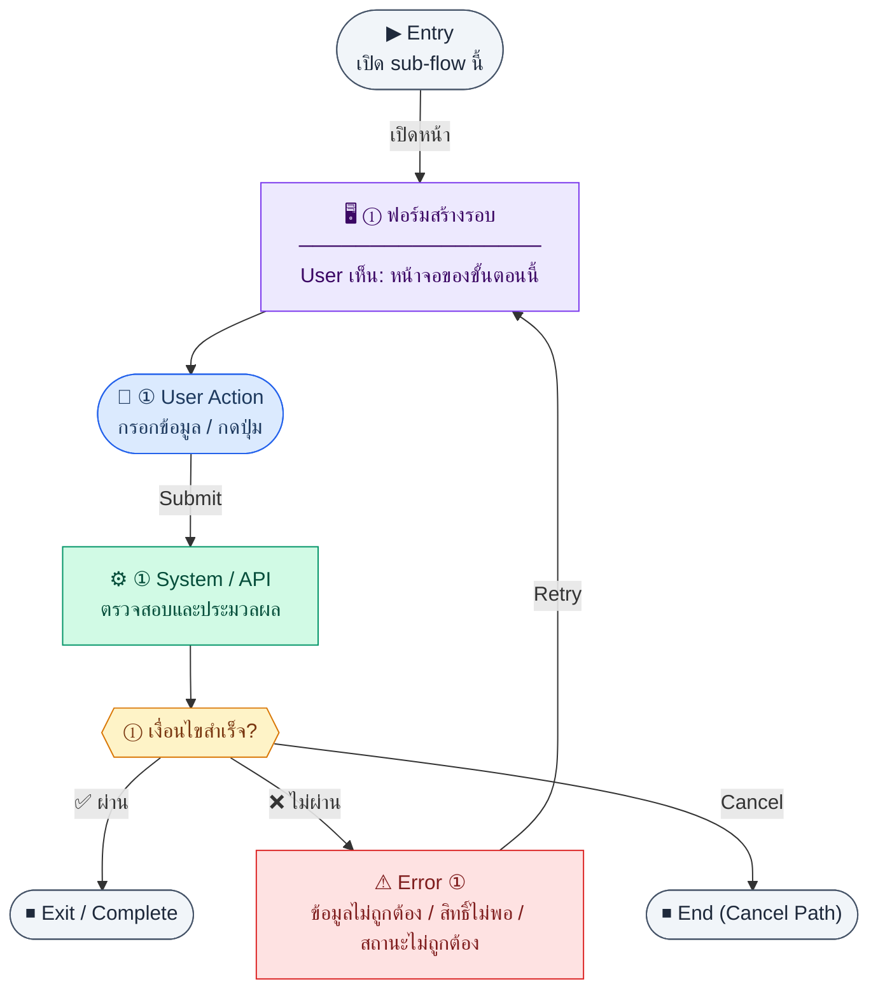
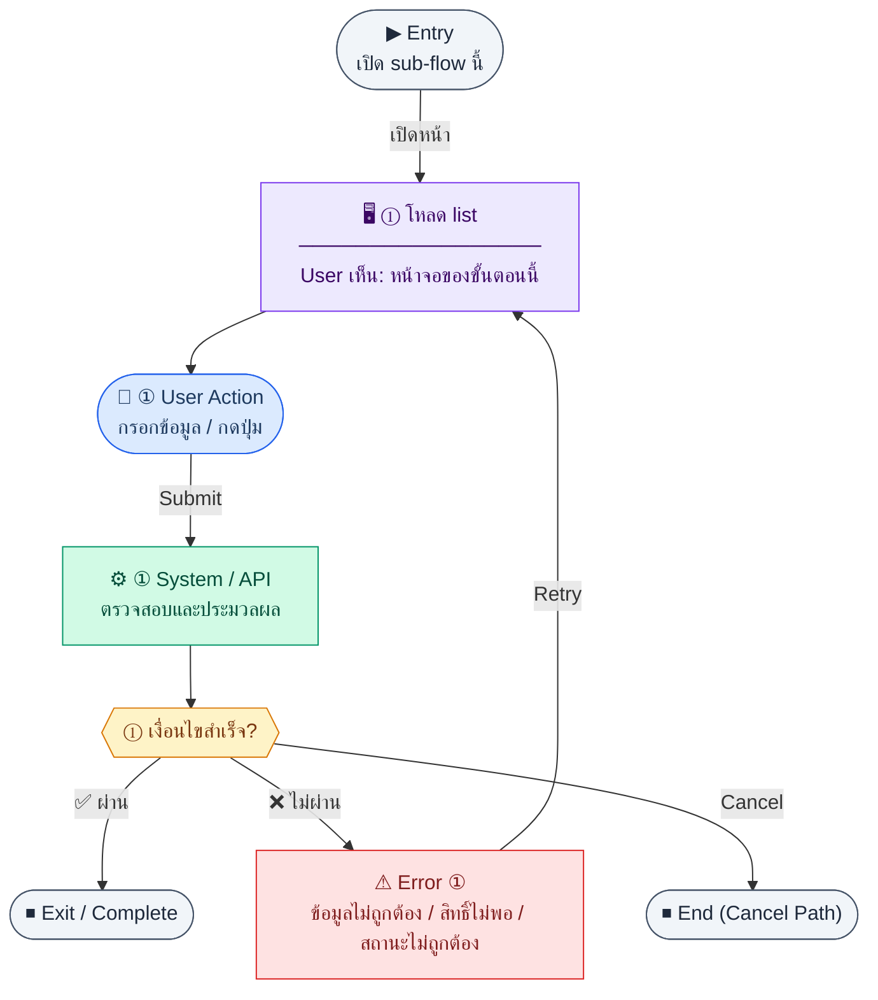
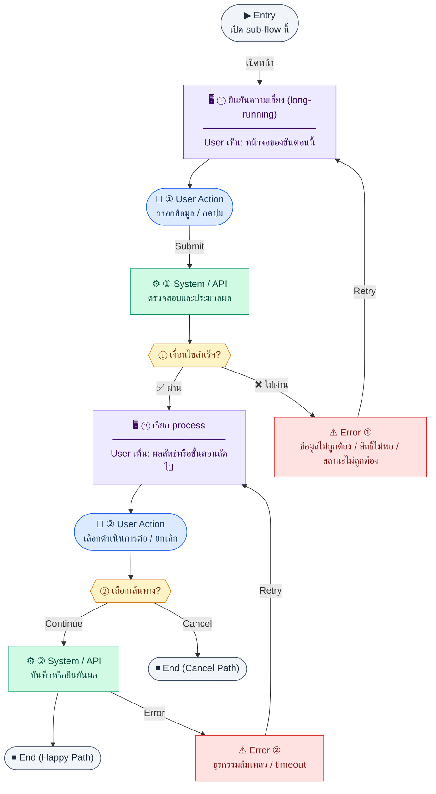
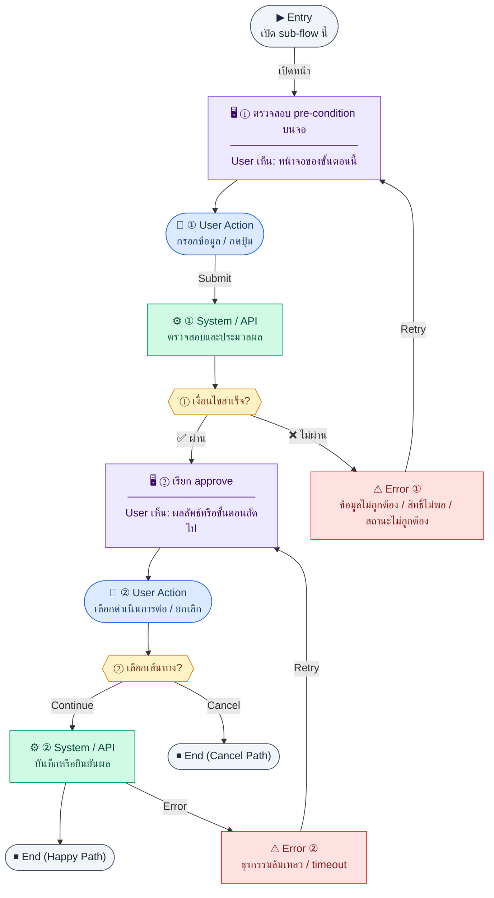
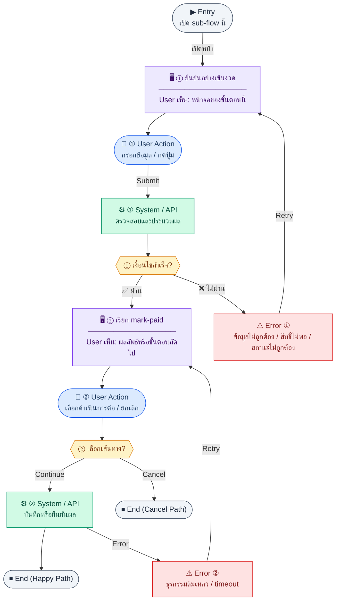
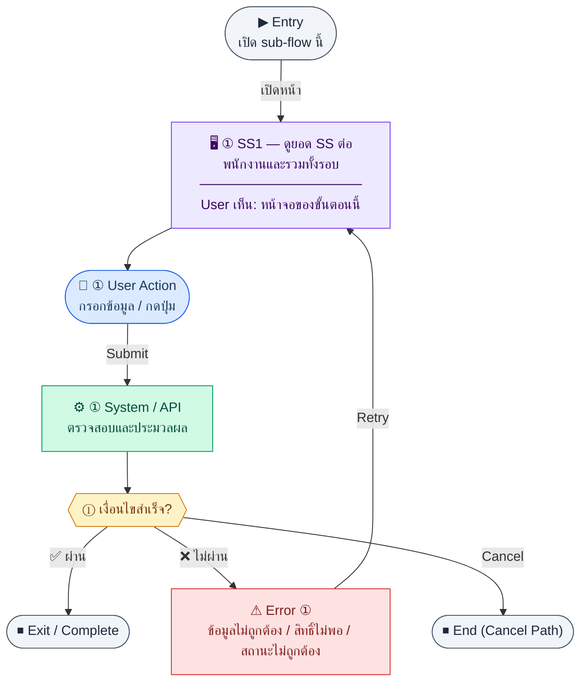
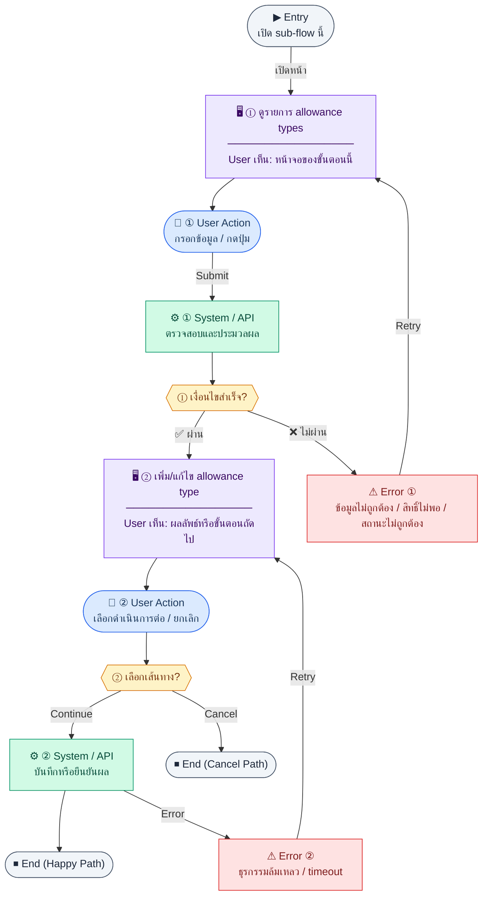

# UX Flow — R1-05 HR: Payroll (รอบเงินเดือน, process, อนุมัติ, mark-paid, payslip)

เอกสารนี้เชื่อม **การกระทำของผู้ใช้** กับ endpoint ใน `Documents/SD_Flow/HR/payroll.md` และการส่งออก payslip จาก `Documents/SD_Flow/Finance/document_exports.md` (ส่วนที่เกี่ยวกับ payroll) ตาม Feature 1.5 ใน Release 1

**แหล่งอ้างอิงที่ผูกกับเอกสารนี้**

- Business requirement (BR): `Documents/Requirements/Release_1.md` (Feature 1.5 HR — Payroll)
- Traceability: `Documents/Requirements/Release_1_traceability_mermaid.md` (Feature 1.5)
- Sequence / SD_Flow: `Documents/SD_Flow/HR/payroll.md`, `Documents/SD_Flow/Finance/document_exports.md` (บรรทัด inventory ที่เกี่ยวกับ `.../payslips/...`)
- Related screens / mockups: `Documents/UI_Flow_mockup/Page/R1-05_HR_Payroll/Payroll.md`

---

## E2E Scenario Flow

> ภาพรวม payroll ใน Release 1 ครอบคลุมการตั้งค่าก่อนคำนวณ, สร้างรอบ, process payslips, approve, mark-paid, ดู/export payslips และจัดการ config master โดยยึด workflow `draft → processed → approved → paid` และการเชื่อม unpaid leave กับ Finance auto-post

### Scenario Summary

| Scenario | ขั้นตอน | ผลลัพธ์ |
|----------|---------|---------|
| ✅ ดูภาพรวม payroll และรายการรอบ | เข้า `/hr/payroll` → โหลด summary และ runs | เห็นสถานะรอบและยอดรวมพร้อมเลือกทำงานต่อ |
| ✅ สร้าง payroll run ใหม่ | เปิด create run → ระบุ period/pay date → submit | ได้ run ใหม่สถานะ `draft` |
| ✅ Process รอบเงินเดือน | เปิด run draft → process | ระบบคำนวณ payslips, SS, WHT, unpaid leave deduction และเปลี่ยนเป็น `processed` |
| ✅ Approve payroll run | ตรวจ summary/payslips → approve | run เป็น `approved` และพร้อมจ่ายจริง |
| ✅ Mark paid และโพสต์บัญชี | เปิด run approved → mark-paid | run เป็น `paid` และ trigger integration ไป Finance |
| ✅ ดูและส่งออก payslips | เปิด payslips ของ run → export | เห็นยอดรายคนและดาวน์โหลดเอกสารได้ |
| ✅ จัดการ payroll settings ก่อน process | เข้า config/allowance/tax settings → save | ระบบมีค่าคำนวณพร้อมใช้ |
| ⚠ Process หรือ approve ไม่ผ่าน | พบ config ไม่ครบ, ลำดับสถานะผิด, หรือ integration fail | block action พร้อมข้อความให้แก้ไขหรือ retry |

---
## Sub-flow A — ภาพรวม payroll ทุกรอบ (`GET /api/hr/payroll`)

### ชื่อ Flow & ขอบเขต

**Flow name:** `HR Payroll — Global summary / landing`

**Actor(s):** `hr_admin`, `finance_manager` (ตาม BR ว่าใครเห็น payroll), `super_admin`

**Entry:** เมนู HR → Payroll

**Exit:** เลือกรอบ (run) เพื่อเข้า detail workflow

**Out of scope:** การผูกบัญชีแยกรายละเอียดทุก journal line ใน UX นี้ (อธิบายเฉพาะจุดที่กระทบผู้ใช้)

---

### Scenario Flow

### สัญลักษณ์ Node (Color Legend)

| สี | Node shape | หมายถึง |
|----|-----------|---------|
| 🟣 ม่วง | สี่เหลี่ยม `["…"]` | **Screen / UI State** |
| 🔵 น้ำเงิน | วงกลม `(["…"])` | **User Action** |
| 🟢 เขียว | สี่เหลี่ยม `["…"]` | **System / API** |
| 🟡 เหลือง | เพชร `{{"…"}}` | **Decision** |
| 🔴 แดง | สี่เหลี่ยม `["…"]` | **Error / Edge case** |
| ⚫ เทา | วงรี `(["…"])` | **Start / End** |

---

### Step A1 — โหลดสรุป

**Goal:** แสดงรายการ run หรือ aggregate ตามที่ API คืน

**User sees:** การ์ด/ตารางสรุป, loading

**User can do:** คลิกเข้า run, กดสร้างรอบใหม่ (ถ้ามีสิทธิ์)

**User Action:**
- ประเภท: `เลือกตัวเลือก / กดปุ่ม`
- ช่องที่ใช้กรอง/ดูข้อมูล:
  - `status` *(optional)* : กรองตาม `draft / processed / approved / paid`
  - `period` *(optional)* : ค้นหาตามงวดจ่าย
- ปุ่ม / Controls ในหน้านี้:
  - `[Create Payroll Run]` → เปิดฟอร์มสร้างรอบใหม่
  - `[Open Run]` → เข้าหน้า detail ของรอบที่เลือก
  - `[Refresh]` → โหลด summary ล่าสุด

**Frontend behavior:**

- `GET /api/hr/payroll` พร้อม Bearer
- แสดงสถานะ run ตาม workflow BR ของ Release 1: `draft / processed / approved / paid`

**System / AI behavior:** คืนข้อมูลสรุปจาก `payroll_runs` และ aggregate

**Success:** 200

**Error:** 403 → access denied template

**Notes:** BR อธิบายความเชื่อมกับ leave unpaid deduction และ (ใน Release 2) attendance — ใน R1 UX อาจแสดง tooltip ว่า "ข้อมูลลาที่อนุมัติแล้วมีผลต่อการคำนวณ"

---

### Step A2 — Silent refresh หลัง action จากหน้าอื่น

**Goal:** ถ้า user เปิดหลายแท็บและมีคนอื่น process run แล้ว ให้ sync

**User sees:** badge "มีการอัปเดต" หรือ auto refetch เมื่อ focus

**User can do:** กดรีเฟรช

**User Action:**
- ประเภท: `กดปุ่ม`
- ปุ่ม / Controls ในหน้านี้:
  - `[Refresh]` → บังคับดึงข้อมูลล่าสุดเมื่อมี badge อัปเดต
  - `[Open Updated Run]` → เปิดรอบที่เพิ่งเปลี่ยนสถานะ

**Frontend behavior:** revalidate `GET /api/hr/payroll` on window focus (optional)

**System / AI behavior:** —

**Success:** ตัวเลขตรงกับ server

**Error:** network → snackbar

**Notes:** **silent/background** state ตาม brief

---

## Sub-flow B — สร้างรอบเงินเดือน (`POST /api/hr/payroll/runs`)

### ชื่อ Flow & ขอบเขต

**Flow name:** `HR Payroll — Create payroll run`

**Actor(s):** HR / super_admin

**Entry:** ปุ่ม "สร้างรอบเงินเดือน"

**Exit:** ได้ `runId` และเข้าหน้า run detail

**Out of scope:** การนำเข้าข้อมูลจากไฟล์ภายนอก

---

### Scenario Flow

### สัญลักษณ์ Node (Color Legend)

| สี | Node shape | หมายถึง |
|----|-----------|---------|
| 🟣 ม่วง | สี่เหลี่ยม `["…"]` | **Screen / UI State** |
| 🔵 น้ำเงิน | วงกลม `(["…"])` | **User Action** |
| 🟢 เขียว | สี่เหลี่ยม `["…"]` | **System / API** |
| 🟡 เหลือง | เพชร `{{"…"}}` | **Decision** |
| 🔴 แดง | สี่เหลี่ยม `["…"]` | **Error / Edge case** |
| ⚫ เทา | วงรี `(["…"])` | **Start / End** |

---

### Step B1 — ฟอร์มสร้างรอบ

**Goal:** ระบุงวด (period) และพารามิเตอร์ที่ BR กำหนด

**User sees:** date range / เดือน-ปี, ตัวเลือกเสริม (ถ้ามี)

**User can do:** กรอกและยืนยัน

**User Action:**
- ประเภท: `กรอกข้อมูล / เลือกตัวเลือก`
- ช่องที่ต้องกรอก:
  - `periodMonth` หรือ `periodStart/periodEnd` *(required ตาม contract BE)* : งวดที่จะสร้าง
  - `payDate` *(optional/conditional)* : วันที่จ่ายจริง
  - `note` *(optional)* : หมายเหตุของรอบ
- ปุ่ม / Controls ในหน้านี้:
  - `[Create Run]` → เรียก `POST /api/hr/payroll/runs`
  - `[Cancel]` → ปิดฟอร์มสร้าง

**Frontend behavior:**

- validate ช่วงวันที่ไม่ทับรอบที่ปิดแล้ว (ถ้า BE ส่งรายการมาให้ตรวจสอบล่วงหน้าได้)
- `POST /api/hr/payroll/runs` พร้อม body ตาม schema

**System / AI behavior:** สร้าง header `payroll_runs`, สถานะเริ่มต้น

**Success:** 201 + `runId`

**Error:** 409 รอบซ้ำ, 422 field

**Notes:** endpoint ชัดใน SD: `POST /api/hr/payroll/runs`

---

## Sub-flow C — รายการรอบ (`GET /api/hr/payroll/runs`)

### ชื่อ Flow & ขอบเขต

**Flow name:** `HR Payroll — List runs`

**Actor(s):** ผู้มีสิทธิ์ดู payroll

**Entry:** แท็บ "รอบเงินเดือน" ในหน้า Payroll

**Exit:** เลือก run

**Out of scope:** export ทั้งระบบ (ถ้าไม่มี API)

---

### Scenario Flow

### สัญลักษณ์ Node (Color Legend)

| สี | Node shape | หมายถึง |
|----|-----------|---------|
| 🟣 ม่วง | สี่เหลี่ยม `["…"]` | **Screen / UI State** |
| 🔵 น้ำเงิน | วงกลม `(["…"])` | **User Action** |
| 🟢 เขียว | สี่เหลี่ยม `["…"]` | **System / API** |
| 🟡 เหลือง | เพชร `{{"…"}}` | **Decision** |
| 🔴 แดง | สี่เหลี่ยม `["…"]` | **Error / Edge case** |
| ⚫ เทา | วงรี `(["…"])` | **Start / End** |

---

### Step C1 — โหลด list

**Goal:** แสดงรอบทั้งหมดพร้อม filter

**User sees:** ตาราง run, pagination

**User can do:** filter ตามสถานะ/ปี

**User Action:**
- ประเภท: `กดปุ่ม / เลือกตัวเลือก`
- ช่องที่ใช้ยืนยัน:
  - `confirmProcess` *(required)* : ยืนยันว่าต้องการคำนวณ payroll รอบนี้
- ปุ่ม / Controls ในหน้านี้:
  - `[Process Payroll]` → ยืนยันการคำนวณ
  - `[Cancel]` → กลับไปหน้า detail โดยไม่ process

**Frontend behavior:** `GET /api/hr/payroll/runs` + query

**System / AI behavior:** คืนรายการ

**Success:** 200

**Error:** 401/403

**Notes:** ใช้ร่วมกับ navigation จาก `GET /api/hr/payroll` ได้ — ออกแบบให้ไม่ duplicate ข้อมูลโดยไม่จำเป็น

---

## Sub-flow D — ประมวลผลรอบ (`POST /api/hr/payroll/runs/:runId/process`)

### ชื่อ Flow & ขอบเขต

**Flow name:** `HR Payroll — Process calculation`

**Actor(s):** HR

**Entry:** ปุ่ม "คำนวณ" / "Process" ในหน้า run detail เมื่อสถานะอนุญาต

**Exit:** payslip ถูก generate หรืออยู่ในคิว job ตาม BE

**Out of scope:** รายละเอียดสูตร SS/WHT ทุกบรรทัด (อธิบายใน BR)

---

### Scenario Flow

### สัญลักษณ์ Node (Color Legend)

| สี | Node shape | หมายถึง |
|----|-----------|---------|
| 🟣 ม่วง | สี่เหลี่ยม `["…"]` | **Screen / UI State** |
| 🔵 น้ำเงิน | วงกลม `(["…"])` | **User Action** |
| 🟢 เขียว | สี่เหลี่ยม `["…"]` | **System / API** |
| 🟡 เหลือง | เพชร `{{"…"}}` | **Decision** |
| 🔴 แดง | สี่เหลี่ยม `["…"]` | **Error / Edge case** |
| ⚫ เทา | วงรี `(["…"])` | **Start / End** |

---

### Step D1 — ยืนยันความเสี่ยง (long-running)

**Goal:** ให้ผู้ใช้เข้าใจว่าเป็นการคำนวณหนักและอาจใช้เวลา

**User sees:** modal อธิบายผลข้างเคียง (เช่น ทับ payslip draft เดิม)

**User can do:** ยืนยัน

**User Action:**
- ประเภท: `กดปุ่ม`
- ปุ่ม / Controls ในหน้านี้:
  - `[Start Processing]` → เรียก `POST /api/hr/payroll/runs/:runId/process`
  - `[Stay on Page]` → รอดู progress/polling ต่อ

**Frontend behavior:** —

**System / AI behavior:** —

**Success:** ผู้ใช้ยืนยัน

**Error:** ยกเลิก

**Notes:** BR ระบุ process ดึง `leave_requests` แบบ unpaid + approved — UX ควรบอกว่า "ข้อมูลลาล่าสุดถึงเวลากด process"

---

### Step D2 — เรียก process

**Goal:** สั่งให้ระบบคำนวณ payslip ในรอบนั้น

**User sees:** progress bar / spinner ยาว, อาจมี step text จาก polling (ถ้า BE รองรับ) หรือ disable ปุ่มซ้ำ

**User can do:** รอ — ไม่ปิดเบราว์เซอร์

**User Action:**
- ประเภท: `กดปุ่ม`
- ปุ่ม / Controls ในหน้านี้:
  - `[Retry Process]` → ยิงคำสั่ง process ใหม่เมื่อ backend รองรับ idempotent retry
  - `[View Error Detail]` → เปิดรายละเอียด error/log
  - `[Back to Run Detail]` → กลับไปหน้ารอบโดยยังไม่ retry

**Frontend behavior:**

- `POST /api/hr/payroll/runs/:runId/process`
- ถ้า response เป็น 202 async → เริ่ม polling `GET /api/hr/payroll/runs/:runId` หรือ status endpoint (ถ้ามีในอนาคต); **ใน SD ปัจจุบัน** ให้ถือว่าเป็น synchronous 201/200 ตามเอกสาร SD และปรับ UX เมื่อ BE ล็อกรูปแบบจริง

**System / AI behavior:** คำนวณ gross, SS, WHT, unpaid leave deduction ตาม BR

**Success:** process สำเร็จตาม message

**Error:** 409 (สถานะ run ไม่รับ process), 500 → แสดง retry และไม่เปลี่ยนสถานะ run บนจอถ้าไม่ชัด

**Notes:** endpoint: `POST /api/hr/payroll/runs/:runId/process`

---

### Step D3 — Partial result / retry

**Goal:** กรณี process fail ครึ่งทางหรือ timeout

**User sees:** error banner + ปุ่ม retry + link ไป log (ถ้ามี)

**User can do:** retry process (ถ้า BE idempotent)

**User Action:**
- ประเภท: `กดปุ่ม / เลือกตัวเลือก`
- ช่องที่ใช้ก่อนอนุมัติ:
  - `reviewSkippedEmployees` *(optional)* : เปิดดูรายชื่อพนักงานที่ถูก skip
- ปุ่ม / Controls ในหน้านี้:
  - `[Approve Run]` → ยืนยันอนุมัติเมื่อ pre-condition ผ่าน
  - `[Back to Process Result]` → กลับไปตรวจยอด/แก้ข้อมูลก่อน

**Frontend behavior:** เรียก `POST .../process` อีกครั้งหลัง cooldown

**System / AI behavior:** ต้องปลอดภัยต่อการกดซ้ำ

**Success:** run กลับมาสถานะที่อ่านได้

**Error:** ยัง fail — escalate copy

**Notes:** **edge state** ตามที่ร้องขอ

---

## Sub-flow E — อนุมัติรอบ (`POST /api/hr/payroll/runs/:runId/approve`)

### ชื่อ Flow & ขอบเขต

**Flow name:** `HR Payroll — Approve run`

**Actor(s):** Finance manager / HR ตาม segregation ใน BR

**Entry:** ปุ่มอนุมัติรอบเมื่อคำนวณเสร็จ

**Exit:** run อยู่สถานะ approved

**Out of scope:** การแก้ payslip ทีละคน (ถ้าไม่มี endpoint แยก)

---

### Scenario Flow

### สัญลักษณ์ Node (Color Legend)

| สี | Node shape | หมายถึง |
|----|-----------|---------|
| 🟣 ม่วง | สี่เหลี่ยม `["…"]` | **Screen / UI State** |
| 🔵 น้ำเงิน | วงกลม `(["…"])` | **User Action** |
| 🟢 เขียว | สี่เหลี่ยม `["…"]` | **System / API** |
| 🟡 เหลือง | เพชร `{{"…"}}` | **Decision** |
| 🔴 แดง | สี่เหลี่ยม `["…"]` | **Error / Edge case** |
| ⚫ เทา | วงรี `(["…"])` | **Start / End** |

---

### Step E1 — ตรวจสอบ pre-condition บนจอ

**Goal:** กันการอนุมัติเมื่อยอดรวมผิดปกติ

**User sees:** สรุปยอดรวม, จำนวนพนักงานที่คำนวณได้, warning ถ้ามีคนถูก skip

**User can do:** อนุมัติหรือย้อนกลับไป process ใหม่

**User Action:**
- ประเภท: `กดปุ่ม`
- ปุ่ม / Controls ในหน้านี้:
  - `[Confirm Approve]` → เรียก `POST /api/hr/payroll/runs/:runId/approve`
  - `[Cancel]` → ยกเลิกการอนุมัติ

**Frontend behavior:**

- อ่านข้อมูลจาก `GET /api/hr/payroll/runs/:runId/payslips` หรือ summary ใน run object (แล้วแต่ BE)
- ปุ่ม approve disabled จนกว่าเงื่อนไขผ่าน (เช่น ไม่มี pending error flag)

**System / AI behavior:** —

**Success:** พร้อม approve

**Error:** —

**Notes:** endpoint: `POST /api/hr/payroll/runs/:runId/approve`

---

### Step E2 — เรียก approve

**Goal:** เปลี่ยนสถานะ run เป็น `approved` หลังผ่าน pre-check

**User sees:** loading

**User can do:** รอ

**User Action:**
- ประเภท: `กรอกข้อมูล / กดปุ่ม`
- ช่องที่ต้องกรอก:
  - `ไม่มี field เพิ่มเติม` : ใช้ผล pre-check จาก Step E1 และกดยืนยันการอนุมัติ
- ปุ่ม / Controls ในหน้านี้:
  - `[Confirm Approve]` → ยืนยันการอนุมัติ run
  - `[Cancel]` → ยกเลิกการกระทำ

**Frontend behavior:** `POST /api/hr/payroll/runs/:runId/approve`

**System / AI behavior:** เปลี่ยนสถานะ run เป็น `approved`, บันทึกผู้อนุมัติ/เวลา และคืน pre-check summary ตาม contract

**Success:** 201/200

**Error:** 403/409

**Notes:** `paidAt` เป็น field ของ sub-flow mark-paid เท่านั้น; หลัง approve ปุ่ม process อาจถูกซ่อน

---

## Sub-flow F — Mark paid (`POST /api/hr/payroll/runs/:runId/mark-paid`)

### ชื่อ Flow & ขอบเขต

**Flow name:** `HR Payroll — Mark as paid + downstream integration`

**Actor(s):** Finance

**Entry:** ปุ่ม "ทำเครื่องหมายว่าจ่ายแล้ว"

**Exit:** run สถานะ paid และ trigger ด้านบัญชีตาม BR

**Out of scope:** UI ของ GL journal

---

### Scenario Flow

### สัญลักษณ์ Node (Color Legend)

| สี | Node shape | หมายถึง |
|----|-----------|---------|
| 🟣 ม่วง | สี่เหลี่ยม `["…"]` | **Screen / UI State** |
| 🔵 น้ำเงิน | วงกลม `(["…"])` | **User Action** |
| 🟢 เขียว | สี่เหลี่ยม `["…"]` | **System / API** |
| 🟡 เหลือง | เพชร `{{"…"}}` | **Decision** |
| 🔴 แดง | สี่เหลี่ยม `["…"]` | **Error / Edge case** |
| ⚫ เทา | วงรี `(["…"])` | **Start / End** |

---

### Step F1 — ยืนยันอย่างเข้มงวด

**Goal:** กันการจ่ายซ้ำหรือจ่ายผิดรอบ

**User sees:** modal ใส่ข้อความยืนยัน / วันที่จ่ายจริง (ถ้ามีในฟอร์ม)

**User can do:** ยืนยัน

**User Action:**
- ประเภท: `กดปุ่ม`
- ปุ่ม / Controls ในหน้านี้:
  - `[Confirm Payment Complete]` → เรียก `POST /api/hr/payroll/runs/:runId/mark-paid`
  - `[Retry Finance Post]` → เรียก integration retry เมื่อจ่ายแล้วแต่โพสต์บัญชีไม่สำเร็จ
  - `[Open Finance Journal]` → ไปตรวจรายการบัญชีที่เชื่อมโยง

**Frontend behavior:** validate ฟิลด์ที่ BE บังคับก่อน `POST .../mark-paid`

**System / AI behavior:** —

**Success:** พร้อม mark-paid

**Error:** —

**Notes:** BR ระบุ mark-paid → journal + income_expense_entries — UX แจ้งว่า "จะโพสต์บัญชีอัตโนมัติ"

---

### Step F2 — เรียก mark-paid

**Goal:** ปิดรอบการจ่าย

**User sees:** loading ยาวถ้ามี integration

**User can do:** รอ

**User Action:**
- ประเภท: `กรอกข้อมูล / เลือกตัวเลือก`
- ช่องที่ใช้ค้นหา/ดูข้อมูล:
  - `searchEmployee` *(optional)* : ค้นหาจากชื่อหรือรหัสพนักงาน
  - `page` / `limit` *(optional)* : เปลี่ยนหน้าของตาราง
- ปุ่ม / Controls ในหน้านี้:
  - `[Open Payslip]` → ดูรายละเอียดของพนักงานรายคน
  - `[Download PDF]` → ดาวน์โหลด payslip ต่อแถว
  - `[Export Batch]` → ส่งออกทั้งรอบ

**Frontend behavior:**

- `POST /api/hr/payroll/runs/:runId/mark-paid`
- ถ้า response เป็น partial failure ให้แสดง 2-state result card: `ชำระเงินสำเร็จ` + `บันทึกบัญชีไม่สำเร็จ`
- แสดง action `ลองบันทึกบัญชีอีกครั้ง` โดยเรียก `POST /api/finance/integrations/payroll/:runId/post`
- ถ้า retry สำเร็จ ให้แสดง `journalEntryId` และลิงก์ไป `/finance/journal/:id`
- ถ้า retry ยังล้มเหลว ให้แสดงรายละเอียด error และ deep link ไป `/finance/settings/source-mappings`
- มี action สำรอง `ไปที่ Finance Journal` พร้อม filter `/finance/journal?sourceModule=hr&sourceId={runId}` สำหรับตรวจ/แก้ manual

**System / AI behavior:** post journal, integration endpoint ตาม BR (`POST /integrations/payroll/:runId/post` — อยู่นอก SD payroll.md แต่ควรกล่าวใน Notes)

**Success:** 201/200

**Error:** 502 จาก integration → แสดง partial failure "จ่ายแล้วแต่บัญชีไม่สำเร็จ" + ให้เส้นทาง retry และ manual recovery path ชัดเจน

**Notes:** endpoint หลักใน SD: `POST /api/hr/payroll/runs/:runId/mark-paid`; เส้นทาง retry integration อ้างอิง `POST /api/finance/integrations/payroll/:runId/post`

---

## Sub-flow G — รายการ payslip ในรอบ (`GET /api/hr/payroll/runs/:runId/payslips`)

### ชื่อ Flow & ขอบเขต

**Flow name:** `HR Payroll — Payslip list per run`

**Actor(s):** HR, Finance

**Entry:** แท็บ payslips ในหน้า run

**Exit:** เปิด PDF / export

**Out of scope:** แก้ไขยอด payslip ทีละบรรทัด (ถ้าไม่มี PATCH ใน SD)

---

### Scenario Flow

### สัญลักษณ์ Node (Color Legend)

| สี | Node shape | หมายถึง |
|----|-----------|---------|
| 🟣 ม่วง | สี่เหลี่ยม `["…"]` | **Screen / UI State** |
| 🔵 น้ำเงิน | วงกลม `(["…"])` | **User Action** |
| 🟢 เขียว | สี่เหลี่ยม `["…"]` | **System / API** |
| 🟡 เหลือง | เพชร `{{"…"}}` | **Decision** |
| 🔴 แดง | สี่เหลี่ยม `["…"]` | **Error / Edge case** |
| ⚫ เทา | วงรี `(["…"])` | **Start / End** |

---

### Step G1 — โหลด payslips

**Goal:** แสดงตารางพนักงานและยอดสุทธิ

**User sees:** ตาราง + loading

**User can do:** ค้นหาชื่อพนักงานฝั่ง client หรือ server ตามขนาดข้อมูล

**User Action:**
- ประเภท: `เลือกตัวเลือก / กดปุ่ม`
- ช่องที่ใช้ตรวจสอบ:
  - `searchEmployee` *(optional)* : จำกัดเฉพาะบางพนักงาน
- ปุ่ม / Controls ในหน้านี้:
  - `[Export SS Summary]` *(optional)* → ส่งออกข้อมูลช่วยยื่นประกันสังคม
  - `[Open Payslip Row]` → ดูรายการต้นทางของยอด SS

**Frontend behavior:** `GET /api/hr/payroll/runs/:runId/payslips`

**System / AI behavior:** คืนรายการ payslip

**Success:** 200

**Error:** 404 run ไม่มี

**Notes:** endpoint ตรงจาก SD

---

## Sub-flow G-SS — ติดตามยอดประกันสังคม (SS Records / Submission readiness)

### ชื่อ Flow & ขอบเขต

**Flow name:** `HR Payroll — SS contribution visibility before submission`

**Actor(s):** HR, Finance

**Entry:** หน้า run detail (แท็บ payslips หรือ summary)

**Exit:** ผู้ใช้เห็นยอด SS ต่อพนักงานและยอดรวมของรอบ เพื่อเตรียมยื่นแบบ

**Out of scope:** การเปลี่ยนสถานะ submission ในระบบ (pending -> submitted -> confirmed) จนกว่า API เฉพาะจะพร้อม

---

### Scenario Flow

### สัญลักษณ์ Node (Color Legend)

| สี | Node shape | หมายถึง |
|----|-----------|---------|
| 🟣 ม่วง | สี่เหลี่ยม `["…"]` | **Screen / UI State** |
| 🔵 น้ำเงิน | วงกลม `(["…"])` | **User Action** |
| 🟢 เขียว | สี่เหลี่ยม `["…"]` | **System / API** |
| 🟡 เหลือง | เพชร `{{"…"}}` | **Decision** |
| 🔴 แดง | สี่เหลี่ยม `["…"]` | **Error / Edge case** |
| ⚫ เทา | วงรี `(["…"])` | **Start / End** |

---

### Step G-SS1 — ดูยอด SS ต่อพนักงานและรวมทั้งรอบ

**Goal:** ให้ทีมงานตรวจสอบยอดส่งประกันสังคมก่อนยื่นจริง

**User sees:** คอลัมน์ `ssEmployee` และ `ssEmployer` ในตาราง payslips, summary รวมระดับ run

**User can do:** ตรวจสอบความครบถ้วนและส่งออกข้อมูลสำหรับยื่นแบบภายนอก

**User Action:**
- ประเภท: `กดปุ่ม`
- ปุ่ม / Controls ในหน้านี้:
  - `[Download PDF]` → เรียกไฟล์ของ payslip ที่เลือก
  - `[Retry]` → ลองใหม่เมื่อไฟล์สร้างไม่สำเร็จ

**Frontend behavior:** ใช้ข้อมูลจาก `GET /api/hr/payroll/runs/:runId/payslips` เพื่อคำนวณยอดรวม SS และ export เป็นไฟล์ช่วยงาน (เช่น CSV) ตามที่หน้ารองรับ

**System / AI behavior:** คืนค่า contribution ต่อ payslip จากข้อมูลคำนวณ payroll

**Success:** ทีม HR/Finance เห็นยอด SS ที่ต้องยื่นครบถ้วน

**Error:** หากข้อมูล SS ขาดหาย ให้แจ้งเตือนว่ารอบนี้ยังไม่พร้อมยื่น

**Notes:** BR มีตาราง `ss_submissions` สำหรับติดตามสถานะการนำส่ง แต่ R1 ยังไม่มี REST endpoint โดยตรง; แนวทางชั่วคราวคืออ้างอิงจาก payslip data และงานภายนอกระบบ

---

## Sub-flow H — ส่งออก / PDF payslip (`document_exports.md`)

### ชื่อ Flow & ขอบเขต

**Flow name:** `HR Payroll — Export & single payslip PDF`

**Actor(s):** HR/Finance; พนักงานอาจเห็นเฉพาะของตนในอนาคต (ตาม product — ระบุใน Notes ถ้า out of scope R1)

**Entry:** ปุ่มดาวน์โหลด PDF ต่อแถว หรือปุ่ม export ทั้งรอบ

**Exit:** ไฟล์ดาวน์โหลดหรือ preview ในแท็บใหม่

**Out of scope:** watermark ความลับ (ถ้าไม่มี requirement)

---

### Scenario Flow

### สัญลักษณ์ Node (Color Legend)

| สี | Node shape | หมายถึง |
|----|-----------|---------|
| 🟣 ม่วง | สี่เหลี่ยม `["…"]` | **Screen / UI State** |
| 🔵 น้ำเงิน | วงกลม `(["…"])` | **User Action** |
| 🟢 เขียว | สี่เหลี่ยม `["…"]` | **System / API** |
| 🟡 เหลือง | เพชร `{{"…"}}` | **Decision** |
| 🔴 แดง | สี่เหลี่ยม `["…"]` | **Error / Edge case** |
| ⚫ เทา | วงรี `(["…"])` | **Start / End** |

---

### Step H1 — ดาวน์โหลด PDF รายคน

**Goal:** ได้ไฟล์ PDF payslip หนึ่งฉบับ

**User sees:** ไอคอน PDF, loading ระดับแถว

**User can do:** คลิกดาวน์โหลด

**User Action:**
- ประเภท: `เลือกตัวเลือก / กดปุ่ม`
- ช่องที่ใช้ส่งออก:
  - `employeeIds` *(optional)* : จำกัดเฉพาะบางคนเมื่อรองรับ
- ปุ่ม / Controls ในหน้านี้:
  - `[Export Payslips]` → เริ่มดาวน์โหลดไฟล์ชุด
  - `[Cancel]` → ยกเลิกก่อนเริ่มงาน

**Frontend behavior:**

- เปิด `GET /api/hr/payroll/runs/:runId/payslips/:payslipId/pdf` ในแท็บใหม่หรือ blob download ตาม security policy
- แสดง error ถ้า response ไม่ใช่ไฟล์

**System / AI behavior:** generate PDF จากข้อมูล payslip

**Success:** ไฟล์ได้รับการบันทึก

**Error:** 404, 403 (ห้ามดู payslip คนนี้)

**Notes:** endpoint จาก `Documents/SD_Flow/Finance/document_exports.md` inventory

---

### Step H2 — Export ชุด payslip

**Goal:** ดาวน์โหลดชุดใหญ่ (zip/csv ตาม BE)

**User sees:** progress สำหรับไฟล์ใหญ่

**User can do:** เริ่ม export

**User Action:**
- ประเภท: `กรอกข้อมูล`
- ช่องที่ต้องกรอก:
  - `ss_employee_rate` *(required)* : อัตราส่วนพนักงาน
  - `ss_employer_rate` *(required)* : อัตราส่วนนายจ้าง
  - `ss_max_base` *(required)* : ฐานสูงสุด
- ปุ่ม / Controls ในหน้านี้:
  - `[Save Config]` → บันทึกค่าที่แก้
  - `[Reset Changes]` → คืนค่าจาก server

**Frontend behavior:** `GET /api/hr/payroll/runs/:runId/payslips/export` — จัดการ timeout ด้วยการดาวน์โหลด async หรือ polling job ถ้า BE ใช้ pattern นั้น

**System / AI behavior:** ประกอบไฟล์

**Success:** ไฟล์พร้อม

**Error:** 504 → แนะนำลองช่วงพนักงานย่อย (ถ้ามี API แยกในอนาคต)

**Notes:** endpoint จาก `document_exports.md`

---

## Sub-flow I — Payroll Configs (SS rates / max base)

### Scenario Flow

### สัญลักษณ์ Node (Color Legend)

| สี | Node shape | หมายถึง |
|----|-----------|---------|
| 🟣 ม่วง | สี่เหลี่ยม `["…"]` | **Screen / UI State** |
| 🔵 น้ำเงิน | วงกลม `(["…"])` | **User Action** |
| 🟢 เขียว | สี่เหลี่ยม `["…"]` | **System / API** |
| 🟡 เหลือง | เพชร `{{"…"}}` | **Decision** |
| 🔴 แดง | สี่เหลี่ยม `["…"]` | **Error / Edge case** |
| ⚫ เทา | วงรี `(["…"])` | **Start / End** |

---

### Step I1 — เปิดหน้าตั้งค่า payroll

**Goal:** ให้ HR ปรับค่า policy ที่กระทบสูตรคำนวณ payroll

**User sees:** หน้า `/hr/payroll/configs` พร้อมรายการ key/value (`ss_employee_rate`, `ss_employer_rate`, `ss_max_base`)

**User can do:** แก้ค่าและบันทึก

**User Action:**
- ประเภท: `กดปุ่ม`
- ข้อมูลที่จะส่ง:
  - `key` *(required)* : config key ที่ถูกแก้
  - `value` *(required)* : ค่าใหม่ของ key นั้น
- ปุ่ม / Controls ในหน้านี้:
  - `[Save Row]` → บันทึกเฉพาะ key ที่แก้
  - `[Retry]` → ส่ง patch ซ้ำเมื่อล้มเหลว

**Frontend behavior:**

- `GET /api/hr/payroll/configs`
- validate ช่วงค่า เช่น rate 0-100 และ max base > 0 ก่อน submit

**System / AI behavior:** อ่าน/เขียน `payroll_configs`

**Success:** แสดงค่าอัปเดตล่าสุด

**Error:** 400 validation, 403 permission

**Notes:** ค่าที่แก้มีผลกับรอบที่ process หลังจากเวลาบันทึก

### Step I2 — บันทึกค่า config

**Goal:** อัปเดต key ที่แก้ไขโดยไม่กระทบ key อื่น

**User sees:** loading บนแถวที่กำลังบันทึก

**User can do:** retry เมื่อ error

**User Action:**
- ประเภท: `เลือกตัวเลือก / กดปุ่ม`
- ช่องที่ใช้กรอง/ดูข้อมูล:
  - `includeInactive` *(optional)* : รวม allowance ที่ปิดใช้งานแล้ว
- ปุ่ม / Controls ในหน้านี้:
  - `[Add Allowance Type]` → เปิดฟอร์มสร้าง
  - `[Edit]` → แก้แถวที่เลือก
  - `[Toggle Active]` → เปิด/ปิดใช้งาน

**Frontend behavior:** `PATCH /api/hr/payroll/configs/:key` body `{ "value": "..." }`

**System / AI behavior:** update ราย key พร้อม `updatedAt`

**Success:** toast สำเร็จ + refetch configs

**Error:** 409 ถ้า key lock โดย policy, 500 กรณีระบบ

**Notes:** ก่อนกด Process ควร revalidate ค่า config ล่าสุดเพื่อกัน stale data

---

## Sub-flow J — Allowance Types Management

### Scenario Flow

### สัญลักษณ์ Node (Color Legend)

| สี | Node shape | หมายถึง |
|----|-----------|---------|
| 🟣 ม่วง | สี่เหลี่ยม `["…"]` | **Screen / UI State** |
| 🔵 น้ำเงิน | วงกลม `(["…"])` | **User Action** |
| 🟢 เขียว | สี่เหลี่ยม `["…"]` | **System / API** |
| 🟡 เหลือง | เพชร `{{"…"}}` | **Decision** |
| 🔴 แดง | สี่เหลี่ยม `["…"]` | **Error / Edge case** |
| ⚫ เทา | วงรี `(["…"])` | **Start / End** |

---

### Step J1 — ดูรายการ allowance types

**Goal:** ให้ HR เห็น master allowance ที่ payroll ใช้งานจริง

**User sees:** ตาราง code, name, taxable, isActive

**User can do:** filter active/inactive, เปิดฟอร์มเพิ่ม/แก้ไข, toggle active

**User Action:**
- ประเภท: `กรอกข้อมูล / เลือกตัวเลือก`
- ช่องที่ต้องกรอก:
  - `code` *(required)* : รหัส allowance
  - `name` *(required)* : ชื่อ allowance
  - `taxable` *(required)* : ต้องนำไปรวมคำนวณภาษีหรือไม่
- ปุ่ม / Controls ในหน้านี้:
  - `[Save Allowance Type]` → สร้างหรือแก้ไขข้อมูล
  - `[Cancel]` → ปิด modal

**Frontend behavior:** `GET /api/hr/payroll/allowance-types`

**System / AI behavior:** list `allowance_types`

**Success:** ตารางพร้อมใช้งานก่อน process

**Error:** fetch fail + retry

**Notes:** ถ้าไม่มี active records ให้แสดง warning ว่า gross จะคำนวณจาก base salary เท่านั้น

### Step J2 — เพิ่ม/แก้ไข allowance type

**Goal:** กำหนดชนิด allowance และ taxable flag ให้สอดคล้องนโยบายภาษี

**User sees:** modal ฟอร์ม `code`, `name`, `taxable`

**User can do:** create หรือ edit

**User Action:**
- ประเภท: `กดปุ่ม`
- ข้อมูลที่จะส่ง:
  - `isActive` *(required)* : ค่าปลายทางหลัง toggle
- ปุ่ม / Controls ในหน้านี้:
  - `[Confirm Toggle]` → เปิด/ปิด allowance type
  - `[Cancel]` → ไม่เปลี่ยนสถานะ

**Frontend behavior:**

- สร้าง: `POST /api/hr/payroll/allowance-types`
- แก้ไข: `PATCH /api/hr/payroll/allowance-types/:id`

**System / AI behavior:** validate code unique และ persist

**Success:** 201/200 และ refresh list

**Error:** 409 code ซ้ำ, 422 invalid payload

**Notes:** เปลี่ยน taxable มีผลกับรอบที่ยังไม่ process หรือรอบที่ process ใหม่

### Step J3 — เปิด/ปิด allowance type

**Goal:** retire allowance เดิมโดยไม่ลบประวัติ payslip

**User sees:** toggle activate พร้อม confirm dialog

**User can do:** activate/deactivate

**User Action:**
- ประเภท: `เลือกตัวเลือก / กดปุ่ม`
- ช่องที่ใช้กรอง/ดูข้อมูล:
  - `employeeId` *(optional)* : จำกัดเฉพาะพนักงานบางคน
  - `taxYear` *(optional)* : ปีภาษีที่ต้องการดู
- ปุ่ม / Controls ในหน้านี้:
  - `[Edit Tax Settings]` → เปิดฟอร์มแก้ไขรายแถว
  - `[Refresh]` → โหลดข้อมูลล่าสุด

**Frontend behavior:** `PATCH /api/hr/payroll/allowance-types/:id/activate`

**System / AI behavior:** update `isActive`

**Success:** toggle สำเร็จ

**Error:** 409 ถ้า allowance ถูกใช้งานใน policy ที่ห้ามปิด

**Notes:** records เดิมใน payslip_items ต้องยังอ่านย้อนหลังได้

---

## Sub-flow K — Employee Tax Settings Management

### Scenario Flow

### สัญลักษณ์ Node (Color Legend)

| สี | Node shape | หมายถึง |
|----|-----------|---------|
| 🟣 ม่วง | สี่เหลี่ยม `["…"]` | **Screen / UI State** |
| 🔵 น้ำเงิน | วงกลม `(["…"])` | **User Action** |
| 🟢 เขียว | สี่เหลี่ยม `["…"]` | **System / API** |
| 🟡 เหลือง | เพชร `{{"…"}}` | **Decision** |
| 🔴 แดง | สี่เหลี่ยม `["…"]` | **Error / Edge case** |
| ⚫ เทา | วงรี `(["…"])` | **Start / End** |

---

### Step K1 — ดู tax settings รายพนักงาน

**Goal:** ปรับค่าภาษีเฉพาะบุคคลได้ก่อน process payroll

**User sees:** ตาราง employee, taxYear, withholdingMethod, personalAllowances, maritalStatus

**User can do:** filter ตามปีภาษี/พนักงาน, เปิดแก้ไขรายแถว

**User Action:**
- ประเภท: `กรอกข้อมูล / เลือกตัวเลือก`
- ช่องที่ต้องกรอก:
  - `taxYear` *(required)* : ปีภาษี
  - `withholdingMethod` *(required)* : วิธีหักภาษี
  - `personalAllowances` *(optional)* : จำนวนค่าลดหย่อน
  - `maritalStatus` *(optional)* : สถานภาพที่มีผลกับภาษี
- ปุ่ม / Controls ในหน้านี้:
  - `[Save Tax Settings]` → บันทึกหรือ upsert ข้อมูล
  - `[Cancel]` → ยกเลิกการแก้ไข

**Frontend behavior:** `GET /api/hr/payroll/tax-settings` (query: `employeeId`, `taxYear`)

**System / AI behavior:** list จาก `employee_tax_settings`

**Success:** ข้อมูลพร้อมก่อนคำนวณ WHT

**Error:** 403/500

**Notes:** แถวที่ไม่มี record แสดง badge “ใช้ default”

### Step K2 — บันทึก tax settings

**Goal:** อัปเดตสถานะภาษีพิเศษโดยไม่ต้องพึ่ง seed/DB script

**User sees:** edit form ต่อพนักงาน (taxYear, withholdingMethod, personalAllowances, maritalStatus)

**User can do:** save

**User Action:**
- ประเภท: `กรอกข้อมูล / เลือกตัวเลือก`
- ช่องที่ต้องกรอก:
  - `taxYear` *(required)* : ปีภาษี
  - `withholdingMethod` *(required)* : วิธีหักภาษี
  - `personalAllowances` *(optional)* : ค่าลดหย่อนส่วนบุคคล
  - `maritalStatus` *(optional)* : สถานภาพ
- ปุ่ม / Controls ในหน้านี้:
  - `[Save Tax Settings]` → บันทึกหรือ upsert ข้อมูล
  - `[Cancel]` → ยกเลิกการแก้ไข

**Frontend behavior:** `PATCH /api/hr/payroll/tax-settings/:employeeId`

**System / AI behavior:** upsert ตามคู่ `employeeId + taxYear`

**Success:** อัปเดตตารางทันที

**Error:** 400 ข้อมูลไม่ถูกต้อง, 409 conflict

**Notes:** payroll process ต้องอ้างค่าที่บันทึกล่าสุดของปีภาษีนั้น

---

## Coverage Checklist

| Endpoint                                                  | Covered in UX file                       | Notes                                                        |
| --------------------------------------------------------- | ---------------------------------------- | ------------------------------------------------------------ |
| `GET /api/hr/payroll`                                     | Sub-flow A, Steps A1–A2                  | `Documents/SD_Flow/HR/payroll.md` — landing / silent refresh |
| `POST /api/hr/payroll/runs`                               | Sub-flow B, Step B1                      | `payroll.md` — สร้างรอบ                                      |
| `GET /api/hr/payroll/runs`                                | Sub-flow C, Step C1                      | `payroll.md` — รายการรอบ                                     |
| `POST /api/hr/payroll/runs/:runId/process`                | Sub-flow D, Steps D1–D3                  | `payroll.md` — คำนวณ payslip                                 |
| `POST /api/hr/payroll/runs/:runId/approve`                | Sub-flow E, Steps E1–E2                  | `payroll.md` — อนุมัติรอบ                                    |
| `POST /api/hr/payroll/runs/:runId/mark-paid`              | Sub-flow F, Steps F1–F2                  | `payroll.md` — mark paid + downstream บัญชี (อ้าง BR)        |
| `GET /api/hr/payroll/runs/:runId/payslips`                | Sub-flow G, Step G1; Sub-flow E, Step E1 | `payroll.md` — รายการ payslip / pre-check ก่อน approve       |
| `GET /api/hr/payroll/runs/:runId/payslips/:payslipId/pdf` | Sub-flow H, Step H1                      | `Documents/SD_Flow/Finance/document_exports.md` — PDF รายคน  |
| `GET /api/hr/payroll/runs/:runId/payslips/export`         | Sub-flow H, Step H2                      | `document_exports.md` — export ชุด payslip                   |
| `GET /api/hr/payroll/configs`                             | Sub-flow I, Step I1                      | Payroll policy config screen                                 |
| `PATCH /api/hr/payroll/configs/:key`                      | Sub-flow I, Step I2                      | Update per config key                                        |
| `GET /api/hr/payroll/allowance-types`                     | Sub-flow J, Step J1                      | Allowance master list                                        |
| `POST /api/hr/payroll/allowance-types`                    | Sub-flow J, Step J2                      | Create allowance type                                        |
| `PATCH /api/hr/payroll/allowance-types/:id`               | Sub-flow J, Step J2                      | Update allowance type                                        |
| `PATCH /api/hr/payroll/allowance-types/:id/activate`      | Sub-flow J, Step J3                      | Toggle allowance availability                                |
| `GET /api/hr/payroll/tax-settings`                        | Sub-flow K, Step K1                      | Employee tax settings list                                   |
| `PATCH /api/hr/payroll/tax-settings/:employeeId`          | Sub-flow K, Step K2                      | Upsert tax settings per employee/year                        |

Step ใช้หัวข้อมาตรฐานจาก `Documents/UX_Flow/_TEMPLATE.md`

### Coverage Lock Notes (2026-04-16)
- process flow ต้องรองรับทั้ง sync และ async (`jobId`, polling status) ตาม SD contract
- approve/mark-paid ต้องอ่าน pre-check summary และส่ง `paidAt` เมื่อ policy บังคับ
- payslip list/read model ต้องรวม `warningCode[]`, net/gross/deduction เพื่อไม่ให้ FE เดา schema
- cross-module: export/pdf ให้ยึดสัญญาใน `Documents/SD_Flow/Finance/document_exports.md`
- process result ต้อง render `warnings[]` และ `skippedEmployees[]` แยกกันชัดเจน โดย map `severity = info | warning | blocking` เป็น UI state เดียวกันทุกหน้าจอ
- warning/skip examples ขั้นต่ำที่ UX ต้องรองรับคือ employee-level warning, run-level warning, และ blocking case ที่ห้าม approve ต่อ
- async process/payslip flows ต้องคง `jobId` / latest status context ระหว่าง polling และ retry ไม่ reset ผู้ใช้กลับหน้า list โดยไม่มีผลลัพธ์ล่าสุด