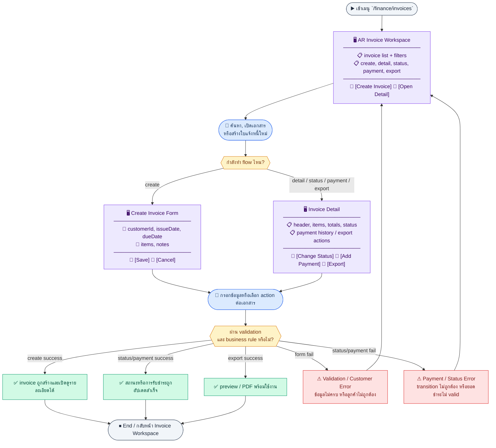
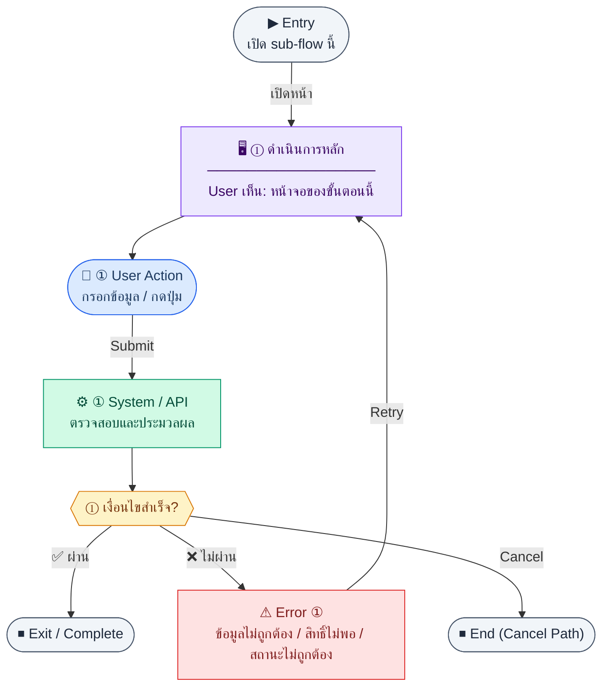

# UX Flow — Finance ใบแจ้งหนี้ขาย (AR Invoice)

เอกสารนี้อธิบาย journey ฝั่งผู้ใช้แบบ **endpoint-driven** ให้ตรวจสอบ (audit) คู่กับ `Documents/SD_Flow/Finance/invoices.md` ได้ทีละกลุ่ม API

**แหล่งอ้างอิงที่ผูกกับเอกสารนี้**

- Business requirement (BR): `Documents/Requirements/Release_1.md` — Feature 1.6 Finance — Invoice (AR)
- Traceability: `Documents/Requirements/Release_1_traceability_mermaid.md` — Feature 1.6 (`/finance/invoices*`, `GET /api/finance/customers`)
- Sequence / SD_Flow: `Documents/SD_Flow/Finance/invoices.md`
- Export / preview (อ้างอิงเสริม): `Documents/SD_Flow/Finance/document_exports.md` — `GET /api/finance/invoices/:id/pdf`, `GET /api/finance/invoices/:id/preview`
- Related screens / mockups: `Documents/UI_Flow_mockup/Page/R1-06_Finance_Invoice_AR/InvoiceList.md`, `InvoiceForm.md`, `InvoiceDetail.md`

---

## Coverage Lock Notes (2026-04-16)
- ใน R1 ให้ถือว่า core flow คือ list/create/detail invoice; payment tracking และ advanced export ให้แยกเป็น R2/future ตาม checklist
- invoice read model ที่ UI ใช้ร่วมกันต้องมี `subtotal`, `vatAmount`, `grandTotal`, `paidAmount`, `balanceDue`
- customer picker และ VAT behavior ต้อง trace กลับ requirement/SD ไม่ใช้ชื่อ field เฉพาะหน้า
- customer picker ต้อง reuse `GET /api/finance/customers/options` และแสดง option fields ขั้นต่ำ `id`, `code`, `name`, `taxId`, `isActive`, `creditWarning?`, `hasOverdueInvoice`
- create form ต้อง bind `customerId` กับ option source เดียวกัน และใช้ `code` / `name` / `taxId` เป็น display baseline แทน label เฉพาะกิจ
- ถ้าลูกค้ามี `creditWarning` หรือ `hasOverdueInvoice` ให้แสดงเป็น advisory state ในฟอร์มสร้าง แต่ไม่เปลี่ยน canonical payload ของ invoice เอง

## E2E Scenario Flow

> ภาพรวมการจัดการ AR invoice ตั้งแต่ดูรายการ, โหลด customer options, สร้างเอกสาร, เปิดรายละเอียด, เปลี่ยนสถานะ, บันทึกรับชำระ, ดู payment history และส่งออกเอกสารสำหรับลูกค้า

### Scenario Summary

| Scenario | ขั้นตอน | ผลลัพธ์ |
|----------|---------|---------|
| ✅ Browse invoice list | Open `/finance/invoices` → search/filter → open record | User can review and navigate invoice records |
| ✅ Load customer options for create | Open `/finance/invoices/new` → load customers | Active customer choices are ready for invoice creation |
| ✅ Create invoice | Fill header/items → submit | System creates invoice and generated invoice number |
| ✅ Review invoice detail | Open `/finance/invoices/:id` | User sees header, items, totals, and current status |
| ✅ Change invoice status | Trigger status action from detail | Invoice moves through allowed status transition |
| ✅ Record customer payment | Submit payment form/modal on invoice | Payment is recorded and invoice balance/status is refreshed |
| ✅ Review payment history or export | Open payments/export action from detail | User sees receipt history or gets printable/downloadable output |
| ⚠ Create, status, or payment flow fails | Invalid form, invalid transition, or payment amount issue | System blocks action and shows clear error |

---
## ชื่อ Flow & ขอบเขต

**Flow name:** `Finance — AR Invoice (รายการ, สร้าง, รายละเอียด, สถานะ, รับชำระ, ประวัติชำระ)`

**Actor(s):** `finance_manager`, `accountant` (และบทบาทอื่นที่ได้รับ permission `finance:invoice:*` ตามนโยบาย RBAC)

**Entry:** เมนู Finance → `/finance/invoices` หรือ deep link `/finance/invoices/:id` / `/finance/invoices/new`

**Exit:** ผู้ใช้ดูรายการหรือจัดการ invoice จนจบงานย่อย (สร้างแล้ว redirect, อัปเดตสถานะ, บันทึกรับชำระ ฯลฯ) หรือออกจากหน้าหลังจัดการ error

**Out of scope:** Customer master แบบเต็ม CRUD (BR ระบุ R2), ความถูกต้องของ `arOutstanding` เมื่อมี partial payment (BR Known Gap 1.10), การเชื่อม Sales Order (R2)

**หมายเหตุสอด BR กับ SD_Flow:** payment/status flow ของ AR ถูกล็อกแล้วในเอกสาร R2 และ SD ปัจจุบัน; UX ไฟล์นี้จึงยึด contract กลางล่าสุดสำหรับ implementation/audit

---

## Sub-flow 1 — รายการใบแจ้งหนี้ (`GET /api/finance/invoices`)

**Goal:** ค้นหา กรอง และเลือก invoice เพื่อเปิดรายละเอียดหรือสร้างใหม่

**User sees:** ตารางรายการ (เลขที่, ลูกค้า, วันที่, ครบกำหนด, สถานะ, ยอดรวม), ตัวกรองช่วงวันที่ / สถานะ / ลูกค้า, pagination, ปุ่ม “สร้างใบแจ้งหนี้”, empty state เมื่อไม่มีข้อมูล

**User can do:** ปรับ query ตัวกรอง, เปลี่ยนหน้า, เรียงคอลัมน์ (ถ้า product รองรับ), คลิกแถวไปหน้ารายละเอียด, เปิดหน้าสร้างใหม่

**Frontend behavior:**

- โหลดหน้าแล้วเรียก `GET /api/finance/invoices` พร้อม query ตาม BR: `page`, `limit`, `search`, `status`, `customerId`, `issueDateFrom`, `issueDateTo` (และซิงค์กับ state ใน URL ถ้ามี)
- แสดง skeleton/loading ระหว่าง fetch ครั้งแรก; ระหว่างเปลี่ยนหน้า/กรอง อาจใช้ inline loading บนตาราง
- ถ้าไม่มีสิทธิ์ `read` ให้ redirect หรือแสดง empty พร้อมข้อความ 403 ตาม pattern แอป

**System / AI behavior:** API ตรวจ auth + permission, อ่าน `invoices` (+ join ลูกค้า) คืนรายการแบบ paginated

**Success:** ได้รายการและ meta pagination ครบ, UI แสดงข้อมูลสอดคล้อง response

**Error:** 401 → เคลียร์ session ไป login; 403 → ข้อความไม่มีสิทธิ์; 5xx/timeout → banner error + ปุ่ม “ลองอีกครั้ง” เรียก `GET /api/finance/invoices` ซ้ำด้วยพารามิเตอร์เดิม

**Notes:** Endpoint หลักสำหรับ sub-flow นี้คือ `GET /api/finance/invoices` ตาม `Documents/SD_Flow/Finance/invoices.md`

---

### Scenario Flow

### สัญลักษณ์ Node (Color Legend)

| สี | Node shape | หมายถึง |
|----|-----------|---------|
| 🟣 ม่วง | สี่เหลี่ยม `["…"]` | **Screen / UI State** |
| 🔵 น้ำเงิน | วงกลม `(["…"])` | **User Action** |
| 🟢 เขียว | สี่เหลี่ยม `["…"]` | **System / API** |
| 🟡 เหลือง | เพชร `{{"…"}}` | **Decision** |
| 🔴 แดง | สี่เหลี่ยม `["…"]` | **Error / Edge case** |
| ⚫ เทา | วงรี `(["…"])` | **Start / End** |

---

## Sub-flow 2 — ตัวเลือกลูกค้า (รองรับฟอร์มสร้าง) (`GET /api/finance/customers`)

**Goal:** เตรียม dropdown ลูกค้าเมื่อสร้าง invoice (R1 read-only list ตาม BR)

**User sees:** ใน `/finance/invoices/new` — combo box / searchable select ของลูกค้า, สถานะโหลดรายการลูกค้า

**User can do:** พิมพ์ค้นหาใน dropdown (ถ้า FE รองรับ client/server filter), เลือกลูกค้าหนึ่งราย

**Frontend behavior:**

- เมื่อเปิดฟอร์มสร้าง เรียก `GET /api/finance/customers` (path ตาม BR: `/api/finance/customers`) แยกหรือคู่กับ prefetch อื่น
- cache สั้น ๆ ใน session ของหน้าเพื่อลดการยิงซ้ำเมื่อกลับมาที่ฟอร์ม
- ถ้า response เป็น `[]` ให้แสดง empty state ใน dropdown: `ยังไม่มีลูกค้าในระบบ`
- แสดงคำอธิบายเพิ่ม: `การเพิ่มลูกค้าใหม่จะรองรับใน Release 2 (R2-01_Customer_Management)`
- block ปุ่ม submit ของ invoice ถ้ายังไม่สามารถเลือก `customerId` ได้

**System / AI behavior:** คืนรายการ `customers` สำหรับ dropdown

**Success:** มีรายการลูกค้าให้เลือกหรือ empty ที่ชัดเจน

**Error:** ล้มเหลวแยกจาก invoice — แสดง error ใน block ฟอร์ม + retry; 403 ซ่อนฟิลด์หรือบล็อก submit ทั้งฟอร์ม; กรณี empty list ให้แสดงทางออก `ติดต่อผู้ดูแลระบบเพื่อนำเข้าข้อมูลลูกค้า`

**Notes:** Endpoint นี้ไม่อยู่ในไฟล์ `invoices.md` แต่ **traceability Feature 1.6** กำหนดให้หน้า invoice ใช้ร่วมกับ SD กลุ่ม invoice

---

### Scenario Flow

### สัญลักษณ์ Node (Color Legend)

| สี | Node shape | หมายถึง |
|----|-----------|---------|
| 🟣 ม่วง | สี่เหลี่ยม `["…"]` | **Screen / UI State** |
| 🔵 น้ำเงิน | วงกลม `(["…"])` | **User Action** |
| 🟢 เขียว | สี่เหลี่ยม `["…"]` | **System / API** |
| 🟡 เหลือง | เพชร `{{"…"}}` | **Decision** |
| 🔴 แดง | สี่เหลี่ยม `["…"]` | **Error / Edge case** |
| ⚫ เทา | วงรี `(["…"])` | **Start / End** |

---

## Sub-flow 3 — สร้างใบแจ้งหนี้ (`POST /api/finance/invoices`)

**Goal:** บันทึก invoice ใหม่พร้อมรายการสินค้า/บริการและภาษีตามฟิลด์ที่ระบบรองรับ โดยเคารพ company setting เรื่อง `vatRegistered`

**User sees:** ฟอร์มหัวเอกสาร (ลูกค้า, วันออก, ครบกำหนด, หมายเหตุ), ตารางรายการแบบ dynamic rows, สรุปยอด, ปุ่มบันทึก

**User can do:** เพิ่ม/ลบแถวรายการ, กรอก quantity, unitPrice, taxRate, กดบันทึก

**Frontend behavior:**

- validate ฝั่ง client: ฟิลด์บังคับ, วันที่ due ≥ issue (ถ้าเป็น business rule), แต่ละแถวมี description, quantity > 0, ราคา ≥ 0, taxRate ตามที่อนุญาต (เช่น 0 หรือ 7 ตาม BR)
- ก่อนเปิดฟอร์มหรือก่อน submit ให้โหลด company settings/flag ที่บอกว่าองค์กร `vatRegistered` หรือไม่; ถ้า registered ต้องแสดง VAT ต่อบรรทัด/สรุปภาษีให้ครบตาม BR Release 2
- ถ้า `vatRegistered = false` ให้ซ่อนหรือ disable ฟิลด์ VAT ที่ไม่เกี่ยวข้อง และอธิบายว่าเอกสารนี้จะไม่ feed เข้า VAT summary
- submit → `POST /api/finance/invoices` ด้วย body ตาม BR (customerId, issueDate, dueDate, notes, items[])
- ระหว่าง submit ปิด double-submit, แสดง loading บนปุ่ม

**System / AI behavior:** สร้าง `invoices` + `invoice_items`, auto `invoiceNo` (`INV-{YEAR}-{SEQ:4}`), คำนวณ lineTotal และ totalAmount ตามกฎ BR

**Success:** 201 + ได้ `id` → navigate ไป `/finance/invoices/:id` หรือแสดง toast แล้วไป detail

**Error:** 400 validation (แสดง field errors); ถ้าองค์กรจด VAT แต่ line/item ยังไม่ครบ VAT ให้ชี้ field ที่ขาดแบบ inline; 409 ซ้ำเลขที่ (หายากถ้า gen ฝั่ง server); 403 permission; network → ข้อความ + retry

**Notes:** `POST /api/finance/invoices` — SD_Flow `invoices.md`; กติกา VAT รายละเอียดเชื่อมกับ `R2-03_Thai_Tax_VAT_WHT.md` และ company settings ใน Release 2

---

### Scenario Flow

### สัญลักษณ์ Node (Color Legend)

| สี | Node shape | หมายถึง |
|----|-----------|---------|
| 🟣 ม่วง | สี่เหลี่ยม `["…"]` | **Screen / UI State** |
| 🔵 น้ำเงิน | วงกลม `(["…"])` | **User Action** |
| 🟢 เขียว | สี่เหลี่ยม `["…"]` | **System / API** |
| 🟡 เหลือง | เพชร `{{"…"}}` | **Decision** |
| 🔴 แดง | สี่เหลี่ยม `["…"]` | **Error / Edge case** |
| ⚫ เทา | วงรี `(["…"])` | **Start / End** |

---

## Sub-flow 4 — รายละเอียดใบแจ้งหนี้ (`GET /api/finance/invoices/:id`)

**Goal:** ตรวจสอบหัวเอกสาร รายการ และสถานะก่อนส่งลูกค้าหรือก่อนบันทึกการชำระ

**User sees:** header, รายการบรรทัด, ยอดรวม, badge สถานะ, actions ตามสิทธิ์ (เปลี่ยนสถานะ, รับชำระ, เปิด PDF — ถ้ามี)

**User can do:** ดูข้อมูล, นำทางกลับรายการ, เปิด flow ชำระเงิน/สถานะ

**Frontend behavior:**

- mount หน้า → `GET /api/finance/invoices/:id`
- ถ้ามีแท็บ “ประวัติการชำระ” ให้โหลดคู่หรือหลัง detail ตาม `GET /api/finance/invoices/:id/payments` (sub-flow 6)

**System / AI behavior:** คืน header + items + ข้อมูลลูกค้า (ตาม BR “detail + items + customer”)

**Success:** แสดงข้อมูลครบและสอดคล้องกับ list

**Error:** 404 → หน้า not found; 403 → ไม่มีสิทธิ์ดูเอกสารนี้

**Notes:** `GET /api/finance/invoices/:id`

---

### Scenario Flow

### สัญลักษณ์ Node (Color Legend)

| สี | Node shape | หมายถึง |
|----|-----------|---------|
| 🟣 ม่วง | สี่เหลี่ยม `["…"]` | **Screen / UI State** |
| 🔵 น้ำเงิน | วงกลม `(["…"])` | **User Action** |
| 🟢 เขียว | สี่เหลี่ยม `["…"]` | **System / API** |
| 🟡 เหลือง | เพชร `{{"…"}}` | **Decision** |
| 🔴 แดง | สี่เหลี่ยม `["…"]` | **Error / Edge case** |
| ⚫ เทา | วงรี `(["…"])` | **Start / End** |

---

## Sub-flow 5 — เปลี่ยนสถานะเอกสาร (`PATCH /api/finance/invoices/:id/status`)

**Goal:** อัปเดต workflow สถานะที่ผู้ใช้เปลี่ยนเองได้ เช่น `draft -> sent` หรือ `sent -> voided`; ส่วน `paid`, `partially_paid`, `overdue` เป็นสถานะที่ระบบคำนวณ/อัปเดตจาก payment และ aging job ตาม BR/Release 2

**User sees:** ปุ่มหรือ dropdown เปลี่ยนสถานะบนหน้ารายละเอียด, confirm dialog สำหรับการกระทำรุนแรง (void)

**User can do:** เลือกสถานะใหม่และยืนยัน

**Frontend behavior:**

- ก่อนเปิด action ตรวจสอบ BR: invoice ที่ `sent` / `paid` / `voided` **ไม่ควรแก้ไข** — UI ควร disable การแก้ไขฟอร์มและจำกัด transition ที่อนุญาต
- แสดงเฉพาะ action ที่ผู้ใช้สั่งเองได้ เช่น `sent` และ `voided` ตามสัญญา API; ไม่ควรมี dropdown ให้เลือก `paid`, `partially_paid`, `overdue`
- เรียก `PATCH /api/finance/invoices/:id/status` พร้อม body ตาม contract API (เช่น `{ "status": "sent" }`)
- optimistic UI ระมัดระวัง: ใช้ได้เฉพาะ transition ที่ server รับประกัน; มิฉะนั้นรอ 200 แล้วค่อย refresh `GET .../:id`

**System / AI behavior:** ตรวจ transition ที่อนุญาต, อัปเดต `invoices.status`; ส่วน `paid`/`partially_paid` มาจาก payment posting และ `overdue` มาจาก aging/batch logic

**Success:** response 200 → refresh detail และ optionally invalidate list query

**Error:** 400 transition ไม่ถูกต้อง; 409 state conflict; แสดงข้อความจาก server

**Notes:** `PATCH /api/finance/invoices/:id/status` — อยู่ใน SD_Flow; ผูกกับ BR เรื่องห้ามแก้ไขเอกสารหลัง sent/paid/voided และแยกชัดเจนระหว่าง manual transition กับ system-driven status

---

### Scenario Flow

### สัญลักษณ์ Node (Color Legend)

| สี | Node shape | หมายถึง |
|----|-----------|---------|
| 🟣 ม่วง | สี่เหลี่ยม `["…"]` | **Screen / UI State** |
| 🔵 น้ำเงิน | วงกลม `(["…"])` | **User Action** |
| 🟢 เขียว | สี่เหลี่ยม `["…"]` | **System / API** |
| 🟡 เหลือง | เพชร `{{"…"}}` | **Decision** |
| 🔴 แดง | สี่เหลี่ยม `["…"]` | **Error / Edge case** |
| ⚫ เทา | วงรี `(["…"])` | **Start / End** |

---

## Sub-flow 6 — บันทึกการรับชำระ (`POST /api/finance/invoices/:id/payments`)

**Goal:** บันทึกว่ามีการรับเงินจากลูกค้า (full หรือ partial ตามที่ API รองรับ)

**User sees:** ฟอร์มหรือ modal: วันที่รับ, จำนวนเงิน, วิธีชำระ, reference, ยอดคงเหลือค้างรับ

**User can do:** กรอกและยืนยันการบันทึกรับชำระ

**Frontend behavior:**

- validate จำนวนเงิน > 0, ไม่เกินยอดคงเหลือ (ถ้า FE รู้จาก detail/summary)
- `POST /api/finance/invoices/:id/payments` ด้วย payload ตามสัญญา API: `paymentDate`, `amount`, `paymentMethod`, `bankAccountId?`, `referenceNo`, `notes?`
- ถ้าเลือก `paymentMethod = bank_transfer` ให้บังคับ `bankAccountId`
- หลัง 201 เรียก `GET /api/finance/invoices/:id` และ `GET /api/finance/invoices/:id/payments` เพื่อ sync UI

**System / AI behavior:** สร้างแถว payment, อัปเดตยอดค้างรับ / สถานะเป็น paid ถ้าครบ

**Success:** 201 และ UI สะท้อนยอดใหม่

**Error:** 400 overpayment; 403; แสดงข้อผิดพลาดรายฟิลด์

**Notes:** payment boundary field ใช้ `paymentMethod` เป็น canonical name

---

### Scenario Flow

### สัญลักษณ์ Node (Color Legend)

| สี | Node shape | หมายถึง |
|----|-----------|---------|
| 🟣 ม่วง | สี่เหลี่ยม `["…"]` | **Screen / UI State** |
| 🔵 น้ำเงิน | วงกลม `(["…"])` | **User Action** |
| 🟢 เขียว | สี่เหลี่ยม `["…"]` | **System / API** |
| 🟡 เหลือง | เพชร `{{"…"}}` | **Decision** |
| 🔴 แดง | สี่เหลี่ยม `["…"]` | **Error / Edge case** |
| ⚫ เทา | วงรี `(["…"])` | **Start / End** |

---

## Sub-flow 7 — ประวัติการรับชำระ (`GET /api/finance/invoices/:id/payments`)

**Goal:** ตรวจสอบความครบถ้วนของการรับเงินย้อนหลัง

**User sees:** ตารางย่อยหรือแท็บ “การชำระเงิน”: วันที่, จำนวน, วิธี, reference, ผู้บันทึก (ถ้ามีใน response)

**User can do:** เรียง/ขยายดูรายละเอียด (ถ้ามี)

**Frontend behavior:** `GET /api/finance/invoices/:id/payments` เมื่อเปิดแท็บหรือหลังบันทึก payment สำเร็จ

**System / AI behavior:** คืนรายการ payments ที่ผูกกับ invoice

**Success:** แสดงรายการตรงกับ backend

**Error:** โหลดไม่ได้ → retry ในแท็บเท่านั้น ไม่พังทั้งหน้า detail

**Notes:** `GET /api/finance/invoices/:id/payments`

---

### Scenario Flow

### สัญลักษณ์ Node (Color Legend)

| สี | Node shape | หมายถึง |
|----|-----------|---------|
| 🟣 ม่วง | สี่เหลี่ยม `["…"]` | **Screen / UI State** |
| 🔵 น้ำเงิน | วงกลม `(["…"])` | **User Action** |
| 🟢 เขียว | สี่เหลี่ยม `["…"]` | **System / API** |
| 🟡 เหลือง | เพชร `{{"…"}}` | **Decision** |
| 🔴 แดง | สี่เหลี่ยม `["…"]` | **Error / Edge case** |
| ⚫ เทา | วงรี `(["…"])` | **Start / End** |

---

## Sub-flow 8 — ส่งออก / พรีวิวเอกสาร (อ้างอิง `document_exports.md`)

**Goal:** ได้ไฟล์ PDF หรือ preview สำหรับส่งลูกค้า

**User sees:** ปุ่ม “ดาวน์โหลด PDF” / “Preview” บนหน้ารายละเอียด

**User can do:** กดดาวน์โหลดหรือเปิด preview ในแท็บ/iframe

**Frontend behavior:**

- `GET /api/finance/invoices/:id/pdf` — เปิด blob หรือ window ใหม่พร้อม header ดาวน์โหลด
- `GET /api/finance/invoices/:id/preview` — แสดง preview ตาม content-type
- แสดง progress สำหรับไฟล์ใหญ่

**System / AI behavior:** generate หรือดึงไฟล์จาก storage

**Success:** ไฟล์หรือ preview แสดงครบ

**Error:** 404/500 → ข้อความ + retry; 401/403 ตามมาตรฐาน

**Notes:** กลุ่ม endpoint นี้อยู่ใน `Documents/SD_Flow/Finance/document_exports.md` ไม่ใช่ `invoices.md` แต่เป็น UX สำคัญของ AR

---

## Coverage Checklist

| Endpoint | Covered in UX file | Notes |
|----------|-------------------|-------|
| `GET /api/finance/invoices` | Sub-flow 1 — รายการใบแจ้งหนี้ | `Documents/SD_Flow/Finance/invoices.md` |
| `GET /api/finance/customers` | Sub-flow 2 — ตัวเลือกลูกค้า (รองรับฟอร์มสร้าง) | BR / traceability Feature 1.6; ไม่อยู่ใน `invoices.md` inventory |
| `POST /api/finance/invoices` | Sub-flow 3 — สร้างใบแจ้งหนี้ | `Documents/SD_Flow/Finance/invoices.md` |
| `GET /api/finance/invoices/:id` | Sub-flow 4 — รายละเอียดใบแจ้งหนี้ | `Documents/SD_Flow/Finance/invoices.md` |
| `PATCH /api/finance/invoices/:id/status` | Sub-flow 5 — เปลี่ยนสถานะเอกสาร | `Documents/SD_Flow/Finance/invoices.md` |
| `POST /api/finance/invoices/:id/payments` | Sub-flow 6 — บันทึกการรับชำระ | `Documents/SD_Flow/Finance/invoices.md` |
| `GET /api/finance/invoices/:id/payments` | Sub-flow 7 — ประวัติการรับชำระ | `Documents/SD_Flow/Finance/invoices.md` |
| `GET /api/finance/invoices/:id/pdf` | Sub-flow 8 — ส่งออก / พรีวิวเอกสาร | `Documents/SD_Flow/Finance/document_exports.md` — PDF export route |
| `GET /api/finance/invoices/:id/preview` | Sub-flow 8 — ส่งออก / พรีวิวเอกสาร | `Documents/SD_Flow/Finance/document_exports.md` — preview route |

### Scenario Flow

### สัญลักษณ์ Node (Color Legend)

| สี | Node shape | หมายถึง |
|----|-----------|---------|
| 🟣 ม่วง | สี่เหลี่ยม `["…"]` | **Screen / UI State** |
| 🔵 น้ำเงิน | วงกลม `(["…"])` | **User Action** |
| 🟢 เขียว | สี่เหลี่ยม `["…"]` | **System / API** |
| 🟡 เหลือง | เพชร `{{"…"}}` | **Decision** |
| 🔴 แดง | สี่เหลี่ยม `["…"]` | **Error / Edge case** |
| ⚫ เทา | วงรี `(["…"])` | **Start / End** |

---

