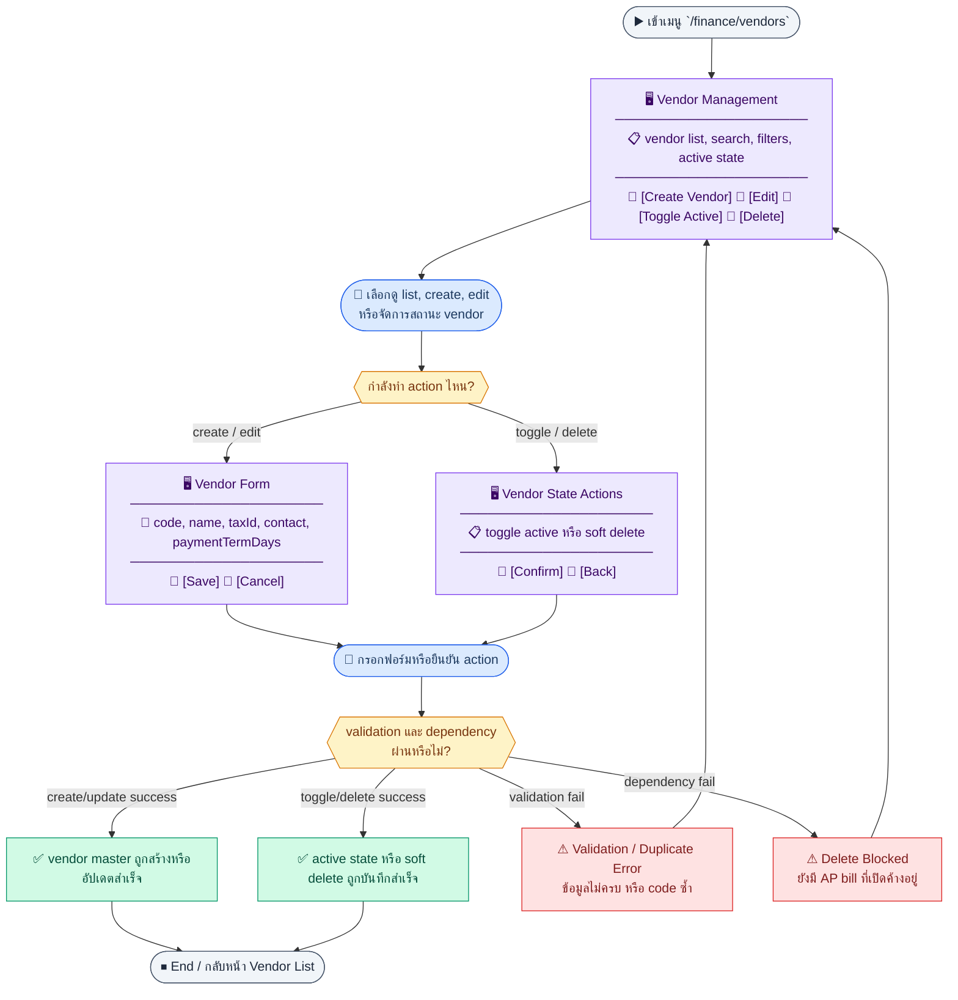
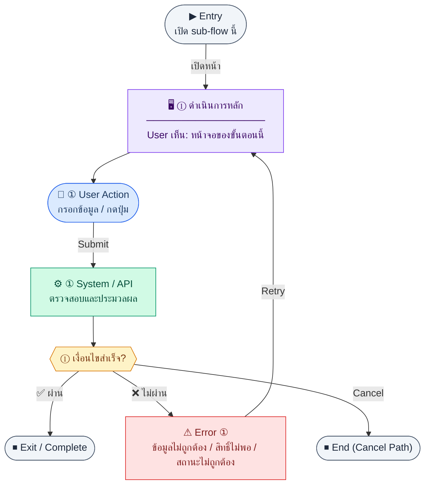

# UX Flow — Finance จัดการ Vendor (Master Data)

เอกสารนี้แยก journey ตามกลุ่ม endpoint ใน `Documents/SD_Flow/Finance/vendors.md` เพื่อให้ QA/BA ตรวจ **coverage แบบ 1:1** กับ SD_Flow ได้

**แหล่งอ้างอิงที่ผูกกับเอกสารนี้**

- Business requirement (BR): `Documents/Requirements/Release_1.md` — Feature 1.7 Finance — Vendor Management
- Traceability: `Documents/Requirements/Release_1_traceability_mermaid.md` — Feature 1.7 (`/finance/vendors*`)
- Sequence / SD_Flow: `Documents/SD_Flow/Finance/vendors.md`
- Related screens / mockups: `Documents/UI_Flow_mockup/Page/R1-07_Finance_Vendor_Management/VendorList.md`, `VendorForm.md`

---

## Coverage Lock Notes (2026-04-16)

### In-scope endpoints
- `GET /api/finance/vendors/options`
- `GET /api/finance/vendors`
- `GET /api/finance/vendors/:id`
- `POST /api/finance/vendors`
- `PATCH /api/finance/vendors/:id`
- `PATCH /api/finance/vendors/:id/activate`
- `DELETE /api/finance/vendors/:id`

### Canonical read models
- dropdown ใช้ `id`, `code`, `name`, `taxId`, `isActive`
- list/detail ต้องแยก `inactive` ออกจาก `soft-deleted`

### UX lock
- inactive vendor ไม่ควรแสดงใน picker ปกติ
- soft-deleted vendor ไม่ควรแสดงใน list default เว้นแต่เป็น history/admin mode
## E2E Scenario Flow

> ภาพรวมการจัดการ vendor master data ตั้งแต่โหลด dropdown options, ค้นหารายการ, สร้างและแก้ไข vendor, เปิดหรือปิดการใช้งาน, จนถึง soft delete โดยยึดกฎ dependency กับ AP bill

### Scenario Summary

| Scenario | ขั้นตอน | ผลลัพธ์ |
|----------|---------|---------|
| ✅ Load vendor options | Open AP or vendor-selecting form | Only active vendors appear in dropdown options |
| ✅ Browse vendor list | Open `/finance/vendors` | User can search, filter, and inspect vendor records |
| ✅ Create vendor | Submit new vendor form | New vendor is added and becomes usable downstream |
| ✅ Update vendor | Open edit form → save | Vendor master data is updated successfully |
| ✅ Activate or deactivate vendor | Toggle active state from list/detail | Vendor availability in dropdowns changes |
| ✅ Soft-delete vendor | Confirm delete action when allowed | Vendor is removed from active use without hard deletion |
| ⚠ Handle dependency block on delete | Delete vendor with open AP bills | User is stopped with a clear business-rule message |
| ⚠ Form validation fails | Duplicate code or missing required fields | System shows inline error and prevents save |

---
## ชื่อ Flow & ขอบเขต

**Flow name:** `Finance — Vendor (options, list, detail, create, update, activate, delete)`

**Actor(s):** `finance_manager`, `procurement` หรือบทบาทที่ได้รับ `finance:vendor:*`

**Entry:** `/finance/vendors`, `/finance/vendors/new`, `/finance/vendors/:id/edit` หรือการเรียก options จากหน้าอื่น (เช่น AP)

**Exit:** ข้อมูล vendor ถูกสร้าง/แก้ไข/สลับ active/soft delete สำเร็จ หรือผู้ใช้ยกเลิกหลังเห็น error ที่ชัดเจน

**Out of scope:** vendor scorecard, vendor portal, การ sync กับระบบภายนอก

---

## Sub-flow 1 — ตัวเลือก Vendor สำหรับ dropdown (`GET /api/finance/vendors/options`)

**Goal:** แสดงเฉพาะ vendor ที่ใช้งานได้สำหรับเลือกในเอกสารอื่น (เช่น AP) โดยไม่โหลดรายการเต็ม weight ของ list

**User sees:** ใน modal หรือหน้า `/finance/ap` — dropdown แสดง code + name, สถานะ loading เล็กน้อย

**User can do:** เลือก vendor หนึ่งราย, พิมพ์ค้นหา (ถ้า FE ใช้ local filter บน options ที่โหลดมาแล้ว)

**Frontend behavior:**

- เรียก `GET /api/finance/vendors/options` พร้อม `Authorization: Bearer <token>`
- cache ช่วงสั้นเมื่อผู้ใช้เปิด-ปิดฟอร์มซ้ำใน session เดียวกัน
- BR: vendor ที่ deactivate **ไม่แสดง**ใน options — ถ้า response ยังมีรายการที่ `isActive=false` ให้ FE filter ซ้ำเป็น defense in depth (ถ้าตกลงกับทีม BE)

**System / AI behavior:** คืนรายการ active สำหรับ dropdown

**Success:** dropdown มีข้อมูลหรือ empty ที่เข้าใจได้

**Error:** 401/403/5xx ตามมาตรฐานแอป; retry บน dropdown

**Notes:** Endpoint หลัก: `GET /api/finance/vendors/options`

---

### Scenario Flow

### สัญลักษณ์ Node (Color Legend)

| สี | Node shape | หมายถึง |
|----|-----------|---------|
| 🟣 ม่วง | สี่เหลี่ยม `["…"]` | **Screen / UI State** |
| 🔵 น้ำเงิน | วงกลม `(["…"])` | **User Action** |
| 🟢 เขียว | สี่เหลี่ยม `["…"]` | **System / API** |
| 🟡 เหลือง | เพชร `{{"…"}}` | **Decision** |
| 🔴 แดง | สี่เหลี่ยม `["…"]` | **Error / Edge case** |
| ⚫ เทา | วงรี `(["…"])` | **Start / End** |

---

## Sub-flow 2 — รายการ Vendor (`GET /api/finance/vendors`)

**Goal:** ค้นหาและดูแล master vendor ทั้งหมดรวม inactive และ soft-deleted policy ตามที่ list แสดง

**User sees:** ตาราง (code, name, taxId, เทอมชำระ, สถานะ active, วันที่อัปเดต), ช่องค้นหา, ตัวกรอง `isActive`, pagination

**User can do:** กรอง, เปลี่ยนหน้า, คลิกไปแก้ไข, เปิดสร้างใหม่, สลับ active จากแถว (ถ้ามี shortcut)

**Frontend behavior:**

- `GET /api/finance/vendors` พร้อม query BR: `page`, `limit`, `search` (code/name/taxId), `isActive`
- sync filter กับ URL query string เพื่อให้ share link ได้
- loading แบบ skeleton ครั้งแรก; stale-while-revalidate ตามนโยบายแอป

**System / AI behavior:** อ่าน `vendors` รองรับ soft delete (`deletedAt`) — การแสดงแถวที่ถูกลบแล้วเป็น product decision (ปกติซ่อนหรือแสดงในแท็บ “ถูกลบ”)

**Success:** ตารางสะท้อนข้อมูล server

**Error:** network/timeout → error row + ปุ่ม retry `GET /api/finance/vendors`

**Notes:** `GET /api/finance/vendors`

---

### Scenario Flow

### สัญลักษณ์ Node (Color Legend)

| สี | Node shape | หมายถึง |
|----|-----------|---------|
| 🟣 ม่วง | สี่เหลี่ยม `["…"]` | **Screen / UI State** |
| 🔵 น้ำเงิน | วงกลม `(["…"])` | **User Action** |
| 🟢 เขียว | สี่เหลี่ยม `["…"]` | **System / API** |
| 🟡 เหลือง | เพชร `{{"…"}}` | **Decision** |
| 🔴 แดง | สี่เหลี่ยม `["…"]` | **Error / Edge case** |
| ⚫ เทา | วงรี `(["…"])` | **Start / End** |

---

## Sub-flow 3 — รายละเอียด Vendor (`GET /api/finance/vendors/:id`)

**Goal:** ตรวจสอบข้อมูลเต็มก่อนแก้ไขหรือก่อนตัดสินใจ activate/delete

**User sees:** การ์ด/ฟอร์ม read-only หรือหน้า edit ที่ preload ค่าทุกฟิลด์

**User can do:** อ่านข้อมูล, กด “แก้ไข” ไปโหมดฟอร์ม

**Frontend behavior:**

- เปิด `/finance/vendors/:id/edit` → `GET /api/finance/vendors/:id`
- แสดง loading บนฟอร์มจนกว่าได้ข้อมูล

**System / AI behavior:** คืน record เดียว; ถ้า soft delete อาจคืน 404

**Success:** ฟิลด์ครบและตรงกับ list

**Error:** 404 not found; 403 ไม่มีสิทธิ์

**Notes:** `GET /api/finance/vendors/:id`

---

### Scenario Flow

### สัญลักษณ์ Node (Color Legend)

| สี | Node shape | หมายถึง |
|----|-----------|---------|
| 🟣 ม่วง | สี่เหลี่ยม `["…"]` | **Screen / UI State** |
| 🔵 น้ำเงิน | วงกลม `(["…"])` | **User Action** |
| 🟢 เขียว | สี่เหลี่ยม `["…"]` | **System / API** |
| 🟡 เหลือง | เพชร `{{"…"}}` | **Decision** |
| 🔴 แดง | สี่เหลี่ยม `["…"]` | **Error / Edge case** |
| ⚫ เทา | วงรี `(["…"])` | **Start / End** |

---

## Sub-flow 4 — สร้าง Vendor (`POST /api/finance/vendors`)

**Goal:** เพิ่ม vendor ใหม่ให้ใช้ใน AP และเอกสารอื่น

**User sees:** ฟอร์ม `/finance/vendors/new` — code, name, taxId, ที่อยู่, ผู้ติดต่อ, โทร, email, paymentTermDays

**User can do:** กรอกและกดบันทึก, กดยกเลิกกลับ list

**Frontend behavior:**

- validate: name บังคับ, email/phone format, paymentTermDays เป็นตัวเลข ≥ 0
- `POST /api/finance/vendors` พร้อม body ตาม schema จริงของ API
- BR: `code` unique — ถ้าว่างระบบอาจ auto `VEND-{SEQ}`; แสดง helper text ให้ผู้ใช้รู้ว่าเว้นว่างได้หรือไม่ตาม product

**System / AI behavior:** insert `vendors`, enforce unique `code`

**Success:** 201 → redirect `/finance/vendors/:id/edit` หรือ list พร้อม toast

**Error:** 400 validation; 409 duplicate code; 403

**Notes:** `POST /api/finance/vendors`

---

### Scenario Flow

### สัญลักษณ์ Node (Color Legend)

| สี | Node shape | หมายถึง |
|----|-----------|---------|
| 🟣 ม่วง | สี่เหลี่ยม `["…"]` | **Screen / UI State** |
| 🔵 น้ำเงิน | วงกลม `(["…"])` | **User Action** |
| 🟢 เขียว | สี่เหลี่ยม `["…"]` | **System / API** |
| 🟡 เหลือง | เพชร `{{"…"}}` | **Decision** |
| 🔴 แดง | สี่เหลี่ยม `["…"]` | **Error / Edge case** |
| ⚫ เทา | วงรี `(["…"])` | **Start / End** |

---

## Sub-flow 5 — แก้ไข Vendor (`PATCH /api/finance/vendors/:id`)

**Goal:** อัปเดตข้อมูล master โดยไม่สลับสถานะ active ผ่าน endpoint นี้ (แยกจาก activate ตาม SD)

**User sees:** ฟอร์ม edit เติมค่าจาก `GET .../:id`

**User can do:** แก้ไขฟิลด์และบันทึก

**Frontend behavior:**

- `PATCH /api/finance/vendors/:id` ส่งเฉพาะฟิลด์ที่เปลี่ยน (partial patch) หรือ full object ตามสัญญา API
- optimistic lock: ถ้ามี `updatedAt` ใน response อาจใช้ป้องกัน overwrite (ถ้า backend รองรับ)

**System / AI behavior:** update แถว `vendors`

**Success:** 200, refresh `GET .../:id` หรืออัปเดต local state

**Error:** 400/404/409

**Notes:** `PATCH /api/finance/vendors/:id`

---

### Scenario Flow

### สัญลักษณ์ Node (Color Legend)

| สี | Node shape | หมายถึง |
|----|-----------|---------|
| 🟣 ม่วง | สี่เหลี่ยม `["…"]` | **Screen / UI State** |
| 🔵 น้ำเงิน | วงกลม `(["…"])` | **User Action** |
| 🟢 เขียว | สี่เหลี่ยม `["…"]` | **System / API** |
| 🟡 เหลือง | เพชร `{{"…"}}` | **Decision** |
| 🔴 แดง | สี่เหลี่ยม `["…"]` | **Error / Edge case** |
| ⚫ เทา | วงรี `(["…"])` | **Start / End** |

---

## Sub-flow 6 — เปิด/ปิดการใช้งาน (`PATCH /api/finance/vendors/:id/activate`)

**Goal:** deactivate โดยไม่ลบข้อมูล เพื่อให้ vendor หายจาก `options` แต่คงประวัติใน AP

**User sees:** toggle บนตารางหรือสวิตช์ในหน้า detail, confirm ถ้า deactivate จะกระทบเอกสารค้าง (ข้อความเตือน UX)

**User can do:** สลับ active/inactive

**Frontend behavior:**

- `PATCH /api/finance/vendors/:id/activate` พร้อม body ตาม SD ตัวอย่าง `{ "isActive": false }` (ยึด schema จริงจาก API)
- หลังสำเร็จ invalidate `GET /api/finance/vendors/options` ใน cache ของ client

**System / AI behavior:** อัปเดต `isActive`

**Success:** 200 และ toggle สะท้อนสถานะ

**Error:** 403; 400 ถ้า business ห้ามปิด (ถ้ามี)

**Notes:** `PATCH /api/finance/vendors/:id/activate`

---

### Scenario Flow

### สัญลักษณ์ Node (Color Legend)

| สี | Node shape | หมายถึง |
|----|-----------|---------|
| 🟣 ม่วง | สี่เหลี่ยม `["…"]` | **Screen / UI State** |
| 🔵 น้ำเงิน | วงกลม `(["…"])` | **User Action** |
| 🟢 เขียว | สี่เหลี่ยม `["…"]` | **System / API** |
| 🟡 เหลือง | เพชร `{{"…"}}` | **Decision** |
| 🔴 แดง | สี่เหลี่ยม `["…"]` | **Error / Edge case** |
| ⚫ เทา | วงรี `(["…"])` | **Start / End** |

---

## Sub-flow 7 — ลบ Vendor แบบ soft delete (`DELETE /api/finance/vendors/:id`)

**Goal:** นำ vendor ออกจากการใช้งานใน master โดย soft delete

**User sees:** ปุ่มลบ + dialog ยืนยันอธิบายผลกระทบ

**User can do:** ยืนยันลบหรือยกเลิก

**Frontend behavior:**

- `DELETE /api/finance/vendors/:id`
- BR: **ลบไม่ได้**ถ้ามี AP bill ที่ยัง open (status ≠ paid/rejected) — ก่อนลบ FE อาจเรียกข้อมูลสรุปจาก AP (ถ้ามี endpoint ช่วย) หรือพึ่ง error 409/400 จาก BE แล้วแสดงข้อความชัดเจน

**System / AI behavior:** set `deletedAt` (soft delete)

**Success:** 200 + ข้อความ “ลบแล้ว”; นำผู้ใช้กลับ list และลบแถวออกจากมุมมองหลัก

**Error:** 409/400 dependency; 403

**Notes:** `DELETE /api/finance/vendors/:id`

---

## Coverage Checklist

| Endpoint | Covered in UX file | Notes |
|----------|-------------------|-------|
| `GET /api/finance/vendors/options` | Sub-flow 1 — ตัวเลือก Vendor สำหรับ dropdown | `Documents/SD_Flow/Finance/vendors.md` |
| `GET /api/finance/vendors` | Sub-flow 2 — รายการ Vendor | `Documents/SD_Flow/Finance/vendors.md` |
| `GET /api/finance/vendors/:id` | Sub-flow 3 — รายละเอียด Vendor | `Documents/SD_Flow/Finance/vendors.md` |
| `POST /api/finance/vendors` | Sub-flow 4 — สร้าง Vendor | `Documents/SD_Flow/Finance/vendors.md` |
| `PATCH /api/finance/vendors/:id` | Sub-flow 5 — แก้ไข Vendor | `Documents/SD_Flow/Finance/vendors.md` |
| `PATCH /api/finance/vendors/:id/activate` | Sub-flow 6 — เปิด/ปิดการใช้งาน | `Documents/SD_Flow/Finance/vendors.md` |
| `DELETE /api/finance/vendors/:id` | Sub-flow 7 — ลบ Vendor แบบ soft delete | `Documents/SD_Flow/Finance/vendors.md` |

### Scenario Flow

### สัญลักษณ์ Node (Color Legend)

| สี | Node shape | หมายถึง |
|----|-----------|---------|
| 🟣 ม่วง | สี่เหลี่ยม `["…"]` | **Screen / UI State** |
| 🔵 น้ำเงิน | วงกลม `(["…"])` | **User Action** |
| 🟢 เขียว | สี่เหลี่ยม `["…"]` | **System / API** |
| 🟡 เหลือง | เพชร `{{"…"}}` | **Decision** |
| 🔴 แดง | สี่เหลี่ยม `["…"]` | **Error / Edge case** |
| ⚫ เทา | วงรี `(["…"])` | **Start / End** |

---

