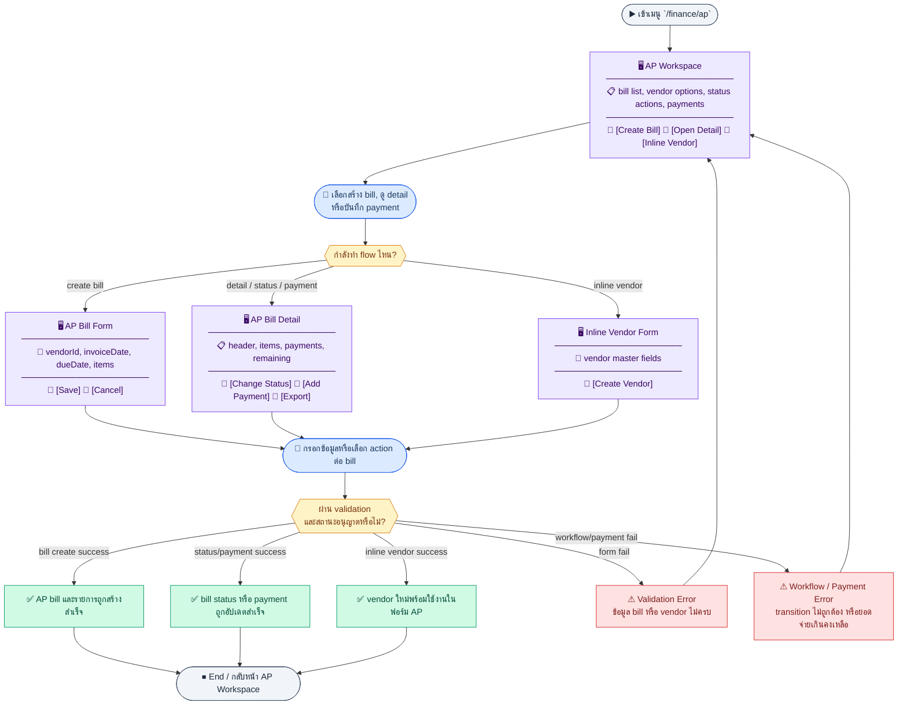
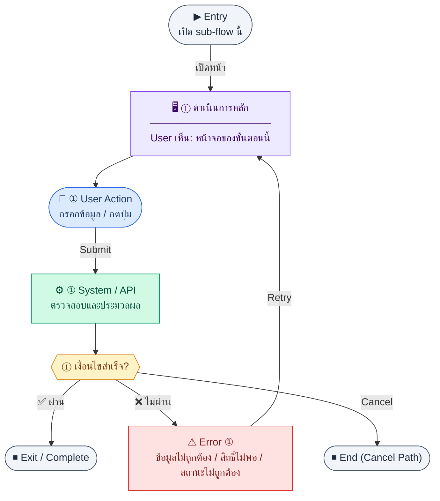

# UX Flow — Finance บัญชีเจ้าหนี้ (AP / Vendor Invoices)

เอกสารนี้จัดลำดับ UX ตาม `Documents/SD_Flow/Finance/ap.md` และ business rules ใน BR Feature 1.8 (workflow, partial payment, inline vendor)

**แหล่งอ้างอิงที่ผูกกับเอกสารนี้**

- Business requirement (BR): `Documents/Requirements/Release_1.md` — Feature 1.8 Finance — Accounts Payable (AP)
- Traceability: `Documents/Requirements/Release_1_traceability_mermaid.md` — Feature 1.8 (`/finance/ap`, vendor options/create)
- Sequence / SD_Flow: `Documents/SD_Flow/Finance/ap.md`
- Vendor (dropdown/inline): `Documents/SD_Flow/Finance/vendors.md`
- Export PDF (อ้างอิงเสริม): `Documents/SD_Flow/Finance/document_exports.md` — `GET /api/finance/ap/vendor-invoices/:id/pdf`
- Related screens / mockups: `Documents/UI_Flow_mockup/Page/R1-08_Finance_Accounts_Payable/ApList.md`, `.../ApBillForm.md`, `.../ApDetail.md`

---

## Coverage Lock Notes (2026-04-16)
- AP status workflow ใน UX ต้องผูก state machine เดียวกับ Requirements/SD (`draft`, `submitted`, `approved`, `rejected`, `partially_paid`, `paid`)
- inline vendor create ต้องใช้ response object ที่ SD กำหนด (ไม่เดา field เอง)
- ฟังก์ชันที่ผูก PO/WHT/advanced bank reconciliation ให้ mark เป็น R2/future ถ้ายังไม่ active
- AP aggregate/read model ต้องยึด `paidAmount`, `remainingAmount`, `paymentCount`, `statusSummary` จาก BE ไม่คำนวณสรุปแทน server
- `statusSummary` ต้องถูกอธิบายครบใน UX detail/report states อย่างน้อย `documentStatus`, `paymentStatus`, `isOverdue`, `lastPaymentDate`
- payment validation อาจใช้ `totalAmount - paidAmount` ช่วยเตือนผู้ใช้ได้ แต่ canonical display ของยอดคงเหลือต้องอ้าง `remainingAmount` จาก API

## E2E Scenario Flow

> ภาพรวม AP bill workflow ตั้งแต่เตรียม vendor options, สร้างและดูรายการ bill, ตรวจรายละเอียด, เปลี่ยนสถานะอนุมัติ, บันทึกการจ่ายบางส่วนหรือเต็มจำนวน, สร้าง vendor แบบ inline และส่งออกเอกสารที่เกี่ยวข้อง

### Scenario Summary

| Scenario | ขั้นตอน | ผลลัพธ์ |
|----------|---------|---------|
| ✅ Prepare vendor choices | Open `/finance/ap` | Active vendors are available for bill entry |
| ✅ Browse AP bills | Load AP list page | User can filter bills and open a bill for review |
| ✅ Create AP bill | Submit AP create form | Bill, line items, and document number are created |
| ✅ Review bill detail | Open a bill record | User sees header, items, payment history, and remaining balance |
| ✅ Move bill through workflow | Submit, approve, reject, or reset action | Bill status changes only through allowed transitions |
| ✅ Record payment | Submit payment on approved bill | Paid amount and bill status update to partially paid or paid |
| ✅ Inline-create vendor | Create vendor from AP form | Newly created vendor becomes selectable immediately |
| ⚠ Workflow or payment action fails | Invalid transition, amount > remaining, or invalid vendor data | System blocks action and shows clear error |

---
## ชื่อ Flow & ขอบเขต

**Flow name:** `Finance — AP Vendor Invoices (list, detail, create, status, payments) + vendor options/inline`

**Actor(s):** `accountant`, `finance_manager`

**Entry:** `/finance/ap` (ฟอร์มสร้าง inline + ตาราง + actions ตาม BR)

**Exit:** สร้างบิลได้, อนุมัติ/ปฏิเสธ, บันทึกจ่ายจนสถานะ `paid` / `partially_paid` ถูกต้อง หรือหยุดเมื่อ validation/permission block

**Out of scope:** bank reconciliation อัตโนมัติ (R2+), การผูก PO/bankAccount แบบเต็ม (BR ระบุ R2 additions)

---

## Sub-flow 1 — เตรียมตัวเลือก Vendor (`GET /api/finance/vendors/options`)

**Goal:** โหลด dropdown vendor ที่ active สำหรับฟอร์มสร้าง AP bill

**User sees:** select vendor ในฟอร์มด้านบนหรือ drawer สร้างบิล, skeleton ระหว่างโหลด

**User can do:** เลือก vendor ที่มีอยู่, หรือเปิด “สร้าง vendor ใหม่” (sub-flow 6)

**Frontend behavior:**

- เมื่อ mount `/finance/ap` หรือเปิดฟอร์มสร้าง → `GET /api/finance/vendors/options`
- ถ้า fail แสดง inline error + retry เฉพาะบล็อกฟอร์ม

**System / AI behavior:** คืนรายการ vendor active

**Success:** dropdown พร้อมใช้

**Error:** 401/403/5xx + retry

**Notes:** `GET /api/finance/vendors/options` — traceability Feature 1.8

---

### Scenario Flow

### สัญลักษณ์ Node (Color Legend)

| สี | Node shape | หมายถึง |
|----|-----------|---------|
| 🟣 ม่วง | สี่เหลี่ยม `["…"]` | **Screen / UI State** |
| 🔵 น้ำเงิน | วงกลม `(["…"])` | **User Action** |
| 🟢 เขียว | สี่เหลี่ยม `["…"]` | **System / API** |
| 🟡 เหลือง | เพชร `{{"…"}}` | **Decision** |
| 🔴 แดง | สี่เหลี่ยม `["…"]` | **Error / Edge case** |
| ⚫ เทา | วงรี `(["…"])` | **Start / End** |

---

## Sub-flow 2 — รายการ AP bills (`GET /api/finance/ap/vendor-invoices`)

**Goal:** มองเห็นใบแจ้งหนี้เจ้าหนี้ทั้งหมด กรองตามสถานะ/vendor/วันที่ และเข้าสู่รายละเอียด

**User sees:** ตาราง (documentNo, vendor, vendorInvoiceNo, วันที่, ครบกำหนด, status, total, paidAmount), ตัวกรอง, pagination

**User can do:** กรอง `status`, `vendorId`, ช่วง `invoiceDateFrom`/`invoiceDateTo`, ค้นหา `search`, เปิดแถวไป detail inline หรือหน้าแยก (ตามที่ออกแบบ)

**Frontend behavior:**

- `GET /api/finance/ap/vendor-invoices` พร้อม query BR: `page`, `limit`, `search`, `status`, `vendorId`, `invoiceDateFrom`, `invoiceDateTo`
- แสดง badge สีตาม status: draft | submitted | approved | rejected | paid | partially_paid
- permission: ปุ่ม approve/reject/pay แสดงเฉพาะเมื่อมีสิทธิ์ action ที่สอดคล้อง

**System / AI behavior:** join กับ vendor, คืนยอดรวมและ paidAmount

**Success:** ตารางตรงกับ backend

**Error:** fetch fail → empty state + retry

**Notes:** `GET /api/finance/ap/vendor-invoices`

---

### Scenario Flow

### สัญลักษณ์ Node (Color Legend)

| สี | Node shape | หมายถึง |
|----|-----------|---------|
| 🟣 ม่วง | สี่เหลี่ยม `["…"]` | **Screen / UI State** |
| 🔵 น้ำเงิน | วงกลม `(["…"])` | **User Action** |
| 🟢 เขียว | สี่เหลี่ยม `["…"]` | **System / API** |
| 🟡 เหลือง | เพชร `{{"…"}}` | **Decision** |
| 🔴 แดง | สี่เหลี่ยม `["…"]` | **Error / Edge case** |
| ⚫ เทา | วงรี `(["…"])` | **Start / End** |

---

## Sub-flow 3 — รายละเอียดบิล + รายการ + ประวัติจ่าย (`GET /api/finance/ap/vendor-invoices/:id`)

**Goal:** ตรวจสอบหัว รายการ และประวัติการจ่ายก่อนอนุมัติหรือบันทึกจ่าย

**User sees:** header (vendor, documentNo, vendorInvoiceNo, วันที่, due, notes), ตารางรายการบรรทัด, สรุปยอด, ตาราง payment history, ปุ่ม actions ตามสถานะ

**User can do:** อ่านข้อมูล, เปิด dialog อนุมัติ/ปฏิเสธ/จ่ายเงิน

**Frontend behavior:**

- `GET /api/finance/ap/vendor-invoices/:id` เมื่อเลือกแถวหรือเข้า route detail
- ใช้ข้อมูล `paidAmount`, `totalAmount`, `status` เพื่อคำนวณยอดคงเหลือฝั่ง FE สำหรับ validation ก่อน `POST .../payments`
- ถ้า bill ผูก `poId` ให้แสดงแถบเทียบยอด `PO totalAmount` กับ `bill totalAmount` และสถานะการรับของ เพื่อช่วยผู้ใช้ตัดสินใจก่อน approve/pay

**System / AI behavior:** คืน bill + items + payments

**Success:** UI ครบทุกแท็บ/ส่วน

**Error:** 404/403

**Notes:** `GET /api/finance/ap/vendor-invoices/:id`; ถ้ามี `poId` ให้มี deep link กลับไปหน้า PO detail

---

### Scenario Flow

### สัญลักษณ์ Node (Color Legend)

| สี | Node shape | หมายถึง |
|----|-----------|---------|
| 🟣 ม่วง | สี่เหลี่ยม `["…"]` | **Screen / UI State** |
| 🔵 น้ำเงิน | วงกลม `(["…"])` | **User Action** |
| 🟢 เขียว | สี่เหลี่ยม `["…"]` | **System / API** |
| 🟡 เหลือง | เพชร `{{"…"}}` | **Decision** |
| 🔴 แดง | สี่เหลี่ยม `["…"]` | **Error / Edge case** |
| ⚫ เทา | วงรี `(["…"])` | **Start / End** |

---

## Sub-flow 4 — สร้าง AP bill (`POST /api/finance/ap/vendor-invoices`)

**Goal:** บันทึกใบแจ้งหนี้จาก vendor พร้อมรายการบรรทัด

**User sees:** ฟอร์มสร้างบิล (โดยปกติ inline บนหน้า `/finance/ap`): เลือก vendor, vendorInvoiceNo, invoiceDate, dueDate, notes, ตาราง items — **ทางเลือก UI:** ฟอร์มเต็มหน้า `/finance/ap/new` (spec: `Documents/UI_Flow_mockup/Page/R1-08_Finance_Accounts_Payable/ApBillForm.md`) ให้ journey เดียวกับ flow นี้

**User can do:** เพิ่ม/ลบแถว, กรอก quantity × unitPrice, submit

**Frontend behavior:**

- validate ตาม BR: vendorId บังคับ, วันที่, แต่ละ item มี description, quantity, unitPrice
- `POST /api/finance/ap/vendor-invoices` ด้วย body ตัวอย่างใน BR (vendorId, vendorInvoiceNo, invoiceDate, dueDate, notes, items[])
- หลัง 201 refresh `GET /api/finance/ap/vendor-invoices` และอาจเปิด detail ของบิลใหม่
- ใน R2 รองรับ `poId` (optional) เพื่อ link PO จากหน้า AP create โดยตรง (ไม่สร้าง AP จากหน้า PO)
- ถ้าเลือก `poId` ให้แสดง PO summary ข้างฟอร์ม (vendor, totalAmount, receivedQty) และคำนวณ warning เมื่อยอดบิลสูงกว่า `PO totalAmount`; warning นี้ควรเป็น soft warning ที่ยังให้ submit ต่อได้ถ้า BR/BE อนุญาต

**System / AI behavior:** สร้าง `finance_ap_bills` + items, auto `documentNo` (`AP-{YEAR}-{SEQ:4}`)

**Success:** 201 และบิลปรากฏใน list

**Error:** 400 field errors; vendor ไม่ active — ตามข้อความ server; ถ้า `poId` ถูกเลือกและยอดเกิน PO ให้แสดง warning แบบชี้ชัดพร้อมยอด `PO totalAmount` เทียบ `AP bill amount`

**Notes:** `POST /api/finance/ap/vendor-invoices`; ใน R2 ให้ยึด entry point การสร้างบิลที่ `/finance/ap` แล้วเลือก `poId` จากฟอร์ม create เพื่อรองรับ 3-way matching

---

### Scenario Flow

### สัญลักษณ์ Node (Color Legend)

| สี | Node shape | หมายถึง |
|----|-----------|---------|
| 🟣 ม่วง | สี่เหลี่ยม `["…"]` | **Screen / UI State** |
| 🔵 น้ำเงิน | วงกลม `(["…"])` | **User Action** |
| 🟢 เขียว | สี่เหลี่ยม `["…"]` | **System / API** |
| 🟡 เหลือง | เพชร `{{"…"}}` | **Decision** |
| 🔴 แดง | สี่เหลี่ยม `["…"]` | **Error / Edge case** |
| ⚫ เทา | วงรี `(["…"])` | **Start / End** |

---

## Sub-flow 5 — เปลี่ยนสถานะ workflow (`PATCH /api/finance/ap/vendor-invoices/:id/status`)

**Goal:** ขับเคลื่อน draft → submitted → approved/rejected ตามนโยบายองค์กรและ BR

**User sees:** ปุ่ม “ส่งอนุมัติ”, “อนุมัติ”, “ปฏิเสธ” หรือ dropdown สถานะ (แล้วแต่ UI) พร้อม confirm

**User can do:** เลือก transition ที่อนุญาต

**Frontend behavior:**

- เรียก `PATCH /api/finance/ap/vendor-invoices/:id/status` พร้อม body ตาม API (เช่น status เป้าหมาย + เหตุผล reject ถ้ามี)
- หลังสำเร็จ refresh `GET .../:id` และ invalidate list query
- disable ปุ่มขณะรอ response ป้องกัน double-submit
- ถ้า bill อยู่สถานะ `rejected` ให้แสดง action `แก้ไขและส่งใหม่`:
  - reset ไป draft: `PATCH .../status` body `{ "status": "draft", "note": "reset to edit" }`
  - หลัง reset สำเร็จ ให้ unlock ฟอร์มแก้ไขและซ่อน action reject เดิม
  - เมื่อแก้ไขเสร็จให้ส่งกลับรออนุมัติด้วย `PATCH .../status` body `{ "status": "submitted" }`

**System / AI behavior:** ตรวจ transition, อาจบันทึก approvedBy/approvedAt เมื่อ approved

**Success:** 200 และ UI สถานะใหม่

**Error:** 400 transition ไม่ได้รับอนุญาต; 403 ไม่ใช่ผู้อนุมัติ; ถ้า BE ไม่รองรับ `rejected -> draft` ให้แสดงทางเลือกสร้างบิลใหม่พร้อม copy ข้อมูลเดิม

**Notes:** `PATCH /api/finance/ap/vendor-invoices/:id/status` — **การจ่ายเงินอนุญาตเฉพาะ status = approved** (BR); ควรยืนยัน contract transition `rejected -> draft` กับ BE ให้ชัดเจน

---

### Scenario Flow

### สัญลักษณ์ Node (Color Legend)

| สี | Node shape | หมายถึง |
|----|-----------|---------|
| 🟣 ม่วง | สี่เหลี่ยม `["…"]` | **Screen / UI State** |
| 🔵 น้ำเงิน | วงกลม `(["…"])` | **User Action** |
| 🟢 เขียว | สี่เหลี่ยม `["…"]` | **System / API** |
| 🟡 เหลือง | เพชร `{{"…"}}` | **Decision** |
| 🔴 แดง | สี่เหลี่ยม `["…"]` | **Error / Edge case** |
| ⚫ เทา | วงรี `(["…"])` | **Start / End** |

---

## Sub-flow 6 — บันทึกการจ่ายเงิน (`POST /api/finance/ap/vendor-invoices/:id/payments`)

**Goal:** บันทึกการจ่ายจริงแบบ full หรือ partial โดยไม่เกินยอดคงเหลือ

**User sees:** modal: paymentDate, amount, paymentMethod (`bank_transfer` | `cash` | `cheque` | `other`), `bankAccountId` (เมื่อ paymentMethod เป็น bank transfer), referenceNo, notes; แสดงยอดคงเหลือชัดเจน

**User can do:** กรอกและยืนยัน

**Frontend behavior:**

- เปิด modal เฉพาะเมื่อ `status === 'approved'` (หรือ `partially_paid` ถ้า BR อนุญาตจ่ายซ้ำ — ตาม BR: จ่ายได้เมื่อ approved; หลังจ่ายบางส่วนยังคงต้องจ่ายต่อได้ → FE ตรวจจากยอดคงเหลือ)
- validate: `amount > 0` และ `amount <= totalAmount - paidAmount`
- ถ้าเลือก `paymentMethod = bank_transfer` ให้โหลดตัวเลือกจาก `GET /api/finance/bank-accounts/options` และบังคับ `bankAccountId`
- `POST /api/finance/ap/vendor-invoices/:id/payments` ด้วย body ตาม canonical contract: `paymentDate`, `amount`, `paymentMethod`, `bankAccountId?`, `referenceNo`, `notes?`
- หลัง 201 เรียก `GET .../:id` เพื่ออัปเดต paidAmount และ status (`paid` หากครบ, `partially_paid` หากยังไม่ครบ)
- หลังจ่ายสำเร็จ ถ้า vendor มี flag `whtApplicable === true` ให้แสดง prompt:
  - `สร้างใบ WHT` -> ไป `/finance/tax/wht/new?apBillId={id}`
  - `ข้าม` -> ปิด prompt และแสดงเตือนให้ไป `/finance/tax/wht`

**System / AI behavior:** insert `finance_ap_vendor_invoice_payments`, อัปเดต `paidAmount` และ status ตาม BR

**Success:** 201 และตาราง payments + สถานะบิลถูกต้อง

**Error:** 400 overpayment / จ่ายเมื่อยังไม่ approved; 403

**Notes:** `POST /api/finance/ap/vendor-invoices/:id/payments`; WHT prompt หลังจ่ายเป็น flow ของ R2 (Feature 3.3) โดย R1 ให้แสดงเป็น note เชิงแนะนำ

---

### Scenario Flow

### สัญลักษณ์ Node (Color Legend)

| สี | Node shape | หมายถึง |
|----|-----------|---------|
| 🟣 ม่วง | สี่เหลี่ยม `["…"]` | **Screen / UI State** |
| 🔵 น้ำเงิน | วงกลม `(["…"])` | **User Action** |
| 🟢 เขียว | สี่เหลี่ยม `["…"]` | **System / API** |
| 🟡 เหลือง | เพชร `{{"…"}}` | **Decision** |
| 🔴 แดง | สี่เหลี่ยม `["…"]` | **Error / Edge case** |
| ⚫ เทา | วงรี `(["…"])` | **Start / End** |

---

## Sub-flow 7 — สร้าง Vendor แบบ inline จากหน้า AP (`POST /api/finance/vendors`)

**Goal:** เมื่อไม่มี vendor ในระบบ ให้สร้างได้ทันทีโดยไม่ต้องออกจาก `/finance/ap`

**User sees:** ลิงก์/ปุ่ม “+ สร้าง vendor ใหม่” เปิด modal ฟอร์มย่อ (name, taxId, … ตามขั้นต่ำที่ API รับ)

**User can do:** กรอกและบันทึก vendor

**Frontend behavior:**

- `POST /api/finance/vendors` จาก modal
- หลัง 201: prepend เข้า options หรือเรียก `GET /api/finance/vendors/options` ใหม่แล้ว auto-select vendor ที่สร้าง

**System / AI behavior:** สร้าง vendor ใหม่

**Success:** ผู้ใช้เลือก vendor ใหม่ในฟอร์ม AP ได้ทันที

**Error:** 409 duplicate code; validation 400

**Notes:** `POST /api/finance/vendors` — ไม่ใช่ path ใต้ `/ap` แต่เป็น UX บังคับของ Feature 1.8 ตาม BR และ traceability

---

### Scenario Flow

### สัญลักษณ์ Node (Color Legend)

| สี | Node shape | หมายถึง |
|----|-----------|---------|
| 🟣 ม่วง | สี่เหลี่ยม `["…"]` | **Screen / UI State** |
| 🔵 น้ำเงิน | วงกลม `(["…"])` | **User Action** |
| 🟢 เขียว | สี่เหลี่ยม `["…"]` | **System / API** |
| 🟡 เหลือง | เพชร `{{"…"}}` | **Decision** |
| 🔴 แดง | สี่เหลี่ยม `["…"]` | **Error / Edge case** |
| ⚫ เทา | วงรี `(["…"])` | **Start / End** |

---

## Sub-flow 8 — ส่งออก PDF (อ้างอิง document_exports)

**Goal:** ดาวน์โหลดเอกสาร AP เป็น PDF

**User sees:** ปุ่ม “PDF” บน detail

**User can do:** กดดาวน์โหลด

**Frontend behavior:** `GET /api/finance/ap/vendor-invoices/:id/pdf` — จัดการ blob / window ใหม่

**System / AI behavior:** generate PDF

**Success:** ไฟล์ได้รับการดาวน์โหลด

**Error:** 404/500 + retry

**Notes:** `Documents/SD_Flow/Finance/document_exports.md`

---

## Coverage Checklist

| Endpoint | Covered in UX file | Notes |
|----------|-------------------|-------|
| `GET /api/finance/vendors/options` | Sub-flow 1 — เตรียมตัวเลือก Vendor | `Documents/SD_Flow/Finance/vendors.md` (ใช้ร่วมกับ AP ตาม BR / traceability) |
| `GET /api/finance/ap/vendor-invoices` | Sub-flow 2 — รายการ AP bills | `Documents/SD_Flow/Finance/ap.md` |
| `GET /api/finance/ap/vendor-invoices/:id` | Sub-flow 3 — รายละเอียดบิล + รายการ + ประวัติจ่าย | `Documents/SD_Flow/Finance/ap.md` |
| `POST /api/finance/ap/vendor-invoices` | Sub-flow 4 — สร้าง AP bill | `Documents/SD_Flow/Finance/ap.md` |
| `PATCH /api/finance/ap/vendor-invoices/:id/status` | Sub-flow 5 — เปลี่ยนสถานะ workflow | `Documents/SD_Flow/Finance/ap.md` |
| `POST /api/finance/ap/vendor-invoices/:id/payments` | Sub-flow 6 — บันทึกการจ่ายเงิน | `Documents/SD_Flow/Finance/ap.md` |
| `POST /api/finance/vendors` | Sub-flow 7 — สร้าง Vendor แบบ inline จากหน้า AP | `Documents/SD_Flow/Finance/vendors.md` — inline create from AP form |
| `GET /api/finance/ap/vendor-invoices/:id/pdf` | Sub-flow 8 — ส่งออก PDF | `Documents/SD_Flow/Finance/document_exports.md` — PDF export route |

### Scenario Flow

### สัญลักษณ์ Node (Color Legend)

| สี | Node shape | หมายถึง |
|----|-----------|---------|
| 🟣 ม่วง | สี่เหลี่ยม `["…"]` | **Screen / UI State** |
| 🔵 น้ำเงิน | วงกลม `(["…"])` | **User Action** |
| 🟢 เขียว | สี่เหลี่ยม `["…"]` | **System / API** |
| 🟡 เหลือง | เพชร `{{"…"}}` | **Decision** |
| 🔴 แดง | สี่เหลี่ยม `["…"]` | **Error / Edge case** |
| ⚫ เทา | วงรี `(["…"])` | **Start / End** |

---

