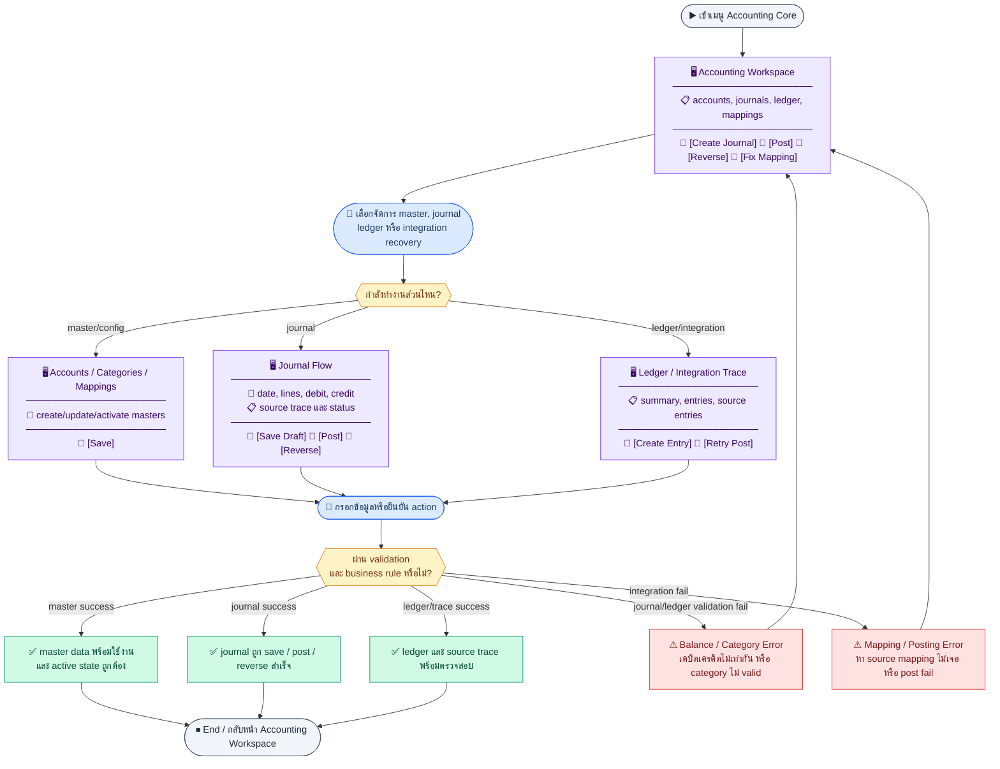
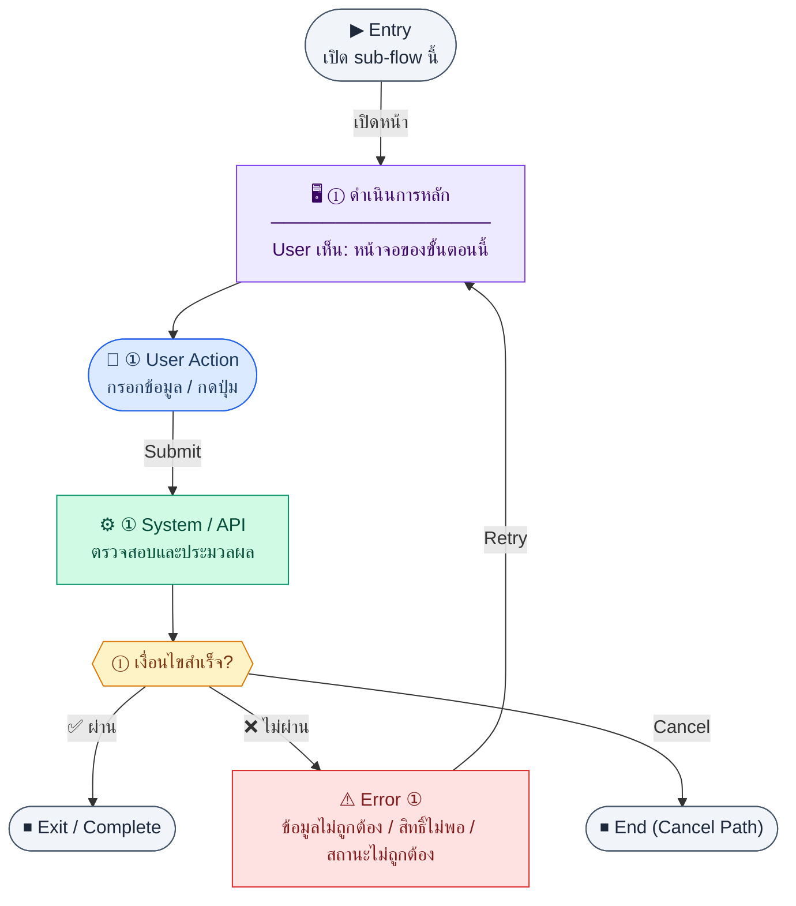
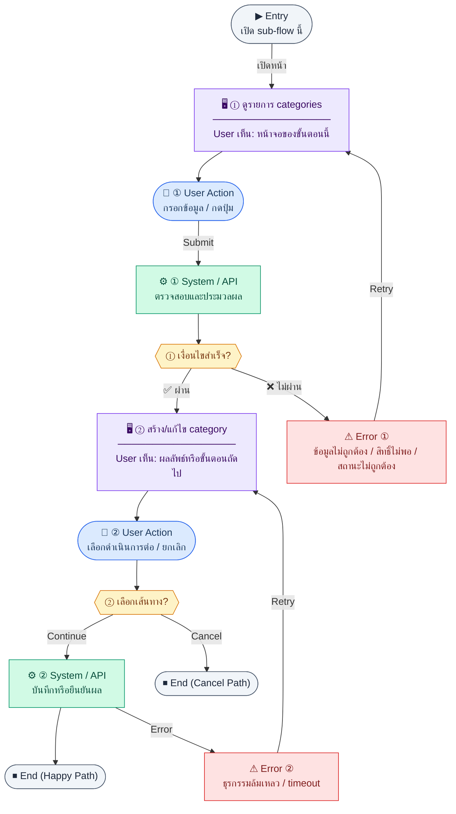
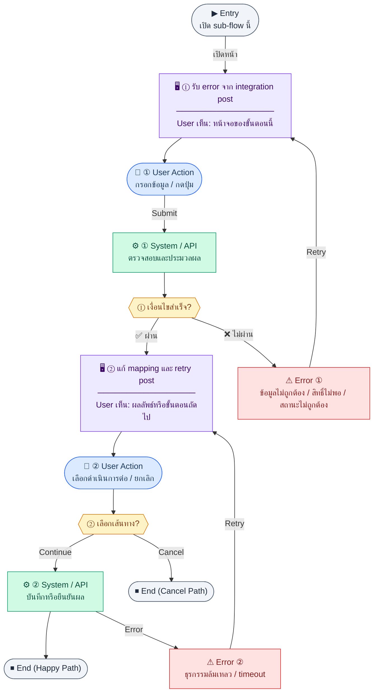

# UX Flow — Finance บัญชีแกนกลาง (ผังบัญชี, Journal, Ledger, Integrations)

เอกสารนี้แบ่ง journey ตามกลุ่ม endpoint ใน `Documents/SD_Flow/Finance/accounting_core.md` ให้ตรวจสอบ coverage แบบ auditable คู่กับ SD และ BR Feature 1.9

**แหล่งอ้างอิงที่ผูกกับเอกสารนี้**

- Business requirement (BR): `Documents/Requirements/Release_1.md` — Feature 1.9 Finance — Accounting Core
- Traceability: `Documents/Requirements/Release_1_traceability_mermaid.md` — Feature 1.9 (`/finance/accounts`, `/finance/journal*`, `/finance/income-expense*`, integrations)
- Sequence / SD_Flow: `Documents/SD_Flow/Finance/accounting_core.md`
- Cross-module triggers (บริบท): `Documents/Requirements/Release_1_traceability_mermaid.md` — INTEGRATION_PAY, INTEGRATION_EXP, INTEGRATION_BUD
- Related screens / mockups: `Documents/UI_Flow_mockup/Page/R1-09_Finance_Accounting_Core/` (`ChartOfAccountsList.md`, `JournalList.md`, `JournalEditor.md`, `IncomeExpenseLedger.md` — preview TBD)

---

## E2E Scenario Flow

> ภาพรวม accounting core ครอบคลุม chart of accounts, manual journals, posting, reversal, income-expense ledger และการ trace/recover cross-module auto-post ผ่าน source mappings และ source entries

### Scenario Summary

| Scenario | ขั้นตอน | ผลลัพธ์ |
|----------|---------|---------|
| ✅ Manage chart of accounts | Open `/finance/accounts` → list/create/update/activate | User manages account masters |
| ✅ Review journal list and detail | Open `/finance/journal` | User inspects journals by status and source module |
| ✅ Create draft journal | Enter lines → save draft | Balanced draft journal is saved with lines |
| ✅ Post journal | Confirm post on draft journal | Journal becomes locked as posted |
| ✅ Reverse posted journal | Trigger reverse on posted journal | System creates linked reversal journal |
| ✅ Maintain income-expense ledger | Open ledger pages or create manual entry | User reviews summaries and adds manual transactions |
| ✅ Auto-post external source to finance | Payroll/PM integration trigger fires | Journal entries are created from configured source mappings |
| ⚠ Recover failed auto-post | Mapping missing or invalid during integration | User is guided to fix mapping and retry posting |

---
## ชื่อ Flow & ขอบเขต

**Flow name:** `Finance — Accounting Core (CoA CRUD-ish, Journal lifecycle, Income/Expense ledger, Integration post & source trace)`

**Actor(s):** `accountant`, `finance_manager`; การกด post จากโมดูลอื่น (HR/PM) อาจทำโดย role ที่ได้รับอนุญาตนั้น ๆ

**Entry:** `/finance/accounts`, `/finance/journal`, `/finance/journal/new`, `/finance/income-expense`, `/finance/income-expense/new` หรือปุ่ม “Post to accounting” จาก workflow อื่น

**Exit:** บัญชีถูกจัดการ, journal draft ถูกสร้าง/post/reverse, รายการ income/expense ถูกบันทึก, หรือ integration post สำเร็จและมี `journalEntryId` สำหรับติดตาม

**Out of scope:** consolidation หลายบริษัท, การปิดงบรายปีแบบเต็มรูปแบบ (นอกขอบเขต BR นี้)

---

## Sub-flow A — ผังบัญชี: รายการ (`GET /api/finance/accounts`)

**Goal:** ดูผังบัญชีทั้งหมดและกรองตามประเภท/สถานะการใช้งาน

**User sees:** ตารางหรือ tree (code, name, type, isActive), ตัวกรอง `type`, `isActive`

**User can do:** กรอง, เปิดสร้าง/แก้ไข, สลับ active

**Frontend behavior:**

- `GET /api/finance/accounts` พร้อม query ตาม SD: `type`, `isActive`
- skeleton ระหว่างโหลด; เก็บ state กรองใน URL

**System / AI behavior:** อ่าน `chart_of_accounts`

**Success:** แสดงรายการครบ

**Error:** 401/403/5xx + retry

**Notes:** `GET /api/finance/accounts` — FE path BR: `/finance/accounts`

---

### Scenario Flow

### สัญลักษณ์ Node (Color Legend)

| สี | Node shape | หมายถึง |
|----|-----------|---------|
| 🟣 ม่วง | สี่เหลี่ยม `["…"]` | **Screen / UI State** |
| 🔵 น้ำเงิน | วงกลม `(["…"])` | **User Action** |
| 🟢 เขียว | สี่เหลี่ยม `["…"]` | **System / API** |
| 🟡 เหลือง | เพชร `{{"…"}}` | **Decision** |
| 🔴 แดง | สี่เหลี่ยม `["…"]` | **Error / Edge case** |
| ⚫ เทา | วงรี `(["…"])` | **Start / End** |

---

## Sub-flow B — ผังบัญชี: สร้าง (`POST /api/finance/accounts`)

**Goal:** เพิ่มบัญชีใหม่ใน CoA

**User sees:** modal หรือ drawer ฟอร์ม: code, name, type (asset | liability | equity | income | expense), parent (ถ้ามีใน product)

**User can do:** กรอกและบันทึก

**Frontend behavior:**

- validate code/name/type บังคับ; ตรวจรูปแบบ code ตามนโยบายบริษัท (client-side)
- `POST /api/finance/accounts` ตัวอย่าง body ตาม SD: `{ "code": "5100", "name": "Salary Expense", "type": "expense" }`

**System / AI behavior:** INSERT `chart_of_accounts`, enforce unique `code`

**Success:** 201 → refresh list

**Error:** 409 duplicate code; 400 validation

**Notes:** `POST /api/finance/accounts`

---

### Scenario Flow

### สัญลักษณ์ Node (Color Legend)

| สี | Node shape | หมายถึง |
|----|-----------|---------|
| 🟣 ม่วง | สี่เหลี่ยม `["…"]` | **Screen / UI State** |
| 🔵 น้ำเงิน | วงกลม `(["…"])` | **User Action** |
| 🟢 เขียว | สี่เหลี่ยม `["…"]` | **System / API** |
| 🟡 เหลือง | เพชร `{{"…"}}` | **Decision** |
| 🔴 แดง | สี่เหลี่ยม `["…"]` | **Error / Edge case** |
| ⚫ เทา | วงรี `(["…"])` | **Start / End** |

---

## Sub-flow C — ผังบัญชี: แก้ไข (`PATCH /api/finance/accounts/:id`)

**Goal:** แก้ไขชื่อหรือ metadata ของบัญชี (ไม่สับสนกับสลับ active)

**User sees:** ฟอร์มแก้ไขบนบัญชีที่เลือก

**User can do:** แก้ไขและบันทึก

**Frontend behavior:** `PATCH /api/finance/accounts/:id` partial fields เช่น `{ "name": "Salary Expense - Updated" }`

**System / AI behavior:** UPDATE แถวที่ระบุ

**Success:** 200

**Error:** 404/400

**Notes:** `PATCH /api/finance/accounts/:id`

---

### Scenario Flow

### สัญลักษณ์ Node (Color Legend)

| สี | Node shape | หมายถึง |
|----|-----------|---------|
| 🟣 ม่วง | สี่เหลี่ยม `["…"]` | **Screen / UI State** |
| 🔵 น้ำเงิน | วงกลม `(["…"])` | **User Action** |
| 🟢 เขียว | สี่เหลี่ยม `["…"]` | **System / API** |
| 🟡 เหลือง | เพชร `{{"…"}}` | **Decision** |
| 🔴 แดง | สี่เหลี่ยม `["…"]` | **Error / Edge case** |
| ⚫ เทา | วงรี `(["…"])` | **Start / End** |

---

## Sub-flow D — ผังบัญชี: เปิด/ปิดใช้งาน (`PATCH /api/finance/accounts/:id/activate`)

**Goal:** ปิดบัญชีที่ไม่ต้องการให้เลือกใน journal โดยไม่ลบประวัติ

**User sees:** toggle isActive

**User can do:** สลับสถานะ

**Frontend behavior:** `PATCH /api/finance/accounts/:id/activate` body ตาม SD `{ "isActive": false }`

**System / AI behavior:** อัปเดต `isActive`

**Success:** 200

**Error:** 400 ถ้าไม่อนุญาตปิด (เช่น มี journal posted ผูก — แล้วแต่ BE)

**Notes:** `PATCH /api/finance/accounts/:id/activate`

---

### Scenario Flow

### สัญลักษณ์ Node (Color Legend)

| สี | Node shape | หมายถึง |
|----|-----------|---------|
| 🟣 ม่วง | สี่เหลี่ยม `["…"]` | **Screen / UI State** |
| 🔵 น้ำเงิน | วงกลม `(["…"])` | **User Action** |
| 🟢 เขียว | สี่เหลี่ยม `["…"]` | **System / API** |
| 🟡 เหลือง | เพชร `{{"…"}}` | **Decision** |
| 🔴 แดง | สี่เหลี่ยม `["…"]` | **Error / Edge case** |
| ⚫ เทา | วงรี `(["…"])` | **Start / End** |

---

## Sub-flow E — Journal: รายการ (`GET /api/finance/journal-entries`)

**Goal:** ค้นหา journal ตามสถานะและแหล่งที่มา (manual / hr / pm)

**User sees:** ตาราง (entryNo, date, description, status, sourceModule, sourceType), ตัวกรอง

**User can do:** กรอง `status`, `sourceModule`, pagination `page`, `limit`, เปิดรายละเอียด, ปุ่มสร้างใหม่

**Frontend behavior:**

- `GET /api/finance/journal-entries` พร้อม query ตาม SD: `page`, `limit`, `status`, `sourceModule`
- แสดง badge `draft` vs `posted`; disabled ปุ่ม edit/post ตามสถานะ

**System / AI behavior:** list `journal_entries`

**Success:** ตาราง sync กับ server

**Error:** fetch fail + retry

**Notes:** `GET /api/finance/journal-entries` — `/finance/journal`

---

### Scenario Flow

### สัญลักษณ์ Node (Color Legend)

| สี | Node shape | หมายถึง |
|----|-----------|---------|
| 🟣 ม่วง | สี่เหลี่ยม `["…"]` | **Screen / UI State** |
| 🔵 น้ำเงิน | วงกลม `(["…"])` | **User Action** |
| 🟢 เขียว | สี่เหลี่ยม `["…"]` | **System / API** |
| 🟡 เหลือง | เพชร `{{"…"}}` | **Decision** |
| 🔴 แดง | สี่เหลี่ยม `["…"]` | **Error / Edge case** |
| ⚫ เทา | วงรี `(["…"])` | **Start / End** |

---

## Sub-flow F — Journal: รายละเอียด + รายการบรรทัด (`GET /api/finance/journal-entries/:id`)

**Goal:** ตรวจสอบความสมดุล debit/credit และรายละเอียดก่อน post หรือ reverse

**User sees:** header + ตาราง lines (account, debit, credit, description), ลิงก์ไป source document (ถ้ามี sourceModule/sourceId)

**User can do:** อ่าน, กด post (ถ้า draft), กด reverse (ถ้า posted)

**Frontend behavior:**

- `GET /api/finance/journal-entries/:id`
- คำนวณผลรวม debit/credit ฝั่ง FE เพื่อแสดง warning ก่อนยิง post (ช่วย UX; ข้อยุติที่ server เป็นหลัก)

**System / AI behavior:** คืน entry + lines

**Success:** แสดงครบ

**Error:** 404/403

**Notes:** `GET /api/finance/journal-entries/:id`

---

### Scenario Flow

### สัญลักษณ์ Node (Color Legend)

| สี | Node shape | หมายถึง |
|----|-----------|---------|
| 🟣 ม่วง | สี่เหลี่ยม `["…"]` | **Screen / UI State** |
| 🔵 น้ำเงิน | วงกลม `(["…"])` | **User Action** |
| 🟢 เขียว | สี่เหลี่ยม `["…"]` | **System / API** |
| 🟡 เหลือง | เพชร `{{"…"}}` | **Decision** |
| 🔴 แดง | สี่เหลี่ยม `["…"]` | **Error / Edge case** |
| ⚫ เทา | วงรี `(["…"])` | **Start / End** |

---

## Sub-flow G — Journal: สร้าง draft (`POST /api/finance/journal-entries`)

**Goal:** บันทึกรายการบัญชีแบบ manual ในสถานะ draft

**User sees:** `/finance/journal/new` — ฟอร์มวันที่, คำอธิบาย, ตารางหลายบรรทัด (account, debit, credit, description)

**User can do:** เพิ่ม/ลบบรรทัด, กดบันทึก draft

**Frontend behavior:**

- validate แต่ละบรรทัด: debit หรือ credit อย่างใดอย่างหนึ่ง > 0 (ไม่ใส่ทั้งคู่ในบรรทัดเดียวตาม convention)
- validate รวม: `SUM(debit) === SUM(credit)` ก่อนอนุญาตกด Post (BR)
- `POST /api/finance/journal-entries` body ตาม SD: `{ "date": "2026-04-30", "description": "Month-end adjustment", "lines": [] }`
- หลัง 201 navigate ไป detail ของ id ใหม่

**System / AI behavior:** INSERT `journal_entries` + `journal_lines`, status `draft`

**Success:** 201 + id

**Error:** 400 unbalanced / invalid accountId

**Notes:** `POST /api/finance/journal-entries`

---

### Scenario Flow

### สัญลักษณ์ Node (Color Legend)

| สี | Node shape | หมายถึง |
|----|-----------|---------|
| 🟣 ม่วง | สี่เหลี่ยม `["…"]` | **Screen / UI State** |
| 🔵 น้ำเงิน | วงกลม `(["…"])` | **User Action** |
| 🟢 เขียว | สี่เหลี่ยม `["…"]` | **System / API** |
| 🟡 เหลือง | เพชร `{{"…"}}` | **Decision** |
| 🔴 แดง | สี่เหลี่ยม `["…"]` | **Error / Edge case** |
| ⚫ เทา | วงรี `(["…"])` | **Start / End** |

---

## Sub-flow H — Journal: Post (`POST /api/finance/journal-entries/:id/post`)

**Goal:** ล็อกรายการลงบัญชี — ไม่แก้ไขได้อีกยกเว้น reverse

**User sees:** ปุ่ม “Post” บน draft, confirm dialog อธิบายผลล็อก

**User can do:** ยืนยัน post

**Frontend behavior:**

- `POST /api/finance/journal-entries/:id/post` body `{}` ตาม SD
- loading บนปุ่ม; ห้าม double-click
- ถ้า API ตอบ 400 `ยังไม่สมดุล` ให้แสดง inline summary:
  - `Debit รวม: {x} | Credit รวม: {y} | ต่างกัน {abs(x-y)} ฝั่ง {debit|credit}`
- คง dialog/context เดิมไว้และแสดงปุ่ม `กลับไปแก้ไขรายการ` เพื่อ scroll ไปตาราง journal lines
- highlight บรรทัดที่น่าสงสัย (เช่น debit/credit ว่างทั้งคู่ หรือยอดผิดด้าน) ด้วย warning state
- เมื่อผู้ใช้แก้บรรทัด ให้ re-evaluate balance indicator แบบทันทีทุกครั้งที่ค่าเปลี่ยน

**System / AI behavior:** อัปเดต status `posted`, บันทึก postedAt/postedBy

**Success:** 200, refresh `GET .../:id`, ซ่อนปุ่มแก้ไข

**Error:** 400 ยังไม่สมดุล (พร้อมแสดง diff ที่ขาด/เกิน); 403; 409 ถ้า post ซ้ำ

**Notes:** `POST /api/finance/journal-entries/:id/post` — BR: posted แก้ไขไม่ได้; FE pre-check `SUM(debit) === SUM(credit)` ช่วยลดโอกาสเจอ 400 แต่ server validation เป็น source of truth

---

### Scenario Flow

### สัญลักษณ์ Node (Color Legend)

| สี | Node shape | หมายถึง |
|----|-----------|---------|
| 🟣 ม่วง | สี่เหลี่ยม `["…"]` | **Screen / UI State** |
| 🔵 น้ำเงิน | วงกลม `(["…"])` | **User Action** |
| 🟢 เขียว | สี่เหลี่ยม `["…"]` | **System / API** |
| 🟡 เหลือง | เพชร `{{"…"}}` | **Decision** |
| 🔴 แดง | สี่เหลี่ยม `["…"]` | **Error / Edge case** |
| ⚫ เทา | วงรี `(["…"])` | **Start / End** |

---

## Sub-flow I — Journal: Reverse (`POST /api/finance/journal-entries/:id/reverse`)

**Goal:** สร้างรายการกลับด้านเพื่อยกเลิกผลของ journal ที่ post แล้ว

**User sees:** ปุ่ม “Reverse” เฉพาะเมื่อ posted, confirm แรง

**User can do:** ยืนยัน

**Frontend behavior:**

- `POST /api/finance/journal-entries/:id/reverse`
- คาดหวัง 201 พร้อม `id` ของ reversal entry ตาม SD — navigate หรือแสดงลิงก์ไป entry ใหม่

**System / AI behavior:** สร้าง entry ใหม่ flip debit/credit, link `reversedBy`

**Success:** 201 + แสดง entry ใหม่

**Error:** 400 ถ้า reverse ไม่ได้ (เช่น reversed แล้ว)

**Notes:** `POST /api/finance/journal-entries/:id/reverse`

---

### Scenario Flow

### สัญลักษณ์ Node (Color Legend)

| สี | Node shape | หมายถึง |
|----|-----------|---------|
| 🟣 ม่วง | สี่เหลี่ยม `["…"]` | **Screen / UI State** |
| 🔵 น้ำเงิน | วงกลม `(["…"])` | **User Action** |
| 🟢 เขียว | สี่เหลี่ยม `["…"]` | **System / API** |
| 🟡 เหลือง | เพชร `{{"…"}}` | **Decision** |
| 🔴 แดง | สี่เหลี่ยม `["…"]` | **Error / Edge case** |
| ⚫ เทา | วงรี `(["…"])` | **Start / End** |

---

## Sub-flow J — Income/Expense: สรุป (`GET /api/finance/income-expense/summary`)

**Goal:** ดูภาพรวมรายรับรายจ่ายตามช่วงเวลา (monthly summary ตาม BR)

**User sees:** การ์ดสรุปหรือกราฟย่อบนหน้า `/finance/income-expense`

**User can do:** เลือกช่วง `periodFrom`, `periodTo` (YYYY-MM ตาม BR pattern ของรายงาน)

**Frontend behavior:** `GET /api/finance/income-expense/summary?periodFrom=...&periodTo=...`

**System / AI behavior:** aggregate `income_expense_entries`

**Success:** การ์ดแสดงตัวเลขสอดคล้อง API

**Error:** invalid range 400; retry 5xx

**Notes:** `GET /api/finance/income-expense/summary`

---

### Scenario Flow

### สัญลักษณ์ Node (Color Legend)

| สี | Node shape | หมายถึง |
|----|-----------|---------|
| 🟣 ม่วง | สี่เหลี่ยม `["…"]` | **Screen / UI State** |
| 🔵 น้ำเงิน | วงกลม `(["…"])` | **User Action** |
| 🟢 เขียว | สี่เหลี่ยม `["…"]` | **System / API** |
| 🟡 เหลือง | เพชร `{{"…"}}` | **Decision** |
| 🔴 แดง | สี่เหลี่ยม `["…"]` | **Error / Edge case** |
| ⚫ เทา | วงรี `(["…"])` | **Start / End** |

---

## Sub-flow K — Income/Expense: รายการ (`GET /api/finance/income-expense/entries`)

**Goal:** ดู ledger รายรับรายจ่ายแบบรายการพร้อมกรอง

**User sees:** ตาราง entries, ตัวกรอง `type`, `categoryId`, pagination

**User can do:** กรอง, เปิดสร้างรายการ manual

**Frontend behavior:** `GET /api/finance/income-expense/entries` query: `page`, `limit`, `type`, `categoryId`

**System / AI behavior:** SELECT entries

**Success:** ตาราง sync

**Error:** fetch fail + retry

**Notes:** `GET /api/finance/income-expense/entries`

---

### Scenario Flow

### สัญลักษณ์ Node (Color Legend)

| สี | Node shape | หมายถึง |
|----|-----------|---------|
| 🟣 ม่วง | สี่เหลี่ยม `["…"]` | **Screen / UI State** |
| 🔵 น้ำเงิน | วงกลม `(["…"])` | **User Action** |
| 🟢 เขียว | สี่เหลี่ยม `["…"]` | **System / API** |
| 🟡 เหลือง | เพชร `{{"…"}}` | **Decision** |
| 🔴 แดง | สี่เหลี่ยม `["…"]` | **Error / Edge case** |
| ⚫ เทา | วงรี `(["…"])` | **Start / End** |

---

## Sub-flow L — Income/Expense: สร้างรายการ manual (`POST /api/finance/income-expense/entries`)

**Goal:** บันทึกรายรับ/จ่ายที่ไม่ได้มาจาก integration

**User sees:** `/finance/income-expense/new` — category, date, amount, side (debit|credit), description

**User can do:** กรอกและบันทึก

**Frontend behavior:**

- โหลดรายการ categories ที่ใช้งานได้ (แหล่งข้อมูลอาจมาจาก seed หรือ endpoint อื่นในระบบจริง — ไม่อยู่ใน accounting_core inventory; ระบุใน Notes)
- `POST /api/finance/income-expense/entries` ตัวอย่าง SD: `{ "categoryId": "cat_001", "date": "2026-04-25", "amount": 1500, "side": "debit" }`

**System / AI behavior:** INSERT `income_expense_entries`

**Success:** 201

**Error:** 400 validation

**Notes:** `POST /api/finance/income-expense/entries`

---

### Scenario Flow

### สัญลักษณ์ Node (Color Legend)

| สี | Node shape | หมายถึง |
|----|-----------|---------|
| 🟣 ม่วง | สี่เหลี่ยม `["…"]` | **Screen / UI State** |
| 🔵 น้ำเงิน | วงกลม `(["…"])` | **User Action** |
| 🟢 เขียว | สี่เหลี่ยม `["…"]` | **System / API** |
| 🟡 เหลือง | เพชร `{{"…"}}` | **Decision** |
| 🔴 แดง | สี่เหลี่ยม `["…"]` | **Error / Edge case** |
| ⚫ เทา | วงรี `(["…"])` | **Start / End** |

---

## Sub-flow M — Integration: Post payroll (`POST /api/finance/integrations/payroll/:runId/post`)

**Goal:** หลัง HR mark-paid ให้สร้าง journal จาก payroll run (รวม Gap B ตาม BR)

**User sees:** ในบริบท HR หรือ Finance — ปุ่ม/trigger “Post to GL” หรือทำอัตโนมัติหลัง mark-paid (ตาม product); ผลลัพธ์แสดง `journalEntryId`

**User can do:** ยืนยัน (ถ้าเป็น manual trigger)

**Frontend behavior:**

- `POST /api/finance/integrations/payroll/:runId/post` ไม่มี body `{}`
- แสดง progress ยาว (อาจเป็น async — ถ้า BE ใช้ job ให้มี polling หรือ toast เมื่อเสร็จ)

**System / AI behavior:** อ่าน `finance_source_mappings`, สร้าง JE (บรรทัดเงินเดือน + SS employer ตาม BR Gap B)

**Success:** 201 + `journalEntryId` — ลิงก์ไป `/finance/journal` detail

**Error:** 400/422 เมื่อไม่มี mapping (BR: auto-post fail พร้อม error message); 403

**Notes:** `POST /api/finance/integrations/payroll/:runId/post`

---

### Scenario Flow

### สัญลักษณ์ Node (Color Legend)

| สี | Node shape | หมายถึง |
|----|-----------|---------|
| 🟣 ม่วง | สี่เหลี่ยม `["…"]` | **Screen / UI State** |
| 🔵 น้ำเงิน | วงกลม `(["…"])` | **User Action** |
| 🟢 เขียว | สี่เหลี่ยม `["…"]` | **System / API** |
| 🟡 เหลือง | เพชร `{{"…"}}` | **Decision** |
| 🔴 แดง | สี่เหลี่ยม `["…"]` | **Error / Edge case** |
| ⚫ เทา | วงรี `(["…"])` | **Start / End** |

---

## Sub-flow N — Integration: Post PM expense (`POST /api/finance/integrations/pm-expenses/:expenseId/post`)

**Goal:** เมื่อ PM expense ได้รับการอนุมัติ ให้ post DR Project Expense / CR AP

**User sees:** ใน PM expense หลัง approve — สถานะ integration หรือใน Finance journal list ปรากฏ source

**User can do:** (ถ้า manual) กด post; (ถ้า auto) รอผล

**Frontend behavior:** `POST /api/finance/integrations/pm-expenses/:expenseId/post`

**System / AI behavior:** สร้าง JE จาก mapping

**Success:** 201 + journal id

**Error:** mapping หาย → ข้อความชัดเจนจาก API

**Notes:** `POST /api/finance/integrations/pm-expenses/:expenseId/post`

---

### Scenario Flow

### สัญลักษณ์ Node (Color Legend)

| สี | Node shape | หมายถึง |
|----|-----------|---------|
| 🟣 ม่วง | สี่เหลี่ยม `["…"]` | **Screen / UI State** |
| 🔵 น้ำเงิน | วงกลม `(["…"])` | **User Action** |
| 🟢 เขียว | สี่เหลี่ยม `["…"]` | **System / API** |
| 🟡 เหลือง | เพชร `{{"…"}}` | **Decision** |
| 🔴 แดง | สี่เหลี่ยม `["…"]` | **Error / Edge case** |
| ⚫ เทา | วงรี `(["…"])` | **Start / End** |

---

## Sub-flow O — Integration: Post budget adjustment (`POST /api/finance/integrations/pm-budgets/:budgetId/post-adjustment`)

**Goal:** บันทึกการปรับงบ PM ลง GL

**User sees:** จาก workflow PM budget adjustment

**User can do:** ยืนยัน post

**Frontend behavior:** `POST /api/finance/integrations/pm-budgets/:budgetId/post-adjustment`

**System / AI behavior:** สร้าง JE ตาม mapping

**Success:** 201

**Error:** 4xx/5xx ตามสัญญา API

**Notes:** `POST /api/finance/integrations/pm-budgets/:budgetId/post-adjustment`

---

### Scenario Flow

### สัญลักษณ์ Node (Color Legend)

| สี | Node shape | หมายถึง |
|----|-----------|---------|
| 🟣 ม่วง | สี่เหลี่ยม `["…"]` | **Screen / UI State** |
| 🔵 น้ำเงิน | วงกลม `(["…"])` | **User Action** |
| 🟢 เขียว | สี่เหลี่ยม `["…"]` | **System / API** |
| 🟡 เหลือง | เพชร `{{"…"}}` | **Decision** |
| 🔴 แดง | สี่เหลี่ยม `["…"]` | **Error / Edge case** |
| ⚫ เทา | วงรี `(["…"])` | **Start / End** |

---

## Sub-flow P — Source tracing (`GET /api/finance/integrations/sources/:module/:sourceId/entries`)

**Goal:** จากเอกสารต้นทาง (module + sourceId) ดูว่าเกิด journal / income-expense entries ใดบ้าง

**User sees:** ใน `/finance/journal` — ลิงก์ “View source entries” หรือแผงข้างที่แสดงรายการที่เกี่ยวข้อง

**User can do:** เปิด trace panel

**Frontend behavior:**

- `GET /api/finance/integrations/sources/:module/:sourceId/entries` (path params ตาม SD)
- แสดงตารางผลลัพธ์ + ลิงก์ไป `GET /api/finance/journal-entries/:id` เมื่อเป็น journal

**System / AI behavior:** query entries by source

**Success:** 200 และรายการครบ

**Error:** 404 ไม่พบ source; 403

**Notes:** `GET /api/finance/integrations/sources/:module/:sourceId/entries`

---

### Scenario Flow

### สัญลักษณ์ Node (Color Legend)

| สี | Node shape | หมายถึง |
|----|-----------|---------|
| 🟣 ม่วง | สี่เหลี่ยม `["…"]` | **Screen / UI State** |
| 🔵 น้ำเงิน | วงกลม `(["…"])` | **User Action** |
| 🟢 เขียว | สี่เหลี่ยม `["…"]` | **System / API** |
| 🟡 เหลือง | เพชร `{{"…"}}` | **Decision** |
| 🔴 แดง | สี่เหลี่ยม `["…"]` | **Error / Edge case** |
| ⚫ เทา | วงรี `(["…"])` | **Start / End** |

---

## Sub-flow Q — Source Mappings Config

### Scenario Flow

### สัญลักษณ์ Node (Color Legend)

| สี | Node shape | หมายถึง |
|----|-----------|---------|
| 🟣 ม่วง | สี่เหลี่ยม `["…"]` | **Screen / UI State** |
| 🔵 น้ำเงิน | วงกลม `(["…"])` | **User Action** |
| 🟢 เขียว | สี่เหลี่ยม `["…"]` | **System / API** |
| 🟡 เหลือง | เพชร `{{"…"}}` | **Decision** |
| 🔴 แดง | สี่เหลี่ยม `["…"]` | **Error / Edge case** |
| ⚫ เทา | วงรี `(["…"])` | **Start / End** |

---

### Step Q1 — ดูรายการ mappings

**Goal:** ให้ Finance admin ตรวจว่าแต่ละ source module/type มี account pair พร้อมใช้

**User sees:** ตาราง `sourceModule`, `sourceType`, debit account, credit account, isActive

**User can do:** filter ตาม module/type, เปิดฟอร์มสร้าง/แก้, toggle active

**User Action:**
- ประเภท: `เลือกตัวเลือก / กดปุ่ม`
- ช่องที่ใช้กรอง/ดูข้อมูล:
  - `sourceModule` *(optional)* : กรองตามแหล่งที่มา เช่น payroll, pm_expense
  - `sourceType` *(optional)* : กรองตามเอกสารย่อย
  - `isActive` *(optional)* : กรองสถานะ mapping (`true`/`false`)
- ปุ่ม / Controls ในหน้านี้:
  - `[Add Mapping]` → เปิดฟอร์มสร้าง
  - `[Edit]` → แก้ mapping แถวที่เลือก
  - `[Toggle Active]` → เปิด/ปิด mapping

**Frontend behavior:** `GET /api/finance/config/source-mappings`

**System / AI behavior:** อ่าน `finance_source_mappings`

**Success:** มองเห็น coverage ของ mapping ทั้งระบบ

**Error:** load fail + retry

**Notes:** หน้าแนะนำ path `/finance/settings/source-mappings`

### Step Q2 — สร้าง/แก้ไข mapping

**Goal:** แก้ missing mapping โดยไม่ต้องแก้ DB ตรง

**User sees:** form `sourceModule`, `sourceType`, `debitAccountId`, `creditAccountId`, `description`

**User can do:** create หรือ update

**User Action:**
- ประเภท: `กรอกข้อมูล / เลือกตัวเลือก`
- ช่องที่ต้องกรอก:
  - `sourceModule` *(required)* : โมดูลต้นทาง
  - `sourceType` *(required)* : ประเภทธุรกรรมต้นทาง
  - `debitAccountId` *(required)* : บัญชีเดบิต
  - `creditAccountId` *(required)* : บัญชีเครดิต
  - `description` *(optional)* : คำอธิบาย mapping
- ปุ่ม / Controls ในหน้านี้:
  - `[Save Mapping]` → สร้างหรือแก้ไข mapping
  - `[Cancel]` → ปิดฟอร์มโดยไม่บันทึก

**Frontend behavior:**

- สร้าง: `POST /api/finance/config/source-mappings`
- แก้ไข: `PATCH /api/finance/config/source-mappings/:id`

**System / AI behavior:** validate account pair ถูกต้องและไม่ซ้ำ key หลัก

**Success:** 201/200 และ refresh list

**Error:** 409 duplicate mapping key, 422 invalid account

**Notes:** หลังแก้ mapping ควร retry auto-post flow ที่ fail ได้ทันที

### Step Q3 — เปิด/ปิด mapping

**Goal:** หยุดใช้งาน mapping เก่าแต่ยังเก็บประวัติ

**User sees:** toggle active พร้อมคำเตือนผลกระทบ

**User can do:** activate/deactivate

**User Action:**
- ประเภท: `กดปุ่ม`
- ข้อมูลที่จะส่ง:
  - `isActive` *(required)* : สถานะใหม่ของ mapping
- ปุ่ม / Controls ในหน้านี้:
  - `[Confirm Toggle]` → เปิด/ปิดการใช้งาน mapping
  - `[Cancel]` → ยกเลิก

**Frontend behavior:** `PATCH /api/finance/config/source-mappings/:id/activate`

**System / AI behavior:** update mapping status

**Success:** status เปลี่ยนตามต้องการ

**Error:** 409 ถ้ามีกฎห้ามปิด mapping default ของระบบ

**Notes:** ถ้าปิด mapping ที่กำลังถูกเรียกโดย integration จะเกิด error ที่ชี้กลับมาหน้านี้

---

## Sub-flow R — Income/Expense Categories Config

### Scenario Flow

### สัญลักษณ์ Node (Color Legend)

| สี | Node shape | หมายถึง |
|----|-----------|---------|
| 🟣 ม่วง | สี่เหลี่ยม `["…"]` | **Screen / UI State** |
| 🔵 น้ำเงิน | วงกลม `(["…"])` | **User Action** |
| 🟢 เขียว | สี่เหลี่ยม `["…"]` | **System / API** |
| 🟡 เหลือง | เพชร `{{"…"}}` | **Decision** |
| 🔴 แดง | สี่เหลี่ยม `["…"]` | **Error / Edge case** |
| ⚫ เทา | วงรี `(["…"])` | **Start / End** |

---

### Step R1 — ดูรายการ categories

**Goal:** ให้ source เดียวของ `categoryId` สำหรับ manual entry และรายงาน

**User sees:** ตาราง category name, type, accountCode, isActive

**User can do:** filter type/inactive, สร้าง/แก้ไข/activate

**User Action:**
- ประเภท: `เลือกตัวเลือก / กดปุ่ม`
- ช่องที่ใช้กรอง/ดูข้อมูล:
  - `type` *(optional)* : แยก `income` หรือ `expense`
  - `isActive` *(optional)* : กรองสถานะ category (`true`/`false`)
- ปุ่ม / Controls ในหน้านี้:
  - `[Add Category]` → เปิดฟอร์มสร้าง
  - `[Edit]` → แก้ category แถวที่เลือก
  - `[Toggle Active]` → เปิด/ปิด category

**Frontend behavior:** `GET /api/finance/income-expense/categories`

**System / AI behavior:** อ่าน `income_expense_categories`

**Success:** category พร้อมใช้งานใน form manual entry

**Error:** fetch fail + retry

**Notes:** หน้าแนะนำ path `/finance/settings/categories`

### Step R2 — สร้าง/แก้ไข category

**Goal:** จัดการหมวดรายรับ/รายจ่ายและ mapping กับ GL account

**User sees:** form `name`, `type`, `accountCode`

**User can do:** create หรือ edit

**User Action:**
- ประเภท: `กรอกข้อมูล / เลือกตัวเลือก`
- ช่องที่ต้องกรอก:
  - `name` *(required)* : ชื่อหมวดหมู่
  - `type` *(required)* : ประเภทรายรับหรือรายจ่าย
  - `accountCode` หรือ `accountId` *(required)* : บัญชี GL ที่ผูก
- ปุ่ม / Controls ในหน้านี้:
  - `[Save Category]` → สร้างหรือแก้ไข category
  - `[Cancel]` → ปิดฟอร์ม

**Frontend behavior:**

- สร้าง: `POST /api/finance/income-expense/categories`
- แก้ไข: `PATCH /api/finance/income-expense/categories/:id`

**System / AI behavior:** validate accountCode มีอยู่จริงใน CoA

**Success:** 201/200

**Error:** 409 duplicate name ภายใต้ type เดียวกัน (ถ้า BE enforce)

**Notes:** category ใหม่ต้องโผล่ใน `/finance/income-expense/new` โดยไม่ต้อง seed

### Step R3 — เปิด/ปิด category

**Goal:** ปิด category ที่เลิกใช้โดยไม่กระทบ historical entries

**User sees:** toggle isActive + warning

**User can do:** activate/deactivate

**User Action:**
- ประเภท: `กดปุ่ม`
- ข้อมูลที่จะส่ง:
  - `isActive` *(required)* : สถานะใหม่หลัง toggle
- ปุ่ม / Controls ในหน้านี้:
  - `[Confirm Toggle]` → เปิด/ปิด category
  - `[Cancel]` → ยกเลิก

**Frontend behavior:** `PATCH /api/finance/income-expense/categories/:id/activate`

**System / AI behavior:** update `isActive`

**Success:** แถวอัปเดตสถานะ

**Error:** 409 ถ้ามีกฎห้ามปิด category ที่ใช้เป็น default

**Notes:** manual entry form ต้องดึงเฉพาะ active categories

---

## Sub-flow S — Error Recovery: Auto-Post Missing Mapping

### Scenario Flow

### สัญลักษณ์ Node (Color Legend)

| สี | Node shape | หมายถึง |
|----|-----------|---------|
| 🟣 ม่วง | สี่เหลี่ยม `["…"]` | **Screen / UI State** |
| 🔵 น้ำเงิน | วงกลม `(["…"])` | **User Action** |
| 🟢 เขียว | สี่เหลี่ยม `["…"]` | **System / API** |
| 🟡 เหลือง | เพชร `{{"…"}}` | **Decision** |
| 🔴 แดง | สี่เหลี่ยม `["…"]` | **Error / Edge case** |
| ⚫ เทา | วงรี `(["…"])` | **Start / End** |

---

### Step S1 — รับ error จาก integration post

**Goal:** ให้ผู้ใช้แก้ปัญหาได้ทันทีเมื่อ auto-post หา mapping ไม่เจอ

**User sees:** error banner เช่น `SOURCE_MAPPING_NOT_FOUND` พร้อมค่า `sourceModule/sourceType`

**User can do:** กด deep link ไปหน้าตั้งค่า mapping

**User Action:**
- ประเภท: `กดปุ่ม`
- ข้อมูลที่ใช้:
  - `sourceModule` *(required from error payload)* : โมดูลต้นทางที่หา mapping ไม่เจอ
  - `sourceType` *(required from error payload)* : ชนิดเอกสารต้นทาง
- ปุ่ม / Controls ในหน้านี้:
  - `[Open Source Mappings]` → deep link ไปหน้าตั้งค่า mapping
  - `[Copy Error Details]` → คัดลอก payload ไปแจ้งทีมที่เกี่ยวข้อง

**Frontend behavior:** จาก `POST /api/finance/integrations/*/post` แสดง actionable error + link `/finance/settings/source-mappings`

**System / AI behavior:** ส่ง error payload ที่ระบุ source key ชัดเจน

**Success:** ผู้ใช้รู้จุดที่ต้องแก้

**Error:** ถ้า payload ไม่ครบ ให้ fallback ข้อความ generic และให้ contact admin

**Notes:** ปิด dead end “mark-paid แล้วติด auto-post แต่แก้เองไม่ได้”

### Step S2 — แก้ mapping และ retry post

**Goal:** ปิดลูป fail -> configure -> retry ได้ใน UI เดียว

**User sees:** สถานะล่าสุดของ source document หลัง retry

**User can do:** กลับไปกด post อีกครั้ง

**User Action:**
- ประเภท: `กดปุ่ม`
- ปุ่ม / Controls ในหน้านี้:
  - `[Retry Post]` → เรียก endpoint post เดิมอีกครั้งหลังแก้ mapping
  - `[View Journal Entry]` → เปิดรายการบัญชีเมื่อ retry สำเร็จ
  - `[Back to Source Document]` → กลับไปเอกสารต้นทางถ้ายังไม่พร้อม retry

**Frontend behavior:** หลังบันทึก mapping เรียก endpoint post เดิมซ้ำ และ refresh source entries (`GET /api/finance/integrations/sources/:module/:sourceId/entries`)

**System / AI behavior:** สร้าง journal สำเร็จเมื่อ mapping พร้อม

**Success:** ได้ `journalEntryId` และ trace ได้

**Error:** ยัง fail ให้คงรายละเอียด error ล่าสุด

**Notes:** flow นี้ใช้ได้กับ payroll/pm-expense/pm-budget post

---

## Coverage Checklist

| Endpoint | Covered in UX file | Notes |
|----------|-------------------|-------|
| `GET /api/finance/accounts` | Sub-flow A — ผังบัญชี: รายการ | `Documents/SD_Flow/Finance/accounting_core.md` |
| `POST /api/finance/accounts` | Sub-flow B — ผังบัญชี: สร้าง | `Documents/SD_Flow/Finance/accounting_core.md` |
| `PATCH /api/finance/accounts/:id` | Sub-flow C — ผังบัญชี: แก้ไข | `Documents/SD_Flow/Finance/accounting_core.md` |
| `PATCH /api/finance/accounts/:id/activate` | Sub-flow D — ผังบัญชี: เปิด/ปิดใช้งาน | `Documents/SD_Flow/Finance/accounting_core.md` |
| `GET /api/finance/journal-entries` | Sub-flow E — Journal: รายการ | `Documents/SD_Flow/Finance/accounting_core.md` |
| `GET /api/finance/journal-entries/:id` | Sub-flow F — Journal: รายละเอียด + รายการบรรทัด | `Documents/SD_Flow/Finance/accounting_core.md` |
| `POST /api/finance/journal-entries` | Sub-flow G — Journal: สร้าง draft | `Documents/SD_Flow/Finance/accounting_core.md` |
| `POST /api/finance/journal-entries/:id/post` | Sub-flow H — Journal: Post | `Documents/SD_Flow/Finance/accounting_core.md` |
| `POST /api/finance/journal-entries/:id/reverse` | Sub-flow I — Journal: Reverse | `Documents/SD_Flow/Finance/accounting_core.md` |
| `GET /api/finance/income-expense/summary` | Sub-flow J — Income/Expense: สรุป | `Documents/SD_Flow/Finance/accounting_core.md` |
| `GET /api/finance/income-expense/entries` | Sub-flow K — Income/Expense: รายการ | `Documents/SD_Flow/Finance/accounting_core.md` |
| `POST /api/finance/income-expense/entries` | Sub-flow L — Income/Expense: สร้างรายการ manual | `Documents/SD_Flow/Finance/accounting_core.md`; Sub-flow L Notes — categories อาจมาจากแหล่งอื่นนอก inventory นี้ |
| `POST /api/finance/integrations/payroll/:runId/post` | Sub-flow M — Integration: Post payroll | `Documents/SD_Flow/Finance/accounting_core.md`; integration trigger from HR / traceability |
| `POST /api/finance/integrations/pm-expenses/:expenseId/post` | Sub-flow N — Integration: Post PM expense | `Documents/SD_Flow/Finance/accounting_core.md`; integration trigger from PM |
| `POST /api/finance/integrations/pm-budgets/:budgetId/post-adjustment` | Sub-flow O — Integration: Post budget adjustment | `Documents/SD_Flow/Finance/accounting_core.md`; integration trigger from PM |
| `GET /api/finance/integrations/sources/:module/:sourceId/entries` | Sub-flow P — Source tracing | `Documents/SD_Flow/Finance/accounting_core.md` |
| `GET /api/finance/config/source-mappings` | Sub-flow Q, Step Q1 | Mapping list and filter |
| `POST /api/finance/config/source-mappings` | Sub-flow Q, Step Q2 | Create mapping |
| `PATCH /api/finance/config/source-mappings/:id` | Sub-flow Q, Step Q2 | Update mapping |
| `PATCH /api/finance/config/source-mappings/:id/activate` | Sub-flow Q, Step Q3 | Toggle mapping active state |
| `GET /api/finance/income-expense/categories` | Sub-flow R, Step R1 | Category source for filters/forms |
| `POST /api/finance/income-expense/categories` | Sub-flow R, Step R2 | Create category |
| `PATCH /api/finance/income-expense/categories/:id` | Sub-flow R, Step R2 | Update category |
| `PATCH /api/finance/income-expense/categories/:id/activate` | Sub-flow R, Step R3 | Toggle category active state |

## Selector / Display Field Matrix (2026-04-16)

ส่วนนี้ใช้ล็อก option sources, read-model ขั้นต่ำ และ field dependencies ที่หน้า accounting core ต้องถือร่วมกัน

### Accounts / Categories

| UX surface | Fields / controls ที่ต้องเห็น | Source / UX rule |
| --- | --- | --- |
| CoA list / picker (`GET /api/finance/accounts`) | `id`, `code`, `name`, `type`, `isActive`, `parentId` | ถ้าใช้เป็น picker ให้ reuse endpoint เดียวกันและ filter `isActive=true`; ห้าม hardcode account labels ในฟอร์ม journal, mapping, หรือ category |
| Income/expense categories list / picker (`GET /api/finance/income-expense/categories`) | `id`, `name`, `type`, `accountCode`, `isActive` | manual entry form และ filters ต้องใช้ endpoint นี้เป็น source of truth; inactive categories ไม่ควร selectable สำหรับรายการใหม่ |
| Source mappings list (`GET /api/finance/config/source-mappings`) | `id`, `sourceModule`, `sourceType`, `debitAccountId`, `creditAccountId`, `isActive`, `description` | หน้า recovery และหน้า config ต้อง render key ของ mapping ให้ชัด ไม่สรุปเหลือแค่ description |

### Journals

| UX surface | Fields / controls ที่ต้องเห็น | Source / UX rule |
| --- | --- | --- |
| Journal list (`GET /api/finance/journal-entries`) | `entryNo`, `date`, `description`, `status`, `sourceModule`, `sourceType` | badge status และ source context ต้องอิงจาก response จริง |
| Journal detail (`GET /api/finance/journal-entries/:id`) | `status`, `date`, `description`, `sourceModule`, `sourceType`, `sourceId`, `lines[]` | `lines[]` อย่างน้อยต้องแสดง `accountCode`, `accountName`, `debit`, `credit`, `description?` และ summary debit/credit |
| Journal create / edit lines | `accountId`, `debit`, `credit`, `description?` ต่อบรรทัด | account selector ต้องมาจาก `GET /api/finance/accounts`; FE ช่วยคำนวณผลรวมเพื่อเตือนผู้ใช้ได้ แต่ server validation ยังเป็น source of truth |

### Integration Trace

| UX surface | Fields / controls ที่ต้องเห็น | Source / UX rule |
| --- | --- | --- |
| Source trace panel (`GET /api/finance/integrations/sources/:module/:sourceId/entries`) | source key, linked entry rows, navigation to journal detail | ถ้า source trace ว่าง ต้องสื่อว่า “ยังไม่มี posting result” ไม่ใช่ “โหลดล้มเหลว” |
| Retry context | `sourceModule`, `sourceType`, `sourceId`, latest error code/message | ปุ่ม retry และ deep link ไป source mappings ต้องผูกกับ source key เดียวกับ error payload |

## Recovery UX Matrix (2026-04-16)

| Scenario | Trigger | UX behavior |
| --- | --- | --- |
| Journal not balanced | `POST /api/finance/journal-entries` หรือ `POST /api/finance/journal-entries/:id/post` ตอบ `400` เพราะ debit/credit ไม่เท่ากัน | keep user on current form/detail, show debit-credit diff summary, highlight suspicious lines, และ preserve line inputs ทั้งหมด |
| Invalid account selection | create/update journal, category, หรือ mapping อ้าง `accountId/accountCode` ที่ไม่ valid หรือ inactive | mark field inline, refresh option source ถ้าจำเป็น, และไม่ clear fields อื่นที่กรอกแล้ว |
| Duplicate account code / mapping key | create CoA หรือ source mapping แล้วได้ `409` | keep modal/form open, แสดง conflict ที่ field/key ที่ซ้ำ, และให้ผู้ใช้เปลี่ยนเฉพาะ key ที่ชน |
| Posted journal immutable | ผู้ใช้พยายาม edit draft-only action บน journal ที่ `status=posted` | ซ่อนหรือ disable actions ที่แก้ไขได้ และชี้ไป `[Reverse]` เป็น recovery path เดียว |
| Reverse failed | `POST /api/finance/journal-entries/:id/reverse` ตอบ `400`/`409` | คง detail page เดิม, แสดงเหตุผลล่าสุด, และไม่ fabricate reversal record ฝั่ง FE |
| Source mapping missing | integration endpoint ตอบ `SOURCE_MAPPING_NOT_FOUND` พร้อม `sourceModule/sourceType` | แสดง actionable banner พร้อม deep link ไป `/finance/settings/source-mappings`, prefill filter/module/type ให้ตรงกับ error payload, และเก็บ source context สำหรับ retry |
| Retry post still failing | หลังแก้ mapping แล้ว retry auto-post ยัง fail | แสดง latest error payload ซ้ำแบบไม่ overwrite ด้วย success-looking toast, และคงปุ่ม `Back to Source Document` / `Copy Error Details` ไว้ |
| Trace lookup empty | `GET /api/finance/integrations/sources/:module/:sourceId/entries` ตอบ `200` แต่ `data=[]` | แสดง empty-state ว่ายังไม่มี journal/income-expense entries สำหรับ source นี้ และเสนอ action กลับไป trigger post หรือเปิด mapping config ตามบริบท |

## Selector Dependency Notes (2026-04-16)

- journal line selectors, source mapping selectors, และ category-account selectors ต้อง reuse `GET /api/finance/accounts` ทั้งหมด
- manual income/expense form และ filters ต้อง reuse `GET /api/finance/income-expense/categories`; ไม่พึ่ง seed list หรือ constants ฝั่ง FE
- เมื่อ integration error payload ส่ง `sourceModule`, `sourceType`, `suggestedAction`, UX ต้องใช้ค่านี้ทำ deep link/filter ไปหน้า source mappings โดยตรง
- recovery loop ของ auto-post คือ `error banner -> open source mappings -> create/update/activate mapping -> retry original endpoint -> inspect source trace / journal detail`

## Coverage Lock Notes (2026-04-16)

- read models ของ journal detail และ source trace ต้องยึด payload จาก SD addendum โดยเฉพาะ `lines[]`, `sourceModule`, `sourceType`, `sourceId`
- FE สามารถช่วยเตือนเรื่อง balance, invalid selector, หรือ missing source trace ได้ แต่ห้ามแทนที่ business validation ของ server
- หน้า config และ recovery ต้องช่วยให้ผู้ใช้แก้ missing mapping ได้จาก UI เดียว โดยไม่ต้องแก้ DB ตรงหรือเดา account pair จากข้อความลอย ๆ
