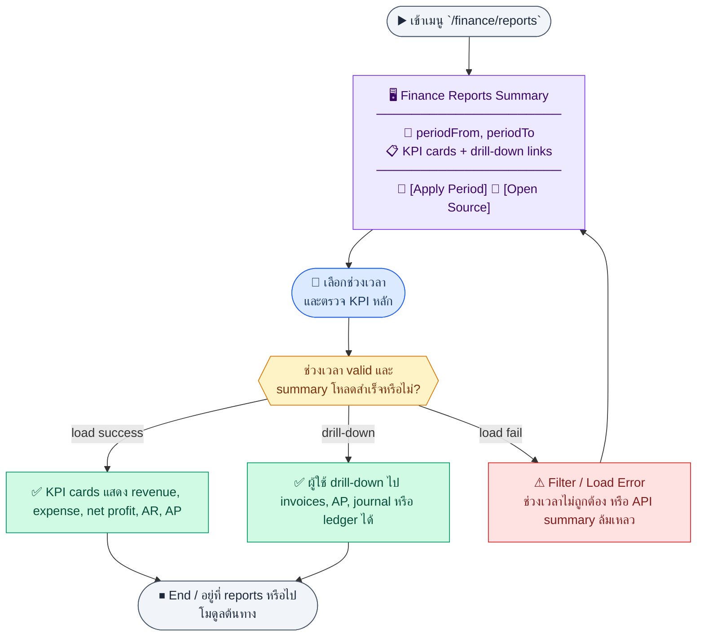
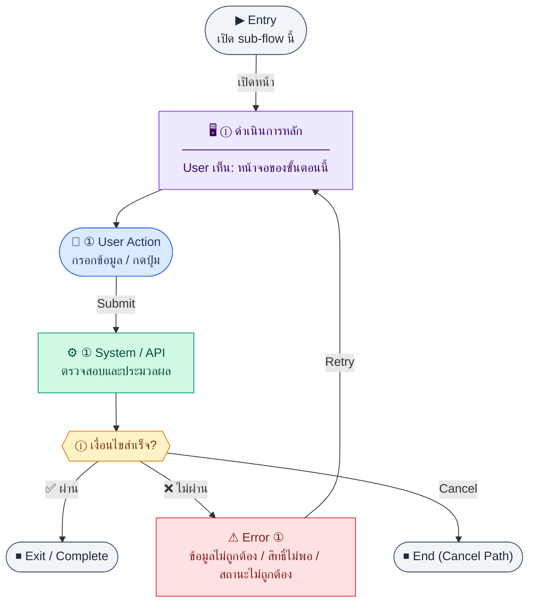

# UX Flow — Finance รายงานสรุป (KPI Summary)

เอกสารนี้โฟกัส **Release 1** ตาม BR Feature 1.10 และ endpoint ที่ traceability ผูกกับหน้า `/finance/reports` พร้อมอธิบาย drilldown ไปยัง source modules และบันทึก **reference-only endpoints** ของ R2 เพื่อกัน scope drift ระหว่าง release

**แหล่งอ้างอิงที่ผูกกับเอกสารนี้**

- Business requirement (BR): `Documents/Requirements/Release_1.md` — Feature 1.10 Finance — Reports Summary
- Traceability: `Documents/Requirements/Release_1_traceability_mermaid.md` — Feature 1.10 (`/finance/reports`, `GET /api/finance/reports/summary`)
- Sequence / SD_Flow (R1 scope หลัก): `Documents/SD_Flow/Finance/reports.md` — ส่วน `GET /api/finance/reports/summary`
- SD_Flow รายงานเต็ม (reference-only สำหรับ owner docs ของ R2): ไฟล์เดียวกันรวม `GET .../ar-aging`, `profit-loss`, `balance-sheet`, `cash-flow`
- Export ของงบแบบละเอียด (reference-only สำหรับ owner docs ของ R2): `Documents/SD_Flow/Finance/document_exports.md` — `GET /api/finance/reports/profit-loss/export`, `.../balance-sheet/export`, `.../cash-flow/export`
- Related screens / mockups: `Documents/UI_Flow_mockup/Page/R1-10_Finance_Reports_Summary/Reports.md`

---

## Coverage Lock Notes (2026-04-16)

### In-scope endpoints
- `GET /api/finance/reports/summary`

### Reference-only endpoints owned by R2 docs
- `GET /api/finance/reports/ar-aging` → owner UX: `R2-02_AR_Payment_Tracking.md`
- `GET /api/finance/reports/profit-loss` → owner UX: `R2-04_Financial_Statements.md`
- `GET /api/finance/reports/balance-sheet` → owner UX: `R2-04_Financial_Statements.md`
- `GET /api/finance/reports/cash-flow` → owner UX: `R2-04_Financial_Statements.md`
- export endpoints ใน `Documents/SD_Flow/Finance/document_exports.md` → owner UX: `R2-04_Financial_Statements.md`, `R2-09_Document_Print_Export.md`

### UX lock
- R1 file นี้ต้องโฟกัส summary KPI เท่านั้น
- ถ้ามีการพูดถึง AR aging, P&L, balance sheet, cash flow หรือ export ต้องระบุว่าเป็น reference only และชี้ owner doc ให้ชัด
- drilldown ของ KPI ต้อง map ชัดว่าไปหน้าไหน แต่ห้ามทำให้ความหมายของ R1 กลายเป็น deep-report hub
- ในเอกสารนี้ห้ามใช้ wording ที่ทำให้ผู้อ่านเข้าใจว่า R1 รองรับการ render รายงานเชิงลึกหรือ export จากหน้าเดียวกันแล้ว
## E2E Scenario Flow

> ภาพรวมหน้า Finance Reports Summary ที่ให้ผู้ใช้เลือกช่วงเวลา โหลด KPI หลักของรายรับ รายจ่าย กำไรสุทธิ AR outstanding และ AP outstanding แล้ว drill-down ไปยังโมดูลต้นทางได้ตามสิทธิ์

### Scenario Summary

| Scenario | ขั้นตอน | ผลลัพธ์ |
|----------|---------|---------|
| ✅ Load report summary page | Open `/finance/reports` | KPI page initializes with period controls |
| ✅ Apply reporting period | Change `periodFrom` and `periodTo` | System reloads summary data for the selected period |
| ✅ Monthly chart (optional FE) | Same period applied; chart enabled | After full-range summary, FE loads per-month `summary` calls (capped) to build monthly trend for P&amp;L metrics — see UI spec |
| ✅ View KPI cards | Successful summary response | User sees revenue, expense, net profit, AR outstanding, and AP outstanding |
| ✅ Drill down to source modules | Click a KPI drilldown link | User navigates to invoices, AP, journal, or ledger detail pages |
| ✅ Review R1 limitation note | View KPI context and report scope | User sees current R1 boundary for deeper reports |
| ⚠ Handle summary error | Invalid period or API failure | User gets clear feedback and can retry |

---
## ชื่อ Flow & ขอบเขต

**Flow name:** `Finance — Reports KPI Summary + drilldown navigation`

**Actor(s):** `finance_manager`, ผู้บริหารที่มีสิทธิ์อ่านรายงานการเงิน

**Entry:** `/finance/reports`

**Exit:** ได้ชุด KPI 5 ตัวตามช่วง `periodFrom`–`periodTo` หรือผู้ใช้นำทางไปหน้าต้นทางเพื่อตรวจสอบต่อ

**Out of scope ของ R1 ตาม BR:** งบกำไรขาดทุนเต็มรูปแบบ, Balance Sheet, Cash Flow statement ใน product (BR Known Gaps — เพิ่ม R2); อย่างไรก็ตาม **SD_Flow `reports.md` มี endpoint** สำหรับการวาง UX ล่วงหน้าและ audit cross-release

---

## Sub-flow 1 — โหลดและเลือกช่วงเวลา (`GET /api/finance/reports/summary`)

**Goal:** ดึง KPI หลักห้าตัว: revenue, expense, netProfit, arOutstanding, apOutstanding สำหรับช่วงเดือนที่เลือก

**User sees:** ตัวเลือก `periodFrom`, `periodTo` (รูปแบบ YYYY-MM ตาม BR), ปุ่ม “นำมาแสดง” หรือ auto-run เมื่อเปลี่ยนค่า, สถานะ loading บนการ์ด

**User can do:** เปลี่ยนช่วงเวลา, กดรีเฟรช, กด retry เมื่อ error

**Frontend behavior:**

- เรียก `GET /api/finance/reports/summary?periodFrom=<YYYY-MM>&periodTo=<YYYY-MM>` พร้อม Bearer token
- validate ฝั่ง client: `periodFrom <= periodTo`, รูปแบบเดือนถูกต้อง
- ระหว่างรอ: skeleton บนการ์ดทั้งห้า หรือ spinner overlay เล็กน้อย
- เก็บค่าช่วงใน URL query เพื่อ share link
- **กราฟแนวโน้มรายเดือน (ชั่วคราว — ไม่ต้องเปลี่ยน BE):** หลังโหลด summary ช่วงเต็มสำหรับการ์ด KPI แล้ว ถ้าหน้าจอมีกราฟรายเดือน (เช่น revenue/expense/netProfit ต่อเดือน) ให้ FE สร้างรายการเดือนทุกเดือนในช่วงแล้วเรียก `GET /api/finance/reports/summary?periodFrom=<Mi>&periodTo=<Mi>` **ทีละเดือน** (`Mi` เป็น `YYYY-MM` แต่ละเดือน) แล้วประกอบเป็นชุดข้อมูลกราฟ — จำกัดจำนวนเดือนสูงสุดต่อช่วง (เช่น 36) และจำกัด concurrency คำขอพร้อมกัน; ยกเลิกคำขอค้างเมื่อผู้ใช้เปลี่ยนช่วง — รายละเอียด UI/implementation: `Documents/UI_Flow_mockup/Page/R1-10_Finance_Reports_Summary/Reports.md` หัวข้อ «กราฟรายเดือน (FE — ยิง summary ทีละเดือน)»

**System / AI behavior:** aggregate จาก `invoices`, `finance_ap_bills`, `finance_ap_vendor_invoice_payments`, `journal_entries`/`journal_lines` ตาม BR — รายละเอียดการคำนวณเป็นของ BE

**Success:** 200 และ `data` มีครบห้าฟิลด์ตัวเลข

**Error:** 400 ช่วงไม่ถูกต้อง; 401/403; 5xx/timeout → แสดง error banner + ปุ่ม retry เรียก `GET /api/finance/reports/summary` ซ้ำ

**Notes:** Endpoint เดียวที่ BR กำหนดสำหรับหน้านี้ใน R1: `GET /api/finance/reports/summary` — การยิงหลายครั้งต่อเดือนเป็น **ทางเลือกฝั่ง FE** เพื่อกราฟรายเดือนเท่านั้น; เมื่อ BE รองรับ `monthlySeries` (หรือเทียบเท่า) ในคำตอบเดียว แนะนำเลิกใช้แพทเทิร์นนี้เพื่อลดโหลด

---

### Scenario Flow

### สัญลักษณ์ Node (Color Legend)

| สี | Node shape | หมายถึง |
|----|-----------|---------|
| 🟣 ม่วง | สี่เหลี่ยม `["…"]` | **Screen / UI State** |
| 🔵 น้ำเงิน | วงกลม `(["…"])` | **User Action** |
| 🟢 เขียว | สี่เหลี่ยม `["…"]` | **System / API** |
| 🟡 เหลือง | เพชร `{{"…"}}` | **Decision** |
| 🔴 แดง | สี่เหลี่ยม `["…"]` | **Error / Edge case** |
| ⚫ เทา | วงรี `(["…"])` | **Start / End** |

---

## Sub-flow 2 — แสดง KPI cards และความหมายทางธุรกิจ

**Goal:** ให้ผู้ใช้อ่าน “สุขภาพการเงิน” ได้เร็วจากตัวเลขเดียวกันกับ BR response ตัวอย่าง

**User sees:** การ์ดห้าใบ (revenue, expense, net profit, AR outstanding, AP outstanding), คำอธิบายสั้น (tooltip) ว่าคำนวณจากแหล่งใดในเชิงธุรกิจ

**User can do:** hover เพื่อดูคำจำกัดความ, กดลิงก์ drilldown (sub-flow 3)

**Frontend behavior:**

- map ค่าจาก response เป็น locale number format
- ถ้าค่าเป็น null/undefined จาก API แสดง “—” และ log (ไม่ควรเกิดถ้า contract คงที่)

**System / AI behavior:** ไม่มีคำขอเพิ่มหากใช้ข้อมูลชุดเดียวกับ sub-flow 1

**Success:** ผู้ใช้เข้าใจภาพรวมโดยไม่ต้องเปิดรายงานอื่น

**Error:** — (ขึ้นกับ sub-flow 1)

**Notes:** BR ระบุ Known Gap: `arOutstanding` จากยอด invoice อาจไม่แม่นยำเมื่อมี partial payment — UX ควรมี disclaimer เล็กน้อยใต้การ์ด AR

---

### Scenario Flow

### สัญลักษณ์ Node (Color Legend)

| สี | Node shape | หมายถึง |
|----|-----------|---------|
| 🟣 ม่วง | สี่เหลี่ยม `["…"]` | **Screen / UI State** |
| 🔵 น้ำเงิน | วงกลม `(["…"])` | **User Action** |
| 🟢 เขียว | สี่เหลี่ยม `["…"]` | **System / API** |
| 🟡 เหลือง | เพชร `{{"…"}}` | **Decision** |
| 🔴 แดง | สี่เหลี่ยม `["…"]` | **Error / Edge case** |
| ⚫ เทา | วงรี `(["…"])` | **Start / End** |

---

## Sub-flow 3 — Drilldown navigation ไปหน้าต้นทาง (ไม่มี endpoint ใหม่)

**Goal:** จาก KPI ให้ไปตรวจรายละเอียดในโมดูลที่เป็นต้นทางของตัวเลข

**User sees:** ลิงก์หรือปุ่ม “ดูรายการ” ใต้แต่ละการ์ด เช่น AR → `/finance/invoices`, AP → `/finance/ap`, รายได้/ค่าใช้จ่าย → `/finance/journal` หรือ `/finance/income-expense` ตามนโยบาย product

**User can do:** คลิกนำทางพร้อม query preset (เช่น filter ช่วงวันที่ใกล้เคียงกับ period ที่เลือก)

**Frontend behavior:**

- ใช้ client-side routing พร้อมส่ง query string ที่หน้าปลายทางรองรับ (`issueDateFrom` สำหรับ invoices ฯลฯ)
- หน้าปลายทางจะเรียก API ของตัวเอง (`GET /api/finance/invoices`, `GET /api/finance/ap/vendor-invoices`, …) — ดู UX ใน `R1-06`, `R1-08`, `R1-09`

**System / AI behavior:** ขึ้นกับแต่ละหน้า

**Success:** ผู้ใช้ตรวจสอบยอดย่อยได้จริง

**Error:** 403 ที่หน้าปลายทาง → แสดง empty พร้อมข้อความสิทธิ์

**Notes:** Traceability Feature 1.10 อ่านจากตารางหลายตัว — drilldown navigation เป็นแนวทาง UX ไม่ใช่ endpoint รายงานย่อย

---

### Scenario Flow

### สัญลักษณ์ Node (Color Legend)

| สี | Node shape | หมายถึง |
|----|-----------|---------|
| 🟣 ม่วง | สี่เหลี่ยม `["…"]` | **Screen / UI State** |
| 🔵 น้ำเงิน | วงกลม `(["…"])` | **User Action** |
| 🟢 เขียว | สี่เหลี่ยม `["…"]` | **System / API** |
| 🟡 เหลือง | เพชร `{{"…"}}` | **Decision** |
| 🔴 แดง | สี่เหลี่ยม `["…"]` | **Error / Edge case** |
| ⚫ เทา | วงรี `(["…"])` | **Start / End** |

---

## Appendix A — R2 Reference Only (ไม่ใช่ flow ที่ implement ใน R1)

**Goal:** บันทึก reference ของ endpoint R2 เพื่อป้องกันการสับสนข้าม release ไม่ใช่ flow ที่ implement ใน R1

**User sees:** ไม่มี UI state ใน R1 file นี้; ให้ถือเป็น reference-only note เพื่อชี้ไปเอกสาร R2 ที่เป็น owner จริง

**User can do:** อ่าน reference และตามไปเอกสาร R2 ที่เป็นเจ้าของ flow จริง

**Reference only:**

- `GET /api/finance/reports/ar-aging`
- `GET /api/finance/reports/profit-loss`
- `GET /api/finance/reports/balance-sheet`
- `GET /api/finance/reports/cash-flow`  
  พร้อม query ช่วงวันที่ตามที่ API กำหนด (SD ระบุว่า query รองรับตาม requirement)

**System / AI behavior:** อธิบายใน UX ของ R2 เท่านั้น

**Success:** ทีมเอกสารเข้าใจว่า endpoint นี้เป็น R2 scope

**Error:** ไม่ applicable ใน R1 UX นี้

**Notes:** Endpoints เหล่านี้อยู่ใน `Documents/SD_Flow/Finance/reports.md` แต่ **BR Feature 1.10 ระบุชัดว่า R1 มีแค่ summary** — ห้ามนับ endpoints เหล่านี้เป็น coverage ที่ implement ในไฟล์นี้ โดย owner UX หลักอยู่ใน `R2-02_AR_Payment_Tracking.md` และ `R2-04_Financial_Statements.md`

---

### Scenario Flow

### สัญลักษณ์ Node (Color Legend)

| สี | Node shape | หมายถึง |
|----|-----------|---------|
| 🟣 ม่วง | สี่เหลี่ยม `["…"]` | **Screen / UI State** |
| 🔵 น้ำเงิน | วงกลม `(["…"])` | **User Action** |
| 🟢 เขียว | สี่เหลี่ยม `["…"]` | **System / API** |
| 🟡 เหลือง | เพชร `{{"…"}}` | **Decision** |
| 🔴 แดง | สี่เหลี่ยม `["…"]` | **Error / Edge case** |
| ⚫ เทา | วงรี `(["…"])` | **Start / End** |

---

## Appendix B — R2 Export Reference Only (ไม่ใช่ flow ที่ implement ใน R1)

**Goal:** ระบุ export references ของ R2 เพื่อกันความสับสนเรื่อง scope เท่านั้น

**User sees:** ไม่มีปุ่ม export ที่เป็น R1 core ในไฟล์นี้

**User can do:** ตามไปดู UX ในเอกสาร R2/export ที่เป็น owner จริง

**Reference only:**

- `GET /api/finance/reports/profit-loss/export`
- `GET /api/finance/reports/balance-sheet/export`
- `GET /api/finance/reports/cash-flow/export`  
  จัดการไฟล์ stream/blob และชื่อไฟล์จาก `Content-Disposition` ถ้ามี

**System / AI behavior:** อธิบายใน `R2-04_Financial_Statements.md` และ `R2-09_Document_Print_Export.md`

**Success:** ไม่มีผลต่อ R1 acceptance ของหน้า summary

**Error:** ไม่ applicable ใน R1 UX นี้

**Notes:** อยู่ใน `Documents/SD_Flow/Finance/document_exports.md` — **ไม่ใช่ขอบเขตหลักของ R1 summary page** และต้องไม่ถูกนับเป็น implemented scope ของไฟล์นี้ โดย owner UX หลักอยู่ใน `R2-04_Financial_Statements.md` และ `R2-09_Document_Print_Export.md`

---

## Coverage Checklist

| Endpoint | Covered in UX file | Notes |
|----------|-------------------|-------|
| `GET /api/finance/reports/summary` | Sub-flow 1 — โหลดและเลือกช่วงเวลา; Sub-flow 2 — แสดง KPI cards; Sub-flow 3 — Drilldown navigation (นำทางไปโมดูลต้นทาง) | `Documents/SD_Flow/Finance/reports.md`; R1 หลักตาม BR Feature 1.10 |
| `GET /api/finance/reports/ar-aging` | Appendix A — R2 Reference Only | Reference only; owner UX อยู่ใน `R2-02_AR_Payment_Tracking.md` |
| `GET /api/finance/reports/profit-loss` | Appendix A — R2 Reference Only | Reference only; owner UX อยู่ใน `R2-04_Financial_Statements.md` |
| `GET /api/finance/reports/balance-sheet` | Appendix A — R2 Reference Only | Reference only; owner UX อยู่ใน `R2-04_Financial_Statements.md` |
| `GET /api/finance/reports/cash-flow` | Appendix A — R2 Reference Only | Reference only; owner UX อยู่ใน `R2-04_Financial_Statements.md` |
| `GET /api/finance/reports/profit-loss/export` | Appendix B — R2 Export Reference Only | Reference only; owner UX อยู่ใน `R2-04_Financial_Statements.md`, `R2-09_Document_Print_Export.md` |
| `GET /api/finance/reports/balance-sheet/export` | Appendix B — R2 Export Reference Only | Reference only; owner UX อยู่ใน `R2-04_Financial_Statements.md`, `R2-09_Document_Print_Export.md` |
| `GET /api/finance/reports/cash-flow/export` | Appendix B — R2 Export Reference Only | Reference only; owner UX อยู่ใน `R2-04_Financial_Statements.md`, `R2-09_Document_Print_Export.md` |

### Scenario Flow

### สัญลักษณ์ Node (Color Legend)

| สี | Node shape | หมายถึง |
|----|-----------|---------|
| 🟣 ม่วง | สี่เหลี่ยม `["…"]` | **Screen / UI State** |
| 🔵 น้ำเงิน | วงกลม `(["…"])` | **User Action** |
| 🟢 เขียว | สี่เหลี่ยม `["…"]` | **System / API** |
| 🟡 เหลือง | เพชร `{{"…"}}` | **Decision** |
| 🔴 แดง | สี่เหลี่ยม `["…"]` | **Error / Edge case** |
| ⚫ เทา | วงรี `(["…"])` | **Start / End** |

---

