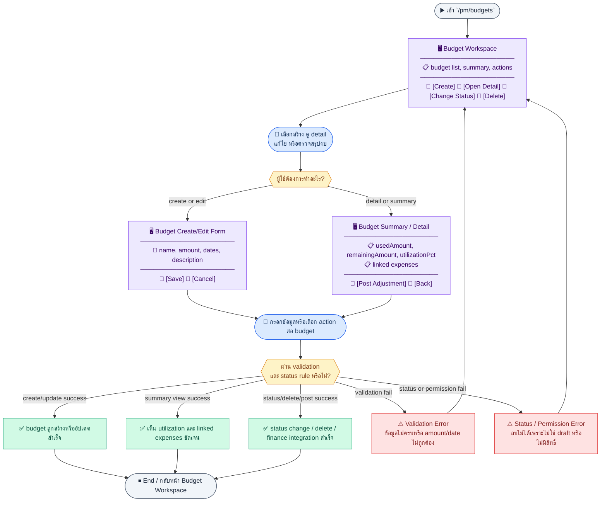
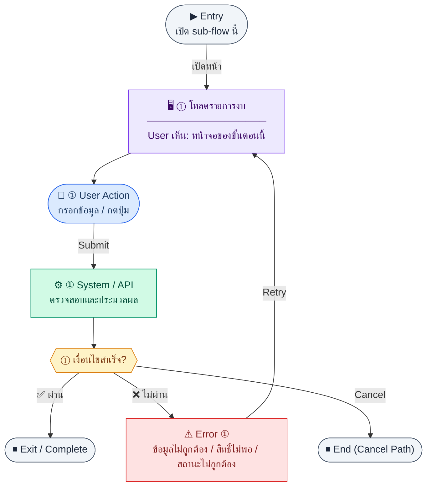
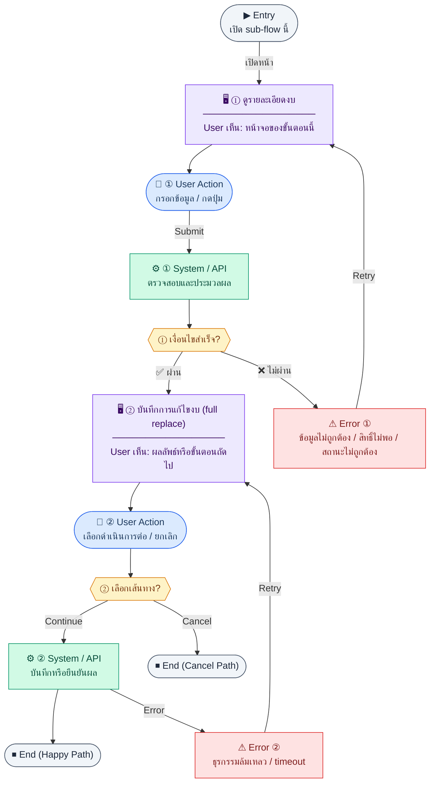
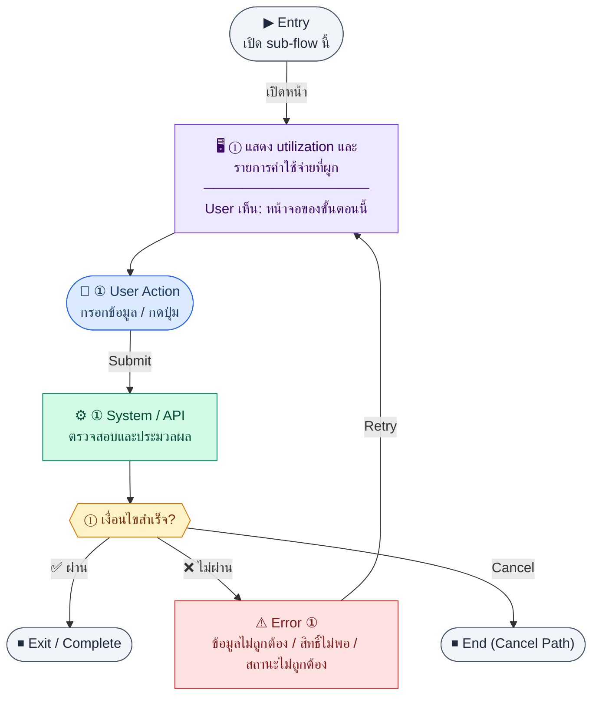
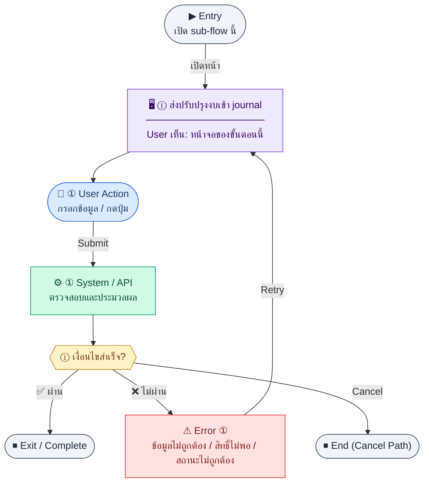

# UX Flow — PM จัดการงบประมาณ (Budget Management)

ใช้เป็น UX flow มาตรฐานสำหรับ journey งบประมาณ PM ใน Release 1 โดยผูกกับ API ตาม SD_Flow และ business rules ใน BR

**แหล่งอ้างอิงที่ผูกกับเอกสารนี้**

- Business requirement (BR): `Documents/Requirements/Release_1.md` (Feature 1.11 PM — Budget Management)
- Traceability: `Documents/Requirements/Release_1_traceability_mermaid.md` (โมดูล PM / budgets)
- Sequence / SD_Flow: `Documents/SD_Flow/PM/budgets.md`
- Related screens (ตาม BR): `/pm/budgets`, `/pm/budgets/new`, `/pm/budgets/:id`, `/pm/budgets/:id/edit`

---

## E2E Scenario Flow

> ภาพรวมการจัดการงบ PM ตั้งแต่เปิดรายการงบ, สร้างหรือแก้ไขงบ, ตรวจดู utilization และรายการค่าใช้จ่ายที่ผูก, เปลี่ยนสถานะ, จนถึงการลบ draft หรือส่ง budget adjustment ไป Finance ตามสิทธิ์และสถานะที่ระบบอนุญาต

### Scenario Summary

| Scenario | ขั้นตอน | ผลลัพธ์ |
|----------|---------|---------|
| ✅ ดูรายการงบ | เข้า `/pm/budgets` → load list → ค้นหา/กรอง | เห็นรายการงบพร้อม `budgetCode`, `amount`, `usedAmount`, `status` |
| ✅ สร้างงบใหม่ | เปิด create form → กรอกข้อมูล → submit | สร้างงบใหม่พร้อม `budgetCode` อัตโนมัติ |
| ✅ ดูสรุปงบ | เปิด detail/summary → load utilization | เห็น `usedAmount`, `remainingAmount`, `utilizationPct` และ linked expenses |
| ✅ แก้ไขงบ | เปิด edit → preload → save | ข้อมูลงบอัปเดตสำเร็จ |
| ✅ เปลี่ยนสถานะงบ | กด action เปลี่ยน status | งบเปลี่ยนเป็น `draft`, `active`, `on_hold` หรือ `closed` ตามกติกา |
| ✅ ลบงบร่าง | เลือก delete → ระบบตรวจ status | ลบได้เมื่อ budget ยังเป็น `draft` |
| ✅ ส่งปรับปรุงงบเข้า Finance | เปิด detail/summary → post adjustment | ระบบส่ง budget adjustment ไป Finance journal |
| ⚠ ลบหรือแก้ไขไม่ผ่านกฎ | พยายามลบงบที่ไม่ใช่ `draft` หรือ action ไม่ตรงสิทธิ์ | ระบบ block action และแสดงเหตุผล |

---
## ชื่อ Flow & ขอบเขต

**Flow name:** `PM — วงจรชีวิตงบประมาณและการใช้จ่าย (Utilization)`

**Actor(s):** `pm_manager`, `finance_manager` (และบทบาทอื่นที่ได้รับสิทธิ์ `pm:budget:*` ตาม RBAC)

**Entry:** ผู้ใช้เข้า `/pm/budgets` จากเมนู PM หรือ deep link จากรายงาน/การแจ้งเตือน

**Exit:** สร้างหรืออัปเดตงบได้, ดูสรุป utilization และรายการค่าใช้จ่ายที่ผูกแล้ว, หรือส่งปรับปรุงงบเข้า Finance สำเร็จ

**Out of scope:** พยากรณ์งบ (forecasting), โครงการแบบเต็มรูปแบบจากตาราง `projects` ที่ยังไม่ใช้ใน MVP

---

## Sub-flow A — รายการงบและตัวกรอง (List)

### Scenario Flow

### สัญลักษณ์ Node (Color Legend)

| สี | Node shape | หมายถึง |
|----|-----------|---------|
| 🟣 ม่วง | สี่เหลี่ยม `["…"]` | **Screen / UI State** |
| 🔵 น้ำเงิน | วงกลม `(["…"])` | **User Action** |
| 🟢 เขียว | สี่เหลี่ยม `["…"]` | **System / API** |
| 🟡 เหลือง | เพชร `{{"…"}}` | **Decision** |
| 🔴 แดง | สี่เหลี่ยม `["…"]` | **Error / Edge case** |
| ⚫ เทา | วงรี `(["…"])` | **Start / End** |

---

### Step A1 — โหลดรายการงบ

**Goal:** ให้ผู้ใช้เห็นงบทั้งหมดในหน้ารายการพร้อมค้นหาและกรอง

**User sees:** ตารางงบ, ช่องค้นหา, ตัวกรองสถานะ/โครงการ (ถ้า UI รองรับตาม query ของ API), pagination

**User can do:** ค้นหา, เปลี่ยนหน้า, กรอง `status`, `projectId` (ตาม `Documents/SD_Flow/PM/budgets.md`), กดสร้างงบใหม่, เปิดรายละเอียด/แก้ไข

**User Action:**
- ประเภท: `กรอกข้อมูล / เลือกตัวเลือก`
- ช่องที่ใช้กรอง/ค้นหา:
  - `search` *(optional)* : ค้นหาจาก `budgetCode` หรือ `name`
  - `status` *(optional)* : draft, active, on_hold, closed
  - `projectId` *(optional)* : กรองตามโครงการ
- ปุ่ม / Controls ในหน้านี้:
  - `[Apply Filters]` → โหลดรายการงบ
  - `[Create Budget]` → เปิดฟอร์มสร้างงบ
  - `[Open Budget]` → ไปหน้ารายละเอียด/แก้ไข

**Frontend behavior:**

- เรียก `GET /api/pm/budgets` พร้อม query `page`, `limit`, `search`, `status`, `projectId` ตามที่ออกแบบ
- แสดง skeleton/loading ระหว่างโหลด
- map คอลัมน์หลักจาก response เช่น `budgetCode`, `name`, `amount`, `usedAmount`, `status`, ช่วงวันที่

**System / AI behavior:**

- BE ตรวจ token + permission ระดับ API
- ดึง `pm_budgets` + count สำหรับ meta pagination

**Success:** ได้รายการและ meta ครบ แสดงตารางได้

**Error:** 401 (session), 403 (ไม่มีสิทธิ์), 500/timeout — แสดงข้อความและปุ่ม retry

**Notes:** การซ่อนปุ่ม action ใน FE ไม่แทนการบังคับสิทธิ์ที่ BE

---

## Sub-flow B — สร้างงบใหม่ (Create)

### Scenario Flow

### สัญลักษณ์ Node (Color Legend)

| สี | Node shape | หมายถึง |
|----|-----------|---------|
| 🟣 ม่วง | สี่เหลี่ยม `["…"]` | **Screen / UI State** |
| 🔵 น้ำเงิน | วงกลม `(["…"])` | **User Action** |
| 🟢 เขียว | สี่เหลี่ยม `["…"]` | **System / API** |
| 🟡 เหลือง | เพชร `{{"…"}}` | **Decision** |
| 🔴 แดง | สี่เหลี่ยม `["…"]` | **Error / Edge case** |
| ⚫ เทา | วงรี `(["…"])` | **Start / End** |

---

### Step B1 — เปิดฟอร์มสร้างงบ

**Goal:** เริ่มสร้างงบใหม่ด้วยข้อมูลที่ BR กำหนด

**User sees:** ฟอร์ม `/pm/budgets/new` (ชื่องบ, วงเงิน, วันที่เริ่ม/สิ้นสุด, คำอธิบาย ฯลฯ)

**User can do:** กรอกฟิลด์, บันทึกร่างผ่านการสร้างด้วยสถานะเริ่มต้น, ยกเลิกกลับรายการ

**User Action:**
- ประเภท: `กรอกข้อมูล / เลือกตัวเลือก`
- ช่องที่ต้องกรอก:
  - `name` *(required)* : ชื่องบ
  - `amount` *(required)* : วงเงินงบ
  - `projectId` *(optional)* : โครงการที่ผูก (ถ้า deployment เปิด project linkage)
  - `startDate` *(optional)* : วันที่เริ่ม
  - `endDate` *(optional)* : วันที่สิ้นสุด
  - `description` *(optional)* : หมายเหตุ
- ปุ่ม / Controls ในหน้านี้:
  - `[Save Budget]` → เรียก `POST /api/pm/budgets`
  - `[Cancel]` → กลับหน้ารายการ

**Frontend behavior:**

- validate ฝั่ง client ก่อน submit (จำนวนเงิน, วันที่, ชื่อ)
- `POST /api/pm/budgets` พร้อม body ตามสัญญา API (เช่น `name`, `amount` และฟิลด์อื่นที่ BE รองรับ)
- หลัง 201 redirect ไป `/pm/budgets/:id` หรือ `/pm/budgets/:id/edit` ตาม product decision

**System / AI behavior:**

- สร้างแถวใน `pm_budgets`
- gen `budgetCode` อัตโนมัติตาม BR: `BUD-{YEAR}-{SEQ:3}`

**Success:** ได้ `id` ใหม่จาก response และผู้ใช้อยู่หน้าถัดไปที่สมเหตุสมผล

**Error:** 400 validation, 409 ชน unique, 403 — แสดง field errors หรือข้อความรวม

**Notes:** ลบได้เฉพาะ `status = draft` (ดู Sub-flow E)

---

## Sub-flow C — รายละเอียดและแก้ไขงบ (Read / Update)

### Scenario Flow

### สัญลักษณ์ Node (Color Legend)

| สี | Node shape | หมายถึง |
|----|-----------|---------|
| 🟣 ม่วง | สี่เหลี่ยม `["…"]` | **Screen / UI State** |
| 🔵 น้ำเงิน | วงกลม `(["…"])` | **User Action** |
| 🟢 เขียว | สี่เหลี่ยม `["…"]` | **System / API** |
| 🟡 เหลือง | เพชร `{{"…"}}` | **Decision** |
| 🔴 แดง | สี่เหลี่ยม `["…"]` | **Error / Edge case** |
| ⚫ เทา | วงรี `(["…"])` | **Start / End** |

---

### Step C1 — ดูรายละเอียดงบ

**Goal:** โหลดข้อมูลงบฉบับเดียวสำหรับหน้าแก้ไขหรือ header ของหน้าสรุป

**User sees:** ข้อมูลงบครบฟิลด์จาก detail

**User can do:** อ่านข้อมูล, ไปหน้าแก้ไข

**User Action:**
- ประเภท: `กดปุ่ม`
- ปุ่ม / Controls ในหน้านี้:
  - `[Edit Budget]` → เข้าโหมดแก้ไข
  - `[View Summary]` → ดู utilization และค่าใช้จ่ายที่ผูก
  - `[Back to List]` → กลับหน้ารายการ

**Frontend behavior:** `GET /api/pm/budgets/:id`

**System / AI behavior:** SELECT `pm_budgets` by id + ตรวจสิทธิ์ ownership/scope ถ้ามี

**Success:** ได้ `data` สำหรับ bind ฟอร์ม

**Error:** 404 ไม่พบ, 403 ไม่มีสิทธิ์ดู

**Notes:** Path ตาม SD_Flow: `/pm/budgets/:id/edit` ใช้ endpoint เดียวกันก่อนเข้าโหมดแก้ไข

### Step C2 — บันทึกการแก้ไขงบ (full replace)

**Goal:** อัปเดตข้อมูลงบแบบ replace ทั้งชุดตามสัญญา `PUT`

**User sees:** ฟอร์มแก้ไขพร้อมค่าเดิม, สถานะ loading ขณะบันทึก

**User can do:** แก้ไขฟิลด์, กดบันทึก

**User Action:**
- ประเภท: `กรอกข้อมูล / เลือกตัวเลือก`
- ช่องที่ต้องกรอก:
  - `name` *(required)* : ชื่องบ
  - `amount` *(required)* : วงเงินงบล่าสุด
  - `projectId` *(optional)* : โครงการ
  - `startDate` *(optional)* : วันที่เริ่ม
  - `endDate` *(optional)* : วันที่สิ้นสุด
  - `description` *(optional)* : หมายเหตุ
- ปุ่ม / Controls ในหน้านี้:
  - `[Save Changes]` → เรียก `PUT /api/pm/budgets/:id`
  - `[Cancel]` → ยกเลิกการแก้ไข

**Frontend behavior:**

- validate ก่อนยิง `PUT /api/pm/budgets/:id` body เต็มชุดตามที่ BE กำหนด
- optimistic UI เป็น optional; ถ้าไม่ใช้ ให้ disable ปุ่มขณะรอ

**System / AI behavior:** `UPDATE pm_budgets`; อาจ recompute ฟิลด์ที่ derive จากระบบ

**Success:** 200 + message; refresh cache รายการและ detail

**Error:** 400, 409 business rule (เช่น งบปิดแล้วแก้ไม่ได้ — ถ้า BE enforce)

**Notes:** BR ระบุการเชื่อมกับค่าใช้จ่ายที่ approved จะสะท้อนใน `usedAmount` ผ่าน aggregate ไม่ใช่แค่การแก้ชื่อ

---

## Sub-flow D — สรุปการใช้งบ (Summary + linked expenses)

### Scenario Flow

### สัญลักษณ์ Node (Color Legend)

| สี | Node shape | หมายถึง |
|----|-----------|---------|
| 🟣 ม่วง | สี่เหลี่ยม `["…"]` | **Screen / UI State** |
| 🔵 น้ำเงิน | วงกลม `(["…"])` | **User Action** |
| 🟢 เขียว | สี่เหลี่ยม `["…"]` | **System / API** |
| 🟡 เหลือง | เพชร `{{"…"}}` | **Decision** |
| 🔴 แดง | สี่เหลี่ยม `["…"]` | **Error / Edge case** |
| ⚫ เทา | วงรี `(["…"])` | **Start / End** |

---

### Step D1 — แสดง utilization และรายการค่าใช้จ่ายที่ผูก

**Goal:** ให้ PM/Finance เห็นภาพใช้จ่ายจริงเทียบวงเงินอนุมัติ

**User sees:** ตาราง `expenses` จาก summary และการ์ดสรุปงบ:
- R1 core: `amount`, `usedAmount`, `remainingAmount`, `utilizationPct`
- Reference only (ยังไม่ใช่ current summary contract): `committedAmount`, `actualSpend`, `availableAmount` เมื่อ BE เปิด payload กลุ่ม PO/AP linkage เพิ่ม

**User can do:** เปิดลิงก์ไปรายละเอียดค่าใช้จ่าย (ถ้า UI มี), กลับรายการงบ

**User Action:**
- ประเภท: `เลือกตัวเลือก / กดปุ่ม`
- ช่องที่ใช้กรอง/โต้ตอบ:
  - `expenseStatus` *(optional)* : กรองค่าใช้จ่ายที่ผูกตามสถานะ
- ปุ่ม / Controls ในหน้านี้:
  - `[Open Expense]` → ไปหน้ารายละเอียดค่าใช้จ่าย
  - `[Back to Budget]` → กลับ header งบ

**Frontend behavior:** `GET /api/pm/budgets/:id/summary` บนหน้า `/pm/budgets/:id`

**System / AI behavior:** aggregate จาก `pm_expenses` ที่ approved และ `budget_id` ตรงกับงบนี้; สอดคล้อง BR ว่า `usedAmount` recompute จากชุดนี้

**Success:** ตัวเลข utilization สอดคล้องกับรายการที่แสดง

**Error:** 404/403; กรณีข้อมูลไม่ sync ชั่วคราว — แสดง timestamp ล่าสุดของ cache ถ้ามี

**Notes:** หน้านี้เป็นที่วางปุ่ม post adjustment ไป Finance (Sub-flow F); สำหรับ R1 ให้ยึด summary payload จาก `budgets.md` (`amount`, `usedAmount`, `remainingAmount`, `utilizationPct`) เป็นหลัก และถ้ามี field cross-module เพิ่มในภายหลังต้องระบุว่าเป็น `not in current summary contract` จนกว่า owner payload จะถูกล็อกจริง

---

## Sub-flow E — เปลี่ยนสถานะและลบงบ

### Scenario Flow

### สัญลักษณ์ Node (Color Legend)

| สี | Node shape | หมายถึง |
|----|-----------|---------|
| 🟣 ม่วง | สี่เหลี่ยม `["…"]` | **Screen / UI State** |
| 🔵 น้ำเงิน | วงกลม `(["…"])` | **User Action** |
| 🟢 เขียว | สี่เหลี่ยม `["…"]` | **System / API** |
| 🟡 เหลือง | เพชร `{{"…"}}` | **Decision** |
| 🔴 แดง | สี่เหลี่ยม `["…"]` | **Error / Edge case** |
| ⚫ เทา | วงรี `(["…"])` | **Start / End** |

---

### Step E1 — เปลี่ยนสถานะงบ

**Goal:** ปรับ lifecycle `draft | active | on_hold | closed` ตาม BR

**User sees:** action บนแถวหรือหน้ารายละเอียด, confirm dialog ถ้าจำเป็น

**User can do:** เลือกสถานะใหม่และยืนยัน

**User Action:**
- ประเภท: `เลือกตัวเลือก / กดปุ่ม`
- ช่องที่ต้องกรอก:
  - `status` *(required)* : สถานะใหม่ของงบ
  - `changeReason` *(optional)* : เหตุผลเมื่อปิดหรือพักงบ
- ปุ่ม / Controls ในหน้านี้:
  - `[Update Status]` → เรียก `PATCH /api/pm/budgets/:id/status`
  - `[Cancel]` → ปิด dialog

**Frontend behavior:** `PATCH /api/pm/budgets/:id/status` body `{ "status": "<ค่า>" }`

**System / AI behavior:** `UPDATE pm_budgets.status` + validation transition

**Success:** 200; อัปเดตตารางและ badge สถานะ

**Error:** 400 transition ไม่ถูกต้อง, 403

**Notes:** การปิดงบอาจส่งผลต่อการรับค่าใช้จ่ายใหม่ — ให้ UI แจ้งเตือนตามข้อความจาก BE

### Step E2 — ลบงบ (เฉพาะ draft)

**Goal:** ลบงบที่ยังไม่นำไปใช้งานจริง

**User sees:** ปุ่มลบ (แสดงเฉพาะเมื่อ `status === draft`)

**User can do:** ยืนยันการลบ

**User Action:**
- ประเภท: `กรอกข้อมูล / กดปุ่ม`
- ช่องที่ต้องกรอก:
  - `confirmBudgetCode` *(required)* : พิมพ์ `budgetCode` เพื่อยืนยันลบ
- ปุ่ม / Controls ในหน้านี้:
  - `[Delete Draft Budget]` → เรียก `DELETE /api/pm/budgets/:id`
  - `[Cancel]` → ยกเลิก

**Frontend behavior:** `DELETE /api/pm/budgets/:id` หลัง confirm

**System / AI behavior:** soft/hard delete ตาม implementation; BR กำหนดลบได้เฉพาะ draft

**Success:** 200; นำทางกลับ `/pm/budgets` และ refresh list

**Error:** 409/403 เมื่องบไม่ใช่ draft หรือมี dependency

**Notes:** อย่าแสดงปุ่มลบถ้า BE จะ reject — ลดความสับสน

---

## Sub-flow F — เชื่อม Finance (Post budget adjustment)

### Scenario Flow

### สัญลักษณ์ Node (Color Legend)

| สี | Node shape | หมายถึง |
|----|-----------|---------|
| 🟣 ม่วง | สี่เหลี่ยม `["…"]` | **Screen / UI State** |
| 🔵 น้ำเงิน | วงกลม `(["…"])` | **User Action** |
| 🟢 เขียว | สี่เหลี่ยม `["…"]` | **System / API** |
| 🟡 เหลือง | เพชร `{{"…"}}` | **Decision** |
| 🔴 แดง | สี่เหลี่ยม `["…"]` | **Error / Edge case** |
| ⚫ เทา | วงรี `(["…"])` | **Start / End** |

---

### Step F1 — ส่งปรับปรุงงบเข้า journal

**Goal:** ให้การเปลี่ยนแปลงงบที่เกี่ยวกับการบันทึกบัญชีถูก post ตาม integration ใน BR

**User sees:** ปุ่ม post adjustment บนหน้าสรุปงบ `/pm/budgets/:id` (เมื่อผู้ใช้มีสิทธิ์ finance integration)

**User can do:** กด trigger posting พร้อมยืนยัน

**User Action:**
- ประเภท: `กรอกข้อมูล / กดปุ่ม`
- ช่องที่ต้องกรอก:
  - `postingMemo` *(optional)* : คำอธิบายรายการปรับงบที่ส่งไปบัญชี
- ปุ่ม / Controls ในหน้านี้:
  - `[Post Budget Adjustment]` → เรียก integration ไป Finance
  - `[Cancel]` → ยกเลิกการ post

**Frontend behavior:** เรียก `POST /api/finance/integrations/pm-budgets/:budgetId/post-adjustment` (path ตาม BR; `:budgetId` คือ id งบ)

**System / AI behavior:** สร้าง journal adjustment ตามกฎบัญชีที่ออกแบบไว้; บันทึก trace กลับมาที่งบ/เอกสารบัญชี

**Success:** ได้ข้อความสำเร็จและอ้างอิง journal ถ้ามีใน response

**Error:** 422 business validation, 403, 502 integration — แสดงรายละเอียดและไม่ทำให้สถานะงบค้างกลางทางโดยไม่ชัดเจน

**Notes:** Flow นี้อยู่นอก `/api/pm/budgets` แต่เป็นส่วนสำคัญของ UX งบตาม Feature 1.11

---

## Coverage Checklist

| Endpoint | Covered in UX file | Notes |
|----------|-------------------|-------|
| `GET /api/pm/budgets` | Sub-flow A — รายการงบและตัวกรอง (List) | Query: page, limit, search, status, projectId |
| `POST /api/pm/budgets` | Sub-flow B — สร้างงบใหม่ (Create) | 201 → detail/edit per product |
| `GET /api/pm/budgets/:id` | Sub-flow C — รายละเอียดและแก้ไขงบ (Read / Update) | Step C1 |
| `PUT /api/pm/budgets/:id` | Sub-flow C — รายละเอียดและแก้ไขงบ (Read / Update) | Step C2 full replace |
| `GET /api/pm/budgets/:id/summary` | Sub-flow D — สรุปการใช้งบ (Summary + linked expenses) | Utilization + linked expenses |
| `PATCH /api/pm/budgets/:id/status` | Sub-flow E — เปลี่ยนสถานะและลบงบ | Step E1 lifecycle |
| `DELETE /api/pm/budgets/:id` | Sub-flow E — เปลี่ยนสถานะและลบงบ | Step E2 draft-only |
| `POST /api/finance/integrations/pm-budgets/:budgetId/post-adjustment` | Sub-flow F — เชื่อม Finance (Post budget adjustment) | BR finance integration; not listed in `budgets.md` inventory |

## Coverage Lock Notes (2026-04-16)

### In-scope endpoints
- `GET /api/pm/budgets`
- `POST /api/pm/budgets`
- `GET /api/pm/budgets/:id`
- `PUT /api/pm/budgets/:id`
- `GET /api/pm/budgets/:id/summary`
- `PATCH /api/pm/budgets/:id/status`
- `DELETE /api/pm/budgets/:id`

### Cross-module rules
- `POST /api/finance/integrations/pm-budgets/:budgetId/post-adjustment` เป็น implemented scope ของไฟล์นี้ แม้ owner contract จะอยู่ฝั่ง Finance integration
- `committedAmount`, `actualSpend`, `availableAmount` จาก PO/AP linkage ยังไม่อยู่ใน current summary contract; ถ้ายังไม่มีใน BE payload ให้ FE ห้ามสร้าง field, label หรือการคำนวณเอง

### UX lock
- ถ้า field อย่าง `committedAmount`, `actualSpend`, `availableAmount` ยังไม่อยู่ใน response จริง ให้ระบุว่า `not in current summary contract` ไม่ใช่ core R1 field
- delete semantics ต้องยึด BE rule ไม่ให้ UX เดา hard/soft delete เอง
- ใน R1 wording หลักของหน้า summary ต้องใช้ `usedAmount` / `remainingAmount` / `utilizationPct`; หลีกเลี่ยงการใช้ label `allocated`, `actualSpend`, `committed`, `available` เป็น default copy ของหน้าหลักจนกว่าจะเปิด R2 contract นั้นจริง
