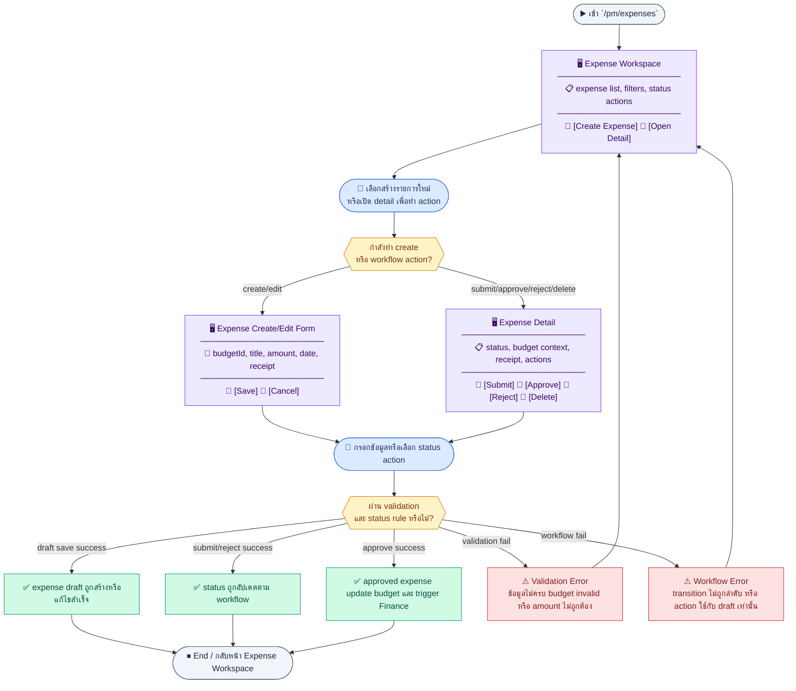
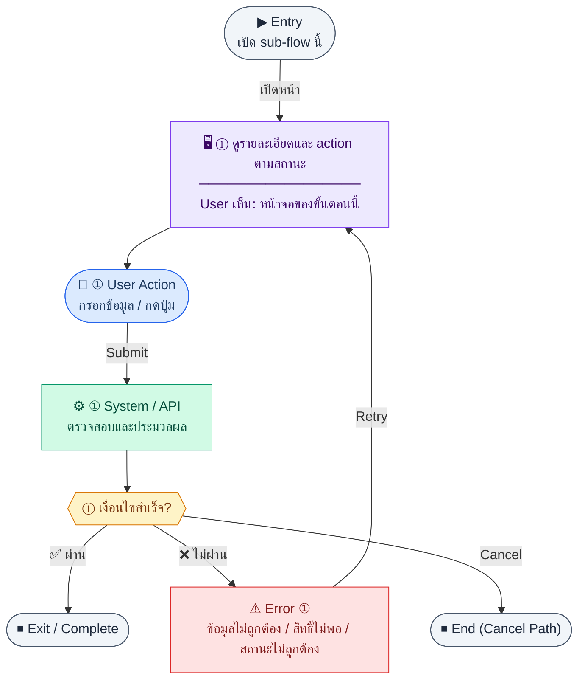
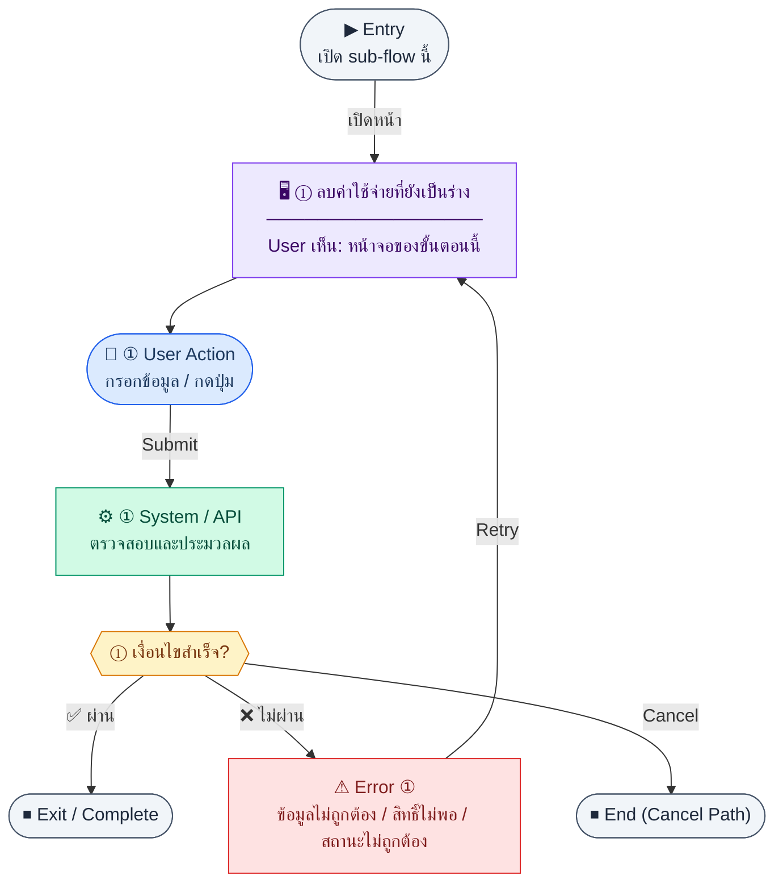
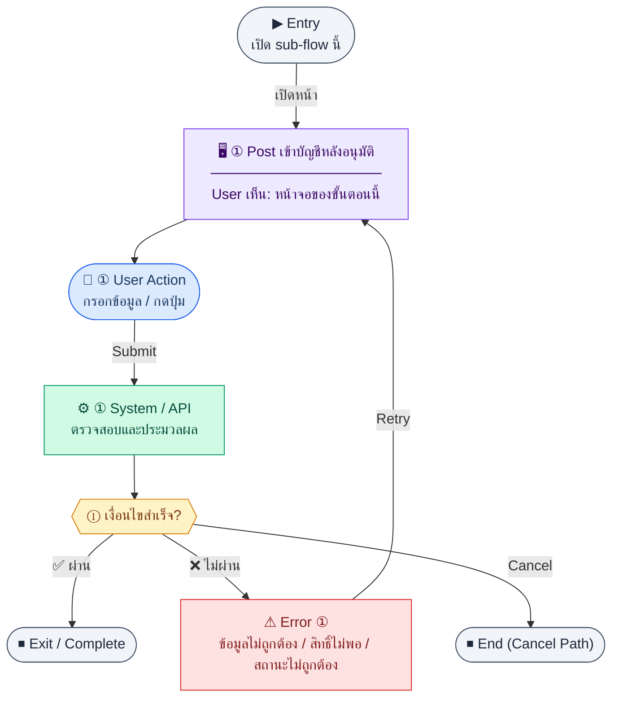

# UX Flow — PM จัดการค่าใช้จ่าย (Expense Management)

ใช้เป็น UX flow มาตรฐานสำหรับค่าใช้จ่าย PM ใน Release 1 โดยผูกกับ API ตาม SD_Flow และ workflow ใน BR

**แหล่งอ้างอิงที่ผูกกับเอกสารนี้**

- Business requirement (BR): `Documents/Requirements/Release_1.md` (Feature 1.12 PM — Expense Management)
- Traceability: `Documents/Requirements/Release_1_traceability_mermaid.md` (โมดูล PM / expenses)
- Sequence / SD_Flow: `Documents/SD_Flow/PM/expenses.md`
- Related screens (ตาม BR): `/pm/expenses`, `/pm/expenses/new`, `/pm/expenses/:id`

---

## E2E Scenario Flow

> ภาพรวมการจัดการค่าใช้จ่าย PM ตั้งแต่ดูรายการ, สร้างค่าใช้จ่ายผูกกับงบ, ตรวจสอบรายละเอียด, ส่งขออนุมัติ, อนุมัติหรือปฏิเสธ, จนถึงการอัปเดตยอดใช้จริงของงบและ post เข้า Finance เมื่อรายการได้รับอนุมัติ

### Scenario Summary

| Scenario | ขั้นตอน | ผลลัพธ์ |
|----------|---------|---------|
| ✅ ดูรายการค่าใช้จ่าย | เข้า `/pm/expenses` → load list → search/filter | เห็นรายการค่าใช้จ่ายพร้อมงบที่ผูกและสถานะ |
| ✅ สร้างค่าใช้จ่ายใหม่ | เปิด create form → โหลด active budgets → submit | สร้าง expense ใหม่สถานะเริ่มต้น `draft` |
| ✅ ดูรายละเอียดค่าใช้จ่าย | เปิด detail → load record | เห็นข้อมูลรายการ งบที่ผูก ใบเสร็จ และ status actions |
| ✅ ส่งขออนุมัติ | เปิด detail ของ draft → เปลี่ยน status เป็น `submitted` | รายการพร้อมเข้าสู่กระบวนการอนุมัติ |
| ✅ อนุมัติค่าใช้จ่าย | ผู้อนุมัติกด approve | status เป็น `approved`, `usedAmount` ถูกอัปเดต และ trigger Finance |
| ✅ ปฏิเสธค่าใช้จ่าย | ผู้อนุมัติกด reject พร้อมเหตุผล | status เป็น `rejected` |
| ✅ ลบหรือแก้ไข draft | เปิด draft → `PUT` หรือ `DELETE` | draft ถูกแก้ไขหรือลบได้สำเร็จ |
| ⚠ ค่าใช้จ่ายเกินงบหรือ action ไม่ถูกสถานะ | สร้าง/ส่งอนุมัติ/approve โดยไม่ผ่าน rule | ระบบแสดง warning หรือ block ตาม business rule |

---
## ชื่อ Flow & ขอบเขต

**Flow name:** `PM — วงจรค่าใช้จ่าย ส่งขออนุมัติ และเชื่อม Finance`

**Actor(s):** `employee` / `pm_manager` (ผู้สร้าง), `finance_manager` หรือผู้อนุมัติตามสิทธิ์, บทบาทที่เกี่ยวข้องกับการดูรายการ

**Entry:** `/pm/expenses` หรือ deep link จากงบ (`/pm/budgets/:id`) เพื่อสร้างค่าใช้จ่ายใหม่

**Exit:** บันทึกร่าง/ส่งอนุมัติ/อนุมัติหรือปฏิเสธสำเร็จ และเมื่อ approved อาจมีการ post เข้า Finance

**Out of scope:** การอนุมัติหลายขั้นแบบ custom workflow นอก `status` ที่ BR กำหนด

---

## Sub-flow A — รายการและตัวกรอง (List)

### Scenario Flow

### สัญลักษณ์ Node (Color Legend)

| สี | Node shape | หมายถึง |
|----|-----------|---------|
| 🟣 ม่วง | สี่เหลี่ยม `["…"]` | **Screen / UI State** |
| 🔵 น้ำเงิน | วงกลม `(["…"])` | **User Action** |
| 🟢 เขียว | สี่เหลี่ยม `["…"]` | **System / API** |
| 🟡 เหลือง | เพชร `{{"…"}}` | **Decision** |
| 🔴 แดง | สี่เหลี่ยม `["…"]` | **Error / Edge case** |
| ⚫ เทา | วงรี `(["…"])` | **Start / End** |

---

### Step A1 — โหลดรายการค่าใช้จ่าย

**Goal:** ให้ผู้ใช้เห็นภาพรวมค่าใช้จ่ายและกรองตามงานประจำวัน

**User sees:** การ์ดสถิติ (ถ้า UI ออกแบบจากข้อมูล list), ตาราง sortable, ตัวกรองสถานะ/ช่วงวันที่/งบ (ตามที่ BE รองรับ)

**User can do:** ค้นหา, เปลี่ยนหน้า, เปิดรายละเอียด, สร้างใหม่

**User Action:**
- ประเภท: `กรอกข้อมูล / เลือกตัวเลือก`
- ช่องที่ใช้กรอง/ค้นหา:
  - `search` *(optional)* : ค้นหาจาก `expenseCode` หรือ `title`
  - `status` *(optional)* : draft, submitted, approved, rejected
  - `dateFrom` *(optional)* : วันเริ่มช่วงค่าใช้จ่าย
  - `dateTo` *(optional)* : วันสิ้นสุดช่วงค่าใช้จ่าย
  - `budgetId` *(optional)* : งบที่ผูก
- ปุ่ม / Controls ในหน้านี้:
  - `[Apply Filters]` → โหลดรายการค่าใช้จ่าย
  - `[Create Expense]` → เปิดฟอร์มสร้าง
  - `[Open Expense]` → ไปหน้ารายละเอียด

**Frontend behavior:**

- `GET /api/pm/expenses` พร้อม query สำหรับ pagination/filter/date range ตามสัญญา API
- แสดง `expenseCode`, `title`, `amount`, `expenseDate`, `status`, งบที่ผูก

**System / AI behavior:** ดึง `pm_expenses` + join งบเมื่อจำเป็น

**Success:** แสดงรายการและ meta ครบ

**Error:** 401/403/500 — จัดการเหมือนมาตรฐานแอป

**Notes:** BR ระบุให้แจ้งเตือนถ้าค่าใช้จ่ายทำให้เกินงบ — canonical source คือ `warnings[]` จาก server; FE ไม่คำนวณ over-budget state เอง

---

## Sub-flow B — สร้างค่าใช้จ่าย (Create)

### Scenario Flow

### สัญลักษณ์ Node (Color Legend)

| สี | Node shape | หมายถึง |
|----|-----------|---------|
| 🟣 ม่วง | สี่เหลี่ยม `["…"]` | **Screen / UI State** |
| 🔵 น้ำเงิน | วงกลม `(["…"])` | **User Action** |
| 🟢 เขียว | สี่เหลี่ยม `["…"]` | **System / API** |
| 🟡 เหลือง | เพชร `{{"…"}}` | **Decision** |
| 🔴 แดง | สี่เหลี่ยม `["…"]` | **Error / Edge case** |
| ⚫ เทา | วงรี `(["…"])` | **Start / End** |

---

### Step B1 — กรอกฟอร์มค่าใช้จ่ายใหม่

**Goal:** บันทึกค่าใช้จ่ายจริงและผูกกับงบที่ active

**User sees:** ฟอร์ม `/pm/expenses/new`: เลือกงบ, หัวข้อ, จำนวนเงิน, วันที่, ใบเสร็จ, คำอธิบาย

**User can do:** เลือกงบจากรายการที่ดึงจาก API งบ, แนบไฟล์/URL ใบเสร็จตามดีไซน์

**User Action:**
- ประเภท: `กรอกข้อมูล / เลือกตัวเลือก`
- ช่องที่ต้องกรอก:
  - `budgetId` *(required)* : งบที่ active
  - `title` *(required)* : หัวข้อค่าใช้จ่าย
  - `amount` *(required)* : จำนวนเงิน
  - `expenseDate` *(required)* : วันที่ค่าใช้จ่าย
  - `receiptUrl` หรือ `receiptFile` *(optional)* : หลักฐาน
  - `description` *(optional)* : รายละเอียดเพิ่มเติม
- ปุ่ม / Controls ในหน้านี้:
  - `[Submit Expense]` → เรียก `POST /api/pm/expenses`
  - `[Cancel]` → ยกเลิกการสร้าง

**Frontend behavior:**

- โหลดตัวเลือกงบด้วย `GET /api/pm/budgets` (กรอง `status=active` ฝั่ง client หรือ query ถ้า BE รองรับ)
- validate แล้ว `POST /api/pm/expenses` body ตามสัญญา (เช่น `budgetId`, `title`, `amount`, `expenseDate`, …)

**System / AI behavior:**

- สร้าง `pm_expenses`; gen `expenseCode` ตาม BR: `EXP-{YEAR}-{SEQ:3}`
- ค่าเริ่มต้น `status` = `draft`

**Success:** 201 พร้อม `id`; redirect ไป `/pm/expenses/:id`

**Error:** 400 (งบไม่ active, จำนวนไม่ถูกต้อง), 403

**Notes:** การแก้ไขหลัง submit ถูกจำกัดโดยสถานะ (ดู Sub-flow D)

---

## Sub-flow C — รายละเอียด (Read)

### Scenario Flow

### สัญลักษณ์ Node (Color Legend)

| สี | Node shape | หมายถึง |
|----|-----------|---------|
| 🟣 ม่วง | สี่เหลี่ยม `["…"]` | **Screen / UI State** |
| 🔵 น้ำเงิน | วงกลม `(["…"])` | **User Action** |
| 🟢 เขียว | สี่เหลี่ยม `["…"]` | **System / API** |
| 🟡 เหลือง | เพชร `{{"…"}}` | **Decision** |
| 🔴 แดง | สี่เหลี่ยม `["…"]` | **Error / Edge case** |
| ⚫ เทา | วงรี `(["…"])` | **Start / End** |

---

### Step C1 — ดูรายละเอียดและ action ตามสถานะ

**Goal:** แสดงข้อมูลครบสำหรับการตัดสินใจอนุมัติและการส่งเข้า Finance

**User sees:** รายละเอียดค่าใช้จ่าย, ประวัติอนุมัติ/ปฏิเสธ, ปุ่มตาม role

**User can do:** ส่งอนุมัติ, อนุมัติ, ปฏิเสธ (ตามสิทธิ์), เปิดงบที่ผูก

**User Action:**
- ประเภท: `กดปุ่ม`
- ปุ่ม / Controls ในหน้านี้:
  - `[Submit for Approval]` → ส่งจาก draft ไป submitted
  - `[Approve]` → อนุมัติรายการเมื่อมีสิทธิ์
  - `[Reject]` → เปิด dialog ระบุเหตุผลปฏิเสธ
  - `[Open Budget]` → ไปดูงบที่ผูก

**Frontend behavior:** `GET /api/pm/expenses/:id` เมื่อเข้า `/pm/expenses/:id`

**System / AI behavior:** รวมข้อมูลผู้อนุมัติ/เวลา ถ้ามีในโมเดล

**Success:** render ครบ

**Error:** 404/403

**Notes:** BR ระบุปุ่ม post-to-finance บนหน้ารายละเอียดหลัง approved

---

## Sub-flow D — แก้ไขร่าง (Update เฉพาะ draft)

### Scenario Flow

### สัญลักษณ์ Node (Color Legend)

| สี | Node shape | หมายถึง |
|----|-----------|---------|
| 🟣 ม่วง | สี่เหลี่ยม `["…"]` | **Screen / UI State** |
| 🔵 น้ำเงิน | วงกลม `(["…"])` | **User Action** |
| 🟢 เขียว | สี่เหลี่ยม `["…"]` | **System / API** |
| 🟡 เหลือง | เพชร `{{"…"}}` | **Decision** |
| 🔴 แดง | สี่เหลี่ยม `["…"]` | **Error / Edge case** |
| ⚫ เทา | วงรี `(["…"])` | **Start / End** |

---

### Step D1 — แก้ไขค่าใช้จ่าย

**Goal:** ปรับข้อมูลขณะอยู่ในสถานะ `draft` เท่านั้น

**User sees:** ฟอร์มแก้ไข (อาจใช้ route เดียวกับ detail ในโหมด edit)

**User can do:** แก้ไขฟิลด์และบันทึก

**User Action:**
- ประเภท: `กรอกข้อมูล / เลือกตัวเลือก`
- ช่องที่ต้องกรอก:
  - `title` *(required)* : หัวข้อค่าใช้จ่าย
  - `amount` *(required)* : จำนวนเงิน
  - `expenseDate` *(required)* : วันที่ค่าใช้จ่าย
  - `budgetId` *(required)* : งบที่ผูก
  - `receiptUrl` หรือ `receiptFile` *(optional)* : หลักฐานแนบ
  - `description` *(optional)* : หมายเหตุ
- ปุ่ม / Controls ในหน้านี้:
  - `[Save Draft Changes]` → เรียก `PUT /api/pm/expenses/:id`
  - `[Cancel]` → ยกเลิกการแก้ไข

**Frontend behavior:**

- โหลดด้วย `GET /api/pm/expenses/:id`
- ถ้า `status !== draft` ให้ล็อกฟิลด์หรือซ่อนปุ่มบันทึก
- `PUT /api/pm/expenses/:id` เมื่อผู้ใช้บันทึก

**System / AI behavior:** BR กำหนดแก้ไขได้เฉพาะ `draft`

**Success:** 200; refresh detail

**Error:** 409 พยายามแก้ไขเมื่อไม่ใช่ draft

**Notes:** ใช้ full replace ตาม pattern `PUT` ของโมดูล

---

## Sub-flow E — Workflow สถานะ (Submit / Approve / Reject)

### Scenario Flow

### สัญลักษณ์ Node (Color Legend)

| สี | Node shape | หมายถึง |
|----|-----------|---------|
| 🟣 ม่วง | สี่เหลี่ยม `["…"]` | **Screen / UI State** |
| 🔵 น้ำเงิน | วงกลม `(["…"])` | **User Action** |
| 🟢 เขียว | สี่เหลี่ยม `["…"]` | **System / API** |
| 🟡 เหลือง | เพชร `{{"…"}}` | **Decision** |
| 🔴 แดง | สี่เหลี่ยม `["…"]` | **Error / Edge case** |
| ⚫ เทา | วงรี `(["…"])` | **Start / End** |

---

### Step E1 — เปลี่ยนสถานะผ่าน PATCH

**Goal:** เคลื่อนสถานะ `draft → submitted → approved | rejected` ตาม BR

**User sees:** ปุ่ม Submit, Approve/Reject dialog พร้อมเหตุผลเมื่อ reject

**User can do:** submit, approve, reject พร้อม `reason` เมื่อปฏิเสธ

**User Action:**
- ประเภท: `เลือกตัวเลือก / กรอกข้อมูล`
- ช่องที่ต้องกรอก:
  - `status` *(required)* : submitted, approved, rejected
  - `reason` *(required เมื่อ reject)* : เหตุผลการปฏิเสธ
- ปุ่ม / Controls ในหน้านี้:
  - `[Update Expense Status]` → เรียก `PATCH /api/pm/expenses/:id/status`
  - `[Cancel]` → ปิด dialog

**Frontend behavior:** `PATCH /api/pm/expenses/:id/status` body ตาม action ที่ BE นิยาม (เช่น `{ "status": "submitted" }`, `{ "status": "approved" }`, `{ "status": "rejected", "reason": "..." }`)

**System / AI behavior:**

- เมื่อ `approved`: อัปเดต `pm_budgets.usedAmount`, บันทึก `approvedBy`/`approvedAt`
- เมื่อ `rejected`: บันทึก `rejectedAt`, `rejectReason`
- อาจ trigger notification ใน R2 (นอกขอบเขตเอกสารนี้แต่ควรออกแบบ UI ให้รองรับข้อความระบบ)

**Success:** 200; อัปเดต badge และ disabled action ที่ไม่ valid อีกต่อไป

**Error:** 400 transition, 403 ไม่ใช่ผู้อนุมัติ

**Notes:** แสดงคำเตือนเกินงบก่อน submit ถ้า BE ส่ง flag หรือ FE เปรียบเทียบกับ summary งบ

---

## Sub-flow F — ลบร่าง (Delete draft)

### Scenario Flow

### สัญลักษณ์ Node (Color Legend)

| สี | Node shape | หมายถึง |
|----|-----------|---------|
| 🟣 ม่วง | สี่เหลี่ยม `["…"]` | **Screen / UI State** |
| 🔵 น้ำเงิน | วงกลม `(["…"])` | **User Action** |
| 🟢 เขียว | สี่เหลี่ยม `["…"]` | **System / API** |
| 🟡 เหลือง | เพชร `{{"…"}}` | **Decision** |
| 🔴 แดง | สี่เหลี่ยม `["…"]` | **Error / Edge case** |
| ⚫ เทา | วงรี `(["…"])` | **Start / End** |

---

### Step F1 — ลบค่าใช้จ่ายที่ยังเป็นร่าง

**Goal:** ลบรายการที่ยังไม่ถูกส่งหรืออนุมัติ

**User sees:** ปุ่มลบเมื่อ `status === draft` และ confirm

**User can do:** ยืนยันลบ

**User Action:**
- ประเภท: `กรอกข้อมูล / กดปุ่ม`
- ช่องที่ต้องกรอก:
  - `confirmExpenseCode` *(required)* : พิมพ์รหัสค่าใช้จ่ายเพื่อยืนยัน
- ปุ่ม / Controls ในหน้านี้:
  - `[Delete Draft Expense]` → เรียก `DELETE /api/pm/expenses/:id`
  - `[Cancel]` → ปิด modal

**Frontend behavior:** `DELETE /api/pm/expenses/:id`

**System / AI behavior:** BR กำหนดลบได้เฉพาะ draft

**Success:** กลับรายการและ refresh

**Error:** 409 เมื่อไม่ใช่ draft

**Notes:** —

---

## Sub-flow G — เชื่อม Finance (Post approved expense)

### Scenario Flow

### สัญลักษณ์ Node (Color Legend)

| สี | Node shape | หมายถึง |
|----|-----------|---------|
| 🟣 ม่วง | สี่เหลี่ยม `["…"]` | **Screen / UI State** |
| 🔵 น้ำเงิน | วงกลม `(["…"])` | **User Action** |
| 🟢 เขียว | สี่เหลี่ยม `["…"]` | **System / API** |
| 🟡 เหลือง | เพชร `{{"…"}}` | **Decision** |
| 🔴 แดง | สี่เหลี่ยม `["…"]` | **Error / Edge case** |
| ⚫ เทา | วงรี `(["…"])` | **Start / End** |

---

### Step G1 — Post เข้าบัญชีหลังอนุมัติ

**Goal:** ส่งผลค่าใช้จ่ายที่อนุมัติแล้วไปยังบัญชีอัตโนมัติ

**User sees:** ปุ่ม post-to-finance บน `/pm/expenses/:id` เมื่อ `status === approved` และยังไม่ post (ถ้า BE ส่ง flag)

**User can do:** กด post พร้อมยืนยัน

**User Action:**
- ประเภท: `กรอกข้อมูล / กดปุ่ม`
- ช่องที่ต้องกรอก:
  - `postingMemo` *(optional)* : หมายเหตุสำหรับ finance
- ปุ่ม / Controls ในหน้านี้:
  - `[Post to Finance]` → เรียก `POST /api/finance/integrations/pm-expenses/:expenseId/post`
  - `[Cancel]` → ยกเลิก

**Frontend behavior:** `POST /api/finance/integrations/pm-expenses/:expenseId/post` (ตาม BR; `:expenseId` คือ id ของค่าใช้จ่าย)

**System / AI behavior:** สร้าง journal: เดบิตบัญชีค่าใช้จ่ายโครงการ / เครดิตเจ้าหนี้ ตาม BR

**Success:** แสดงเลขที่อ้างอิง journal หรือสถานะสำเร็จ

**Error:** 422, 403, integration failure — แสดง error ที่นำไปสู่การแก้ไขได้ (retry / ติดต่อ finance)

**Notes:** BR ระบุว่า approve จะ trigger auto-post — UX อาจทำทั้งแบบอัตโนมัติหลัง approve และแบบปุ่ม manual ตามผลิตภัณฑ์ แต่ endpoint นี้คือจุดเชื่อมทางเทคนิค

---

## Coverage Checklist

| Endpoint | Covered in UX file | Notes |
|----------|-------------------|-------|
| `GET /api/pm/expenses` | Sub-flow A — รายการและตัวกรอง (List) | Pagination, filters, date range |
| `POST /api/pm/expenses` | Sub-flow B — สร้างค่าใช้จ่าย (Create) | Links active budget; draft default |
| `GET /api/pm/expenses/:id` | Sub-flow C — รายละเอียด (Read); Sub-flow D — แก้ไขร่าง (Update เฉพาะ draft) | Same resource for read vs draft edit |
| `PUT /api/pm/expenses/:id` | Sub-flow D — แก้ไขร่าง (Update เฉพาะ draft) | Draft-only full replace |
| `PATCH /api/pm/expenses/:id/status` | Sub-flow E — Workflow สถานะ (Submit / Approve / Reject) | State machine |
| `DELETE /api/pm/expenses/:id` | Sub-flow F — ลบร่าง (Delete draft) | Draft-only |
| `POST /api/finance/integrations/pm-expenses/:expenseId/post` | Sub-flow G — เชื่อม Finance (Post approved expense) | BR finance integration; not in `expenses.md` inventory |
| `GET /api/pm/budgets` | Sub-flow B — สร้างค่าใช้จ่าย (Create) | Budget picker (often `status=active`) |

## Coverage Lock Notes (2026-04-16)

### In-scope endpoints
- `GET /api/pm/expenses`
- `POST /api/pm/expenses`
- `GET /api/pm/expenses/:id`
- `PUT /api/pm/expenses/:id`
- `PATCH /api/pm/expenses/:id/status`
- `DELETE /api/pm/expenses/:id`
- `GET /api/pm/budgets`

### Canonical fields
- receipt flow ใน R1 ให้ยึด `receiptUrl` เป็น canonical field

### UX lock
- ถ้ามี upload flow จริง ต้องอธิบายว่า upload สุดท้าย resolve เป็น `receiptUrl` ก่อน submit
- budget picker ต้องอิง `GET /api/pm/budgets` และไม่ hardcode รายชื่อ
