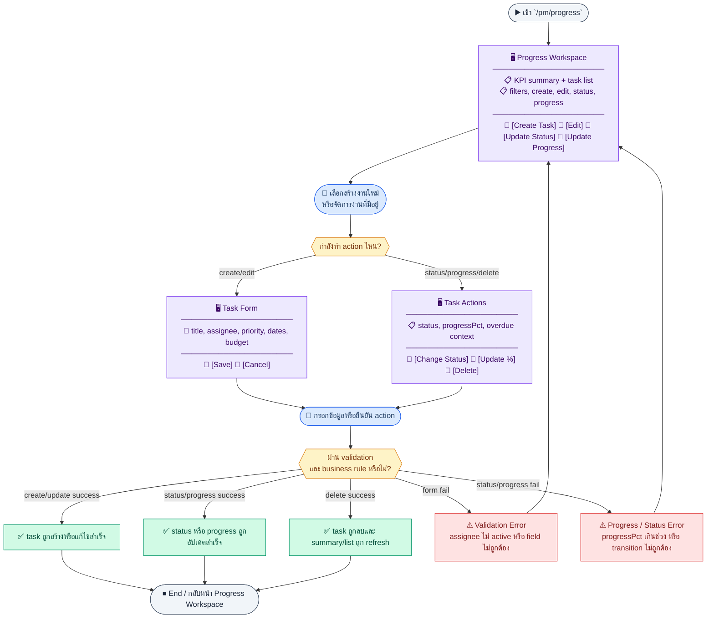
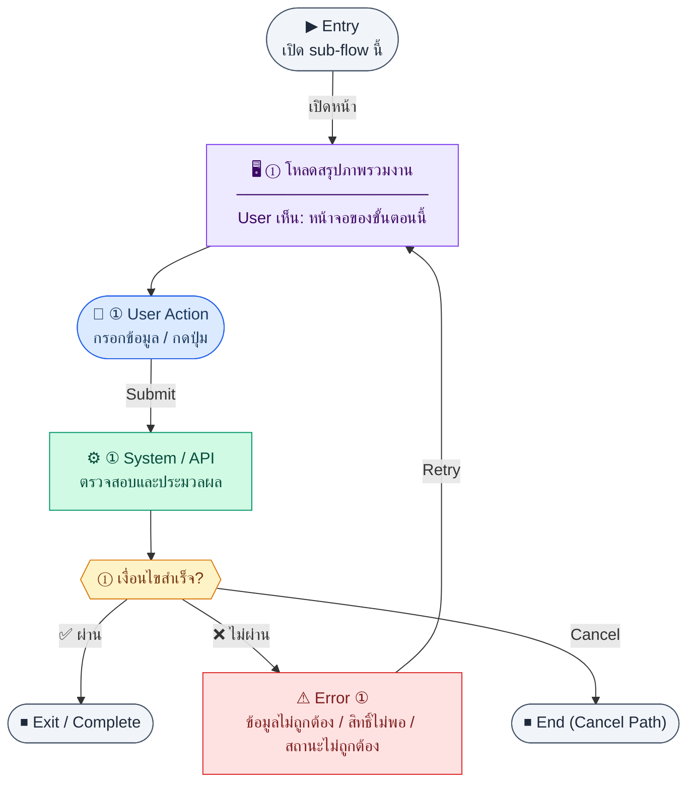
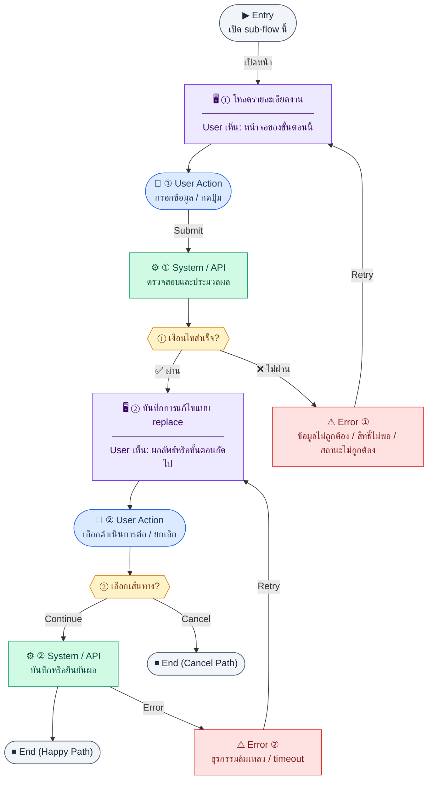
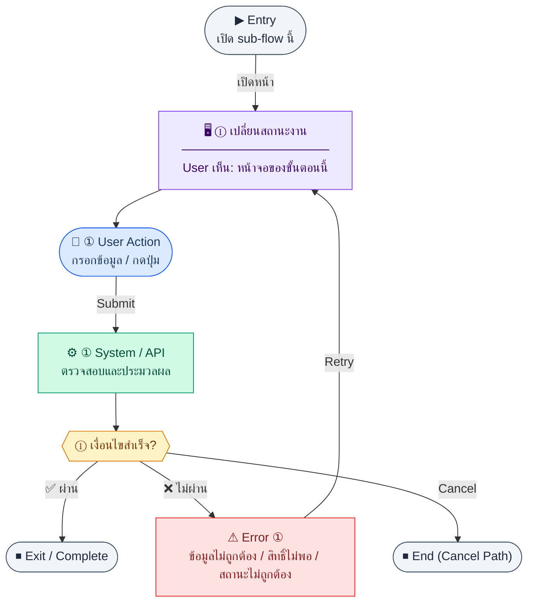
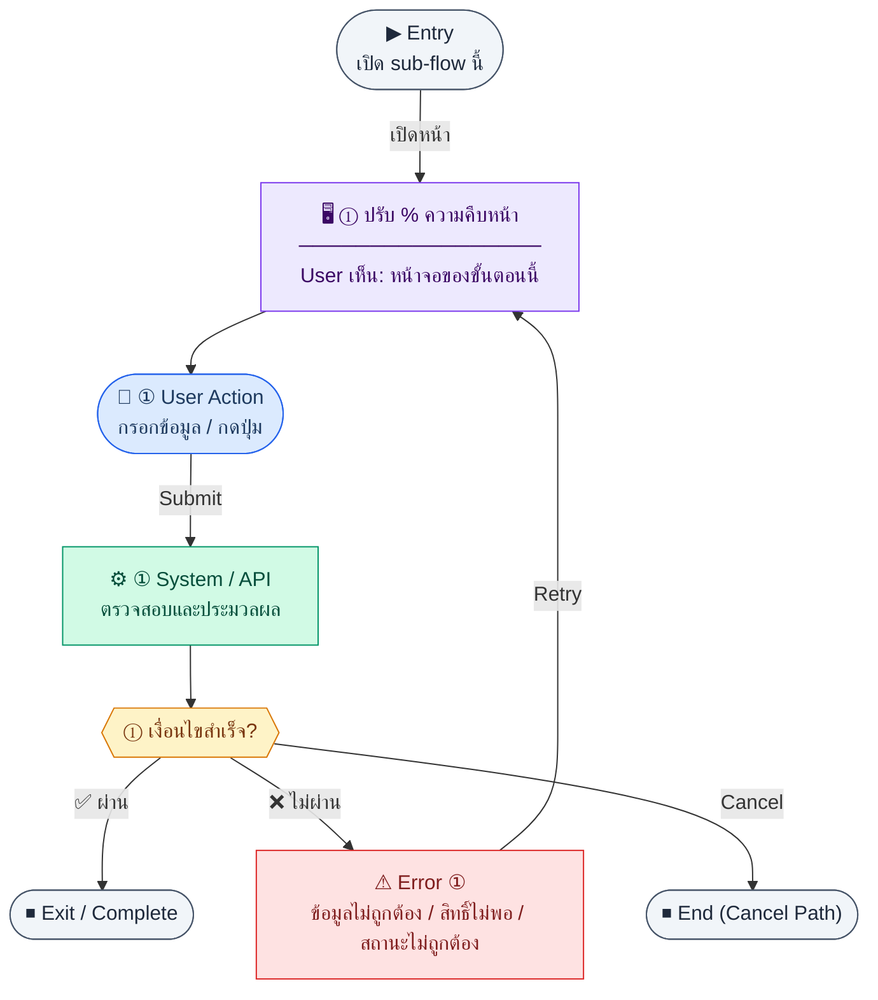
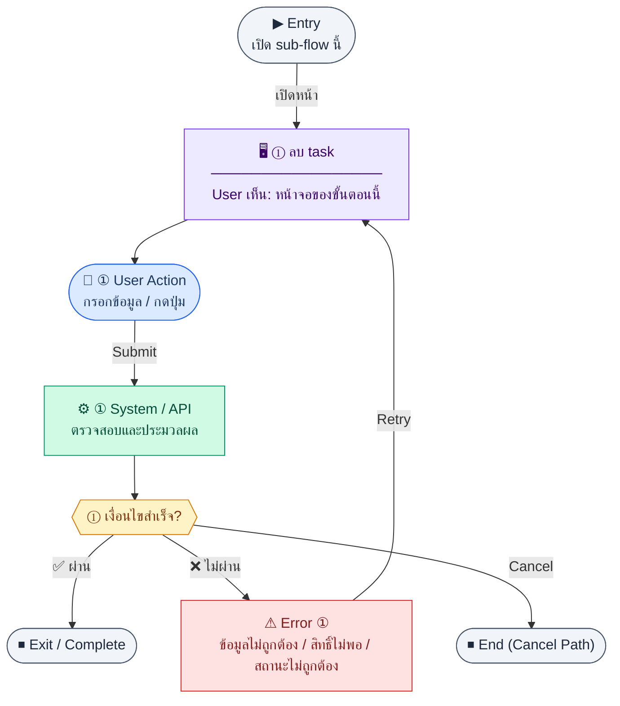

# UX Flow — PM ความคืบหน้าและงาน (Progress / Tasks)

ใช้เป็น UX flow มาตรฐานสำหรับงาน (`pm_progress_tasks`) ใน Release 1 โดยผูกกับ API ตาม SD_Flow และกฎทางธุรกิจใน BR

**แหล่งอ้างอิงที่ผูกกับเอกสารนี้**

- Business requirement (BR): `Documents/Requirements/Release_1.md` (Feature 1.13 PM — Progress Tasks)
- Traceability: `Documents/Requirements/Release_1_traceability_mermaid.md` (โมดูล PM / progress)
- Sequence / SD_Flow: `Documents/SD_Flow/PM/progress.md`
- Related screens (ตาม BR): `/pm/progress`, `/pm/progress/new`, `/pm/progress/:id/edit`

---

## E2E Scenario Flow

> ภาพรวมการติดตามงาน PM ตั้งแต่โหลด KPI และรายการงาน, สร้างงานใหม่, มอบหมายผู้รับผิดชอบ, อัปเดตสถานะและเปอร์เซ็นต์ความคืบหน้า, จนถึงการปิดงานหรือลบงานโดยคงกติกาเรื่อง overdue, completedDate และ assignee ที่ต้องเป็นพนักงาน active

### Scenario Summary

| Scenario | ขั้นตอน | ผลลัพธ์ |
|----------|---------|---------|
| ✅ ดู KPI งาน | เข้า `/pm/progress` → load summary | เห็น `total`, `inProgress`, `done`, `avgProgressPct`, `overdueCount` |
| ✅ ดูและกรองรายการงาน | อยู่หน้า `/pm/progress` → load task list | เห็น task list ตาม `status`, `priority`, `assigneeId` |
| ✅ สร้างงานใหม่ | เปิด create form → กรอกข้อมูล → submit | สร้าง task ใหม่พร้อมข้อมูลอ้างอิงที่ถูกต้อง |
| ✅ แก้ไขรายละเอียดงาน | เปิด edit → preload task → save | ข้อมูลงานถูกอัปเดตสำเร็จ |
| ✅ เปลี่ยนสถานะงาน | ใช้ action เปลี่ยน status | งานเปลี่ยนสถานะและถ้า `done` จะ set `completedDate` |
| ✅ อัปเดตเปอร์เซ็นต์ความคืบหน้า | ปรับ `% progress` → save | ค่า `progressPct` ถูกอัปเดตภายในช่วง 0-100 |
| ✅ ลบงาน | เลือก delete task | งานถูกลบออกจากรายการ |
| ⚠ ข้อมูลไม่ผ่านกฎ | assignee ไม่ active หรือ `progressPct` เกินช่วง | ระบบแสดง error และให้แก้ไขก่อนบันทึก |

---
## ชื่อ Flow & ขอบเขต

**Flow name:** `PM — สร้างงาน มอบหมาย อัปเดตความคืบหน้า และสถานะ`

**Actor(s):** `pm_manager`, `employee` ที่เป็น assignee หรือผู้มีสิทธิ์แก้ไขงานตาม RBAC

**Entry:** `/pm/progress`

**Exit:** สร้าง/แก้ไขงานได้, KPI summary ถูกต้อง, หรือลบงานที่ไม่ต้องการแล้ว

**Out of scope:** โมดูล timesheet / ตาราง `project_tasks` แบบเต็ม (BR ระบุว่ายังไม่ใช้ใน MVP)

---

## Sub-flow A — KPI Summary (Aggregate)

### Scenario Flow

### สัญลักษณ์ Node (Color Legend)

| สี | Node shape | หมายถึง |
|----|-----------|---------|
| 🟣 ม่วง | สี่เหลี่ยม `["…"]` | **Screen / UI State** |
| 🔵 น้ำเงิน | วงกลม `(["…"])` | **User Action** |
| 🟢 เขียว | สี่เหลี่ยม `["…"]` | **System / API** |
| 🟡 เหลือง | เพชร `{{"…"}}` | **Decision** |
| 🔴 แดง | สี่เหลี่ยม `["…"]` | **Error / Edge case** |
| ⚫ เทา | วงรี `(["…"])` | **Start / End** |

---

### Step A1 — โหลดสรุปภาพรวมงาน

**Goal:** แสดงตัวเลขสรุปบนหัวหน้า `/pm/progress` เพื่อให้ผู้ใช้ตัดสินใจเร็ว

**User sees:** การ์ด/แถบสรุป เช่น จำนวนรวม, แยกตามสถานะ, `avgProgressPct`, `overdueCount` (ตามตัวอย่าง response ใน BR)

**User can do:** เปลี่ยนตัวกรองโครงการ/ผู้รับผิดชอบ (ถ้า UI รองรับ)

**User Action:**
- ประเภท: `เลือกตัวเลือก / กดปุ่ม`
- ช่องที่ใช้กรอง summary:
  - `projectId` *(optional)* : เลือก scope โครงการ
  - `assigneeId` *(optional)* : เลือกผู้รับผิดชอบ
  - `dateFrom` *(optional)* : วันเริ่มช่วงสรุป
  - `dateTo` *(optional)* : วันสิ้นสุดช่วงสรุป
  - `budgetId` *(optional)* : scope งบที่ต้องการดู
- ปุ่ม / Controls ในหน้านี้:
  - `[Apply Summary Filter]` → โหลด KPI ใหม่
  - `[Retry]` → ลองโหลด summary ซ้ำ

**Frontend behavior:** `GET /api/pm/progress/summary` พร้อม query `projectId`, `assigneeId`, `dateFrom`, `dateTo`, `budgetId` ตาม SD_Flow

**System / AI behavior:** aggregate จาก `pm_progress_tasks`

**Success:** ได้ `data` ตาม schema ที่ออกแบบ

**Error:** 401/403/500

**Notes:** summary ควร refresh หลัง mutation ใน sub-flow อื่น (invalidate query)

---

## Sub-flow B — รายการงาน (List)

### Scenario Flow

### สัญลักษณ์ Node (Color Legend)

| สี | Node shape | หมายถึง |
|----|-----------|---------|
| 🟣 ม่วง | สี่เหลี่ยม `["…"]` | **Screen / UI State** |
| 🔵 น้ำเงิน | วงกลม `(["…"])` | **User Action** |
| 🟢 เขียว | สี่เหลี่ยม `["…"]` | **System / API** |
| 🟡 เหลือง | เพชร `{{"…"}}` | **Decision** |
| 🔴 แดง | สี่เหลี่ยม `["…"]` | **Error / Edge case** |
| ⚫ เทา | วงรี `(["…"])` | **Start / End** |

---

### Step B1 — โหลดตารางงาน

**Goal:** แสดงรายการงานพร้อมค้นหาและกรอง

**User sees:** ตารางงาน, ช่องค้นหา, ตัวกรอง `status`, `priority`, `assigneeId`, `projectId`, pagination

**User can do:** เรียง/กรอง, เปิดแก้ไข, เปลี่ยนสถานะด่วน, อัปเดต % จาก inline (ถ้ามีใน UI)

**User Action:**
- ประเภท: `กรอกข้อมูล / เลือกตัวเลือก`
- ช่องที่ใช้กรอง/ค้นหา:
  - `search` *(optional)* : ค้นหาจาก task title
  - `status` *(optional)* : todo, in_progress, done, cancelled
  - `priority` *(optional)* : low, medium, high
  - `assigneeId` *(optional)* : ผู้รับผิดชอบ
  - `projectId` *(optional)* : โครงการ
- ปุ่ม / Controls ในหน้านี้:
  - `[Apply Filters]` → โหลดรายการงาน
  - `[Open Task]` → ไปหน้ารายละเอียด/แก้ไข
  - `[Create Task]` → เปิดฟอร์มสร้าง

**Frontend behavior:** `GET /api/pm/progress` query `page`, `limit`, `search`, `status`, `priority`, `assigneeId`, `projectId`, `sortBy?`, `sortOrder?`

**System / AI behavior:** SELECT + count

**Success:** แสดงรายการและ meta

**Error:** มาตรฐานเดียวกับแอป

**Notes:** overdue คำนวณที่ BE หรือฝั่งแสดงผลจาก `dueDate` + `status` ตาม BR

---

## Sub-flow C — สร้างงาน (Create)

### Scenario Flow

### สัญลักษณ์ Node (Color Legend)

| สี | Node shape | หมายถึง |
|----|-----------|---------|
| 🟣 ม่วง | สี่เหลี่ยม `["…"]` | **Screen / UI State** |
| 🔵 น้ำเงิน | วงกลม `(["…"])` | **User Action** |
| 🟢 เขียว | สี่เหลี่ยม `["…"]` | **System / API** |
| 🟡 เหลือง | เพชร `{{"…"}}` | **Decision** |
| 🔴 แดง | สี่เหลี่ยม `["…"]` | **Error / Edge case** |
| ⚫ เทา | วงรี `(["…"])` | **Start / End** |

---

### Step C1 — ส่งฟอร์มงานใหม่

**Goal:** สร้าง task ใหม่พร้อมมอบหมายและลิงก์งบ (ถ้ามี)

**User sees:** `/pm/progress/new` — title, description, priority, status เริ่มต้น, วันที่, assignee, budget ไม่บังคับ

**User can do:** เลือก assignee จากรายการพนักงาน active (ข้อมูลจาก HR API ตามดีไซน์แอป), เลือกงบจาก `GET /api/pm/budgets` ถ้าต้องการลิงก์, บันทึกงาน

**User Action:**
- ประเภท: `กรอกข้อมูล / เลือกตัวเลือก`
- ช่องที่ต้องกรอก:
  - `title` *(required)* : ชื่องาน
  - `description` *(optional)* : รายละเอียดงาน
  - `priority` *(optional)* : ระดับความสำคัญ
  - `assigneeId` *(optional)* : ผู้รับผิดชอบ
  - `startDate` *(optional)* : วันเริ่ม
  - `dueDate` *(optional)* : วันครบกำหนด
  - `budgetId` *(optional)* : งบที่ลิงก์
- ปุ่ม / Controls ในหน้านี้:
  - `[Create Task]` → เรียก `POST /api/pm/progress`
  - `[Cancel]` → ยกเลิกการสร้าง

**Frontend behavior:**

- validate ฟิลด์บังคับและช่วงวันที่
- `POST /api/pm/progress` body เช่น `{ "title", "assigneeId", ... }` ตามสัญญา

**System / AI behavior:** INSERT `pm_progress_tasks`; BR กำหนด assignee ต้องเป็น active employee

**Success:** 201 พร้อม `id`

**Error:** 400 (assignee ไม่ active), 403

**Notes:** —

---

## Sub-flow D — รายละเอียดและแก้ไขเต็มชุด (Read / PUT)

### Scenario Flow

### สัญลักษณ์ Node (Color Legend)

| สี | Node shape | หมายถึง |
|----|-----------|---------|
| 🟣 ม่วง | สี่เหลี่ยม `["…"]` | **Screen / UI State** |
| 🔵 น้ำเงิน | วงกลม `(["…"])` | **User Action** |
| 🟢 เขียว | สี่เหลี่ยม `["…"]` | **System / API** |
| 🟡 เหลือง | เพชร `{{"…"}}` | **Decision** |
| 🔴 แดง | สี่เหลี่ยม `["…"]` | **Error / Edge case** |
| ⚫ เทา | วงรี `(["…"])` | **Start / End** |

---

### Step D1 — โหลดรายละเอียดงาน

**Goal:** เตรียมข้อมูลสำหรับหน้าแก้ไข

**User sees:** ฟอร์ม pre-filled

**User can do:** อ่านและแก้ไข

**User Action:**
- ประเภท: `กดปุ่ม`
- ปุ่ม / Controls ในหน้านี้:
  - `[Edit Task]` → เข้าโหมดแก้ไข
  - `[Update Status]` → เปิด quick status action
  - `[Update Progress]` → เปิด slider หรือ inline control
  - `[Back to List]` → กลับหน้ารายการ

**Frontend behavior:** `GET /api/pm/progress/:id`

**System / AI behavior:** SELECT by id

**Success:** bind ฟอร์มได้

**Error:** 404/403

**Notes:** SD_Flow map หน้าแก้ไขเป็น `/pm/progress/:id/edit`

### Step D2 — บันทึกการแก้ไขแบบ replace

**Goal:** อัปเดตข้อมูลงานทั้งก้อนตาม `PUT`

**User sees:** loading ขณะบันทึก

**User can do:** บันทึก

**User Action:**
- ประเภท: `กรอกข้อมูล / เลือกตัวเลือก`
- ช่องที่ต้องกรอก:
  - `title` *(required)* : ชื่องาน
  - `description` *(optional)* : รายละเอียด
  - `priority` *(optional)* : ระดับความสำคัญ
  - `assigneeId` *(optional)* : ผู้รับผิดชอบ
  - `status` *(required)* : สถานะปัจจุบัน
  - `progressPct` *(required)* : 0-100
  - `dueDate` *(optional)* : วันครบกำหนด
- ปุ่ม / Controls ในหน้านี้:
  - `[Save Task]` → เรียก `PUT /api/pm/progress/:id`
  - `[Cancel]` → ยกเลิกการแก้ไข

**Frontend behavior:** `PUT /api/pm/progress/:id` body เต็มชุด

**System / AI behavior:** UPDATE แถวงาน; ถ้าเปลี่ยนเป็น `done` BR กำหนดให้ set `completedDate` อัตโนมัติ — คาดหวังว่า BE จะทำ

**Success:** 200

**Error:** 400 validation (เช่น `progressPct` นอก 0–100)

**Notes:** BR กำหนด `progressPct` 0–100 เท่านั้น

---

## Sub-flow E — อัปเดตสถานะอย่างรวดเร็ว (PATCH status)

### Scenario Flow

### สัญลักษณ์ Node (Color Legend)

| สี | Node shape | หมายถึง |
|----|-----------|---------|
| 🟣 ม่วง | สี่เหลี่ยม `["…"]` | **Screen / UI State** |
| 🔵 น้ำเงิน | วงกลม `(["…"])` | **User Action** |
| 🟢 เขียว | สี่เหลี่ยม `["…"]` | **System / API** |
| 🟡 เหลือง | เพชร `{{"…"}}` | **Decision** |
| 🔴 แดง | สี่เหลี่ยม `["…"]` | **Error / Edge case** |
| ⚫ เทา | วงรี `(["…"])` | **Start / End** |

---

### Step E1 — เปลี่ยนสถานะงาน

**Goal:** เปลี่ยน `todo | in_progress | done | cancelled` โดยไม่ต้องเปิดฟอร์มเต็ม

**User sees:** dropdown หรือปุ่ม action บนแถว

**User can do:** เลือกสถานะใหม่

**User Action:**
- ประเภท: `เลือกตัวเลือก / กดปุ่ม`
- ช่องที่ต้องกรอก:
  - `status` *(required)* : todo, in_progress, done, cancelled
- ปุ่ม / Controls ในหน้านี้:
  - `[Save Status]` → เรียก `PATCH /api/pm/progress/:id/status`
  - `[Cancel]` → ปิด quick action

**Frontend behavior:** `PATCH /api/pm/progress/:id/status` body `{ "status": "<ค่า>" }`

**System / AI behavior:** อัปเดตสถานะ; เมื่อ `done` ให้จัดการ `completedDate` ตาม BR

**Success:** 200; refresh summary + list

**Error:** 400 transition

**Notes:** หลังเป็น `done` งานไม่ควรนับเป็น overdue

---

## Sub-flow F — อัปเดตเปอร์เซ็นต์ความคืบหน้า (PATCH progress)

### Scenario Flow

### สัญลักษณ์ Node (Color Legend)

| สี | Node shape | หมายถึง |
|----|-----------|---------|
| 🟣 ม่วง | สี่เหลี่ยม `["…"]` | **Screen / UI State** |
| 🔵 น้ำเงิน | วงกลม `(["…"])` | **User Action** |
| 🟢 เขียว | สี่เหลี่ยม `["…"]` | **System / API** |
| 🟡 เหลือง | เพชร `{{"…"}}` | **Decision** |
| 🔴 แดง | สี่เหลี่ยม `["…"]` | **Error / Edge case** |
| ⚫ เทา | วงรี `(["…"])` | **Start / End** |

---

### Step F1 — ปรับ % ความคืบหน้า

**Goal:** อัปเดต `progressPct` โดยไม่แตะฟิลด์อื่น

**User sees:** slider หรือช่องตัวเลข 0–100

**User can do:** ปรับค่าและยืนยัน (หรือ debounce auto-save ตาม product)

**User Action:**
- ประเภท: `กรอกข้อมูล / เลือกตัวเลือก`
- ช่องที่ต้องกรอก:
  - `progressPct` *(required)* : ค่า 0-100
- ปุ่ม / Controls ในหน้านี้:
  - `[Save Progress]` → เรียก `PATCH /api/pm/progress/:id/progress`
  - `[Cancel]` → ยกเลิกการปรับค่า

**Frontend behavior:** `PATCH /api/pm/progress/:id/progress` body `{ "progressPct": <0-100> }`

**System / AI behavior:** UPDATE เฉพาะคอลัมน์ progress

**Success:** 200; summary `avgProgressPct` เปลี่ยนหลัง refresh

**Error:** 400 ถ้านอกช่วง

**Notes:** แยก endpoint นี้ช่วยลด race กับ `PUT` เต็มฟอร์ม

---

## Sub-flow G — ลบงาน (Delete)

### Scenario Flow

### สัญลักษณ์ Node (Color Legend)

| สี | Node shape | หมายถึง |
|----|-----------|---------|
| 🟣 ม่วง | สี่เหลี่ยม `["…"]` | **Screen / UI State** |
| 🔵 น้ำเงิน | วงกลม `(["…"])` | **User Action** |
| 🟢 เขียว | สี่เหลี่ยม `["…"]` | **System / API** |
| 🟡 เหลือง | เพชร `{{"…"}}` | **Decision** |
| 🔴 แดง | สี่เหลี่ยม `["…"]` | **Error / Edge case** |
| ⚫ เทา | วงรี `(["…"])` | **Start / End** |

---

### Step G1 — ลบ task

**Goal:** เอางานออกจากระบบเมื่อยกเลิกโครงการหรือสร้างผิด

**User sees:** ปุ่มลบ + confirm

**User can do:** ยืนยัน

**User Action:**
- ประเภท: `กรอกข้อมูล / กดปุ่ม`
- ช่องที่ต้องกรอก:
  - `confirmTaskTitle` *(required)* : พิมพ์ชื่องานเพื่อยืนยันลบ
- ปุ่ม / Controls ในหน้านี้:
  - `[Delete Task]` → เรียก `DELETE /api/pm/progress/:id`
  - `[Cancel]` → ยกเลิก

**Frontend behavior:** `DELETE /api/pm/progress/:id`

**System / AI behavior:** soft/hard delete ตาม implementation

**Success:** 200; นำออกจาก list

**Error:** 403/409 ถ้ามีกฎห้ามลบ

**Notes:** —

---

## Coverage Checklist

| Endpoint | Covered in UX file | Notes |
|----------|-------------------|-------|
| `GET /api/pm/progress/summary` | Sub-flow A — KPI Summary (Aggregate) | Query: projectId, assigneeId, dateFrom, dateTo, budgetId |
| `GET /api/pm/progress` | Sub-flow B — รายการงาน (List) | Query: page, limit, search, status, priority, assigneeId, projectId, sortBy?, sortOrder? |
| `POST /api/pm/progress` | Sub-flow C — สร้างงาน (Create) | Optional budget link |
| `GET /api/pm/progress/:id` | Sub-flow D — รายละเอียดและแก้ไขเต็มชุด (Read / PUT) | Step D1 |
| `PUT /api/pm/progress/:id` | Sub-flow D — รายละเอียดและแก้ไขเต็มชุด (Read / PUT) | Step D2 full replace |
| `PATCH /api/pm/progress/:id/status` | Sub-flow E — อัปเดตสถานะอย่างรวดเร็ว (PATCH status) | Quick status change |
| `PATCH /api/pm/progress/:id/progress` | Sub-flow F — อัปเดตเปอร์เซ็นต์ความคืบหน้า (PATCH progress) | progressPct 0–100 |
| `DELETE /api/pm/progress/:id` | Sub-flow G — ลบงาน (Delete) | Confirm + refresh list |
| `GET /api/pm/budgets` | Sub-flow C — สร้างงาน (Create) | Optional budget dropdown |

## Coverage Lock Notes (2026-04-16)

### In-scope endpoints
- `GET /api/pm/progress/summary`
- `GET /api/pm/progress`
- `POST /api/pm/progress`
- `GET /api/pm/progress/:id`
- `PUT /api/pm/progress/:id`
- `PATCH /api/pm/progress/:id/status`
- `PATCH /api/pm/progress/:id/progress`
- `DELETE /api/pm/progress/:id`

### Source endpoints / pickers
- budget picker ใช้ `GET /api/pm/budgets`
- assignee picker ต้องอ้าง active employee source ตาม contract กลางของ HR

### UX lock
- delete behavior ต้องยึดผลจาก BE ว่า allowed หรือ blocked; อย่า imply ว่าลบได้เสมอ
