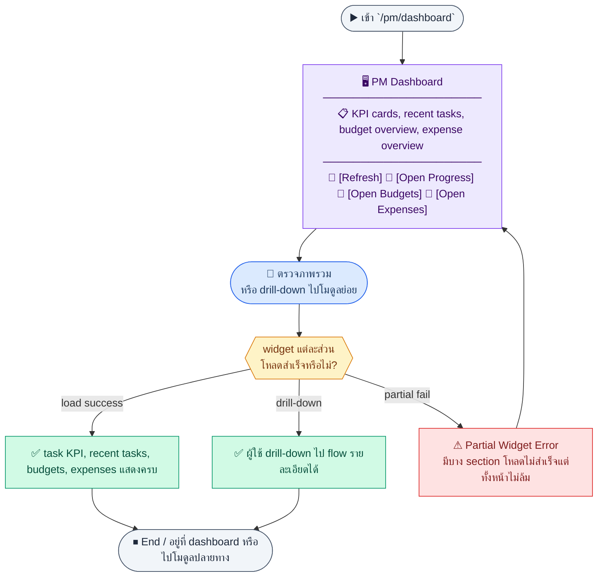
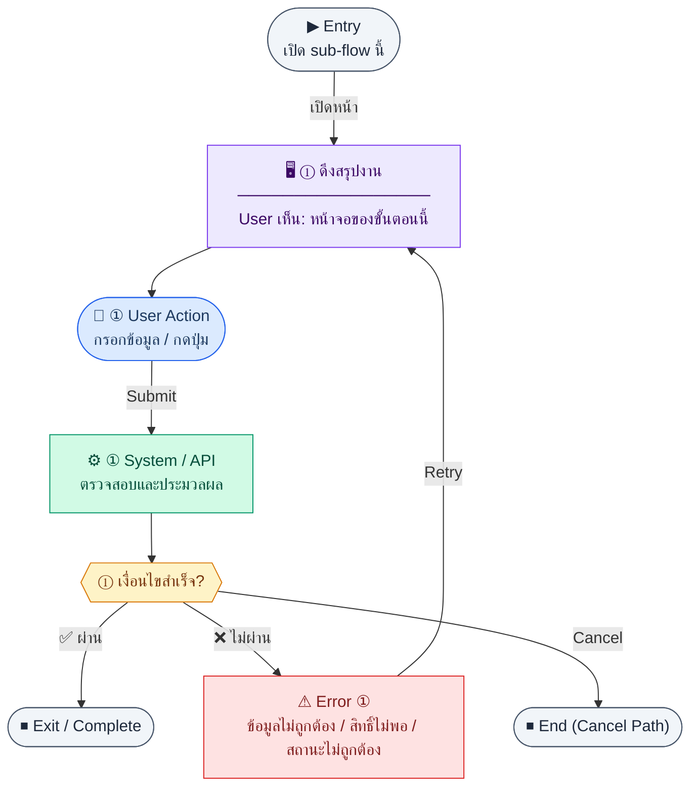
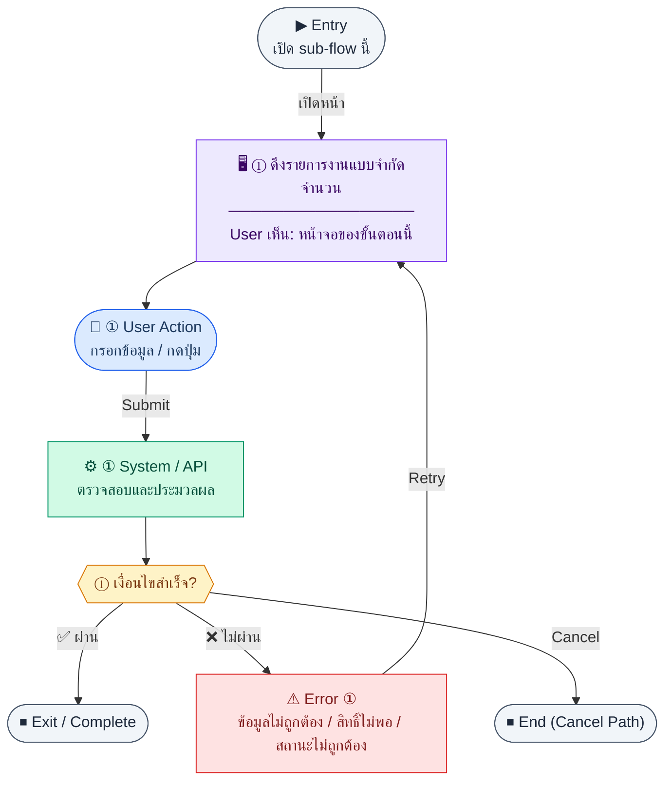
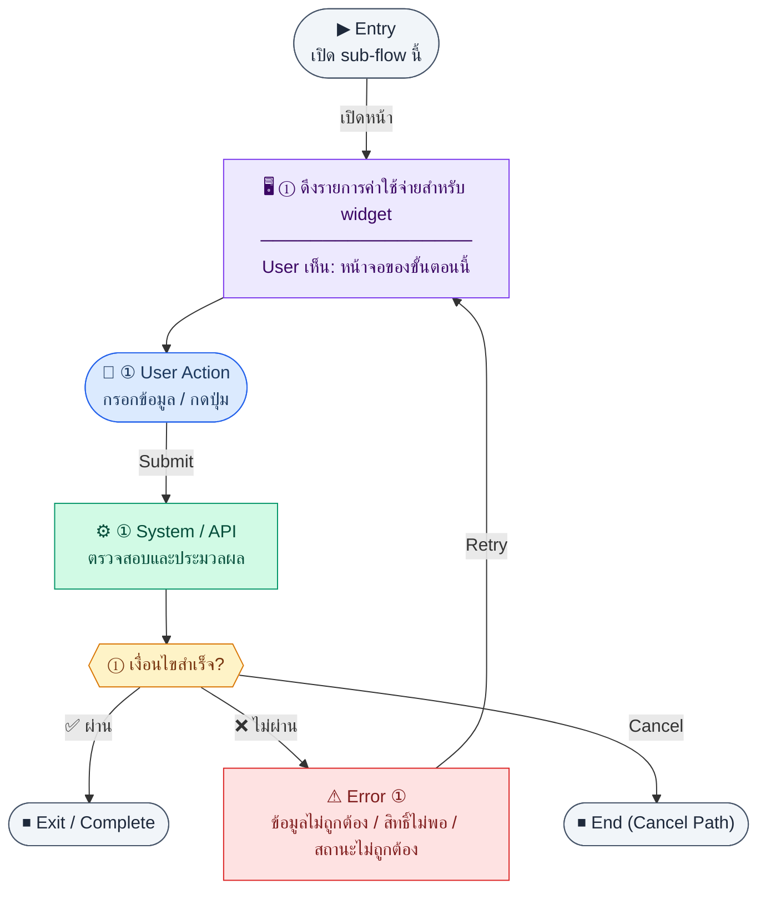
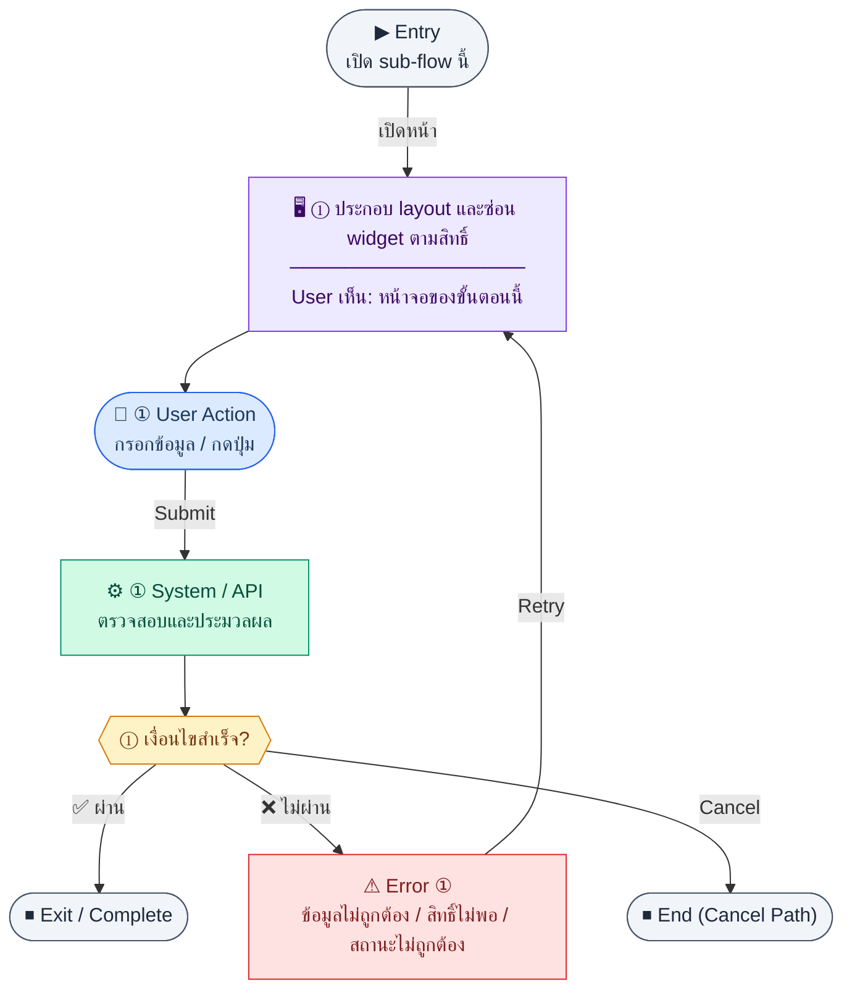

# UX Flow — PM Dashboard (ภาพรวมโมดูล)

ใช้เป็น UX flow สำหรับหน้า `/pm/dashboard` ที่รวม KPI จากงาน งบ และค่าใช้จ่าย โดยไม่มีตารางใหม่ — aggregate จากข้อมูลที่มี

**แหล่งอ้างอิงที่ผูกกับเอกสารนี้**

- Business requirement (BR): `Documents/Requirements/Release_1.md` (Feature 1.14 PM — Dashboard)
- Traceability: `Documents/Requirements/Release_1_traceability_mermaid.md` (โมดูล PM)
- Sequence / SD_Flow: `Documents/SD_Flow/PM/dashboard.md` (รวม endpoint จาก progress, budgets, expenses)
- Related screens (ตาม BR): `/pm/dashboard`

---

## E2E Scenario Flow

> ภาพรวมหน้า PM Dashboard ที่รวม KPI งาน, งานล่าสุด, ภาพรวมงบ และภาพรวมค่าใช้จ่ายไว้ในหน้าเดียว โดยผู้ใช้สามารถรีเฟรชข้อมูลและ drill-down ไปยังหน้ารายละเอียดของแต่ละโมดูลตามสิทธิ์ที่มี

### Scenario Summary

| Scenario | ขั้นตอน | ผลลัพธ์ |
|----------|---------|---------|
| ✅ เปิด dashboard สำเร็จ | เข้า `/pm/dashboard` → โหลด widgets หลักพร้อมกัน | เห็นภาพรวม PM module ในหน้าเดียว |
| ✅ ดู KPI งาน | dashboard เรียก task summary | เห็นจำนวนงาน, average progress, overdue count |
| ✅ ดูงานล่าสุด | dashboard โหลด recent tasks | เห็น recent tasks พร้อมลิงก์ไปหน้ารายละเอียด |
| ✅ ดูภาพรวมงบ | dashboard โหลด budgets overview | เห็น budget overview และ utilization summary |
| ✅ ดูภาพรวมค่าใช้จ่าย | dashboard โหลด expenses overview | เห็น expense overview และสถานะล่าสุด |
| ✅ Drill-down ไปโมดูลย่อย | ผู้ใช้กดการ์ดหรือรายการ | เข้าสู่ flow รายละเอียดของโมดูลที่เลือก |
| ⚠ บาง widget โหลดไม่สำเร็จ | endpoint ใด endpoint หนึ่ง fail | widget นั้นแสดง error/empty state แต่ทั้งหน้าไม่ล้ม |
| ⚠ ไม่มีสิทธิ์อ่านข้อมูลบางส่วน | ผู้ใช้ไม่มีสิทธิ์บางโมดูล | ระบบซ่อนหรือ disable drill-down ตาม RBAC |

---
## ชื่อ Flow & ขอบเขต

**Flow name:** `PM — Dashboard รวม KPI งาน งบ และค่าใช้จ่าย`

**Actor(s):** `pm_manager`, `finance_manager`, ผู้มีสิทธิ์อ่านข้อมูล PM ตาม RBAC

**Entry:** เมนู PM → Dashboard หรือ redirect หลัง login ตาม default route

**Exit:** ผู้ใช้เห็นภาพรวมและสามารถ drill-down ไปหน้ารายละเอียดของแต่ละโมดูล (ผ่านลิงก์ UI)

**Out of scope:** การคำนวณรายได้/กำไรขององค์กร (อยู่ที่ Global Dashboard ใน R2)

---

## Sub-flow A — โหลด KPI งาน (Progress summary)

### Scenario Flow

### สัญลักษณ์ Node (Color Legend)

| สี | Node shape | หมายถึง |
|----|-----------|---------|
| 🟣 ม่วง | สี่เหลี่ยม `["…"]` | **Screen / UI State** |
| 🔵 น้ำเงิน | วงกลม `(["…"])` | **User Action** |
| 🟢 เขียว | สี่เหลี่ยม `["…"]` | **System / API** |
| 🟡 เหลือง | เพชร `{{"…"}}` | **Decision** |
| 🔴 แดง | สี่เหลี่ยม `["…"]` | **Error / Edge case** |
| ⚫ เทา | วงรี `(["…"])` | **Start / End** |

---

### Step A1 — ดึงสรุปงาน

**Goal:** แสดงการ์ด KPI งานที่ด้านบนของ dashboard

**User sees:** ตัวเลข total, แยกสถานะ, `avgProgressPct`, `overdueCount` ฯลฯ

**User can do:** (ถ้ามี filter) เลือก scope โครงการ/ผู้รับผิดชอบ

**User Action:**
- ประเภท: `เลือกตัวเลือก / กดปุ่ม`
- ช่องที่ใช้กรอง:
  - `projectId` *(optional)* : scope โครงการ
  - `assigneeId` *(optional)* : ผู้รับผิดชอบ
  - `dateFrom` *(optional)* : วันเริ่มช่วงสรุป
  - `dateTo` *(optional)* : วันสิ้นสุดช่วงสรุป
  - `budgetId` *(optional)* : scope งบ
- ปุ่ม / Controls ในหน้านี้:
  - `[Refresh Widget]` → โหลด KPI งานใหม่
  - `[Open Tasks Dashboard]` → ไปหน้ารายการงาน

**Frontend behavior:** `GET /api/pm/progress/summary` query `projectId`, `assigneeId`, `dateFrom`, `dateTo`, `budgetId` ตาม SD_Flow

**System / AI behavior:** aggregate `pm_progress_tasks`

**Success:** widget งานแสดงครบ

**Error:** แสดง empty/error state ต่อ widget ไม่ให้ทั้งหน้าขาว

**Notes:** ควร cache สั้น ๆ และ refresh เมื่อผู้ใช้กด "รีเฟรช" หรือกลับเข้าหน้า

---

## Sub-flow B — รายการงานล่าสุด (Recent tasks)

### Scenario Flow

### สัญลักษณ์ Node (Color Legend)

| สี | Node shape | หมายถึง |
|----|-----------|---------|
| 🟣 ม่วง | สี่เหลี่ยม `["…"]` | **Screen / UI State** |
| 🔵 น้ำเงิน | วงกลม `(["…"])` | **User Action** |
| 🟢 เขียว | สี่เหลี่ยม `["…"]` | **System / API** |
| 🟡 เหลือง | เพชร `{{"…"}}` | **Decision** |
| 🔴 แดง | สี่เหลี่ยม `["…"]` | **Error / Edge case** |
| ⚫ เทา | วงรี `(["…"])` | **Start / End** |

---

### Step B1 — ดึงรายการงานแบบจำกัดจำนวน

**Goal:** แสดงงานล่าสุดหรืองานที่ต้องติดตาม

**User sees:** ตารางย่อ/รายการ compact พร้อมลิงก์ไปแก้ไข

**User can do:** คลิกไป `/pm/progress/:id/edit` หรือไป list เต็ม

**User Action:**
- ประเภท: `กดปุ่ม`
- ปุ่ม / Controls ในหน้านี้:
  - `[Open Task]` → ไปหน้า task ที่เลือก
  - `[View All Tasks]` → ไป `/pm/progress`
  - `[Retry]` → โหลด widget ใหม่

**Frontend behavior:** `GET /api/pm/progress` พร้อม `limit` เล็ก (เช่น 5–10) และ query `sortBy=updatedAt|dueDate`, `sortOrder=asc|desc` ตามที่ BE รองรับ

**System / AI behavior:** list + pagination meta

**Success:** แสดงรายการ

**Error:** จัดการเหมือน widget อื่น

**Notes:** การเรียงลำดับของ recent tasks ต้องยึด query sort จาก API เดียวกับ progress list; FE ไม่ reorder เองหลังรับ response

---

## Sub-flow C — ภาพรวมงบ (Budgets overview)

### Scenario Flow

### สัญลักษณ์ Node (Color Legend)

| สี | Node shape | หมายถึง |
|----|-----------|---------|
| 🟣 ม่วง | สี่เหลี่ยม `["…"]` | **Screen / UI State** |
| 🔵 น้ำเงิน | วงกลม `(["…"])` | **User Action** |
| 🟢 เขียว | สี่เหลี่ยม `["…"]` | **System / API** |
| 🟡 เหลือง | เพชร `{{"…"}}` | **Decision** |
| 🔴 แดง | สี่เหลี่ยม `["…"]` | **Error / Edge case** |
| ⚫ เทา | วงรี `(["…"])` | **Start / End** |

---

### Step C1 — ดึงรายการงบสำหรับการ์ด/ตารางย่อ

**Goal:** แสดงงบ active และ utilization ระดับสูง

**User sees:** การ์ดจำนวนงบ, ตารางย่อ หรือ sparkline ตามดีไซน์

**User can do:** คลิกไป `/pm/budgets` หรือ `/pm/budgets/:id`

**User Action:**
- ประเภท: `กดปุ่ม`
- ปุ่ม / Controls ในหน้านี้:
  - `[Open Budget]` → ไปหน้ารายละเอียดงบ
  - `[View All Budgets]` → ไป `/pm/budgets`
  - `[Retry]` → โหลด widget งบใหม่

**Frontend behavior:** `GET /api/pm/budgets` (อาจกรอง `status=active` ฝั่ง client)

**System / AI behavior:** list `pm_budgets` พร้อม `usedAmount`/`amount`

**Success:** ผู้ใช้เห็นสัดส่วนใช้จ่ายเทียบวงเงิน

**Error:** —

**Notes:** สำหรับ utilization รายงบละเอียด ให้ใช้ `GET /api/pm/budgets/:id/summary` บนหน้ารายละเอียด ไม่จำเป็นต้องโหลดทุกงบบน dashboard ถ้า performance ไม่เอื้อ

---

## Sub-flow D — ภาพรวมค่าใช้จ่าย (Expenses overview)

### Scenario Flow

### สัญลักษณ์ Node (Color Legend)

| สี | Node shape | หมายถึง |
|----|-----------|---------|
| 🟣 ม่วง | สี่เหลี่ยม `["…"]` | **Screen / UI State** |
| 🔵 น้ำเงิน | วงกลม `(["…"])` | **User Action** |
| 🟢 เขียว | สี่เหลี่ยม `["…"]` | **System / API** |
| 🟡 เหลือง | เพชร `{{"…"}}` | **Decision** |
| 🔴 แดง | สี่เหลี่ยม `["…"]` | **Error / Edge case** |
| ⚫ เทา | วงรี `(["…"])` | **Start / End** |

---

### Step D1 — ดึงรายการค่าใช้จ่ายสำหรับ widget

**Goal:** แสดงสถานะค่าใช้จ่ายล่าสุด (รออนุมัติ, approved, ฯลฯ)

**User sees:** ตารางย่อหรือ stacked bar ตามสถานะ

**User can do:** คลิกไป `/pm/expenses` หรือ `/pm/expenses/:id`

**User Action:**
- ประเภท: `เลือกตัวเลือก / กดปุ่ม`
- ช่องที่ใช้กรอง:
  - `status` *(optional)* : submitted, approved, rejected
- ปุ่ม / Controls ในหน้านี้:
  - `[Open Expense]` → ไปหน้ารายละเอียดค่าใช้จ่าย
  - `[View All Expenses]` → ไป `/pm/expenses`
  - `[Retry]` → โหลด widget ค่าใช้จ่ายใหม่

**Frontend behavior:** `GET /api/pm/expenses` พร้อม `limit` และ filter สถานะที่สนใจ (เช่น `submitted`)

**System / AI behavior:** list `pm_expenses`

**Success:** widget ค่าใช้จ่ายสมบูรณ์

**Error:** —

**Notes:** สอดคล้อง BR ว่า dashboard รวมทั้ง tasks, budgets, expenses

---

## Sub-flow E — การประกอบหน้าและสิทธิ์ (Composition)

### Scenario Flow

### สัญลักษณ์ Node (Color Legend)

| สี | Node shape | หมายถึง |
|----|-----------|---------|
| 🟣 ม่วง | สี่เหลี่ยม `["…"]` | **Screen / UI State** |
| 🔵 น้ำเงิน | วงกลม `(["…"])` | **User Action** |
| 🟢 เขียว | สี่เหลี่ยม `["…"]` | **System / API** |
| 🟡 เหลือง | เพชร `{{"…"}}` | **Decision** |
| 🔴 แดง | สี่เหลี่ยม `["…"]` | **Error / Edge case** |
| ⚫ เทา | วงรี `(["…"])` | **Start / End** |

---

### Step E1 — ประกอบ layout และซ่อน widget ตามสิทธิ์

**Goal:** ไม่แสดงข้อมูลโมดูลที่ผู้ใช้ไม่มีสิทธิ์อ่าน

**User sees:** เฉพาะ widget ที่อนุญาต

**User can do:** ใช้งานลิงก์ drill-down เฉพาะ route ที่อนุญาต

**User Action:**
- ประเภท: `กดปุ่ม`
- ปุ่ม / Controls ในหน้านี้:
  - `[Open Allowed Widget]` → ใช้งาน drill-down เฉพาะส่วนที่มีสิทธิ์
  - `[Refresh Permissions]` → โหลด `/me` ใหม่เมื่อสิทธิ์เปลี่ยน

**Frontend behavior:**

- ใช้ permission จาก `GET /api/auth/me` / login payload เพื่อซ่อน widget และลิงก์
- ยังคงยิง API เฉพาะ widget ที่เปิด — ลด unnecessary calls

**System / AI behavior:** แต่ละ API บังคับ permission ฝั่ง BE อยู่ดี

**Success:** ไม่มี 403 เกลื่อนจาก widget ที่ถูกซ่อนแล้ว

**Error:** ถ้า permission เปลี่ยนระหว่าง session ให้ refresh `/me` และอัปเดต layout

**Notes:** การซ่อนเมนู/widget ไม่แทนการบังคับสิทธิ์ที่ API

---

## Coverage Checklist

| Endpoint | Covered in UX file | Notes |
|----------|-------------------|-------|
| `GET /api/pm/progress/summary` | Sub-flow A — โหลด KPI งาน (Progress summary) | Widget; query projectId, assigneeId, dateFrom, dateTo, budgetId |
| `GET /api/pm/progress` | Sub-flow B — รายการงานล่าสุด (Recent tasks) | Small limit; query sortBy/sortOrder; drill-down to progress |
| `GET /api/pm/budgets` | Sub-flow C — ภาพรวมงบ (Budgets overview) | Optional client filter active |
| `GET /api/pm/expenses` | Sub-flow D — ภาพรวมค่าใช้จ่าย (Expenses overview) | Limit + status filters |
| `GET /api/auth/me` | Sub-flow E — การประกอบหน้าและสิทธิ์ (Composition) | RBAC widget visibility; not in `dashboard.md` inventory |

## Coverage Lock Notes (2026-04-16)

### In-scope endpoints
- `GET /api/pm/progress/summary`
- `GET /api/pm/progress`
- `GET /api/pm/budgets`
- `GET /api/pm/expenses`
- `GET /api/auth/me`

### Widget read-model lock
- KPI widgets ใช้ scalar summary จาก `progress/summary`
- recent tasks ใช้ list จาก `GET /api/pm/progress`
- budgets/expenses overview ต้องใช้ list rows จาก endpoints ต้นทาง ไม่ aggregate ฝั่ง FE เอง

### UX lock
- แต่ละ widget ควรระบุ query/filter ที่ใช้จริง
- permission-based widget visibility ต้องยึด `/api/auth/me`
