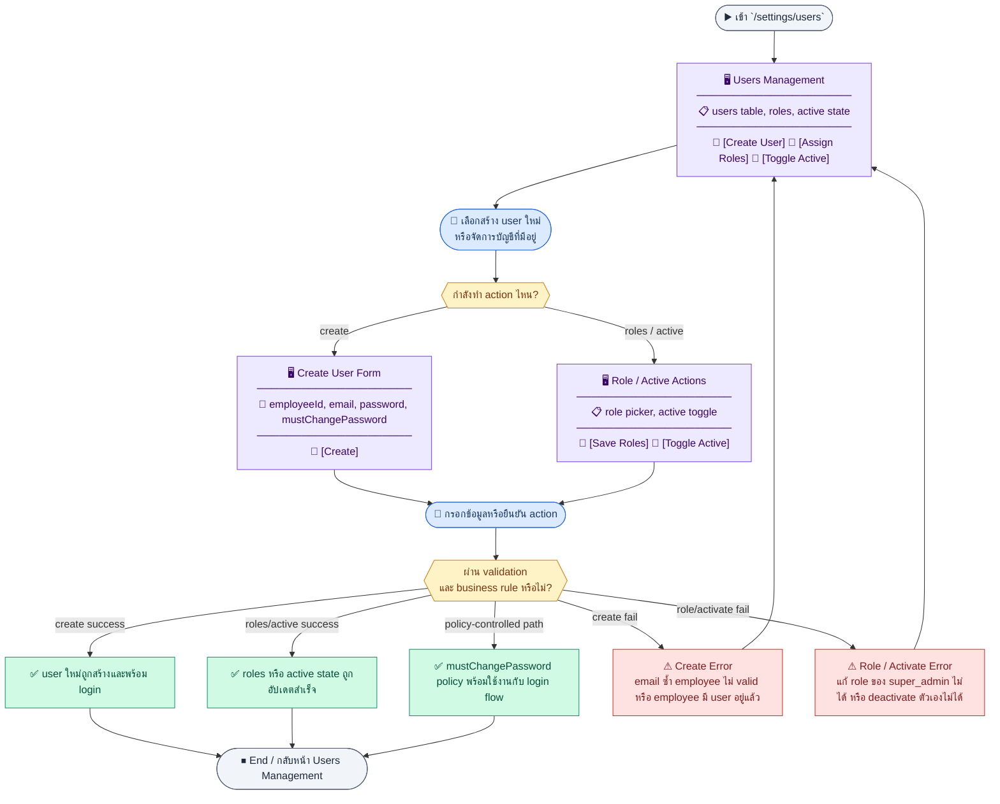
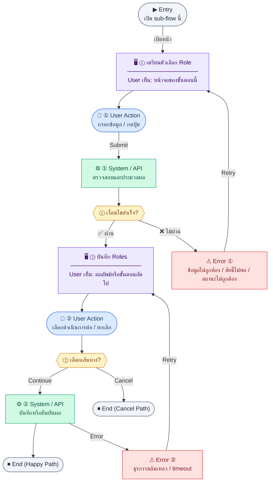
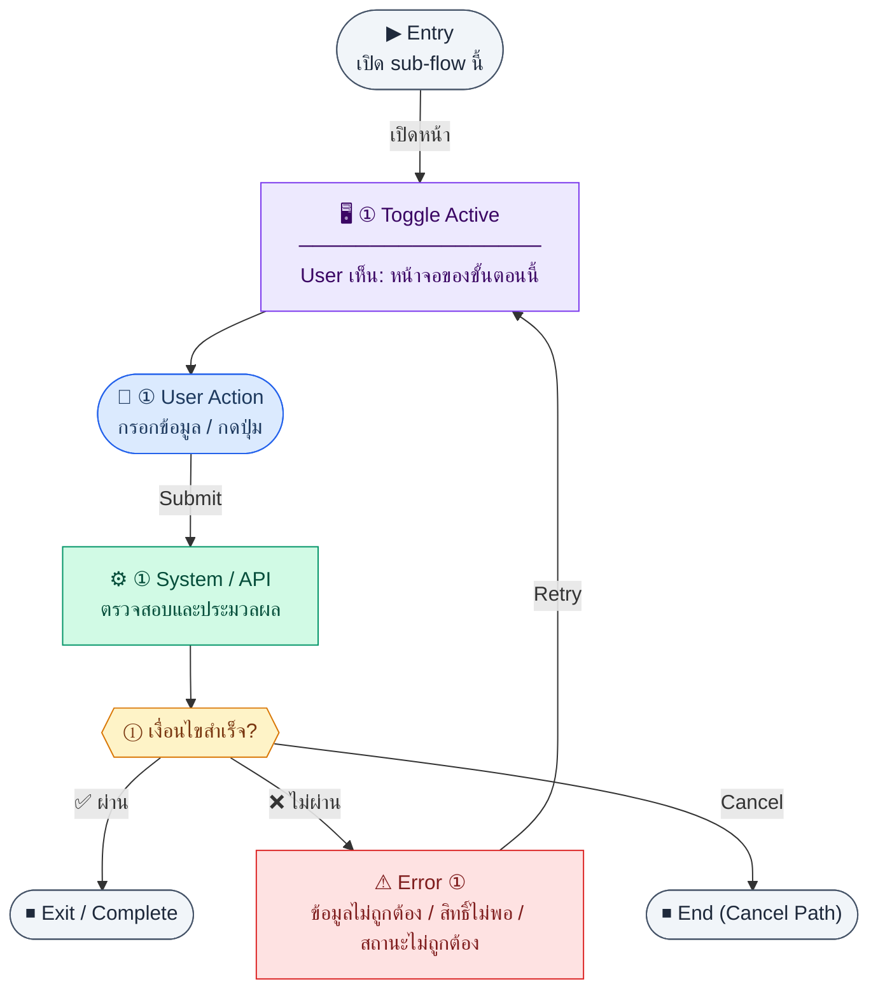

# UX Flow — Settings จัดการผู้ใช้ (User Management)

ใช้เป็น UX flow มาตรฐานสำหรับหน้า `/settings/users` ใน Release 1 โดยครอบคลุม endpoint กลุ่มผู้ใช้จาก SD_Flow `user_role_permission.md` และ business rules ใน BR

**แหล่งอ้างอิงที่ผูกกับเอกสารนี้**

- Business requirement (BR): `Documents/Requirements/Release_1.md` (Feature 1.15 Settings — User Management)
- Traceability: `Documents/Requirements/Release_1_traceability_mermaid.md` (Settings / users)
- Sequence / SD_Flow: `Documents/SD_Flow/User_Login/user_role_permission.md` (ส่วน Users)
- Related screens (ตาม BR): `/settings/users`

---

## E2E Scenario Flow

> ภาพรวมการจัดการผู้ใช้ใน settings ตั้งแต่ดูรายชื่อบัญชี, สร้าง user ใหม่โดยผูกกับพนักงาน active ที่ยังไม่มีบัญชี, กำหนด roles, เปิดหรือปิดการใช้งาน, จนถึงการบังคับให้ผู้ใช้ใหม่เปลี่ยนรหัสผ่านและการ logout อัตโนมัติเมื่อถูก deactivate

### Scenario Summary

| Scenario | ขั้นตอน | ผลลัพธ์ |
|----------|---------|---------|
| ✅ ดูรายการผู้ใช้ | เข้า `/settings/users` → load users list | เห็น users พร้อม employee info, roles และสถานะ active |
| ✅ สร้างผู้ใช้ใหม่ | เปิด create form → เลือก employee → กรอก email/password → submit | สร้าง user ใหม่สำเร็จและอาจ assign role ตั้งแต่แรกได้ |
| ✅ มอบหมาย roles ให้ผู้ใช้ | เปิด role picker → โหลด roles → save | roles ของ user เป้าหมายถูกอัปเดต |
| ✅ เปิด/ปิดการใช้งาน user | ใช้ toggle active | สถานะบัญชีถูกเปลี่ยน และถ้า deactivate จะ logout active session |
| ✅ ผู้ใช้ใหม่ต้องเปลี่ยนรหัสผ่าน | Admin สร้างด้วย `mustChangePassword=true` → ผู้ใช้ login ครั้งแรก | ระบบบังคับไป flow เปลี่ยนรหัสผ่านก่อนใช้งานเต็มรูปแบบ |
| ⚠ สร้าง user ไม่ผ่าน | email ซ้ำ, employee ไม่ active, หรือ employee ถูกผูก user แล้ว | ระบบ block การสร้างและแสดง error |
| ⚠ เปลี่ยน roles ไม่ได้ | พยายามแก้ roles ของ `super_admin` หรือไม่มีสิทธิ์ | ระบบ block action และแจ้งเหตุผล |
| ⚠ deactivate ตัวเองไม่ได้ | admin toggle ปิดบัญชีของตัวเอง | ระบบปฏิเสธการเปลี่ยนแปลงเพื่อกัน self-lockout |

---
## ชื่อ Flow & ขอบเขต

**Flow name:** `Settings — รายชื่อผู้ใช้ กำหนดบทบาท และเปิด/ปิดการใช้งาน`

**Actor(s):** `super_admin` หรือ admin ที่ได้รับสิทธิ์จัดการผู้ใช้ใน settings

**Entry:** `/settings/users`

**Exit:** อัปเดต roles หรือสถานะ active ของผู้ใช้เป้าหมายสำเร็จ หรือยกเลิกโดยไม่เปลี่ยนแปลง

**Out of scope:** การสมัครสมาชิกด้วยตนเอง (ไม่มี self-registration), การแก้ permission ระดับเมทริกซ์ของ role (อยู่ที่ R1-16)

---

## Endpoint กลุ่มผู้ใช้ (จาก `user_role_permission.md`)

| Method | Path | บทบาทใน UX นี้ |
|--------|------|----------------|
| `GET` | `/api/settings/users` | โหลดตารางผู้ใช้ |
| `POST` | `/api/settings/users` | สร้างบัญชีใหม่ + ผูกพนักงาน (admin เท่านั้น) |
| `PATCH` | `/api/settings/users/:id/roles` | บันทึก roles ที่ผูกกับ user |
| `PATCH` | `/api/settings/users/:id/activate` | toggle active/inactive |
| `GET` | `/api/settings/roles` | ดึงรายการ role สำหรับ dropdown / multi-select ตอนมอบหมาย roles |
| `GET` | `/api/hr/employees` | (optional) employee picker — ใช้ `hasUserAccount=false` เพื่อแสดงเฉพาะพนักงานที่ยังไม่มี login |

---

## Sub-flow A — โหลดรายการผู้ใช้

### Scenario Flow

### สัญลักษณ์ Node (Color Legend)

| สี | Node shape | หมายถึง |
|----|-----------|---------|
| 🟣 ม่วง | สี่เหลี่ยม `["…"]` | **Screen / UI State** |
| 🔵 น้ำเงิน | วงกลม `(["…"])` | **User Action** |
| 🟢 เขียว | สี่เหลี่ยม `["…"]` | **System / API** |
| 🟡 เหลือง | เพชร `{{"…"}}` | **Decision** |
| 🔴 แดง | สี่เหลี่ยม `["…"]` | **Error / Edge case** |
| ⚫ เทา | วงรี `(["…"])` | **Start / End** |

---

### Step A1 — เปิดหน้า Users

**Goal:** แสดงรายชื่อบัญชีพร้อมข้อมูลพนักงานและ roles ปัจจุบัน

**User sees:** ตาราง users, สถานะ active, คอลัมน์ roles, การกระทำต่อแถว

**User can do:** ค้นหา/กรอง (ถ้า BE รองรับ query), **เปิดฟอร์มสร้างผู้ใช้**, เปิด drawer/modal มอบหมาย roles, toggle เปิดใช้งาน

**User Action:**
- ประเภท: `กรอกข้อมูล / เลือกตัวเลือก`
- ช่องที่ใช้กรอง/ค้นหา:
  - `search` *(optional)* : ค้นหาจากชื่อ, email, username
  - `roleId` *(optional)* : กรองตาม role
  - `isActive` *(optional)* : active/inactive
- ปุ่ม / Controls ในหน้านี้:
  - `[Create User]` → เปิดฟอร์มสร้างบัญชี
  - `[Assign Roles]` → เปิด drawer/modal มอบหมาย role
  - `[Toggle Active]` → เปลี่ยนสถานะบัญชี

**Frontend behavior:**

- เรียก `GET /api/settings/users` พร้อม query pagination/filter ตามสัญญา API
- แสดง loading และ empty state

**System / AI behavior:** join `users`, `user_roles`, `roles`, `employees` ตาม BR

**Success:** ตารางแสดงข้อมูลครบ

**Error:** 401/403/500 — แจ้งและ retry

**Notes:** ไม่ควรแคชนานเกินไปเพราะการเปลี่ยน roles มีผลทันทีต่อการเข้าใช้

---

## Sub-flow B — มอบหมาย Roles ให้ผู้ใช้

### Scenario Flow

### สัญลักษณ์ Node (Color Legend)

| สี | Node shape | หมายถึง |
|----|-----------|---------|
| 🟣 ม่วง | สี่เหลี่ยม `["…"]` | **Screen / UI State** |
| 🔵 น้ำเงิน | วงกลม `(["…"])` | **User Action** |
| 🟢 เขียว | สี่เหลี่ยม `["…"]` | **System / API** |
| 🟡 เหลือง | เพชร `{{"…"}}` | **Decision** |
| 🔴 แดง | สี่เหลี่ยม `["…"]` | **Error / Edge case** |
| ⚫ เทา | วงรี `(["…"])` | **Start / End** |

---

### Step B1 — เตรียมตัวเลือก Role

**Goal:** ให้ผู้ดูแลเลือก role ได้จากชุดที่ถูกต้องในระบบ

**User sees:** multi-select หรือ checklist ของ roles

**User can do:** เลือก/ยกเลิก role หลายรายการ

**User Action:**
- ประเภท: `เลือกตัวเลือก`
- ช่องที่ต้องเลือก:
  - `roleIds[]` *(required)* : รายการ role ที่ต้องมอบหมาย
- ปุ่ม / Controls ในหน้านี้:
  - `[Save Role Selection]` → ไปขั้นตอนบันทึก
  - `[Cancel]` → ปิด modal

**Frontend behavior:**

- โหลด `GET /api/settings/roles` เพื่อเติมตัวเลือก (endpoint เดียวกับหน้า role management แต่ใช้เฉพาะโหมด list สำหรับ dropdown)
- แยก role ระบบที่แก้ไม่ได้ (`isSystem`) ใน UI ถ้า BR ต้องการควบคุมการมอบหมาย `super_admin`

**System / AI behavior:** ส่งรายการ roles ที่ผู้เรียกมีสิทธิ์เห็น

**Success:** ตัวเลือกพร้อม

**Error:** โหลด roles ไม่ได้ → ไม่เปิด modal มอบหมาย และแจ้ง error

**Notes:** BR กำหนดห้ามเปลี่ยน roles ของ `super_admin`

### Step B2 — บันทึก Roles

**Goal:** persist การมอบหมาย roles ให้ user เป้าหมาย

**User sees:** ปุ่มบันทึก, loading, toast สำเร็จ/ล้มเหลว

**User can do:** ยืนยันการบันทึก

**User Action:**
- ประเภท: `กดปุ่ม`
- ปุ่ม / Controls ในหน้านี้:
  - `[Assign Roles]` → เรียก `PATCH /api/settings/users/:id/roles`
  - `[Retry Save]` → ลองบันทึก role ใหม่
  - `[Cancel]` → ยกเลิก

**Frontend behavior:**

- `PATCH /api/settings/users/:id/roles` พร้อม body ตามสัญญา (เช่นรายการ `roleIds`)
- optimistic update เป็น optional; ถ้าไม่ใช้ ให้ refresh `GET /api/settings/users` หลังสำเร็จ

**System / AI behavior:** อัปเดต `user_roles`, validate กฎพิเศษ super_admin, อาจบันทึก `permission_audit_logs` เมื่อมีผลต่อสิทธิ์ (ตามการออกแบบ BE)

**Success:** 200; ตารางสะท้อน roles ใหม่

**Error:** 403 พยายามแก้ super_admin, 400 body ไม่ถูกต้อง

**Notes:** ผู้ใช้ที่ถูกเปลี่ยน roles อาจต้อง refresh session — optional UX: แจ้งว่า "มีผลในการเข้าใช้ครั้งถัดไป" หรือบังคับ logout ฝั่ง client หากได้รับสัญญาณจาก BE

---

## Sub-flow C — เปิด/ปิดการใช้งานบัญชี (Activate)

### Scenario Flow

### สัญลักษณ์ Node (Color Legend)

| สี | Node shape | หมายถึง |
|----|-----------|---------|
| 🟣 ม่วง | สี่เหลี่ยม `["…"]` | **Screen / UI State** |
| 🔵 น้ำเงิน | วงกลม `(["…"])` | **User Action** |
| 🟢 เขียว | สี่เหลี่ยม `["…"]` | **System / API** |
| 🟡 เหลือง | เพชร `{{"…"}}` | **Decision** |
| 🔴 แดง | สี่เหลี่ยม `["…"]` | **Error / Edge case** |
| ⚫ เทา | วงรี `(["…"])` | **Start / End** |

---

### Step C1 — Toggle Active

**Goal:** deactivate user เพื่อหยุดการเข้าระบบ หรือ activate กลับมา

**User sees:** สวิตช์หรือปุ่ม activate/deactivate + confirm dialog เมื่อ deactivate

**User can do:** ยืนยันการเปลี่ยนสถานะ

**User Action:**
- ประเภท: `เลือกตัวเลือก / กดปุ่ม`
- ช่องที่ต้องกรอก:
  - `isActive` *(required)* : true หรือ false ตาม action
  - `deactivationReason` *(optional)* : เหตุผลเมื่อปิดบัญชี
- ปุ่ม / Controls ในหน้านี้:
  - `[Deactivate User]` หรือ `[Activate User]` → เรียก endpoint activate
  - `[Cancel]` → ยกเลิก

**Frontend behavior:**

- `PATCH /api/settings/users/:id/activate` พร้อม body ตามสัญญา (เช่น `{ "isActive": true|false }` — ชื่อฟิลด์ให้ตรงกับ BE)
- disable สวิตช์ขณะรอ response

**System / AI behavior:** BR ระบุ user ที่ถูก deactivate → logout session ที่ active อัตโนมัติ

**Success:** 200; อัปเดต badge ในตาราง

**Error:** 403 พยายาม deactivate ตนเอง (BR ห้าม), 409 กฎอื่น

**Notes:** ต้องป้องกันไม่ให้ผู้ใช้ปิดตัวเองโดยไม่ตั้งใจ — ซ่อนหรือ disable control บนแถวของตนเอง

---

## Sub-flow D — สร้างบัญชีผู้ใช้ใหม่ (`POST /api/settings/users`)

### Scenario Flow

### สัญลักษณ์ Node (Color Legend)

| สี | Node shape | หมายถึง |
|----|-----------|---------|
| 🟣 ม่วง | สี่เหลี่ยม `["…"]` | **Screen / UI State** |
| 🔵 น้ำเงิน | วงกลม `(["…"])` | **User Action** |
| 🟢 เขียว | สี่เหลี่ยม `["…"]` | **System / API** |
| 🟡 เหลือง | เพชร `{{"…"}}` | **Decision** |
| 🔴 แดง | สี่เหลี่ยม `["…"]` | **Error / Edge case** |
| ⚫ เทา | วงรี `(["…"])` | **Start / End** |

---

### Step D1 — เปิดฟอร์มสร้าง user

**Goal:** รวบรวม email, รหัสผ่านเริ่มต้น, พนักงานที่ผูก, และ (optional) roles

**User sees:** ปุ่ม "เพิ่มผู้ใช้" → modal หรือหน้าย่อย

**User can do:** กรอกฟิลด์, เลือกพนักงานจาก autocomplete

**User Action:**
- ประเภท: `กรอกข้อมูล / เลือกตัวเลือก`
- ช่องที่ต้องกรอก:
  - `email` *(required)* : email สำหรับ login
  - `password` *(required)* : รหัสผ่านเริ่มต้น
  - `employeeId` *(required)* : พนักงานที่ผูก
  - `roleIds[]` *(optional)* : roles เริ่มต้น
  - `mustChangePassword` *(optional)* : บังคับเปลี่ยนรหัสผ่านครั้งแรก
- ปุ่ม / Controls ในหน้านี้:
  - `[Create User]` → ไปขั้นตอน submit
  - `[Cancel]` → ปิดฟอร์ม

**Frontend behavior:**

- โหลดตัวเลือกพนักงาน: `GET /api/hr/employees?hasUserAccount=false` (ถ้า BE รองรับตาม BR) หรือ list แล้วกรองฝั่ง FE ชั่วคราว
- รองรับ query string **`?employeeId=`** เมื่อนำทางมาจากหน้า HR หลังสร้างพนักงาน — pre-select พนักงานใน picker
- โหลด roles: `GET /api/settings/roles` (multi-select optional)

**System / AI behavior:** —

**Success:** ฟอร์มพร้อม submit

**Error:** โหลดรายการพนักงานไม่ได้ → แจ้ง error

**Notes:** BR กำหนด `employeeId` บังคับและหนึ่งพนักงานต่อหนึ่ง user

### Step D2 — Submit สร้างบัญชี

**Goal:** persist user + hash password ฝั่ง BE + optional `user_roles`

**User sees:** loading บนปุ่มยืนยัน

**User can do:** รอ

**User Action:**
- ประเภท: `กดปุ่ม`
- ปุ่ม / Controls ในหน้านี้:
  - `[Submit Create User]` → เรียก `POST /api/settings/users`
  - `[Retry Create]` → ลองใหม่เมื่อเกิด error
  - `[Cancel]` → ยกเลิก

**Frontend behavior:**

- `POST /api/settings/users` ตามสัญญา BR (เช่น `email`, `password`, `mustChangePassword`, `employeeId`, `roleIds`)

**System / AI behavior:** ตรวจ email unique, พนักงาน active และยังไม่ถูกผูก user

**Success:** 201 → toast สำเร็จ → `GET /api/settings/users` refresh ตาราง → ปิด modal

**Error:** 409 (email ซ้ำ / พนักงานมี user แล้ว), 403, 422

**Notes:** ถ้า `mustChangePassword: true` แจ้งผู้ใช้ใหม่ให้เปลี่ยนรหัสที่ `/me` หลัง login ครั้งแรก (ตามนโยบายผลิตภัณฑ์)

---

## Coverage Checklist

| Endpoint | Covered in UX file | Notes |
|----------|-------------------|-------|
| `GET /api/settings/users` | Sub-flow A — โหลดรายการผู้ใช้ | Table + pagination/filter |
| `POST /api/settings/users` | Sub-flow D — สร้างบัญชีผู้ใช้ใหม่ | Employee picker + optional roles |
| `GET /api/hr/employees` | Sub-flow D — สร้างบัญชีผู้ใช้ใหม่ | Optional `hasUserAccount=false` |
| `GET /api/settings/roles` | Sub-flow B — มอบหมาย Roles ให้ผู้ใช้ | Step B1 role options |
| `PATCH /api/settings/users/:id/roles` | Sub-flow B — มอบหมาย Roles ให้ผู้ใช้ | Step B2 persist |
| `PATCH /api/settings/users/:id/activate` | Sub-flow C — เปิด/ปิดการใช้งานบัญชี (Activate) | Self-deactivate guard |

## Coverage Lock Notes (2026-04-16)

### In-scope endpoints
- `GET /api/settings/users`
- `POST /api/settings/users`
- `PATCH /api/settings/users/:id/roles`
- `PATCH /api/settings/users/:id/activate`
- `GET /api/settings/roles`
- `GET /api/hr/employees`

### Canonical fields
- user create ต้องยึด `mustChangePassword`, `employeeId`, `roleIds`
- employee picker ต้องอิง employee list ที่ filter `hasUserAccount=false`

### UX lock
- deactivate ต้องสื่อว่ามีผล revoke sessions
- หลัง save role assignment ให้ refresh จาก server state ไม่ใช้ optimistic mapping ล้วน ๆ
