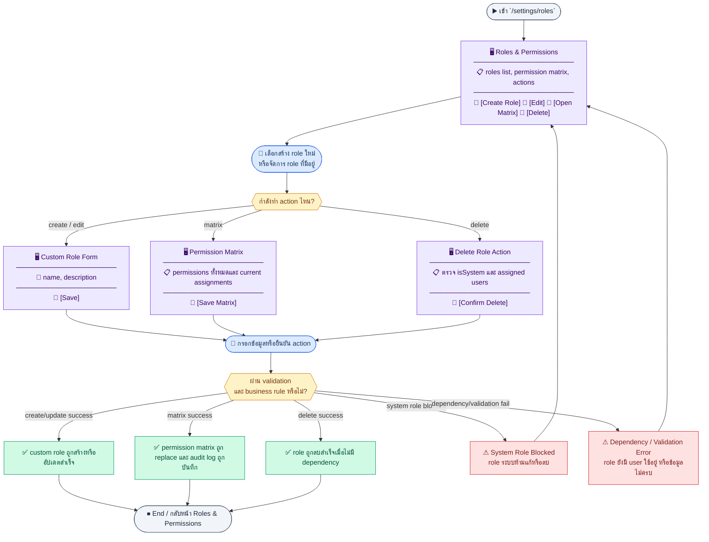
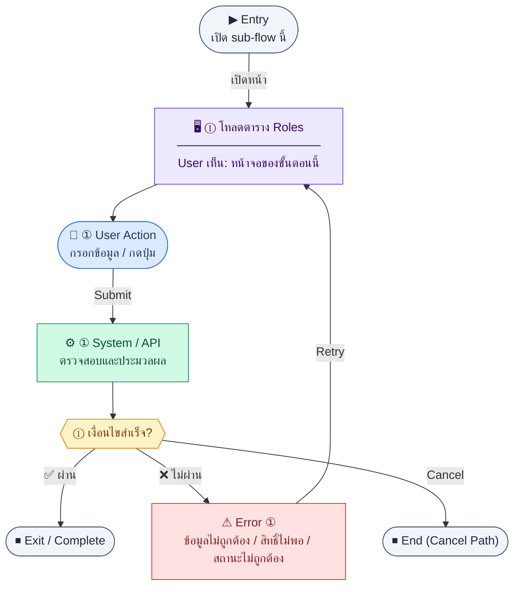
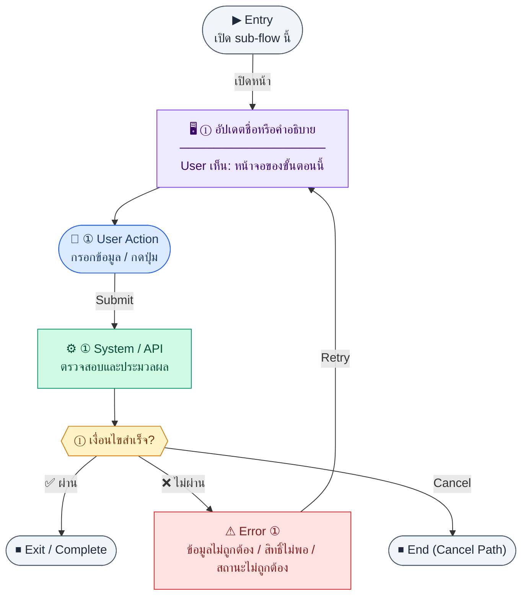
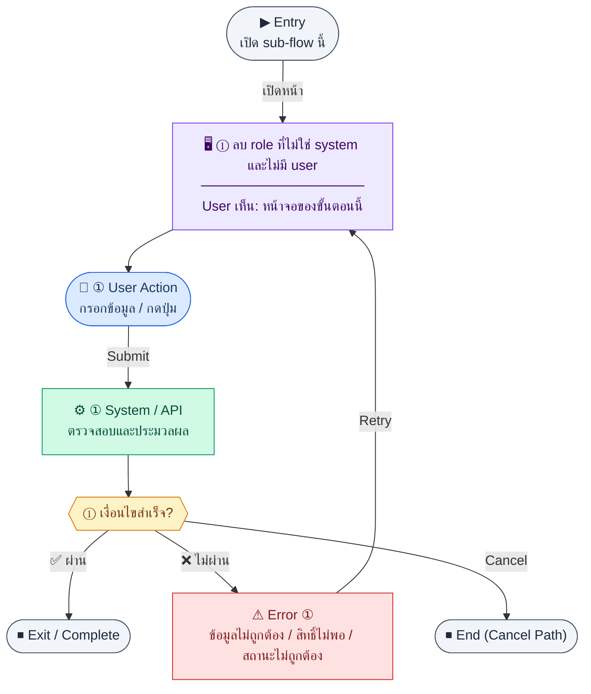
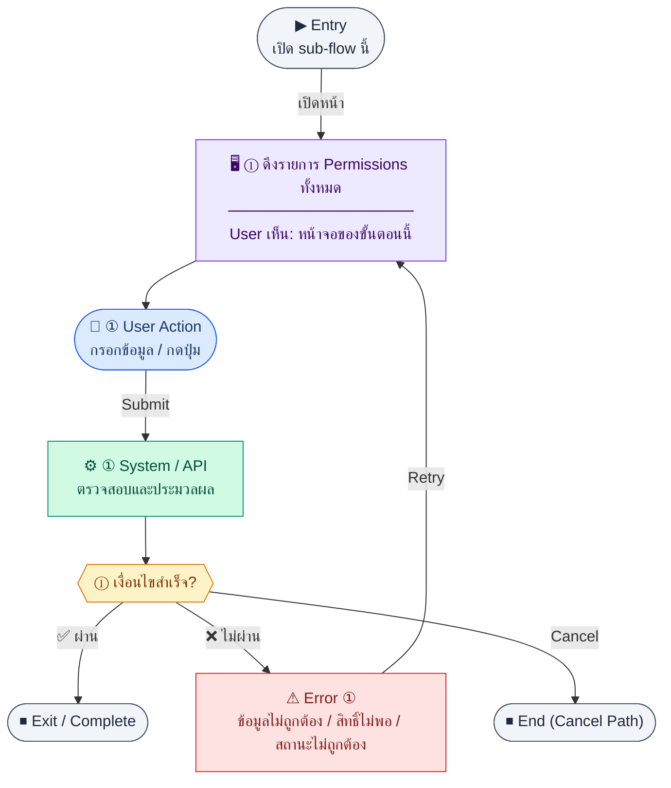
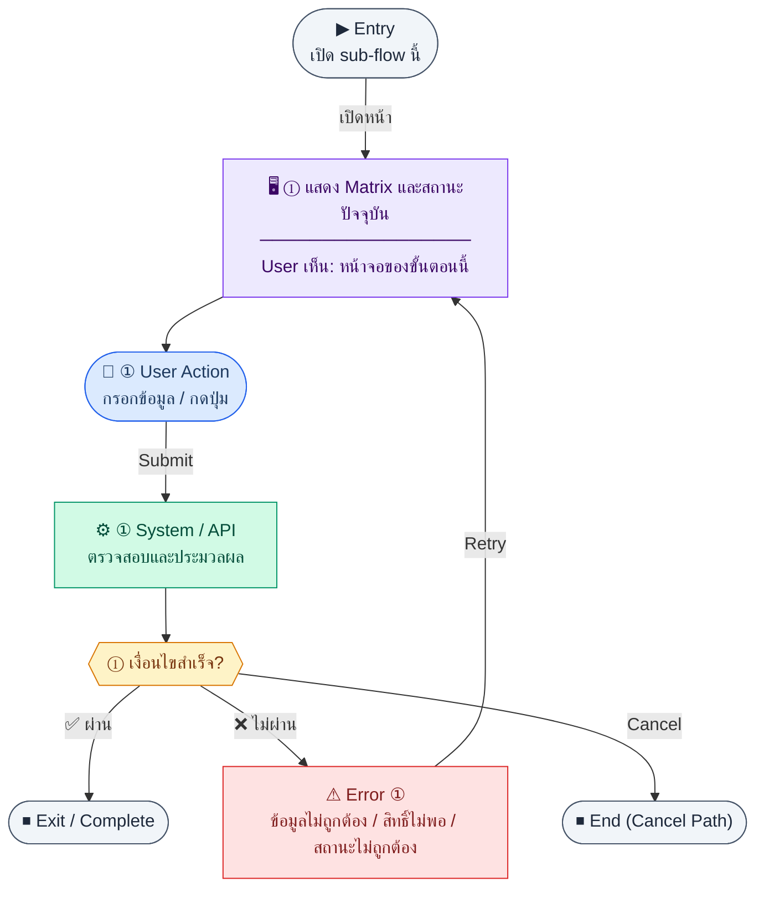

# UX Flow — Settings บทบาทและสิทธิ์ (Role & Permission)

ใช้เป็น UX flow มาตรฐานสำหรับหน้า `/settings/roles` ใน Release 1 โดยครอบคลุม **ทุก endpoint กลุ่ม roles/permissions** จาก `Documents/SD_Flow/User_Login/user_role_permission.md`

**แหล่งอ้างอิงที่ผูกกับเอกสารนี้**

- Business requirement (BR): `Documents/Requirements/Release_1.md` (Feature 1.16 Settings — Role & Permission Management)
- Traceability: `Documents/Requirements/Release_1_traceability_mermaid.md` (Settings / roles & permissions)
- Sequence / SD_Flow: `Documents/SD_Flow/User_Login/user_role_permission.md` (ส่วน Roles + Permissions)
- Related screens (ตาม BR): `/settings/roles`

---

## E2E Scenario Flow

> ภาพรวมการจัดการ roles และ permission matrix ตั้งแต่ดูรายการ role, สร้าง custom role, แก้ไขหรือลบ role ที่อนุญาต, โหลดชุด permissions ทั้งหมด, ปรับ matrix แบบแทนที่ทั้งชุด, และบันทึก audit log ทุกครั้งที่มีการ grant หรือ revoke สิทธิ์



### Scenario Summary

| Scenario | ขั้นตอน | ผลลัพธ์ |
|----------|---------|---------|
| ✅ ดูรายการ roles | เข้า `/settings/roles` → load roles list | เห็น roles ทั้งหมด, `isSystem`, และจำนวน permissions |
| ✅ สร้าง custom role | เปิด create form → กรอกชื่อ/คำอธิบาย → submit | สร้าง role ใหม่ที่องค์กรกำหนดเองได้ |
| ✅ แก้ไข custom role | เปิด edit ของ role ที่ไม่ใช่ system → save | ชื่อหรือคำอธิบาย role ถูกอัปเดต |
| ✅ โหลด permission matrix | เลือก role → load permissions | เห็นรายการ permissions สำหรับกำหนด matrix |
| ✅ บันทึก permission matrix | เลือกชุดสิทธิ์ → save | permission ของ role ถูก replace ทั้งชุดและมี audit log |
| ✅ ลบ custom role | กด delete role ที่ไม่ใช่ system และไม่มี user ผูก | role ถูกลบสำเร็จ |
| ⚠ แก้ไขหรือลบ system role ไม่ได้ | ผู้ใช้พยายามเปลี่ยน `super_admin` หรือ system role อื่น | ระบบ block action ตาม `isSystem=true` |
| ⚠ ลบ role ไม่ได้เพราะมี user ใช้อยู่ | กด delete role ที่ยังถูก assign | ระบบปฏิเสธการลบและแจ้ง dependency |

---
## ชื่อ Flow & ขอบเขต

**Flow name:** `Settings — CRUD Role และกำหนด Permission Matrix`

**Actor(s):** `super_admin` หรือ admin ที่มีสิทธิ์จัดการ roles

**Entry:** `/settings/roles`

**Exit:** สร้าง/แก้ไข/ลบ role (ตามกฎ), หรืออัปเดต permission ของ role สำเร็จ

**Out of scope:** การจัดการบัญชีผู้ใช้รายคน (ดู `R1-15_Settings_User_Management.md`)

---

## Endpoint ทั้งหมด (Roles & Permissions จาก `user_role_permission.md`)

| Method | Path | คำอธิบาย (ตาม BR + SD_Flow) |
|--------|------|------------------------------|
| `GET` | `/api/settings/roles` | รายการ roles + จำนวน permission / metadata |
| `POST` | `/api/settings/roles` | สร้าง custom role |
| `PATCH` | `/api/settings/roles/:id` | แก้ไขชื่อ/คำอธิบายของ role |
| `DELETE` | `/api/settings/roles/:id` | ลบ role ที่ไม่ใช่ system และไม่มี user ผูก |
| `GET` | `/api/settings/permissions` | รายการ permissions ทั้งหมดสำหรับ matrix |
| `PUT` | `/api/settings/roles/:id/permissions` | กำหนด permissions ของ role แบบ replace ทั้งชุด |

---

## Sub-flow A — รายการ Roles

### Scenario Flow

### สัญลักษณ์ Node (Color Legend)

| สี | Node shape | หมายถึง |
|----|-----------|---------|
| 🟣 ม่วง | สี่เหลี่ยม `["…"]` | **Screen / UI State** |
| 🔵 น้ำเงิน | วงกลม `(["…"])` | **User Action** |
| 🟢 เขียว | สี่เหลี่ยม `["…"]` | **System / API** |
| 🟡 เหลือง | เพชร `{{"…"}}` | **Decision** |
| 🔴 แดง | สี่เหลี่ยม `["…"]` | **Error / Edge case** |
| ⚫ เทา | วงรี `(["…"])` | **Start / End** |



---

### Step A1 — โหลดตาราง Roles

**Goal:** แสดง roles ทั้งหมดพร้อมจำนวน permission และแยก system vs custom

**User sees:** ตาราง roles, badge `isSystem`, จำนวน permissions, ปุ่มแก้ไข/ลบ (เฉพาะ non-system)

**User can do:** เปิดหน้า matrix, สร้าง role ใหม่, แก้ไข/ลบ role ที่อนุญาต

**User Action:**
- ประเภท: `กรอกข้อมูล / เลือกตัวเลือก`
- ช่องที่ใช้กรอง/ค้นหา:
  - `search` *(optional)* : ค้นหาจากชื่อ role
  - `isSystem` *(optional)* : แยก system/custom role
- ปุ่ม / Controls ในหน้านี้:
  - `[Create Role]` → เปิดฟอร์มสร้าง custom role
  - `[Open Permission Matrix]` → เข้า matrix ของ role ที่เลือก
  - `[Delete Role]` → เปิด modal ลบ role ที่ลบได้

**Frontend behavior:** `GET /api/settings/roles`

**System / AI behavior:** รวมข้อมูลนับ permission ต่อ role ตาม BR

**Success:** แสดงรายการครบ

**Error:** 401/403/500

**Notes:** BR ระบุ system roles (`isSystem=true`) เช่น `super_admin`, `hr_admin`, `finance_manager` — ห้ามลบ/แก้ไข

---

## Sub-flow B — สร้าง Custom Role

### Scenario Flow

### สัญลักษณ์ Node (Color Legend)

| สี | Node shape | หมายถึง |
|----|-----------|---------|
| 🟣 ม่วง | สี่เหลี่ยม `["…"]` | **Screen / UI State** |
| 🔵 น้ำเงิน | วงกลม `(["…"])` | **User Action** |
| 🟢 เขียว | สี่เหลี่ยม `["…"]` | **System / API** |
| 🟡 เหลือง | เพชร `{{"…"}}` | **Decision** |
| 🔴 แดง | สี่เหลี่ยม `["…"]` | **Error / Edge case** |
| ⚫ เทา | วงรี `(["…"])` | **Start / End** |


---

### Step B1 — ส่งฟอร์มสร้าง Role

**Goal:** เพิ่ม role ใหม่ที่องค์กรกำหนดเอง

**User sees:** modal หรือหน้า `/settings/roles/new` พร้อมฟิลด์ชื่อ/คำอธิบาย

**User can do:** กรอกและยืนยันสร้าง

**User Action:**
- ประเภท: `กรอกข้อมูล / เลือกตัวเลือก`
- ช่องที่ต้องกรอก:
  - `name` *(required)* : ชื่อ role
  - `description` *(optional)* : คำอธิบาย
- ปุ่ม / Controls ในหน้านี้:
  - `[Create Role]` → เรียก `POST /api/settings/roles`
  - `[Cancel]` → ยกเลิก

**Frontend behavior:**

- validate ชื่อไม่ซ้ำ (ฝั่ง BE เป็นข้อยุติ)
- `POST /api/settings/roles` body ตามสัญญา

**System / AI behavior:** INSERT `roles` with `isSystem=false`

**Success:** 201 พร้อม `id`; refresh list

**Error:** 400/409 ชื่อซ้ำ

**Notes:** หลังสร้างอาจพาไป matrix เพื่อกำหนด permissions ทันที; ถ้าทีมต้องการ role cloning ในอนาคต ให้เปิดเป็น feature ใหม่และเพิ่ม contract ใน Requirements/SD/UX ก่อน ไม่ใช่ behavior ที่อนุมานได้จากไฟล์ R1 นี้

---

## Sub-flow C — แก้ไข Role (Metadata)

### Scenario Flow

### สัญลักษณ์ Node (Color Legend)

| สี | Node shape | หมายถึง |
|----|-----------|---------|
| 🟣 ม่วง | สี่เหลี่ยม `["…"]` | **Screen / UI State** |
| 🔵 น้ำเงิน | วงกลม `(["…"])` | **User Action** |
| 🟢 เขียว | สี่เหลี่ยม `["…"]` | **System / API** |
| 🟡 เหลือง | เพชร `{{"…"}}` | **Decision** |
| 🔴 แดง | สี่เหลี่ยม `["…"]` | **Error / Edge case** |
| ⚫ เทา | วงรี `(["…"])` | **Start / End** |



---

### Step C1 — อัปเดตชื่อหรือคำอธิบาย

**Goal:** แก้ไขข้อมูล role ที่ไม่ใช่ system

**User sees:** ฟอร์มแก้ไข

**User can do:** แก้ไขและบันทึก

**User Action:**
- ประเภท: `กรอกข้อมูล`
- ช่องที่ต้องกรอก:
  - `name` *(required)* : ชื่อ role ใหม่
  - `description` *(optional)* : คำอธิบาย role
- ปุ่ม / Controls ในหน้านี้:
  - `[Save Metadata]` → เรียก `PATCH /api/settings/roles/:id`
  - `[Cancel]` → ยกเลิก

**Frontend behavior:** `PATCH /api/settings/roles/:id` body ตามฟิลด์ที่อนุญาต

**System / AI behavior:** UPDATE role; ปฏิเสธถ้า `isSystem=true`

**Success:** 200

**Error:** 403/409

**Notes:** —

---

## Sub-flow D — ลบ Role

### Scenario Flow

### สัญลักษณ์ Node (Color Legend)

| สี | Node shape | หมายถึง |
|----|-----------|---------|
| 🟣 ม่วง | สี่เหลี่ยม `["…"]` | **Screen / UI State** |
| 🔵 น้ำเงิน | วงกลม `(["…"])` | **User Action** |
| 🟢 เขียว | สี่เหลี่ยม `["…"]` | **System / API** |
| 🟡 เหลือง | เพชร `{{"…"}}` | **Decision** |
| 🔴 แดง | สี่เหลี่ยม `["…"]` | **Error / Edge case** |
| ⚫ เทา | วงรี `(["…"])` | **Start / End** |



---

### Step D1 — ลบ role ที่ไม่ใช่ system และไม่มี user

**Goal:** เอา role ที่ไม่ใช้แล้วออกจากระบบ

**User sees:** confirm dialog เน้นผลกระทบต่อสิทธิ์

**User can do:** ยืนยันลบ

**User Action:**
- ประเภท: `กรอกข้อมูล / กดปุ่ม`
- ช่องที่ต้องกรอก:
  - `confirmRoleName` *(required)* : พิมพ์ชื่อ role เพื่อยืนยัน
- ปุ่ม / Controls ในหน้านี้:
  - `[Delete Role]` → เรียก `DELETE /api/settings/roles/:id`
  - `[Cancel]` → ปิด modal

**Frontend behavior:** `DELETE /api/settings/roles/:id`

**System / AI behavior:** BR กำหนดลบไม่ได้ถ้ามี user ใน role นั้น

**Success:** 200; refresh list

**Error:** 409 มี user ผูก, 403 role เป็น system

**Notes:** แสดงจำนวน user ที่ผูกก่อนลบ (ถ้า `GET /api/settings/users` รองรับ filter ตาม role จะช่วย UX)

---

## Sub-flow E — โหลด Permission Catalog

### Scenario Flow

### สัญลักษณ์ Node (Color Legend)

| สี | Node shape | หมายถึง |
|----|-----------|---------|
| 🟣 ม่วง | สี่เหลี่ยม `["…"]` | **Screen / UI State** |
| 🔵 น้ำเงิน | วงกลม `(["…"])` | **User Action** |
| 🟢 เขียว | สี่เหลี่ยม `["…"]` | **System / API** |
| 🟡 เหลือง | เพชร `{{"…"}}` | **Decision** |
| 🔴 แดง | สี่เหลี่ยม `["…"]` | **Error / Edge case** |
| ⚫ เทา | วงรี `(["…"])` | **Start / End** |



---

### Step E1 — ดึงรายการ Permissions ทั้งหมด

**Goal:** เตรียมข้อมูลสำหรับ matrix / grid

**User sees:** รายการ permission จัดกลุ่มตาม `module:resource:action` (ตามดีไซน์)

**User can do:** ค้นหา permission (client-side หรือ server-side)

**User Action:**
- ประเภท: `กรอกข้อมูล / กดปุ่ม`
- ช่องที่ใช้ค้นหา:
  - `permissionSearch` *(optional)* : ค้นหาจาก module/resource/action
- ปุ่ม / Controls ในหน้านี้:
  - `[Retry]` → โหลด permission catalog ใหม่
  - `[Clear Search]` → ล้างคำค้น

**Frontend behavior:** `GET /api/settings/permissions`

**System / AI behavior:** ส่งรายการจากตาราง `permissions`

**Success:** มี catalog สำหรับ toggle

**Error:** 403/500

**Notes:** ควร memoize catalog เพราะเปลี่ยนไม่บ่อย

---

## Sub-flow F — กำหนด Permissions ของ Role (Replace)

### Scenario Flow

### สัญลักษณ์ Node (Color Legend)

| สี | Node shape | หมายถึง |
|----|-----------|---------|
| 🟣 ม่วง | สี่เหลี่ยม `["…"]` | **Screen / UI State** |
| 🔵 น้ำเงิน | วงกลม `(["…"])` | **User Action** |
| 🟢 เขียว | สี่เหลี่ยม `["…"]` | **System / API** |
| 🟡 เหลือง | เพชร `{{"…"}}` | **Decision** |
| 🔴 แดง | สี่เหลี่ยม `["…"]` | **Error / Edge case** |
| ⚫ เทา | วงรี `(["…"])` | **Start / End** |



---

### Step F1 — แสดง Matrix และสถานะปัจจุบัน

**Goal:** ให้ผู้ดูแลเห็นว่า role นี้มี permission ใดบ้างก่อนแก้

**User sees:** grid roles × permissions หรือหน้า detail ของ role เดียวพร้อม checklist ทั้งหมด

**User can do:** toggle หลาย permission, บันทึกทีเดียว

**User Action:**
- ประเภท: `เลือกตัวเลือก / กดปุ่ม`
- ช่องที่ต้องกรอก:
  - `permissionIds[]` *(required)* : permission ที่เลือกไว้ทั้งหมดหลังแก้ไข
- ปุ่ม / Controls ในหน้านี้:
  - `[Save Permissions]` → เรียก `PUT /api/settings/roles/:id/permissions`
  - `[Reset Changes]` → คืนค่าจาก server ล่าสุด
  - `[Cancel]` → ออกจากหน้าโดยไม่บันทึก

**Frontend behavior:**

- ใช้ `GET /api/settings/roles` เพื่อรู้ permission count / รายการ id ที่เลือกอยู่แล้ว (ถ้า response รวมมา) หรือเรียก `GET /api/settings/permissions` แล้ว merge กับข้อมูล role จาก endpoint เดียวกันตามสัญญา API จริง
- เมื่อผู้ใช้กดบันทึก: `PUT /api/settings/roles/:id/permissions` body ตาม BR:

```json
{ "permissionIds": ["perm_001", "perm_002", "perm_003"] }
```

**System / AI behavior:**

- replace ทั้งชุดของ `role_permissions` สำหรับ role นั้น
- BR กำหนดให้ log ทุก grant/revoke ใน `permission_audit_logs`

**Success:** 200; แสดง toast และ sync matrix

**Error:** 400 (permission id ไม่ถูกต้อง), 403

**Notes:** UX ควรมี "รีเซ็ต" กลับค่าที่โหลดล่าสุดก่อนบันทึก; การ toggle ทีละช่องควร batch เป็น `PUT` ครั้งเดียวเพื่อลด race

---

## Coverage Checklist

| Endpoint | Covered in UX file | Notes |
|----------|-------------------|-------|
| `GET /api/settings/roles` | Sub-flow A — รายการ Roles; Sub-flow F — กำหนด Permissions ของ Role (Replace) | List + matrix prep |
| `POST /api/settings/roles` | Sub-flow B — สร้าง Custom Role | Custom role only |
| `PATCH /api/settings/roles/:id` | Sub-flow C — แก้ไข Role (Metadata) | Non-system metadata |
| `DELETE /api/settings/roles/:id` | Sub-flow D — ลบ Role | Blocked if users attached |
| `GET /api/settings/permissions` | Sub-flow E — โหลด Permission Catalog | Matrix catalog |
| `PUT /api/settings/roles/:id/permissions` | Sub-flow F — กำหนด Permissions ของ Role (Replace) | Full replace permissionIds |

## Coverage Lock Notes (2026-04-16)

### In-scope endpoints
- `GET /api/settings/roles`
- `POST /api/settings/roles`
- `PATCH /api/settings/roles/:id`
- `DELETE /api/settings/roles/:id`
- `GET /api/settings/permissions`
- `PUT /api/settings/roles/:id/permissions`

### Not in current contract
- `cloneFromRoleId` ยังไม่อยู่ใน current `POST /api/settings/roles` contract; UI ต้องไม่ render field, shortcut, หรือ copy ที่ทำให้ผู้ใช้เข้าใจว่าใช้ได้แล้ว

### UX lock
- permission matrix ต้องยึด current assignment จาก server
- delete role ต้องเตรียม blocked state เมื่อยังมี users ผูกอยู่
- create role flow หลักของ R1 ต้องมีแค่ `name` และ `description`; ห้ามแสดง `cloneFromRoleId` เป็น field ที่ใช้งานได้จริงในฟอร์มปัจจุบัน
