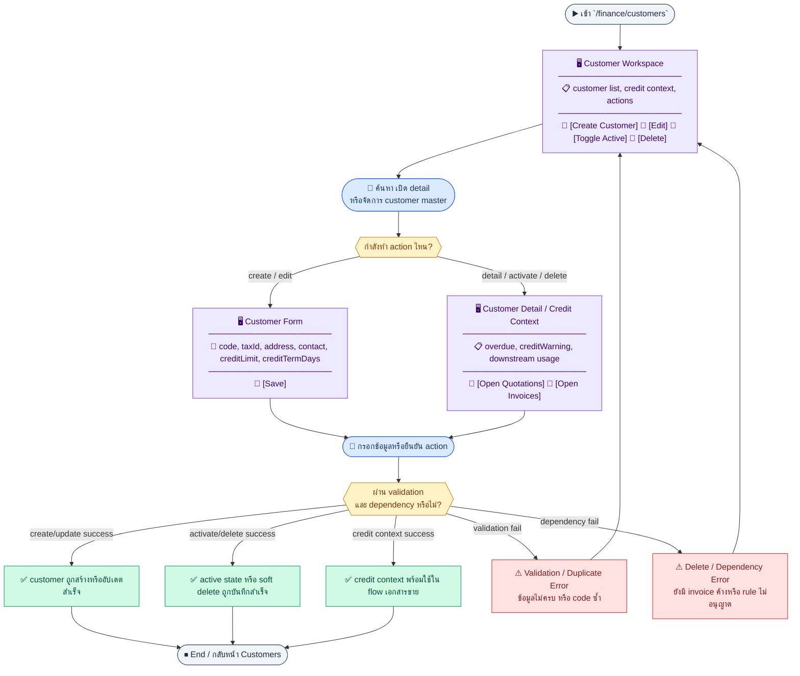
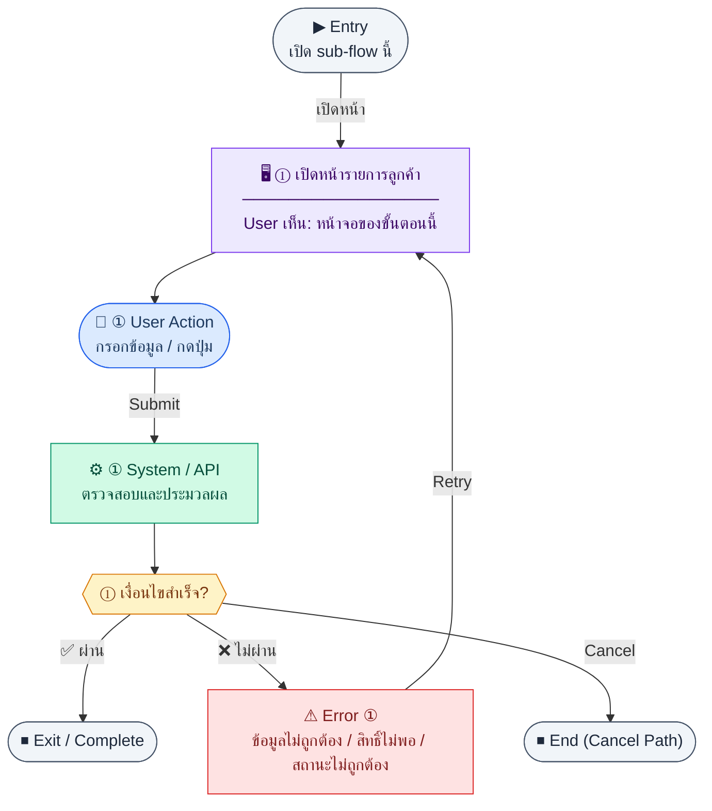
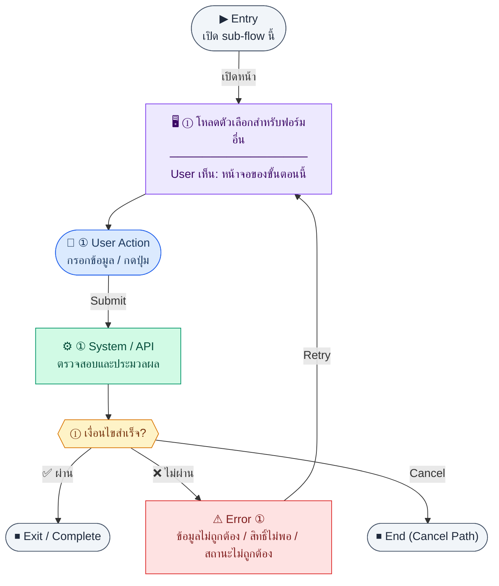
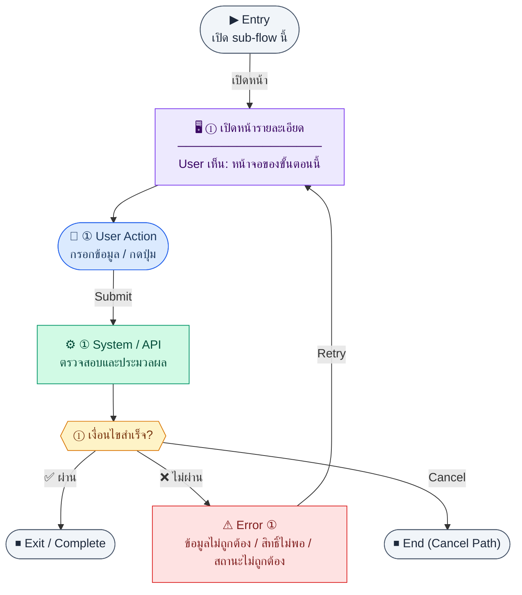
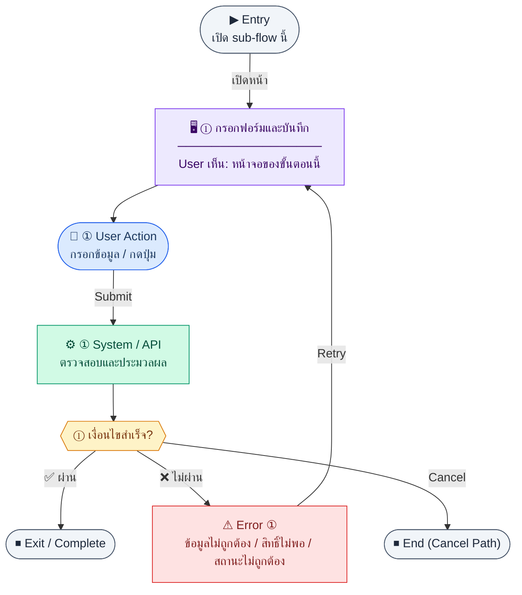
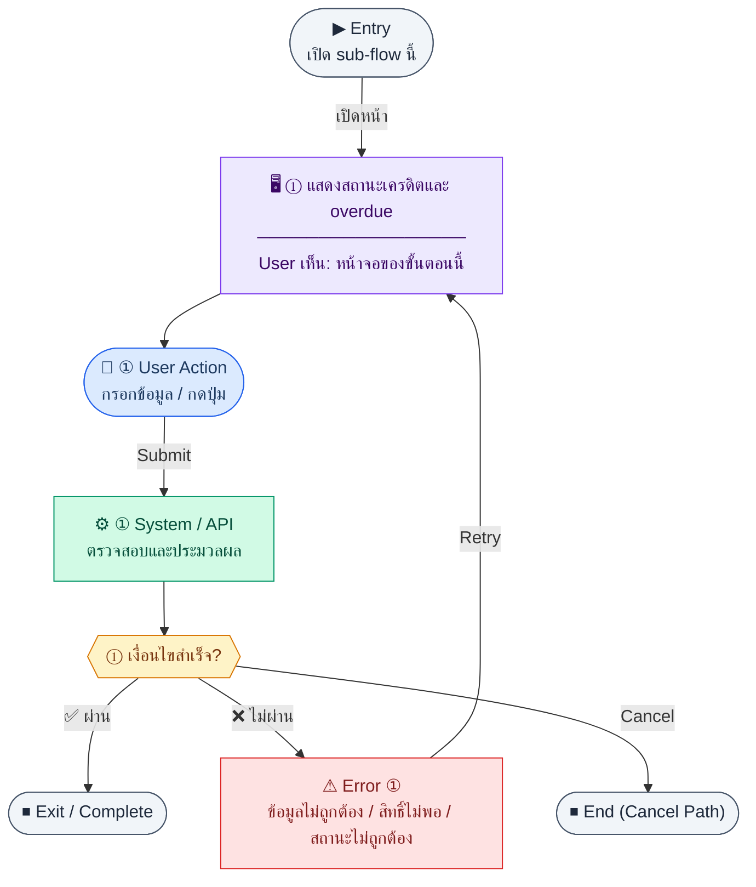

# UX Flow — จัดการลูกค้า (Customer Management)

เอกสารนี้อธิบาย journey ฝั่งผู้ใช้แบบ **endpoint-driven** สำหรับโมดูลลูกค้าใน Finance ตาม Release 2

**แหล่งอ้างอิงที่ผูกกับเอกสารนี้**

- Business requirement (BR): `Documents/Requirements/Release_2.md` (§3.1 Customer Management)
- Traceability: `Documents/Requirements/Release_2_traceability_mermaid.md` (Feature 3.1 — Customer Management)
- Sequence / SD_Flow: `Documents/SD_Flow/Finance/customers.md`
- เกี่ยวข้อง (เครดิต / AR): `Documents/Requirements/Release_2.md` (Gap E — Credit Check), `Documents/SD_Flow/Finance/invoices.md`

---

## E2E Scenario Flow

> ผู้ใช้ที่มีสิทธิ์เข้าหน้าลูกค้าเพื่อค้นหา สร้าง แก้ไข เปิด/ปิดการใช้งาน หรือลบข้อมูลลูกค้า พร้อมเห็นบริบทเครดิต วงเงิน และยอดค้างที่ถูกนำไปใช้ต่อใน Quotation, Sales Order, Invoice และ AR Aging

### Scenario Summary

| Scenario | ขั้นตอน | ผลลัพธ์ |
|----------|---------|---------|
| ✅ ดูรายการลูกค้า | เปิด `/finance/customers` → ค้นหา/กรอง | เห็นตารางลูกค้าพร้อมสถานะและวงเงินเครดิต |
| ✅ สร้างลูกค้าใหม่ | กดเพิ่มลูกค้า → กรอกข้อมูลหลัก/เครดิตเทอม → บันทึก | ได้ customer ใหม่และพร้อมใช้ใน dropdown ของเอกสารขาย |
| ✅ แก้ไขข้อมูลลูกค้า | เปิด detail/edit → ปรับข้อมูลติดต่อ/ภาษี/เครดิต → บันทึก | ข้อมูลลูกค้าอัปเดตและสะท้อนใน flow ถัดไป |
| ✅ ตรวจสอบเครดิต/ยอดค้าง | เปิด detail หรือเลือกจากฟอร์ม quotation/invoice | เห็น `creditWarning` หรือ badge overdue แบบ soft warning |
| ✅ เปิด/ปิดการใช้งาน | สั่ง toggle active | ลูกค้าถูกซ่อน/แสดงตามสถานะโดยไม่ลบประวัติ |
| ✅ ลบแบบ soft delete | กดลบ → ระบบตรวจ invoice ค้างชำระ | ลบได้เมื่อไม่ติดเงื่อนไขหรือถูก block พร้อมเหตุผล |
| ⚠ ข้อมูลซ้ำหรือไม่ผ่าน validation | submit create/edit → code ซ้ำหรือ field ไม่ครบ | ระบบแสดง validation error |
| ⚠ ลบไม่ได้เพราะ dependency | soft-delete เมื่อลูกค้ายังมีเอกสารค้าง | ระบบปฏิเสธการลบและแจ้งเหตุผล |

---
## ชื่อ Flow & ขอบเขต

**Flow name:** `Finance — Customer CRUD + Credit / Overdue Context`

**Actor(s):** `finance_manager` และบทบาทที่ได้รับสิทธิ์จัดการลูกค้า

**Entry:** เมนู Finance → ลูกค้า (`/finance/customers`) หรือลิงก์จาก Invoice / Quotation / SO เมื่อต้องแก้ข้อมูลลูกค้า

**Exit:** สร้าง/แก้ไข/เปิดใช้/ลบลูกค้าเสร็จ หรือออกจากหน้ารายละเอียดหลังตรวจสอบวงเงินและสถานะค้างชำระแล้ว

**Out of scope:** การสร้าง Invoice / Quotation / SO เอง (อธิบายเฉพาะบริบท `creditWarning` และ badge ค้างชำระที่มาจาก BR)

---

## Sub-flow A — รายการลูกค้า (List)

**กลุ่ม endpoint:** `GET /api/finance/customers`

### Scenario Flow

### สัญลักษณ์ Node (Color Legend)

| สี | Node shape | หมายถึง |
|----|-----------|---------|
| 🟣 ม่วง | สี่เหลี่ยม `["…"]` | **Screen / UI State** |
| 🔵 น้ำเงิน | วงกลม `(["…"])` | **User Action** |
| 🟢 เขียว | สี่เหลี่ยม `["…"]` | **System / API** |
| 🟡 เหลือง | เพชร `{{"…"}}` | **Decision** |
| 🔴 แดง | สี่เหลี่ยม `["…"]` | **Error / Edge case** |
| ⚫ เทา | วงรี `(["…"])` | **Start / End** |

---

### Step A1 — เปิดหน้ารายการลูกค้า

**Goal:** ดูรายการลูกค้าทั้งหมดพร้อมตัวกรอง/แบ่งหน้า (ถ้ามีใน product)

**User sees:** ตารางลูกค้า (รหัส, ชื่อ, สถานะ active, วงเงินเครดิตถ้ามี), ปุ่ม “เพิ่มลูกค้า”, การกระทำต่อแถว (ดู / แก้ไข / เปิด-ปิด / ลบตามสิทธิ์)

**User can do:** ค้นหา/กรอง, คลิกแถวเพื่อไปรายละเอียด, ไปหน้าสร้างใหม่

**User Action:**
- ประเภท: `กรอกข้อมูล / เลือกตัวเลือก`
- ช่องที่ใช้กรอง/ค้นหา:
  - `search` *(optional)* : ค้นหาจาก code, ชื่อ, taxId
  - `isActive` *(optional)* : active/inactive
- ปุ่ม / Controls ในหน้านี้:
  - `[Create Customer]` → เปิดฟอร์มสร้าง
  - `[Open Customer]` → ไปหน้ารายละเอียด
  - `[Apply Filters]` → โหลดรายการตามเงื่อนไข

**Frontend behavior:**

- เรียก `GET /api/finance/customers` พร้อม query ตาม BR (pagination, filter ถ้ามี)
- แสดง skeleton ขณะโหลด; รีเฟรชหลัง mutation จาก sub-flow อื่น

**System / AI behavior:** Backend อ่านตาราง `customers` และ metadata ที่เกี่ยวข้อง; ไม่มี AI

**Success:** ได้รายการและ meta ครบตาม schema

**Error:** 401 → redirect login; 403 → ข้อความไม่มีสิทธิ์; 5xx → retry / แจ้งผู้ดูแล

**Notes:** Traceability Feature 3.1 ผูก `P_CUST` → `GET /api/finance/customers`

---

## Sub-flow B — ตัวเลือกลูกค้า (Options / Dropdown)

**กลุ่ม endpoint:** `GET /api/finance/customers/options`

### Scenario Flow

### สัญลักษณ์ Node (Color Legend)

| สี | Node shape | หมายถึง |
|----|-----------|---------|
| 🟣 ม่วง | สี่เหลี่ยม `["…"]` | **Screen / UI State** |
| 🔵 น้ำเงิน | วงกลม `(["…"])` | **User Action** |
| 🟢 เขียว | สี่เหลี่ยม `["…"]` | **System / API** |
| 🟡 เหลือง | เพชร `{{"…"}}` | **Decision** |
| 🔴 แดง | สี่เหลี่ยม `["…"]` | **Error / Edge case** |
| ⚫ เทา | วงรี `(["…"])` | **Start / End** |

---

### Step B1 — โหลดตัวเลือกสำหรับฟอร์มอื่น

**Goal:** เตรียมรายการลูกค้าสำหรับ dropdown ใน Invoice, Quotation, SO

**User sees:** (บนหน้าอื่น) ช่องเลือกลูกค้าแบบค้นหาได้

**User can do:** พิมพ์ค้นหา, เลือกลูกค้า

**User Action:**
- ประเภท: `กรอกข้อมูล / เลือกตัวเลือก`
- ช่องที่ต้องกรอก:
  - `search` *(optional)* : ค้นหาชื่อลูกค้า
- ปุ่ม / Controls ในหน้านี้:
  - `[Select Customer]` → เลือกลูกค้าลงฟอร์มปลายทาง
  - `[Retry]` → โหลด options ใหม่

**Frontend behavior:**

- เรียก `GET /api/finance/customers/options` (อาจ cache สั้น ๆ ตามนโยบาย FE)
- แสดง **badge “มียอดค้างชำระ”** ตาม BR เมื่อลูกค้ามี invoice `overdue` (ข้อมูลมาจาก response หรือ flag ที่ BE ส่งมา)

**System / AI behavior:** คืนเฉพาะลูกค้าที่ใช้ใน dropdown ตาม contract ของ API

**Success:** เลือกลูกค้าได้โดยไม่สับสนกับรายการ inactive ที่ไม่ควรแสดง

**Error:** โหลด options ไม่ได้ → แสดง error และปุ่ม retry

**Notes:** BR Gap E — เมื่อสร้าง Invoice/Quotation ระบบอาจส่ง `creditWarning` ใน response ของ `POST` เอกสารนั้น (ไม่ใช่ endpoint ของ customers โดยตรง) แต่ UI ต้องอ่านและแสดงคำเตือนหลังเลือกลูกค้า

---

## Sub-flow C — รายละเอียดลูกค้า (Detail)

**กลุ่ม endpoint:** `GET /api/finance/customers/:id`

### Scenario Flow

### สัญลักษณ์ Node (Color Legend)

| สี | Node shape | หมายถึง |
|----|-----------|---------|
| 🟣 ม่วง | สี่เหลี่ยม `["…"]` | **Screen / UI State** |
| 🔵 น้ำเงิน | วงกลม `(["…"])` | **User Action** |
| 🟢 เขียว | สี่เหลี่ยม `["…"]` | **System / API** |
| 🟡 เหลือง | เพชร `{{"…"}}` | **Decision** |
| 🔴 แดง | สี่เหลี่ยม `["…"]` | **Error / Edge case** |
| ⚫ เทา | วงรี `(["…"])` | **Start / End** |

---

### Step C1 — เปิดหน้ารายละเอียด

**Goal:** ดูข้อมูลลูกค้าครบถ้วนและบริบท AR สรุป (ตาม BR: แท็บ invoice history / outstanding)

**User sees:** ฟอร์มอ่านอย่างเดียวหรือ summary cards (ที่อยู่, เลขผู้เสียภาษี, วงเงิน, เครดิตเทอม), แท็บ “ประวัติ Invoice / ยอดค้างชำระ”

**User can do:** สลับแท็บ, กด “แก้ไข”, กลับรายการ

**User Action:**
- ประเภท: `กดปุ่ม`
- ปุ่ม / Controls ในหน้านี้:
  - `[Edit Customer]` → เข้าโหมดแก้ไข
  - `[View Invoice History]` → เปิดแท็บ invoice history
  - `[Back to List]` → กลับหน้ารายการ

**Frontend behavior:**

- เรียก `GET /api/finance/customers/:id` เมื่อเข้า `/finance/customers/:id`
- ถ้า BR กำหนด badge ค้างชำระ → แสดงเมื่อเงื่อนไข overdue เป็นจริงจากข้อมูลที่รวมใน detail หรือจากแท็บที่โหลดแยก

**System / AI behavior:** รวมข้อมูลลูกค้า + สรุป AR ที่ออกแบบไว้ใน API

**Success:** แสดงข้อมูลครบและสอดคล้องกับ list

**Error:** 404 → “ไม่พบลูกค้า”; 403 → ไม่มีสิทธิ์ดู

**Notes:** SD_Flow `customers.md` ระบุ `GET .../:id` เป็น detail endpoint

---

## Sub-flow D — สร้างลูกค้า (Create)

**กลุ่ม endpoint:** `POST /api/finance/customers`

### Scenario Flow

### สัญลักษณ์ Node (Color Legend)

| สี | Node shape | หมายถึง |
|----|-----------|---------|
| 🟣 ม่วง | สี่เหลี่ยม `["…"]` | **Screen / UI State** |
| 🔵 น้ำเงิน | วงกลม `(["…"])` | **User Action** |
| 🟢 เขียว | สี่เหลี่ยม `["…"]` | **System / API** |
| 🟡 เหลือง | เพชร `{{"…"}}` | **Decision** |
| 🔴 แดง | สี่เหลี่ยม `["…"]` | **Error / Edge case** |
| ⚫ เทา | วงรี `(["…"])` | **Start / End** |

---

### Step D1 — กรอกฟอร์มและบันทึก

**Goal:** บันทึกลูกค้าใหม่พร้อมฟิลด์ตาม schema BR (code, taxId, contact, creditLimit, creditTermDays ฯลฯ)

**User sees:** ฟอร์ม `/finance/customers/new`, validation inline

**User can do:** กรอกข้อมูล, ยกเลิก, บันทึก

**User Action:**
- ประเภท: `กรอกข้อมูล / เลือกตัวเลือก`
- ช่องที่ต้องกรอก:
  - `code` *(required)* : รหัสลูกค้า
  - `name` *(required)* : ชื่อลูกค้า
  - `taxId` *(optional/conditional)* : เลขผู้เสียภาษี
  - `creditLimit` *(optional)* : วงเงินเครดิต
  - `creditTermDays` *(optional)* : เครดิตเทอม
  - `contactName` / `contactPhone` *(optional)* : ผู้ติดต่อ
- ปุ่ม / Controls ในหน้านี้:
  - `[Save Customer]` → เรียก `POST /api/finance/customers`
  - `[Cancel]` → ยกเลิก

**Frontend behavior:**

- validate ฝั่ง client ตามฟิลด์บังคับ
- submit → `POST /api/finance/customers` พร้อม body ตาม contract
- 201 → navigate ไป `/finance/customers/:id` ด้วย `id` จาก response

**System / AI behavior:** ตรวจความซ้ำของ `code`, บันทึก `customers`

**Success:** สร้างสำเร็จและเห็นรายละเอียดลูกค้าใหม่

**Error:** 400 validation; 409 code ซ้ำ; แสดง field errors จาก BE

**Notes:** หลังสร้าง ลูกค้าจะปรากฏใน `GET /api/finance/customers` และ `.../options`

---

## Sub-flow E — แก้ไขลูกค้า (Update)

**กลุ่ม endpoint:** `PATCH /api/finance/customers/:id`

### Scenario Flow

### สัญลักษณ์ Node (Color Legend)

| สี | Node shape | หมายถึง |
|----|-----------|---------|
| 🟣 ม่วง | สี่เหลี่ยม `["…"]` | **Screen / UI State** |
| 🔵 น้ำเงิน | วงกลม `(["…"])` | **User Action** |
| 🟢 เขียว | สี่เหลี่ยม `["…"]` | **System / API** |
| 🟡 เหลือง | เพชร `{{"…"}}` | **Decision** |
| 🔴 แดง | สี่เหลี่ยม `["…"]` | **Error / Edge case** |
| ⚫ เทา | วงรี `(["…"])` | **Start / End** |

---

### Step E1 — แก้ไขบางฟิลด์

**Goal:** อัปเดตข้อมูลลูกค้าโดยไม่ต้องส่งทั้ง record

**User sees:** ฟอร์มแก้ไข `/finance/customers/:id/edit`

**User can do:** แก้ไขฟิลด์, บันทึก

**User Action:**
- ประเภท: `กรอกข้อมูล / เลือกตัวเลือก`
- ช่องที่ต้องกรอก:
  - `name` *(optional)* : ชื่อลูกค้า
  - `taxId` *(optional)* : เลขผู้เสียภาษี
  - `creditLimit` *(optional)* : วงเงินเครดิต
  - `creditTermDays` *(optional)* : เครดิตเทอม
  - `contactName` / `contactPhone` *(optional)* : ผู้ติดต่อ
- ปุ่ม / Controls ในหน้านี้:
  - `[Update Customer]` → เรียก `PATCH /api/finance/customers/:id`
  - `[Cancel]` → ยกเลิก

**Frontend behavior:**

- โหลดค่าเริ่มจาก `GET /api/finance/customers/:id`
- submit เฉพาะฟิลด์ที่เปลี่ยน → `PATCH /api/finance/customers/:id`

**System / AI behavior:** อัปเดต partial; ตรวจ business rules (เช่น taxId format ถ้ามี)

**Success:** ข้อความสำเร็จ + state ตรงกับ response

**Error:** 409/validation ตามฟิลด์

**Notes:** การเปลี่ยน `creditLimit` มีผลต่อ Gap E เมื่อสร้างเอกสารถัดไป

---

## Sub-flow F — เปิด/ปิดใช้งาน (Activate)

**กลุ่ม endpoint:** `PATCH /api/finance/customers/:id/activate`

### Scenario Flow

### สัญลักษณ์ Node (Color Legend)

| สี | Node shape | หมายถึง |
|----|-----------|---------|
| 🟣 ม่วง | สี่เหลี่ยม `["…"]` | **Screen / UI State** |
| 🔵 น้ำเงิน | วงกลม `(["…"])` | **User Action** |
| 🟢 เขียว | สี่เหลี่ยม `["…"]` | **System / API** |
| 🟡 เหลือง | เพชร `{{"…"}}` | **Decision** |
| 🔴 แดง | สี่เหลี่ยม `["…"]` | **Error / Edge case** |
| ⚫ เทา | วงรี `(["…"])` | **Start / End** |

---

### Step F1 — Toggle สถานะใช้งาน

**Goal:** ปิดการใช้งานลูกค้าโดยไม่ลบประวัติ หรือเปิดกลับมา

**User sees:** สวิตช์หรือปุ่ม “เปิดใช้งาน / ระงับ” บน list หรือ detail

**User can do:** ยืนยัน dialog แล้วส่งคำขอ

**User Action:**
- ประเภท: `เลือกตัวเลือก / กดปุ่ม`
- ช่องที่ต้องกรอก:
  - `isActive` *(required)* : true หรือ false
- ปุ่ม / Controls ในหน้านี้:
  - `[Deactivate Customer]` หรือ `[Activate Customer]` → เรียก endpoint activate
  - `[Cancel]` → ปิด dialog

**Frontend behavior:**

- เรียก `PATCH /api/finance/customers/:id/activate` (body ตาม contract เช่น `{ "isActive": false }` ถ้า BE กำหนด)
- optimistic UI หรือรอ 200 แล้วรีเฟรช list/detail

**System / AI behavior:** อัปเดต `isActive`; ลูกค้า inactive มักไม่แสดงใน `.../options`

**Success:** สถานะสอดคล้องทุกหน้า

**Error:** 403 ถ้าไม่มีสิทธิ์; 409 ถ้า business ห้ามปิด (เช่นมียอดค้าง — ถ้า BR กำหนด)

**Notes:** Traceability แมป `A_CUST_ACT`

---

## Sub-flow G — ลบลูกค้า (Delete)

**กลุ่ม endpoint:** `DELETE /api/finance/customers/:id`

### Scenario Flow

### สัญลักษณ์ Node (Color Legend)

| สี | Node shape | หมายถึง |
|----|-----------|---------|
| 🟣 ม่วง | สี่เหลี่ยม `["…"]` | **Screen / UI State** |
| 🔵 น้ำเงิน | วงกลม `(["…"])` | **User Action** |
| 🟢 เขียว | สี่เหลี่ยม `["…"]` | **System / API** |
| 🟡 เหลือง | เพชร `{{"…"}}` | **Decision** |
| 🔴 แดง | สี่เหลี่ยม `["…"]` | **Error / Edge case** |
| ⚫ เทา | วงรี `(["…"])` | **Start / End** |

---

### Step G1 — ลบหรือ soft-delete

**Goal:** ลบลูกค้าตามนโยบาย (hard/soft ตาม BE)

**User sees:** dialog ยืนยันอันตราย

**User can do:** ยืนยัน / ยกเลิก

**User Action:**
- ประเภท: `กรอกข้อมูล / กดปุ่ม`
- ช่องที่ต้องกรอก:
  - `confirmCustomerCode` *(required)* : พิมพ์รหัสลูกค้าเพื่อยืนยัน
- ปุ่ม / Controls ในหน้านี้:
  - `[Delete Customer]` → เรียก `DELETE /api/finance/customers/:id`
  - `[Cancel]` → ยกเลิก

**Frontend behavior:**

- `DELETE /api/finance/customers/:id`
- สำเร็จ → นำทางกลับ list และลบ row ออกจาก cache

**System / AI behavior:** ตรวจ FK / เอกสารอ้างอิง; อาจ return 409 ถ้ามี invoice ผูกอยู่

**Success:** ลบแล้ว list ไม่มีรายการนั้น

**Error:** 409 พร้อมเหตุผล; 403

**Notes:** BR อาจใช้ `deletedAt` — FE ต้องแสดงข้อความสอดคล้องกับ response

---

## Sub-flow H — บริบทวงเงินและคำเตือนเครดิต (Credit-warning context)

**กลุ่ม endpoint (อ้างอิง):** `GET /api/finance/customers/options`, `GET /api/finance/customers/:id` + **การตอบกลับของ** `POST /api/finance/invoices` / `POST /api/finance/quotations` ตาม Gap E

### Scenario Flow

### สัญลักษณ์ Node (Color Legend)

| สี | Node shape | หมายถึง |
|----|-----------|---------|
| 🟣 ม่วง | สี่เหลี่ยม `["…"]` | **Screen / UI State** |
| 🔵 น้ำเงิน | วงกลม `(["…"])` | **User Action** |
| 🟢 เขียว | สี่เหลี่ยม `["…"]` | **System / API** |
| 🟡 เหลือง | เพชร `{{"…"}}` | **Decision** |
| 🔴 แดง | สี่เหลี่ยม `["…"]` | **Error / Edge case** |
| ⚫ เทา | วงรี `(["…"])` | **Start / End** |

---

### Step H1 — แสดงสถานะเครดิตและ overdue

**Goal:** ให้ผู้ใช้เห็นความเสี่ยงก่อนออกเอกสาร AR

**User sees:** banner หรือ inline alert เมื่อ `currentAR + newAmount > creditLimit`; badge overdue ใน dropdown/detail

**User can do:** ดำเนินการต่อด้วยความรู้ (หรือแก้วงเงิน/ลูกค้า)

**User Action:**
- ประเภท: `กดปุ่ม`
- ปุ่ม / Controls ในหน้านี้:
  - `[Continue with Warning]` → เดินหน้าสร้างเอกสาร AR ต่อ
  - `[Open Customer Detail]` → ไปแก้ไขวงเงินเครดิต
  - `[Back to Form]` → กลับฟอร์ม invoice/quotation

**Frontend behavior:**

- จาก **options/detail**: แสดง badge/ยอดค้างตามข้อมูลที่ BE ส่ง
- จาก **สร้าง invoice/quotation**: อ่าน `creditWarning` จาก response ของ POST (ถ้ามี) แล้วแสดงตัวเลข `currentAR`, `creditLimit`, `excess` ตามตัวอย่างใน BR

**System / AI behavior:** คำนวณ `SUM(balanceDue)` สำหรับสถานะ invoice ที่ BR ระบุ

**Success:** ผู้ใช้ตัดสินใจได้โดยมีข้อมูลครบ

**Error:** —

**Notes:** จุดนี้เป็น **cross-cutting** — audit ได้โดยเช็ก BR Gap E + traceability `GAP_E`

## Coverage Checklist

| Endpoint | Covered in UX file | Notes |
| --- | --- | --- |
| `GET /api/finance/customers` | Sub-flow A — รายการลูกค้า (List) | List + filters/pagination per BR. |
| `GET /api/finance/customers/options` | Sub-flow B — ตัวเลือกลูกค้า (Options / Dropdown); Sub-flow H — บริบทวงเงินและคำเตือนเครดิต (Credit-warning context) | Overdue badge; feeds credit UI. |
| `GET /api/finance/customers/:id` | Sub-flow C — รายละเอียดลูกค้า (Detail); Sub-flow E — แก้ไขลูกค้า (Update); Sub-flow H — บริบทวงเงินและคำเตือนเครดิต (Credit-warning context) | Detail + load for edit + AR summary tabs. |
| `POST /api/finance/customers` | Sub-flow D — สร้างลูกค้า (Create) | 201 → navigate to detail. |
| `PATCH /api/finance/customers/:id` | Sub-flow E — แก้ไขลูกค้า (Update) | Partial update; credit fields affect Gap E. |
| `PATCH /api/finance/customers/:id/activate` | Sub-flow F — เปิด/ปิดใช้งาน (Activate) | Toggle active; options list behavior. |
| `DELETE /api/finance/customers/:id` | Sub-flow G — ลบลูกค้า (Delete) | Confirm dialog; 409 if referenced. |
| `POST /api/finance/invoices` | Sub-flow H — บริบทวงเงินและคำเตือนเครดิต (Credit-warning context) | Not customer CRUD; read `creditWarning` on create (invoices SD / Gap E). |
| `POST /api/finance/quotations` | Sub-flow H — บริบทวงเงินและคำเตือนเครดิต (Credit-warning context) | Same credit-warning pattern when creating QT (BR). |

## Coverage Lock Notes (2026-04-16)

### In-scope endpoints
- `GET /api/finance/customers`
- `GET /api/finance/customers/options`
- `GET /api/finance/customers/:id`
- `POST /api/finance/customers`
- `PATCH /api/finance/customers/:id`
- `PATCH /api/finance/customers/:id/activate`
- `DELETE /api/finance/customers/:id`

### Canonical read models
- options/detail ต้องรองรับ `creditWarning`, `hasOverdueInvoice`, `arSummary`

### UX lock
- inactive customer ไม่ควรแสดงใน options default
- soft-deleted customer ต้องถูกมองเป็น history/admin concern ไม่ใช่ default browsing state
