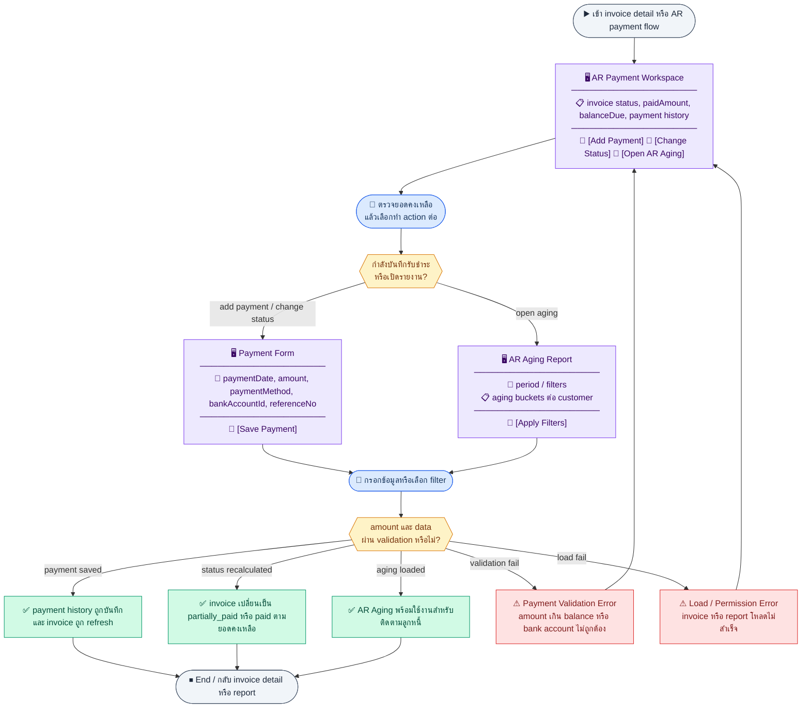
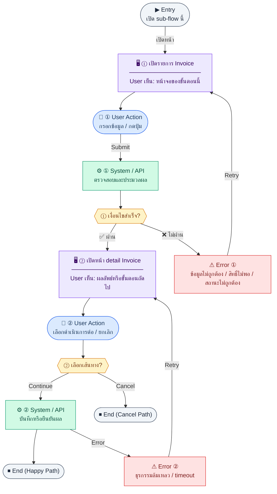
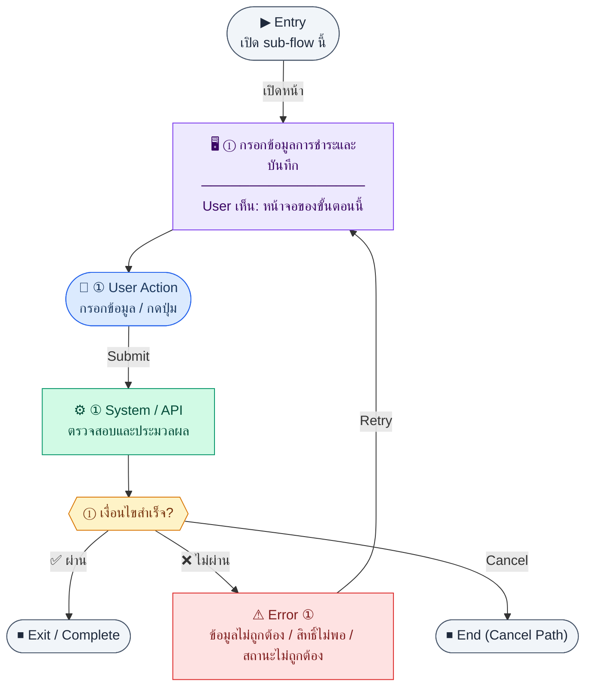
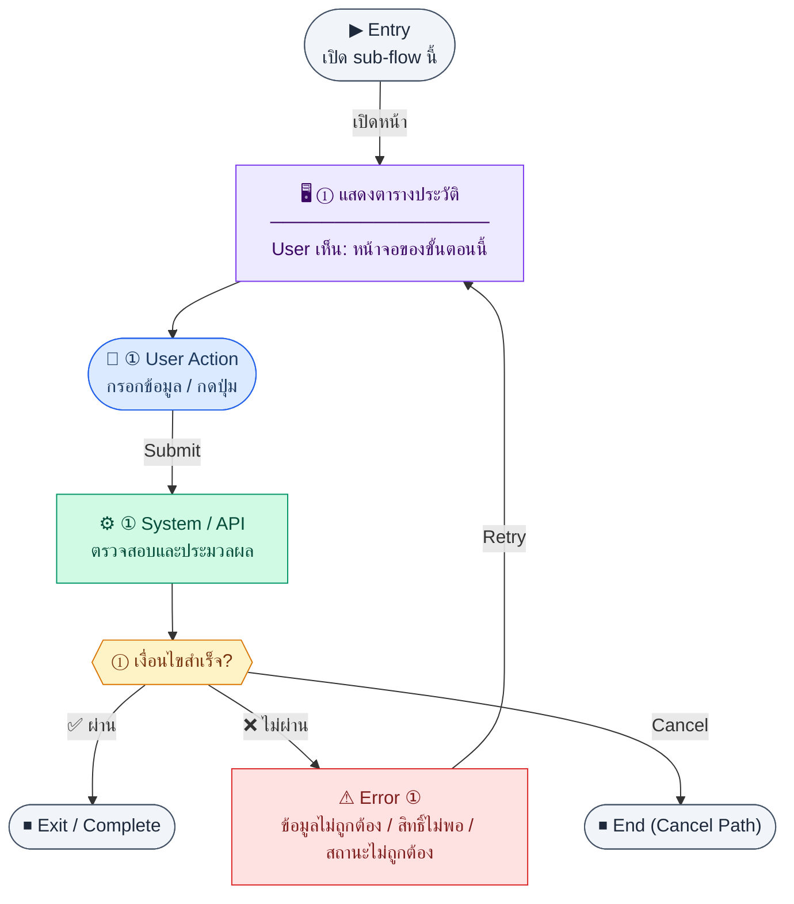
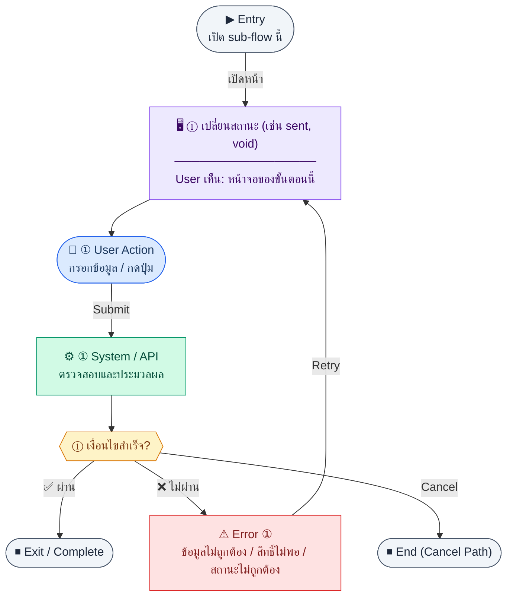

# UX Flow — ติดตามการรับชำระลูกหนี้ (AR Payment Tracking)

เอกสารนี้เชื่อม **การบันทึกรับชำระต่อใบแจ้งหนี้**, **ประวัติการชำระ**, **สถานะใบแจ้งหนี้**, และ **รายงาน AR Aging** เข้ากับ endpoint ที่นิยามใน SD_Flow

**แหล่งอ้างอิงที่ผูกกับเอกสารนี้**

- Business requirement (BR): `Documents/Requirements/Release_2.md` (§3.2 AR Payment Tracking)
- Traceability: `Documents/Requirements/Release_2_traceability_mermaid.md` (Feature 3.2 — AR Payment Tracking)
- Sequence / SD_Flow: `Documents/SD_Flow/Finance/invoices.md`, `Documents/SD_Flow/Finance/reports.md`
- พื้นฐาน Invoice (R1): `Documents/Requirements/Release_1.md`, `Documents/SD_Flow/Finance/invoices.md`

---

## E2E Scenario Flow

> ผู้ใช้เลือก invoice ที่ต้องติดตามหรือรับชำระ ตรวจยอดคงค้างจริงจาก `paidAmount/balanceDue` บันทึกรับเงินต่อใบ แจ้งสถานะ invoice อัตโนมัติ และต่อยอดไปดูรายงาน AR Aging ตามช่วงเวลา

### Scenario Summary

| Scenario | ขั้นตอน | ผลลัพธ์ |
|----------|---------|---------|
| ✅ ตรวจ invoice ก่อนรับชำระ | เปิด list/detail invoice | เห็นสถานะและยอดคงเหลือจริง |
| ✅ บันทึกรับชำระบางส่วน | กด Add Payment → ใส่ข้อมูลรับเงิน | ระบบเพิ่ม payment history และอัปเดตเป็น `partially_paid` |
| ✅ ปิดยอดเต็มจำนวน | บันทึกรับชำระครบ balance due | invoice เปลี่ยนเป็น `paid` |
| ✅ ดูประวัติการรับชำระ | เปิด payment history | ตรวจสอบ receipt/ref no./bank account ได้ |
| ✅ เปลี่ยนสถานะ invoice | สั่งส่งหรือ void เอกสารตาม rule | status เปลี่ยนตาม workflow |
| ✅ ดู AR Aging | เปิด report → เลือกช่วง/เงื่อนไข | เห็นยอดลูกหนี้แยก bucket อายุหนี้ต่อ customer |
| ⚠ Payment amount ไม่ถูกต้อง | บันทึกยอดเกิน balance หรือข้อมูลไม่ครบ | ระบบ block การบันทึกและแจ้ง error |
| ⚠ โหลด invoice หรือรายงานไม่สำเร็จ | ไม่พบข้อมูลหรือไม่มีสิทธิ์ | ระบบแจ้ง load/permission error |

---
## ชื่อ Flow & ขอบเขต

**Flow name:** `Finance — AR Payments, Invoice Status, AR Aging`

**Actor(s):** `finance_manager` และผู้มีสิทธิ์บันทึกรับชำระ

**Entry:** จากรายการ Invoice (`/finance/invoices`) หรือหน้า detail ใบแจ้งหนี้ (`/finance/invoices/:id`)

**Exit:** บันทึกรับชำระแล้ว balance/status ถูกต้อง หรือดูรายงาน aging ครบตามช่วงวันที่เลือก

**Out of scope:** การตั้งค่า chart of accounts; รายละเอียด journal ฝั่ง GL (อธิบายเฉพาะผลที่เกี่ยวกับ UI)

---

## Sub-flow A — รายการและรายละเอียดใบแจ้งหนี้ (บริบทก่อนรับชำระ)

**กลุ่ม endpoint:** `GET /api/finance/invoices`, `GET /api/finance/invoices/:id`

### Scenario Flow

### สัญลักษณ์ Node (Color Legend)

| สี | Node shape | หมายถึง |
|----|-----------|---------|
| 🟣 ม่วง | สี่เหลี่ยม `["…"]` | **Screen / UI State** |
| 🔵 น้ำเงิน | วงกลม `(["…"])` | **User Action** |
| 🟢 เขียว | สี่เหลี่ยม `["…"]` | **System / API** |
| 🟡 เหลือง | เพชร `{{"…"}}` | **Decision** |
| 🔴 แดง | สี่เหลี่ยม `["…"]` | **Error / Edge case** |
| ⚫ เทา | วงรี `(["…"])` | **Start / End** |

---

### Step A1 — เปิดรายการ Invoice

**Goal:** เลือกใบแจ้งหนี้ที่ต้องรับชำระหรือตรวจสอบยอดค้าง

**User sees:** ตาราง invoice พร้อม status, balance due (ถ้ามีใน payload)

**User can do:** กรอง, เปิด detail

**User Action:**
- ประเภท: `เลือกตัวเลือก / กดปุ่ม`
- ช่องที่ใช้กรอง/ดูข้อมูล:
  - `status` *(optional)* : กรองสถานะใบแจ้งหนี้
  - `customerId` *(optional)* : กรองตามลูกค้า
- ปุ่ม / Controls ในหน้านี้:
  - `[Open Invoice]` → ไปหน้า detail
  - `[Refresh]` → โหลดรายการล่าสุด

**Frontend behavior:**

- `GET /api/finance/invoices` (query ตาม product)
- คลิกแถว → navigate พร้อม `id`

**System / AI behavior:** คืนรายการพร้อม meta

**Success:** เห็น invoice ที่ต้องการ

**Error:** 401/403/5xx ตามมาตรฐานแอป

**Notes:** BR เน้นว่า summary เดิมที่อ่าน total ตรง ๆ ไม่พอเมื่อมี partial payment — UI ต้องอิง `balanceDue` / `paidAmount` จาก BE

### Step A2 — เปิดหน้า detail Invoice

**Goal:** เตรียมบันทึกรับชำระจากยอดคงค้างจริง

**User sees:** หัวเอกสาร, ยอดรวม, paid/balance, ปุ่ม “บันทึกรับชำระ”, แท็บประวัติการชำระ

**User can do:** เปิดฟอร์มรับชำระ, ดูประวัติ

**User Action:**
- ประเภท: `กดปุ่ม`
- ปุ่ม / Controls ในหน้านี้:
  - `[Add Payment]` → เปิดฟอร์มรับชำระ
  - `[View Payment History]` → เปิดประวัติการชำระ
  - `[Back to List]` → กลับหน้ารายการ

**Frontend behavior:**

- `GET /api/finance/invoices/:id` เมื่อโหลด `/finance/invoices/:id`

**System / AI behavior:** รวมข้อมูลบรรทัดรายการและสถานะล่าสุด

**Success:** ยอดที่แสดงตรงกับการคำนวณของ BE

**Error:** 404 ถ้าไม่มีใบ

**Notes:** Traceability `P_INV_ID` → `GET .../:id`

---

## Sub-flow B — สร้างการรับชำระ (Payment create)

**กลุ่ม endpoint:** `POST /api/finance/invoices/:id/payments`

### Scenario Flow

### สัญลักษณ์ Node (Color Legend)

| สี | Node shape | หมายถึง |
|----|-----------|---------|
| 🟣 ม่วง | สี่เหลี่ยม `["…"]` | **Screen / UI State** |
| 🔵 น้ำเงิน | วงกลม `(["…"])` | **User Action** |
| 🟢 เขียว | สี่เหลี่ยม `["…"]` | **System / API** |
| 🟡 เหลือง | เพชร `{{"…"}}` | **Decision** |
| 🔴 แดง | สี่เหลี่ยม `["…"]` | **Error / Edge case** |
| ⚫ เทา | วงรี `(["…"])` | **Start / End** |

---

### Step B1 — กรอกข้อมูลการชำระและบันทึก

**Goal:** บันทึกการรับเงินครั้งหนึ่งต่อใบแจ้งหนี้ พร้อมวิธีชำระและบัญชีธนาคาร (ตาม BR R2 bank linkage)

**User sees:** modal หรือ section: วันที่ชำระ, จำนวนเงิน, `paymentMethod` (bank_transfer/cash/cheque/other), `bankAccountId` (จาก options ธนาคาร), `referenceNo`

**User can do:** บันทึก, ยกเลิก

**User Action:**
- ประเภท: `กรอกข้อมูล / เลือกตัวเลือก`
- ช่องที่ต้องกรอก:
  - `paymentDate` *(required)* : วันที่รับเงิน
  - `amount` *(required)* : จำนวนเงินที่รับ
  - `paymentMethod` *(required)* : วิธีชำระ
  - `bankAccountId` *(required when method uses bank)* : บัญชีธนาคารที่รับเงิน
  - `referenceNo` *(optional)* : เลขอ้างอิง
- ปุ่ม / Controls ในหน้านี้:
  - `[Save Payment]` → บันทึกรับชำระ
  - `[Cancel]` → ปิด modal

**Frontend behavior:**

- validate จำนวนไม่เกิน `balanceDue` (และไม่ติดลบ)
- ก่อนเปิด modal ให้โหลด `GET /api/finance/bank-accounts/options`; ถ้าไม่มีบัญชี active ให้แสดง empty state พร้อม CTA ไป `/finance/bank-accounts`
- `POST /api/finance/invoices/:id/payments` พร้อม body ตาม contract
- หลัง 201: รีเฟรช `GET /api/finance/invoices/:id` และ `GET /api/finance/invoices/:id/payments`

**System / AI behavior:** สร้าง `invoice_payments`, อัปเดต `paidAmount` / `balanceDue`, สร้าง bank transaction deposit (ตาม BR §3.5)

**Success:** ยอดคงเหลือลดลง; รายการใหม่ปรากฏในประวัติ

**Error:** 400 (ยอดเกิน, ฟิลด์ขาด); 409 (state ไม่อนุญาต); ถ้าไม่มี `bankAccountId` ให้ชี้ว่าต้องตั้งค่าบัญชีธนาคารก่อน และแสดงลิงก์ไป `/finance/bank-accounts`; แสดงข้อความจาก BE

**Notes:** SD_Flow `invoices.md` — `POST .../payments`; catalog บัญชีธนาคารอ้างอิง `R2-05_Cash_Bank_Management.md`

---

## Sub-flow C — ประวัติการรับชำระ (Payment history)

**กลุ่ม endpoint:** `GET /api/finance/invoices/:id/payments`

### Scenario Flow

### สัญลักษณ์ Node (Color Legend)

| สี | Node shape | หมายถึง |
|----|-----------|---------|
| 🟣 ม่วง | สี่เหลี่ยม `["…"]` | **Screen / UI State** |
| 🔵 น้ำเงิน | วงกลม `(["…"])` | **User Action** |
| 🟢 เขียว | สี่เหลี่ยม `["…"]` | **System / API** |
| 🟡 เหลือง | เพชร `{{"…"}}` | **Decision** |
| 🔴 แดง | สี่เหลี่ยม `["…"]` | **Error / Edge case** |
| ⚫ เทา | วงรี `(["…"])` | **Start / End** |

---

### Step C1 — แสดงตารางประวัติ

**Goal:** audit การรับชำระทุกครั้งที่ผูกกับใบแจ้งหนี้

**User sees:** ตารางวันที่, จำนวน, วิธีชำระ, อ้างอิง, บัญชีธนาคาร

**User can do:** (ถ้ามี) เรียง/กรองภายในหน้า

**User Action:**
- ประเภท: `เลือกตัวเลือก / กดปุ่ม`
- ช่องที่ใช้ดูข้อมูล:
  - `sort` *(optional)* : เรียงตามวันที่หรือจำนวนเงิน
- ปุ่ม / Controls ในหน้านี้:
  - `[Refresh History]` → โหลดประวัติใหม่
  - `[Back to Invoice]` → กลับหน้า detail

**Frontend behavior:**

- `GET /api/finance/invoices/:id/payments` หลังโหลด detail หรือหลังสร้าง payment

**System / AI behavior:** อ่าน `invoice_payments`

**Success:** รายการตรงกับผลรวม paid

**Error:** โหลดไม่ได้ → retry

**Notes:** Traceability `A_INV_PAY_LIST`

---

## Sub-flow D — สถานะใบแจ้งหนี้ (Invoice status)

**กลุ่ม endpoint:** `PATCH /api/finance/invoices/:id/status`

### Scenario Flow

### สัญลักษณ์ Node (Color Legend)

| สี | Node shape | หมายถึง |
|----|-----------|---------|
| 🟣 ม่วง | สี่เหลี่ยม `["…"]` | **Screen / UI State** |
| 🔵 น้ำเงิน | วงกลม `(["…"])` | **User Action** |
| 🟢 เขียว | สี่เหลี่ยม `["…"]` | **System / API** |
| 🟡 เหลือง | เพชร `{{"…"}}` | **Decision** |
| 🔴 แดง | สี่เหลี่ยม `["…"]` | **Error / Edge case** |
| ⚫ เทา | วงรี `(["…"])` | **Start / End** |

---

### Step D1 — เปลี่ยนสถานะ (เช่น sent, void)

**Goal:** ปรับ workflow ของใบแจ้งหนี้เฉพาะสถานะที่ผู้ใช้สั่งเองได้ เช่น `sent` หรือ `void`; ส่วน `partially_paid` และ `paid` ต้องเกิดจาก payment logic เท่านั้น

**User sees:** dropdown หรือปุ่ม action ตามสถานะปัจจุบัน

**User can do:** เลือกสถานะที่อนุญาต, ยืนยัน

**User Action:**
- ประเภท: `เลือกตัวเลือก / กดปุ่ม`
- ค่า input หลัก:
  - `status` *(required)* : เลือกเฉพาะค่าที่ BE เปิดให้เปลี่ยนด้วยมือ เช่น `sent` หรือ `void`
  - `reason` *(optional)* : เหตุผลเพิ่มเติมเมื่อทำ action ที่มีผลรุนแรง เช่น void
- ปุ่ม / Controls ในหน้านี้:
  - `[Confirm Status Change]` → ยืนยันการเปลี่ยนสถานะ
  - `[Cancel]` → ปิด dialog โดยไม่บันทึก

**Frontend behavior:**

- `PATCH /api/finance/invoices/:id/status` พร้อม body `{ "status": "<target>" }` (ชื่อค่าตาม BE)
- ไม่แสดงตัวเลือก `partially_paid` หรือ `paid` ใน UI เพราะเป็นผลลัพธ์จาก `POST /api/finance/invoices/:id/payments`
- รีเฟรช detail และ list

**System / AI behavior:** ตรวจ transition ที่อนุญาต; อาจอัปเดต `sentAt` / `voidedAt` ตาม BR ส่วน `paidAmount` / `balanceDue` จะเป็นตัวขับสถานะ `partially_paid` หรือ `paid`

**Success:** สถานะใหม่แสดงทุกที่ที่อ้างอิง invoice นี้ และถ้า invoice มี payment อยู่แล้ว UI ยังคงใช้ `paidAmount` / `balanceDue` เป็น source of truth

**Error:** 409 transition ไม่ถูกต้อง; 403

**Notes:** สถานะที่เกี่ยวกับ aging (เช่น overdue) อาจคำนวณจาก due date + balance — ตาม BR ไม่ต้อง hardcode ฝั่ง FE หาก BE เป็นผู้ให้ค่า

---

## Sub-flow E — รายงาน AR Aging

**กลุ่ม endpoint:** `GET /api/finance/reports/ar-aging`

### Scenario Flow

### สัญลักษณ์ Node (Color Legend)

| สี | Node shape | หมายถึง |
|----|-----------|---------|
| 🟣 ม่วง | สี่เหลี่ยม `["…"]` | **Screen / UI State** |
| 🔵 น้ำเงิน | วงกลม `(["…"])` | **User Action** |
| 🟢 เขียว | สี่เหลี่ยม `["…"]` | **System / API** |
| 🟡 เหลือง | เพชร `{{"…"}}` | **Decision** |
| 🔴 แดง | สี่เหลี่ยม `["…"]` | **Error / Edge case** |
| ⚫ เทา | วงรี `(["…"])` | **Start / End** |

---

### Step E1 — เปิดหน้า AR Aging

**Goal:** ดูยอดค้างแยก bucket 0–30, 31–60, 61–90, 90+ วัน ต่อลูกค้า

**User sees:** `/finance/reports/ar-aging` ตารางหรือ pivot, ตัวเลือก as-of หรือช่วงวันที่ (ตาม query ของ BE)

**User can do:** เลือกพารามิเตอร์, ส่งออก (ถ้า product แยก — ใน inventory ปัจจุบัน aging ใช้ GET อย่างเดียวใน `reports.md`; export แยกในเอกสาร R2-09/R2-04 ตาม scope)

**User Action:**
- ประเภท: `เลือกตัวเลือก / กดปุ่ม`
- ช่องที่ต้องกรอก:
  - `asOfDate` *(required/conditional ตาม BE)* : วันที่อ้างอิง aging
  - `customerId` *(optional)* : กรองลูกค้า
- ปุ่ม / Controls ในหน้านี้:
  - `[Load Aging Report]` → ดูรายงาน aging
  - `[Back]` → กลับหน้าก่อนหน้า

**Frontend behavior:**

- `GET /api/finance/reports/ar-aging` พร้อม query ตาม BR (เช่น วันที่อ้างอิง aging)
- แสดง grand total และ drill-down ไปลูกค้า/invoice ถ้า BE ส่งลิงก์หรือ id

**System / AI behavior:** aggregate จาก `invoices` + `invoice_payments` + `customers`

**Success:** ตัวเลขสอดคล้องกับ detail invoice

**Error:** 400 query ไม่ครบ; 5xx

**Notes:** Traceability `P_AR_AGING` → `A_AR_AGING`; รายงานนี้ยังถูกอ้างจาก hub `/finance/reports` ตาม BR §3.4

## Coverage Checklist

| Endpoint | Covered in UX file | Notes |
| --- | --- | --- |
| `GET /api/finance/invoices` | Sub-flow A — รายการและรายละเอียดใบแจ้งหนี้ (บริบทก่อนรับชำระ) | Step A1; show `balanceDue` / `paidAmount`. |
| `POST /api/finance/invoices` | — | SD inventory; invoice create not stepped in this UX (R1 / other flows). |
| `GET /api/finance/invoices/:id` | Sub-flow A — รายการและรายละเอียดใบแจ้งหนี้ (บริบทก่อนรับชำระ) | Step A2; payment entry context. |
| `POST /api/finance/invoices/:id/payments` | Sub-flow B — สร้างการรับชำระ (Payment create) | Bank `bankAccountId` per BR §3.5. |
| `GET /api/finance/invoices/:id/payments` | Sub-flow C — ประวัติการรับชำระ (Payment history) | Audit table after create. |
| `PATCH /api/finance/invoices/:id/status` | Sub-flow D — สถานะใบแจ้งหนี้ (Invoice status) | Workflow transitions; overdue from BE. |
| `GET /api/finance/reports/ar-aging` | Sub-flow E — รายงาน AR Aging | Query as-of / range per BE; hub link in BR §3.4. |

### Coverage Lock Notes (2026-04-16)
- payment create success ต้อง refresh invoice summary (`paidAmount`, `balanceDue`, `status`) จาก API response หรือ refetch detail
- bank side effect ต้องแสดงผลได้ (เช่น `bankTransactionId` หรือสถานะ posting)
- filter/query ใน AR aging ต้อง lock ให้ตรง SD (`asOfDate` หรือ `from/to`)
- invoice-side readback ต้องแสดง bank movement linkage ที่เกี่ยวข้องเมื่อ API ส่งกลับมา เช่น `bankTransactionId` หรือ transaction reference fields จาก bank module
- payment history / invoice detail ต้องถือ `paidAmount` และ `balanceDue` เป็น source of truth สำหรับ post-payment state ทุกหน้าจอ
- ถ้า bank side effect ยังไม่พร้อมหรือ posting ล่าช้า ให้แยกสถานะ “payment saved” ออกจาก “bank reflected” ชัดเจนใน UX
