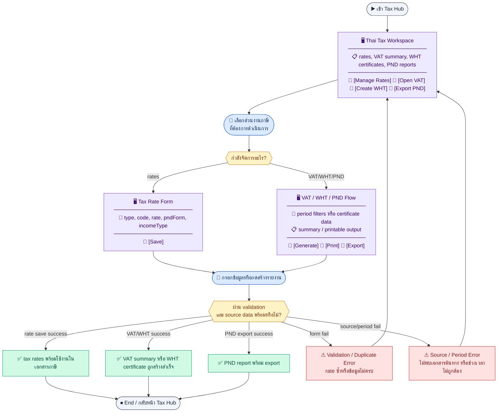
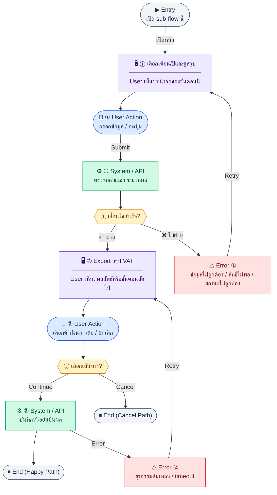
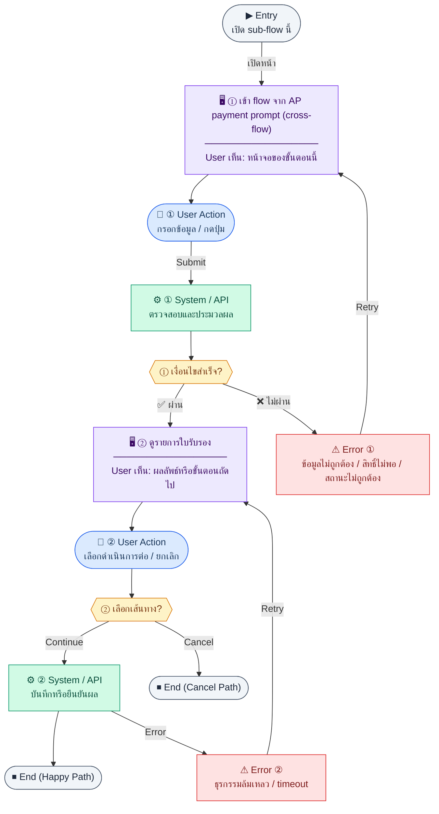
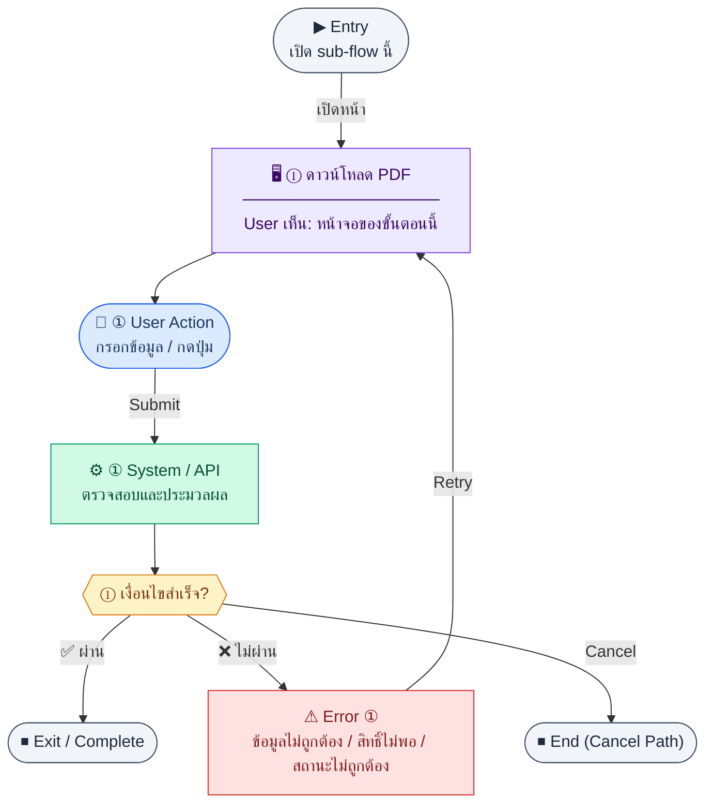
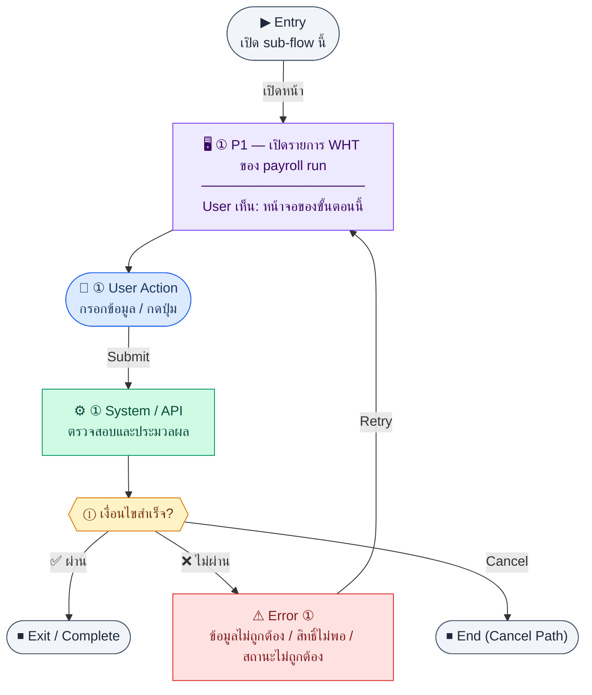
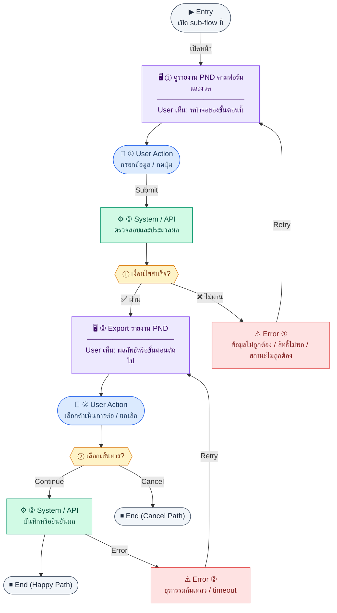

# UX Flow — ภาษีไทย: VAT และหัก ณ ที่จ่าย (WHT)

เอกสารนี้แยก journey ตามกลุ่ม endpoint ในโมดูลภาษี: **อัตราภาษี**, **สรุป/ส่งออก VAT**, **ใบรับรอง WHT + PDF**, **รายงาน PND + export**

**แหล่งอ้างอิงที่ผูกกับเอกสารนี้**

- Business requirement (BR): `Documents/Requirements/Release_2.md` (§3.3 Thai Tax)
- Traceability: `Documents/Requirements/Release_2_traceability_mermaid.md` (Feature 3.3 — Thai Tax)
- Sequence / SD_Flow: `Documents/SD_Flow/Finance/tax.md`, `Documents/SD_Flow/Finance/document_exports.md` (ส่วน VAT export)
- เชื่อม AP / ใบหัก: `Documents/SD_Flow/Finance/ap.md` (vendor invoice, WHT context จาก BR)

---

## E2E Scenario Flow

> ผู้ใช้ฝ่ายการเงินจัดการอัตราภาษี ดูสรุป VAT รายเดือน ออกและพิมพ์ใบรับรองหัก ณ ที่จ่าย และ export รายงาน PND โดยเชื่อมข้อมูลจาก invoice, AP bill, payroll และ tax master เดียวกัน

### Scenario Summary

| Scenario | ขั้นตอน | ผลลัพธ์ |
|----------|---------|---------|
| ✅ จัดการ tax rates | เปิด `/finance/tax` → ดู/เพิ่ม/แก้/activate VAT/WHT rate | มี master rate ที่พร้อมใช้งานในเอกสาร |
| ✅ ดู VAT summary | เปิด VAT report → เลือก `month/year` | เห็น `outputVat`, `inputVat`, `netVatPayable` |
| ✅ ออก WHT certificate | เปิด `/finance/tax/wht` → สร้างจาก AP bill/ข้อมูลจ่าย | ได้เลขใบรับรองและรายการพร้อมพิมพ์ |
| ✅ ดาวน์โหลด WHT PDF | เปิด certificate ที่ต้องการ → กดพิมพ์ | ได้ไฟล์ PDF ใบรับรอง |
| ✅ ดู PND report | เลือก `form/month/year` | เห็นยอดรวม grouped ตาม `pndForm` และ `incomeType` |
| ✅ Export PND | กด export | ได้ไฟล์รายงานตาม format ที่กำหนด |
| ⚠ ข้อมูลภาษีไม่ผ่าน validation | rate ซ้ำหรือ field ไม่ครบ | ระบบแสดง error และไม่บันทึก |
| ⚠ source document หรือช่วงเวลาไม่พร้อม | generate summary/certificate จาก data ไม่ครบ | ระบบแจ้ง source/period error |

---
## ชื่อ Flow & ขอบเขต

**Flow name:** `Finance — Tax Rates, VAT Summary, WHT Certificates, PND Report`

**Actor(s):** `finance_manager`

**Entry:** `/finance/tax` (hub), `/finance/tax/vat-report`, `/finance/tax/wht`

**Exit:** จัดการอัตราภาษีเสร็จ, ได้สรุป VAT รายเดือน, ออก/ดาวน์โหลด WHT, หรือ export PND แล้ว

**Out of scope:** ไม่ลงรายละเอียดทุก step ของฟอร์ม Invoice/AP อีกครั้งทั้งก้อน แต่เอกสารนี้ยังต้องกำหนดกติกา VAT/WHT ที่หน้าต้นทางต้องถือร่วมกัน

**Cross-flow requirement note:** ถ้าองค์กร `vatRegistered` ใน company settings หน้าสร้าง/แก้ไข Invoice และ AP bill ต้องแสดง VAT ต่อบรรทัดและยอดสรุปภาษีให้ครบตาม BR; หากไม่ได้จด VAT ให้ซ่อน/disable ฟิลด์ที่ไม่เกี่ยวข้องและไม่ feed เข้า VAT summary

---

## Sub-flow A — อัตราภาษี (Rates: CRUD-ish)

**กลุ่ม endpoint:** `GET /api/finance/tax/rates`, `POST /api/finance/tax/rates`, `PATCH /api/finance/tax/rates/:id`, `PATCH /api/finance/tax/rates/:id/activate`

### Scenario Flow

### สัญลักษณ์ Node (Color Legend)

| สี | Node shape | หมายถึง |
|----|-----------|---------|
| 🟣 ม่วง | สี่เหลี่ยม `["…"]` | **Screen / UI State** |
| 🔵 น้ำเงิน | วงกลม `(["…"])` | **User Action** |
| 🟢 เขียว | สี่เหลี่ยม `["…"]` | **System / API** |
| 🟡 เหลือง | เพชร `{{"…"}}` | **Decision** |
| 🔴 แดง | สี่เหลี่ยม `["…"]` | **Error / Edge case** |
| ⚫ เทา | วงรี `(["…"])` | **Start / End** |

---

### Step A1 — ดูรายการอัตรา VAT/WHT

**Goal:** ตรวจสอบอัตราที่ใช้ในระบบและสถานะ active

**User sees:** ตาราง type (`VAT`|`WHT`), `code`, `rate`, `pndForm`, `incomeType`, `isActive`

**User can do:** กรอง `type`, `isActive` (query ตาม SD: `type`, `isActive` optional)

**User Action:**
- ประเภท: `เลือกตัวเลือก / กดปุ่ม`
- ช่องที่ใช้กรอง/ดูข้อมูล:
  - `type` *(optional)* : VAT หรือ WHT
  - `isActive` *(optional)* : เฉพาะที่ active หรือทั้งหมด
- ปุ่ม / Controls ในหน้านี้:
  - `[Add Tax Rate]` → เปิดฟอร์มสร้าง
  - `[Edit]` → แก้อัตราที่เลือก
  - `[Toggle Active]` → เปิด/ปิดอัตรา

**Frontend behavior:**

- `GET /api/finance/tax/rates?type=&isActive=` บนหน้า `/finance/tax` หรือแท็บย่อย

**System / AI behavior:** `SELECT tax_rates`

**Success:** รายการตรงกับ seed และการแก้ไขล่าสุด

**Error:** 401/403

**Notes:** SD_Flow `tax.md` ระบุ path และ query ชัดเจน

### Step A2 — สร้างอัตราใหม่

**Goal:** เพิ่มอัตรา WHT/VAT ที่องค์กรใช้ (เช่น `WHT3_SERVICE`)

**User sees:** ฟอร์มสร้าง (type, code, rate, description, pndForm/incomeType สำหรับ WHT)

**User can do:** บันทึก, ยกเลิก

**User Action:**
- ประเภท: `กรอกข้อมูล / เลือกตัวเลือก`
- ช่องที่ต้องกรอก:
  - `type` *(required)* : VAT หรือ WHT
  - `code` *(required)* : รหัสอัตรา
  - `rate` *(required)* : เปอร์เซ็นต์ภาษี
  - `description` *(optional)* : คำอธิบาย
  - `pndForm` *(conditional)* : ฟอร์ม PND สำหรับ WHT
  - `incomeType` *(conditional)* : ประเภทรายได้สำหรับ WHT
- ปุ่ม / Controls ในหน้านี้:
  - `[Save Tax Rate]` → สร้างอัตราใหม่
  - `[Cancel]` → ปิดฟอร์ม

**Frontend behavior:**

- validate ไม่ซ้ำ `code`
- `POST /api/finance/tax/rates` body ตามตัวอย่างใน SD (เช่น `{ "type":"WHT", "code":"...", "rate":3 }`)

**System / AI behavior:** `INSERT tax_rates`

**Success:** 201 + แสดงแถวใหม่

**Error:** 409 code ซ้ำ; 400 validation

### Step A3 — แก้ไขอัตรา

**Goal:** ปรับ `rate` หรือฟิลด์อื่นที่อนุญาต

**User sees:** ฟอร์มแก้ไข inline หรือ modal

**User can do:** บันทึก

**User Action:**
- ประเภท: `กรอกข้อมูล / เลือกตัวเลือก`
- ช่องที่ต้องกรอก:
  - `rate` *(required)* : อัตราใหม่
  - `description` *(optional)* : คำอธิบายเพิ่มเติม
  - `pndForm` / `incomeType` *(conditional)* : แก้เมื่อเป็น WHT
- ปุ่ม / Controls ในหน้านี้:
  - `[Save Changes]` → บันทึกอัตราที่แก้
  - `[Cancel]` → ยกเลิก

**Frontend behavior:**

- `PATCH /api/finance/tax/rates/:id` body partial

**System / AI behavior:** `UPDATE tax_rates`

**Success:** 200 + UI sync

**Error:** 404/409

### Step A4 — เปิด/ปิดใช้งานอัตรา

**Goal:** ระงับอัตราเก่าโดยไม่ลบประวัติ

**User sees:** สวิตช์ active

**User can do:** ยืนยัน

**User Action:**
- ประเภท: `กดปุ่ม`
- ข้อมูลที่จะส่ง:
  - `isActive` *(required)* : สถานะใหม่ของอัตรา
- ปุ่ม / Controls ในหน้านี้:
  - `[Confirm Toggle]` → เปิด/ปิดใช้งาน
  - `[Cancel]` → ไม่เปลี่ยนสถานะ

**Frontend behavior:**

- `PATCH /api/finance/tax/rates/:id/activate` body `{ "isActive": false }` (ตาม SD)

**System / AI behavior:** อัปเดต `isActive`

**Success:** อัตราที่ปิดไม่ถูกเสนอใน dropdown สร้างเอกสารใหม่ (ถ้า BE กำหนด)

**Error:** 403

**Notes:** CRUD-ish — ไม่มี `DELETE` ใน inventory SD นี้

---

## Sub-flow B — สรุป VAT รายเดือน + Export

**กลุ่ม endpoint:** `GET /api/finance/tax/vat-summary`, `GET /api/finance/tax/vat-summary/export`

### Scenario Flow

### สัญลักษณ์ Node (Color Legend)

| สี | Node shape | หมายถึง |
|----|-----------|---------|
| 🟣 ม่วง | สี่เหลี่ยม `["…"]` | **Screen / UI State** |
| 🔵 น้ำเงิน | วงกลม `(["…"])` | **User Action** |
| 🟢 เขียว | สี่เหลี่ยม `["…"]` | **System / API** |
| 🟡 เหลือง | เพชร `{{"…"}}` | **Decision** |
| 🔴 แดง | สี่เหลี่ยม `["…"]` | **Error / Edge case** |
| ⚫ เทา | วงรี `(["…"])` | **Start / End** |

---

### Step B1 — เลือกเดือน/ปีและดูสรุป

**Goal:** ดู output VAT, input VAT, net payable สำหรับ PP.30 รายเดือน

**User sees:** `/finance/tax/vat-report` — card สรุป + ตาราง drill-down (ถ้ามี)

**User can do:** เลือก `month`, `year` (required ตาม SD)

**User Action:**
- ประเภท: `เลือกตัวเลือก / กดปุ่ม`
- ช่องที่ต้องกรอก:
  - `month` *(required)* : เดือนภาษี
  - `year` *(required)* : ปีภาษี
- ปุ่ม / Controls ในหน้านี้:
  - `[Load VAT Summary]` → เรียกสรุปรายเดือน
  - `[Export]` → ไป flow ส่งออกไฟล์

**Frontend behavior:**

- `GET /api/finance/tax/vat-summary?month=<m>&year=<y>`
- ปุ่ม “ส่งออก” → เปิด tab ดาวน์โหลดหรือ blob

**System / AI behavior:** aggregate จาก invoices / ap_bills ตาม BR

**Success:** ตัวเลขสอดคล้องกับเอกสารในช่วงเวลาเดียวกัน

**Error:** 400 ถ้าไม่ส่ง month/year

**Notes:** BR: `POST /finance/invoices` feed เข้า vat-summary

### Step B2 — Export สรุป VAT

**Goal:** ดาวน์โหลดไฟล์สำหรับเก็บสำนวน/ส่งงาน

**User sees:** dialog เลือก `format` (pdf/xlsx ตาม BE)

**User can do:** ยืนยันดาวน์โหลด

**User Action:**
- ประเภท: `เลือกตัวเลือก / กดปุ่ม`
- ช่องที่ต้องกรอก:
  - `format` *(required)* : รูปแบบไฟล์ เช่น `pdf` หรือ `xlsx`
- ปุ่ม / Controls ในหน้านี้:
  - `[Download VAT Export]` → เริ่มดาวน์โหลด
  - `[Cancel]` → ปิด dialog

**Frontend behavior:**

- `GET /api/finance/tax/vat-summary/export?month=&year=&format=` พร้อม header Authorization
- จัดการ response เป็นไฟล์ (ไม่ parse เป็น JSON ถ้าเป็น binary)

**System / AI behavior:** สร้างไฟล์จาก dataset เดียวกับ summary

**Success:** ไฟล์ลงเครื่องผู้ใช้

**Error:** 415/400 format ไม่รองรับ; 403

**Notes:** Endpoint อยู่ใน `Documents/SD_Flow/Finance/document_exports.md`

---

## Sub-flow C — รายการและการสร้างใบหัก ณ ที่จ่าย (WHT certificates)

**กลุ่ม endpoint:** `GET /api/finance/tax/wht-certificates`, `POST /api/finance/tax/wht-certificates`

### Scenario Flow

### สัญลักษณ์ Node (Color Legend)

| สี | Node shape | หมายถึง |
|----|-----------|---------|
| 🟣 ม่วง | สี่เหลี่ยม `["…"]` | **Screen / UI State** |
| 🔵 น้ำเงิน | วงกลม `(["…"])` | **User Action** |
| 🟢 เขียว | สี่เหลี่ยม `["…"]` | **System / API** |
| 🟡 เหลือง | เพชร `{{"…"}}` | **Decision** |
| 🔴 แดง | สี่เหลี่ยม `["…"]` | **Error / Edge case** |
| ⚫ เทา | วงรี `(["…"])` | **Start / End** |

---

### Step C0 — เข้า flow จาก AP payment prompt (cross-flow)

**Goal:** ลดการหลุด flow หลังจ่าย AP ที่ต้องออกใบ WHT ต่อทันที

**User sees:** หน้า create WHT ที่เปิดด้วย query `?apBillId={id}` จากหน้า AP payment

**User can do:** ตรวจข้อมูลที่ prefill แล้วกดบันทึกต่อได้ทันที

**User Action:**
- ประเภท: `กดปุ่ม`
- ข้อมูลที่ใช้:
  - `apBillId` *(required in cross-flow case)* : อ้างอิง bill ที่เพิ่งจ่าย
- ปุ่ม / Controls ในหน้านี้:
  - `[Continue to WHT Certificate]` → ใช้ข้อมูล prefill ต่อทันที
  - `[Create Without Prefill]` → fallback เป็นฟอร์มว่าง

**Frontend behavior:**

- อ่าน `apBillId` จาก URL และ prefill vendor, baseAmount, whtRate จากข้อมูล AP bill
- ถ้า prefill ไม่ครบ ให้แจ้งเตือนและให้ผู้ใช้แก้ฟอร์มก่อน `POST`

**System / AI behavior:** lookup ข้อมูล AP bill ที่อ้างอิงเพื่อช่วยลด manual input

**Success:** ผู้ใช้สร้างใบ WHT ต่อเนื่องจาก AP payment ได้ใน flow เดียว

**Error:** `apBillId` ไม่ถูกต้อง/ไม่พบข้อมูล ให้ fallback เป็นฟอร์ม create ปกติ

**Notes:** เชื่อมกับ Sub-flow 6 ใน `R1-08_Finance_Accounts_Payable.md` (R2 behavior)

### Step C1 — ดูรายการใบรับรอง

**Goal:** audit ใบหักที่ออกแล้ว แยกตามฟอร์ม PND / งวด

**User sees:** ตาราง `certificateNo`, วันที่, ฐานภาษี, อัตรา, ยอดหัก, ลิงก์ AP (ถ้ามี)

**User can do:** กรอง `pndForm`, `month`, `year`, pagination (`page`, `limit` ตาม SD)

**User Action:**
- ประเภท: `เลือกตัวเลือก / กดปุ่ม`
- ช่องที่ใช้กรอง/ดูข้อมูล:
  - `pndForm` *(optional)* : กรองตามแบบ ภ.ง.ด.
  - `month` *(optional)* : เดือนที่ออกใบ
  - `year` *(optional)* : ปีที่ออกใบ
  - `page` / `limit` *(optional)* : pagination
- ปุ่ม / Controls ในหน้านี้:
  - `[Create Certificate]` → เปิดฟอร์มสร้าง
  - `[Download PDF]` → ดาวน์โหลดใบที่เลือก

**Frontend behavior:**

- `GET /api/finance/tax/wht-certificates?...`

**System / AI behavior:** `SELECT wht_certificates` + count

**Success:** meta.total ตรงกับหน้า

**Error:** 5xx

**Notes:** BR Gap D — บางใบสร้างอัตโนมัติจาก payroll; แสดงแหล่งที่มาใน UI ถ้า BE ส่ง field

### Step C2 — สร้างใบรับรองจาก AP (หรือแหล่งอื่น)

**Goal:** ออกใบรับรองหลังจ่าย AP ตาม BR (semi-auto prompt)

**User sees:** ฟอร์ม: source (`apBillId` หรือ `employeeId` อย่างใดอย่างหนึ่ง), `pndForm`, `incomeType`, `baseAmount`, `whtRate`, `issuedDate` (ตามตัวอย่าง SD)

**User can do:** บันทึก

**User Action:**
- ประเภท: `กรอกข้อมูล / เลือกตัวเลือก`
- ช่องที่ต้องกรอก:
  - `apBillId` *(conditional)* : อ้างอิง AP bill ถ้ามาจาก AP flow
  - `employeeId` *(conditional)* : อ้างอิงพนักงาน ถ้ามาจาก payroll-origin flow
  - `pndForm` *(required)* : แบบ ภ.ง.ด.
  - `incomeType` *(required)* : ประเภทเงินได้ที่ใช้ใน certificate
  - `baseAmount` *(required)* : ฐานภาษี
  - `whtRate` *(required)* : อัตราที่ใช้หัก
  - `issuedDate` *(required)* : วันที่ออกใบ
- ปุ่ม / Controls ในหน้านี้:
  - `[Save WHT Certificate]` → บันทึกใบรับรอง
  - `[Cancel]` → ยกเลิก

**Frontend behavior:**

- `POST /api/finance/tax/wht-certificates`
- หลัง 201: แสดง `certificateNo`, ลิงก์ดาวน์โหลด PDF

**System / AI behavior:** validate ว่ามี source เพียงหนึ่งทางระหว่าง `apBillId` หรือ `employeeId`, จากนั้น `INSERT`; `certificateNo` auto `WHT-{YEAR}-{SEQ}` ตาม BR

**Success:** ใบใหม่อยู่ใน list

**Error:** 400 (apBill ไม่พร้อม); 409 duplicate logic

**Notes:** เชื่อมกับ `Documents/SD_Flow/Finance/ap.md` เมื่อเลือก `apBillId` จาก vendor invoice / bill

---

## Sub-flow D — PDF ใบ WHT

**กลุ่ม endpoint:** `GET /api/finance/tax/wht-certificates/:id/pdf`

### Scenario Flow

### สัญลักษณ์ Node (Color Legend)

| สี | Node shape | หมายถึง |
|----|-----------|---------|
| 🟣 ม่วง | สี่เหลี่ยม `["…"]` | **Screen / UI State** |
| 🔵 น้ำเงิน | วงกลม `(["…"])` | **User Action** |
| 🟢 เขียว | สี่เหลี่ยม `["…"]` | **System / API** |
| 🟡 เหลือง | เพชร `{{"…"}}` | **Decision** |
| 🔴 แดง | สี่เหลี่ยม `["…"]` | **Error / Edge case** |
| ⚫ เทา | วงรี `(["…"])` | **Start / End** |

---

### Step D1 — ดาวน์โหลด PDF

**Goal:** ได้ไฟล์ PDF ใบรับรองสำหรับส่งผู้ถูกหัก

**User sees:** ปุ่ม “ดาวน์โหลด PDF” ในแถวหรือหน้า detail

**User can do:** กดดาวน์โหลด

**User Action:**
- ประเภท: `กดปุ่ม`
- ปุ่ม / Controls ในหน้านี้:
  - `[Download PDF]` → เปิดหรือบันทึกไฟล์ PDF
  - `[Retry]` → ลองใหม่เมื่อสร้างไฟล์ไม่สำเร็จ

**Frontend behavior:**

- `GET /api/finance/tax/wht-certificates/:id/pdf` (Authorization)
- เปิดในแท็บใหม่หรือ save as ตาม security policy

**System / AI behavior:** render PDF จาก certificate + company settings

**Success:** ได้ไฟล์ PDF 200

**Error:** 404 ไม่มีใบ; 403

**Notes:** ปรากฏทั้งใน `tax.md` และ `document_exports.md`

---

## Sub-flow D-Payroll — ตรวจสอบใบ WHT ที่ auto-create จาก payroll (Gap D)

### Scenario Flow

### สัญลักษณ์ Node (Color Legend)

| สี | Node shape | หมายถึง |
|----|-----------|---------|
| 🟣 ม่วง | สี่เหลี่ยม `["…"]` | **Screen / UI State** |
| 🔵 น้ำเงิน | วงกลม `(["…"])` | **User Action** |
| 🟢 เขียว | สี่เหลี่ยม `["…"]` | **System / API** |
| 🟡 เหลือง | เพชร `{{"…"}}` | **Decision** |
| 🔴 แดง | สี่เหลี่ยม `["…"]` | **Error / Edge case** |
| ⚫ เทา | วงรี `(["…"])` | **Start / End** |

---

### Step D-P1 — เปิดรายการ WHT ของ payroll run

**Goal:** ให้ Finance หาและยืนยันใบ PND1 ที่ระบบสร้างอัตโนมัติหลัง payroll mark-paid

**User sees:** หน้า `/finance/tax/wht` พร้อม filter `sourceModule=payroll` (canonical) และ fallback `pndForm=PND1` เมื่อ source filter ยังไม่พร้อมใน deployment บางชุด พร้อม filter เดือน/ปี

**User can do:** กรองงวด payroll ที่ต้องการตรวจ, เปิดดูใบแต่ละรายการ, ดาวน์โหลด PDF

**User Action:**
- ประเภท: `เลือกตัวเลือก / กดปุ่ม`
- ช่องที่ใช้กรอง/ดูข้อมูล:
  - `sourceModule=payroll` *(preferred)* : จำกัดเฉพาะใบที่มาจาก payroll
  - `pndForm=PND1` *(fallback)* : ใช้เมื่อ API ยังไม่ส่ง source field
  - `month`, `year` *(optional)* : งวดที่ต้องการตรวจ
- ปุ่ม / Controls ในหน้านี้:
  - `[Open Certificate]` → ดูใบรายรายการ
  - `[Download PDF]` → ดาวน์โหลดใบที่เลือก

**Frontend behavior:**

- ใช้ `GET /api/finance/tax/wht-certificates` พร้อม filter เดือน/ปี + `sourceModule=payroll` (fallback เป็น `pndForm=PND1`)
- แสดง badge แหล่งที่มา `auto-created from payroll` เมื่อ API ส่งข้อมูลแหล่งที่มา

**System / AI behavior:** คืนรายการ certificates ที่สร้างจาก payroll integration หลัง `mark-paid`

**Success:** ทีม Finance ตรวจสอบใบ WHT payroll ครบและเชื่อมกับรายงานได้

**Error:** ถ้า BE ยังไม่ส่ง source field ให้ fallback ด้วยการกรอง `pndForm=PND1` และ period เดียวกับ payroll run

**Notes:** ควรพัฒนา response จาก `POST /api/hr/payroll/runs/:runId/mark-paid` ให้มีจำนวนใบที่สร้าง (`whtCertificatesCreated`) เพื่อยืนยันผลทันที

---

## Sub-flow E — รายงาน PND + Export

**กลุ่ม endpoint:** `GET /api/finance/tax/pnd-report`, `GET /api/finance/tax/pnd-report/export`

### Scenario Flow

### สัญลักษณ์ Node (Color Legend)

| สี | Node shape | หมายถึง |
|----|-----------|---------|
| 🟣 ม่วง | สี่เหลี่ยม `["…"]` | **Screen / UI State** |
| 🔵 น้ำเงิน | วงกลม `(["…"])` | **User Action** |
| 🟢 เขียว | สี่เหลี่ยม `["…"]` | **System / API** |
| 🟡 เหลือง | เพชร `{{"…"}}` | **Decision** |
| 🔴 แดง | สี่เหลี่ยม `["…"]` | **Error / Edge case** |
| ⚫ เทา | วงรี `(["…"])` | **Start / End** |

---

### Step E1 — ดูรายงาน PND ตามฟอร์มและงวด

**Goal:** สรุปยอดหักแยกตาม `form`, `month`, `year` (required ตาม SD)

**User sees:** ตาราง/สรุปบนหน้า `/finance/tax/wht`

**User can do:** เลือกฟอร์ม PND1/PND3/PND53 ฯลฯ, งวดเดือน

**User Action:**
- ประเภท: `เลือกตัวเลือก / กดปุ่ม`
- ช่องที่ต้องกรอก:
  - `form` *(required)* : แบบ ภ.ง.ด. ที่ต้องการ
  - `month` *(required)* : เดือนที่ยื่น
  - `year` *(required)* : ปีที่ยื่น
- ปุ่ม / Controls ในหน้านี้:
  - `[Load PND Report]` → ดูรายงาน
  - `[Export]` → ไป flow ส่งออก

**Frontend behavior:**

- `GET /api/finance/tax/pnd-report?form=&month=&year=`

**System / AI behavior:** aggregate `wht_certificates`

**Success:** ตัวเลขตรงกับผลรวมของใบในตารางกรองเดียวกัน

**Error:** 400 query ไม่ครบ

**Notes:** Payroll WHT รวมใน PND1 ตาม BR Gap D

### Step E2 — Export รายงาน PND

**Goal:** ส่งออก PDF/XLSX สำหรับเก็บหลักฐานการยื่น

**User sees:** ปุ่ม export + เลือก `format`

**User can do:** ดาวน์โหลด

**User Action:**
- ประเภท: `เลือกตัวเลือก / กดปุ่ม`
- ช่องที่ต้องกรอก:
  - `format` *(required)* : `pdf` หรือ `xlsx`
- ปุ่ม / Controls ในหน้านี้:
  - `[Download PND Export]` → ส่งออกรายงาน
  - `[Cancel]` → ปิด dialog

**Frontend behavior:**

- `GET /api/finance/tax/pnd-report/export?form=&month=&year=&format=`

**System / AI behavior:** สร้างไฟล์จาก dataset เดียวกับรายงาน

**Success:** ไฟล์ได้รับครบ

**Error:** 400/403

**Notes:** `format` ตาม BR (pdf/xlsx)

## Coverage Checklist

| Endpoint | Covered in UX file | Notes |
| --- | --- | --- |
| `GET /api/finance/tax/rates` | Sub-flow A — อัตราภาษี (Rates: CRUD-ish) | Step A1; query `type`, `isActive`. |
| `POST /api/finance/tax/rates` | Sub-flow A — อัตราภาษี (Rates: CRUD-ish) | Step A2. |
| `PATCH /api/finance/tax/rates/:id` | Sub-flow A — อัตราภาษี (Rates: CRUD-ish) | Step A3. |
| `PATCH /api/finance/tax/rates/:id/activate` | Sub-flow A — อัตราภาษี (Rates: CRUD-ish) | Step A4. |
| `GET /api/finance/tax/vat-summary` | Sub-flow B — สรุป VAT รายเดือน + Export | Step B1; `month`, `year` required. |
| `GET /api/finance/tax/vat-summary/export` | Sub-flow B — สรุป VAT รายเดือน + Export | Step B2; binary/pdf/xlsx; also in `document_exports.md`. |
| `GET /api/finance/tax/wht-certificates` | Sub-flow C — รายการและการสร้างใบหัก ณ ที่จ่าย (WHT certificates) | Step C1; pagination/filters. |
| `POST /api/finance/tax/wht-certificates` | Sub-flow C — รายการและการสร้างใบหัก ณ ที่จ่าย (WHT certificates) | Step C2; `apBillId` links AP (`ap.md`). |
| `GET /api/finance/tax/wht-certificates/:id/pdf` | Sub-flow D — PDF ใบ WHT | Step D1; also `document_exports.md`. |
| `GET /api/finance/tax/pnd-report` | Sub-flow E — รายงาน PND + Export | Step E1; `form`, `month`, `year`. |
| `GET /api/finance/tax/pnd-report/export` | Sub-flow E — รายงาน PND + Export | Step E2; `document_exports.md` inventory. |
| `GET /api/finance/ap/vendor-invoices` | Sub-flow C — รายการและการสร้างใบหัก ณ ที่จ่าย (WHT certificates) | Step C2; pick source bill / `apBillId` (linkage). |
| `GET /api/finance/ap/vendor-invoices/:id` | Sub-flow C — รายการและการสร้างใบหัก ณ ที่จ่าย (WHT certificates) | Step C2; confirm bill context before POST WHT. |

## Display Field Matrix (2026-04-16)

ส่วนนี้ล็อก minimum display fields และ create-state rules ของ tax UI เพื่อให้ FE render ตาม payload จริง ไม่ลด field สำคัญหรือคำนวณแทน BE

### Tax Rates

| UX surface | Fields / controls ที่ต้องเห็น | Source / UX rule |
| --- | --- | --- |
| Rates list (`GET /api/finance/tax/rates`) | `type`, `code`, `rate`, `description`, `pndForm?`, `incomeType?`, `isActive`, `createdAt` | แถว `VAT` ต้องซ่อนค่า WHT-only เป็น `-` หรือว่างแบบคงเส้นคงวา ไม่เดา text เพิ่มเอง |
| Create / edit form | `type`, `code`, `rate`, `description`, `pndForm`, `incomeType` | เมื่อ `type = 'WHT'` ต้องบังคับ `pndForm` และ `incomeType`; เมื่อ `type = 'VAT'` ให้ disable/clear ฟิลด์ WHT-only ก่อน submit |
| Activate toggle | `isActive` + impact note | การปิดใช้งานมีผลกับ picker ของเอกสารใหม่เท่านั้น และไม่ย้อนกลับไปเปลี่ยน snapshot VAT/WHT ของเอกสารเดิม |

### VAT Summary

| UX surface | Fields / controls ที่ต้องเห็น | Source / UX rule |
| --- | --- | --- |
| Filter bar | `month`, `year` | required ทั้งคู่ก่อน preview และ export |
| Summary cards | `data.period`, `outputVat`, `inputVat`, `netVatPayable`, `invoiceCount`, `apBillCount` | FE ต้องแสดงตาม payload จาก `GET /api/finance/tax/vat-summary` โดยไม่ recompute จาก tax master ย้อนหลัง |
| Export state | `format` + filter snapshot | `GET /api/finance/tax/vat-summary/export` ต้อง reuse `month` / `year` ชุดเดียวกับรายงานบนจอ |

### WHT Certificates

| UX surface | Fields / controls ที่ต้องเห็น | Source / UX rule |
| --- | --- | --- |
| Certificate list | `certificateNo`, `pndForm`, `incomeType`, `baseAmount`, `whtRate`, `whtAmount`, `issuedDate`, `apBillId?`, `vendorId?`, `employeeId?` | payee/source badge ให้ยึดจาก source fields ที่ API ส่ง ไม่เดา context จาก label ในฟอร์ม |
| Create state | exactly one source ระหว่าง `apBillId` หรือ `employeeId`, แล้วตามด้วย `pndForm`, `incomeType`, `baseAmount`, `whtRate`, `issuedDate` | `whtAmount` เป็น server-computed; ถ้ามาจาก AP prompt ให้ prefill `apBillId` และแสดงค่า prefill ให้ตรวจสอบก่อนบันทึก |
| PDF action | `certificateNo`, `issuedDate`, payee context, `[Download PDF]` | download ใช้เฉพาะ certificate ที่สร้างแล้วผ่าน `GET /api/finance/tax/wht-certificates/:id/pdf` |

### PND Report

| UX surface | Fields / controls ที่ต้องเห็น | Source / UX rule |
| --- | --- | --- |
| Filter bar | `form`, `month`, `year` | required ทั้งหมดก่อน preview และ export |
| Report header | `data.form`, `data.period` | header ต้องสะท้อน query จริงที่ใช้ ไม่ hardcode ชื่อ report โดยไม่ผูกงวด |
| Summary / lines | `summary`, `lines[]`, และใน `lines[]` อย่างน้อย `incomeType`, `payeeCount`, `baseAmount`, `whtAmount` | summary cards ต้อง map จาก object `summary` ตรง ๆ; table rows ต้องคงลำดับจาก BE |
| Export state | `format` + filter snapshot | export ใช้ query เดียวกับรายงานบนจอและไม่เปิดให้เลือก period ใหม่ใน dialog |

## Recovery UX Notes (2026-04-16)

| Scenario | Trigger | UX behavior |
| --- | --- | --- |
| Duplicate tax rate code | `POST /api/finance/tax/rates` หรือ `PATCH /api/finance/tax/rates/:id` ตอบ `409` | keep form open, mark `code` field inline, preserve user input ทั้งหมดนอกจากค่าที่ server normalize |
| WHT source ambiguity | create payload มีทั้ง `apBillId` และ `employeeId` หรือไม่มีทั้งคู่ | block submit, แสดง error ที่ source section, และเก็บค่า `pndForm` / `incomeType` / `baseAmount` / `whtRate` / `issuedDate` ไว้ครบ |
| AP prefill lookup fail | เปิดหน้าด้วย `?apBillId=...` แต่ lookup ไม่พบหรือข้อมูล prefill ไม่ครบ | แสดง warning banner, fallback เป็น create form ปกติ, และไม่ปิดทางให้กรอก manual source ต่อ |
| VAT / PND invalid period | required query ไม่ครบหรือรูปแบบไม่ถูกต้อง | validate ใกล้ filter controls, keep last successful report visible ถ้ามี, และ disable export จนกว่าจะ preview ด้วย query ที่ valid |
| Binary download fail | PDF / export endpoint ตอบ `400`, `403`, `415`, หรือ `5xx` | ไม่ clear รายงานหรือตารางเดิม, show retry action พร้อม filter/format เดิม, และบอกชัดว่าล้มเหลวที่ download ไม่ใช่ calculation |
| Payroll-origin source badge unavailable | API ยังไม่ส่ง source badge ตรง ๆ ใน WHT list | fallback ด้วย `employeeId` หรือการกรอง `PND1` + period เดียวกับ payroll run; ห้าม fabricate vendor/AP label เอง |

## Coverage Lock Notes (2026-04-16)

- VAT summary และ PND report ต้อง render จาก payload จริงของ BE; FE ไม่คำนวณ `outputVat`, `inputVat`, `netVatPayable`, `whtAmount`, หรือ summary totals เอง
- WHT create/review ต้องรองรับทั้ง AP-origin (`apBillId`) และ payroll-origin (`employeeId`) โดยมี source แค่หนึ่งทางต่อหนึ่ง certificate
- export ของ VAT summary และ PND report ต้องผูกกับ filter snapshot เดียวกับ on-screen report ทุกครั้ง
- เมื่อ source lookup หรือ download fail ต้องคง context เดิมของผู้ใช้ไว้และพาไปทางแก้ที่ action ได้จริง ไม่ reset กลับหน้า hub โดยไม่อธิบายสาเหตุ
