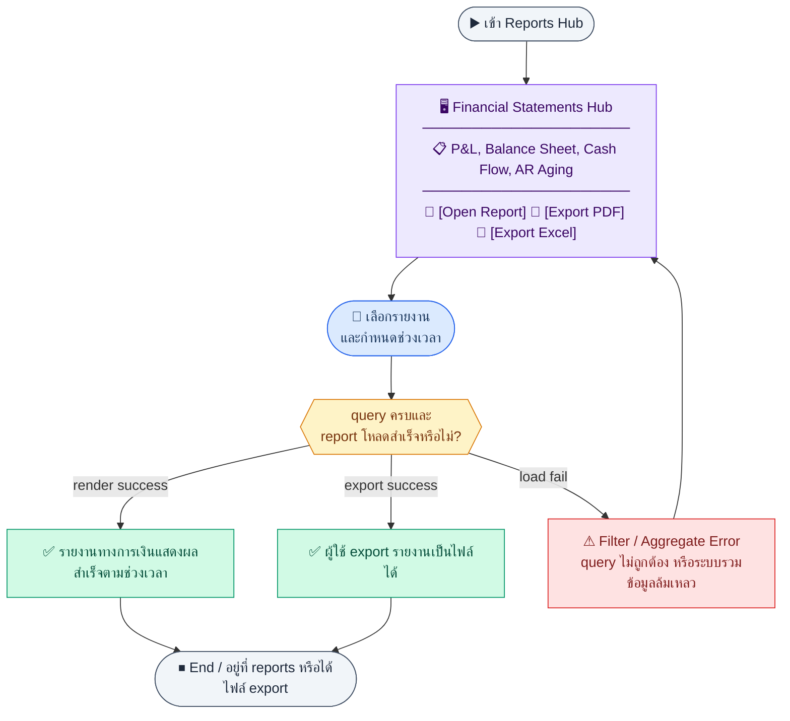
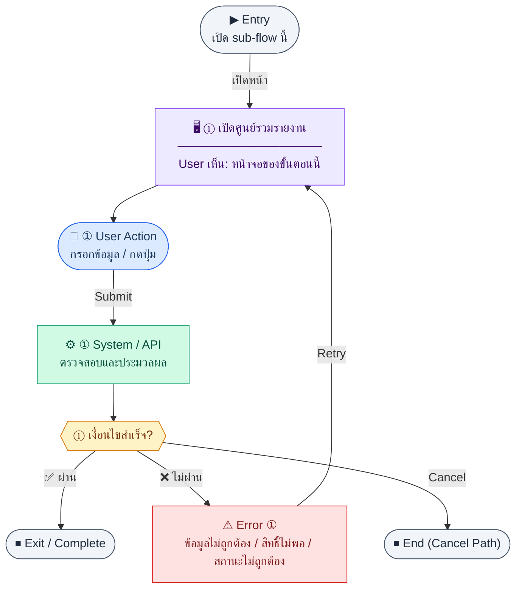
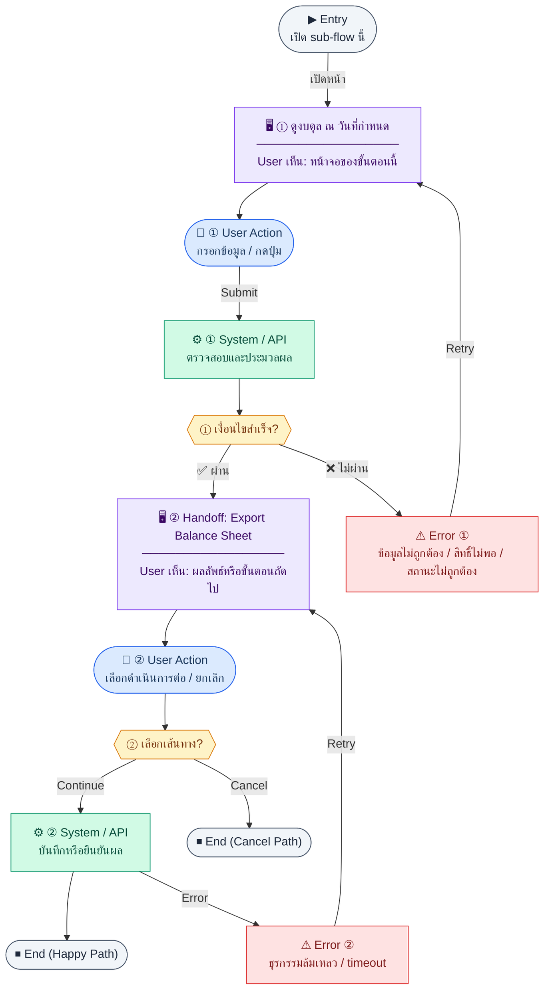

# UX Flow — งบการเงิน (Financial Statements)

ครอบคลุม **งบกำไรขาดทุน (P&L)**, **งบดุล (Balance Sheet)**, **งบกระแสเงินสด (Cash Flow)** และ paired export flows ที่ต้องใช้ filter ชุดเดียวกับรายงานแต่ละชนิด

**แหล่งอ้างอิงที่ผูกกับเอกสารนี้**

- Business requirement (BR): `Documents/Requirements/Release_2.md` (§3.4 Financial Statements)
- Traceability: `Documents/Requirements/Release_2_traceability_mermaid.md` (Feature 3.4 — Financial Statements)
- Sequence / SD_Flow: `Documents/SD_Flow/Finance/reports.md`, `Documents/SD_Flow/Finance/document_exports.md` (export ของทั้งสามงบ)
- บัญชีแมปประเภท: `Documents/Requirements/Release_2.md` (ตาราง accountType → statement)

---

## E2E Scenario Flow

> ผู้ใช้เข้า Reports Hub เพื่อเลือกงบกำไรขาดทุน งบดุล งบกระแสเงินสด หรือ AR Aging กำหนดช่วงเวลาตามชนิดรายงาน ดูตัวเลขสรุปจากข้อมูลบัญชีจริง และ export เอกสารนำเสนอหรือยื่นต่อภายนอกได้จาก flow เดียวกัน

### Scenario Summary

| Scenario | ขั้นตอน | ผลลัพธ์ |
|----------|---------|---------|
| ✅ เข้า reports hub | เปิด `/finance/reports` | เห็นทางเข้ารายงานหลักทั้งหมด |
| ✅ ดู P&L | เลือกช่วง `periodFrom/periodTo` | เห็นรายได้ ค่าใช้จ่าย และกำไรสุทธิ |
| ✅ ดู Balance Sheet | เลือก `asOfDate` | เห็นสินทรัพย์ หนี้สิน ทุน ณ วันอ้างอิง |
| ✅ ดู Cash Flow | เลือกช่วงเวลา | เห็นกระแสเงินสดตามหมวด operating/investing/financing |
| ✅ ดู AR Aging | เปิดรายงานอายุหนี้ | เห็น aging bucket ต่อ customer |
| ✅ Export รายงาน | กด export `pdf/xlsx` จากรายงานที่เปิดอยู่ | ได้ไฟล์งบตามรูปแบบที่ต้องการ |
| ⚠ ช่วงเวลาไม่ถูกต้อง | ใส่ filter ไม่ครบหรือผิดรูปแบบ | ระบบแจ้ง validation error |
| ⚠ aggregate หรือโหลดข้อมูลไม่สำเร็จ | report source ล้มเหลวหรือไม่มีสิทธิ์ | ระบบแสดง load error และให้ retry |

---
## ชื่อ Flow & ขอบเขต

**Flow name:** `Finance — P&L, Balance Sheet, Cash Flow + Export Handoff`

**Actor(s):** `finance_manager`

**Entry:** `/finance/reports` (hub) → ลิงก์ไปแต่ละรายงาน

**Exit:** ผู้ใช้ได้ข้อมูลบนหน้าจอครบตามช่วงวันที่เลือก หรือได้ไฟล์ export แล้ว

**Out of scope:** รายละเอียดเชิงลึกและ action ของ AR Aging อยู่ใน `R2-02_AR_Payment_Tracking.md`; เอกสารนี้ครอบคลุมเฉพาะการเข้า reports hub, shared filters และการเปิดดูรายงาน AR Aging ในฐานะหนึ่งใน report types ของ hub เดียวกัน

---

## Sub-flow A — Reports hub & Summary รวม

**กลุ่ม endpoint:** `GET /api/finance/reports/summary` (ถ้าใช้บนหน้า hub ตาม `reports.md`)

### Scenario Flow

### สัญลักษณ์ Node (Color Legend)

| สี | Node shape | หมายถึง |
|----|-----------|---------|
| 🟣 ม่วง | สี่เหลี่ยม `["…"]` | **Screen / UI State** |
| 🔵 น้ำเงิน | วงกลม `(["…"])` | **User Action** |
| 🟢 เขียว | สี่เหลี่ยม `["…"]` | **System / API** |
| 🟡 เหลือง | เพชร `{{"…"}}` | **Decision** |
| 🔴 แดง | สี่เหลี่ยม `["…"]` | **Error / Edge case** |
| ⚫ เทา | วงรี `(["…"])` | **Start / End** |

---

### Step A1 — เปิดศูนย์รวมรายงาน

**Goal:** เห็นทางเข้าทุกรายงานและตัวเลขสรุประดับสูง (ถ้ามี API)

**User sees:** `/finance/reports` การ์ดลิงก์ไป P&L, Balance Sheet, Cash Flow, AR Aging

**User can do:** เลือกรายงาน

**User Action:**
- ประเภท: `กดปุ่ม`
- ปุ่ม / Controls ในหน้านี้:
  - `[Open Profit & Loss]` → ไปหน้ารายงาน P&L
  - `[Open Balance Sheet]` → ไปหน้างบดุล
  - `[Open Cash Flow]` → ไปหน้างบกระแสเงินสด
  - `[Open AR Aging]` → ไป flow รายละเอียดใน `R2-02_AR_Payment_Tracking.md`

**Frontend behavior:**

- อาจเรียก `GET /api/finance/reports/summary` เพื่อแสดง KPI บน hub (ตาม inventory SD)

**System / AI behavior:** aggregate เบื้องต้นจาก journal / AR ตามออกแบบ BE

**Success:** ลิงก์และตัวเลข (ถ้ามี) โหลดครบ

**Error:** แสดง partial layout + retry

**Notes:** BR ระบุให้อัปเดต hub ให้มีลิงก์ครบ

---

## Sub-flow B — Profit & Loss (งบกำไรขาดทุน)

**กลุ่ม endpoint:** `GET /api/finance/reports/profit-loss`, `GET /api/finance/reports/profit-loss/export`

### Scenario Flow

### สัญลักษณ์ Node (Color Legend)

| สี | Node shape | หมายถึง |
|----|-----------|---------|
| 🟣 ม่วง | สี่เหลี่ยม `["…"]` | **Screen / UI State** |
| 🔵 น้ำเงิน | วงกลม `(["…"])` | **User Action** |
| 🟢 เขียว | สี่เหลี่ยม `["…"]` | **System / API** |
| 🟡 เหลือง | เพชร `{{"…"}}` | **Decision** |
| 🔴 แดง | สี่เหลี่ยม `["…"]` | **Error / Edge case** |
| ⚫ เทา | วงรี `(["…"])` | **Start / End** |

---

### Step B1 — ดู P&L ตามช่วงเดือน

**Goal:** วิเคราะห์รายได้และค่าใช้จ่ายในช่วง `periodFrom`–`periodTo` และเปรียบเทียบงวดก่อน (ถ้าเปิด)

**User sees:** `/finance/reports/profit-loss` ตาราง/section ที่ bind จาก `series[]` พร้อม summary จาก `totals` และสถานะจาก `meta`

**User can do:** เลือกช่วงเดือน (YYYY-MM), toggle `comparePrevious`

**User Action:**
- ประเภท: `กรอกข้อมูล / เลือกตัวเลือก`
- ช่องที่ต้องกรอก:
  - `periodFrom` *(required)* : เดือนเริ่มต้น
  - `periodTo` *(required)* : เดือนสิ้นสุด
  - `comparePrevious` *(optional)* : เปรียบเทียบงวดก่อน
- ปุ่ม / Controls ในหน้านี้:
  - `[Preview Report]` → เรียก `GET /api/finance/reports/profit-loss`
  - `[Export]` → ไปขั้นตอน export

**Frontend behavior:**

- `GET /api/finance/reports/profit-loss?periodFrom=&periodTo=&comparePrevious=` (ตาม BR)
- bind หน้าจอจาก `data.series[]`, `data.totals`, `data.meta` โดยตรง; ห้ามแปลงสมมติเป็น shape แยก `revenue[]` / `expenses[]` เอง

**System / AI behavior:** aggregate `journal_lines` JOIN `chart_of_accounts` ตาม accountType `income` / `expense`; ถ้าต้องแยก COGS ให้ BE ส่งผ่าน `series[].section`

**Success:** ตัวเลขสอดคล้องกับ GL สำหรับช่วงเดียวกัน

**Error:** 400 พารามิเตอร์วันที่; 403

**Notes:** accountType mapping ดูที่ BR §3.4

### Step B2 — Handoff: Export P&L

**Goal:** ดาวน์โหลดงบเป็น PDF/XLSX

**User sees:** ปุ่ม “Export” + เลือก `format`

**User can do:** ยืนยัน

**User Action:**
- ประเภท: `เลือกตัวเลือก / กดปุ่ม`
- ช่องที่ต้องกรอก:
  - `format` *(required)* : pdf หรือ xlsx
- ปุ่ม / Controls ในหน้านี้:
  - `[Download P&L]` → เรียก export endpoint
  - `[Cancel]` → ปิด dialog

**Frontend behavior:**

- `GET /api/finance/reports/profit-loss/export?periodFrom=&periodTo=&comparePrevious=&format=` (พารามิเตอร์สอดคล้องกับหน้าจอ — อ้างอิง contract BE)

**System / AI behavior:** สร้างไฟล์จาก dataset เดียวกับ on-screen report

**Success:** ไฟล์ได้รับ

**Error:** 400 format; 5xx

**Notes:** Endpoint ระบุใน `Documents/SD_Flow/Finance/document_exports.md`

---

## Sub-flow C — Balance Sheet (งบดุล)

**กลุ่ม endpoint:** `GET /api/finance/reports/balance-sheet`, `GET /api/finance/reports/balance-sheet/export`

### Scenario Flow

### สัญลักษณ์ Node (Color Legend)

| สี | Node shape | หมายถึง |
|----|-----------|---------|
| 🟣 ม่วง | สี่เหลี่ยม `["…"]` | **Screen / UI State** |
| 🔵 น้ำเงิน | วงกลม `(["…"])` | **User Action** |
| 🟢 เขียว | สี่เหลี่ยม `["…"]` | **System / API** |
| 🟡 เหลือง | เพชร `{{"…"}}` | **Decision** |
| 🔴 แดง | สี่เหลี่ยม `["…"]` | **Error / Edge case** |
| ⚫ เทา | วงรี `(["…"])` | **Start / End** |

---

### Step C1 — ดูงบดุล ณ วันที่กำหนด

**Goal:** ตรวจสอบสินทรัพย์ = หนี้สิน + ส่วนของผู้ถือหุ้น ณ `asOfDate`

**User sees:** `/finance/reports/balance-sheet` tree/section ที่ bind จาก `series[]` และ summary/check hint จาก `totals` + `meta`

**User can do:** เลือก `asOfDate` (YYYY-MM-DD ตาม BR)

**User Action:**
- ประเภท: `กรอกข้อมูล / เลือกตัวเลือก`
- ช่องที่ต้องกรอก:
  - `asOfDate` *(required)* : วันที่ของงบดุล
- ปุ่ม / Controls ในหน้านี้:
  - `[Preview Report]` → เรียก `GET /api/finance/reports/balance-sheet`
  - `[Export]` → ไปขั้นตอน export

**Frontend behavior:**

- `GET /api/finance/reports/balance-sheet?asOfDate=`

**System / AI behavior:** cumulative balance per account ถึงวันที่กำหนด

**Success:** โครงสร้างงบถูกต้องตามประเภทบัญชี asset/liability/equity

**Error:** 400 ไม่ส่ง asOfDate

**Notes:** ต้องมี `accountType` ใน CoA ครบตาม BR

### Step C2 — Handoff: Export Balance Sheet

**Goal:** ส่งออกงบดุล

**User sees:** ปุ่ม export

**User can do:** เลือก format และดาวน์โหลด

**User Action:**
- ประเภท: `เลือกตัวเลือก / กดปุ่ม`
- ช่องที่ต้องกรอก:
  - `format` *(required)* : pdf หรือ xlsx
- ปุ่ม / Controls ในหน้านี้:
  - `[Download Balance Sheet]` → เรียก export endpoint
  - `[Cancel]` → ปิด dialog

**Frontend behavior:**

- `GET /api/finance/reports/balance-sheet/export?asOfDate=&format=`

**System / AI behavior:** render ไฟล์

**Success:** ไฟล์ครบ

**Error:** 403/400

**Notes:** `document_exports.md`

---

## Sub-flow D — Cash Flow Statement (งบกระแสเงินสด)

**กลุ่ม endpoint:** `GET /api/finance/reports/cash-flow`, `GET /api/finance/reports/cash-flow/export`

### Scenario Flow

### สัญลักษณ์ Node (Color Legend)

| สี | Node shape | หมายถึง |
|----|-----------|---------|
| 🟣 ม่วง | สี่เหลี่ยม `["…"]` | **Screen / UI State** |
| 🔵 น้ำเงิน | วงกลม `(["…"])` | **User Action** |
| 🟢 เขียว | สี่เหลี่ยม `["…"]` | **System / API** |
| 🟡 เหลือง | เพชร `{{"…"}}` | **Decision** |
| 🔴 แดง | สี่เหลี่ยม `["…"]` | **Error / Edge case** |
| ⚫ เทา | วงรี `(["…"])` | **Start / End** |

---

### Step D1 — ดูงบกระแสเงินสดตามช่วง

**Goal:** เห็นเงินสดต้นงวด + in/out แยก operating / investing / financing (ตาม BR UI)

**User sees:** `/finance/reports/cash-flow` สามส่วนตามการจัดประเภทของ BE

**User can do:** เลือก `periodFrom`, `periodTo`

**User Action:**
- ประเภท: `กรอกข้อมูล / เลือกตัวเลือก`
- ช่องที่ต้องกรอก:
  - `periodFrom` *(required)* : วันหรือเดือนเริ่ม
  - `periodTo` *(required)* : วันหรือเดือนสิ้นสุด
- ปุ่ม / Controls ในหน้านี้:
  - `[Preview Report]` → เรียก `GET /api/finance/reports/cash-flow`
  - `[Export]` → ไปขั้นตอน export

**Frontend behavior:**

- `GET /api/finance/reports/cash-flow?periodFrom=&periodTo=`

**System / AI behavior:** aggregate `bank_transactions` + payroll payments + AP payments ตาม BR

**Success:** ยอดปลายงวดสอดคล้องกับ movement

**Error:** 400

**Notes:** แหล่งข้อมูลหลายระบบ — FE ไม่คำนวณซ้ำ แสดงตาม response

### Step D2 — Handoff: Export Cash Flow

**Goal:** export งบกระแสเงินสด

**User sees:** ปุ่ม export + dialog เลือก `format`

**User can do:** เลือกชนิดไฟล์, ดาวน์โหลด, หรือยกเลิก

**User Action:**
- ประเภท: `เลือกตัวเลือก / กดปุ่ม`
- ช่องที่ต้องกรอก:
  - `format` *(required)* : pdf หรือ xlsx
- ปุ่ม / Controls ในหน้านี้:
  - `[Download Cash Flow]` → เรียก export endpoint
  - `[Cancel]` → ปิด dialog

**Frontend behavior:**

- `GET /api/finance/reports/cash-flow/export?periodFrom=&periodTo=&format=`
- ถ้า endpoint ใดถูกเปลี่ยนเป็น async export job ให้ follow polling/readback contract ใน `Documents/SD_Flow/Finance/document_exports.md`

**System / AI behavior:** สร้างไฟล์

**Success:** ดาวน์โหลดสำเร็จ

**Error:** 400/5xx

**Notes:** ชุด endpoint เดียวกับที่ใช้ใน `R2-09_Document_Print_Export.md` สำหรับ reporting exports

## Coverage Checklist

| Endpoint | Covered in UX file | Notes |
| --- | --- | --- |
| `GET /api/finance/reports/summary` | Sub-flow A — Reports hub & Summary รวม | Optional hub KPIs per `reports.md`. |
| `GET /api/finance/reports/ar-aging` | — | Listed in `reports.md`; UX hub only; detail in `R2-02_AR_Payment_Tracking.md`. |
| `GET /api/finance/reports/profit-loss` | Sub-flow B — Profit & Loss (งบกำไรขาดทุน) | Step B1; `periodFrom` / `periodTo` / `comparePrevious`. |
| `GET /api/finance/reports/profit-loss/export` | Sub-flow B — Profit & Loss (งบกำไรขาดทุน) | Step B2; `format`; `document_exports.md`. |
| `GET /api/finance/reports/balance-sheet` | Sub-flow C — Balance Sheet (งบดุล) | Step C1; `asOfDate`. |
| `GET /api/finance/reports/balance-sheet/export` | Sub-flow C — Balance Sheet (งบดุล) | Step C2; `document_exports.md`. |
| `GET /api/finance/reports/cash-flow` | Sub-flow D — Cash Flow Statement (งบกระแสเงินสด) | Step D1; `periodFrom` / `periodTo`. |
| `GET /api/finance/reports/cash-flow/export` | Sub-flow D — Cash Flow Statement (งบกระแสเงินสด) | Step D2; `document_exports.md`. |

## Coverage Lock Notes (2026-04-16)

### In-scope endpoints
- `GET /api/finance/reports/summary` เป็น optional hub KPI read model ของหน้า `/finance/reports`
- `GET /api/finance/reports/profit-loss`
- `GET /api/finance/reports/profit-loss/export`
- `GET /api/finance/reports/balance-sheet`
- `GET /api/finance/reports/balance-sheet/export`
- `GET /api/finance/reports/cash-flow`
- `GET /api/finance/reports/cash-flow/export`

### Canonical query / read-model rules
- P&L ใช้ `periodFrom`, `periodTo`, `comparePrevious`
- Balance Sheet ใช้ `asOfDate` และเป็น point-in-time snapshot ไม่ใช่ ranged report
- Cash Flow ใช้ `periodFrom`, `periodTo`
- statement response ต้องยึด payload จาก BE (`series[]`, `totals`, `meta`) เป็น source of truth; FE ไม่คำนวณ totals, buckets หรือ comparison rows เอง
- export ต้อง reuse filter ชุดเดียวกับ on-screen report; ถ้าใช้ async export job ให้ UX เดินตาม contract กลางใน `document_exports.md`

### UX lock
- R1 `GET /api/finance/reports/summary` กับ R2 statements ต้องสื่อ scope แยกกันชัดเจน ไม่รวมเป็น report เดียวใน wording หรือ acceptance
- `GET /api/finance/reports/ar-aging` เป็นเพียง reference-only deep link ในไฟล์นี้; ไม่ถูกนับเป็น statement coverage และ owner UX หลักอยู่ใน `R2-02_AR_Payment_Tracking.md`
- cash-flow sections `operating`, `investing`, `financing` และยอด `openingCash` / `netChange` / `closingCash` ต้อง render ตาม response จาก BE
- ถ้า response มี disclaimer หรือ flag อย่าง `isEstimated` / `disclaimer` / `lastUpdatedAt` ต้องแสดงใน UX ตามสภาพจริง ไม่ suppress เพื่อให้ตัวเลขดูนิ่งเกินจริง

## Statement Display Matrix (2026-04-16)

ส่วนนี้ใช้ล็อก minimum display/read-model ของแต่ละ statement เพื่อกัน FE ตีความ payload ต่างกันระหว่าง on-screen report กับ export

### Reports Hub

| UX surface | Fields / controls ที่ต้องเห็น | Source / UX rule |
| --- | --- | --- |
| Reports hub cards | report label, entry action, optional KPI summary จาก `GET /api/finance/reports/summary` | ถ้า summary endpoint ใช้บน hub ต้องแสดงตาม payload จริงและแยกจาก R2 statements ชัดเจน |
| Shared status area | `lastUpdatedAt`, `disclaimer`, `isEstimated` เมื่อ API ส่งมา | สถานะความสดของข้อมูลต้องแสดงบน hub หรือหน้ารายงานที่เกี่ยวข้อง ไม่ซ่อนเพื่อให้ตัวเลขดู complete เกินจริง |

### Profit & Loss

| UX surface | Fields / controls ที่ต้องเห็น | Source / UX rule |
| --- | --- | --- |
| Filter bar | `periodFrom`, `periodTo`, `comparePrevious?` | ต้องใช้ query ชุดเดียวกับ preview และ export |
| Main report | `series[]`, `totals`, `meta` | FE render จาก payload BE โดยตรง; ห้าม recompute comparison rows หรือ total summary เอง |
| Comparison state | comparison columns/rows เมื่อ `comparePrevious=true` | ถ้า API ไม่ส่ง comparison data ให้แสดงเฉพาะงวดหลักและอธิบายว่า comparison unavailable แทนการคำนวณเอง |

### Balance Sheet

| UX surface | Fields / controls ที่ต้องเห็น | Source / UX rule |
| --- | --- | --- |
| Filter bar | `asOfDate` | report นี้เป็น point-in-time snapshot; ห้ามใช้ ranged wording เช่น from/to |
| Main report | `series[]`, `totals`, `meta` | ต้องแสดง sections ตาม payload จาก BE สำหรับ assets / liabilities / equity |
| Balance validation hint | summary จาก `totals` และ `meta` | FE ไม่เช็คสมดุลเองแล้วเปลี่ยนตัวเลข แต่สามารถแสดง warning ถ้า API ส่ง flag/disclaimer ว่าข้อมูลยังไม่ final |

### Cash Flow

| UX surface | Fields / controls ที่ต้องเห็น | Source / UX rule |
| --- | --- | --- |
| Filter bar | `periodFrom`, `periodTo` | ใช้ query เดียวกันกับ export |
| Main report | `series[]`, `totals`, `meta`, และ sections `operating`, `investing`, `financing` ตาม response | opening / net change / closing cash ต้อง bind จาก payload ตรง ๆ ไม่รวมเองจากตารางบนจอ |
| Estimation / freshness state | `isEstimated`, `disclaimer`, `lastUpdatedAt` ถ้ามี | เป็น field สำคัญเพราะ cash-flow ดึงหลาย source; ต้องแสดงใกล้ report header หรือ summary bar |

## Stale / Empty / Error UX (2026-04-16)

| Scenario | Trigger | UX behavior |
| --- | --- | --- |
| Invalid statement query | query ขาด/ผิดรูปแบบ เช่น `periodFrom` > `periodTo` หรือไม่มี `asOfDate` | validate ที่ filter bar, block preview/export, และคงรายงานล่าสุดที่โหลดสำเร็จไว้ถ้ามี |
| Empty dataset | API ตอบสำเร็จแต่ `series[]` ว่างหรือ totals เป็นศูนย์สำหรับงวดนั้น | แสดง empty-state ที่ยังคง filter context ชัดเจน ไม่ใช้ generic error wording |
| Stale or estimated data | response มี `isEstimated`, `disclaimer`, หรือ `lastUpdatedAt` | แสดง banner/inline callout ชัดเจนบนหน้ารายงานและคงข้อความเดียวกันใน export entry point |
| Aggregate load fail | statement endpoint ตอบ `403`, `5xx`, หรือ source aggregate fail | แสดง retry action โดยไม่ล้าง filter ที่ผู้ใช้เลือก และแยกข้อความว่าเป็น load failure ไม่ใช่ no data |
| Export fail | export endpoint fail แม้ preview สำเร็จ | คง preview report เดิมไว้, show retry ด้วย query/format เดิม, และไม่ reset ไปหน้ารวม |
| Compare mode unavailable | `comparePrevious=true` แต่ API ไม่ส่ง comparison data | แสดง only current-period result พร้อม hint ว่า comparison not available สำหรับ query นี้ แทนการ fabricate comparison columns |

## Export Parity Notes (2026-04-16)

- export ของ `profit-loss`, `balance-sheet`, และ `cash-flow` ต้อง reuse filter snapshot ชุดเดียวกับ report บนหน้าจอทุกครั้ง
- dialog export เปลี่ยนได้เฉพาะ `format`; ห้ามให้ผู้ใช้แก้ `periodFrom`, `periodTo`, `asOfDate`, หรือ `comparePrevious` คนละค่ากับหน้าหลัก
- ถ้า export flow ใดถูกย้ายเป็น async job ภายหลัง ให้ UX นี้อ้าง contract กลางใน `Documents/SD_Flow/Finance/document_exports.md` แต่ semantic ของ query ต้องเหมือน on-screen report
