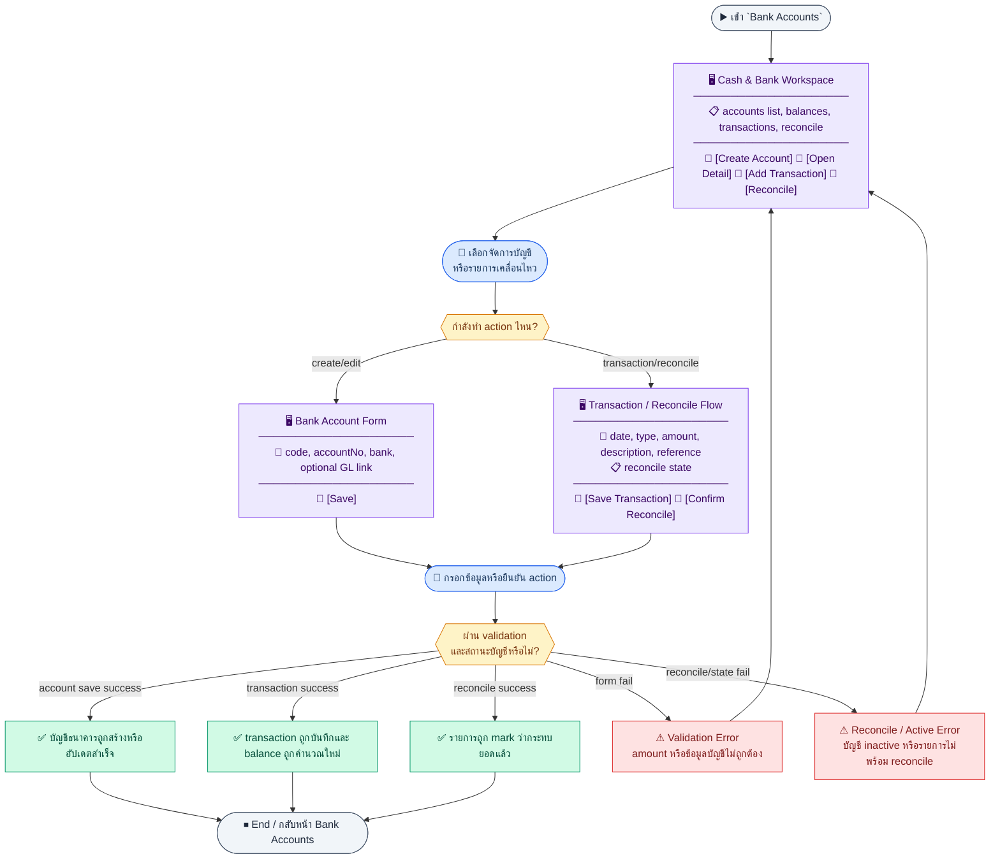
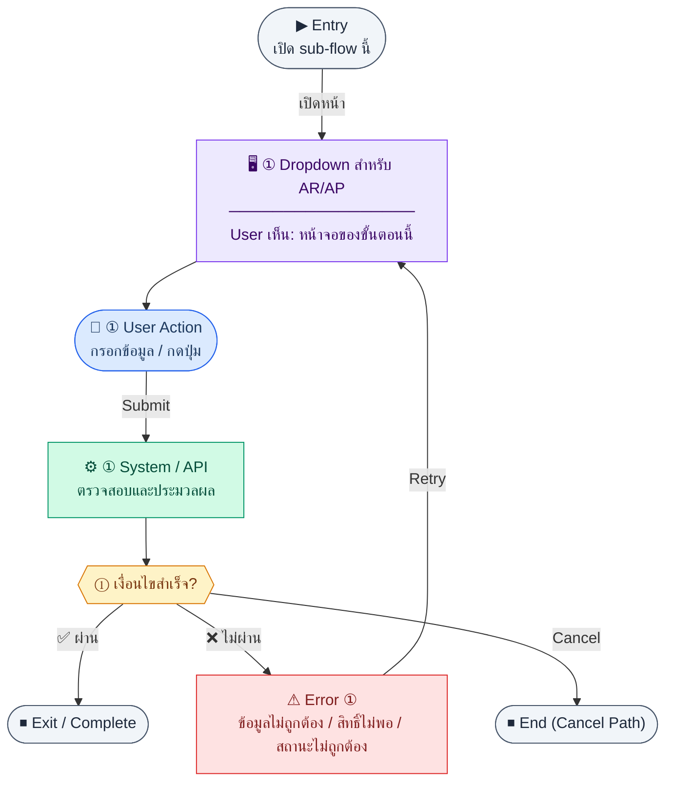
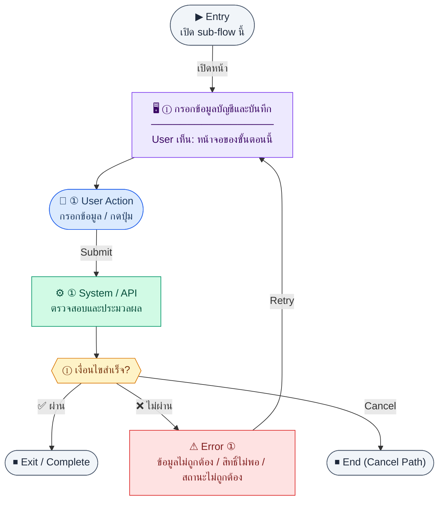
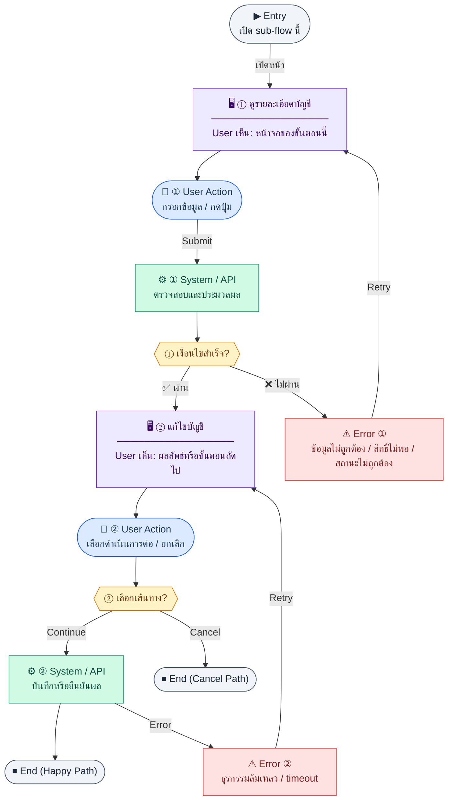
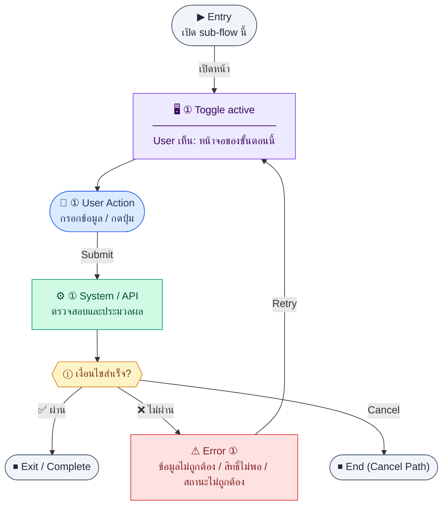
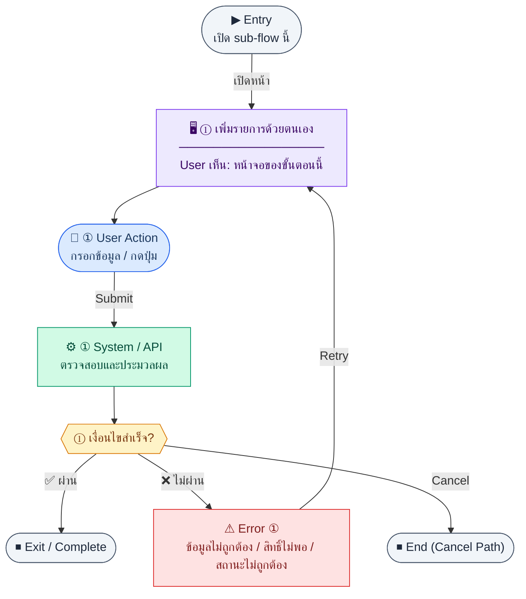
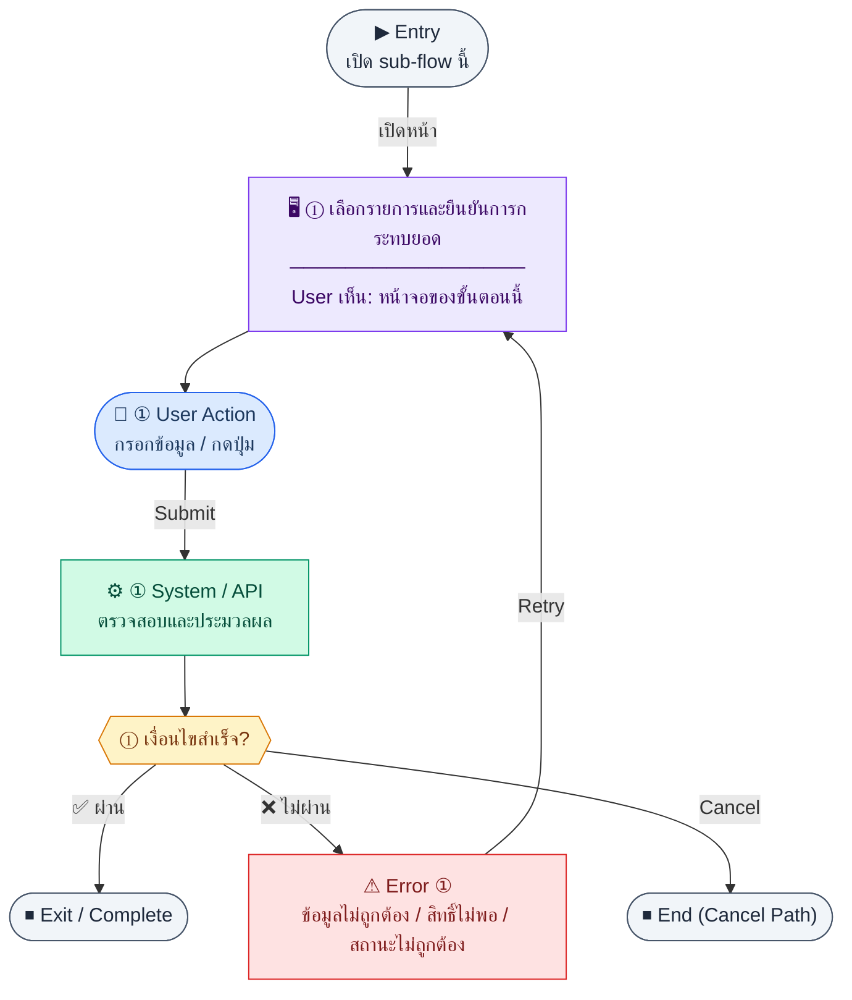

# UX Flow — เงินสด / บัญชีธนาคาร (Cash & Bank Management)

ครอบคลุม **CRUD บัญชีธนาคาร**, **รายการเคลื่อนไหว**, **บันทึกรายการด้วยมือ**, และ **การกระทบยอด (reconcile)** ตาม endpoint ใน SD_Flow

**แหล่งอ้างอิงที่ผูกกับเอกสารนี้**

- Business requirement (BR): `Documents/Requirements/Release_2.md` (§3.5 Cash / Bank Management)
- Traceability: `Documents/Requirements/Release_2_traceability_mermaid.md` (Feature 3.5 — Cash / Bank Management)
- Sequence / SD_Flow: `Documents/SD_Flow/Finance/bank_accounts.md`
- เชื่อม AR/AP: `Documents/SD_Flow/Finance/invoices.md` (payment ใส่ `bankAccountId`), `Documents/SD_Flow/Finance/ap.md`

---

## E2E Scenario Flow

> ผู้ใช้ฝ่ายการเงินบริหารบัญชีธนาคาร ดูยอดคงเหลือและรายการเคลื่อนไหว บันทึกรายการ manual เลือกบัญชีใน flow รับ/จ่ายเงิน และทำ reconciliation เพื่อให้ยอดเงินสดในระบบตรงกับธุรกรรมจริง

### Scenario Summary

| Scenario | ขั้นตอน | ผลลัพธ์ |
|----------|---------|---------|
| ✅ ดูรายการบัญชีธนาคาร | เปิด `/finance/bank-accounts` | เห็นบัญชีทั้งหมดพร้อม `currentBalance` |
| ✅ สร้าง/แก้ไขบัญชี | กดเพิ่มหรือแก้ไขข้อมูลบัญชี | ได้บัญชีพร้อมใช้ใน AR/AP |
| ✅ เปิด detail บัญชี | เปิดบัญชีหนึ่งรายการ | เห็นรายละเอียดและ movement history |
| ✅ บันทึก manual transaction | เพิ่ม deposit/withdrawal/transfer | ระบบเพิ่มรายการและคำนวณยอดใหม่ |
| ✅ reconcile รายการ | เลือกรายการที่ยืนยันจาก statement แล้วกด reconcile | รายการถูก mark ว่ากระทบยอดแล้ว |
| ✅ ใช้ใน flow อื่น | ถูกเรียกจาก AR payment หรือ AP payment | ผู้ใช้เลือกบัญชี active จาก options |
| ⚠ transaction หรือบัญชีไม่ผ่าน validation | amount ไม่ถูกต้องหรือบัญชี inactive | ระบบแสดง error และไม่บันทึก |
| ⚠ reconcile ไม่สำเร็จ | รายการยังไม่พร้อมหรือข้อมูลไม่ครบ | ระบบแจ้ง reconcile fail |

---
## ชื่อ Flow & ขอบเขต

**Flow name:** `Finance — Bank Accounts, Transactions, Reconciliation`

**Actor(s):** `finance_manager`

**Entry:** `/finance/bank-accounts` หรือลิงก์จากฟอร์มรับชำระ AR / จ่าย AP เพื่อเลือกบัญชี

**Exit:** จัดการบัญชีและรายการครบ หรือ reconcile รายการที่เลือกแล้ว

**Out of scope:** การอนุมัติสินเชื่อ; รายละเอียด GL posting ทุกบรรทัด

---

## Sub-flow A — รายการบัญชีธนาคาร (List)

**กลุ่ม endpoint:** `GET /api/finance/bank-accounts`

### Scenario Flow

### สัญลักษณ์ Node (Color Legend)

| สี | Node shape | หมายถึง |
|----|-----------|---------|
| 🟣 ม่วง | สี่เหลี่ยม `["…"]` | **Screen / UI State** |
| 🔵 น้ำเงิน | วงกลม `(["…"])` | **User Action** |
| 🟢 เขียว | สี่เหลี่ยม `["…"]` | **System / API** |
| 🟡 เหลือง | เพชร `{{"…"}}` | **Decision** |
| 🔴 แดง | สี่เหลี่ยม `["…"]` | **Error / Edge case** |
| ⚫ เทา | วงรี `(["…"])` | **Start / End** |

---

### Step A1 — เปิดหน้ารายการ

**Goal:** ดูบัญชีทั้งหมดพร้อมยอดคงเหลือปัจจุบัน

**User sees:** ตาราง `code`, `accountName`, `bankName`, `currentBalance`, `isActive`

**User can do:** ไปหน้าสร้าง, เปิด detail, (ถ้ามี) deactivate จากแถว

**User Action:**
- ประเภท: `กดปุ่ม`
- ปุ่ม / Controls ในหน้านี้:
  - `[Create Account]` → เปิดฟอร์มสร้างบัญชี
  - `[Open Detail]` → ไปหน้ารายละเอียดบัญชี
  - `[Refresh]` → โหลดรายการล่าสุด

**Frontend behavior:**

- `GET /api/finance/bank-accounts`

**System / AI behavior:** อ่าน `bank_accounts` + balance cached

**Success:** ยอดสอดคล้องกับ movement ล่าสุด

**Error:** 401/403/5xx

**Notes:** BR: `currentBalance = openingBalance + SUM(deposits) - SUM(withdrawals)` — FE แสดงค่าจาก BE

---

## Sub-flow B — ตัวเลือกบัญชี (Options)

**กลุ่ม endpoint:** `GET /api/finance/bank-accounts/options`

### Scenario Flow

### สัญลักษณ์ Node (Color Legend)

| สี | Node shape | หมายถึง |
|----|-----------|---------|
| 🟣 ม่วง | สี่เหลี่ยม `["…"]` | **Screen / UI State** |
| 🔵 น้ำเงิน | วงกลม `(["…"])` | **User Action** |
| 🟢 เขียว | สี่เหลี่ยม `["…"]` | **System / API** |
| 🟡 เหลือง | เพชร `{{"…"}}` | **Decision** |
| 🔴 แดง | สี่เหลี่ยม `["…"]` | **Error / Edge case** |
| ⚫ เทา | วงรี `(["…"])` | **Start / End** |

---

### Step B1 — Dropdown สำหรับ AR/AP

**Goal:** เลือกบัญชีที่รับเงิน/จ่ายเงิน

**User sees:** รายการเฉพาะ active (ตาม BR)

**User can do:** เลือกบัญชี

**User Action:**
- ประเภท: `เลือกตัวเลือก / กดปุ่ม`
- ช่องที่ต้องกรอก:
  - `bankAccountId` *(required)* : บัญชีที่เลือกใช้ใน AR/AP
- ปุ่ม / Controls ในหน้านี้:
  - `[Select Account]` → เลือกบัญชี active
  - `[Create Bank Account]` → ไปหน้าสร้างบัญชีเมื่อรายการว่าง

**Frontend behavior:**

- `GET /api/finance/bank-accounts/options` ในฟอร์ม `POST /api/finance/invoices/:id/payments` และ AP payment (ตาม BR linkage)
- ถ้า response เป็น `[]` ให้แสดง empty state ใน dropdown ว่า `ยังไม่มีบัญชีธนาคารที่ active` พร้อม CTA `สร้างบัญชีธนาคาร` และ deep link ไป `/finance/bank-accounts/new`

**System / AI behavior:** filter `isActive = true`

**Success:** บันทึก payment พร้อม `bankAccountId` ถูกต้อง

**Error:** empty list → แนะนำให้สร้างบัญชีก่อนและคง modal/payment form ไว้ในสถานะ draft เพื่อไม่ให้ user ต้องกรอกใหม่

**Notes:** Traceability bank section ใน Release 2

---

## Sub-flow C — สร้างบัญชีธนาคาร (Create)

**กลุ่ม endpoint:** `POST /api/finance/bank-accounts`

### Scenario Flow

### สัญลักษณ์ Node (Color Legend)

| สี | Node shape | หมายถึง |
|----|-----------|---------|
| 🟣 ม่วง | สี่เหลี่ยม `["…"]` | **Screen / UI State** |
| 🔵 น้ำเงิน | วงกลม `(["…"])` | **User Action** |
| 🟢 เขียว | สี่เหลี่ยม `["…"]` | **System / API** |
| 🟡 เหลือง | เพชร `{{"…"}}` | **Decision** |
| 🔴 แดง | สี่เหลี่ยม `["…"]` | **Error / Edge case** |
| ⚫ เทา | วงรี `(["…"])` | **Start / End** |

---

### Step C1 — กรอกข้อมูลบัญชีและบันทึก

**Goal:** เพิ่มบัญชีใหม่พร้อม opening balance และ optional GL link (`glAccountId` ตาม schema BR)

**User sees:** `/finance/bank-accounts/new` ฟอร์ม code, ชื่อบัญชี, เลขบัญชี, ธนาคาร, สาขา, ประเภทบัญชี, สกุลเงิน, openingBalance และตัวเลือกผูก GL account ถ้ามี

**User can do:** บันทึก

**User Action:**
- ประเภท: `กรอกข้อมูล / เลือกตัวเลือก`
- ช่องที่ต้องกรอก:
  - `code` *(required)* : รหัสบัญชีธนาคาร
  - `accountName` *(required)* : ชื่อบัญชี
  - `accountNo` *(required)* : เลขที่บัญชี
  - `bankName` *(required)* : ชื่อธนาคาร
  - `glAccountId` *(optional)* : บัญชี GL ที่ผูก
  - `openingBalance` *(optional)* : ยอดยกมา
- ปุ่ม / Controls ในหน้านี้:
  - `[Save Bank Account]` → บันทึกบัญชีใหม่
  - `[Cancel]` → ยกเลิก

**Frontend behavior:**

- validate ฟิลด์บังคับ + uniqueness `code`
- `POST /api/finance/bank-accounts`

**System / AI behavior:** insert `bank_accounts`; ตั้ง `currentBalance` เริ่มต้น

**Success:** 201 + redirect `/finance/bank-accounts/:id`

**Error:** 409 code ซ้ำ; 400

**Notes:** SD_Flow `bank_accounts.md`

---

## Sub-flow D — รายละเอียดและแก้ไข (Detail + Update)

**กลุ่ม endpoint:** `GET /api/finance/bank-accounts/:id`, `PATCH /api/finance/bank-accounts/:id`

### Scenario Flow

### สัญลักษณ์ Node (Color Legend)

| สี | Node shape | หมายถึง |
|----|-----------|---------|
| 🟣 ม่วง | สี่เหลี่ยม `["…"]` | **Screen / UI State** |
| 🔵 น้ำเงิน | วงกลม `(["…"])` | **User Action** |
| 🟢 เขียว | สี่เหลี่ยม `["…"]` | **System / API** |
| 🟡 เหลือง | เพชร `{{"…"}}` | **Decision** |
| 🔴 แดง | สี่เหลี่ยม `["…"]` | **Error / Edge case** |
| ⚫ เทา | วงรี `(["…"])` | **Start / End** |

---

### Step D1 — ดูรายละเอียดบัญชี

**Goal:** ตรวจสอบข้อมูลบัญชีและยอดก่อนทำธุรกรรมอื่น

**User sees:** `/finance/bank-accounts/:id` header ข้อมูล + แท็บ transactions

**User can do:** แก้ไขข้อมูลบางส่วน, ไป reconcile

**User Action:**
- ประเภท: `กดปุ่ม`
- ปุ่ม / Controls ในหน้านี้:
  - `[Edit Account]` → เข้าโหมดแก้ไข
  - `[Open Transactions]` → ดู movement history
  - `[Reconcile]` → ไป flow กระทบยอด

**Frontend behavior:**

- `GET /api/finance/bank-accounts/:id`

**System / AI behavior:** คืน record พร้อม balance

**Success:** ข้อมูลตรงกับ list

**Error:** 404

### Step D2 — แก้ไขบัญชี

**Goal:** อัปเดตชื่อสาขา, ชื่อบัญชี, และ GL link ของบัญชี (ไม่แก้ยอดย้อนหลังโดยตรงถ้า BE ห้าม)

**User sees:** ฟอร์มแก้ไข

**User can do:** บันทึก

**User Action:**
- ประเภท: `กรอกข้อมูล / เลือกตัวเลือก`
- ช่องที่ต้องกรอก:
  - `accountName` *(optional)* : ชื่อบัญชี
  - `branchName` *(optional)* : สาขา
  - `glAccountId` *(optional)* : บัญชี GL
- ปุ่ม / Controls ในหน้านี้:
  - `[Save Changes]` → บันทึกการแก้ไข
  - `[Cancel]` → ยกเลิก

**Frontend behavior:**

- `PATCH /api/finance/bank-accounts/:id` partial body

**System / AI behavior:** validate business rules

**Success:** 200

**Error:** 409/400

**Notes:** การเปลี่ยน `glAccountId` มีผลต่อ reporting / auto-post ในอนาคต — แจ้งเตือนผู้ใช้ถ้า BE ส่ง warning แต่ flow นี้ไม่ใช่หน้า full GL-mapping management

---

## Sub-flow E — เปิด/ปิดใช้งานบัญชี (Activate)

**กลุ่ม endpoint:** `PATCH /api/finance/bank-accounts/:id/activate`

### Scenario Flow

### สัญลักษณ์ Node (Color Legend)

| สี | Node shape | หมายถึง |
|----|-----------|---------|
| 🟣 ม่วง | สี่เหลี่ยม `["…"]` | **Screen / UI State** |
| 🔵 น้ำเงิน | วงกลม `(["…"])` | **User Action** |
| 🟢 เขียว | สี่เหลี่ยม `["…"]` | **System / API** |
| 🟡 เหลือง | เพชร `{{"…"}}` | **Decision** |
| 🔴 แดง | สี่เหลี่ยม `["…"]` | **Error / Edge case** |
| ⚫ เทา | วงรี `(["…"])` | **Start / End** |

---

### Step E1 — Toggle active

**Goal:** ปิดบัญชีที่ไม่ใช้แล้วจาก dropdown แต่เก็บประวัติ

**User sees:** ปุ่มระงับ/เปิดใช้งาน

**User can do:** ยืนยัน

**User Action:**
- ประเภท: `กดปุ่ม`
- ข้อมูลที่จะส่ง:
  - `isActive` *(required)* : สถานะใหม่ของบัญชี
- ปุ่ม / Controls ในหน้านี้:
  - `[Confirm Toggle]` → เปิด/ปิดบัญชี
  - `[Cancel]` → ยกเลิก

**Frontend behavior:**

- `PATCH /api/finance/bank-accounts/:id/activate`

**System / AI behavior:** อัปเดต `isActive`

**Success:** options ไม่แสดงบัญชีที่ปิด

**Error:** 403; 409 ถ้ามียอดค้าง reconcile (ถ้า BE กำหนด)

**Notes:** สอดคล้อง `GET .../options`

---

## Sub-flow F — รายการเคลื่อนไหว (Transactions list)

**กลุ่ม endpoint:** `GET /api/finance/bank-accounts/:id/transactions`

### Scenario Flow

### สัญลักษณ์ Node (Color Legend)

| สี | Node shape | หมายถึง |
|----|-----------|---------|
| 🟣 ม่วง | สี่เหลี่ยม `["…"]` | **Screen / UI State** |
| 🔵 น้ำเงิน | วงกลม `(["…"])` | **User Action** |
| 🟢 เขียว | สี่เหลี่ยม `["…"]` | **System / API** |
| 🟡 เหลือง | เพชร `{{"…"}}` | **Decision** |
| 🔴 แดง | สี่เหลี่ยม `["…"]` | **Error / Edge case** |
| ⚫ เทา | วงรี `(["…"])` | **Start / End** |

---

### Step F1 — ดูประวัติการเคลื่อนไหว

**Goal:** audit เงินเข้า-ออกและสถานะ reconcile พร้อมติดตามยอดคงเหลือสะสม

**User sees:** ตาราง `transactionDate`, `description`, `amount` (+/-), `type`, `referenceType`/`referenceId`, `runningBalance` (ยอดคงเหลือสะสม), `reconciled`

**User can do:** กรองช่วงวันที่, สถานะ reconciled, เปิดฟอร์ม manual entry

**User Action:**
- ประเภท: `เลือกตัวเลือก / กดปุ่ม`
- ช่องที่ใช้กรอง/ดูข้อมูล:
  - `from` / `to` *(optional)* : ช่วงวันที่
  - `reconciled` *(optional)* : สถานะกระทบยอด
- ปุ่ม / Controls ในหน้านี้:
  - `[Apply Filters]` → โหลดรายการเคลื่อนไหว
  - `[Add Manual Transaction]` → เปิดฟอร์มเพิ่มรายการ

**Frontend behavior:**

- `GET /api/finance/bank-accounts/:id/transactions` พร้อม query filter ตาม BE

**System / AI behavior:** รวมทั้งรายการอัตโนมัติจาก AR/AP/payroll และ manual

**Success:** 
- ยอดคงเหลือสุดท้ายสอดคล้องกับ `currentBalance` ของบัญชี
- Running balance แต่ละแถวคำนวณถูกต้อง (สะสมจากการบวก/ลบ)

**Error:** 400 filter

**Notes:** 
- BR — AR payment สร้าง deposit; AP payment สร้าง withdrawal
- Running balance ใช้สำหรับ audit: user สามารถ trace ยอดเงินในแต่ละช่วงเวลา

---

## Sub-flow G — บันทึกรายการด้วยมือ (Manual transaction)

**กลุ่ม endpoint:** `POST /api/finance/bank-accounts/:id/transactions`

### Scenario Flow

### สัญลักษณ์ Node (Color Legend)

| สี | Node shape | หมายถึง |
|----|-----------|---------|
| 🟣 ม่วง | สี่เหลี่ยม `["…"]` | **Screen / UI State** |
| 🔵 น้ำเงิน | วงกลม `(["…"])` | **User Action** |
| 🟢 เขียว | สี่เหลี่ยม `["…"]` | **System / API** |
| 🟡 เหลือง | เพชร `{{"…"}}` | **Decision** |
| 🔴 แดง | สี่เหลี่ยม `["…"]` | **Error / Edge case** |
| ⚫ เทา | วงรี `(["…"])` | **Start / End** |

---

### Step G1 — เพิ่มรายการด้วยตนเอง

**Goal:** บันทึกเงินเข้า/ออกที่ไม่ผูกเอกสารอัตโนมัติ

**User sees:** ฟอร์ม: วันที่, คำอธิบาย, จำนวน, type (deposit/withdrawal/transfer)

**User can do:** บันทึก

**User Action:**
- ประเภท: `กรอกข้อมูล / เลือกตัวเลือก`
- ช่องที่ต้องกรอก:
  - `transactionDate` *(required)* : วันที่รายการ
  - `description` *(required)* : รายละเอียด
  - `amount` *(required)* : จำนวนเงิน
  - `type` *(required)* : deposit, withdrawal, transfer
- ปุ่ม / Controls ในหน้านี้:
  - `[Save Transaction]` → บันทึกรายการด้วยมือ
  - `[Cancel]` → ยกเลิก

**Frontend behavior:**

- `POST /api/finance/bank-accounts/:id/transactions` body ตาม contract BE
- รีเฟรช `GET .../transactions` และ detail account

**System / AI behavior:** insert `bank_transactions`, recompute balance

**Success:** รายการใหม่ปรากฏพร้อม `referenceType = manual` (ถ้า BE ใช้ค่านี้)

**Error:** 400 validation

**Notes:** BR กำหนดให้มี type + description

---

## Sub-flow H — กระทบยอด (Reconcile)

**กลุ่ม endpoint:** `POST /api/finance/bank-accounts/:id/reconcile`

### Scenario Flow

### สัญลักษณ์ Node (Color Legend)

| สี | Node shape | หมายถึง |
|----|-----------|---------|
| 🟣 ม่วง | สี่เหลี่ยม `["…"]` | **Screen / UI State** |
| 🔵 น้ำเงิน | วงกลม `(["…"])` | **User Action** |
| 🟢 เขียว | สี่เหลี่ยม `["…"]` | **System / API** |
| 🟡 เหลือง | เพชร `{{"…"}}` | **Decision** |
| 🔴 แดง | สี่เหลี่ยม `["…"]` | **Error / Edge case** |
| ⚫ เทา | วงรี `(["…"])` | **Start / End** |

---

### Step H1 — เลือกรายการและยืนยันการกระทบยอด

**Goal:** ทำเครื่องหมายรายการที่ตรงกับ bank statement แล้ว

**User sees:** checkbox หลายแถว + ปุ่ม “กระทบยอดที่เลือก”

**User can do:** เลือกแถว, ส่ง reconcile

**User Action:**
- ประเภท: `เลือกตัวเลือก / กดปุ่ม`
- ช่องที่ต้องกรอก:
  - `transactionIds` *(required)* : รายการเคลื่อนไหวที่ตรง statement
- ปุ่ม / Controls ในหน้านี้:
  - `[Reconcile Selected]` → ยืนยันการกระทบยอด
  - `[Cancel]` → ยกเลิก

**Frontend behavior:**

- `POST /api/finance/bank-accounts/:id/reconcile` พร้อม body รายการ id ที่เลือก (ตาม schema BE — อาจเป็น `{ "transactionIds": [...] }`)
- รีเฟรช transactions

**System / AI behavior:** อัปเดต `reconciled`, `reconciledAt`, `reconciledBy`

**Success:** แถวแสดงสถานะ reconciled และไม่ถูกเลือกซ้ำในงาน reconcile เดิม

**Error:** 409 (รายการถูก reconcile แล้ว); 403

**Notes:** BR — reconcile คือ confirmed กับ bank statement; ไม่มี AI ใน flow นี้

## Coverage Checklist

| Endpoint | Covered in UX file | Notes |
| --- | --- | --- |
| `GET /api/finance/bank-accounts` | Sub-flow A — รายการบัญชีธนาคาร (List) | Step A1; balances from BE. |
| `GET /api/finance/bank-accounts/options` | Sub-flow B — ตัวเลือกบัญชี (Options) | Step B1; AR/AP payment dropdowns. |
| `POST /api/finance/bank-accounts` | Sub-flow C — สร้างบัญชีธนาคาร (Create) | Step C1; opening balance / GL map. |
| `GET /api/finance/bank-accounts/:id` | Sub-flow D — รายละเอียดและแก้ไข (Detail + Update) | Step D1. |
| `PATCH /api/finance/bank-accounts/:id` | Sub-flow D — รายละเอียดและแก้ไข (Detail + Update) | Step D2; partial update. |
| `PATCH /api/finance/bank-accounts/:id/activate` | Sub-flow E — เปิด/ปิดใช้งานบัญชี (Activate) | Step E1; affects options. |
| `GET /api/finance/bank-accounts/:id/transactions` | Sub-flow F — รายการเคลื่อนไหว (Transactions list) | Step F1; filters; AR/AP/manual mix. |
| `POST /api/finance/bank-accounts/:id/transactions` | Sub-flow G — บันทึกรายการด้วยมือ (Manual transaction) | Step G1. |
| `POST /api/finance/bank-accounts/:id/reconcile` | Sub-flow H — กระทบยอด (Reconcile) | Step H1; selected transaction ids. |

## Coverage Lock Notes (2026-04-16)

### In-scope endpoints
- `GET /api/finance/bank-accounts`
- `GET /api/finance/bank-accounts/options`
- `POST /api/finance/bank-accounts`
- `GET /api/finance/bank-accounts/:id`
- `PATCH /api/finance/bank-accounts/:id`
- `PATCH /api/finance/bank-accounts/:id/activate`
- `GET /api/finance/bank-accounts/:id/transactions`
- `POST /api/finance/bank-accounts/:id/transactions`
- `POST /api/finance/bank-accounts/:id/reconcile`

### Canonical read models
- transaction rows ต้องยึด `referenceType`, `referenceId`, `description`, `amount`, `reconciled`, `transactionDate`

### UX lock
- `glAccountId` เป็น canonical field สำหรับผูก bank account เข้ากับ GL account เท่านั้น ไม่ใช่ scope ของหน้าจัดการ mapping rules หรือ GL configuration เต็มรูปแบบ
- ถ้ายังไม่ตั้ง `glAccountId` ให้ UX สื่อเป็น warning/limited integration state ได้ แต่ห้ามขยาย wording จนผู้อ่านเข้าใจว่าหน้านี้รองรับ GL-management เต็มระบบ
