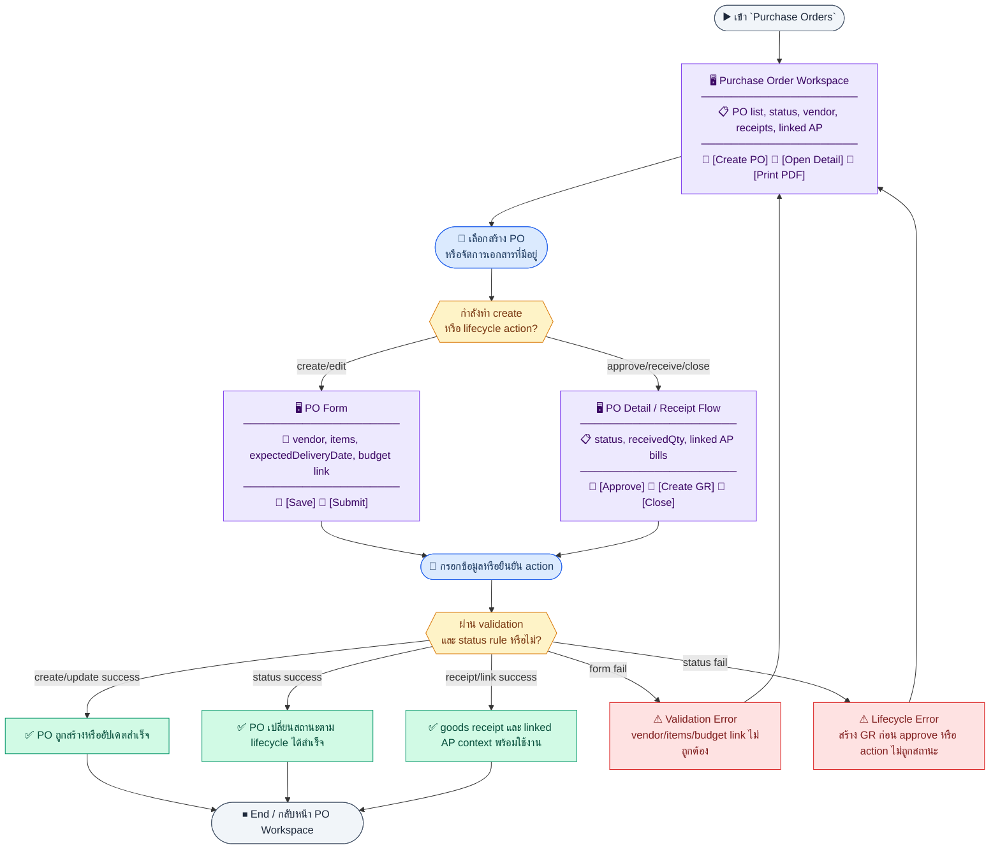
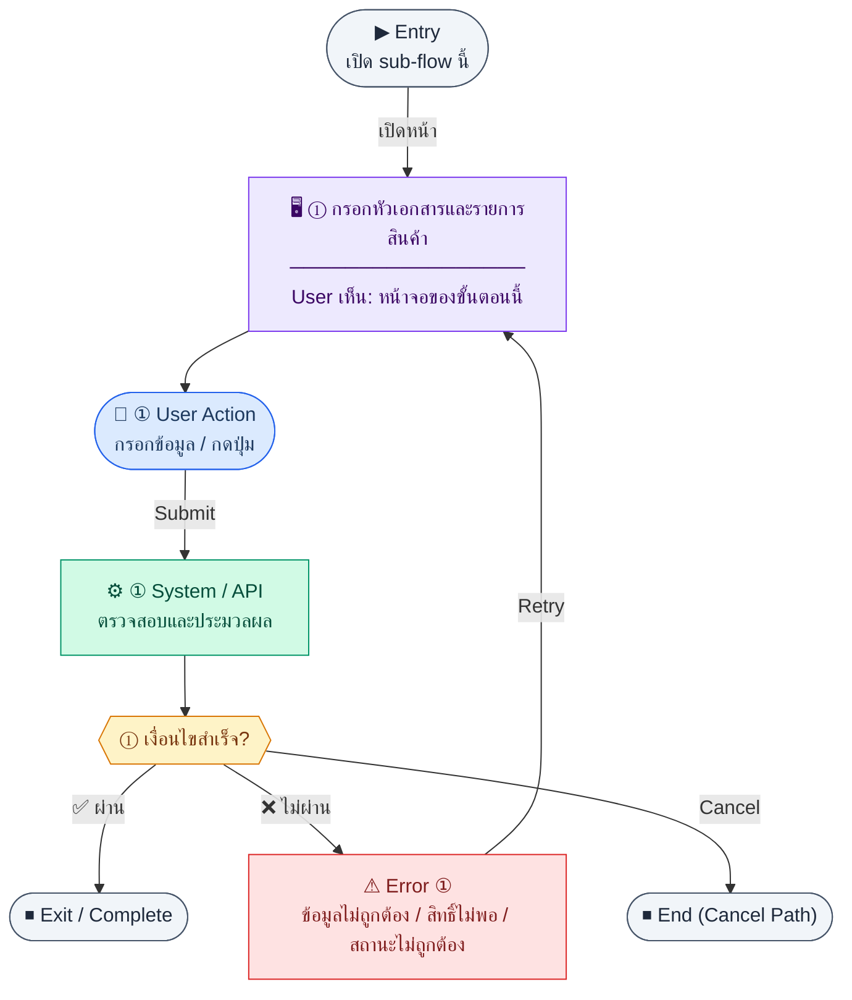
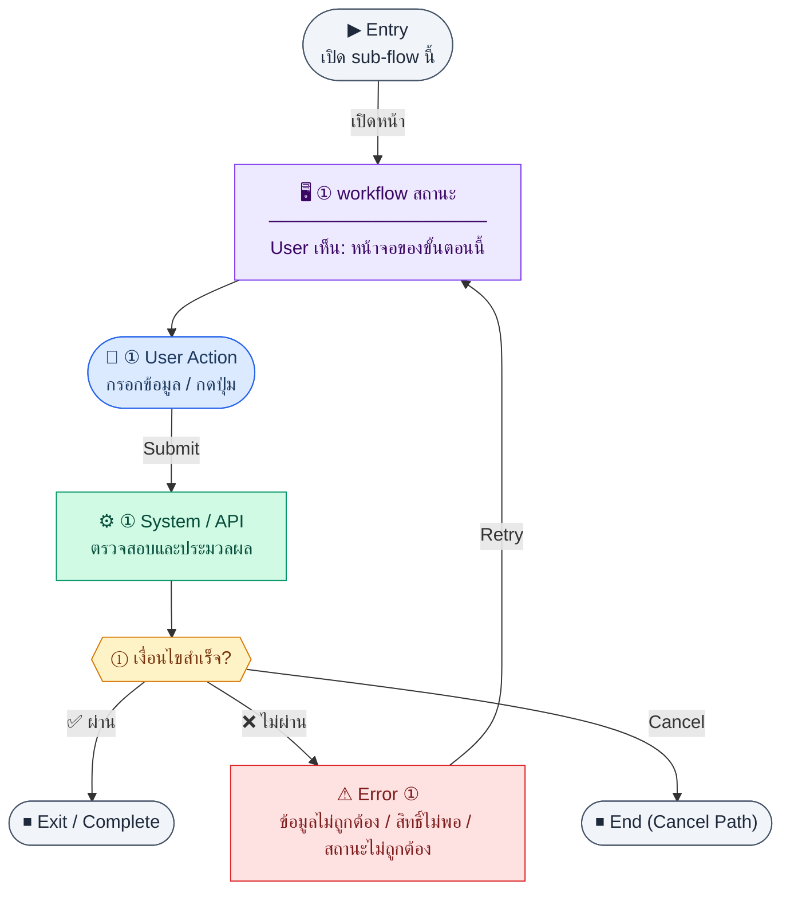
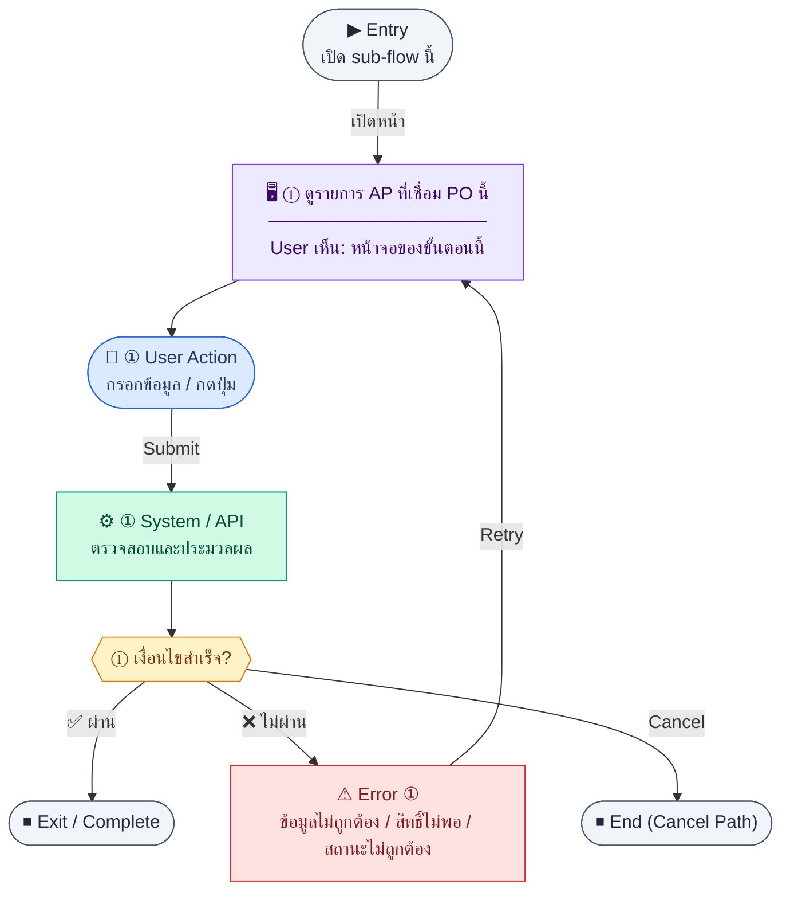
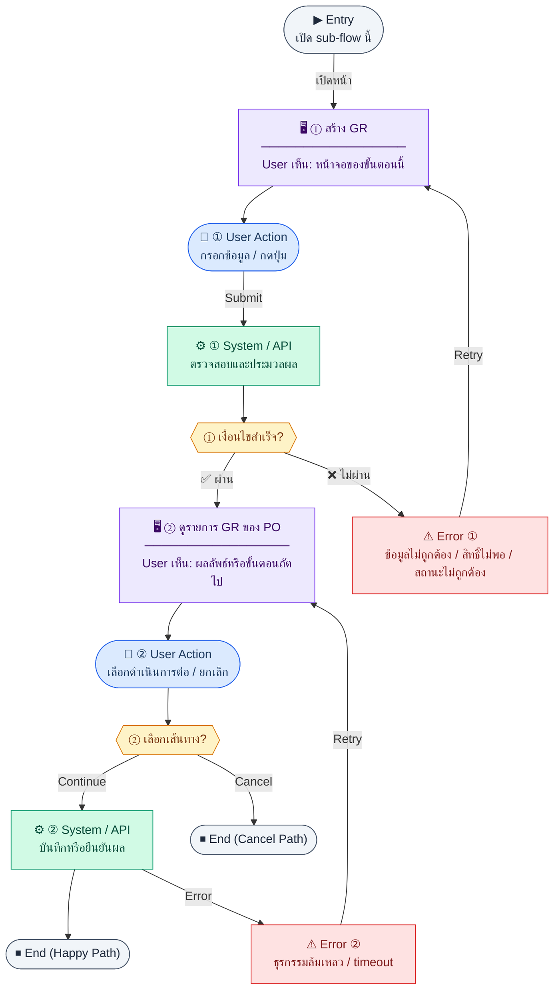
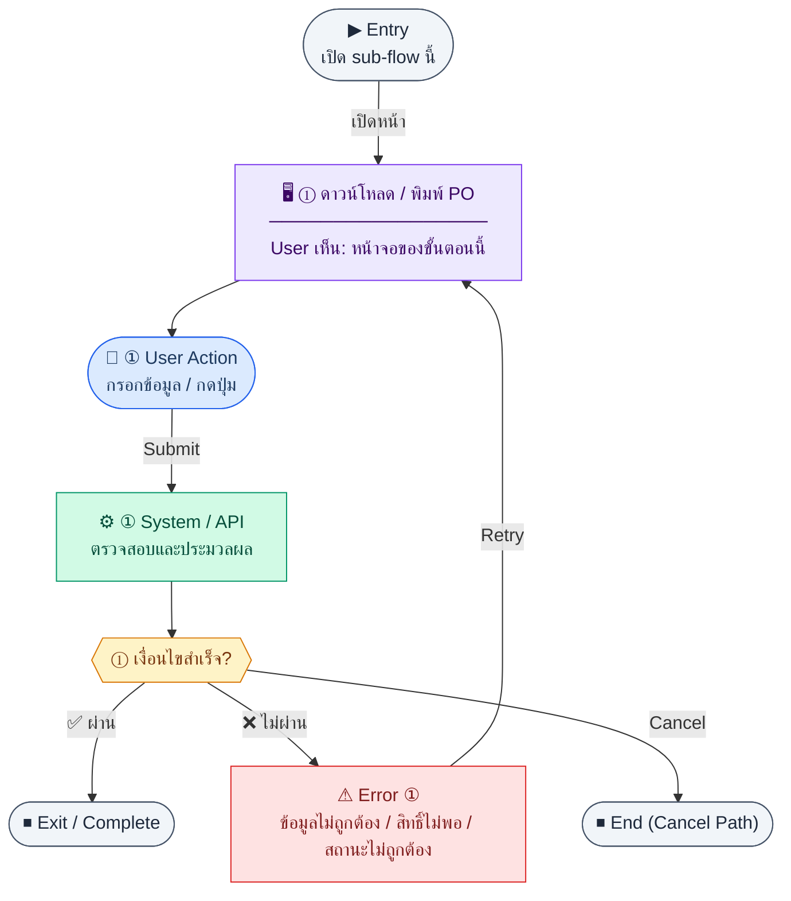

# UX Flow — ใบสั่งซื้อ (Purchase Order) และเชื่อม AP / ใบรับสินค้า

ครอบคลุม lifecycle ของ PO ตั้งแต่ **list/options → create → detail/update/status → AP bills ที่ผูก → goods receipts → PDF** โดยอ้างอิง endpoint ใน SD_Flow และความเชื่อมกับ AP ตาม BR

**แหล่งอ้างอิงที่ผูกกับเอกสารนี้**

- Business requirement (BR): `Documents/Requirements/Release_2.md` (§3.6 Purchase Order, 3-way matching)
- Traceability: `Documents/Requirements/Release_2_traceability_mermaid.md` (Feature 3.6 — Purchase Order)
- Sequence / SD_Flow: `Documents/SD_Flow/Finance/purchase_orders.md`
- AP / Vendor invoice (ลิงก์บิลกับ PO): `Documents/SD_Flow/Finance/ap.md`

---

## E2E Scenario Flow

> ผู้ใช้จัดซื้อหรือการเงินสร้างและติดตาม PO ตั้งแต่ draft ไปจน approved/received/closed ตรวจความเชื่อมกับ goods receipt, linked AP bill, PDF และ budget commitment เพื่อรองรับ 3-way matching แบบ end-to-end

### Scenario Summary

| Scenario | ขั้นตอน | ผลลัพธ์ |
|----------|---------|---------|
| ✅ ดู/ค้นหา PO | เปิด `/finance/purchase-orders` → กรองตาม status/vendor/date | เห็นรายการ PO และสถานะล่าสุด |
| ✅ สร้าง PO draft | กรอก vendor, items, expected date, budget link | ได้ PO ใหม่สถานะ `draft` |
| ✅ แก้ไข draft | เปิด detail → ปรับรายการ/หมายเหตุ | draft ถูกอัปเดตก่อน submit |
| ✅ submit/approve/cancel | เปลี่ยน status ผ่าน action ที่อนุญาต | PO เข้า workflow ถัดไปหรือถูกยกเลิก |
| ✅ รับสินค้า | จาก PO approved สร้าง goods receipt | `receivedQty` และสถานะ PO ถูกอัปเดต |
| ✅ ดู linked AP bills | เปิด detail PO | เห็นการเชื่อม AP bill และบริบท 3-way matching |
| ✅ ดาวน์โหลด PDF | กด Print PO | ได้ไฟล์ PO สำหรับส่ง vendor |
| ⚠ create/receive action ไม่ผ่าน rule | แก้ draft ไม่ถูกสถานะหรือ create GR ก่อน approve | ระบบแสดง error และ block action |

---
## ชื่อ Flow & ขอบเขต

**Flow name:** `Finance — PO, GR, Linked AP Bills, PO PDF`

**Actor(s):** `finance_manager` และผู้มีสิทธิ์จัดซื้อ (ตาม RBAC จริงของระบบ)

**Entry:** `/finance/purchase-orders`

**Exit:** PO อยู่ในสถานะที่ถูกต้องตาม workflow (อนุมัติ/รับของ/ปิด) หรือผู้ใช้ดูความสัมพันธ์กับ AP bill แล้ว

**Out of scope:** การอนุมัติงบโครงการ PM แบบละเอียด (อ้างอิงเฉพาะ `projectBudgetId` ใน BR)

---

## Sub-flow A — รายการและตัวเลือก PO

**กลุ่ม endpoint:** `GET /api/finance/purchase-orders`, `GET /api/finance/purchase-orders/options`

### Scenario Flow

### สัญลักษณ์ Node (Color Legend)

| สี | Node shape | หมายถึง |
|----|-----------|---------|
| 🟣 ม่วง | สี่เหลี่ยม `["…"]` | **Screen / UI State** |
| 🔵 น้ำเงิน | วงกลม `(["…"])` | **User Action** |
| 🟢 เขียว | สี่เหลี่ยม `["…"]` | **System / API** |
| 🟡 เหลือง | เพชร `{{"…"}}` | **Decision** |
| 🔴 แดง | สี่เหลี่ยม `["…"]` | **Error / Edge case** |
| ⚫ เทา | วงรี `(["…"])` | **Start / End** |

---

### Step A1 — เปิดรายการ PO

**Goal:** ค้นหาและเลือก PO ที่ต้องดำเนินการ

**User sees:** ตาราง `poNo`, vendor, วันที่, สถานะ, ยอดรวม

**User can do:** กรอง/ค้นหา (query ตาม BE), เปิด detail, สร้างใหม่

**User Action:**
- ประเภท: `กรอกข้อมูล / เลือกตัวเลือก`
- ช่องที่ใช้กรอง/ค้นหา:
  - `search` *(optional)* : ค้นหาจาก `poNo`
  - `vendorId` *(optional)* : ผู้ขาย
  - `status` *(optional)* : สถานะ PO
- ปุ่ม / Controls ในหน้านี้:
  - `[Apply Filters]` → โหลดรายการ PO
  - `[Create PO]` → เปิดฟอร์มสร้าง
  - `[Open PO]` → ไปหน้ารายละเอียด

**Frontend behavior:**

- `GET /api/finance/purchase-orders`

**System / AI behavior:** list `purchase_orders`

**Success:** รายการและ meta ครบ

**Error:** 401/403/5xx

**Notes:** สถานะตาม BR: draft | submitted | approved | partially_received | received | closed | cancelled

### Step A2 — ตัวเลือก PO สำหรับฟอร์มอื่น

**Goal:** เลือก PO เมื่อผูก AP bill หรืออ้างอิงใน module อื่น

**User sees:** dropdown/search

**User can do:** เลือก PO

**User Action:**
- ประเภท: `กรอกข้อมูล / เลือกตัวเลือก`
- ช่องที่ต้องกรอก:
  - `search` *(optional)* : ค้นหา PO จากเลขที่เอกสาร
- ปุ่ม / Controls ในหน้านี้:
  - `[Select PO]` → เลือก PO ลงฟอร์มปลายทาง
  - `[Retry]` → โหลด options ใหม่

**Frontend behavior:**

- `GET /api/finance/purchase-orders/options`

**System / AI behavior:** คืนรายการย่อที่ใช้งานได้

**Success:** เลือกได้และได้ `id` สำหรับขั้นตอนถัดไป

**Error:** โหลดไม่ได้

**Notes:** เชื่อม `finance_ap_bills.poId` ตาม BR — UI ฝั่ง AP ควร reuse options นี้

---

## Sub-flow B — สร้าง PO (Create)

**กลุ่ม endpoint:** `POST /api/finance/purchase-orders`

### Scenario Flow

### สัญลักษณ์ Node (Color Legend)

| สี | Node shape | หมายถึง |
|----|-----------|---------|
| 🟣 ม่วง | สี่เหลี่ยม `["…"]` | **Screen / UI State** |
| 🔵 น้ำเงิน | วงกลม `(["…"])` | **User Action** |
| 🟢 เขียว | สี่เหลี่ยม `["…"]` | **System / API** |
| 🟡 เหลือง | เพชร `{{"…"}}` | **Decision** |
| 🔴 แดง | สี่เหลี่ยม `["…"]` | **Error / Edge case** |
| ⚫ เทา | วงรี `(["…"])` | **Start / End** |

---

### Step B1 — กรอกหัวเอกสารและรายการสินค้า

**Goal:** สร้าง PO ใหม่ในสถานะ draft/submitted ตาม product

**User sees:** ฟอร์ม vendor, วันออกเอกสาร, วันส่งมอบคาด, รายการ `po_items` (qty, unit, unitPrice)

**User can do:** เพิ่ม/ลบบรรทัด, บันทึกฉบับร่าง

**User Action:**
- ประเภท: `กรอกข้อมูล / เลือกตัวเลือก`
- ช่องที่ต้องกรอก:
  - `vendorId` *(required)* : ผู้ขาย
  - `issueDate` *(required)* : วันที่เอกสาร
  - `expectedDeliveryDate` *(optional)* : วันที่คาดรับ
  - `departmentId` *(optional)* : หน่วยงานที่ผูกกับ PO (ถ้ามีตาม deployment/contract)
  - `items[]` *(required)* : บรรทัดสินค้า/บริการพร้อม `description`, `qty`, `unit`, `unitPrice`
  - `projectBudgetId` *(optional)* : งบหรือโครงการที่เกี่ยวข้อง
- ปุ่ม / Controls ในหน้านี้:
  - `[Save PO]` → เรียก `POST /api/finance/purchase-orders`
  - `[Cancel]` → ยกเลิกการสร้าง

**Frontend behavior:**

- validate รายการอย่างน้อย 1 บรรทัด, ราคา/จำนวนเป็นบวก
- `POST /api/finance/purchase-orders`

**System / AI behavior:** insert PO + items; คำนวณ subtotal/vat/total ตาม BR schema

**Success:** 201 + นำทางไป `GET .../:id`

**Error:** 400 validation; 403

**Notes:** อาจมี `projectBudgetId` ตาม BR — ส่งใน body ถ้ามีใน API

---

## Sub-flow C — รายละเอียดและแก้ไข (Detail + Update)

**กลุ่ม endpoint:** `GET /api/finance/purchase-orders/:id`, `PATCH /api/finance/purchase-orders/:id`

### Scenario Flow

### สัญลักษณ์ Node (Color Legend)

| สี | Node shape | หมายถึง |
|----|-----------|---------|
| 🟣 ม่วง | สี่เหลี่ยม `["…"]` | **Screen / UI State** |
| 🔵 น้ำเงิน | วงกลม `(["…"])` | **User Action** |
| 🟢 เขียว | สี่เหลี่ยม `["…"]` | **System / API** |
| 🟡 เหลือง | เพชร `{{"…"}}` | **Decision** |
| 🔴 แดง | สี่เหลี่ยม `["…"]` | **Error / Edge case** |
| ⚫ เทา | วงรี `(["…"])` | **Start / End** |

---

### Step C1 — ดูรายละเอียด PO

**Goal:** ตรวจสอบหัว-ท้าย เอกสารและความคืบหน้ารับของ

**User sees:** `/finance/purchase-orders/:id` รายการ, ยอดรวม, received qty ต่อบรรทัด (ถ้า BE ส่ง)

**User can do:** แก้ไข (ถ้าสถานะอนุญาต), เปลี่ยนสถานะ, เปิดแท็บ AP/GR

**User Action:**
- ประเภท: `กดปุ่ม`
- ปุ่ม / Controls ในหน้านี้:
  - `[Edit PO]` → เข้าโหมดแก้ไข
  - `[Change Status]` → เปิด workflow action
  - `[View Goods Receipts]` → ไปแท็บ GR
  - `[View AP Bills]` → ไปแท็บ AP bills

**Frontend behavior:**

- `GET /api/finance/purchase-orders/:id`

**System / AI behavior:** รวม vendor, items, status

**Success:** ข้อมูลตรงกับ list

**Error:** 404

### Step C2 — แก้ไข PO

**Goal:** แก้ไขรายการหรือหมายเหตุขณะอยู่ในสถานะที่แก้ได้

**User sees:** ฟอร์มแก้ไข

**User can do:** บันทึก

**User Action:**
- ประเภท: `กรอกข้อมูล / เลือกตัวเลือก`
- ช่องที่ต้องกรอก:
  - `expectedDeliveryDate` *(optional)* : วันที่คาดรับ
  - `notes` *(optional)* : หมายเหตุเอกสาร
  - `items[]` *(optional)* : ปรับจำนวนหรือราคาในบรรทัดที่ยังแก้ได้
- ปุ่ม / Controls ในหน้านี้:
  - `[Update PO]` → เรียก `PATCH /api/finance/purchase-orders/:id`
  - `[Cancel]` → ยกเลิก

**Frontend behavior:**

- `PATCH /api/finance/purchase-orders/:id` partial

**System / AI behavior:** ตรวจว่า approved แล้วห้ามแก้บางฟิลด์หรือไม่ (ตาม BE)

**Success:** 200

**Error:** 409 state lock

**Notes:** 3-way matching — การแก้ไขหลังมี GR/AP อาจถูกจำกัด

---

## Sub-flow D — เปลี่ยนสถานะ PO (Status)

**กลุ่ม endpoint:** `PATCH /api/finance/purchase-orders/:id/status`

### Scenario Flow

### สัญลักษณ์ Node (Color Legend)

| สี | Node shape | หมายถึง |
|----|-----------|---------|
| 🟣 ม่วง | สี่เหลี่ยม `["…"]` | **Screen / UI State** |
| 🔵 น้ำเงิน | วงกลม `(["…"])` | **User Action** |
| 🟢 เขียว | สี่เหลี่ยม `["…"]` | **System / API** |
| 🟡 เหลือง | เพชร `{{"…"}}` | **Decision** |
| 🔴 แดง | สี่เหลี่ยม `["…"]` | **Error / Edge case** |
| ⚫ เทา | วงรี `(["…"])` | **Start / End** |

---

### Step D1 — workflow สถานะ

**Goal:** ย้าย PO ไปขั้น `submitted` / `approved` / `cancelled` ตามสิทธิ์ โดย read state อย่าง `partially_received`, `received`, `closed` ให้ยึดจาก lifecycle ของระบบ

**User sees:** ปุ่มหรือ dropdown สถานะถัดไปที่อนุญาต

**User can do:** เลือกสถานะ, ยืนยัน

**User Action:**
- ประเภท: `เลือกตัวเลือก / กดปุ่ม`
- ช่องที่ต้องกรอก:
  - `status` *(required)* : submitted, approved, cancelled
  - `reason` *(optional)* : เหตุผลเมื่อ cancel
- ปุ่ม / Controls ในหน้านี้:
  - `[Update PO Status]` → เรียก status endpoint
  - `[Cancel]` → ปิด dialog

**Frontend behavior:**

- `PATCH /api/finance/purchase-orders/:id/status` body `{ "status": "<target>" }`

**System / AI behavior:** ตรวจ transition; อาจบันทึก `approvedBy`/`approvedAt` ตาม BR และปล่อยให้สถานะ `partially_received` / `received` / `closed` เป็น read state จาก workflow ภายหลัง

**Success:** สถานะใหม่แสดงทุกที่

**Error:** 409 transition ไม่ถูกต้อง

**Notes:** SD_Flow `purchase_orders.md`

---

## Sub-flow E — ใบแจ้งหนี้ / AP bills ที่ผูกกับ PO

**กลุ่ม endpoint:** `GET /api/finance/purchase-orders/:id/ap-bills`

### Scenario Flow

### สัญลักษณ์ Node (Color Legend)

| สี | Node shape | หมายถึง |
|----|-----------|---------|
| 🟣 ม่วง | สี่เหลี่ยม `["…"]` | **Screen / UI State** |
| 🔵 น้ำเงิน | วงกลม `(["…"])` | **User Action** |
| 🟢 เขียว | สี่เหลี่ยม `["…"]` | **System / API** |
| 🟡 เหลือง | เพชร `{{"…"}}` | **Decision** |
| 🔴 แดง | สี่เหลี่ยม `["…"]` | **Error / Edge case** |
| ⚫ เทา | วงรี `(["…"])` | **Start / End** |

---

### Step E1 — ดูรายการ AP ที่เชื่อม PO นี้

**Goal:** ตรวจ 3-way matching: PO → GR → AP

**User sees:** ตารางบิล AP ที่มี `poId` ชี้มาที่ PO นี้ (รหัสบิล, ยอด, สถานะ) พร้อมคอลัมน์เทียบ `PO totalAmount`, `AP amount`, และสถานะรับของ

**User can do:** คลิกไปหน้า vendor invoice ใน module AP (`Documents/SD_Flow/Finance/ap.md`)

**User Action:**
- ประเภท: `กดปุ่ม`
- ปุ่ม / Controls ในหน้านี้:
  - `[Open AP Bill]` → ไปหน้าบิล AP ที่ผูก
  - `[Create AP Bill From PO]` → deep link ไป `/finance/ap/new?poId={poId}`
  - `[Refresh Matching Status]` → โหลดข้อมูล AP/GR ใหม่

**Frontend behavior:**

- `GET /api/finance/purchase-orders/:id/ap-bills`
- เพิ่ม action `สร้าง AP Bill สำหรับ PO นี้` ในหน้า PO detail
- เมื่อกด action ให้ deep link ไป `/finance/ap/new?poId={poId}` เพื่อ prefill PO reference ในฟอร์ม AP
- ถ้า `AP amount` สูงกว่า `PO totalAmount` หรือรับของยังไม่ครบ ให้แสดง soft warning ในตารางและบน deep link summary เพื่อช่วยผู้ใช้ตรวจ 3-way matching ก่อนสร้าง/อนุมัติบิล

**System / AI behavior:** join `finance_ap_bills` ที่ `poId` = PO นี้

**Success:** เห็นความสัมพันธ์ครบสำหรับ audit

**Error:** 404 PO

**Notes:** การสร้าง/จ่าย AP ใช้ endpoint ใน `ap.md`; entry point ที่ถูกต้องของการสร้าง AP bill คือ `/finance/ap` โดย PO ส่งค่า FK (`poId`) เข้ามาช่วย prefill เท่านั้น และ PO detail ควรเป็นจุดรวม warning เรื่องยอดเกิน PO/รับของไม่ครบ

---

## Sub-flow F — ใบรับสินค้า (Goods receipts: create + list)

**กลุ่ม endpoint:** `POST /api/finance/purchase-orders/:id/goods-receipts`, `GET /api/finance/purchase-orders/:id/goods-receipts`

### Scenario Flow

### สัญลักษณ์ Node (Color Legend)

| สี | Node shape | หมายถึง |
|----|-----------|---------|
| 🟣 ม่วง | สี่เหลี่ยม `["…"]` | **Screen / UI State** |
| 🔵 น้ำเงิน | วงกลม `(["…"])` | **User Action** |
| 🟢 เขียว | สี่เหลี่ยม `["…"]` | **System / API** |
| 🟡 เหลือง | เพชร `{{"…"}}` | **Decision** |
| 🔴 แดง | สี่เหลี่ยม `["…"]` | **Error / Edge case** |
| ⚫ เทา | วงรี `(["…"])` | **Start / End** |

---

### Step F1 — สร้าง GR

**Goal:** บันทึกการรับสินค้าตามบรรทัด PO

**User sees:** ฟอร์ม `receivedDate`, `receivedBy`, รายการ `poItemId` + `receivedQty`, หมายเหตุ

**User can do:** บันทึก GR

**User Action:**
- ประเภท: `กรอกข้อมูล / เลือกตัวเลือก`
- ช่องที่ต้องกรอก:
  - `receivedDate` *(required)* : วันที่รับสินค้า
  - `receivedBy` *(required)* : ผู้รับของ (อาจ prefill เป็นผู้ใช้ปัจจุบันตาม policy)
  - `items[]` *(required)* : `poItemId` และ `receivedQty` ต่อบรรทัด
  - `notes` *(optional)* : หมายเหตุการรับของ
- ปุ่ม / Controls ในหน้านี้:
  - `[Create Goods Receipt]` → เรียก `POST /api/finance/purchase-orders/:id/goods-receipts`
  - `[Cancel]` → ยกเลิก

**Frontend behavior:**

- validate ไม่เกิน `quantity - receivedQty` ต่อบรรทัด
- `POST /api/finance/purchase-orders/:id/goods-receipts` พร้อม `receivedDate`, `receivedBy`, `notes?`, `items[]`

**System / AI behavior:** insert `goods_receipts` + `gr_items`; อัปเดต `receivedQty` บน `po_items`; อาจเปลี่ยน PO เป็น partially_received/received

**Success:** 201 + รายการ GR ใหม่

**Error:** 400 จำนวนเกิน; 409 PO ไม่ใช่สถานะที่รับได้

**Notes:** BR schema `goods_receipts` / `gr_items`

### Step F2 — ดูรายการ GR ของ PO

**Goal:** audit ประวัติการรับของหลายครั้ง

**User sees:** ตาราง `grNo`, วันที่รับ, ผู้รับ, ยอดต่อบรรทัด

**User can do:** ขยายดูรายการย่อย

**User Action:**
- ประเภท: `กดปุ่ม`
- ปุ่ม / Controls ในหน้านี้:
  - `[Expand GR Detail]` → ดูรายการรับของย่อย
  - `[Back to PO]` → กลับ header PO

**Frontend behavior:**

- `GET /api/finance/purchase-orders/:id/goods-receipts`

**System / AI behavior:** list GR ที่ `poId` ตรงกัน

**Success:** ผลรวม received ตรงกับสถานะ PO

**Error:** 5xx

**Notes:** list receipts = endpoint GET ด้านบน

---

## Sub-flow G — PDF ใบสั่งซื้อ

**กลุ่ม endpoint:** `GET /api/finance/purchase-orders/:id/pdf`

### Scenario Flow

### สัญลักษณ์ Node (Color Legend)

| สี | Node shape | หมายถึง |
|----|-----------|---------|
| 🟣 ม่วง | สี่เหลี่ยม `["…"]` | **Screen / UI State** |
| 🔵 น้ำเงิน | วงกลม `(["…"])` | **User Action** |
| 🟢 เขียว | สี่เหลี่ยม `["…"]` | **System / API** |
| 🟡 เหลือง | เพชร `{{"…"}}` | **Decision** |
| 🔴 แดง | สี่เหลี่ยม `["…"]` | **Error / Edge case** |
| ⚫ เทา | วงรี `(["…"])` | **Start / End** |

---

### Step G1 — ดาวน์โหลด / พิมพ์ PO

**Goal:** ได้เอกสาร PDF ส่ง vendor

**User sees:** ปุ่ม “ดาวน์โหลด PDF” บน detail

**User can do:** กดดาวน์โหลด

**User Action:**
- ประเภท: `กดปุ่ม`
- ปุ่ม / Controls ในหน้านี้:
  - `[Download PO PDF]` → เรียก `GET /api/finance/purchase-orders/:id/pdf`
  - `[Print PO]` → เปิด browser print จากไฟล์ PDF

**Frontend behavior:**

- `GET /api/finance/purchase-orders/:id/pdf` พร้อม Authorization
- จัดการ response เป็นไฟล์ PDF

**System / AI behavior:** render จาก PO + vendor + company settings

**Success:** ไฟล์ PDF 200

**Error:** 404; 403

**Notes:** ซ้ำกับรายการใน `Documents/SD_Flow/Finance/document_exports.md` สำหรับ PO PDF

## Coverage Checklist

| Endpoint | Covered in UX file | Notes |
| --- | --- | --- |
| `GET /api/finance/purchase-orders` | Sub-flow A — รายการและตัวเลือก PO | Step A1. |
| `GET /api/finance/purchase-orders/options` | Sub-flow A — รายการและตัวเลือก PO | Step A2; AP bill `poId` reuse. |
| `POST /api/finance/purchase-orders` | Sub-flow B — สร้าง PO (Create) | Step B1. |
| `GET /api/finance/purchase-orders/:id` | Sub-flow C — รายละเอียดและแก้ไข (Detail + Update) | Step C1. |
| `PATCH /api/finance/purchase-orders/:id` | Sub-flow C — รายละเอียดและแก้ไข (Detail + Update) | Step C2; state locks. |
| `PATCH /api/finance/purchase-orders/:id/status` | Sub-flow D — เปลี่ยนสถานะ PO (Status) | Step D1. |
| `GET /api/finance/purchase-orders/:id/ap-bills` | Sub-flow E — ใบแจ้งหนี้ / AP bills ที่ผูกกับ PO | Step E1; 3-way matching view (`ap.md`). |
| `POST /api/finance/purchase-orders/:id/goods-receipts` | Sub-flow F — ใบรับสินค้า (Goods receipts: create + list) | Step F1. |
| `GET /api/finance/purchase-orders/:id/goods-receipts` | Sub-flow F — ใบรับสินค้า (Goods receipts: create + list) | Step F2. |
| `GET /api/finance/purchase-orders/:id/pdf` | Sub-flow G — PDF ใบสั่งซื้อ | Step G1; `document_exports.md`. |

## Coverage Lock Notes (2026-04-16)

### In-scope endpoints
- `GET /api/finance/purchase-orders`
- `GET /api/finance/purchase-orders/options`
- `POST /api/finance/purchase-orders`
- `GET /api/finance/purchase-orders/:id`
- `PATCH /api/finance/purchase-orders/:id`
- `PATCH /api/finance/purchase-orders/:id/status`
- `GET /api/finance/purchase-orders/:id/ap-bills`
- `POST /api/finance/purchase-orders/:id/goods-receipts`
- `GET /api/finance/purchase-orders/:id/goods-receipts`
- `GET /api/finance/purchase-orders/:id/pdf`

### Source endpoints / dependencies
- vendor reference ต้องมาจาก vendor options/list contract
- budget impact ต้องอ่านจาก BE `budgetImpact` หรือ refreshed budget summary

### UX lock
- 3-way matching / AP linkage ต้องยึด payload จริงจาก SD_Flow ไม่คาดเดา mapping เอง
